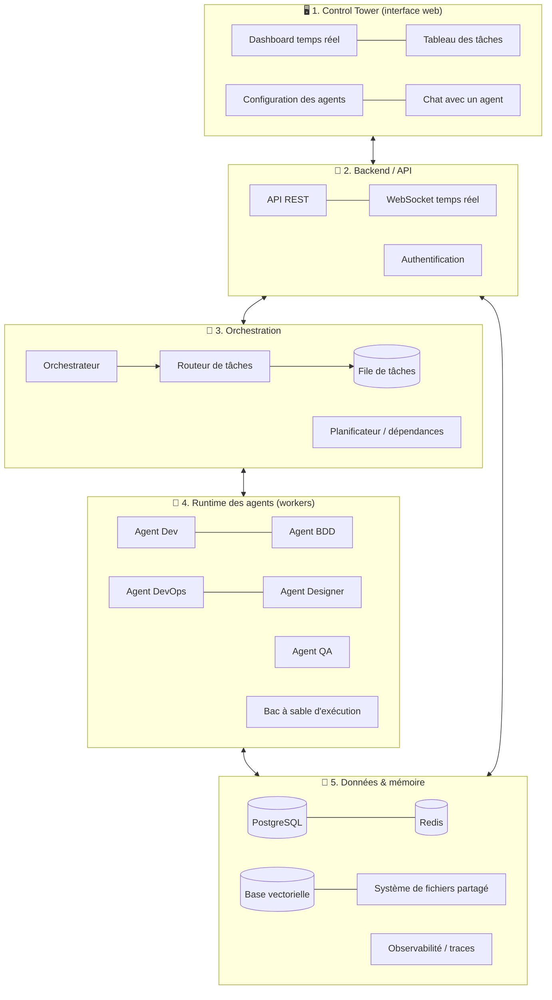
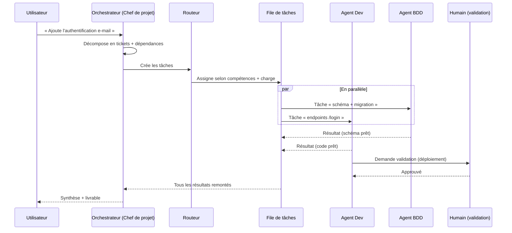
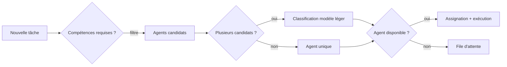
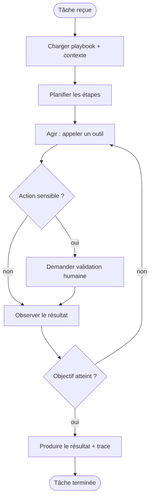
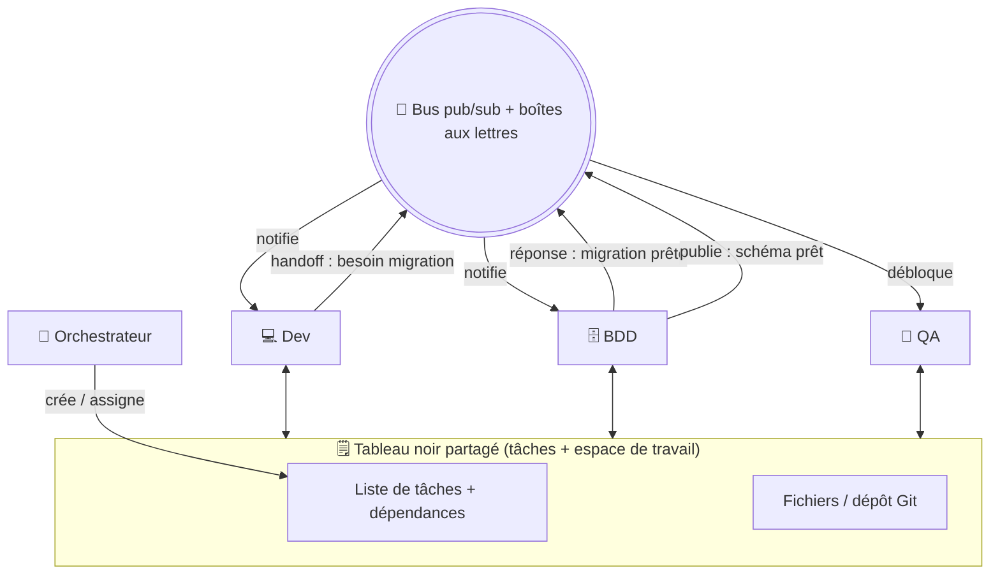

# Architecture technique — Maestro

**Version :** 0.1
**Public visé :** vulgarisé pour un chef de projet, avec les détails utiles pour l'équipe technique.

---

## 1. Vue d'ensemble

Maestro s'organise en **cinq couches** :

| Couche | Rôle | « En clair » |
|--------|------|--------------|
| Control Tower | Interface web | Le poste de pilotage |
| Backend / API | Logique applicative + temps réel | Le standard téléphonique |
| Orchestration | Décomposition, routage, planification | Le chef d'orchestre et son pupitre |
| Runtime des agents | Exécution autonome des tâches | Les musiciens |
| Données & mémoire | Stockage, contexte, traces | La partition et les archives |

---

## 2. Le cœur : le pattern *orchestrateur–workers*

Maestro s'appuie sur le pattern recommandé par Anthropic : un **agent orchestrateur** (le « lead ») décompose dynamiquement un objectif en sous-tâches, les délègue à des **agents workers** spécialisés, puis **synthétise** leurs résultats. C'est plus flexible que de pré-définir les sous-tâches : c'est l'orchestrateur qui décide, selon l'entrée.

> **Principe clé d'Anthropic :** bien déléguer. Chaque sous-tâche transmise à un worker doit contenir **un objectif, un format de sortie attendu, les outils/sources à utiliser et des limites claires**. Sans cela, les agents dupliquent le travail ou laissent des trous.

---

## 3. Les composants en détail

### 3.1 Orchestrateur (Conductor)

Le « cerveau » de routage. Responsabilités :

- **Décomposition** : transformer un objectif en tâches structurées (titre, description, compétences requises, format de sortie, critères de validation).
- **Planification** : établir le graphe de dépendances entre tâches.
- **Synthèse** : agréger les résultats des workers en un livrable cohérent.

Implémenté comme un agent doté d'un modèle puissant (ex. Claude *Opus* par défaut au POC) avec un prompt système dédié. Le **fournisseur est configurable** via la couche d'abstraction (voir [stack §2](./02-stack-technique.md)).

### 3.2 Routeur de tâches (auto-assignation)

Décide **quel agent** reçoit **quelle tâche**. Deux signaux combinés :

1. **Correspondance de capacités** — chaque agent déclare des tags/compétences (`backend`, `sql`, `ci-cd`, `ui`…) ; on filtre les agents éligibles.
2. **Classification par modèle léger** — un appel à un modèle rapide (ex. *Haiku*) tranche entre les candidats et gère les cas ambigus.
3. **Charge & disponibilité** — on privilégie un agent libre ; sinon la tâche attend dans la file.

### 3.3 File de tâches & parallélisme

Une **file de tâches** (queue) découple la création des tâches de leur exécution. Des **workers** consomment la file : plusieurs workers ⇒ plusieurs agents en parallèle. La file gère aussi les **relances** en cas d'échec et la **durabilité** (aucune tâche perdue si un worker tombe).

Le **planificateur** ne libère une tâche dans la file que lorsque toutes ses dépendances sont terminées (exécution parallèle des tâches indépendantes, séquentielle des tâches liées).

> Le parallélisme ne suffit pas : pendant qu'ils travaillent en même temps, les agents doivent aussi **communiquer** entre eux. C'est l'objet de la [section 4](#4-communication-inter-agents).

### 3.4 Runtime d'un agent

Chaque agent s'exécute derrière une **couche d'abstraction fournisseur** : il déclare un `fournisseur + modèle`, et la couche route vers le runtime adéquat. Au POC, ce runtime est le **Claude Agent SDK** (agents Claude) ; d'autres fournisseurs (OpenAI, Google, modèles ouverts/locaux) s'ajoutent par configuration, sans refonte. Chaque agent est configuré avec :

- un **fournisseur + modèle** (Claude par défaut au POC ; configurable — voir [stack §2](./02-stack-technique.md)) ;
- un **prompt système** (rôle, ton, contraintes) ;
- un **playbook** (workflow d'étapes, voir [doc 04](./04-specifications-agents.md)) injecté au démarrage de chaque tâche ;
- un **jeu d'outils** (fichiers, exécution de code, serveurs **MCP**) ;
- une **mémoire** (court terme = contexte de la tâche ; long terme = base vectorielle).

Boucle d'exécution autonome d'un agent :

### 3.5 Bac à sable d'exécution

Les agents écrivent et exécutent du code → chaque exécution se fait dans un **conteneur isolé** (ou micro-VM), avec :

- un système de fichiers de travail dédié — aujourd'hui un **répertoire temporaire jetable**, créé vide et détruit en fin de tâche (`maestro.sandbox.workspace`). La « **branche Git** par tâche » reste un principe **non implémenté** : elle n'a de sens que le jour où une tâche travaille dans un vrai projet, ce que cadre [docs/24 §2.4](./24-projets-locaux-et-poste-de-travail.md) ;
- des permissions **scopées** (accès réseau/secret limité à ce dont l'agent a besoin) ;
- des **plafonds** de temps et de dépense.

### 3.6 Couche temps réel

L'UI reflète l'état en direct via **WebSocket** (ou Server-Sent Events) alimenté par un **pub/sub** : chaque changement d'état (tâche assignée, étape franchie, validation requise) émet un événement consommé par le dashboard.

### 3.7 Observabilité

Chaque exécution est **tracée** (étapes, outils appelés, tokens, coût, durée, erreurs) via une plateforme d'observabilité LLM (**Langfuse**, auto-hébergeable). Indispensable pour déboguer, mesurer les coûts et évaluer la qualité.

---

## 4. Communication inter-agents

Des agents qui travaillent **en parallèle** doivent aussi **échanger** : se passer le relais, se poser des questions, se notifier qu'un livrable est prêt. Sans communication, ils se dupliquent ou s'attendent inutilement. Maestro combine **trois canaux** complémentaires.

### 4.1 Trois canaux de communication

**1. Le tableau noir partagé (état partagé) — canal principal.**
La file/le store de tâches et l'espace de travail (fichiers, dépôt Git) jouent le rôle de *blackboard* : chaque agent y **lit et écrit** l'état. Quand une tâche est marquée terminée, ses tâches dépendantes se **débloquent automatiquement**. C'est **asynchrone, traçable et sans couplage direct** entre agents. (C'est le pattern « shared task list » éprouvé par les *agent teams*.)

**2. La messagerie directe (mailbox + pub/sub) — canal point à point.**
Chaque agent dispose d'une **boîte aux lettres** ; un **bus pub/sub** (Redis) achemine les messages. Un agent peut alors envoyer un message ciblé à un autre — poser une question, passer un relais, demander un travail, diffuser une notification — **sans repasser par l'orchestrateur**. C'est ce qui permet un travail réellement collaboratif.

**3. Le protocole A2A (Agent-to-Agent) — la « langue » standard.**
Les échanges sont structurés selon le protocole **A2A** (introduit par Google, bâti sur HTTP / JSON-RPC / SSE) : une **Agent Card** décrit les capacités et le point d'accès de chaque agent, un objet **Task** porte une unité de travail avec son cycle de vie, un objet **Message** transporte l'échange. A2A est **complémentaire de MCP** :

> 🔑 **MCP relie les agents aux _outils_. A2A relie les agents _entre eux_.**

### 4.2 Modes de coordination

- **Délégation latérale (handoff)** — un agent crée une demande/sous-tâche pour un autre (ex. le Développeur demande une migration à l'agent BDD) puis continue ou attend le résultat.
- **Requête–réponse** — un agent interroge un pair et attend sa réponse (ex. le Développeur demande au Designer la spec d'un écran).
- **Notification / diffusion (pub-sub)** — un agent publie un événement (« schéma BDD prêt ») ; les abonnés le consomment et se débloquent.
- **Auto-déblocage par dépendances** — à l'achèvement d'une tâche, ses dépendantes passent à l'état « prête » sans intervention humaine.

### 4.3 Garde-fous propres à la communication

- **Anti-boucle** — plafond de tours d'échange et détection de cycles pour éviter les conversations infinies.
- **Maîtrise des coûts** — privilégier l'**état partagé** et des messages **ciblés** plutôt qu'un mode « tout le monde parle à tout le monde » : chaque tour de conversation = un appel modèle, donc un coût. On évite les débats permanents.
- **Traçabilité** — chaque message inter-agent est journalisé et visible dans l'observabilité et dans l'UI.
- **Arbitrage** — l'orchestrateur conserve la vue d'ensemble et tranche les conflits (ex. deux agents qui veulent modifier la même ressource).

---

## 5. Modèle d'autonomie et de contrôle

L'autonomie n'est pas l'absence de contrôle. Trois niveaux de garde-fous :

1. **Permissions par agent** — chaque agent ne peut faire que ce que son rôle autorise.
2. **Human-in-the-loop** — les actions classées sensibles (déploiement, migration destructive, dépense, suppression) se mettent en pause et attendent une validation explicite dans l'UI.
3. **Limites globales** — plafonds de dépense, liste d'actions interdites, time-outs.

---

## 6. Évolution sans redéploiement

Les **playbooks** et configurations d'agents sont stockés hors du code et **versionnés** (au POC : sur fichiers, `core/playbooks/` — en base à la V1, sans changer le contrat). Modifier le workflow d'un agent depuis l'UI met à jour le stockage ; l'agent recharge sa configuration au démarrage de la tâche suivante — **sans redéploiement** (réalisé : tickets #76 à #78, la version utilisée étant tracée sur chaque exécution). Le **catalogue d'agents** lui-même est dynamique (EF-03, réalisé : tickets #70/#72/#73) : un agent personnalisé — nom, rôle, compétences, playbook, fournisseur/modèle — se crée depuis l'UI ou l'API, se persiste hors du code (`core/agents/`) et devient routable et exécutable sans redéploiement. Cela répond à l'exigence « workflow qui évolue selon le besoin ».

---

## 7. Choix d'architecture structurants (résumé)

| Décision | Choix retenu | Pourquoi |
|----------|--------------|----------|
| Fournisseur de modèle | Couche d'abstraction (choix `fournisseur + modèle` par agent) ; Claude câblé au POC | Agnosticisme, pas de lock-in (O7 / ENF-11) |
| Pattern d'orchestration | Orchestrateur-workers (natif Agent SDK, runtime Claude) au départ | Recommandé par Anthropic ; simple, flexible, composable |
| Parallélisme | File de tâches + workers | Découple création/exécution, relances, montée en charge |
| Communication inter-agents | Tableau noir partagé + mailbox pub/sub + protocole A2A | Coordination sans couplage, handoff direct, standard interopérable |
| Durabilité des exécutions | Workflows durables (ex. Temporal) | Reprise sur panne, tâches longues, pas de perte de travail |
| Temps réel | WebSocket + pub/sub | Latence faible pour la supervision |
| Isolation | Conteneur/micro-VM + branche Git par tâche | Sécurité et anti-collision |
| Évolutivité des workflows | Playbooks versionnés en base | Changement à chaud, traçabilité |

Le détail des outils (langages, frameworks, bases) est dans la [doc 02 — Stack technique](./02-stack-technique.md).
