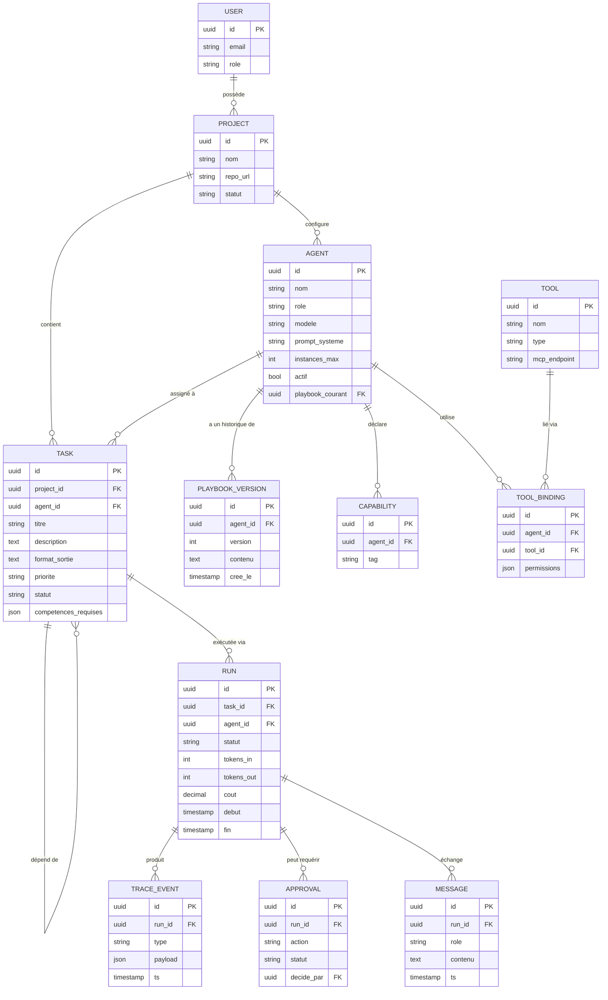
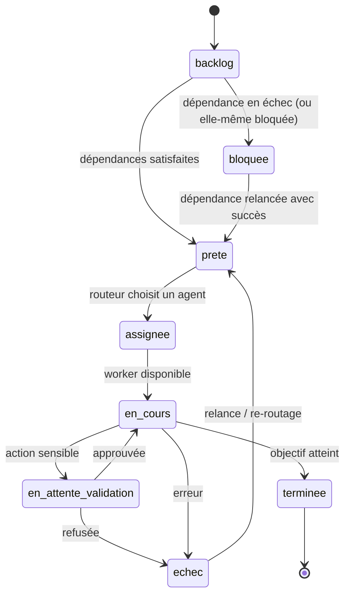

# Modèle de données — Maestro

**Version :** 0.1
Ce document décrit les **entités principales** et leurs relations. Il sert de base au schéma PostgreSQL.

---

## 1. Diagramme entité-relation (simplifié)

---

## 2. Description des entités

### USER
Les humains qui utilisent la plateforme. `role` : `owner`, `admin`, `viewer`.

### PROJECT
Un projet de travail (souvent rattaché à un dépôt de code). Regroupe des tâches et la configuration des agents qui y interviennent.

### AGENT
Un agent spécialisé. Champs clés :
- `role` : `chef_de_projet`, `developpeur`, `bdd`, `devops`, `designer`, `qa`, ou personnalisé.
- `modele` : le modèle utilisé (ex. *Opus*, *Sonnet*, *Haiku*).
- `prompt_systeme` : l'identité et les contraintes de l'agent.
- `instances_max` : nombre d'instances parallèles autorisées (contrôle de capacité).
- `actif` : activé/désactivé.
- `playbook_courant` : la version de playbook en vigueur.

### CAPABILITY
Les **compétences** déclarées par un agent (tags : `backend`, `sql`, `ci-cd`, `ui`, `tests`…). Base de l'**auto-assignation**.

### PLAYBOOK_VERSION
L'**historique versionné** du workflow d'un agent. Permet de modifier les instructions et de revenir en arrière (exigence EF-25). `contenu` = le playbook (Markdown structuré, voir [doc 04](./04-specifications-agents.md)).

### TASK
Un ticket de travail. Champs notables :
- `format_sortie` : ce que l'agent doit produire (essentiel pour une bonne délégation).
- `competences_requises` : sert au routage.
- `statut` : `backlog`, `prete`, `assignee`, `en_cours`, `en_attente_validation`, `terminee`, `echec`, `bloquee` (dépendance en échec — la tâche n'est jamais mise en file ni exécutée).
- Auto-relation `TASK → TASK` : graphe de **dépendances**.

### RUN
Une **exécution** concrète d'une tâche par un agent. Trace les tokens, le **coût**, la durée, le statut. Une tâche peut avoir plusieurs runs (relances).

### TRACE_EVENT
Les **événements détaillés** d'un run (appel d'outil, étape de raisonnement, erreur…). Alimente l'observabilité et l'UI. Synchronisé avec Langfuse.

### APPROVAL
Une **demande de validation humaine** (human-in-the-loop) sur une action sensible. `statut` : `en_attente`, `approuve`, `refuse`.

### TOOL & TOOL_BINDING
Les **outils** disponibles (souvent des serveurs MCP) et leur **liaison** à un agent avec des **permissions** scopées.

### MESSAGE
Les messages échangés dans un run, y compris les conversations utilisateur ↔ agent (fonction « chat » de l'UI).

### AGENT_MESSAGE
Les **messages inter-agents** (la « boîte aux lettres » / mailbox). Champs : `from_agent`, `to_agent` (`null` si diffusion/broadcast), `type` (`handoff`, `requete`, `reponse`, `notification`), `task_id` (contexte), `payload`, `statut` (`envoye`, `lu`, `traite`). Support de la messagerie directe et du protocole A2A (EF-31 à EF-34). Omis du diagramme ER ci-dessus pour la lisibilité, comme `MEMORY_CHUNK`.

---

## 3. Cycle de vie d'une tâche (machine à états)

---

## 4. Notes d'implémentation

- **Clés** : UUID partout (facilite la distribution et les API).
- **Horodatage** : `cree_le` / `modifie_le` sur toutes les tables principales.
- **Index** : sur `task.statut`, `task.agent_id`, `run.task_id`, `capability.tag`, `agent_message.to_agent` + `statut` (relève des boîtes aux lettres).
- **Mémoire vectorielle** : table dédiée `MEMORY_CHUNK` (id, agent_id/project_id, contenu, embedding `vector`) via **pgvector**, omise du schéma ci-dessus pour la lisibilité.
- **Soft-delete** : préférer un champ `archive_le` à la suppression physique pour les agents et projets (traçabilité).
