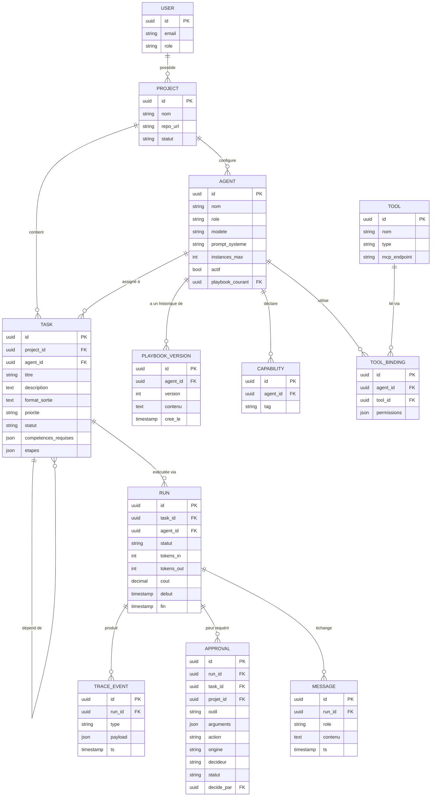
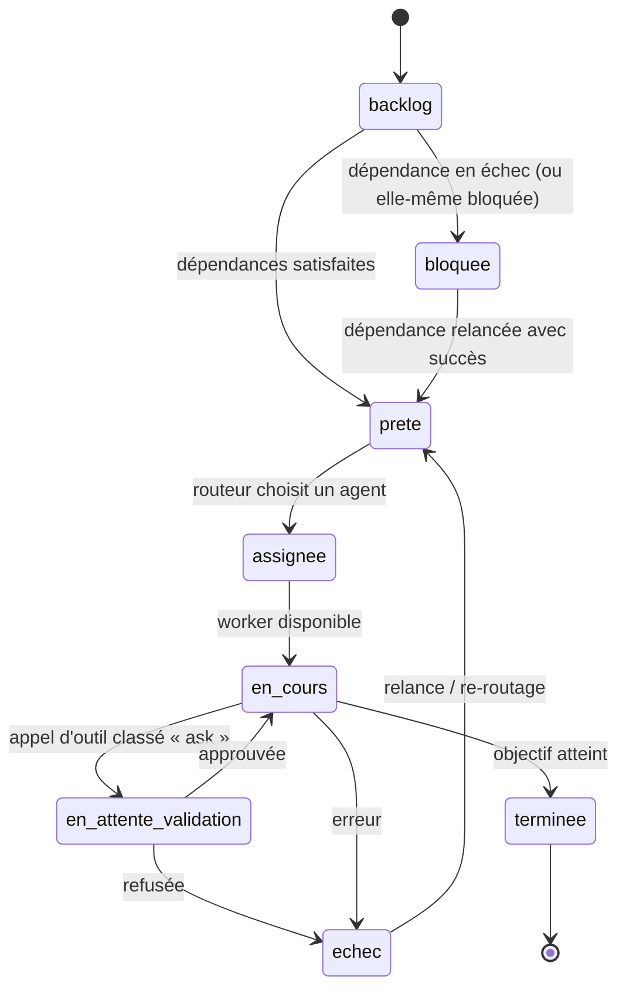

# Modèle de données — Maestro

**Version :** 0.1
Ce document décrit les **entités principales** et leurs relations. Il sert de base au schéma PostgreSQL.

---

## 1. Diagramme entité-relation (simplifié)

---

## 2. Description des entités

### USER
Les humains qui utilisent la plateforme. `role` : `owner`, `admin`, `viewer`.

### PROJECT
Un projet de travail (souvent rattaché à un dépôt de code). Regroupe des tâches et la configuration des agents qui y interviennent.

> **Implémenté** (#221, `maestro.projets` — dépôt `core/projets/`, un fichier `<id>.json` par
> projet) : l'entité porte les champs qui la relient au disque, cadrés par
> [docs/24 §2.3](./24-projets-locaux-et-poste-de-travail.md) — `racine` (chemin absolu — la
> **frontière unique** de ce que les agents peuvent lire et écrire, **canonicalisée** et refusée
> avec son motif si elle tombe sur une racine interdite, EF-38), `origine`
> (`nouveau`/`existant`), `vcs` (`type`, `branche_base`, `distant` — **détecté** à la
> déclaration, `null` si non versionné : un projet non versionné reste déclarable) et
> `perimetre` (`inclus`/`exclus`, ce dernier portant par défaut `.git`, `node_modules`, `.env`,
> `**/secrets/**`). La forme servie par l'API est **celle du fichier stocké**, sans seconde
> définition du contrat.
>
> Le reste de la Phase 7 s'appuie dessus et est livré : le **`projet_id` porté par `TASK` et
> `RUN`** (#222, voir ces deux entités), l'**API** `/api/projets` et son explorateur de dossiers
> (#223, [docs/05 §2.7](./05-interface-control-tower.md)), l'**espace de travail dérivé** — worktree
> Git par tâche si le projet est versionné, copie du périmètre sinon (#224, EF-36), l'**écran
> Projets** (#225), le **second montage** en mode isolé (#226,
> [docs/17 §3](./17-isolation-execution.md)) et l'**application des livrables sous validation
> humaine** (#227, EF-37). Les agents ne travaillent **jamais** directement dans la racine.
> *(Retenu — décisions D1/D2 de
> [docs/24 §8](./24-projets-locaux-et-poste-de-travail.md), rendues le 2026-08-04 ; **Phase 7**.)*

### SOURCE *(retenue — [docs/24 §3.2](./24-projets-locaux-et-poste-de-travail.md), **Phase 8**)*
Une **matière d'entrée** attachée à une exécution, à côté de l'objectif texte : `type`
(`fichier`, `dossier`, `url`, `texte`), `nom`/`chemin`/`valeur`, `taille`, et le **texte
extrait** (tout est ramené à du Markdown avant d'entrer dans le contexte — un seul format à
tracer, à masquer et à chiffrer en tokens). Une source de type `dossier` est **en lecture
seule** : c'est une référence, pas un projet.

### AGENT
Un agent spécialisé. Champs clés :
- `role` : `chef_de_projet`, `developpeur`, `bdd`, `devops`, `designer`, `qa`, ou personnalisé.
- `modele` : le modèle utilisé (ex. *Opus*, *Sonnet*, *Haiku*).
- `prompt_systeme` : l'identité et les contraintes de l'agent.
- `instances_max` : nombre d'instances parallèles autorisées (contrôle de capacité).
- `actif` : activé/désactivé.
- `playbook_courant` : la version de playbook en vigueur.

### CAPABILITY
Les **compétences** déclarées par un agent (tags : `backend`, `sql`, `ci-cd`, `ui`, `tests`…). Base de l'**auto-assignation**.

### PLAYBOOK_VERSION
L'**historique versionné** du workflow d'un agent. Permet de modifier les instructions et de revenir en arrière (exigence EF-25). `contenu` = le playbook (Markdown structuré, voir [doc 04](./04-specifications-agents.md)).

### TASK
Un ticket de travail. Champs notables :
- `format_sortie` : ce que l'agent doit produire (essentiel pour une bonne délégation).
- `competences_requises` : sert au routage.
- `statut` : `backlog`, `prete`, `assignee`, `en_cours`, `en_attente_validation`, `terminee`, `echec`, `bloquee` (dépendance en échec — la tâche n'est jamais mise en file ni exécutée).
- Auto-relation `TASK → TASK` : graphe de **dépendances**. Il vivait dans le seul moteur jusqu'à #490 ; il en sort désormais avec le plan, publié une fois à la décomposition, et se lit par `GET /api/executions/{run_id}/graphe` ([docs/05 §6.11](./05-interface-control-tower.md)) — nœuds, arêtes, niveaux. Deux tâches sans dépendance entre elles y tombent au **même** niveau : le rang d'un nœud est le *plus long chemin* qui y mène, et non son rang dans un tri topologique quelconque.
- `etapes` : l'**ossature de la checklist** de la tâche (#489) — les libellés des étapes prévues, dans l'ordre, **sans aucun avancement**. Le plan dit *ce qu'il y a à faire*, jamais *où l'on en est* : l'état de chaque ligne se coche en cours d'exécution et n'existe pas au moment où le plan est écrit. Optionnelle et vide dans le cas courant ; qui la pose et qui la coche est tranché juste dessous.
- `projet_id` : le **projet** auquel la tâche appartient (#222) — **optionnel**, `null` valant « aucun projet » (le comportement d'avant la Phase 7 : une tâche sans projet reste une tâche). Posé au lancement d'un run et hérité par chaque tâche du plan, sauf celle qui en porte déjà un ; il traverse le journal (#8) et les événements (#46) jusqu'aux vues, que le Kanban, les coûts et le journal savent alors filtrer (`?projet=<id>`). Un travail sans `projet_id` n'apparaît dans **aucune** vue filtrée — on ne devine pas son appartenance.

#### Qui pose la checklist d'une tâche (#489) — **tranché**

La question était ouverte depuis #246 : les étapes étaient **définies** (`EtapeTache`), le
journal les **transportait**, l'événement `tache.detail` les **diffusait**, le panneau de
détail les **affichait** — et `consigne_detail` n'était appelé par personne. Un contrat
entièrement plombé et entièrement vide, faute d'avoir dit **qui remplit**. Trois réponses
étaient possibles, et l'arbitrage n'est pas cosmétique : il décide de ce qu'une tâche
donne à lire, et à quel moment.

| Qui pose | Ce que ça donne | Pourquoi ça ne suffit pas |
| --- | --- | --- |
| **L'orchestrateur seul** | Un dénominateur stable, connu d'avance | **Personne ne coche** : la checklist reste figée à « à faire » du début à la fin — le contrat vide, sous une autre forme |
| **L'agent seul** | Une checklist **juste**, parce qu'il découvre en travaillant | Une tâche qui n'a pas démarré n'a **rien** à montrer, et c'est la déclaration préalable qui rend une vue lisible : GitHub Actions déclare ses `steps`, n8n ses nœuds |
| **Les deux — retenu** | Le plan dit la **forme** du travail, l'agent son **avancement** | — |

**La décision est donc : ossature au plan, complétée et cochée par l'agent.** Chacun
répond de ce qu'il sait, et aucun des deux ne répond de ce qu'il ignore. Le plan porte
`etapes` (libellés seuls) ; l'agent rapporte sa liste **là où il la tient déjà** —
l'entrée de ses appels `TodoWrite`, lue par `maestro/providers/checklist.py` : aucun
protocole n'a été inventé, aucun second transport ouvert, et un fournisseur sans
checklist observable n'appelle simplement jamais le canal.

La couture des deux (`maestro.detail_tache.SuiviChecklist`) porte quatre règles, et
chacune a son motif :

- **Le premier relevé de l'agent supplante l'ossature**, au lieu de s'y apparier par
  libellé. Apparier serait un pari sur la formulation du modèle — « Écrire la migration »
  contre « Rédiger la migration SQL » —, et un pari perdu **double** la checklist
  d'étapes qui ne se cocheront jamais : pire que les deux options pures. Supplanter est
  déterministe, et gratuit — au premier relevé, l'ossature est tout entière « à faire »,
  donc rien d'acquis n'est perdu.
- **Rien ne recule.** Un état ne redescend jamais, et une étape connue qu'un relevé
  oublie garde sa place et son état plutôt que de disparaître. Le suivi vit à l'échelle de
  l'**exécution** et non de la tentative : le remettre à neuf à chaque relance ferait
  reculer l'avancement à l'instant précis où l'on veut savoir ce qui était déjà acquis.
- **Le dénominateur, lui, peut grandir** — un agent découvre en travaillant. C'est le prix
  d'une checklist juste, et il est payé **à l'écran** plutôt que masqué ici : la jauge est
  une **case par étape** et non un pourcentage, si bien que ce qui est acquis reste
  allumé et que la rangée s'allonge ([docs/05 §2.2](./05-interface-control-tower.md)).
  Brider ce que l'agent a le droit de découvrir aurait rendu la checklist fausse pour
  protéger une jauge.
- **Rien n'est republié pour rien.** Un agent rappelle volontiers sa liste à l'identique ;
  une checklist inchangée ne produit ni ligne de journal, ni événement de bus.

⚠ **Ce qui existait avant reste vrai** : une tâche sans ossature, un fournisseur sans
checklist, un rôle dont la politique de permissions refuse l'outil, un repli texte — aucun
ne produit de checklist vide ni de bloc qui promette un contenu absent (règle de #246).

Le motif complet vit en tête de [`maestro/detail_tache.py`](../maestro/detail_tache.py) et
de [`maestro/providers/checklist.py`](../maestro/providers/checklist.py) ; l'écran est en
[docs/05 §2.2 et §2.4.4](./05-interface-control-tower.md). Le dispositif est gardé par
[`tests/test_checklist_tache.py`](../tests/test_checklist_tache.py).

### RUN
Une **exécution** concrète d'une tâche par un agent. Trace les tokens, le **coût**, la durée, le statut. Une tâche peut avoir plusieurs runs (relances). `projet_id` (#222) dit dans quel **projet** le run travaille — même régime que sur `TASK` (optionnel, `null` hors projet) ; il est porté par l'événement de lancement, survit donc au redémarrage de l'API, et la planification le porte aussi pour que le total d'un projet reste égal à la somme de ses runs.

### TRACE_EVENT
Les **événements détaillés** d'un run (appel d'outil, étape de raisonnement, erreur…). Alimente l'observabilité et l'UI. Synchronisé avec Langfuse.

### APPROVAL
Une **demande d'arbitrage** (human-in-the-loop) sur une action sensible. `statut` : `en_attente`, `approuve`, `refuse`.

**Ce qui la déclenche est l'acte, pas le texte de la tâche** (chantier #573). Le déclencheur nominal est l'**appel d'outil** que l'agent s'apprête à commettre : la politique de permissions de l'agent classe l'outil en `ask` (`core/permissions/<agent>.json`, [docs/04 §1.4](./04-specifications-agents.md)) et le hook `PreToolUse` suspend l'appel avant qu'il ne parte. D'où `outil` et `arguments`, qui portent l'acte soumis : sans eux, « Rédiger le README » se retrouverait au-dessus d'un `rm -rf`, ce qu'aucun humain ne peut trancher. Ils sont **vides** pour les demandes qui ne portent pas d'acte — validation d'une tâche, application d'un diff dans un projet (EF-37) —, `action` restant la description en texte.

`origine` dit **qui a demandé** : `politique` (nous l'avons déduite d'une de nos règles — le défaut) ou `agent` (l'agent a levé la main lui-même, #582). Les deux ne valent pas la même chose : une demande déduite tient quand l'agent se trompe ou se fait manipuler, la sienne ne prouve que ce qu'il a bien voulu dire. La distinction est un **champ** et non une tournure de phrase, faute de quoi elle se perdrait au premier reformulage.

`decideur` dit **qui tranche** : `auto` (personne n'est sollicité, mais l'appel est tracé — c'est ce qui le distingue d'un `allow`, qui passe en silence), `orchestrateur` (la machine tranche seule) ou `humain` (une personne, et personne d'autre). C'est **`humain` par défaut**, y compris pour une valeur qu'on ne sait pas relire : *un cran non précisé escalade, il ne s'auto-approuve pas*. Et l'asymétrie d'EF-08/ENF-04 tient par construction — sur le cran `humain`, le canal de l'orchestrateur n'est **pas sur le chemin**, il n'est pas consulté du tout.

`run_id` et `projet_id` (#570) disent d'où elle vient : ce sont les deux critères de filtre de la Control Tower, et sans eux la demande sort du journal du run et de toutes les vues, qui sont cadrées dessus.

**Ce qui reste du régime par mots-clés.** Le mécanisme est intact (`Guardrails.raison_sensible`) mais il n'est plus **armé** : la liste est vide par défaut depuis #585, et le régime d'avant s'obtient en la renseignant. Le motif du désarmement est mesuré (#568) — le mot cherché vient du **brief** et se propage à toutes les descriptions que la décomposition en tire, si bien qu'un objectif demandant « une sous-commande **supprimer** une note » rendait 3 tâches sur 3 sensibles, « Rédiger le README » comprise. Développer une fonction de suppression n'est pas exécuter une suppression.

### TOOL & TOOL_BINDING
Les **outils** disponibles (souvent des serveurs MCP) et leur **liaison** à un agent avec des **permissions** scopées.

### MESSAGE
Les messages échangés dans un run, y compris les conversations utilisateur ↔ agent (fonction « chat » de l'UI). Au POC, les fils de chat sont persistés **sur fichiers** (`core/chat/`, un JSONL append-only par agent — tickets #82/#84) ; cette entité les reprendra en base à la V1 sans changer le contrat de l'API `/api/chat`.

### AGENT_MESSAGE
Les **messages inter-agents** (la « boîte aux lettres » / mailbox). Champs : `from_agent`, `to_agent` (`null` si diffusion/broadcast), `type` (`handoff`, `requete`, `reponse`, `notification`), `task_id` (contexte), `payload`, `statut` (`envoye`, `lu`, `traite`). Support de la messagerie directe et du protocole A2A (EF-31 à EF-34). Omis du diagramme ER ci-dessus pour la lisibilité, comme `MEMORY_CHUNK`.

---

## 3. Cycle de vie d'une tâche (machine à états)

---

## 4. Notes d'implémentation

- **Clés** : UUID partout (facilite la distribution et les API).
- **Horodatage** : `cree_le` / `modifie_le` sur toutes les tables principales.
- **Index** : sur `task.statut`, `task.agent_id`, `run.task_id`, `capability.tag`, `agent_message.to_agent` + `statut` (relève des boîtes aux lettres).
- **Mémoire vectorielle** : table dédiée `MEMORY_CHUNK` (id, agent_id/project_id, contenu, embedding `vector`) via **pgvector**, omise du schéma ci-dessus pour la lisibilité.
- **Soft-delete** : préférer un champ `archive_le` à la suppression physique pour les agents et projets (traçabilité).
