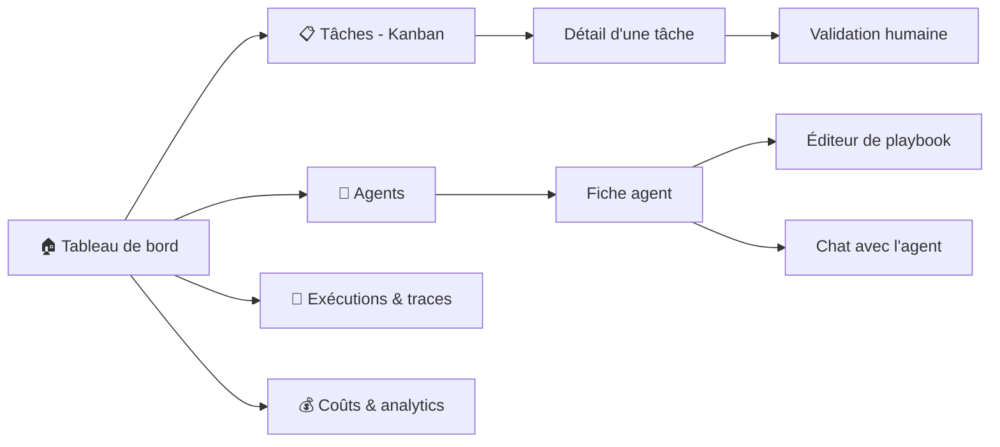

# Interface — Control Tower — Maestro

**Version :** 0.1
La **Control Tower** est l'unique poste de pilotage : superviser, configurer, interagir, assigner, contrôler la capacité. Interface multilingue (français par défaut), pensée pour un profil non technique.

---

## 1. Cartographie des écrans



---

## 2. Les écrans en détail

### 2.1 🏠 Tableau de bord (vue d'accueil)

Vue d'ensemble en temps réel :
- **Agents actifs** et leur statut (libre / occupé / en attente de validation / désactivé).
- **Tâches** par état (compteurs : à faire, en cours, en validation, terminées, échec).
- **Validations en attente** (mises en avant — action requise).
- **Coût cumulé** du jour et alertes de budget.
- Flux d'activité en direct (qui fait quoi).

### 2.2 📋 Tâches — tableau Kanban

- Colonnes : *Backlog → Prête → En cours → En validation → Terminée / Échec*.
- **Glisser-déposer** pour réassigner ou repositionner.
- Chaque carte : titre, agent assigné (avatar), priorité, dépendances, coût.
- Création d'une tâche : soit en langage naturel (l'orchestrateur la découpe), soit manuellement.
- **Réassignation manuelle** d'un agent à une tâche (EF-11/EF-20).

### 2.3 🤖 Agents

- Liste des agents avec statut, charge, nombre d'instances actives.
- Boutons : **activer/désactiver**, **+ / −** instances (contrôle de capacité, EF-21), **créer un agent**.
- **Fiche agent** :
  - Identité (nom, rôle, modèle, compétences/tags).
  - **Prompt système** éditable.
  - **Outils** liés et leurs permissions.
  - **Éditeur de playbook** avec **historique des versions** et retour arrière (EF-25).
  - **Chat** : conversation directe avec l'agent (EF-19).
  - Statistiques de l'agent (tâches traitées, taux de réussite, coût moyen).

### 2.4 🔬 Exécutions & traces

- Liste des runs (filtrable par agent/tâche/statut).
- **Trace détaillée** d'un run : étapes, outils appelés, entrées/sorties, tokens, coût, durée, erreurs (EF-22).
- Rejouer / relancer un run.
- Lien vers la trace correspondante dans Langfuse.

### 2.5 💰 Coûts & analytics

- Coût par agent / par projet / par jour.
- Débit (tâches/heure), taux de réussite, durée moyenne.
- **Plafonds de budget** et alertes configurables.

### 2.6 ✅ Validation humaine (human-in-the-loop)

Quand un agent atteint une action sensible, une carte **« Validation requise »** apparaît :
- Description de l'action (ex. « Déployer en production », « Migration : suppression de colonne »).
- Contexte et diff proposé.
- Boutons **Approuver** / **Refuser** / **Modifier la consigne**.
- Le run reste en pause jusqu'à la décision (EF-08).

---

## 3. Parcours utilisateur clés

### Parcours A — De l'idée au livrable
1. L'utilisateur saisit un objectif sur le tableau de bord.
2. Le Chef de projet crée les tickets ; ils apparaissent dans le Kanban.
3. Les agents démarrent en parallèle ; l'utilisateur suit en direct.
4. Une validation est demandée → l'utilisateur approuve.
5. Synthèse finale affichée ; livrables (PR, maquettes…) liés.

### Parcours B — Personnaliser un agent
1. Aller dans **Agents → fiche du Designer**.
2. Ouvrir l'**éditeur de playbook**, ajouter une règle de charte.
3. Enregistrer (nouvelle version) → s'applique à la tâche suivante, sans redéploiement.

### Parcours C — Ajuster la capacité
1. Pic de charge sur le développement.
2. Aller dans **Agents → Développeur**, augmenter le nombre d'instances.
3. Plus de tâches `dev` sont traitées en parallèle.

---

## 4. Principes d'UX

- **Temps réel d'abord** : tout changement d'état se reflète immédiatement (WebSocket).
- **L'humain garde la main** : les validations sont visibles et non contournables.
- **Lisibilité du coût** : le coût est affiché partout où une action en génère.
- **Vulgarisation & multilingue** : interface multilingue (français par défaut, autres langues activables via i18n), libellés clairs, jargon technique expliqué au survol.
- **Traçabilité** : depuis n'importe quelle tâche, on remonte à la trace complète.

---

## 5. Maquette textuelle du tableau de bord

```
┌─────────────────────────────────────────────────────────────┐
│  🎼 Maestro            Projet : Auth e-mail      💰 4,80 $/j  │
├───────────────┬───────────────┬───────────────┬─────────────┤
│ AGENTS ACTIFS │ TÂCHES        │ VALIDATIONS    │ ACTIVITÉ     │
│ 🟢 Dev (2)    │ Backlog    3  │ ⚠️ 1 en attente │ Dev → PR #12 │
│ 🟢 BDD        │ En cours   4  │ "Déploiement"  │ BDD → migr.  │
│ 🟡 DevOps ⏸   │ Validation 1  │ [Approuver]    │ QA → tests   │
│ ⚪ Designer    │ Terminées 12  │ [Refuser]      │ ...          │
└───────────────┴───────────────┴───────────────┴─────────────┘
```
