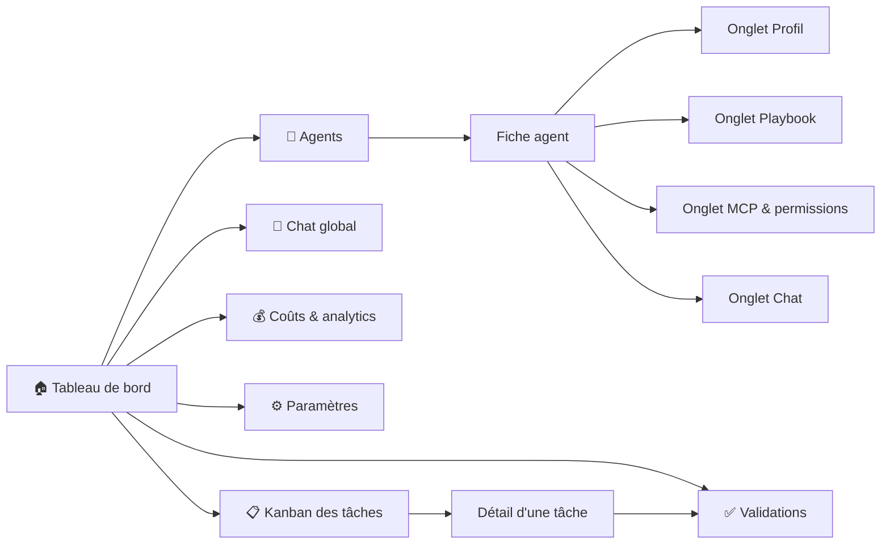

# Interface — Control Tower — Maestro

**Version :** 0.1
La **Control Tower** est l'unique poste de pilotage : superviser, configurer, interagir, assigner, contrôler la capacité. Interface multilingue (français par défaut), pensée pour un profil non technique.

---

## 1. Cartographie des écrans

**Une entrée de menu par intention** (navigation v2, #189). Trois entrées de la
v1 — Agents, Playbooks, Chat — regardaient **le même objet** par trois chemins :
on y choisissait un agent, puis on en consultait une facette. Elles ont fusionné
en **une** fiche agent à onglets. Le menu compte donc six entrées, et un agent se
consulte d'un seul endroit :



Le menu est déclaré **une seule fois** (`apps/web/lib/navigation.ts`) : la
sidebar, le titre de page et les renvois du tableau de bord le lisent tous. Les
onglets d'un agent le sont de même (`apps/web/lib/agents.ts`).

### 1.1 Les chemins de la v1 restent servis

Les anciennes URL sont écrites dans la doc, dans des tickets, dans des signets :
elles sont **redirigées vers l'onglet qu'elles visaient**
(`apps/web/next.config.ts`), jamais supprimées.

| Chemin v1 | Redirigé vers | Remarque |
| --- | --- | --- |
| `/catalogue` | `/agents` | la liste des agents |
| `/catalogue/<agent>` | `/agents/<agent>/profil` | |
| `/playbooks` | `/agents?onglet=playbook` | pas d'agent dans l'URL : l'intention est passée à la liste, dont les cartes visent alors cet onglet |
| `/playbooks/<agent>` | `/agents/<agent>/playbook` | |
| `/chat/<agent>` | `/agents/<agent>/chat` | |

`/chat` **nu n'est pas redirigé** : il reste au menu pour le chat **global**, non
lié à un agent (chantier « Chat » de la Phase 6) — c'est une intention distincte.
Les redirections sont temporaires (307) et non permanentes (308) : un 308 est mis
en cache par le navigateur pour de bon, et ces chemins ne pourraient plus être
corrigés côté serveur.

---

## 2. Les écrans en détail

### 2.1 🏠 Tableau de bord (vue d'accueil)

Il répond à « **où en est-on, et qu'est-ce qui m'attend ?** » **en un écran**
(épuré par #191). Cinq panneaux de plein format s'y disputaient la place ; il n'en
reste que ce qui se lit d'un coup d'œil, dans cet ordre :

1. **Validations en attente** — ce qui demande un arbitrage humain, en tête.
2. **Indicateurs de tête** — quatre tuiles : run en cours, tâches par statut,
   agents occupés et libres, dépense. Chaque tuile met en valeur **le chiffre
   qu'on vient y chercher** : la tuile Agents répond « combien travaillent,
   combien sont disponibles ? » et relègue le total et les agents désactivés en
   ligne de détail (#247).
3. **Kanban** des tâches.
4. **Aperçu de l'activité** en direct (quelques lignes, pas le fil entier).

Le reste n'a pas été supprimé, il est **rangé**, et **chaque tuile renvoie vers
la page où le détail vit désormais** : les fiches d'agent vers **Agents**, la
capacité vers **Paramètres › Agents & capacité**, le grand livre par exécution
vers **Coûts & analytics**. Ces renvois sont résolus **par le menu** et non par un
chemin écrit en dur : une page qui déménage emmène son renvoi avec elle (c'est ce
qui a fait suivre « Agents » quand il est passé de `/catalogue` à `/agents`), et
un renvoi vers une page **pas encore créée** — le Journal du chantier
« Visibilité », qui hébergera le fil complet — **ne s'allume pas** tant qu'elle
n'est pas au menu : pas de lien mort en attendant.

Le **coût cumulé** et le statut du flux temps réel vivent en permanence dans la
barre supérieure, sur toutes les pages. Tout se met à jour par WebSocket.

#### 2.1.1 Le poste vide — ce que montre un démarrage en mode réel (#186)

Le lanceur local démarre en **mode réel** (`bash scripts/controltower/start.sh`,
[doc 07 §6.10](./07-guide-de-demarrage.md)) : la Control Tower est branchée sur la
vraie orchestration, donc **un premier démarrage n'a rien à afficher** — aucune
tâche, aucun événement, aucune validation. Quatre panneaux à zéro feraient croire à
une panne ; l'écran est donc remplacé par **ce qu'il faut faire pour le remplir**
(`PosteVide`), avec les deux gestes possibles :

- **lancer une orchestration** — `maestro-run --publier "<objectif>"` depuis le
  dépôt, ou `POST /api/executions` depuis la Control Tower elle-même (§6.1) ;
- **juste explorer l'interface** — `bash scripts/controltower/start.sh --demo`,
  scénario factice sur bus mémoire, qui **dit** que ses données le sont.

Ce n'est **pas un état d'erreur**, et la distinction est le point de conception :
une API injoignable garde ses panneaux et sa bannière d'erreur, parce qu'un écran
vide *et muet* ne se diagnostique pas comme un écran vide *et connecté*. Une fois
le premier événement publié, le poste se remplit **sans rechargement** (WebSocket),
et l'historique est rejoué au redémarrage de l'API (journal durable, #97).

### 2.2 📋 Tâches — tableau Kanban

- Colonnes : *Backlog → Prête → En cours → En validation → Terminée / Échec*.
- **Glisser-déposer** pour réassigner ou repositionner.
- Chaque carte : titre, agent assigné (avatar), priorité, dépendances, coût.
- Création d'une tâche : soit en langage naturel (l'orchestrateur la découpe), soit manuellement.
- **Réassignation manuelle** d'un agent à une tâche (EF-11/EF-20).

### 2.3 🤖 Agents

L'entrée de menu **Agents** (`/agents`) mène à la **liste** ; chaque carte ouvre
**une** fiche, où les facettes de l'agent tiennent en **onglets**
(`/agents/<agent>/<onglet>`). C'est le point d'entrée unique vers un agent —
il n'y a plus de sélecteur d'agent en tête de trois pages différentes.

- **Liste** : les agents du catalogue (ceux du code, en lecture seule, et les
  personnalisés), avec **créer un agent**. Arrivée avec `?onglet=<onglet>` (par
  une redirection de la v1), les cartes visent directement cet onglet.
- **Fiche agent**, quatre onglets — l'ordre va de l'identité de l'agent à la
  conversation avec lui :

| Onglet | Contenu | Vient de |
| --- | --- | --- |
| 🤖 **Profil** | identité (nom, rôle, modèle, compétences/tags), prompt système éditable, statistiques (tâches traitées, taux de réussite, coût moyen) ; suppression d'un agent personnalisé | page `/catalogue` |
| 📖 **Playbook** | éditeur avec **historique des versions** et retour arrière (EF-25). L'historique porte aussi les **propositions d'auto-amélioration** en attente — brouillons issus des échecs d'un run, à appliquer ou rejeter au clic ([docs/22](./22-auto-amelioration-playbooks.md)) | page `/playbooks` |
| 🔌 **MCP & permissions** | serveurs MCP de l'agent et politique allow/deny effective ([docs/21](./21-configuration-mcp.md)) | n'avait aucune page à soi — seulement le bas de la fiche du catalogue |
| 💬 **Chat** | conversation directe avec l'agent (EF-19) | page `/chat/<agent>` |

L'**activation/désactivation** et le **contrôle de capacité** (**+ / −**
instances, EF-21) se règlent dans **Paramètres › Agents & capacité** ; le tableau
de bord en donne le compte et y renvoie.

Ajouter une facette à un agent se fait dans `apps/web/lib/agents.ts` : la barre
d'onglets, les cartes de la liste et la route dynamique la lisent toutes.

### 2.4 🔬 Exécutions & traces

- Liste des runs (filtrable par agent/tâche/statut).
- **Trace détaillée** d'un run : étapes, outils appelés, entrées/sorties, tokens, coût, durée, erreurs (EF-22).
- Rejouer / relancer un run.
- Lien vers la trace correspondante dans Langfuse.

**Piloter un run sans quitter l'écran** (#185, livré) : lancement, suivi et
annulation passent par les routes `/api/executions` dont le contrat est figé en
§6.1. Le lancement rend la main **tout de suite** — le run part en arrière-plan et
son `run_id` est connu avant qu'il ne produise quoi que ce soit —, ce qui permet
d'afficher le run « en cours » puis de le suivre par le flux temps réel habituel.
Un run **publié par un autre process** (`maestro-run --publier`, worker #41) est
listé au même titre : le suivi lit la projection, il ne distingue pas l'origine.

### 2.5 💰 Coûts & analytics

- Coût par agent / par projet / par jour, sur une **période sélectionnable** :
  total, évolution dans le temps, répartition par agent, détail par tâche et par
  exécution.
- **Grand livre par exécution** (#58) — le détail ligne à ligne (part de
  planification, coût par tâche, agrégat du run), rangé ici par #191 sous les
  agrégats qui le résument. Il ne dépend pas du filtre de période, d'où sa place
  à part sur la page.
- Une tâche issue d'un **ticket externe** porte le lien vers ce ticket, dans le
  Kanban comme dans les deux tables de coûts (#192). Seules les URL `http`/`https`
  sont suivies : la référence vient du flux, un `href` non filtré exécuterait du
  code. Une URL non suivable s'affiche en **texte**, jamais en lien mort.
- Débit (tâches/heure), taux de réussite, durée moyenne.
- **Plafonds de budget** et alertes configurables.

### 2.6 ✅ Validation humaine (human-in-the-loop)

Quand un agent atteint une action sensible, une carte **« Validation requise »** apparaît :
- Description de l'action (ex. « Déployer en production », « Migration : suppression de colonne »).
- Contexte et diff proposé.
- Boutons **Approuver** / **Refuser** / **Modifier la consigne**.
- Le run reste en pause jusqu'à la décision (EF-08).

### 2.7 📁 Projets et composition d'un objectif *(retenu — [docs/24](./24-projets-locaux-et-poste-de-travail.md), **Phases 7 et 8**)*

> Écrans **retenus** — décisions D1, D2 et D5 de
> [docs/24 §8](./24-projets-locaux-et-poste-de-travail.md) rendues le 2026-08-04 (#218). Ils
> comblent le trou constaté au §1 de ce cadrage : la Control Tower pilotait des exécutions qui
> n'appartenaient à aucun projet et dont les livrables atterrissaient dans un dossier de sortie,
> jamais chez l'utilisateur. La **Phase 7 a livré** les deux qui la concernent — l'écran Projets
> (§2.7.1) et l'application des livrables, qui emprunte l'écran de validation du §2.6. Les deux
> autres — composer un objectif, valider le brief — relèvent de la **Phase 8** et restent, eux,
> **pas encore spécifiés** au niveau de détail des §2.1 à 2.6.

- **Projets** — la liste des projets, chacun avec sa **racine sur le disque**, son type
  (nouveau / dépôt existant) et son périmètre. Le choix du dossier se fait par un **explorateur
  servi par l'API** : un navigateur ne livre jamais de chemin absolu, c'est donc le backend —
  qui tourne déjà sur le poste — qui énumère. Une racine hors périmètre autorisé est **refusée
  avec son motif**, jamais silencieusement ignorée (EF-38). **Livré** : l'API au §6.7 (#223),
  l'écran au §2.7.1 (#225).
- **Composer un objectif** — le formulaire de lancement gagne, à côté du texte, des **sources**
  (§6.1 étendu) : fichiers déposés, dossier de références en lecture seule, URL. L'extraction
  est visible (ce qui a été lu, ce qui a été ignoré, le coût estimé).
- **Valider le brief** — avant toute décomposition, le Chef de projet présente un **brief
  structuré** (objectif, périmètre, hors-périmètre, contraintes, critères d'acceptation,
  hypothèses) et **ses questions**. C'est le point de contrôle le plus rentable du produit :
  corriger un plan coûte un message, corriger douze tâches coûte douze exécutions.
- **Appliquer dans le projet** *(livré — #227, EF-37)* — la remise des livrables dans le dossier
  de l'utilisateur est une **action sensible** : elle emprunte l'écran de validation ci-dessus
  (§2.6), diff à l'appui. Rien de neuf côté mécanisme, un nouveau type d'action côté contenu —
  la demande de validation porte simplement un champ `diff` de plus (fichiers touchés, lignes
  ajoutées/supprimées, branche fusionnée), que le panneau des validations affiche avant la
  décision. Sur refus, **rien n'est écrit** et le travail reste consultable : la branche de tâche
  n'est jamais supprimée, la copie reste où elle est.

Le sélecteur de projet devient alors un élément permanent de la barre supérieure : le Kanban,
les coûts et le journal se lisent **par projet**.

#### 2.7.1 L'écran Projets (#225) — **livré**

Le premier des quatre écrans ci-dessus est **spécifié et implémenté** ; l'application des livrables
l'est aussi, par l'écran de validation du §2.6. Les deux autres — composer un objectif, valider le
brief — restent à la Phase 8, et ce sont eux seuls que vise encore la réserve de l'encadré.
Implémentation : `apps/web/app/projets/page.tsx` et `apps/web/components/projets/`, contre les six
routes du §6.7 ; couverture `apps/web/tests/projets.test.tsx` côté UI,
[`tests/test_projets_api.py`](../tests/test_projets_api.py) côté API.

**Place dans la navigation** — une entrée **« Projets »** juste après le tableau de bord, avant les
écrans qui s'y rapporteront (agents, coûts, validations). Déclarer *où* Maestro travaille n'est pas
un réglage du poste : ce n'est pas une section des Paramètres.

**Ce que la liste montre**, une carte par projet : le **nom**, la **racine** canonicalisée telle que
le backend l'a enregistrée, l'**origine** (« Dossier existant » / « Nouveau dossier »), le **VCS
constaté** (`git · <branche>`, ou « Non versionné » — jamais tu, puisque c'est lui qui décide du
patron d'écriture de #224), le **périmètre** (inclus, exclus) et les dates. Aucun projet déclaré
n'est pas une liste vide mais une phrase qui dit ce qu'on perd à ne pas en déclarer.

**Déclarer et modifier** passent par le **même formulaire**, parce que `PUT` est un remplacement
intégral (§6.7) : deux formulaires distincts finiraient par ne plus porter les mêmes champs. Toute
écriture est suivie d'un **rechargement de la liste** — la racine est canonicalisée et le VCS
constaté côté serveur, donc afficher ce qu'on a envoyé ferait diverger l'écran du disque.
L'**origine ne s'édite pas** après coup : elle raconte comment le projet est né, la réécrire ne
changerait rien sur le disque.

**Choisir la racine** — le point dur, et la raison d'être de l'explorateur du §6.7. La racine ne se
tape pas : elle est toujours l'un des chemins **énumérés par l'API**. L'écran navigue dossier par
dossier (entrer, remonter, revenir aux dossiers explorables), affiche le marqueur **dépôt Git** et
grise les dossiers **déjà déclarés** par un autre projet. Le seul cas où le dossier visé n'existe pas
encore — origine « nouveau » — se résout **sans exception à la règle** : le **parent** vient de
l'explorateur et l'utilisateur ne saisit qu'un **nom de dossier**, refusé s'il contient un
séparateur.

**Un refus est une réponse** (EF-38), et il en porte trois choses : la **phrase** du backend, le
**geste** qui en sort quand l'écran le connaît (élargir `MAESTRO_EXPLORATEUR_RACINES`, descendre
d'un cran, choisir un sous-dossier…) et le **motif** brut, affiché tel quel — un code stable vaut
mieux qu'une traduction approximative quand il faut chercher de l'aide. Un refus s'affiche **à
l'endroit du geste refusé** (dans le formulaire, sur la carte, dans l'explorateur), **conserve la
saisie en cours** et **laisse la page précédente** de l'explorateur à l'écran : l'erreur ne casse ni
la navigation ni le reste de l'écran. Corollaire tenu par les tests : « ce dossier n'a pas de
sous-dossier » et « je refuse de regarder là » ne s'affichent **jamais** pareil.

---

## 3. Parcours utilisateur clés

### Parcours A — De l'idée au livrable
1. L'utilisateur saisit un objectif sur le tableau de bord.
2. Le Chef de projet crée les tickets ; ils apparaissent dans le Kanban.
3. Les agents démarrent en parallèle ; l'utilisateur suit en direct.
4. Une validation est demandée → l'utilisateur approuve.
5. Synthèse finale affichée ; livrables (PR, maquettes…) liés.

### Parcours B — Personnaliser un agent
1. Aller dans **Agents → fiche du Designer → onglet Playbook**.
2. Ajouter une règle de charte dans l'éditeur.
3. Enregistrer (nouvelle version) → s'applique à la tâche suivante, sans redéploiement.
4. Sans quitter la fiche, l'onglet **Chat** permet d'éprouver la règle sur-le-champ.

### Parcours C — Ajuster la capacité
1. Pic de charge sur le développement.
2. Depuis le tableau de bord, la tuile **Agents** renvoie à la liste ; la
   capacité se règle dans **Paramètres → Agents & capacité**.
3. Augmenter le nombre d'instances du Développeur.
4. Plus de tâches `dev` sont traitées en parallèle.

---

## 4. Principes d'UX

- **Temps réel d'abord** : tout changement d'état se reflète immédiatement (WebSocket).
- **L'humain garde la main** : les validations sont visibles et non contournables.
- **Lisibilité du coût** : le coût est affiché partout où une action en génère,
  **à deux décimales** et par un seul formateur — `apps/web/lib/format.ts`, que
  tous les écrans appellent au lieu de reformater dans leur coin (#247). Trois
  rendus qu'on ne confond jamais : « — » (rien n'a été rapporté — inconnu n'est
  pas nul), « 0,00 $US » (zéro rapporté, une vraie mesure) et « < 0,01 $US »
  (une dépense réelle mais sous le centime, cas courant sur un fournisseur
  local, #113). Seules les **graduations d'un axe** échappent aux deux décimales,
  faute de quoi une série de quelques millièmes de dollar les verrait toutes
  tomber sur « 0,00 » ; l'exception est déclarée dans ce même module.
- **Vulgarisation & multilingue** : interface multilingue (français par défaut, autres langues activables via i18n), libellés clairs, jargon technique expliqué au survol.
- **Traçabilité** : depuis n'importe quelle tâche, on remonte à la trace complète.

---

## 5. Maquette textuelle du tableau de bord

Tel qu'épuré par #191 : l'arbitrage d'abord, quatre tuiles de tête, le Kanban,
puis un aperçu de l'activité. Chaque tuile qui résume un panneau rangé porte le
renvoi (`→`) vers la page où il vit.

```
┌──────────────┬──────────────────────────────────────────────────────────────┐
│ M Maestro    │  Tableau de bord      🟢 Temps réel   💰 4,80 $   🔔 ☀ ?     │
│              ├──────────────────────────────────────────────────────────────┤
│ ▸ Tableau…   │  ⚠️ VALIDATIONS EN ATTENTE                                    │
│   Agents     │  « Déploiement en production » — devops   [Approuver][Refuser]│
│   Chat       ├──────────────┬──────────────┬──────────────┬─────────────────┤
│   Coûts…     │ Run en cours │ Tâches       │ Agents       │ Dépense         │
│   Validations│ run-2f9c     │ 20           │ 2 occ. 2 lib.│ 4,95 $US        │
│   Paramètres │ 5 ouvertes   │ 4 en cours…  │ 4 au total…  │ 3 exécution(s)  │
│              │              │              │ Voir les →   │ Détail par →    │
│              ├──────────────┴──────────────┴──────────────┴─────────────────┤
│              │  TÂCHES (KANBAN)                                             │
│              │  Backlog 3 │ En cours 4 │ Validation 1 │ Terminées 12        │
│              ├──────────────────────────────────────────────────────────────┤
│              │  ACTIVITÉ EN DIRECT                    + 14 plus anciens     │
│              │  10:12 ✅ Dev → PR #12   10:11 🔧 BDD → migration   …         │
└──────────────┴──────────────────────────────────────────────────────────────┘
```

---

## 6. Contrats d'API v2 (Phases 5/6) — formes JSON figées

Le cadrage #182 répartit les prochaines améliorations en deux voies
**parallèles** : Phase 5 (socle backend) et Phase 6 (Control Tower front). Pour les rendre
réellement indépendantes, les **formes JSON** des routes à venir sont **arrêtées ici** et
**servies en fixtures par la démo** (`maestro.controltower.demo`) : la voie front code contre
elles sans attendre le backend réel (ticket #183).

**État de livraison.** Ces routes sont déclarées dans `create_app` mais **répondent `501`** tant
que leur lot n'est pas livré (Phase 5, #184+). Fournir des fixtures (`create_app(fixtures=…)`, ce
que fait la démo) les fait servir des données factices cohérentes avec le scénario existant. La
forme est le contrat ; le backend réel la remplira **à contrat identique** — les **exécutions**
(§6.1) l'ont déjà fait : leur lot #185 est livré, elles ne passent donc plus ni par le `501` ni
par les fixtures, et se servent de `maestro.controltower.executions`. Miroir TypeScript :
[`apps/web/lib/types.ts`](../apps/web/lib/types.ts) ; fixtures : `maestro/controltower/fixtures.py`.

Ce chapitre est depuis devenu **le** répertoire des formes JSON de l'API, phases 5/6 ou non : les
routes livrées après lui y sont documentées au même endroit et au même niveau de détail plutôt que
dans un second chapitre concurrent (§6.7, les projets de la Phase 7). Une section porte donc la
mention **livré** quand elle décrit du code réel, et reste une forme figée servie en fixtures sinon.

Convention partagée avec les routes existantes : un champ **`null`** vaut « inconnu » et se
distingue d'un zéro ou d'une absence ; les horodatages sont en **ISO-8601 UTC**.

### 6.0 Portée projet d'une lecture — `?projet=` (#277) — **livré**

Toutes les lectures qui **agrègent** portent le même paramètre, obligatoire : `GET /api/taches`,
`/api/executions`, `/api/analytics/couts`, `/api/validations`, `/api/journal` et le flux temps réel
`WS /ws/evenements`. Un contrat, pas un paramètre réinventé par endpoint.

| `?projet=` | ce qui sort |
| --- | --- |
| `<id>` | ce qui appartient à ce projet, et rien d'autre |
| `tous` | la vue transverse, travaux sans projet compris — **explicitement demandée** |
| `aucun` | les seuls travaux qui ne relèvent d'aucun projet |
| *omis / vide* | **refus** `422` `{motif: "projet-requis"}` |
| identifiant non déclaré | **refus** `404` `{motif: "projet-inconnu"}` |

Deux partis pris, qui sont le sujet du lot. **« Rien plutôt qu'un mélange »** : une lecture sans
périmètre n'est plus servie « tous projets confondus » en silence — un refus se diagnostique là où
une liste vide se confondrait avec un projet sans activité. Et **un projet inconnu est refusé**,
par la même porte que les refus de `ServiceProjets` (§6.7 : `{motif, message}`), au lieu de rendre
une vue vide : une faute de frappe se lisait « ce projet n'a rien fait ».

Un travail **sans projet** n'entre dans la vue d'aucun projet — on ne devine pas son
rattachement ; `aucun` est la seule vue qui le montre. `tous` et `aucun` sont des **mots réservés** :
les identifiants sont engendrés (`prj-<empreinte>`, §6.7), aucun projet ne peut les masquer.

Le **flux temps réel suit la même règle** : la portée est déclarée à l'ouverture de la socket et le
tri se fait à l'entrée de la file — un événement d'un autre projet n'arrive jamais dans une vue
filtrée. Un refus part **sur la socket** (`{"erreur": {motif, message}}`) avant une fermeture en
`1008`, plutôt qu'en échec de poignée de main, qui serait muet. Corollaire assumé : les événements
transverses par nature (capacité d'un agent, proposition de playbook) ne portent pas de projet et
n'atteignent donc pas une socket cadrée sur un projet — ils restent visibles sous `tous`.

`GET /api/analytics/couts` rappelle dans sa réponse la `portee` servie (`tous` | `aucun` | `<id>`)
à côté de `projet` (l'identifiant, ou `null`) : un total ne se lit pas sans savoir de quoi il est le
total.

Implémentation : [`maestro/controltower/portee.py`](../maestro/controltower/portee.py) — un objet
`PorteeProjet` et son unique prédicat `retient`, partagé par la projection, les analytics, le
journal et la diffusion, de sorte qu'aucune de ces quatre couches ne réécrive « appartient au
projet demandé ».

### 6.1 Exécutions — lancement, suivi, annulation (#185) — **livré**

Piloter un vrai run depuis la Control Tower, sans passer par la CLI. Seule section de ce
chapitre déjà implémentée (`maestro/controltower/executions.py`) : le contrat ci-dessous
décrit le comportement réel, pas une fixture.

- `GET /api/executions` → `ResumeExecution[]` — les runs connus (en cours et passés), récents
  d'abord.
- `POST /api/executions` → `202` + `ResumeExecution` — lance un run **en arrière-plan** (les
  événements arrivent par le flux existant) et rend son `run_id` immédiatement. Corps
  `LancementExecution`. `422` si l'objectif est vide ou un garde-fou est hors bornes — les
  plafonds sont des maximums, ils doivent être **> 0**.
- `POST /api/executions/{run_id}/annuler` → `ResumeExecution` — interrompt un run en cours (statut
  `annulee`, `fin` posée). `404` si le run est inconnu, `409` s'il est déjà soldé — un run terminé
  n'est plus interruptible, et le dire vaut mieux que faire croire à une annulation.

```jsonc
// LancementExecution (corps de POST /api/executions)
{
  "objectif": "Prototyper un mini-CRM",   // énoncé décomposé par l'orchestrateur
  "plafond_cout_usd": 5.0,                 // null : défaut du moteur
  "plafond_tokens": 200000,                // null : défaut du moteur
  "timeout_tache_s": 600,                  // null : défaut du moteur
  "parallelisme": 3,                       // null : défaut du moteur
  "ticket": { "id": "#42", "url": "https://…/issues/42" }  // null : run sans ticket
}

// ResumeExecution (réponse)
{
  "run_id": "demo-live",
  "objectif": "Prototyper un mini-CRM",
  "statut": "en_cours",                    // en_cours | terminee | annulee | echec
  "nb_taches": 5,
  "cout_usd": 0.1665,                      // null : aucun coût rapporté
  "ticket": { "id": "#42", "url": "https://…/issues/42" },  // null : sans ticket
  "debut": "2026-07-30T09:00:00+00:00",
  "fin": null                              // null tant que le run est en cours
}
```

### 6.2 Journal requêtable — filtres, tri, pagination

Une page de journal d'événements interrogeable, source de la future page *Logs* (Phase 6).

- `GET /api/journal` → `PageJournal`. Paramètres de requête (tous optionnels) :
  - **filtres** : `agent`, `type`, `run_id`, `depuis`, `jusqua` (fenêtre ISO-8601, bornes
    incluses) ;
  - **tri** : `tri` ∈ `horodatage` (défaut) | `agent` | `type`, `ordre` ∈ `desc` (défaut) | `asc` ;
  - **pagination** : `page` (1-indexée, défaut 1), `taille` (défaut 50, max 200).
  - `422` sur un `tri`/`ordre` inconnu, `page` < 1 ou `taille` hors [1, 200].

```jsonc
// PageJournal
{
  "entrees": [
    {
      "id": "j-0002",                       // id stable (référençable, triable)
      "type": "tache.statut",
      "run_id": "demo-live",
      "tache_id": "demo-t1",
      "agent": "bdd",
      "role": "Base de données",
      "statut": "en_cours",
      "detail": "Concevoir le schéma SQL de la table contacts",
      "horodatage": "2026-07-30T09:00:12+00:00"
    }
  ],
  "total": 10,        // après filtres, AVANT pagination
  "page": 1,
  "taille": 50,
  "pages": 1
}
```

### 6.3 Registre de configuration

Les **réglages produit éditables** (couche 1 du cadrage sécurité #182) : ils quittent
l'environnement pour un registre versionné côté serveur, rechargé à chaud. **Liste blanche
stricte** — aucune écriture arbitraire de variable d'environnement ; les secrets sont
**write-only** (valeur masquée, jamais renvoyée en clair, #132).

- `GET /api/configuration` → `RegistreConfiguration`.

```jsonc
// RegistreConfiguration
{
  "reglages": [
    {
      "cle": "plafond_cout_usd",
      "valeur": "5.0",                       // masquée par des points si secret
      "type": "decimal",                     // chaine | entier | decimal | booleen | secret
      "description": "Plafond de coût (USD) d'une exécution avant arrêt du moteur.",
      "categorie": "plafonds",               // modele | plafonds | execution | integrations | retention
      "valeur_defaut": "10.0",
      "modifiable": true,                    // false : lecture seule (hors liste blanche)
      "secret": false,
      "source": "stockage",                  // defaut (jamais édité) | stockage
      "version": 3,                          // 0 au défaut ; incrémentée à chaque écriture
      "modifie_le": "2026-07-29T08:05:00+00:00"  // null si jamais touché
    }
  ],
  "version": 3,                              // version du registre versionné (append-only)
  "erreur": null                             // cause si le stockage est illisible
}
```

### 6.4 Propositions de playbook globales

L'agrégat **transverse** des propositions d'auto-amélioration (#111 exposé par agent), source du
badge d'attente et des notifications (items 8/9 du cadrage).

- `GET /api/playbooks/propositions` → `PropositionPlaybookGlobale[]` — chaque proposition
  (numéro de brouillon, provenance, justification) enrichie du `role` de son agent.
- Pendant **temps réel** : l'événement `playbook.proposition` du WebSocket — un signal global
  (sans `run_id`) que l'UI badge et pousse en notification.

```jsonc
// PropositionPlaybookGlobale
{
  "agent": "qa",
  "role": "QA / Testeur",
  "version": 1,                              // numéro de brouillon (numérotation propre)
  "cree_le": "2026-07-30T18:42:00+00:00",
  "provenance": "proposition",
  "justification": "…"                       // raison liée aux échecs analysés
}
```

### 6.5 Flux SSE d'un fil de chat

Le rendu **en streaming** d'une réponse de chat (items 2/4/12 : assistant, chat global, chat
direct).

- `GET /api/chat/{agent}/flux?contenu=…` → `text/event-stream` — chaque `data: <json>` est un
  `FragmentChat`. `404` si l'agent n'est pas au catalogue (`assistance` désigne le canal d'aide).

```jsonc
// FragmentChat (une trame SSE)
{
  "type": "fragment",        // debut (ouvre) | fragment (incrémente) | fin (clôt) | erreur
  "agent": "qa",
  "auteur": "agent",         // l'émetteur
  "delta": " morceau",       // incrément de texte ; vide hors `fragment`
  "message": null            // MessageChat complet sur la seule trame `fin`, null ailleurs
}
```

### 6.6 Référence de ticket externe portée par une tâche (#187)

Une carte du Kanban peut porter la référence du **ticket externe** dont elle relève — générique
(GitLab, Jira, Linear passent par la même forme, aucun champ propre à un outil). Ce ticket fige la
**donnée** ; son affichage sur la carte est un lot de la Phase 6.

- Forme : `{ "id": "#183", "url": "https://…/issues/183" }` — `url` vide quand seul l'identifiant
  est connu. **Absente par défaut** (`null`) : un plan sans référence reste valide.
- Portée : le schéma de tâche partagé (`packages/shared/schemas/task.schema.json`, propriété
  optionnelle `ticket`), la projection (`EtatTache.ticket`), les événements de tâche
  (`Event.ticket`) et `GET /api/taches` — elle **survit au rejeu** du journal durable.
- Alimentation : soit par l'origine du run (`ticket` de `POST /api/executions`), soit par un agent
  équipé du serveur MCP de l'outil, **sans** que le moteur ne connaisse l'outil de ticketing.

### 6.7 Projets de l'utilisateur — CRUD et explorateur de dossiers (#223) — **livré**

Rendre l'entité `Projet` du lot #221 atteignable, et fournir la brique sans laquelle l'écran
Projets (§2.7) ne peut pas exister : **l'explorateur servi par l'API**. Implémenté, pas en
fixture (`maestro/controltower/projets.py`) — comme §6.1, le contrat ci-dessous décrit le
comportement réel.

- `GET /api/projets` → `Projet[]` — les projets déclarés, dans l'ordre des identifiants. Un
  fichier du dépôt illisible est **sauté** plutôt que de rendre la liste inexploitable.
- `GET /api/projets/{id}` → `Projet`. `404` si inconnu, `422` (`projet-illisible`) si son fichier
  est corrompu — c'est ici qu'un projet sauté du listing s'explique.
- `POST /api/projets` → `201` + `Projet`. Corps `DeclarationProjet`.
- `PUT /api/projets/{id}` → `Projet` — **remplacement intégral**, pas un diff (même parti pris que
  `PUT /api/catalogue/{nom}`) : un champ absent retombe sur son défaut, il n'est pas « conservé ».
  `cree_le` est préservé, le `vcs` **re-détecté**.
- `DELETE /api/projets/{id}` → `{ "id": …, "supprime": true }` — oublie la déclaration et **ne
  touche jamais au dossier sur le disque** : oublier un projet n'est pas supprimer le travail de
  l'utilisateur.
- `GET /api/projets/explorateur?chemin=…` → `PageExplorateur` — énumère les **dossiers** de
  `chemin` ; **sans `chemin`**, les **points d'entrée** (#278, voir ci-dessous).
- `GET /api/projets/selecteur` → `DisponibiliteSelecteur` (#278) — le dialogue de dossier **natif
  du poste** est-il ouvrable ici ? **Toujours 200** : une indisponibilité est une réponse, pas une
  panne.
- `POST /api/projets/selecteur` → `ChoixSelecteur` (#278) — ouvre ce dialogue et rend le chemin
  choisi, confronté à EF-38. Corps facultatif `{ "depart": "D:/projets" }`.

Le `vcs` n'est **jamais** un champ de requête : il est constaté sur le disque à chaque écriture.
Un client qui l'annoncerait pourrait mentir, et c'est lui qui décide du patron d'écriture de
#224 (worktree Git ou copie).

```jsonc
// DeclarationProjet (corps de POST et PUT)
{
  "nom": "Dépensio",
  "racine": "D:/projets/depensio",  // chemin ABSOLU ; canonicalisé et validé côté serveur
  "origine": "existant",            // existant (le dossier doit être là) | nouveau (il est créé)
  "inclus": ["."],                  // null : défaut du modèle
  "exclus": [".git", "node_modules", ".env", "**/secrets/**"]   // null : défaut du modèle
}

// Projet (réponse) — la forme du fichier stocké, cf. docs/24 §2.3
{
  "id": "prj-7f3a1c2b",
  "nom": "Dépensio",
  "racine": "D:/projets/depensio",  // canonicalisée, en POSIX sur les trois OS
  "origine": "existant",
  "vcs": { "type": "git", "branche_base": "main", "distant": "git@…" },  // null : non versionné
  "perimetre": { "inclus": ["."], "exclus": [".git", "node_modules", ".env", "**/secrets/**"] },
  "cree_le": "2026-08-05T09:00:00+00:00",
  "modifie_le": "2026-08-05T09:00:00+00:00"
}

// PageExplorateur (réponse de GET /api/projets/explorateur)
{
  "chemin": "D:/projets",           // null : la page d'entrée (les points d'entrée)
  "parent": null,                   // null : remonter sortirait des racines — la frontière se voit
  "racines": ["C:/", "D:/"],        // la FRONTIÈRE : ce qu'on a le droit d'énumérer, dédoublonnée
  "dossiers": [
    {
      "nom": "depensio",
      "chemin": "D:/projets/depensio",
      "depot_git": true,            // marqueur « dépôt Git » — décide du patron d'écriture (#224)
      "projet_id": "prj-7f3a1c2b",  // null : dossier pas encore déclaré comme projet
      "origine": null               // page d'entrée seulement (#278) ; null sur un sous-dossier
    }
  ],
  "tronque": false                  // true : au-delà de 500 entrées, la liste est coupée — et le dit
}

// DisponibiliteSelecteur (réponse de GET /api/projets/selecteur)
{
  "disponible": false,
  "motif": "selecteur-hors-poste",  // null quand disponible
  "message": "Backend distant : le dialogue de l'OS s'ouvrirait sur le serveur…",
  "outil": null                     // "powershell" | "osascript" | "zenity" | "kdialog"
}

// ChoixSelecteur (réponse de POST /api/projets/selecteur)
{
  "annule": false,                  // true : la fenêtre a été fermée — un geste normal, pas une erreur
  "chemin": "D:/",
  "racine_valide": false,           // le chemin est lisible, mais pas déclarable tel quel
  "refus": { "motif": "racine-de-disque", "message": "…" }   // null quand racine_valide
}
```

**La frontière et les points d'entrée sont deux choses** (#278). `racines` dit ce qu'on a le
**droit** d'énumérer ; la page d'entrée (`GET /api/projets/explorateur` sans `chemin`) dit par où
**commencer**. Elles ont divergé quand la frontière s'est élargie aux **volumes du poste** : elle
dédoublonne par contenance, donc elle se réduirait à `C:/` (ou `/`), et il faudrait redescendre
tout l'arbre à chaque fois. Chaque point d'entrée porte son `origine` — `utilisateur`, `recent`
(le **parent** d'un projet récemment déclaré : là où l'on range ses dépôts), `projet`, `volume`,
`configuree` — et reste **dans** la frontière : un point qui refuserait au clic serait pire que
son absence. C'est aussi ce qui garde `MAESTRO_EXPLORATEUR_RACINES` **restrictif** — les volumes
ne sont proposés que là où la frontière est celle par défaut.

**Le sélecteur natif est un confort, jamais un passage obligé.** Un navigateur ne livre pas de
chemin absolu, mais le backend **tourne sur le poste** : il peut ouvrir le dialogue de l'OS. Trois
garde-fous, parce qu'ouvrir une fenêtre depuis une requête HTTP est un effet de bord sur la
machine de quelqu'un — la requête doit venir de la **boucle locale** (lue sur le client TCP,
jamais sur un en-tête, qu'un client pose lui-même), **un dialogue à la fois**, et une **attente
bornée** (5 min). Toute indisponibilité se **dit** au lieu de laisser un bouton mort, et
l'explorateur reste dans tous les cas la voie complète — c'est ce que reçoit le **mode serveur**.

**Un refus porte toujours son motif**, jamais une liste vide : « ce dossier n'a pas de
sous-dossier » et « je refuse de regarder là » sont deux réponses différentes, et les confondre
rend un explorateur inutilisable. Le corps d'erreur de ces six routes est donc un **objet** et non
une phrase — `{ "motif": "chemin-sensible", "message": "…" }` — pour que l'écran puisse dire
*pourquoi* (§2.7, EF-38) sans analyser du texte.

| Motif | Code | Quand |
|---|---|---|
| `chemin-relatif`, `chemin-vide`, `pas-un-dossier`, `ancre-non-standard` | 422 | la saisie n'est pas un chemin de dossier absolu et local |
| `racine-de-disque`, `dossier-utilisateur-nu`, `au-dessus-du-dossier-utilisateur`, `au-dessus-du-depot-maestro` | 422 | racine techniquement valide, mais trop haute pour un projet |
| `chemin-sensible`, `chemin-systeme`, `depot-maestro` | 403 | zone interdite : `.ssh`, `AppData`, dossiers système, dépôt de Maestro |
| `hors-racines-explorables`, `aucune-racine-explorable` | 403 | l'explorateur refuse de sortir de ses racines |
| `selecteur-hors-poste`, `selecteur-desactive`, `selecteur-sans-outil`, `selecteur-en-cours`, `selecteur-expire` | 403 sur `POST /api/projets/selecteur` | le dialogue natif ne s'ouvre pas — et dit lequel des cinq empêchements (sur le `GET`, les trois premiers sont un **200** motivé) |
| `acces-refuse` | 403 | l'OS refuse d'énumérer le dossier |
| `dossier-absent` | 404 sur l'explorateur, 422 sur `POST`/`PUT` | le dossier n'existe pas — « pas là » côté lecture, saisie fautive côté déclaration |
| `projet-inconnu` | 404 | l'identifiant n'est pas dans le dépôt |
| `projet-illisible` | 422 | le fichier du dépôt existe mais ne se relit pas |
| `requete-invalide` | 422 | refus sans motif propre (nom vide, origine inconnue, racine déjà déclarée) |

**L'explorateur n'est pas un « lis n'importe quel chemin ».** L'API n'a pas d'authentification au
POC (CORS `*` — limite connue de #182 et [docs/24 §6](./24-projets-locaux-et-poste-de-travail.md),
durcie en Phase 9) : une route qui énumère le disque est une **frontière**, pas un confort. Elle
en porte deux, superposées :

1. **les racines explorables** — le dossier utilisateur par défaut, remplaçable par
   `MAESTRO_EXPLORATEUR_RACINES` (séparateur `;` sous Windows, `:` sous POSIX), et **toujours**
   les racines des projets déjà déclarés, explorables par construction. Une racine contenue dans
   une autre est retirée de la liste : elle n'ajoute aucune permission ;
2. **les zones interdites** de `maestro.projets.racine`, qui s'appliquent *à l'intérieur* des
   racines — le dossier utilisateur se **traverse**, `~/.ssh` non. C'est la même liste que celle
   qui refuse une racine de projet (#221), extraite en `verifier_zone_interdite` pour être
   partagée : une zone interdite à la déclaration ne peut pas devenir lisible par l'explorateur.

Le défaut mérite d'être connu **avant** le premier essai : sous Windows, les projets vivent
souvent hors du dossier utilisateur (`D:/projets`). L'explorateur les refuse alors — avec un motif
qui **nomme la variable à renseigner**, plutôt qu'un mur muet. Élargir est un geste explicite,
c'était le but.
