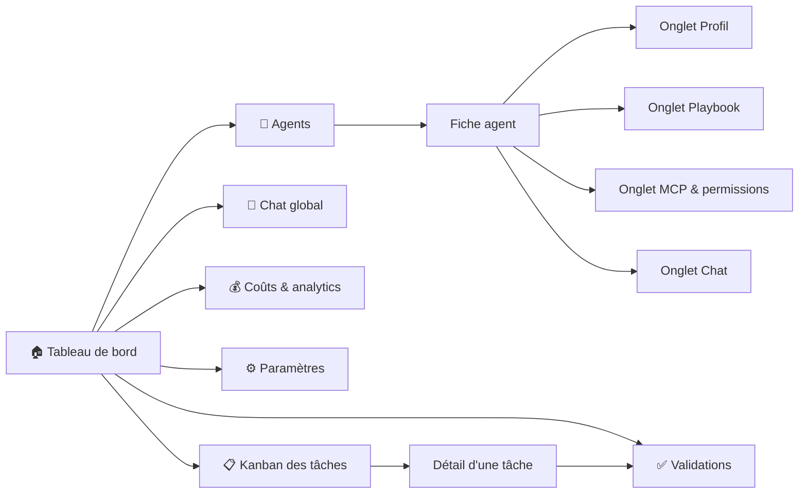

# Interface — Control Tower — Maestro

**Version :** 0.1
La **Control Tower** est l'unique poste de pilotage : superviser, configurer, interagir, assigner, contrôler la capacité. Interface multilingue (français par défaut), pensée pour un profil non technique.

---

## 1. Cartographie des écrans

**Une entrée de menu par intention** (navigation v2, #189). Trois entrées de la
v1 — Agents, Playbooks, Chat — regardaient **le même objet** par trois chemins :
on y choisissait un agent, puis on en consultait une facette. Elles ont fusionné
en **une** fiche agent à onglets. Le menu compte donc six entrées, et un agent se
consulte d'un seul endroit :



Le menu est déclaré **une seule fois** (`apps/web/lib/navigation.ts`) : la
sidebar, le titre de page et les renvois du tableau de bord le lisent tous. Les
onglets d'un agent le sont de même (`apps/web/lib/agents.ts`).

### 1.1 Les chemins de la v1 restent servis

Les anciennes URL sont écrites dans la doc, dans des tickets, dans des signets :
elles sont **redirigées vers l'onglet qu'elles visaient**
(`apps/web/next.config.ts`), jamais supprimées.

| Chemin v1 | Redirigé vers | Remarque |
| --- | --- | --- |
| `/catalogue` | `/agents` | la liste des agents |
| `/catalogue/<agent>` | `/agents/<agent>/profil` | |
| `/playbooks` | `/agents?onglet=playbook` | pas d'agent dans l'URL : l'intention est passée à la liste, dont les cartes visent alors cet onglet |
| `/playbooks/<agent>` | `/agents/<agent>/playbook` | |
| `/chat/<agent>` | `/agents/<agent>/chat` | |

`/chat` **nu n'est pas redirigé** : il reste au menu pour le chat **global**, non
lié à un agent (chantier « Chat » de la Phase 6) — c'est une intention distincte.
Les redirections sont temporaires (307) et non permanentes (308) : un 308 est mis
en cache par le navigateur pour de bon, et ces chemins ne pourraient plus être
corrigés côté serveur.

---

## 2. Les écrans en détail

### 2.1 🏠 Tableau de bord (vue d'accueil)

Il répond à « **où en est-on, et qu'est-ce qui m'attend ?** » **en un écran**
(épuré par #191). Cinq panneaux de plein format s'y disputaient la place ; il n'en
reste que ce qui se lit d'un coup d'œil, dans cet ordre :

1. **Validations en attente** — ce qui demande un arbitrage humain, en tête.
2. **Indicateurs de tête** — quatre tuiles : run en cours, tâches par statut,
   agents actifs, dépense.
3. **Kanban** des tâches.
4. **Aperçu de l'activité** en direct (quelques lignes, pas le fil entier).

Le reste n'a pas été supprimé, il est **rangé**, et **chaque tuile renvoie vers
la page où le détail vit désormais** : les fiches d'agent vers **Agents**, la
capacité vers **Paramètres › Agents & capacité**, le grand livre par exécution
vers **Coûts & analytics**. Ces renvois sont résolus **par le menu** et non par un
chemin écrit en dur : une page qui déménage emmène son renvoi avec elle (c'est ce
qui a fait suivre « Agents » quand il est passé de `/catalogue` à `/agents`), et
un renvoi vers une page **pas encore créée** — le Journal du chantier
« Visibilité », qui hébergera le fil complet — **ne s'allume pas** tant qu'elle
n'est pas au menu : pas de lien mort en attendant.

Le **coût cumulé** et le statut du flux temps réel vivent en permanence dans la
barre supérieure, sur toutes les pages. Tout se met à jour par WebSocket.

### 2.2 📋 Tâches — tableau Kanban

- Colonnes : *Backlog → Prête → En cours → En validation → Terminée / Échec*.
- **Glisser-déposer** pour réassigner ou repositionner.
- Chaque carte : titre, agent assigné (avatar), priorité, dépendances, coût.
- Création d'une tâche : soit en langage naturel (l'orchestrateur la découpe), soit manuellement.
- **Réassignation manuelle** d'un agent à une tâche (EF-11/EF-20).

### 2.3 🤖 Agents

L'entrée de menu **Agents** (`/agents`) mène à la **liste** ; chaque carte ouvre
**une** fiche, où les facettes de l'agent tiennent en **onglets**
(`/agents/<agent>/<onglet>`). C'est le point d'entrée unique vers un agent —
il n'y a plus de sélecteur d'agent en tête de trois pages différentes.

- **Liste** : les agents du catalogue (ceux du code, en lecture seule, et les
  personnalisés), avec **créer un agent**. Arrivée avec `?onglet=<onglet>` (par
  une redirection de la v1), les cartes visent directement cet onglet.
- **Fiche agent**, quatre onglets — l'ordre va de l'identité de l'agent à la
  conversation avec lui :

| Onglet | Contenu | Vient de |
| --- | --- | --- |
| 🤖 **Profil** | identité (nom, rôle, modèle, compétences/tags), prompt système éditable, statistiques (tâches traitées, taux de réussite, coût moyen) ; suppression d'un agent personnalisé | page `/catalogue` |
| 📖 **Playbook** | éditeur avec **historique des versions** et retour arrière (EF-25). L'historique porte aussi les **propositions d'auto-amélioration** en attente — brouillons issus des échecs d'un run, à appliquer ou rejeter au clic ([docs/22](./22-auto-amelioration-playbooks.md)) | page `/playbooks` |
| 🔌 **MCP & permissions** | serveurs MCP de l'agent et politique allow/deny effective ([docs/21](./21-configuration-mcp.md)) | n'avait aucune page à soi — seulement le bas de la fiche du catalogue |
| 💬 **Chat** | conversation directe avec l'agent (EF-19) | page `/chat/<agent>` |

L'**activation/désactivation** et le **contrôle de capacité** (**+ / −**
instances, EF-21) se règlent dans **Paramètres › Agents & capacité** ; le tableau
de bord en donne le compte et y renvoie.

Ajouter une facette à un agent se fait dans `apps/web/lib/agents.ts` : la barre
d'onglets, les cartes de la liste et la route dynamique la lisent toutes.

### 2.4 🔬 Exécutions & traces

- Liste des runs (filtrable par agent/tâche/statut).
- **Trace détaillée** d'un run : étapes, outils appelés, entrées/sorties, tokens, coût, durée, erreurs (EF-22).
- Rejouer / relancer un run.
- Lien vers la trace correspondante dans Langfuse.

### 2.5 💰 Coûts & analytics

- Coût par agent / par projet / par jour, sur une **période sélectionnable** :
  total, évolution dans le temps, répartition par agent, détail par tâche et par
  exécution.
- **Grand livre par exécution** (#58) — le détail ligne à ligne (part de
  planification, coût par tâche, agrégat du run), rangé ici par #191 sous les
  agrégats qui le résument. Il ne dépend pas du filtre de période, d'où sa place
  à part sur la page.
- Une tâche issue d'un **ticket externe** porte le lien vers ce ticket, dans le
  Kanban comme dans les deux tables de coûts (#192). Seules les URL `http`/`https`
  sont suivies : la référence vient du flux, un `href` non filtré exécuterait du
  code. Une URL non suivable s'affiche en **texte**, jamais en lien mort.
- Débit (tâches/heure), taux de réussite, durée moyenne.
- **Plafonds de budget** et alertes configurables.

### 2.6 ✅ Validation humaine (human-in-the-loop)

Quand un agent atteint une action sensible, une carte **« Validation requise »** apparaît :
- Description de l'action (ex. « Déployer en production », « Migration : suppression de colonne »).
- Contexte et diff proposé.
- Boutons **Approuver** / **Refuser** / **Modifier la consigne**.
- Le run reste en pause jusqu'à la décision (EF-08).

---

## 3. Parcours utilisateur clés

### Parcours A — De l'idée au livrable
1. L'utilisateur saisit un objectif sur le tableau de bord.
2. Le Chef de projet crée les tickets ; ils apparaissent dans le Kanban.
3. Les agents démarrent en parallèle ; l'utilisateur suit en direct.
4. Une validation est demandée → l'utilisateur approuve.
5. Synthèse finale affichée ; livrables (PR, maquettes…) liés.

### Parcours B — Personnaliser un agent
1. Aller dans **Agents → fiche du Designer → onglet Playbook**.
2. Ajouter une règle de charte dans l'éditeur.
3. Enregistrer (nouvelle version) → s'applique à la tâche suivante, sans redéploiement.
4. Sans quitter la fiche, l'onglet **Chat** permet d'éprouver la règle sur-le-champ.

### Parcours C — Ajuster la capacité
1. Pic de charge sur le développement.
2. Depuis le tableau de bord, la tuile **Agents actifs** renvoie à la liste ; la
   capacité se règle dans **Paramètres → Agents & capacité**.
3. Augmenter le nombre d'instances du Développeur.
4. Plus de tâches `dev` sont traitées en parallèle.

---

## 4. Principes d'UX

- **Temps réel d'abord** : tout changement d'état se reflète immédiatement (WebSocket).
- **L'humain garde la main** : les validations sont visibles et non contournables.
- **Lisibilité du coût** : le coût est affiché partout où une action en génère.
- **Vulgarisation & multilingue** : interface multilingue (français par défaut, autres langues activables via i18n), libellés clairs, jargon technique expliqué au survol.
- **Traçabilité** : depuis n'importe quelle tâche, on remonte à la trace complète.

---

## 5. Maquette textuelle du tableau de bord

Tel qu'épuré par #191 : l'arbitrage d'abord, quatre tuiles de tête, le Kanban,
puis un aperçu de l'activité. Chaque tuile qui résume un panneau rangé porte le
renvoi (`→`) vers la page où il vit.

```
┌──────────────┬──────────────────────────────────────────────────────────────┐
│ M Maestro    │  Tableau de bord      🟢 Temps réel   💰 4,80 $   🔔 ☀ ?     │
│              ├──────────────────────────────────────────────────────────────┤
│ ▸ Tableau…   │  ⚠️ VALIDATIONS EN ATTENTE                                    │
│   Agents     │  « Déploiement en production » — devops   [Approuver][Refuser]│
│   Chat       ├──────────────┬──────────────┬──────────────┬─────────────────┤
│   Coûts…     │ Run en cours │ Tâches       │ Agents actifs│ Dépense         │
│   Validations│ run-2f9c     │ 20           │ 3 / 4        │ 4,95 $          │
│   Paramètres │ 5 ouvertes   │ 4 en cours…  │ 2 occupé(s)  │ 3 exécution(s)  │
│              │              │              │ Voir les →   │ Détail par →    │
│              ├──────────────┴──────────────┴──────────────┴─────────────────┤
│              │  TÂCHES (KANBAN)                                             │
│              │  Backlog 3 │ En cours 4 │ Validation 1 │ Terminées 12        │
│              ├──────────────────────────────────────────────────────────────┤
│              │  ACTIVITÉ EN DIRECT                    + 14 plus anciens     │
│              │  10:12 ✅ Dev → PR #12   10:11 🔧 BDD → migration   …         │
└──────────────┴──────────────────────────────────────────────────────────────┘
```
