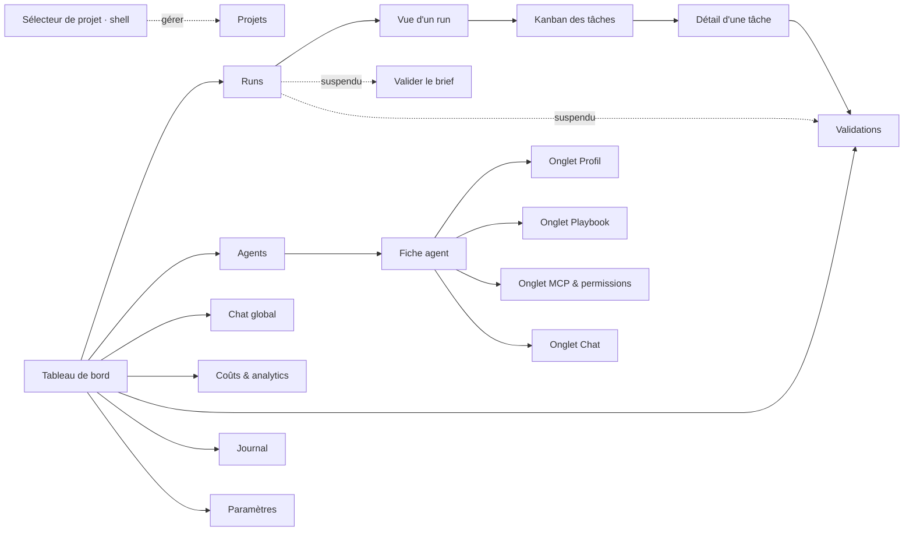

# Interface — Control Tower — Maestro

**Version :** 0.1
La **Control Tower** est l'unique poste de pilotage : superviser, configurer, interagir, assigner, contrôler la capacité. Interface multilingue (français par défaut), pensée pour un profil non technique.

---

## 1. Cartographie des écrans

**Une entrée de menu par intention** (navigation v2, #189). Trois entrées de la
v1 — Agents, Playbooks, Chat — regardaient **le même objet** par trois chemins :
on y choisissait un agent, puis on en consultait une facette. Elles ont fusionné
en **une** fiche agent à onglets, et un agent se consulte d'un seul endroit.

Deux entrées se sont ajoutées depuis — **Projets** (#225) et **Journal** (#249),
où le fil d'activité s'est installé en plein format —, puis **Projets en est
ressortie** (#280, §2.0.1). Le menu est déclaré une seule fois
(`apps/web/lib/navigation.ts`) et fait aujourd'hui **dix entrées** — les deux
écrans de la Phase 8, « Composer un objectif » (#319) et « Valider le brief »
(#322), s'y sont ajoutés, puis **« Runs »** (#474, §2.4.1) ; le Kanban des tâches
n'en est pas une (il est l'objet de la **vue d'un run**, servie sous « Runs »
depuis #476 — §2.4.2) et l'écran Projets non plus (il est servi, mais atteint
depuis le sélecteur du shell).

> ⚠ **Ce menu change deux fois, et les deux ont été décidées le 2026-08-24**
> (revue #470, [docs/29](./29-decision-run-objet-de-premier-plan.md)). Une entrée
> **« Runs »** s'ajoute — **c'est fait** (#474, §2.4.1) : un run n'était l'objet
> d'aucun écran, il a désormais le sien, et **sa vue** depuis #475 (§2.4.2), servie
> sous cette entrée à `/runs/<run_id>` sans en réclamer une nouvelle. La seconde
> moitié de l'arbitrage ① est **livrée elle aussi** : le Kanban a **cessé d'être** le
> tableau de bord (#476 — ce qui renverse #248), qui montre désormais l'état des runs
> (§2.1.2). Les deux entrées de la Phase 8 **partent** en
> sens inverse (#484, arbitrage ②) : composer et valider le brief déménagent dans
> le chat, qui devient la seule porte d'entrée. Rien n'est supprimé de ce que ces
> écrans savent faire ; les chemins restent servis et redirigés. Tant que **ce**
> lot-là n'est pas livré, c'est le texte ci-dessus qui décrit l'écran.



La sidebar, le titre de page et les renvois du tableau de bord lisent tous cette
même déclaration. Les onglets d'un agent le sont de même
(`apps/web/lib/agents.ts`). Une page **servie hors menu** y figure aussi
(`HORS_MENU`) : elle n'a pas d'entrée de navigation mais garde son titre de
barre supérieure, sans quoi un chemin qui marche donnerait un écran anonyme.

### 1.1 Les chemins de la v1 restent servis

Les anciennes URL sont écrites dans la doc, dans des tickets, dans des signets :
elles sont **redirigées vers l'onglet qu'elles visaient**
(`apps/web/next.config.ts`), jamais supprimées.

| Chemin v1 | Redirigé vers | Remarque |
| --- | --- | --- |
| `/catalogue` | `/agents` | la liste des agents |
| `/catalogue/<agent>` | `/agents/<agent>/profil` | |
| `/playbooks` | `/agents?onglet=playbook` | pas d'agent dans l'URL : l'intention est passée à la liste, dont les cartes visent alors cet onglet |
| `/playbooks/<agent>` | `/agents/<agent>/playbook` | |
| `/chat/<agent>` | `/agents/<agent>/chat` | |

`/chat` **nu n'est pas redirigé** : il reste au menu pour le chat **global**, non
lié à un agent (chantier « Chat » de la Phase 6) — c'est une intention distincte.
Les redirections sont temporaires (307) et non permanentes (308) : un 308 est mis
en cache par le navigateur pour de bon, et ces chemins ne pourraient plus être
corrigés côté serveur.

---

## 2. Les écrans en détail

### 2.0 Le projet actif est le cadre de tous les écrans (#281) — **livré**

On entre dans la Control Tower **par** un projet (#279) et tout ce qu'on y voit se rapporte à ce
projet-là. Ce n'est pas une option d'affichage : la portée de §6.0 est passée à **chaque** lecture,
et l'API refuse celle qui n'en porte pas. Côté front, la portée n'a donc **aucun défaut** — un
`?projet=tous` implicite rendrait la vue transverse à qui aurait simplement oublié de cadrer sa
lecture, c'est-à-dire exactement la fuite que ce lot ferme.

**Ce qui est filtré par le projet actif** — tâches et Kanban, indicateurs de tête, validations
(file et historique), coûts (agrégats de période *et* grands livres), journal d'activité, centre de
notifications, et le **flux temps réel** qui les alimente tous.

**Ce qui reste global, et pourquoi** :

| ce qui reste global | pourquoi | ce qui est cadré malgré tout |
| --- | --- | --- |
| `GET /api/agents` — état du parc | un agent est une ressource du **poste** : son playbook, sa capacité et ses instances (#86) valent pour toute la Control Tower. Il n'appartient à aucun projet, et #277 ne lui a pas donné de portée | la tuile « Agents » compte les agents **au travail sur ce projet** (dérivé de ses tâches) et renvoie au détail le parc et les « occupés ailleurs » |
| le **catalogue** d'agents et les **playbooks** | ce sont des définitions, pas du travail — les partager entre projets est l'intérêt d'en avoir | — |
| le **chat** et l'assistant | ils parlent de l'**outil**, pas du projet ; et un `chat.message` ne porte pas de `projet_id`, donc une socket cadrée ne le recevrait **jamais** (§6.0) — le fil se figerait sans rien dire | — |
| les **paramètres** du poste (apparence, notifications, MCP) | réglages de l'installation, pas d'un projet | la dépense cumulée qui y figure, elle, est celle du projet |

**Le coût cumulé change de source** avec ce lot. Il se lisait sur `agents[].cout_usd` — un total de
**tous** les projets, puisque le parc est celui du poste. Il est désormais la somme des **grands
livres** (#57) des exécutions du projet, planification comprise : cadré par construction, et
identique dans les trois endroits qui l'affichent (barre supérieure, tuile « Dépense »,
Paramètres › Coûts) là où l'écart demandait jusqu'ici d'être expliqué.

**Changer de projet remet tout à zéro.** Le shell **remonte** son fournisseur d'état sur l'identité
du projet plutôt que de recharger les données : recharger suffirait pour l'état temps réel, pas pour
ce que les **pages** tiennent elles-mêmes — un filtre du Journal posé sur une tâche de l'ancien
projet, une période sélectionnée, un panneau déplié. C'est ce que le critère appelle un « compteur
figé », et c'est le seul de ses trois cas (cache, flux ouvert, compteur) qu'un rechargement ne
traite pas. Le repli de la sidebar, lui, reste **au-dessus** : c'est une préférence d'affichage.

**Un écran vide le dit, et nomme le projet.** Trois vides se ressemblent et ne se diagnostiquent pas
pareil : une **panne** (API injoignable — bannière, panneaux conservés, §2.1.1), l'**absence de
projet** (la porte d'entrée de #279, qui s'intercale avant que la Control Tower ne soit montée) et
**rien encore sur ce projet**. Le troisième se formule avec le nom du projet — « Rien encore sur
Dépensio » — sur le tableau de bord, le Kanban, le Journal, les Validations et les Coûts : un
« aucun événement » anonyme, sur une Control Tower qui n'en montre plus qu'un, se lit « rien ne
tourne nulle part ».

⚠ **Corollaire à connaître** : un run publié **sans projet** (`maestro-run --publier`, qui n'a pas
d'option de rattachement) ne relève d'aucun projet et n'apparaît donc sur l'écran d'aucun — seule la
vue `aucun` le montre (§6.0). `PosteVide` le dit explicitement, faute de quoi on chercherait une
panne là où il n'y a qu'un périmètre. Rattacher un run se fait par l'écran **« Composer un
objectif »** (§2.7.3, #319), qui pose le projet actif sans le demander — ou, pour un script, par
`POST /api/executions` et son champ `projet_id` (§6.1).

Implémentation : `apps/web/lib/etatGlobal.tsx` (le projet et sa portée diffusés au shell),
`useControlTower` / `useAnalyticsCouts` (les deux lectures cadrées), `components/Shell.tsx` (la clé
de remontage). Couverture : `apps/web/tests/projet-cadre.test.tsx`, et côté API
[`tests/test_appartenance_projet.py`](../tests/test_appartenance_projet.py) (#282).

#### 2.0.1 On entre par un projet, et on en change au shell (#279, #280) — **livré**

Le cadre du §2.0 a deux gestes : y **entrer**, et en **changer**. Ils forment la réponse au
reproche du bilan de la Phase 7 — « le projet devrait être choisi avant d'entrer », « surtout pas
un menu pour les projets ».

**La porte d'entrée** (#279) est une **garde de shell**, pas une redirection de page. La nuance
est tout le mécanisme : une page atteinte directement — lien, signet, rechargement — passe par le
choix du projet **puis rend la page demandée**, sans que l'URL ait bougé entre-temps. Une
redirection l'aurait perdue, et aurait ajouté deux entrées à l'historique du navigateur pour un
geste qui n'est pas une navigation. Ce que l'écran présente : la liste des projets déclarés et la
**création sur place** — aucun projet déclaré n'ouvre pas un vide mais propose d'en créer un. Le
projet actif est **retenu d'une visite à l'autre**, relu au démarrage, et un projet devenu
introuvable ramène à la porte **avec son motif** au lieu d'échouer. Trois vides à ne pas
confondre, ici encore : une API muette n'est pas une absence de projet (on laisse réessayer, et le
choix retenu reprend dès que l'API répond).

**Le sélecteur** (#280) tient dans la barre supérieure, contre le titre de page — on lit « ce
projet-ci, cette page-là ». Il affiche le projet actif **et sa racine** (deux clones d'un même
dépôt portent volontiers le même nom ; c'est le chemin qui dit sur lequel on travaille), et
basculer **ne navigue pas** : le choix est écrit, les écrans se relisent à l'endroit où l'on
était. Sans projet actif il ne rend **rien** — proposer de choisir ici serait une seconde porte
d'entrée à côté de celle ci-dessus, avec deux façons de rater la garde.

**Et l'entrée « Projets » a quitté la barre latérale.** C'est le fond du lot, pas un effet de
bord : une entrée de menu range le projet **parmi** les destinations alors qu'il est le cadre de
toutes. L'écran de #225 n'a pas déménagé pour autant — il reste servi à `/projets`, garde son
titre (`HORS_MENU`, §1) et s'atteint depuis le sélecteur (« Gérer les projets »). Rien à rediriger
dans `next.config.ts`, contrairement aux pages fusionnées du §1.1 : celle-ci n'a pas changé
d'adresse, elle a seulement quitté le menu.

Implémentation : `apps/web/lib/etatProjetActif.tsx`, `components/projets/ChoixProjet.tsx` et
`SelecteurProjet.tsx`, `lib/navigation.ts` (`MENU` / `HORS_MENU`). Couverture :
`apps/web/tests/projet-actif.test.tsx` et `selecteur-projet.test.tsx`.

### 2.1 🏠 Tableau de bord (vue d'accueil)

Il répond à « **où en est-on, et qu'est-ce qui m'attend ?** » **en un écran**
(épuré par #191). Cinq panneaux de plein format s'y disputaient la place ; il n'en
reste que ce qui se lit d'un coup d'œil, dans cet ordre :

1. **Briefs en attente** (#322, §2.7.4) — un run arrêté sur son brief bloque le run
   entier, là où une validation ne retient qu'une tâche : il passe donc devant. Il
   **signale et achemine, il ne décide pas** — sept sections, des questions et un
   coût ne tiennent pas dans une carte.
2. **Validations en attente** — ce qui demande un arbitrage humain.
3. **Runs interrompus** (#349, §6.1) — les runs **orphelins dont le brief a été
   approuvé**, avec le bouton qui les reprend sur ce cadrage. Après les deux
   précédents, et pour une raison de nature : ceux-là retiennent du travail
   **vivant**, un run perdu ne retient plus rien. Rien ne s'affiche quand il n'y a
   rien à récupérer — ni sur un run `indetermine` (on ne sait pas : le proposer
   serait deviner), ni sur un orphelin sans brief approuvé (il n'a rien à rejouer).
4. **Indicateurs de tête** — quatre tuiles : run en cours, tâches par statut,
   agents occupés et libres, dépense. Chaque tuile met en valeur **le chiffre
   qu'on vient y chercher** : la tuile Agents répond « combien travaillent,
   combien sont disponibles ? » et relègue le total et les agents désactivés en
   ligne de détail (#247). Depuis #281 « combien travaillent » veut dire
   **ici** — le parc étant celui du poste (§2.0), seul un décompte dérivé des
   tâches du projet a sa place en tête, les « occupés ailleurs » passant au
   détail.
5. **État des runs** (#476, §2.1.2) — ce qui tourne, ce qui attend quelqu'un, ce
   qui est tombé et ce qui s'est soldé aujourd'hui, chacun avec sa progression et
   un renvoi vers sa vue. Le **Kanban** occupait cette place jusqu'au 2026-08-24
   (#248) ; voir l'encadré ci-dessous.
6. **Aperçu de l'activité** en direct (quelques lignes, pas le fil entier).

Le reste n'a pas été supprimé, il est **rangé**, et **chaque tuile renvoie vers
la page où le détail vit désormais** : les fiches d'agent vers **Agents**, la
capacité vers **Paramètres › Agents & capacité**, le grand livre par exécution
vers **Coûts & analytics**. Ces renvois sont résolus **par le menu** et non par un
chemin écrit en dur : une page qui déménage emmène son renvoi avec elle (c'est ce
qui a fait suivre « Agents » quand il est passé de `/catalogue` à `/agents`), et
un renvoi vers une page **pas encore créée ne s'allume pas** — pas de lien mort
en attendant. C'est ainsi que l'aperçu d'activité a gagné son « voir le
Journal » : la page créée (#249), le lien s'est allumé seul, sans une ligne de
plus dans le composant.

Le **coût cumulé** — celui du projet actif depuis #281 (§2.0) — et le statut du flux
temps réel vivent en permanence dans la barre supérieure, sur toutes les pages. Tout
se met à jour par WebSocket.

> ⚠ **L'item 5 a été renversé le 2026-08-24** (revue #470,
> [docs/29 §3](./29-decision-run-objet-de-premier-plan.md)) et **livré par #476** : le
> **Kanban a quitté le tableau de bord**, qui montre à la place **l'état des runs**.
> Le motif est une question de portée, pas de place : le Kanban rend les tâches du
> **projet** (#277/#281) — ce qui court avec ce qui est fini depuis trois jours —,
> alors que la question « où en est-on ? » porte sur ce qui tourne, c'est-à-dire un
> **run**. Il reparaît entier dans la vue d'un run (#475, §2.4.2). Les items 1 à 4 et
> 6 n'ont pas bougé, et la portée **projet** n'est pas défaite : le run s'y
> **ajoute**.
>
> **#248 n'est pas effacé pour autant**, il est **daté** : « le Kanban prend toute la
> hauteur restante » a décrit cet écran jusqu'au 2026-08-24, et c'est cet encadré qui
> dit ce qui l'a remplacé et pourquoi. Ce que #248 avait gagné n'est pas perdu — la
> hauteur pleine et le défilement par colonne sont partis **avec** le composant dans
> la vue d'un run, où les tâches sont de nouveau l'objet de l'écran. Ce qui disparaît
> ici est seulement leur place **sur cette page**, avec la borne `max-h-96` que #191
> lui avait posée : plus rien ne s'étire sur le tableau de bord, et rien n'a été
> inventé pour reprendre l'étirement — l'état des runs est une liste, une liste se lit
> du haut, et lui donner tout l'écran étirerait du vide les jours calmes.

#### 2.1.1 Le poste vide — ce que montre un démarrage en mode réel (#186)

Le lanceur local démarre en **mode réel** (`bash scripts/controltower/start.sh`,
[doc 07 §6.10](./07-guide-de-demarrage.md)) : la Control Tower est branchée sur la
vraie orchestration, donc **un premier démarrage n'a rien à afficher** — aucune
tâche, aucun événement, aucune validation. Quatre panneaux à zéro feraient croire à
une panne ; l'écran est donc remplacé par **ce qu'il faut faire pour le remplir**
(`PosteVide`), avec les deux gestes possibles :

- **lancer une orchestration dans ce projet** — `POST /api/executions` avec le
  `projet_id` de l'écran (§6.1). `maestro-run --publier "<objectif>"` reste le
  geste en ligne de commande, mais **sans rattachement** : ses tâches n'entrent
  dans la vue d'aucun projet (§2.0), et l'écran le dit plutôt que de le laisser
  chercher ;
- **juste explorer l'interface** — `bash scripts/controltower/start.sh --demo`,
  scénario factice sur bus mémoire, qui **dit** que ses données le sont.

Ce n'est **pas un état d'erreur**, et la distinction est le point de conception :
une API injoignable garde ses panneaux et sa bannière d'erreur, parce qu'un écran
vide *et muet* ne se diagnostique pas comme un écran vide *et connecté*. Depuis
#281 le titre **nomme le projet** (« Rien encore sur Dépensio ») : c'est ce qui
distingue ce vide-là des deux autres (§2.0). Une fois le premier événement publié,
le poste se remplit **sans rechargement** (WebSocket), et l'historique est rejoué au
redémarrage de l'API (journal durable, #97).

#### 2.1.2 L'état des runs — ce qui a pris la place du Kanban (#476) — **livré**

L'item 5 du tableau de bord : les runs du projet actif **groupés par régime**, chacun
avec sa progression et le renvoi vers sa vue (§2.4.2).

| Groupe | Ce qu'il porte |
| --- | --- |
| **En cours** | les runs qui **avancent** — badge bleu à pastille battante |
| **Suspendus** | ceux qui attendent quelqu'un : brief à valider, questions de clarification, arbitrage sur une tâche — avec **depuis quand** |
| **Interrompus** | ceux dont l'hôte ne bat plus (#348) |
| **Soldés du jour** | ceux qui ont rendu leur verdict aujourd'hui — terminé, annulé, échec |

**Le découpage est celui de `regimeDuRun`** (`lib/execution.ts`), le même que la liste
des runs (§2.4.1) et la vue d'un run — jamais un second tri écrit pour cet écran. Il
importe ici plus qu'ailleurs : « en cours » au sens de l'API recouvre un run qui
travaille *et* un run arrêté depuis trois heures sur une question, et c'est le défaut
d'origine du chantier — 53 minutes perdues le 2026-08-14 (#355). Un tableau de bord
qui dirait « 3 runs en cours » sans les séparer referait exactement cette promesse.
De même, **une ligne de run se lit à l'identique** sur les trois écrans : c'est la
`CarteRun` de `components/runs/EtatRun.tsx`, extraite de la liste le jour où un
troisième écran a eu à la rendre.

**Le quatrième groupe n'est pas dans le ticket, et c'est délibéré.** #476 en nomme
trois — en cours, suspendus, soldés du jour — mais `regimeDuRun` en rend **quatre**,
et omettre *interrompu* ferait **disparaître** ces runs-là de l'écran : le panneau
« Runs interrompus » qui les précède (item 3) ne montre que les **récupérables** —
orphelin *et* brief approuvé (#349) —, si bien qu'un run mort avant validation de son
cadrage ne serait nulle part. Sa place, après « suspendus », suit l'arbitrage déjà
rendu un cran plus haut sur le même écran : ce qui retient du travail **vivant** passe
devant ce qui ne retient plus rien.

**Seuls les soldés sont bornés** — au jour, puis à cinq, le groupe disant alors ce
qu'il masque. C'est le seul qui grossisse sans fin, et un run terminé avant-hier
n'apprend rien sur « où en est-on » ; les autres s'affichent **en entier**, puisque
c'est précisément ce que l'écran existe pour montrer. Le renvoi de l'en-tête mène à la
liste, qui les porte tous. Un run soldé sans date de fin est daté de son **début**
(le contrat garde `fin` nullable), et **sans horloge personne n'est du jour** : le
rendu serveur n'a pas d'instant (#250), le groupe apparaît donc au premier battement
— même règle qu'un « il y a 3 min » qui remplace une heure absolue.

**Il ne décide de rien**, et c'est ce qui le sépare des trois panneaux qui le
précèdent : ceux-là portent le geste qui lève une attente, celui-ci porte l'état. Un
run interrompu peut donc paraître deux fois sur l'écran — dans « Runs interrompus »
avec son bouton, et ici avec son état. C'est la superposition que le Kanban avait déjà
avec les validations, et elle est voulue : ce qui appelle un geste passe devant, ce qui
décrit l'état se lit d'un bloc.

Composant : `apps/web/components/runs/EtatDesRuns.tsx`. Couverture : lot 8 (#480) —
`tests/tableau-de-bord.test.tsx` garde en attendant que le Kanban a bien quitté l'écran
et que le renvoi vers la liste y est.

### 2.2 📋 Tâches — tableau Kanban

> ⚠ **« Il *est* l'objet du tableau de bord » a été renversé le 2026-08-24** (revue
> #470, [docs/29 §3](./29-decision-run-objet-de-premier-plan.md)), et le renversement
> est **complet depuis #476**. Le Kanban est désormais **la vue d'un run** (#475,
> §2.4.2) : mêmes colonnes, mêmes cartes, même détail sur place — ce qui change est ce
> qu'il rend, les tâches de **ce run** au lieu de celles du projet entier. Le tableau
> de bord montre l'état des runs (#476, §2.1.2), et une entrée de menu **« Runs »**
> liste ceux du projet actif (#474, §2.4.1). Tout ce qui suit reste vrai du composant ;
> seules sa **portée** et sa page ont changé. #191 (l'épure) et #251 (le détail sur
> place) ne sont pas touchés.
>
> Le retrait s'est fait **en deux temps, à dessein** : #475 a *ajouté* la vue d'un run
> sans rien retirer du tableau de bord — il y était donc aux deux endroits — pour que
> le lot se merge seul sans écran cassé, et #476 a fait le retrait une fois le Kanban
> pourvu d'un autre endroit où vivre. Le composant est **le même**, à une prise près —
> `messageVide`, parce que la phrase par défaut nomme le **projet** et que « rien
> encore sur Dépensio » désignerait le mauvais vide dans la vue d'un run : le projet
> peut être plein pendant que *ce* run n'a créé aucune tâche.

Le Kanban n'a **pas d'entrée de menu à lui** : il est l'objet de la **vue d'un run**,
servie sous l'entrée « Runs » à `/runs/<run_id>` (§2.4.2), et il y prend la place que
lui donnait déjà #248 — la progression rend une tête, le tableau prend **toute la
hauteur restante** et chaque colonne défile chez elle. La borne `max-h-96` de #191
protégeait la densité d'un écran qui portait encore cinq panneaux de plein format ;
ceux-ci sont partis, elle est restée, et les tâches tenaient dans le tiers supérieur
d'un grand écran. En largeur, ce sont
les colonnes qui commandent : une **largeur minimale par colonne** plutôt qu'un
nombre de colonnes, si bien qu'elles s'élargissent jusqu'à 2 560 px et se
replient en lignes en dessous, au lieu d'être toutes tassées de front.

- Colonnes : *Assignées → En cours → Bloquées → Terminées / Échecs* — celles de
  la machine à états du moteur ([docs/03 §3](./03-architecture-technique.md)).
  Un statut que le front ne connaît pas tombe dans une colonne **Autres** plutôt
  que de disparaître de l'écran.
- Chaque carte : titre, ticket externe s'il y en a un (#192), agent assigné,
  statut, coût, tokens et durée.
- **Réassignation manuelle** d'un agent à une tâche (EF-11/EF-20), depuis la
  carte comme depuis le panneau de détail.
- **Le détail s'ouvre sur place** (#251) : un clic sur la carte ouvre un panneau
  modal à droite — description, **étapes** en checklist, **liens utiles**
  (maquette, ticket, dépôt) — et Échap le referme en rendant le focus à la
  carte. Aucune navigation : la vue du run reste où elle était. Une tâche **sans
  détail reste exactement la carte d'avant** : pas de bouton, pas de curseur qui
  promet une ouverture, pas de panneau vide.
- Création d'une tâche : soit en langage naturel (l'orchestrateur la découpe), soit manuellement.

> **D'où viennent ces champs.** `description`, `etapes` et `liens` sont portés
> par le lot modèle **#246**, livré : la projection
> (`maestro/controltower/state.py`) les sert, et le contrat les garde optionnels
> côté front (`apps/web/lib/types.ts`) parce qu'une tâche peut parfaitement n'en
> avoir aucun. Ils atteignent la Control Tower par le **journal** et par lui
> seul (`maestro.detail_tache.consigne_detail` → ligne `<tache>:detail` → pont
> #46 → événement `tache.detail`) : un agent qui découvre en cours de route une
> étape à cocher ou une maquette à ouvrir les consigne, sans faire bouger sa
> tâche d'une colonne. Une tâche que rien n'a renseignée reste donc exactement
> la carte d'avant. Couverture :
> [`tests/test_detail_tache.py`](../tests/test_detail_tache.py) — le modèle, le
> journal, le pont et la projection, **idempotence du rejeu comprise**.

Le **glisser-déposer** entre colonnes reste une **cible non livrée** : le statut
d'une tâche est aujourd'hui posé par la machine à états du moteur, et seule la
réassignation d'agent s'obtient depuis l'écran.

### 2.3 🤖 Agents

L'entrée de menu **Agents** (`/agents`) mène à la **liste** ; chaque carte ouvre
**une** fiche, où les facettes de l'agent tiennent en **onglets**
(`/agents/<agent>/<onglet>`). C'est le point d'entrée unique vers un agent —
il n'y a plus de sélecteur d'agent en tête de trois pages différentes.

- **Liste** : les agents du catalogue (ceux du code, en lecture seule, et les
  personnalisés), avec **créer un agent**. Arrivée avec `?onglet=<onglet>` (par
  une redirection de la v1), les cartes visent directement cet onglet.
- **Fiche agent**, quatre onglets — l'ordre va de l'identité de l'agent à la
  conversation avec lui :

| Onglet | Contenu | Vient de |
| --- | --- | --- |
| 🤖 **Profil** | identité (nom, rôle, modèle, compétences/tags), prompt système éditable, statistiques (tâches traitées, taux de réussite, coût moyen) ; suppression d'un agent personnalisé | page `/catalogue` |
| 📖 **Playbook** | éditeur avec **historique des versions** et retour arrière (EF-25). L'historique porte aussi les **propositions d'auto-amélioration** en attente — brouillons issus des échecs d'un run, à appliquer ou rejeter au clic ([docs/22](./22-auto-amelioration-playbooks.md)) | page `/playbooks` |
| 🔌 **MCP & permissions** | serveurs MCP de l'agent et politique allow/deny effective ([docs/21](./21-configuration-mcp.md)) | n'avait aucune page à soi — seulement le bas de la fiche du catalogue |
| 💬 **Chat** | conversation directe avec l'agent (EF-19) | page `/chat/<agent>` |

L'**activation/désactivation** et le **contrôle de capacité** (**+ / −**
instances, EF-21) se règlent dans **Paramètres › Agents & capacité** ; le tableau
de bord en donne le compte et y renvoie.

**Ces écrans sont les seuls du produit à rester transverses** (#281, §2.0), et c'est une décision
plutôt qu'un reste : un agent est une ressource du **poste**, pas un objet de projet. Sa définition,
son playbook, sa capacité et son état libre/occupé valent pour toute la Control Tower — les
partager entre projets est précisément l'intérêt d'avoir un catalogue —, et `GET /api/agents` ne
porte donc pas de portée (§6.0). Ce qui est cadré, c'est ce que les **autres** écrans en disent :
la tuile « Agents » du tableau de bord compte les agents au travail **sur le projet actif** et
nomme le parc comme partagé. Le jour où un agent deviendrait propre à un projet — un catalogue par
projet, une capacité par projet — c'est ici et au §6.0 qu'il faudrait revenir, pas dans un
composant.

Ajouter une facette à un agent se fait dans `apps/web/lib/agents.ts` : la barre
d'onglets, les cartes de la liste et la route dynamique la lisent toutes.

### 2.4 🔬 Exécutions & traces

- Liste des runs (filtrable par agent/tâche/statut).
- **Trace détaillée** d'un run : étapes, outils appelés, entrées/sorties, tokens, coût, durée, erreurs (EF-22).
- Rejouer / relancer un run.
- Lien vers la trace correspondante dans Langfuse.

**Piloter un run sans quitter l'écran** (#185, livré) : lancement, suivi et
annulation passent par les routes `/api/executions` dont le contrat est figé en
§6.1. Le lancement rend la main **tout de suite** — le run part en arrière-plan et
son `run_id` est connu avant qu'il ne produise quoi que ce soit —, ce qui permet
d'afficher le run « en cours » puis de le suivre par le flux temps réel habituel.
Un run **publié par un autre process** (`maestro-run --publier`, worker #41) est
listé au même titre : le suivi lit la projection, il ne distingue pas l'origine.

> ⚠ **Cette section est le seul endroit où un run est un écran, et c'est ce que le
> 2026-08-24 a changé** (revue #470,
> [docs/29 §3](./29-decision-run-objet-de-premier-plan.md)). Elle décrit un écran qui
> n'a **pas d'entrée de menu** et pas de chemin à lui, alors que le run est ce qu'on
> regarde pendant qu'il travaille. Le chantier #472 en fait un objet de premier
> plan : une entrée **« Runs »** et la liste des runs du projet actif (#474), une
> **vue par run** portant son Kanban et sa progression (#475), le tableau de bord qui
> montre l'état des runs (#476), la **pause** (#477 — elle n'existe à aucun étage
> aujourd'hui, ni UI, ni API, ni moteur), un **journal persisté** qui survit au
> rechargement (#478, là où le fil est éphémère par construction) et un run qui
> **dit pourquoi il s'est arrêté** (#479). L'API qui porte tout cela est #473 ; le
> suivi en pipeline — graphe des tâches, checklists, branches parallèles — est le
> chantier voisin #488. **Les trois premiers lots sont livrés** : l'API (#473, §6.0bis),
> la liste (#474, §2.4.1) et la vue d'un run (#475, §2.4.2).

#### 2.4.1 La liste des runs du projet actif (#474) — **livré**

Une entrée de menu **« Runs »** (`/runs`) liste les runs du projet actif, **du plus
récent au plus ancien**, avec état, objectif, progression et coût. C'est la porte
qui manquait : on entrait dans un run par « Composer un objectif » et on n'y
revenait jamais — les runs passés n'étaient listés nulle part, et un run suspendu
sur son brief n'apparaissait ni au Kanban, ni dans les grands livres, ni dans le fil
d'activité, tous dérivés des tâches.

L'entrée ferme le **groupe de tête** du menu, juste après « Valider le brief » : on
compose, le Chef de projet rédige, on tranche, puis on regarde ce qui tourne. Le
haut du menu porte le travail en cours, le bas les ressources qui le servent et ce
qu'on observe après coup. Elle est déclarée **une fois**
(`apps/web/lib/navigation.ts`) : sidebar, titre de page et renvois lisent la même
liste.

**« En cours » ne veut pas dire « travaille », et c'est tout l'écran.** Un run
arrêté sur son brief, sur des questions de clarification ou sur une validation de
tâche porte le même statut qu'un run qui avance. C'est le défaut d'origine —
**53 minutes perdues le 2026-08-14** (#355) sur une attente de décision humaine
indiscernable du travail en cours. La liste sépare donc **quatre régimes**
(`apps/web/lib/execution.ts`), et l'ordre dans lequel ils sont décidés *est* la
décision :

| Régime | Ce que c'est | À l'œil |
| --- | --- | --- |
| **soldé** | `terminee`, `annulee`, `echec` — le run a rendu son verdict | badge vert / neutre / rouge, immobile |
| **interrompu** | orphelin (#348) : son hôte ne bat plus | badge rouge, la cause nommée |
| **suspendu** | il attend un humain — brief, réponses **ou** validation de tâche | fond ambré, l'attente et son ancienneté, le geste qui la lève |
| **travaille** | rien de ce qui précède | badge bleu à **pastille battante** |

Trois précisions qui expliquent la forme :

- **La troisième attente ne se lit pas sur le run.** Une demande de validation porte
  sa tâche (`tache_id`), jamais son run, et le statut du run reste `en_cours`
  pendant qu'elle dort. L'appariement passe par les tâches, sur les deux listes que
  le shell tient déjà — aucun appel de plus.
- **Un run qui travaille est bleu et bat ; un run terminé est vert et immobile.**
  Deux verts, dont un pulsant, auraient demandé de lire le libellé pour trancher, ce
  qu'un coup d'œil doit éviter. Le libellé est là quand même : la couleur appuie le
  sens, elle ne le porte jamais seule.
- **Un run orphelin l'emporte sur un run suspendu**, et c'est le seul arbitrage
  discutable : un orphelin arrêté sur son brief *attend* bien, mais personne ne
  recevra la réponse. Il faut le **reprendre** (#349), pas lui répondre.

**L'ordre vient du backend** (`GET /api/executions` rend ses résumés récents
d'abord, §6.1) et **la progression n'est pas recomptée** : elle arrive comptée sur
la machine à états du moteur (#473, §6.0bis). Recompter ici depuis les tâches
chargées ferait d'une barre d'avancement la mesure de sa propre pagination ;
retrier poserait une seconde règle d'ordre à tenir d'accord avec la première pour un
résultat identique. La progression est **optionnelle** dans le contrat — une trace
d'un backend antérieur n'en porte pas —, d'où le repli sur `nb_taches` : dire
« 8 tâches » sans savoir où elles en sont vaut mieux qu'une barre inventée. Et un
run **sans aucune tâche** le dit : c'est l'état normal d'un run arrêté sur son
brief, pas le symptôme d'une lecture ratée.

**Vide, l'écran n'est pas une panne** (§2.1.1) : il **nomme le projet** (convention
#281), dit ce qui s'y inscrira et propose « Composer un objectif ». Une API
injoignable, elle, garde sa bannière et **rien d'autre** — conseiller « lancez un
run » à qui n'a pas de backend serait un contresens, exactement l'argument du poste
vide.

Enfin, **une carte s'ouvre** (#475) : son titre mène à la vue du run, §2.4.2. Le
chemin est dérivé de l'entrée de menu (`hrefRun`, `apps/web/lib/navigation.ts`) et
non écrit en dur — c'est la règle de #191 tenue dans l'autre sens, celui de la
fabrication : une page à segment dynamique n'a pas d'entrée à elle, elle vit **sous**
celle de sa liste. L'autre renvoi, lui, ne change pas : une **attente** mène toujours
à l'écran qui porte **le geste** qui la lève — « Valider le brief » pour un brief ou
des questions, « Validations » pour un arbitrage de tâche —, parce que la vue d'un run
le *montre* sans le débloquer. Le jour où elle portera ces gestes, c'est la table
`ATTENTES` (`components/runs/EtatRun.tsx`) qu'il faudra changer, et elle seule.

#### 2.4.2 La vue d'un run — son Kanban et sa progression (#475) — **livré**

`/runs/<run_id>` : la **progression** du run en tête, son **Kanban** dessous. Ouvrir
un run donne enfin son backlog — jusqu'ici le Kanban était celui du **projet** (#248)
et un run n'avait pas de vue à lui, si bien que dans un projet où plusieurs runs se
succèdent, *ce que ce run avait fait* n'était visible nulle part.

**Le Kanban est réutilisé, pas réimplémenté.** C'est le composant de §2.2 :
mêmes colonnes, mêmes cartes, même **détail sur place** (#251), même réassignation.
Ce qui change est ce qu'on lui donne — les tâches de ce run — et une seule prise a été
ajoutée, `messageVide`, parce que la phrase par défaut nomme le projet (voir l'encadré
de §2.2). Il **reste** au tableau de bord jusqu'au lot 4 : ce lot ajoute une vue, il
n'en retire aucune, pour se merger seul sans écran cassé.

**L'appartenance au run vient de l'API, jamais d'un filtre local.** Les tâches sont
lues par `GET /api/taches?projet=…&run=<run_id>` (§6.0bis). Filtrer
`etatGlobal.taches` sur `Tache.run_id` aurait été la solution gratuite et elle est
**fausse** : ce champ porte le *dernier* run qui a touché la tâche, or un identifiant
de tâche est un slug engendré depuis son contenu, donc partagé entre un run et sa
**relance** (#349) — la vue d'un run y perdrait les tâches que son propre successeur a
reprises.

**La progression n'est pas recomptée** (#473) : elle arrive comptée sur la machine à
états du moteur, avec ses six compartiments et son `soldees`. La barre est la même que
celle de la liste, en format `ample` — dans une liste elle s'empile par dizaines, ici
elle est *la* réponse à « où en est-il ? ». Le badge, l'attente et l'interruption sont
eux aussi ceux de la liste (`components/runs/EtatRun.tsx`, extrait de #474 le jour où
un second écran a eu à dire la même chose) : un run lu « Brief à valider » dans la
liste et « En cours » dans sa vue serait un run dont on doute.

**Le temps réel est celui du shell — aucune seconde WebSocket.** Le shell en ouvre une
pour toute l'application et coalesce les rafales (#117/#281) ; une vue qui rouvrirait
la sienne doublerait connexions et requêtes pour un flux identique. Elle s'abonne donc
au **pouls** du shell (`ControlTower.revision`, un compteur incrémenté à chaque lecture
aboutie) et relit ses tâches à chaque battement — chargement initial, reconnexion,
rafale d'événements. Un compteur et non « le tableau `taches` a changé d'identité » :
la seconde formule marcherait aujourd'hui et cesserait sans bruit le jour où un
rechargement comparerait avant de poser son état.

Trois cas qui ne se confondent pas :

| Situation | Ce que l'écran montre |
| --- | --- |
| run **d'un autre projet**, ou identifiant inexistant | il le **dit** et renvoie à la liste — jamais un Kanban vide, qui se lirait « ce run n'a rien fait » (c'est la raison du 404 `run-inconnu`, §6.0bis) |
| run **arrêté sur son brief** | Kanban vide **expliqué** : la décomposition n'a pas eu lieu, c'est son état normal |
| **API injoignable** | la bannière, et rien d'autre |

Le run lui-même est lu dans `executions`, la liste que le shell tient déjà pour le
projet actif : elle porte tout ce que la tête affiche — statut, vitalité, progression,
coût, ancienneté de l'attente — et se met à jour d'elle-même, sans un appel de plus.
Un run qui en **reprend** un autre (#349) le dit et y mène : sans ce renvoi, le cadrage
déjà payé et les tâches du run repris seraient hors de portée depuis celui qui les
continue.

### 2.5 💰 Coûts & analytics

- Coût par agent / par projet / par jour, sur une **période sélectionnable** :
  total, évolution dans le temps, répartition par agent, détail par tâche et par
  exécution.
- **Grand livre par exécution** (#58) — le détail ligne à ligne (part de
  planification, coût par tâche, agrégat du run), rangé ici par #191 sous les
  agrégats qui le résument. Il ne dépend pas du filtre de période, d'où sa place
  à part sur la page.
- Une tâche issue d'un **ticket externe** porte le lien vers ce ticket, dans le
  Kanban comme dans les deux tables de coûts (#192). Seules les URL `http`/`https`
  sont suivies : la référence vient du flux, un `href` non filtré exécuterait du
  code. Une URL non suivable s'affiche en **texte**, jamais en lien mort.
- Débit (tâches/heure), taux de réussite, durée moyenne.
- **Plafonds de budget** et alertes configurables.

« Coût **par projet** » n'est plus une colonne mais le **cadre** de la page (#281, §2.0) : les deux
sources — agrégats de période et grands livres — portent la même portée, si bien qu'elles ne
peuvent pas se contredire. Un total de période inférieur à la somme des grands livres se lirait
comme un bug là où ce ne serait qu'un mélange de périmètres. Et quand la période ne rend rien, la
page **le dit avec le nom du projet** : les compteurs à zéro restent (« 0 $ » est une réponse) mais
les tables s'effacent, et l'écran passerait sinon pour à moitié chargé.

### 2.6 ✅ Validation humaine (human-in-the-loop)

Quand un agent atteint une action sensible, une carte **« Validation requise »** apparaît :
- Description de l'action (ex. « Déployer en production », « Migration : suppression de colonne »).
- Contexte et diff proposé.
- Boutons **Approuver** / **Refuser** / **Modifier la consigne**.
- Le run reste en pause jusqu'à la décision (EF-08).

File d'attente **et** historique sont cadrés sur le projet actif (#281, §2.0) : on ne tranche pas
depuis cet écran l'arbitrage d'un projet qu'on n'a pas sous les yeux, et la cloche de la barre
supérieure ne compte pas ce qu'il ne montre pas. L'écran vide sépare deux cas que « aucune
validation en attente » confondait : *rien encore sur ce projet* et *rien en attente, mais des
arbitrages déjà rendus* — l'historique en dessous le prouve.

### 2.7 📁 Projets et composition d'un objectif *(retenu — [docs/24](./24-projets-locaux-et-poste-de-travail.md), **Phases 7 et 8**)*

> Écrans **retenus** — décisions D1, D2 et D5 de
> [docs/24 §8](./24-projets-locaux-et-poste-de-travail.md) rendues le 2026-08-04 (#218). Ils
> comblent le trou constaté au §1 de ce cadrage : la Control Tower pilotait des exécutions qui
> n'appartenaient à aucun projet et dont les livrables atterrissaient dans un dossier de sortie,
> jamais chez l'utilisateur. La **Phase 7 a livré** les deux qui la concernent — l'écran Projets
> (§2.7.1) et l'application des livrables, qui emprunte l'écran de validation du §2.6. Les deux
> autres relèvent de la **Phase 8**, et sont livrés tous les deux : **composer un objectif**
> (§2.7.3, #319) et **valider le brief** (§2.7.4, #322). Les quatre écrans sont donc désormais
> spécifiés au niveau de détail des §2.1 à 2.6 — la réserve de cet encadré est levée.

- **Projets** — la liste des projets, chacun avec sa **racine sur le disque**, son type
  (nouveau / dépôt existant) et son périmètre. Le choix du dossier se fait par un **explorateur
  servi par l'API** : un navigateur ne livre jamais de chemin absolu, c'est donc le backend —
  qui tourne déjà sur le poste — qui énumère. Une racine hors périmètre autorisé est **refusée
  avec son motif**, jamais silencieusement ignorée (EF-38). **Livré** : l'API au §6.7 (#223),
  l'écran au §2.7.1 (#225), le choix du dossier élargi au §2.7.2 (#278).
- **Composer un objectif** *(livré — #319, #317)* — le formulaire de lancement gagne, à côté du
  texte, des **sources** (§6.1 étendu) : fichiers déposés, dossier de références en lecture seule,
  URL. L'extraction est visible (ce qui a été lu, ce qui a été ignoré, le coût estimé). L'écran est
  au §2.7.3, l'aperçu qu'il consomme au §6.9 et le téléversement qui lui donne de vrais octets au
  §6.8.
- **Valider le brief** *(livré — #322)* — avant toute décomposition, le Chef de projet présente un
  **brief structuré** (objectif, périmètre, hors-périmètre, contraintes, critères d'acceptation,
  hypothèses) et **ses questions**. C'est le point de contrôle le plus rentable du produit :
  corriger un plan coûte un message, corriger douze tâches coûte douze exécutions. L'écran est au
  §2.7.4 ; il sert les deux attentes du run — répondre aux questions (#321) puis approuver, corriger
  ou refuser (#320) — et met le **coût déjà engagé** en face de la décision.
- **Appliquer dans le projet** *(livré — #227, EF-37)* — la remise des livrables dans le dossier
  de l'utilisateur est une **action sensible** : elle emprunte l'écran de validation ci-dessus
  (§2.6), diff à l'appui. Rien de neuf côté mécanisme, un nouveau type d'action côté contenu —
  la demande de validation porte simplement un champ `diff` de plus (fichiers touchés, lignes
  ajoutées/supprimées, branche fusionnée), que le panneau des validations affiche avant la
  décision. Sur refus, **rien n'est écrit** et le travail reste consultable : la branche de tâche
  n'est jamais supprimée, la copie reste où elle est.

Le sélecteur de projet devient alors un élément permanent de la barre supérieure : le Kanban,
les coûts et le journal se lisent **par projet**. C'est **fait** — les écrans sont cadrés sur le
projet actif et un changement de projet les remet à zéro (#281, §2.0) ; le sélecteur lui-même, la
porte d'entrée et la sortie de « Projets » du menu sont au §2.0.1 (#279, #280).

#### 2.7.1 L'écran Projets (#225) — **livré**

Le premier des quatre écrans ci-dessus est **spécifié et implémenté** ; l'application des livrables
l'est aussi, par l'écran de validation du §2.6, composer un objectif depuis #319 (§2.7.3) et valider
le brief depuis #322 (§2.7.4). Les quatre y sont donc, et la réserve de l'encadré est levée.
Implémentation : `apps/web/app/projets/page.tsx` et `apps/web/components/projets/`, contre les six
routes du §6.7 ; couverture `apps/web/tests/projets.test.tsx` côté UI,
[`tests/test_projets_api.py`](../tests/test_projets_api.py) côté API.

**Place dans la navigation** — l'écran a d'abord eu une entrée **« Projets »** juste après le
tableau de bord ; elle a été **retirée** par #280 (§2.0.1), le projet étant le cadre des écrans et
non l'un d'eux. L'écran reste servi à `/projets` et s'atteint depuis le sélecteur du shell. Ce qui
n'a pas changé : déclarer *où* Maestro travaille n'est pas un réglage du poste — ce n'est toujours
pas une section des Paramètres.

**Ce que la liste montre**, une carte par projet : le **nom**, la **racine** canonicalisée telle que
le backend l'a enregistrée, l'**origine** (« Dossier existant » / « Nouveau dossier »), le **VCS
constaté** (`git · <branche>`, ou « Non versionné » — jamais tu, puisque c'est lui qui décide du
patron d'écriture de #224), le **périmètre** (inclus, exclus) et les dates. Aucun projet déclaré
n'est pas une liste vide mais une phrase qui dit ce qu'on perd à ne pas en déclarer.

**Déclarer et modifier** passent par le **même formulaire**, parce que `PUT` est un remplacement
intégral (§6.7) : deux formulaires distincts finiraient par ne plus porter les mêmes champs. Toute
écriture est suivie d'un **rechargement de la liste** — la racine est canonicalisée et le VCS
constaté côté serveur, donc afficher ce qu'on a envoyé ferait diverger l'écran du disque.
L'**origine ne s'édite pas** après coup : elle raconte comment le projet est né, la réécrire ne
changerait rien sur le disque.

**Choisir la racine** — le point dur, et la raison d'être de l'explorateur du §6.7. L'écran navigue
dossier par dossier (entrer, remonter, revenir aux dossiers explorables), affiche le marqueur
**dépôt Git** et grise les dossiers **déjà déclarés** par un autre projet. Le seul cas où le dossier
visé n'existe pas encore — origine « nouveau » — se résout **sans exception à la règle** : le
**parent** vient de l'explorateur et l'utilisateur ne saisit qu'un **nom de dossier**, refusé s'il
contient un séparateur. Le §2.7.2 ajoute deux raccourcis vers un dossier lointain, sans changer
qui valide quoi.

**Un refus est une réponse** (EF-38), et il en porte trois choses : la **phrase** du backend, le
**geste** qui en sort quand l'écran le connaît (élargir `MAESTRO_EXPLORATEUR_RACINES`, descendre
d'un cran, choisir un sous-dossier…) et le **motif** brut, affiché tel quel — un code stable vaut
mieux qu'une traduction approximative quand il faut chercher de l'aide. Un refus s'affiche **à
l'endroit du geste refusé** (dans le formulaire, sur la carte, dans l'explorateur), **conserve la
saisie en cours** et **laisse la page précédente** de l'explorateur à l'écran : l'erreur ne casse ni
la navigation ni le reste de l'écran. Corollaire tenu par les tests : « ce dossier n'a pas de
sous-dossier » et « je refuse de regarder là » ne s'affichent **jamais** pareil.

#### 2.7.2 Choisir un dossier n'importe où sur son poste (#278) — **livré**

Le second reproche du bilan de la Phase 7 : **le choix du répertoire était trop limité**.
L'explorateur de #223 n'ouvrait que le dossier utilisateur, si bien qu'un projet posé sur `D:/` ou
sur un disque externe n'était pas atteignable — la seule sortie étant `MAESTRO_EXPLORATEUR_RACINES`,
un réglage d'environnement pour un geste d'écran.

Trois voies, désormais, et **aucune n'est un passage obligé** :

| Voie | Quand | Ce qu'elle suppose |
| --- | --- | --- |
| **Explorateur élargi** | toujours | la frontière contient les **volumes du poste**, et la page d'entrée propose des **points d'entrée** étiquetés (dossier utilisateur, récents, projets déclarés, disques) — voir §6.7 |
| **Sélecteur natif du poste** | backend sur la machine de l'utilisateur | le backend ouvre le dialogue de dossier de l'OS ; indisponible, il **le dit** à la place du bouton |
| **Chemin saisi** | toujours, mode serveur compris | l'API vérifie le chemin — le navigateur ne valide rien |

**Ce qui n'a pas bougé d'un pouce : la frontière de sécurité.** Élargir les *racines explorables*
n'est pas élargir les *racines déclarables* ([docs/24 §2.5](./24-projets-locaux-et-poste-de-travail.md)).
`.ssh`, `AppData`, les dossiers système et le dépôt de Maestro continuent de refuser avec leur
motif, y compris là où la frontière les contient désormais ; une racine de disque reste
indéclarable comme racine de projet ; et `MAESTRO_EXPLORATEUR_RACINES` reste une **restriction** —
les volumes ne sont proposés que là où la frontière est celle par défaut, sans quoi élargir le
défaut aurait élargi les postes qui s'étaient explicitement bornés.

**Le verdict du sélecteur natif sépare deux questions** : le dossier choisi est-il **lisible**, et
est-il **déclarable** ? Un `D:/` répond oui à la première et non à la seconde. Il ne revient donc
pas en erreur mais **avec son motif**, et l'écran ouvre l'explorateur **dessus** — de quoi
descendre d'un cran plutôt que de tout recommencer. Fermer la fenêtre, enfin, n'est pas une erreur :
c'est un geste normal, qui ne touche à rien.

Le sélecteur natif de l'**enveloppe de bureau** reste prévu en Phase 9
([docs/24 §4.4](./24-projets-locaux-et-poste-de-travail.md)) ; ce lot ne l'a pas attendu pour lever
le blocage, et ce qu'il livre ne le rend pas caduc — un backend distant n'aura jamais de dialogue
natif, et c'est l'enveloppe qui apportera le glisser-déposer.

Implémentation : `maestro/controltower/selecteur.py` et `projets.py` (`points_entree`),
`apps/web/components/projets/ExplorateurDossiers.tsx`. Couverture :
[`tests/test_selecteur.py`](../tests/test_selecteur.py),
[`tests/test_projets_api.py`](../tests/test_projets_api.py) et `apps/web/tests/projets.test.tsx`.

#### 2.7.3 Composer un objectif (#319) — **livré**

> ⚠ **Cet écran a été condamné le 2026-08-24, et ce qu'il fait ne l'est pas** (revue #470,
> [docs/29 §4](./29-decision-run-objet-de-premier-plan.md)). Le **chat devient la seule porte
> d'entrée** : objectif, fichiers, dossiers et liens se déposent dans le fil (#482), et l'écran part
> une fois qu'il n'a plus rien d'unique (#484). C'est un **déménagement**, pas une suppression —
> l'ingestion, l'aperçu et leurs contrats (§6.8, §6.9) sont rebranchés tels quels, et `/composer`
> reste servi et redirigé. Le paragraphe « Place dans la navigation » ci-dessous est celui qui
> tombe : l'argument « une action qu'on ne trouve pas est une action qui n'existe pas » reste vrai,
> mais l'endroit où on la trouve devient le fil.

Le troisième des quatre écrans, et celui par lequel on **entre** dans un run. Jusqu'ici lancer une
orchestration passait par `curl` : `POST /api/executions` ne prenait qu'un objectif **texte** et le
poste vide (§2.1.1) renvoyait à la ligne de commande. Un cahier des charges de quinze pages n'avait
qu'un chemin, le copier-coller — et un objectif flou produisait un plan flou dont l'erreur ne se
voyait qu'après N tâches payées.

**Place dans la navigation** — au **menu**, juste après le tableau de bord, et c'est un choix.
« Projets » en est sorti (#280) parce qu'un projet est le **cadre** des écrans et non l'un d'eux ;
composer, à l'inverse, est une **action**, et une action qu'on ne trouve pas est une action qui
n'existe pas. Le poste vide y renvoie désormais par un bouton, à la place de la commande `curl`
qu'il affichait — la commande reste servie, elle est ce dont un script a besoin.

**Ce que l'écran compose**, dans cet ordre : l'**objectif** en langage naturel, puis les **sources**
— fichiers **déposés**, **dossier de références** et **adresses**. Le run est rattaché au **projet
actif** (#281) sans le demander : le projet est le cadre de l'écran, pas un champ de plus. Les
garde-fous du lancement (§6.1) restent aux défauts du moteur ; les exposer est un autre sujet que
celui de la matière.

**Le dossier vient de l'explorateur, jamais d'une saisie** — le composant du §2.7.2 est réutilisé
tel quel. Un navigateur ne livre pas de chemin absolu : le seul chemin absolu de cet écran est donc
un chemin que l'API a énuméré, et il passe par les mêmes frontières (EF-38) que la racine d'un
projet.

**L'aperçu est gratuit, et c'est un geste** (§6.9). Rien n'est lu tant qu'on ne le demande pas, et
le demander ne lance rien : le rapport rend, **par source**, ce qui sera lu / tronqué (avec la
limite atteinte) / ignoré (avec son motif), et le **coût estimé en tokens**. C'est ce qui rend le
geste réversible **tant qu'il est gratuit** — corriger une saisie coûte un clic, corriger douze
tâches coûte douze exécutions ([docs/24 §3.4](./24-projets-locaux-et-poste-de-travail.md)). Toute
modification d'une source **périme** le rapport plutôt que de le laisser décrire un état que plus
rien ne produit : un aperçu qui traîne est pire que pas d'aperçu.

**Un refus s'affiche à l'endroit du geste refusé**, comme au §2.7.1 et pour la même raison. La
nuance qu'apporte ce lot est l'**index** : l'API dit *quelle* source elle refuse (§6.1), donc le
bandeau se pose **sur la ligne de cette source** et non en tête d'écran — « une source est trop
grosse » sans dire laquelle obligerait à tout relire pour savoir quoi retirer. Le refus qui ne vise
aucune source (objectif vide, backend injoignable) reste au bouton qui l'a provoqué. Dans les deux
cas la **saisie est conservée** : un objectif de quinze lignes effacé par un refus de plafond est
un objectif qu'on ne réécrit pas.

**Et « ignoré » n'est pas un refus.** Un `.png` au milieu d'un dossier de maquettes est un
**constat**, rangé en ton neutre dans le rapport ; une racine interdite ou un plafond dépassé est un
**refus**, en ambre, qui remonte au geste. C'est la même distinction qu'au §2.7.1 entre « ce dossier
n'a pas de sous-dossier » et « je refuse de regarder là », et elle est tenue par les tests.

**Deux temps pour un fichier**, enfin, et c'est le contrat du §6.8 : l'aperçu porte les **octets**
(il ne dépose rien), le lancement porte les **identifiants** rendus par `POST /api/sources`. Le même
fichier voyage donc deux fois par deux chemins, parce que ce sont deux questions différentes —
« qu'est-ce que ça donnerait ? » et « garde ça pour le run ».

Implémentation : `apps/web/app/composer/page.tsx` et `apps/web/components/composer/`, contre les
trois routes des §6.1, §6.8 et §6.9 ; `maestro/sources/apercu.py` côté backend. Couverture :
`apps/web/tests/composer.test.tsx` côté UI, [`tests/test_apercu_sources.py`](../tests/test_apercu_sources.py)
côté API — le reste de la Phase 8 est différé au lot final #323.

#### 2.7.4 Valider le brief (#322) — **livré**

> ⚠ **Le brief déménage dans le chat le 2026-08-24 ; il ne disparaît pas** (revue #470,
> [docs/29 §4](./29-decision-run-objet-de-premier-plan.md)). La décision **D5** tient — on ne
> décompose pas avant validation humaine —, et c'est précisément ce qui a été tranché : supprimer
> l'écran de composition était clair, supprimer le **point de contrôle** ne l'était pas, et il ne
> l'est pas. Les questions de clarification et les sept sections se décident **dans le fil** (#483),
> l'entrée de menu part avec celle de « Composer » (#484), `/brief` reste servi et redirigé. Un
> paragraphe ci-dessous garde toute sa force et devient un argument **pour** le déménagement : « un
> run suspendu sur son brief ne crée aucune tâche, donc ni le Kanban, ni les grands livres, ni le
> fil d'activité ne le montrent » — c'est le constat qui fait du run un objet de premier plan
> (#472, §2.4).

Le dernier des quatre écrans, et le **point de contrôle le plus rentable du produit** : corriger un
brief coûte un message, corriger douze tâches coûte douze exécutions (décision D5, #218). Le run est
arrêté ici — en vol, mais immobile — et rien ne repartira sans un geste.

**Place dans la navigation** — au **menu**, juste après « Composer un objectif », dont il est
l'autre moitié : on compose, le Chef de projet rédige, on tranche. Au menu bien qu'on y arrive le
plus souvent par la cloche ou par le tableau de bord, et pour une raison qui n'est pas de confort :
un run suspendu sur son brief **ne crée aucune tâche**, donc ni le Kanban, ni les grands livres, ni
le fil d'activité ne le montrent. Une destination qui n'apparaît que le jour où quelque chose
l'appelle est une destination qu'on ne pense pas à ouvrir. La file y est vide la plupart du temps,
et le dit en nommant le projet (#281).

**Deux attentes, deux écrans, et jamais le même geste proposé.** Le statut du run tranche :

- `en_attente_reponses` (#321) — le Chef de projet a **posé des questions**. On y répond, le brief
  est régénéré en entier. Aucun bouton « approuver » n'est offert : demander d'approuver ce sur quoi
  on vient d'interroger quelqu'un est une impasse. Le brief est là, mais **en lecture** — il va être
  réécrit, le corriger maintenant serait un travail jeté. Le **plafond est annoncé** (« tour 1 sur
  2 ») parce que savoir s'il reste un tour change la façon de répondre. Une réponse **vide** est
  licite et vaut « je ne sais pas » : la question part en **hypothèse explicite** plutôt que d'être
  reposée, ce qui permet de répondre à trois questions sur cinq sans bloquer le run ;
- `en_attente_brief` (#320) — le brief est complet. Les **sept sections** sont lisibles et
  **éditables** (objectif, périmètre, hors-périmètre, contraintes, critères d'acceptation,
  hypothèses, questions), puis **Approuver** / **Refuser**.

**La correction précède l'accord, elle ne le suit pas.** Chaque liste est un champ libre, **une
entrée par ligne** : corriger un brief, c'est réécrire des phrases — un champ par puce
transformerait « retire ces deux critères » en quatre gestes de gestion de liste, et c'est cette
friction-là qui fait approuver sans lire. Ce qui repart est ce qu'on a sous les yeux : un brief
**touché** part corrigé (`brief`, et le bouton le dit — « Approuver la version corrigée »), un brief
**intact** part en `null`, ce qui fait retenir au moteur sa propre proposition sans la faire
retraverser la validation de schéma. Un **refus n'emporte jamais de brief**, même après correction.

**Une section vide se dit « — », elle ne disparaît pas.** « Aucune contrainte » est une affirmation
du Chef de projet, un blanc serait un oubli de l'écran — c'est ce que le schéma partagé garantit en
n'omettant jamais une clé (`packages/shared/schemas/brief.schema.json`, #318). Les **tours de
clarification déjà joués** se relisent au-dessus
du brief, question par question, et une question restée **sans réponse** est nommée telle : une
hypothèse qui sort d'un « je ne sais pas » assumé ne se conteste pas comme une hypothèse que
personne n'a vue passer.

**Le coût est en face de la décision**, dans le même bloc que les deux boutons — pas en tête
d'écran. Deux montants de **nature différente**, et l'écran ne les confond pas : ce qui est **déjà
engagé** est *mesuré* (le grand livre du run, #57 — à ce stade, lire les sources et rédiger le
brief, rien d'autre n'ayant tourné) ; ce que l'accord engage est *estimé*, en **fourchette**, à
partir des critères d'acceptation du brief **tel qu'il serait approuvé** — retirer trois critères
fait baisser l'estimation sous les yeux de qui les retire. Les chiffres viennent de
[docs/09 §4.3](./09-exemple-chiffre.md) et d'aucune mesure de ce run-ci, d'où le « ≈ » et la phrase
qui le dit : un chiffre dont on ignore la provenance ne se conteste pas, donc ne se décide pas. Et
il est rappelé que **refuser n'engage rien de plus** — aucune tâche n'a été créée. C'est la moitié
de l'information qu'on oublie, et celle qui fait la différence entre un refus **rationnel** et un
refus **timide** : sans elle on n'ose pas jeter ce qu'on a déjà payé.

**Ce qui attend est signalé là où on regarde** (#48 pour le patron) : la **cloche** de la barre
supérieure compte les briefs à côté des validations — une seule pastille, parce que la question est
« combien de choses m'attendent ? », mais une étiquette qui **nomme** les deux familles —, et le
**tableau de bord** porte un panneau « Briefs en attente » au-dessus des validations : un brief
suspendu bloque le run entier là où une validation ne retient qu'une tâche. Les deux **acheminent
sans décider**, contrairement aux cartes de validation : sept sections, des questions et un coût ne
tiennent pas dans un panneau, et proposer d'approuver là inviterait à trancher sans lire —
c'est-à-dire à défaire le point de contrôle. L'**ancienneté** de l'attente est dite partout (#321) :
sans elle, un run suspendu est indiscernable d'un run planté.

Implémentation : `apps/web/app/brief/page.tsx` et `apps/web/components/brief/`, contre quatre
routes — `GET /api/executions` (quels runs attendent), `GET /api/executions/{run_id}` (le brief, le
grand livre et la trace, d'un seul appel), `POST /api/executions/{run_id}/brief/decision` (#320) et
`POST /api/executions/{run_id}/brief/reponses` (#321). Les deux dernières sont consignées au
**§6.10** (#323) ; le §6.1 porte le régime du brief au lancement et les deux statuts d'attente.
`apps/web/lib/brief.ts` porte les règles hors JSX (qui attend, comment un
brief se donne à corriger, comment se relit un aller-retour) et `apps/web/lib/estimation.ts` l'ordre
de grandeur avec sa source. Couverture : `apps/web/tests/brief.test.tsx` et
`apps/web/tests/composer-sources.test.tsx` côté UI, [`tests/test_brief.py`](../tests/test_brief.py)
et [`tests/test_clarifications.py`](../tests/test_clarifications.py) côté API (#323).

### 2.8 🗒️ Journal — l'activité en direct, en plein format *(#249, #250 — **livré**)*

Le fil d'activité a **quitté le tableau de bord pour sa propre entrée de menu**.
Le tableau de bord n'en garde qu'un **aperçu** de quelques lignes, avec le
renvoi « voir le Journal » ; la page, elle, rend le fil entier avec de quoi s'y
retrouver : filtres par **type d'événement** (nommé en français), par **agent**
et par **tâche**, **recherche texte** — qui cherche jusque dans le détail que la
ligne n'affiche pas — et une case **« notable seulement »** qui reprend
exactement le filtre de la cloche, pour que les deux ne puissent pas diverger
sur ce qui mérite l'attention. Les options des listes sont **tirées du fil
lui-même** : aucune liste à maintenir quand le backend enrichit le flux, aucune
option morte.

Ce qu'on lit sur une ligne, ce n'est plus un identifiant suivi d'un statut mais
**qui fait quoi, sur quoi, avec quel résultat** (#250) — « dev a terminé
« Écrire les tests » » plutôt que « tache-42 — Terminée (dev) ». Trois règles
tiennent l'écran :

- **Une rafale se replie en une ligne.** Les N transitions d'une même tâche
  rapprochées dans le temps se comptent (« 4 étapes ») et se déplient dans
  l'ordre où elles se sont jouées — alors que le fil, lui, va du plus récent au
  plus ancien.
- **Rien n'est perdu.** L'identifiant, le statut du bus et le texte libre du
  moteur sont **à un clic**, au même endroit sur toutes les lignes.
- **L'horodatage est relatif** près du présent (« il y a 3 min ») et redevient
  absolu au-delà de la semaine ; l'heure exacte reste en infobulle.

Ce fil est **éphémère** par construction : il ne contient que ce qui est passé
par le WebSocket depuis l'ouverture de la page, l'état de référence restant le
REST — et l'écran le dit. Un journal **persisté et requêtable** existe côté
contrat (`GET /api/journal`, §6.2) mais n'est pas encore servi : cette page ne
le promet pas.

---

## 3. Parcours utilisateur clés

> Ces trois parcours sont **schématisés** dans [docs/26 §4 et §7](./26-schemas-cas-usage.md) — le
> parcours A en diagramme de séquence (qui parle à qui, et où le run est en pause), B et C en
> enchaînements d'écrans. Le cycle de vie d'une tâche, qui commande les colonnes du Kanban du §2.2,
> y est au §6.

### Parcours A — De l'idée au livrable
1. L'utilisateur saisit un objectif sur le tableau de bord.
2. Le Chef de projet crée les tickets ; ils apparaissent dans le Kanban.
3. Les agents démarrent en parallèle ; l'utilisateur suit en direct.
4. Une validation est demandée → l'utilisateur approuve.
5. Synthèse finale affichée ; livrables (PR, maquettes…) liés.

### Parcours B — Personnaliser un agent
1. Aller dans **Agents → fiche du Designer → onglet Playbook**.
2. Ajouter une règle de charte dans l'éditeur.
3. Enregistrer (nouvelle version) → s'applique à la tâche suivante, sans redéploiement.
4. Sans quitter la fiche, l'onglet **Chat** permet d'éprouver la règle sur-le-champ.

### Parcours C — Ajuster la capacité
1. Pic de charge sur le développement.
2. Depuis le tableau de bord, la tuile **Agents** renvoie à la liste ; la
   capacité se règle dans **Paramètres → Agents & capacité**.
3. Augmenter le nombre d'instances du Développeur.
4. Plus de tâches `dev` sont traitées en parallèle.

---

## 4. Principes d'UX

- **Temps réel d'abord** : tout changement d'état se reflète immédiatement (WebSocket).
- **L'humain garde la main** : les validations sont visibles et non contournables.
- **Lisibilité du coût** : le coût est affiché partout où une action en génère,
  **à deux décimales** et par un seul formateur — `apps/web/lib/format.ts`, que
  tous les écrans appellent au lieu de reformater dans leur coin (#247). Trois
  rendus qu'on ne confond jamais : « — » (rien n'a été rapporté — inconnu n'est
  pas nul), « 0,00 $US » (zéro rapporté, une vraie mesure) et « < 0,01 $US »
  (une dépense réelle mais sous le centime, cas courant sur un fournisseur
  local, #113). Seules les **graduations d'un axe** échappent aux deux décimales,
  faute de quoi une série de quelques millièmes de dollar les verrait toutes
  tomber sur « 0,00 » ; l'exception est déclarée dans ce même module.
- **Un seul langage visuel** (#245) : icônes, cartes, badges, états vides et
  échelle typographique sont **posés une fois** pour tout le produit
  (`apps/web/components/Icones.tsx`, `Primitives.tsx`, `app/globals.css` — détail
  dans [`apps/web/README.md`](../apps/web/README.md#le-langage-visuel)). Deux
  règles s'y appliquent partout : **plus aucun émoji décoratif** — un
  pictogramme apporte sa propre graisse, sa propre couleur et un rendu différent
  par plateforme, hors d'atteinte de toute cohérence — et **l'icône double le
  libellé, elle ne le porte jamais seule** : elle est décorative (`aria-hidden`),
  parce que « 🤖 dev » n'apprenait rien à qui ne le voyait pas. Cette décision
  est prise **une fois**, en lot socle : traitée écran par écran, la même
  demande de revue aurait produit quatre styles différents.
- **Vulgarisation & multilingue** : interface multilingue (français par défaut, autres langues activables via i18n), libellés clairs, jargon technique expliqué au survol.
- **Traçabilité** : depuis n'importe quelle tâche, on remonte à la trace complète.

---

## 5. Maquette textuelle du tableau de bord

Tel qu'épuré par #191, rééquilibré par la vague v3, puis **renversé par #476** :
l'arbitrage d'abord, quatre tuiles de tête **resserrées**, **l'état des runs**
groupé par régime (§2.1.2), puis un aperçu de l'activité qui renvoie au Journal.
Chaque tuile qui résume un panneau rangé porte le renvoi (`→`) vers la page où il vit.
Les pictogrammes ci-dessous sont ceux de cette maquette, pas ceux de l'écran :
l'interface, elle, n'a plus d'émoji (#245, §4).

> ⚠ **Un bloc `TÂCHES` occupait ici toute la hauteur restante jusqu'au 2026-08-24**
> (#248). Il a cédé la place à **l'état des runs** (#476, arbitrage ① de la revue
> #470, [docs/29 §3](./29-decision-run-objet-de-premier-plan.md)) et se retrouve
> entier dans la vue d'un run (#475, §2.4.2) — colonnes, cartes, détail sur place et
> défilement par colonne compris. Ce qui a changé est sa **portée**, pas son contenu.

```
┌──────────────┬──────────────────────────────────────────────────────────────┐
│ M Maestro    │  Tableau de bord       ● Temps réel    4,80 $     🔔 ☀ ?     │
│              ├──────────────────────────────────────────────────────────────┤
│ ▸ Tableau…   │  VALIDATIONS EN ATTENTE                                      │
│   Composer…  │  « Déploiement en production » — devops  [Approuver][Refuser]│
│   Brief      ├──────────────┬──────────────┬──────────────┬─────────────────┤
│   Runs       │ Run en cours │ Tâches       │ Agents       │ Dépense         │
│   Agents     │ run-2f9c     │ 20           │ 2 occ. 2 lib.│ 4,95 $US        │
│   Chat       │ 5 ouvertes   │ 4 en cours…  │ 4 au total…  │ 3 exécution(s)  │
│   Coûts…     │              │              │ Voir les →   │ Détail par →    │
│   Validations├──────────────┴──────────────┴──────────────┴─────────────────┤
│   Journal    │  ÉTAT DES RUNS                            tous les runs →    │
│   Paramètres │  En cours 1                                                  │
│              │   Migrer la facturation                    ● En cours        │
│              │   run-2f9c · il y a 12 min · 4,95 $US                        │
│              │   ▓▓▓▓▓▓▓▓▓░░░░░░  12 terminées · 4 en cours — 12/20 soldées │
│              │  Suspendus 1                                                 │
│              │   Refondre l'onboarding              ● Brief à valider       │
│              │   run-8b1e · il y a 3 h · 0,42 $US                           │
│              │   Le brief attend votre décision · il y a 3 h      Relire →  │
│              │  Soldés du jour 6                          + 1 autre soldé   │
│              │   Corriger l'export CSV                    ● Terminé         │
│              ├──────────────────────────────────────────────────────────────┤
│              │  ACTIVITÉ EN DIRECT                        voir le Journal → │
│              │  il y a 2 min  dev a terminé « Écrire les tests »  4 étapes  │
└──────────────┴──────────────────────────────────────────────────────────────┘
```

Deux détails de la maquette qui **sont** des décisions : le groupe *Interrompus*
n'apparaît pas parce qu'il n'y a rien dedans — un groupe vide ne s'affiche pas —, et
« + 1 autre soldé » est la borne des soldés du jour, seul groupe plafonné (§2.1.2).
La barre de progression, elle, est celle de la liste des runs et de la vue d'un run,
comptée par le backend (#473) : trois écrans, une seule mesure.

---

## 6. Contrats d'API v2 (Phases 5/6) — formes JSON figées

Le cadrage #182 répartit les prochaines améliorations en deux voies
**parallèles** : Phase 5 (socle backend) et Phase 6 (Control Tower front). Pour les rendre
réellement indépendantes, les **formes JSON** des routes à venir sont **arrêtées ici** et
**servies en fixtures par la démo** (`maestro.controltower.demo`) : la voie front code contre
elles sans attendre le backend réel (ticket #183).

**État de livraison.** Ces routes sont déclarées dans `create_app` mais **répondent `501`** tant
que leur lot n'est pas livré (Phase 5, #184+). Fournir des fixtures (`create_app(fixtures=…)`, ce
que fait la démo) les fait servir des données factices cohérentes avec le scénario existant. La
forme est le contrat ; le backend réel la remplira **à contrat identique** — les **exécutions**
(§6.1) l'ont déjà fait : leur lot #185 est livré, elles ne passent donc plus ni par le `501` ni
par les fixtures, et se servent de `maestro.controltower.executions`. Miroir TypeScript :
[`apps/web/lib/types.ts`](../apps/web/lib/types.ts) ; fixtures : `maestro/controltower/fixtures.py`.

Ce chapitre est depuis devenu **le** répertoire des formes JSON de l'API, phases 5/6 ou non : les
routes livrées après lui y sont documentées au même endroit et au même niveau de détail plutôt que
dans un second chapitre concurrent (§6.7, les projets de la Phase 7). Une section porte donc la
mention **livré** quand elle décrit du code réel, et reste une forme figée servie en fixtures sinon.

Convention partagée avec les routes existantes : un champ **`null`** vaut « inconnu » et se
distingue d'un zéro ou d'une absence ; les horodatages sont en **ISO-8601 UTC**.

### 6.0 Portée projet d'une lecture — `?projet=` (#277) — **livré**

Toutes les lectures qui **agrègent** portent le même paramètre, obligatoire : `GET /api/taches`,
`/api/executions`, `/api/analytics/couts`, `/api/validations`, `/api/journal` et le flux temps réel
`WS /ws/evenements`. Un contrat, pas un paramètre réinventé par endpoint.

| `?projet=` | ce qui sort |
| --- | --- |
| `<id>` | ce qui appartient à ce projet, et rien d'autre |
| `tous` | la vue transverse, travaux sans projet compris — **explicitement demandée** |
| `aucun` | les seuls travaux qui ne relèvent d'aucun projet |
| *omis / vide* | **refus** `422` `{motif: "projet-requis"}` |
| identifiant non déclaré | **refus** `404` `{motif: "projet-inconnu"}` |

Deux partis pris, qui sont le sujet du lot. **« Rien plutôt qu'un mélange »** : une lecture sans
périmètre n'est plus servie « tous projets confondus » en silence — un refus se diagnostique là où
une liste vide se confondrait avec un projet sans activité. Et **un projet inconnu est refusé**,
par la même porte que les refus de `ServiceProjets` (§6.7 : `{motif, message}`), au lieu de rendre
une vue vide : une faute de frappe se lisait « ce projet n'a rien fait ».

Un travail **sans projet** n'entre dans la vue d'aucun projet — on ne devine pas son
rattachement ; `aucun` est la seule vue qui le montre. `tous` et `aucun` sont des **mots réservés** :
les identifiants sont engendrés (`prj-<empreinte>`, §6.7), aucun projet ne peut les masquer.

Le **flux temps réel suit la même règle** : la portée est déclarée à l'ouverture de la socket et le
tri se fait à l'entrée de la file — un événement d'un autre projet n'arrive jamais dans une vue
filtrée. Un refus part **sur la socket** (`{"erreur": {motif, message}}`) avant une fermeture en
`1008`, plutôt qu'en échec de poignée de main, qui serait muet. Corollaire assumé : les événements
transverses par nature (capacité d'un agent, proposition de playbook) ne portent pas de projet et
n'atteignent donc pas une socket cadrée sur un projet — ils restent visibles sous `tous`.

`GET /api/analytics/couts` rappelle dans sa réponse la `portee` servie (`tous` | `aucun` | `<id>`)
à côté de `projet` (l'identifiant, ou `null`) : un total ne se lit pas sans savoir de quoi il est le
total.

Implémentation : [`maestro/controltower/portee.py`](../maestro/controltower/portee.py) — un objet
`PorteeProjet` et son unique prédicat `retient`, partagé par la projection, les analytics, le
journal et la diffusion, de sorte qu'aucune de ces quatre couches ne réécrive « appartient au
projet demandé ».

**Côté front, ce contrat est celui du §2.0** (#281) : la portée passée est l'identifiant du projet
actif, elle n'a **aucun défaut** dans [`apps/web/lib/api.ts`](../apps/web/lib/api.ts) — une lecture
non cadrée ne compile pas —, et `tous` ne subsiste que là où il est justifié : le flux du **chat**,
dont les événements ne portent pas de projet et qu'une socket cadrée ne recevrait jamais.

#### 6.0bis Portée **run** d'une lecture — `?run=` (#473) — **livré**

`GET /api/taches` accepte un **second** périmètre, qui **s'ajoute** au premier au lieu de le
remplacer : `?projet=<id>&run=<run_id>` rend les tâches de ce run, et `?projet=` reste obligatoire
à côté. C'est l'arbitrage du parent #472 appliqué à l'API — *le run s'ajoute au projet, il ne le
remplace pas* : un run appartient à un projet, les deux questions ne sont pas la même, et une vue
qui troquerait l'une contre l'autre obligerait le shell à oublier son projet actif pour ouvrir un
run.

| `?run=` | ce qui sort |
| --- | --- |
| `<run_id>` | les tâches que **ce run a portées**, dans la portée projet demandée |
| *omis / vide* | aucun filtre de run — la lecture d'avant ce lot |
| run sans trace dans la projection | **refus** `404` `{motif: "run-inconnu"}` |

Trois choses à ne pas défaire. **Le paramètre est facultatif, et c'est une dissymétrie voulue** :
« rien plutôt qu'un mélange » (§6.0) répond à « de quel projet parle-t-on ? », question qu'une
lecture ne peut pas ne pas avoir tranchée ; l'absence de run, elle, n'est pas une portée oubliée
mais le Kanban de projet, qui reste la vue par défaut. **Un run inconnu est refusé** en revanche,
par la porte de `projet-inconnu` et pour la raison exacte qui l'y a mis : sur une faute de frappe,
une liste vide se lit « ce run n'a rien fait ».

Et surtout : **l'appartenance d'une tâche à un run se lit dans les événements du run, jamais sur le
`run_id` de la tâche.** Ce champ porte le *dernier* run qui l'a touchée, or un identifiant de tâche
est un slug engendré depuis son contenu (`schema-bdd`, `api-users` — playbook de l'orchestrateur),
donc **partagé** dès que deux runs décomposent le même objectif. C'est le cas nominal d'une
**relance** (§6.1, #349), qui rejoue le brief approuvé : filtrer sur ce champ ferait disparaître de
la vue d'un run les tâches que son propre successeur a reprises. La portée se juge donc sur
`EtatExecution.taches_vues`, qui ne change jamais rétroactivement — d'où l'égalité
`progression.total == nb_taches`, vraie par construction.

Implémentation : `PorteeRun` et son unique prédicat `retient`, dans le même
[`maestro/controltower/portee.py`](../maestro/controltower/portee.py) que la portée projet — deux
portées, deux objets, une seule écriture de chaque règle.

### 6.1 Exécutions — lancement, suivi, annulation, relance (#185) — **livré**

Piloter un vrai run depuis la Control Tower, sans passer par la CLI. Seule section de ce
chapitre déjà implémentée (`maestro/controltower/executions.py`) : le contrat ci-dessous
décrit le comportement réel, pas une fixture.

- `GET /api/executions` → `ResumeExecution[]` — les runs connus (en cours et passés), récents
  d'abord, chacun avec sa **vitalité** (#348, ci-dessous) et sa **progression** (#473, ci-dessous) :
  état, objectif, progression, début et coût y sont tous, de quoi dresser la liste des runs d'un
  projet sans un appel par ligne.
- `POST /api/executions` → `202` + `ResumeExecution` — lance un run **en arrière-plan** (les
  événements arrivent par le flux existant) et rend son `run_id` immédiatement. Corps
  `LancementExecution`. `422` si l'objectif est vide, un garde-fou est hors bornes — les
  plafonds sont des maximums, ils doivent être **> 0** — ou une **source** est refusée (#317).
- `POST /api/executions/{run_id}/annuler` → `ResumeExecution` — interrompt un run en cours (statut
  `annulee`, `fin` posée). `404` si le run est inconnu, `409` s'il est déjà soldé — un run terminé
  n'est plus interruptible, et le dire vaut mieux que faire croire à une annulation.
- `POST /api/executions/{run_id}/relancer` → `202` + `ResumeExecution` — rejoue un run interrompu
  **sur son brief approuvé** (#349, ci-dessous) et rend le résumé du **nouveau** run. `404` inconnu,
  `409` déjà soldé ou **encore vivant**, `422` sans brief approuvé.

```jsonc
// LancementExecution (corps de POST /api/executions)
{
  "objectif": "Prototyper un mini-CRM",   // énoncé décomposé par l'orchestrateur
  "plafond_cout_usd": 5.0,                 // null : défaut du moteur
  "plafond_tokens": 200000,                // null : défaut du moteur
  "timeout_tache_s": 600,                  // null : défaut du moteur
  "parallelisme": 3,                       // null : défaut du moteur
  "ticket": { "id": "#42", "url": "https://…/issues/42" },  // null : run sans ticket
  "projet_id": "prj-7f3a",                 // null : run hors de tout projet (#222)
  "sources": [                             // [] ou absent : run sans matière (#317, EF-39)
    { "type": "fichier", "id": "9f2c1ab34de5" },           // téléversé au préalable — §6.8
    { "type": "dossier", "chemin": "D:/refs/maquettes" },  // références, en lecture seule
    { "type": "url",     "valeur": "https://…/spec" }
  ],
  "brief": "humain"                        // humain (défaut) | auto | sans — §6.10, #320
}

// ResumeExecution (réponse)
{
  "run_id": "demo-live",
  "objectif": "Prototyper un mini-CRM",
  // en_cours | terminee | annulee | echec
  // | en_attente_brief | en_attente_reponses  ← suspendu sur son brief (§6.10)
  "statut": "en_cours",
  // vivant | orphelin | indetermine  ← l'hôte du run bat-il encore ? (#348)
  // null sur un run soldé : la question ne se pose pas
  "vitalite": "vivant",
  "mode_brief": "humain",                  // le régime posé au lancement (#320)
  "tour_clarification": 0,                 // tour de questions en cours (#321)
  "tours_clarification_max": 2,            // 0 : aucun tour prévu
  "brief_approuve": true,                  // un humain a validé le cadrage (#349)
  "reprise_de": "",                        // "" : ce run ne reprend personne (#349)
  "nb_taches": 5,
  // Où en est le run (#473) — compté ici, sur la machine à états du moteur.
  // `total` vaut `nb_taches` ; `soldees` = terminees + echecs + bloquees.
  "progression": { "a_faire": 1, "en_cours": 1, "bloquees": 0, "terminees": 2,
                   "echecs": 1, "autres": 0, "soldees": 3, "total": 5 },
  "cout_usd": 0.1665,                      // null : aucun coût rapporté
  "ticket": { "id": "#42", "url": "https://…/issues/42" },  // null : sans ticket
  "projet_id": "prj-7f3a",                 // null : hors de tout projet
  "sources": [                             // [] : aucune — les sources **résolues** (#315)
    { "type": "fichier", "nom": "CDC-v2.docx",
      "chemin": "…/core/ingestion/demo-live/CDC-v2.docx",   // où la matière a atterri
      "valeur": "", "taille": 184320, "lecture_seule": true }
  ],
  "debut": "2026-07-30T09:00:00+00:00",
  "fin": null,                             // null tant que le run est en cours
  "rapport": { … }                         // RapportLecture (§6.8) — **seulement** au lancement
}
```

**Un run dit où il en est, et le compte se fait ici** (#473). `progression` répartit les tâches du
run sur la machine à états du moteur ([docs/03 §3](./03-modele-de-donnees.md)) — **jamais recomptée
par le front**, qui ne verrait de toute façon que les tâches qu'il a chargées : une barre de
progression y mesurerait sa propre pagination. La table est le contrat partagé
([`maestro/controltower/progression.py`](../maestro/controltower/progression.py)) ; une colonne de
Kanban la lit plutôt que d'inventer sa correspondance.

| compartiment | statuts de tâche rassemblés |
| --- | --- |
| `a_faire` | `backlog`, `prete`, `assignee` |
| `en_cours` | `en_cours`, `en_attente_validation` |
| `bloquees` | `bloquee` |
| `terminees` | `terminee` |
| `echecs` | `echec` |
| `autres` | tout statut absent de la table |

Trois précisions qui sont le contenu du contrat. **`assignee` compte pour « à faire »** : la tâche a
un exécutant mais n'a pas commencé, et c'est ce que « à faire » veut dire dans une barre — la
colonne « Assignées » du Kanban (§2.2) est la même population, vue autrement. **`autres` n'est pas
une commodité** : sans lui, un statut nouveau disparaîtrait du compte et `total` cesserait
silencieusement d'égaler `nb_taches` ; un compartiment visible à 1 se remarque, une somme fausse
non. **`soldees` est servi plutôt que laissé à déduire** (`terminees + echecs + bloquees`, les trois
statuts terminaux du moteur) : une barre se dessine par `soldees / total`, sans que le client ait à
savoir lesquels des compartiments sont terminaux — ce qui serait la machine à états réécrite
ailleurs, c'est-à-dire exactement ce que le critère interdit.

Les tâches comptées sont celles que le run a **lui-même portées**, et ce sont exactement celles que
rend `GET /api/taches?projet=…&run=<run_id>` (§6.0bis) : la barre et le Kanban d'un même écran
comptent la même population. Corollaire d'une **relance** (#349), où deux runs portent le même
identifiant de tâche : l'état compté est celui de la **carte** — une tâche reprise avec succès se
lit « terminée » des deux côtés, plutôt qu'« échouée » dans la barre et « terminée » dans la
colonne.

**Un run non soldé dit s'il est encore porté par quelqu'un** (#348). Un run lancé d'ici vit dans un
**process détaché** (#446) et **ne survit pas à sa machine** — ce qui est assumé ; ce qui ne l'était
pas, c'est que sa mort soit invisible : le journal durable (#97) conserve le dernier état publié,
donc un run dont l'hôte est tombé restait `en_cours` **pour toujours** (quatre runs fantômes au
constat du 2026-08-17, dont deux du 22 juillet). L'hôte publie donc un **battement** périodique, et
`vitalite` en tire trois verdicts :

> **La frontière est tranchée par [doc 28](./28-decision-frontiere-execution-run.md)** (#350) et
> **livrée** par le chantier #441 : l'exécution est sortie du process de l'API pour un **hôte de run
> détaché**, devenu le défaut avec #446 (`MAESTRO_HOTE_RUN=process` ramène la tâche de fond). Un run
> survit donc à l'arrêt de l'API — fermer la fenêtre du navigateur, relancer après une modification,
> `start.sh --stop` — mais **pas au sommeil de la machine**, qui reste traité par le battement
> ci-dessous (on le voit) et par la relance sur brief de #349 (on le rattrape).

| `vitalite` | ce que ça dit | ce qu'on en fait |
| --- | --- | --- |
| `vivant` | l'hôte a battu il y a moins de 30 min | rien : le run travaille |
| `orphelin` | il a battu, puis s'est tu **sans publier d'issue** | plus personne ne veille sur ce run |
| `indetermine` | il n'a **jamais** battu (run antérieur à #348) | on ne sait pas, et on le dit |
| `null` | le run est soldé (`terminee`/`annulee`/`echec`) | la question ne se pose pas |

Deux choix qui expliquent le reste. Le seuil est **généreux** (30 min, soixante battements
manqués) : rater un orphelin coûte un run affiché en cours un peu trop longtemps, déclarer orphelin
un run vivant coûte de repartir sur le cadrage d'un run qui travaille encore — même arbitrage que le
seuil de six heures de [docs/10 §9.6](./10-workflow-git.md). Et la vitalité n'est **jamais déduite du
redémarrage de l'API** : un run vit dans son propre process, publie sur le même Redis sans passer par
l'API, et reste donc reconnu vivant **à travers** un redémarrage — c'est tout l'intérêt d'un signal
porté par l'hôte plutôt que d'une supposition faite par le lecteur.

**Et un hôte publie désormais son issue en partant** (#446). C'était le corollaire assumé de #348 :
un run terminé normalement finissait quand même `orphelin`, faute d'un statut de fin — le verdict
portant sur son **hôte**, jamais sur son travail. Acceptable tant que le détaché était opt-in ; plus
du tout une fois qu'il est le chemin normal. Le process consigne donc son statut terminal sur le
même bus et retire son battement dans le même geste, `maestro-run --publier` compris. Une seule
issue ne vient pas de lui : celle d'un run **annulé**, déjà consignée par l'API — c'est elle qui a
servi d'ordre (§6.1 ci-dessus, #444), et la republier dirait deux fois un fait acquis.

Reste donc `orphelin` ce qui est mort **sans pouvoir le dire** : machine endormie, process tué net,
Redis muet au dernier instant. C'est exactement ce que le verdict doit signaler, et c'est le run que
`POST …/relancer` sait rejouer (ci-dessous).

**Un hôte mort sans issue est ramassé** (#446), et le run soldé `echec` **avec sa cause** — code de
sortie et dernières lignes du journal de l'hôte — au lieu d'être laissé `en_cours` indéfiniment. Le
ramassage a lieu au rythme du battement, et il porte sur ce que l'API a **vu** mourir : elle tient le
process des runs qu'elle a lancés, et une mort observée est un fait, pas une déduction. Trois bornes
à connaître :

- il ne **redéduit pas l'orphelinat** : `vitalite` en est la seule formule, comme pour le refus de
  relance ci-dessous — une seconde formule serait un second endroit à tenir d'accord avec le premier ;
- il ne solde donc **pas les orphelins**, seulement les morts observées. Un run dont l'hôte est tombé
  pendant que l'API était arrêtée — ou sur une autre machine — reste `orphelin`, ce qui est voulu :
  c'est précisément le run que la relance sait rattraper, et le solder le rendrait irrattrapable
  (`run-solde`) ;
- il attend quelques secondes avant de conclure : un process publie son issue *puis* sort, et
  regarder entre les deux ferait solder en `echec` un run qui vient d'annoncer sa réussite.

> **Couverture** (#447) : [`tests/test_hote_detache.py`](../tests/test_hote_detache.py) éprouve le
> **process** — l'ordre qui traverse la frontière sans rien perdre, le démarrage raté qui nomme sa
> cause, l'annulation reçue par le bus, les trois attentes humaines, l'issue publiée en partant, le
> ramassage — et sa **survie sur de vrais process** : un lanceur qui meurt pendant que ses deux runs
> continuent de battre, parce que vérifier qu'un process survit à un autre ne se simule pas.
> [`tests/test_hote_run.py`](../tests/test_hote_run.py) éprouve la frontière **vue d'ici** : les deux
> hôtes et la seule méthode où ils se contredisent (`fermer`), le run soldé avec sa cause quand
> l'hôte ne part pas, les trois bornes du ramassage, et la résolution de `MAESTRO_HOTE_RUN`. Ni
> Redis, ni Temporal, ni réseau dans l'une ni dans l'autre.

**Ce qui survit à la mort d'un hôte, et ce qui ne survit pas** (#347). C'est la question qu'on se
pose quand un run vient de disparaître, et la réponse tient en un inventaire — la ligne de conduite
étant que **tout ce qui est passé par le bus est acquis**, et rien d'autre :

Depuis #446 la question ne se pose plus au redémarrage de l'API — un run lui survit — mais à la mort
de sa **machine**, et l'inventaire vaut alors mot pour mot :

| sort | ce qui est en jeu | pourquoi |
| --- | --- | --- |
| **perdu** | le process du run et le travail qu'il avait en cours | il vit sur cette machine, pas ailleurs |
| **perdu** | les événements encore en file de publication | ils n'atteignent alors ni le bus, ni le journal durable, ni l'écran |
| **perdu** | l'**annulabilité** du run | plus aucun process ne porte sa tâche : `annuler` ne fait plus que consigner son issue |
| **gardé** | objectif, statut, tâches, coûts, ticket, projet, sources | le journal durable (#97) les rejoue au démarrage suivant |
| **gardé** | le **brief** et le fait qu'un humain l'ait approuvé | `brief_approuve` — c'est la matière de la reprise, et elle est déjà là |
| **gardé** | le **dernier battement**, qui vieillit | seul un soldage l'efface : c'est ce vieillissement qui fait passer d'un `en_cours` éternel à `orphelin` |

Le geste de rattrapage est `POST …/relancer` (ci-dessous), qui rejoue le cadrage approuvé dans un
**nouveau** run. Ce qu'il ne rattrape pas, et il faut le savoir avant d'y compter : le **travail des
tâches déjà faites**. Le run repart de la décomposition, jamais de sa tâche 3 — reprendre à l'endroit
exact de l'interruption suppose une frontière d'exécution durable, et fait l'objet d'un cadrage à
part (#350). Un run mort **avant** l'approbation de son brief n'a, lui, rien à rattraper du tout : il
n'a pas encore de cadrage, seulement une proposition (`cadrage-absent`, ci-dessous).

⚠ **Un run publié hors de l'API lisait ce tableau à l'envers**, et c'est l'écart que #446 a refermé.
Rien ne publiait le cycle de vie d'un run de ce côté-là — `execution.statut` n'était émis que par le
service de pilotage —, donc un `maestro-run --publier --brief humain` **terminé** se retrouvait
`orphelin` **avec** un brief approuvé : il apparaissait dans *Runs interrompus* et se relançait, ce
qui donnait un second run pour un travail déjà fait. Ni le verdict ni la règle d'affichage ne
pouvaient l'attraper — ils portent sur l'hôte, jamais sur le travail. La réponse n'était donc pas
dans l'affichage mais dans la frontière d'exécution : **un hôte publie son issue en partant**,
`--publier` compris (ci-dessus).

**Un run perdu se reprend sur le cadrage déjà payé** (#349). Voir qu'un run est mort ne le rattrape
pas : sans geste, la seule issue reste de tout reprendre à zéro, clarification comprise. Or ce
qu'un run emporte n'est pas du temps machine mais un **brief validé par un humain** — sur le run
`3ff0bcb065f9`, deux tours de clarification, trois réponses et une approbation, soit **2,52 $ et une
vingtaine de minutes d'attention** —, et ce brief est intégralement conservé dans la projection.
`POST …/relancer` outille le rattrapage fait à la main le 2026-08-14 : il rejoue la **synthèse** du
brief retenu en mode `sans`, donc sans repasser par la rédaction, la clarification ni la validation,
en conservant le **projet** et le **ticket** du run repris. Les **sources**, elles, ne repartent pas
(§6.8) : elles ont été résolues vers l'emplacement d'ingestion **du run mort**, propre à son
`run_id`, et surtout elles n'ont plus rien à apprendre — le brief a été rédigé *après* les avoir
lues, il en est la synthèse validée. Les redéclarer serait repayer la lecture d'un contenu déjà
présent dans le texte qu'on rejoue.

Ce n'est **pas** une reprise à l'endroit exact de l'interruption : celle-là suppose une frontière
d'exécution durable, et fait l'objet d'un cadrage à part (#350). Le run relancé est un **nouveau**
run, qui dit de qui il est la suite (`reprise_de`) — même relation, et même sens unique, que le
fichier `reprise-de` entre deux runs d'orchestration ([docs/10 §11.8](./10-workflow-git.md)) : le run
repris n'est jamais réécrit pour désigner son successeur. Il est en revanche **soldé** en `annulee`
dans le même geste — « annulée » et non « échec » : rien n'a raté, son hôte est tombé et quelqu'un a
repris la main, exactement comme un brief refusé (§6.10).

| refus | code | ce qu'il dit |
| --- | --- | --- |
| `run-inconnu` | `404` | aucun run de cet identifiant dans la projection |
| `run-solde` | `409` | il a rendu son issue : rien à reprendre, et le relancer le dupliquerait |
| `run-vivant` | `409` | son hôte bat encore — l'interrompre d'abord si c'est bien voulu |
| `cadrage-absent` | `422` | son brief n'a **jamais été approuvé** : il n'y a rien à rejouer |

Deux choix à connaître. Le refus sur un run vivant s'appuie sur **le verdict de `vitalite` et sur
lui seul** : re-déduire l'orphelinat ici donnerait une seconde formule à tenir d'accord avec la
première. Et `indetermine` **passe** — un run qui n'a jamais battu est un run dont on ne sait rien,
pas un run vivant, et refuser rendrait la route inutile précisément pour les quatre runs fantômes
qui l'ont motivée. Le rapport de coûts penche du même côté que le seuil ci-dessus : rejouer un run
qui travaillait encore coûte un run en double, qu'on annule ; refuser coûte le cadrage,
définitivement. L'**UI**, elle, ne propose le geste que sur `orphelin` (panneau *Runs interrompus*
du tableau de bord, §2.1) : proposer sur une absence d'information serait deviner, ce que le
troisième verdict existe pour refuser.

Le quatrième refus est le seul qui ne porte pas sur la vitalité, et il compte autant : un run mort
**avant** la validation de son brief n'a rien de payé à rejouer. Le dire vaut mieux que repartir en
silence sur son objectif brut, ce qui reviendrait à sauter la validation qu'il attendait encore.
C'est à cela que sert `brief_approuve` dans le résumé — distinct de « le run a un brief », puisque le
détail en porte un dès qu'il est *soumis*.

**Les sources se déclarent, elles ne se devinent pas** (#315). Trois types, et rien d'autre :
`fichier` (téléversé — §6.8), `dossier` (des **références**, jamais un projet : `lecture_seule`
est forcé à `true`) et `url` (`http(s)` uniquement). Un type inconnu est **refusé** et non ignoré :
ignorer laisserait croire à une matière jointe qui n'arriverait jamais.

Un `fichier` se désigne par l'**identifiant rendu par `POST /api/sources`** (§6.8) : le nom et la
taille sont alors ceux des octets reçus, jamais ceux qu'un client déclare. La forme
« déclarative » de [docs/24 §3.2](./24-projets-locaux-et-poste-de-travail.md)
(`{ "type": "fichier", "nom": …, "taille": … }`, sans `id`) reste acceptée — elle résout, mais
aucun octet n'ayant été téléversé, la source ressort **`ignore` / `source-absente`** au rapport de
lecture. Rien de silencieux : c'est précisément ce que le rapport existe pour dire.

**La réponse du lancement porte le `rapport`** — et elle seule : `GET /api/executions/{run_id}` rend
le `ResumeExecution` sans lui. Le rapport décrit une **lecture**, pas un fait du run ; le rendre
durable est le travail de la validation du brief (#320), qui en fera un objet qu'on relit et qu'on
approuve. Corollaire assumé : quand des sources sont déclarées, le `202` **n'est plus instantané**
— la matière est lue avant que la réponse ne parte, faute de quoi le rapport n'aurait rien à dire.
L'attente est bornée par les plafonds d'ingestion (§6.8) et par le délai de récupération d'une URL
(10 s) ; sans source, le lancement est exactement celui d'avant.

**Un refus est motivé** (même convention qu'au §6.7) : le `detail` d'un `422` est l'objet
`{ "motif", "message" }`, augmenté d'un `"index"` — la **position** de la source fautive dans le
tableau envoyé — quand le refus en vise une. « Une source est trop grosse » sans dire *laquelle*
obligerait à tout relire pour savoir quoi retirer.

| `motif` | ce qu'il dit |
| --- | --- |
| `requete-invalide` | objectif vide, garde-fou hors bornes — le refus d'avant ce lot |
| `type-inconnu` | un type de source hors `fichier`/`dossier`/`url` |
| `televersement-inconnu` | l'`id` ne désigne aucun téléversement (expiré, jamais reçu, faute de frappe) |
| `url-non-suivable`, `url-absente`, `url-trop-longue` | l'URL n'est pas une adresse `http(s)` exploitable |
| `chemin-sensible`, `racine-de-disque`, `dossier-absent`… | motifs de `valider_racine` (EF-38), **conservés tels quels** |
| `nom-invalide`, `nom-absent`, `nom-trop-long` | le nom d'un fichier est un nom, pas un chemin |
| `taille-absente`, `taille-invalide` | une source non mesurée ne peut pas être plafonnée |
| `source-trop-volumineuse`, `ingestion-trop-volumineuse`, `trop-de-sources` | plafonds d'ingestion (§6.8) |

### 6.2 Journal requêtable — filtres, tri, pagination

Une page de journal d'événements interrogeable, source de la future page *Logs* (Phase 6).

> ⚠ **Ce contrat est figé depuis #183 et n'est toujours pas servi** — `_exige_fixtures()` le rend
> `501` hors démo —, alors que la page qu'il devait alimenter existe depuis #249. La conséquence
> se voit à l'usage et la revue du 2026-08-24 l'a relevée (revue #470,
> [docs/29 §7](./29-decision-run-objet-de-premier-plan.md)) : le fil d'activité est **éphémère par
> construction** (`FilActivite`, `app/journal/page.tsx`), donc **un rechargement de page perd tout
> ce qu'un run a dit**. C'est #478 qui le sert pour de bon ; la forme ci-dessous ne change pas,
> elle cesse d'être une promesse.

- `GET /api/journal` → `PageJournal`. Paramètres de requête (tous optionnels) :
  - **filtres** : `agent`, `type`, `run_id`, `depuis`, `jusqua` (fenêtre ISO-8601, bornes
    incluses) ;
  - **tri** : `tri` ∈ `horodatage` (défaut) | `agent` | `type`, `ordre` ∈ `desc` (défaut) | `asc` ;
  - **pagination** : `page` (1-indexée, défaut 1), `taille` (défaut 50, max 200).
  - `422` sur un `tri`/`ordre` inconnu, `page` < 1 ou `taille` hors [1, 200].

```jsonc
// PageJournal
{
  "entrees": [
    {
      "id": "j-0002",                       // id stable (référençable, triable)
      "type": "tache.statut",
      "run_id": "demo-live",
      "tache_id": "demo-t1",
      "agent": "bdd",
      "role": "Base de données",
      "statut": "en_cours",
      "detail": "Concevoir le schéma SQL de la table contacts",
      "horodatage": "2026-07-30T09:00:12+00:00"
    }
  ],
  "total": 10,        // après filtres, AVANT pagination
  "page": 1,
  "taille": 50,
  "pages": 1
}
```

### 6.3 Registre de configuration

Les **réglages produit éditables** (couche 1 du cadrage sécurité #182) : ils quittent
l'environnement pour un registre versionné côté serveur, rechargé à chaud. **Liste blanche
stricte** — aucune écriture arbitraire de variable d'environnement ; les secrets sont
**write-only** (valeur masquée, jamais renvoyée en clair, #132).

- `GET /api/configuration` → `RegistreConfiguration`.

```jsonc
// RegistreConfiguration
{
  "reglages": [
    {
      "cle": "plafond_cout_usd",
      "valeur": "5.0",                       // masquée par des points si secret
      "type": "decimal",                     // chaine | entier | decimal | booleen | secret
      "description": "Plafond de coût (USD) d'une exécution avant arrêt du moteur.",
      "categorie": "plafonds",               // modele | plafonds | execution | integrations | retention
      "valeur_defaut": "10.0",
      "modifiable": true,                    // false : lecture seule (hors liste blanche)
      "secret": false,
      "source": "stockage",                  // defaut (jamais édité) | stockage
      "version": 3,                          // 0 au défaut ; incrémentée à chaque écriture
      "modifie_le": "2026-07-29T08:05:00+00:00"  // null si jamais touché
    }
  ],
  "version": 3,                              // version du registre versionné (append-only)
  "erreur": null                             // cause si le stockage est illisible
}
```

### 6.4 Propositions de playbook globales

L'agrégat **transverse** des propositions d'auto-amélioration (#111 exposé par agent), source du
badge d'attente et des notifications (items 8/9 du cadrage).

- `GET /api/playbooks/propositions` → `PropositionPlaybookGlobale[]` — chaque proposition
  (numéro de brouillon, provenance, justification) enrichie du `role` de son agent.
- Pendant **temps réel** : l'événement `playbook.proposition` du WebSocket — un signal global
  (sans `run_id`) que l'UI badge et pousse en notification.

```jsonc
// PropositionPlaybookGlobale
{
  "agent": "qa",
  "role": "QA / Testeur",
  "version": 1,                              // numéro de brouillon (numérotation propre)
  "cree_le": "2026-07-30T18:42:00+00:00",
  "provenance": "proposition",
  "justification": "…"                       // raison liée aux échecs analysés
}
```

### 6.5 Flux SSE d'un fil de chat

Le rendu **en streaming** d'une réponse de chat (items 2/4/12 : assistant, chat global, chat
direct).

- `GET /api/chat/{agent}/flux?contenu=…` → `text/event-stream` — chaque `data: <json>` est un
  `FragmentChat`. `404` si l'agent n'est pas au catalogue (`assistance` désigne le canal d'aide).

```jsonc
// FragmentChat (une trame SSE)
{
  "type": "fragment",        // debut (ouvre) | fragment (incrémente) | fin (clôt) | erreur
  "agent": "qa",
  "auteur": "agent",         // l'émetteur
  "delta": " morceau",       // incrément de texte ; vide hors `fragment`
  "message": null            // MessageChat complet sur la seule trame `fin`, null ailleurs
}
```

### 6.6 Référence de ticket externe portée par une tâche (#187)

Une carte du Kanban peut porter la référence du **ticket externe** dont elle relève — générique
(GitLab, Jira, Linear passent par la même forme, aucun champ propre à un outil). Ce ticket fige la
**donnée** ; son affichage sur la carte est un lot de la Phase 6.

- Forme : `{ "id": "#183", "url": "https://…/issues/183" }` — `url` vide quand seul l'identifiant
  est connu. **Absente par défaut** (`null`) : un plan sans référence reste valide.
- Portée : le schéma de tâche partagé (`packages/shared/schemas/task.schema.json`, propriété
  optionnelle `ticket`), la projection (`EtatTache.ticket`), les événements de tâche
  (`Event.ticket`) et `GET /api/taches` — elle **survit au rejeu** du journal durable.
- Alimentation : soit par l'origine du run (`ticket` de `POST /api/executions`), soit par un agent
  équipé du serveur MCP de l'outil, **sans** que le moteur ne connaisse l'outil de ticketing.

### 6.7 Projets de l'utilisateur — CRUD et explorateur de dossiers (#223) — **livré**

Rendre l'entité `Projet` du lot #221 atteignable, et fournir la brique sans laquelle l'écran
Projets (§2.7) ne peut pas exister : **l'explorateur servi par l'API**. Implémenté, pas en
fixture (`maestro/controltower/projets.py`) — comme §6.1, le contrat ci-dessous décrit le
comportement réel.

- `GET /api/projets` → `Projet[]` — les projets déclarés, dans l'ordre des identifiants. Un
  fichier du dépôt illisible est **sauté** plutôt que de rendre la liste inexploitable.
- `GET /api/projets/{id}` → `Projet`. `404` si inconnu, `422` (`projet-illisible`) si son fichier
  est corrompu — c'est ici qu'un projet sauté du listing s'explique.
- `POST /api/projets` → `201` + `Projet`. Corps `DeclarationProjet`.
- `PUT /api/projets/{id}` → `Projet` — **remplacement intégral**, pas un diff (même parti pris que
  `PUT /api/catalogue/{nom}`) : un champ absent retombe sur son défaut, il n'est pas « conservé ».
  `cree_le` est préservé, le `vcs` **re-détecté**.
- `DELETE /api/projets/{id}` → `{ "id": …, "supprime": true }` — oublie la déclaration et **ne
  touche jamais au dossier sur le disque** : oublier un projet n'est pas supprimer le travail de
  l'utilisateur.
- `GET /api/projets/explorateur?chemin=…` → `PageExplorateur` — énumère les **dossiers** de
  `chemin` ; **sans `chemin`**, les **points d'entrée** (#278, voir ci-dessous).
- `GET /api/projets/selecteur` → `DisponibiliteSelecteur` (#278) — le dialogue de dossier **natif
  du poste** est-il ouvrable ici ? **Toujours 200** : une indisponibilité est une réponse, pas une
  panne.
- `POST /api/projets/selecteur` → `ChoixSelecteur` (#278) — ouvre ce dialogue et rend le chemin
  choisi, confronté à EF-38. Corps facultatif `{ "depart": "D:/projets" }`.

Le `vcs` n'est **jamais** un champ de requête : il est constaté sur le disque à chaque écriture.
Un client qui l'annoncerait pourrait mentir, et c'est lui qui décide du patron d'écriture de
#224 (worktree Git ou copie).

```jsonc
// DeclarationProjet (corps de POST et PUT)
{
  "nom": "Dépensio",
  "racine": "D:/projets/depensio",  // chemin ABSOLU ; canonicalisé et validé côté serveur
  "origine": "existant",            // existant (le dossier doit être là) | nouveau (il est créé)
  "inclus": ["."],                  // null : défaut du modèle
  "exclus": [".git", "node_modules", ".env", "**/secrets/**"]   // null : défaut du modèle
}

// Projet (réponse) — la forme du fichier stocké, cf. docs/24 §2.3
{
  "id": "prj-7f3a1c2b",
  "nom": "Dépensio",
  "racine": "D:/projets/depensio",  // canonicalisée, en POSIX sur les trois OS
  "origine": "existant",
  "vcs": { "type": "git", "branche_base": "main", "distant": "git@…" },  // null : non versionné
  "perimetre": { "inclus": ["."], "exclus": [".git", "node_modules", ".env", "**/secrets/**"] },
  "cree_le": "2026-08-05T09:00:00+00:00",
  "modifie_le": "2026-08-05T09:00:00+00:00"
}

// PageExplorateur (réponse de GET /api/projets/explorateur)
{
  "chemin": "D:/projets",           // null : la page d'entrée (les points d'entrée)
  "parent": null,                   // null : remonter sortirait des racines — la frontière se voit
  "racines": ["C:/", "D:/"],        // la FRONTIÈRE : ce qu'on a le droit d'énumérer, dédoublonnée
  "dossiers": [
    {
      "nom": "depensio",
      "chemin": "D:/projets/depensio",
      "depot_git": true,            // marqueur « dépôt Git » — décide du patron d'écriture (#224)
      "projet_id": "prj-7f3a1c2b",  // null : dossier pas encore déclaré comme projet
      "origine": null               // page d'entrée seulement (#278) ; null sur un sous-dossier
    }
  ],
  "tronque": false                  // true : au-delà de 500 entrées, la liste est coupée — et le dit
}

// DisponibiliteSelecteur (réponse de GET /api/projets/selecteur)
{
  "disponible": false,
  "motif": "selecteur-hors-poste",  // null quand disponible
  "message": "Backend distant : le dialogue de l'OS s'ouvrirait sur le serveur…",
  "outil": null                     // "powershell" | "osascript" | "zenity" | "kdialog"
}

// ChoixSelecteur (réponse de POST /api/projets/selecteur)
{
  "annule": false,                  // true : la fenêtre a été fermée — un geste normal, pas une erreur
  "chemin": "D:/",
  "racine_valide": false,           // le chemin est lisible, mais pas déclarable tel quel
  "refus": { "motif": "racine-de-disque", "message": "…" }   // null quand racine_valide
}
```

**La frontière et les points d'entrée sont deux choses** (#278). `racines` dit ce qu'on a le
**droit** d'énumérer ; la page d'entrée (`GET /api/projets/explorateur` sans `chemin`) dit par où
**commencer**. Elles ont divergé quand la frontière s'est élargie aux **volumes du poste** : elle
dédoublonne par contenance, donc elle se réduirait à `C:/` (ou `/`), et il faudrait redescendre
tout l'arbre à chaque fois. Chaque point d'entrée porte son `origine` — `utilisateur`, `recent`
(le **parent** d'un projet récemment déclaré : là où l'on range ses dépôts), `projet`, `volume`,
`configuree` — et reste **dans** la frontière : un point qui refuserait au clic serait pire que
son absence. C'est aussi ce qui garde `MAESTRO_EXPLORATEUR_RACINES` **restrictif** — les volumes
ne sont proposés que là où la frontière est celle par défaut.

**Le sélecteur natif est un confort, jamais un passage obligé.** Un navigateur ne livre pas de
chemin absolu, mais le backend **tourne sur le poste** : il peut ouvrir le dialogue de l'OS. Trois
garde-fous, parce qu'ouvrir une fenêtre depuis une requête HTTP est un effet de bord sur la
machine de quelqu'un — la requête doit venir de la **boucle locale** (lue sur le client TCP,
jamais sur un en-tête, qu'un client pose lui-même), **un dialogue à la fois**, et une **attente
bornée** (5 min). Toute indisponibilité se **dit** au lieu de laisser un bouton mort, et
l'explorateur reste dans tous les cas la voie complète — c'est ce que reçoit le **mode serveur**.

**Et la fenêtre doit se voir** (#311). Le dialogue est un sous-process du backend, donc **pas
l'application au premier plan** : Windows lui interdit de s'y mettre, et une boîte de dialogue n'a
pas de bouton dans la barre des tâches. Ouverte sans précaution, elle passait derrière tout — donc
introuvable, donc jamais fermée, donc le garde-fou « un dialogue à la fois » gardait le bouton mort
pendant les cinq minutes de l'attente bornée. Chaque script remonte donc sa fenêtre à la manière de
son OS : **propriétaire `TopMost`** sous Windows (posé *après* `Show()`, faute de quoi il n'atteint
jamais l'`ExStyle`), **`activate`** sous macOS ; `zenity`/`kdialog` n'ont pas de règle équivalente
et sortent devant d'eux-mêmes. Un confort qu'on ne voit pas n'est pas un confort — et l'invisible
coûtait ici plus cher que l'absence, puisqu'il bloquait aussi le geste suivant.

**Un refus porte toujours son motif**, jamais une liste vide : « ce dossier n'a pas de
sous-dossier » et « je refuse de regarder là » sont deux réponses différentes, et les confondre
rend un explorateur inutilisable. Le corps d'erreur de ces six routes est donc un **objet** et non
une phrase — `{ "motif": "chemin-sensible", "message": "…" }` — pour que l'écran puisse dire
*pourquoi* (§2.7, EF-38) sans analyser du texte.

| Motif | Code | Quand |
|---|---|---|
| `chemin-relatif`, `chemin-vide`, `pas-un-dossier`, `ancre-non-standard` | 422 | la saisie n'est pas un chemin de dossier absolu et local |
| `racine-de-disque`, `dossier-utilisateur-nu`, `au-dessus-du-dossier-utilisateur`, `au-dessus-du-depot-maestro` | 422 | racine techniquement valide, mais trop haute pour un projet |
| `chemin-sensible`, `chemin-systeme`, `depot-maestro` | 403 | zone interdite : `.ssh`, `AppData`, dossiers système, dépôt de Maestro |
| `hors-racines-explorables`, `aucune-racine-explorable` | 403 | l'explorateur refuse de sortir de ses racines |
| `selecteur-hors-poste`, `selecteur-desactive`, `selecteur-sans-outil`, `selecteur-en-cours`, `selecteur-expire` | 403 sur `POST /api/projets/selecteur` | le dialogue natif ne s'ouvre pas — et dit lequel des cinq empêchements (sur le `GET`, les trois premiers sont un **200** motivé) |
| `acces-refuse` | 403 | l'OS refuse d'énumérer le dossier |
| `dossier-absent` | 404 sur l'explorateur, 422 sur `POST`/`PUT` | le dossier n'existe pas — « pas là » côté lecture, saisie fautive côté déclaration |
| `projet-inconnu` | 404 | l'identifiant n'est pas dans le dépôt |
| `projet-illisible` | 422 | le fichier du dépôt existe mais ne se relit pas |
| `requete-invalide` | 422 | refus sans motif propre (nom vide, origine inconnue, racine déjà déclarée) |

**L'explorateur n'est pas un « lis n'importe quel chemin ».** L'API n'a pas d'authentification au
POC (CORS `*` — limite connue de #182 et [docs/24 §6](./24-projets-locaux-et-poste-de-travail.md),
durcie en Phase 9) : une route qui énumère le disque est une **frontière**, pas un confort. Elle
en porte deux, superposées :

1. **les racines explorables** — le dossier utilisateur par défaut, remplaçable par
   `MAESTRO_EXPLORATEUR_RACINES` (séparateur `;` sous Windows, `:` sous POSIX), et **toujours**
   les racines des projets déjà déclarés, explorables par construction. Une racine contenue dans
   une autre est retirée de la liste : elle n'ajoute aucune permission ;
2. **les zones interdites** de `maestro.projets.racine`, qui s'appliquent *à l'intérieur* des
   racines — le dossier utilisateur se **traverse**, `~/.ssh` non. C'est la même liste que celle
   qui refuse une racine de projet (#221), extraite en `verifier_zone_interdite` pour être
   partagée : une zone interdite à la déclaration ne peut pas devenir lisible par l'explorateur.

Le défaut mérite d'être connu **avant** le premier essai : sous Windows, les projets vivent
souvent hors du dossier utilisateur (`D:/projets`). L'explorateur les refuse alors — avec un motif
qui **nomme la variable à renseigner**, plutôt qu'un mur muet. Élargir est un geste explicite,
c'était le but.

### 6.8 Sources d'un objectif — téléversement et rapport de lecture (#317) — **livré**

La brique sans laquelle l'écran *composer un objectif* (§2.7) ne peut pas exister : **une route qui
accepte un fichier**. Un navigateur ne livre jamais de chemin absolu — il livre des octets ; le
`chemin` d'une source `fichier` est donc quelque chose que le backend **calcule**, jamais quelque
chose qu'un client déclare. Implémenté, pas en fixture
(`maestro/sources/televersement.py`) — comme §6.1 et §6.7, le contrat ci-dessous décrit le
comportement réel.

- `POST /api/sources` → `201` + `TeleversementSources`. Corps **`multipart/form-data`**, champ
  `fichier` — **répétable** : un formulaire qui dépose trois documents fait un appel, pas trois.
  `422` motivé au moindre dépassement.

```jsonc
// TeleversementSources (réponse)
{
  "sources": [
    {
      "id": "9f2c1ab34de5",       // l'identifiant de source, à reporter dans `sources[]` (§6.1)
      "type": "fichier",
      "nom": "CDC-v2.docx",       // assaini côté serveur : un nom, jamais un chemin
      "taille": 184320            // octets **reçus**, pas octets annoncés
    }
  ],
  "total_octets": 184320
}
```

**Deux temps, et c'est le sujet.** Téléverser (`POST /api/sources`) dépose les octets dans un
**dépôt de téléversement** hors de tout projet ; lancer (`POST /api/executions`) les **rattache au
run**, dans son emplacement d'ingestion propre (`core/ingestion/<run_id>/`, ou
`MAESTRO_INGESTION_DIR`). La séparation n'est pas de la plomberie : elle permet à l'écran de
composer un objectif — déposer, voir, retirer un document — **avant** de dépenser quoi que ce soit,
et elle garantit qu'une matière téléversée n'atterrit **jamais** dans le dossier de l'utilisateur.
C'est la même raison qui interdit aux agents d'écrire dans la racine (EF-36) : une entrée non
fiable ([docs/19 §2](./19-securite-modele-de-menace.md)) ne se mêle pas aux fichiers que
l'utilisateur a écrits lui-même. Le rattachement **copie** : relancer le même objectif après un
échec ne demande pas de re-téléverser.

**Rien n'est tronqué à l'entrée.** Les octets sont lus par tranches et confrontés aux plafonds
d'ingestion **pendant** la lecture (ENF-07, `GardeFousIngestion`) ; au premier dépassement, la
lecture s'arrête, ce qui avait été écrit est effacé et la route refuse avec son motif. Un fichier à
moitié reçu n'est pas une source, c'est un piège — le rapport de lecture le dirait « lu » et le
brief conclurait sur un document amputé.

| plafond | défaut | `motif` du refus |
| --- | --- | --- |
| taille d'**une** source | 10 Mio | `source-trop-volumineuse` |
| taille **cumulée** de l'appel | 50 Mio | `ingestion-trop-volumineuse` |
| **nombre** de fichiers de l'appel | 20 | `trop-de-sources` |

Ce sont les plafonds du lot #315, appliqués ici une première fois **par appel** ; ils le sont une
seconde fois **au lancement**, sur l'ensemble des sources déclarées — trois appels de sept fichiers
passent chacun le plafond de nombre, leur somme non. Un refus est l'objet `{motif, message}` du
§6.7, augmenté de l'`index` du fichier fautif dans l'appel.

#### Le rapport de lecture (`RapportLecture`)

Ce que les sources **disent**, et ce qu'elles **coûtent** — produit par l'extraction (#316) et rendu
dans la réponse de `POST /api/executions` (§6.1). Une ligne par source déclarée, y compris celles
qui n'ont pas été lues : une extraction silencieuse produirait un brief qui parle d'un document que
personne n'a lu.

```jsonc
// RapportLecture
{
  "tokens": 4830,                    // le coût estimé de l'ensemble, jamais optimiste
  "lectures": [
    {
      "nom": "CDC-v2.docx",
      "type": "fichier",             // fichier | dossier | url
      "etat": "lu",                  // lu | tronque | ignore
      "tokens": 4200,
      "motif": "",                   // `ignore` : code stable (format-non-gere, source-absente…)
      "message": "",                 // `ignore` : la phrase lisible
      "limite": "",                  // `tronque` : la limite atteinte (« 20000 tokens (plafond par source) »)
      "entrees": []                  // `dossier` : une lecture **par fichier** parcouru
    }
  ]
}
```

Trois états et pas un de plus : **`lu`**, **`tronque`** (avec la limite atteinte) et **`ignore`**
(avec son motif). « Échoué » n'en est pas un — une source qu'on n'a pas su lire est une source
ignorée qui se montre, là où un échec se lirait dans une trace que personne n'ouvre. Le contenu
extrait, lui, **ne voyage pas** dans le rapport : il a son propre chemin, encadré comme donnée et
jamais comme consigne (`contexte_markdown`, ENF-13), et c'est le brief (#318) qui l'empruntera.

Le régime des deux étapes est **opposé, à dessein** : la résolution **refuse** (une saisie se
corrige avant de dépenser), l'extraction **ignore ou tronque en le disant** (un contenu n'est pas
encore connu de qui l'a joint). C'est pourquoi un `.png` déposé au milieu d'un dossier de maquettes
ne fait échouer aucun lancement et apparaît quand même, ligne à ligne, dans `entrees`.

Implémentation : [`maestro/sources/`](../maestro/sources/) — `modele` (la forme), `resolution`
(#315 : ce qu'une déclaration devient, et ce qui la fait refuser), `extraction` (#316 : tout ramené
au Markdown) et `televersement` (#317 : le dépôt des octets reçus). Couverture :
[`tests/test_sources.py`](../tests/test_sources.py) et
[`tests/test_extraction_sources.py`](../tests/test_extraction_sources.py) pour le socle ; les tests
propres aux **routes** de ce §6.8 sont différés au lot final de la phase (#323), comme ceux des
autres lots.

### 6.9 Aperçu d'ingestion — ce que des sources donneraient (#319) — **livré**

La brique du critère 2 de l'écran *composer un objectif* (§2.7.3) : voir **avant** de dépenser. Le
rapport de lecture existe déjà (§6.8), mais il est rendu par le **lancement**, c'est-à-dire par le
geste payant. Il manquait la même lecture, jouée à vide.

- `POST /api/sources/apercu` → `200` + `RapportLecture` (la forme du §6.8, à l'identique). Corps
  **`multipart/form-data`** : un champ `sources` portant le **JSON** des sources déclarées, et un
  champ `fichier` **répétable** portant les octets. `422` motivé sur une source refusée.

```jsonc
// Le champ `sources` — la même liste qu'au §6.1, dans l'ordre de l'écran
[
  { "type": "fichier", "nom": "CDC-v2.docx", "taille": 184320 },   // 1er `fichier` du multipart
  { "type": "dossier", "chemin": "D:/refs/maquettes" },
  { "type": "url",     "valeur": "https://…/spec" }
]
```

**Des octets, pas des identifiants — et c'est tout le contrat.** Un aperçu **ne dépose rien** : les
octets reçus sont écrits dans un dossier **jetable**, lus, puis retirés. Ils ne passent donc pas par
le dépôt de téléversement du §6.8, qui n'existe que pour faire **survivre** une matière jusqu'au run
qui la consomme — un aperçu ne survit à rien. Deux conséquences assumées : répondre « ce document
vaut 4 200 tokens » ne laisse aucune trace à ramasser, et le même fichier voyage **deux fois** vers
le backend quand on aperçoit puis qu'on lance. C'est le prix de l'indépendance des deux gestes, et
il se paie en octets sur une boucle locale, jamais en matière oubliée sur un disque.

**L'ordre de `sources` fait foi**, et le n-ième `fichier` du multipart correspond à la n-ième source
de type `fichier` : un multipart ne transporte pas de correspondance, il transporte deux listes
ordonnées. Un décompte faux est **refusé** (`apercu-sans-octets`) plutôt que rapproché au hasard —
associer le mauvais document au mauvais nom produirait un rapport crédible et faux. L'ordre compte
aussi pour une autre raison : c'est lui qui décide de ce qui entre quand le budget de tokens
s'épuise (§6.8), donc un aperçu qui le changerait mentirait sur le lancement qu'il annonce.

**Mêmes plafonds, mêmes motifs, même index** qu'au lancement (§6.1) : la résolution est la même
fonction. Les octets sont confrontés aux plafonds **pendant** l'écriture et non sur la taille
annoncée — celle-ci vient du navigateur, c'est-à-dire de l'extérieur. Deux motifs s'ajoutent à la
table du §6.1 : `apercu-sans-octets` (le décompte ci-dessus) et `sources-illisibles` (le champ
`sources` n'est pas du JSON).

**Ce qui est refusé, et ce qui est seulement dit** — c'est la distinction du §2.7.3, et elle vit
ici : le `422` est réservé à ce qu'une **correction de saisie** répare (type inconnu, racine
interdite, plafond dépassé). Un contenu illisible, un format non géré, une page injoignable sont des
**lignes** du rapport, en `200`. L'aperçu ne peut donc pas échouer parce qu'un `.png` traînait dans
un dossier de maquettes.

Implémentation : [`maestro/sources/apercu.py`](../maestro/sources/apercu.py). Couverture :
[`tests/test_apercu_sources.py`](../tests/test_apercu_sources.py).

### 6.10 Brief — questions de clarification et décision (#320, #321) — **livré**

Les deux routes qui **débloquent un run suspendu**, et rien d'autre : le brief lui-même ne se lit
pas ici, il arrive avec le détail du run (`GET /api/executions/{run_id}`, §6.1). C'est ce qui permet
à l'écran du §2.7.4 de tout charger d'un appel — brief, grand livre, trace — au lieu d'en composer
trois.

- `POST /api/executions/{run_id}/brief/reponses` → `200` + `ResumeExecution` — répond aux questions
  du tour en cours. Le run **régénère son brief entier**, puis repose des questions s'il en reste et
  que le plafond le permet, sinon passe en validation.
- `POST /api/executions/{run_id}/brief/decision` → `200` + `ResumeExecution` — approuve (le run
  décompose) ou refuse (le run est soldé `annulee`).

```jsonc
// ReponsesBrief (corps de …/brief/reponses)
{
  "reponses": ["PostgreSQL", "", "Deux semaines"]   // appariées **par position**
}                                                   // "" = « je ne sais pas » → hypothèse

// DecisionBrief (corps de …/brief/decision)
{
  "approuve": true,
  "brief": { … }        // la version **corrigée** ; null : le brief proposé part tel quel
}                       // ignoré sur un refus — il n'y a rien à décomposer
```

**Une attente, une route, et jamais l'autre.** Les deux statuts ne sont pas deux noms du même état :
`en_attente_reponses` (#321) veut des réponses, `en_attente_brief` (#320) veut une décision, et
chaque route **409** sur l'autre. Le `409` couvre aussi le double geste — un brief tranché deux
fois, ou pire, un run soldé ramené en vol par une décision tardive. `404` si le run est inconnu.

**Les deux `422` sont de nature différente**, et c'est le sujet :

| route | `422` quand | pourquoi lever plutôt que tolérer |
| --- | --- | --- |
| `…/reponses` | le **nombre** de réponses ≠ le nombre de questions | l'appariement est **positionnel** : une liste décalée affecterait des réponses aux mauvaises questions sans que rien ne le signale |
| `…/decision` | le `brief` corrigé viole la **JSON Schema partagée** (#318) | une correction qui casse la forme doit coûter un aller-retour à qui la soumet, pas un échec de run une seconde plus tard, quand plus personne ne regarde |

Le contrôle de longueur est **le seul moment où quelqu'un est là pour corriger sa requête**. Plus
loin, en plein run, l'appariement est volontairement tolérant (une réponse manquante vaut « sans
réponse ») : y lever coûterait le run.

**Pourquoi pas d'identifiant de question.** Le brief est régénéré **en entier** à chaque tour, donc
une question n'a pas d'identité stable d'une version à l'autre — un identifiant laisserait croire le
contraire. Ce qui rend la position sûre est que les réponses s'adressent au brief **stocké**, dont
la liste de questions est figée entre sa publication et sa réponse.

**`brief: null` n'est pas une omission**, c'est une affirmation : « le brief proposé tient ». Le
corps ne recopie jamais un brief non touché — ce qui ferait retraverser la validation de schéma à un
objet que le moteur vient de produire — et cette lecture est faite **au même endroit** par la
projection et par le moteur (`DecisionBrief.retenu`), donc énoncée une seule fois.

**L'état est appliqué d'abord, l'événement publié ensuite** — même mécanique que la décision de
validation (#48) et pour les mêmes raisons : le REST répond déjà à jour, le moteur (en attente sur
ce même bus) reprend ou s'arrête, et la pompe réapplique l'événement sans effet (idempotence).

Un point à connaître avant d'y toucher : les réponses **ne sont pas expurgées** sur le bus, au même
titre que le brief (#320). Elles n'y voyagent pas pour être affichées mais pour **atteindre le
moteur**, qui les intègre au brief régénéré ; les masquer ne protégerait rien — le brief qui en sort
circule déjà en clair sur le même canal — mais corromprait l'entrée de la régénération, et un
`[REDACTED]` au milieu d'une réponse produirait un brief faux sans que personne le voie.

Implémentation : [`maestro/controltower/app.py`](../maestro/controltower/app.py) pour les routes,
[`maestro/controltower/brief.py`](../maestro/controltower/brief.py) pour les arbitres et
[`maestro/engine/brief.py`](../maestro/engine/brief.py) pour les régimes et l'appariement.
Couverture : [`tests/test_brief.py`](../tests/test_brief.py) et
[`tests/test_clarifications.py`](../tests/test_clarifications.py) côté API,
`apps/web/tests/brief.test.tsx` côté UI.
