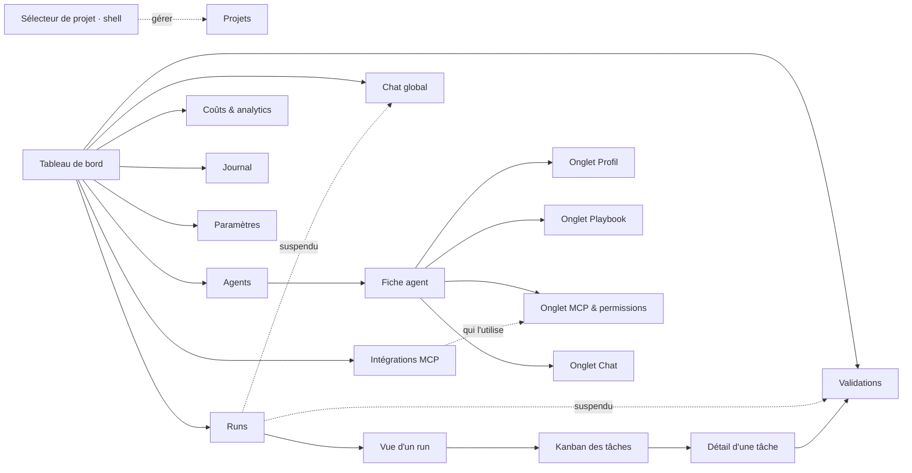

# Interface — Control Tower — Maestro

**Version :** 0.1
La **Control Tower** est l'unique poste de pilotage : superviser, configurer, interagir, assigner, contrôler la capacité. Interface multilingue (français par défaut), pensée pour un profil non technique.

---

## 1. Cartographie des écrans

**Une entrée de menu par intention** (navigation v2, #189). Trois entrées de la
v1 — Agents, Playbooks, Chat — regardaient **le même objet** par trois chemins :
on y choisissait un agent, puis on en consultait une facette. Elles ont fusionné
en **une** fiche agent à onglets, et un agent se consulte d'un seul endroit.

Deux entrées se sont ajoutées depuis — **Projets** (#225) et **Journal** (#249),
où le fil d'activité s'est installé en plein format —, puis **Projets en est
ressortie** (#280, §2.0.1). Le menu est déclaré une seule fois
(`apps/web/lib/navigation.ts`) et fait aujourd'hui **neuf entrées** : les deux
écrans de la Phase 8, « Composer un objectif » (#319) et « Valider le brief »
(#322), s'y étaient ajoutés puis **en sont repartis** (#484, ci-dessous), tandis
que **« Runs »** (#474, §2.4.1) et **« Intégrations »** (#270, §2.10) y sont
entrées. Le Kanban des tâches n'en est pas une (il est l'objet de la **vue d'un
run**, servie sous « Runs » depuis #476 — §2.4.2) et l'écran Projets non plus
(il est servi, mais atteint depuis le sélecteur du shell).

> ⚠ **Ce menu a changé deux fois, et les deux ont été décidées le 2026-08-24**
> (revue #470, [docs/29](./29-decision-run-objet-de-premier-plan.md)). Une entrée
> **« Runs »** s'ajoute — **c'est fait** (#474, §2.4.1) : un run n'était l'objet
> d'aucun écran, il a désormais le sien, et **sa vue** depuis #475 (§2.4.2), servie
> sous cette entrée à `/runs/<run_id>` sans en réclamer une nouvelle. La seconde
> moitié de l'arbitrage ① est **livrée elle aussi** : le Kanban a **cessé d'être** le
> tableau de bord (#476 — ce qui renverse #248), qui montre désormais l'état des runs
> (§2.1.2).
>
> **Arbitrage ② — livré le 2026-08-28** (#484, lot 3 de #481) : les deux entrées
> de la Phase 8 **sont parties**, et « Chat » a pris leur place en tête de menu.
> C'est un **renversement**, pas un rangement, et il se lit comme tel : #319 et
> #322 avaient été mises au menu avec leurs raisons écrites — « une action qu'on
> ne trouve pas est une action qui n'existe pas » pour composer, « un run
> suspendu sur son brief ne crée aucune tâche, donc rien d'autre ne le montre »
> pour valider. **Les deux arguments tiennent toujours** ; ce qui a changé est
> leur conclusion, parce que le fil sait désormais faire ce qu'elles faisaient :
> #482 lui a donné les pièces jointes et les sources (§6.12), #483 le cadrage et
> sa décision (§2.7.5). Deux portes vers un même geste, c'est la question
> « laquelle ? » posée à chaque lancement.
>
> **Rien n'est supprimé de ce que ces écrans savaient faire** — c'est un
> déménagement, D5 tient (#218), le point de contrôle reste. Les chemins
> `/composer` et `/brief` **restent servis et redirigés** (§1.1), et les pages
> elles-mêmes restent en place sous `app/`, simplement plus atteintes par leur
> URL. Ce que le lot a coûté en plus du retrait est **le corollaire** : cinq
> surfaces acheminaient vers ces deux écrans en résolvant leur destination par le
> **menu** (règle de #191) — le poste vide, la liste de runs vide, la file de
> briefs vide, la cloche et la table `ATTENTES` de la carte de run. Un libellé
> retiré rend `undefined`, donc `null`, donc un bloc qui disparaît **sans un
> mot** : retirer une entrée de menu n'est jamais un geste local, et les cinq ont
> bougé dans le même commit.



La sidebar, le titre de page et les renvois du tableau de bord lisent tous cette
même déclaration. Les onglets d'un agent le sont de même
(`apps/web/lib/agents.ts`). Une page **servie hors menu** y figure aussi
(`HORS_MENU`) : elle n'a pas d'entrée de navigation mais garde son titre de
barre supérieure, sans quoi un chemin qui marche donnerait un écran anonyme.

### 1.1 Les chemins de la v1 restent servis

Les anciennes URL sont écrites dans la doc, dans des tickets, dans des signets :
elles sont **redirigées vers l'onglet qu'elles visaient**
(`apps/web/next.config.ts`), jamais supprimées.

| Chemin v1 | Redirigé vers | Remarque |
| --- | --- | --- |
| `/catalogue` | `/agents` | la liste des agents |
| `/catalogue/<agent>` | `/agents/<agent>/profil` | |
| `/playbooks` | `/agents?onglet=playbook` | pas d'agent dans l'URL : l'intention est passée à la liste, dont les cartes visent alors cet onglet |
| `/playbooks/<agent>` | `/agents/<agent>/playbook` | |
| `/chat/<agent>` | `/agents/<agent>/chat` | |

`/chat` **nu n'est pas redirigé** : il reste au menu pour le chat **global**, non
lié à un agent — c'est une intention distincte, et il la sert pour de bon depuis
#269 (§2.9), sur le canal `orchestrateur` du lot 1 (#268, §6.5).
Les redirections sont temporaires (307) et non permanentes (308) : un 308 est mis
en cache par le navigateur pour de bon, et ces chemins ne pourraient plus être
corrigés côté serveur.

**Et les deux écrans de la Phase 8 les ont rejoints le 2026-08-28** (#484), pour
la même raison et sous la même règle :

| Chemin | Redirigé vers | Remarque |
| --- | --- | --- |
| `/composer` | `/chat` | le geste de #319 se fait dans le fil depuis #482 (§6.12) |
| `/brief` | `/chat` | le point de contrôle de #322 s'y joue depuis #483 (§2.7.5) |

Le 307 compte **plus encore** ici : le fil venait d'être ouvert quand ces deux
chemins y ont été renvoyés, et un 308 mis en cache par les postes figerait sa
destination avant qu'elle soit stabilisée. La garantie de durée vit dans
`next.config.ts`, jamais dans un cache de navigateur — et elle reste la bonne
réponse maintenant que le chantier #481 est **soldé** (#485), le fil ayant
vocation à continuer de bouger.

⚠ Les dossiers `app/composer/` et `app/brief/` **restent en place**, et ce n'est
pas un oubli : une redirection de `next.config` est évaluée **avant** le routage
par fichiers, donc elle l'emporte et personne n'atteint plus ces pages par leur
URL. Leurs **composants**, eux, sont toujours montés — `components/brief/` par le
fil du cadrage (#483), `components/composer/` par ses suites. Supprimer les
coquilles est une décision à part, qui ne relève ni du menu ni des chemins.

---

## 2. Les écrans en détail

### 2.0 Le projet actif est le cadre de tous les écrans (#281) — **livré**

On entre dans la Control Tower **par** un projet (#279) et tout ce qu'on y voit se rapporte à ce
projet-là. Ce n'est pas une option d'affichage : la portée de §6.0 est passée à **chaque** lecture,
et l'API refuse celle qui n'en porte pas. Côté front, la portée n'a donc **aucun défaut** — un
`?projet=tous` implicite rendrait la vue transverse à qui aurait simplement oublié de cadrer sa
lecture, c'est-à-dire exactement la fuite que ce lot ferme.

**Ce qui est filtré par le projet actif** — tâches et Kanban, indicateurs de tête, validations
(file et historique), coûts (agrégats de période *et* grands livres), journal d'activité, centre de
notifications, et le **flux temps réel** qui les alimente tous.

**Ce qui reste global, et pourquoi** :

| ce qui reste global | pourquoi | ce qui est cadré malgré tout |
| --- | --- | --- |
| `GET /api/agents` — état du parc | un agent est une ressource du **poste** : son playbook, sa capacité et ses instances (#86) valent pour toute la Control Tower. Il n'appartient à aucun projet, et #277 ne lui a pas donné de portée | la tuile « Agents » compte les agents **au travail sur ce projet** (dérivé de ses tâches) et renvoie au détail le parc et les « occupés ailleurs » |
| le **catalogue** d'agents et les **playbooks** | ce sont des définitions, pas du travail — les partager entre projets est l'intérêt d'en avoir | — |
| le **chat** et l'assistant | ils parlent de l'**outil**, pas du projet ; et un `chat.message` ne porte pas de `projet_id`, donc une socket cadrée ne le recevrait **jamais** (§6.0) — le fil se figerait sans rien dire | — |
| les **paramètres** du poste (apparence, notifications) | réglages de l'installation, pas d'un projet | la dépense cumulée qui y figure, elle, est celle du projet |
| les **intégrations MCP** (pool projet et bibliothèque) | elles ont quitté les Paramètres en #270 (§2.10) précisément parce qu'elles n'en sont pas : elles décident de ce qu'un agent sait faire. Le **pool** porte pourtant « projet » dans son nom — c'est un stockage unique (`core/mcp/pool.json`), non cadré à ce jour | — |

**Le coût cumulé change de source** avec ce lot. Il se lisait sur `agents[].cout_usd` — un total de
**tous** les projets, puisque le parc est celui du poste. Il est désormais la somme des **grands
livres** (#57) des exécutions du projet, planification comprise : cadré par construction, et
identique dans les trois endroits qui l'affichent (barre supérieure, tuile « Dépense »,
Paramètres › Coûts) là où l'écart demandait jusqu'ici d'être expliqué.

**Changer de projet remet tout à zéro.** Le shell **remonte** son fournisseur d'état sur l'identité
du projet plutôt que de recharger les données : recharger suffirait pour l'état temps réel, pas pour
ce que les **pages** tiennent elles-mêmes — un filtre du Journal posé sur une tâche de l'ancien
projet, une période sélectionnée, un panneau déplié. C'est ce que le critère appelle un « compteur
figé », et c'est le seul de ses trois cas (cache, flux ouvert, compteur) qu'un rechargement ne
traite pas. Le repli de la sidebar, lui, reste **au-dessus** : c'est une préférence d'affichage.

**Un écran vide le dit, et nomme le projet.** Trois vides se ressemblent et ne se diagnostiquent pas
pareil : une **panne** (API injoignable — bannière, panneaux conservés, §2.1.1), l'**absence de
projet** (la porte d'entrée de #279, qui s'intercale avant que la Control Tower ne soit montée) et
**rien encore sur ce projet**. Le troisième se formule avec le nom du projet — « Rien encore sur
Dépensio » — sur le tableau de bord, le Kanban, le Journal, les Validations et les Coûts : un
« aucun événement » anonyme, sur une Control Tower qui n'en montre plus qu'un, se lit « rien ne
tourne nulle part ».

⚠ **Corollaire à connaître** : un run publié **sans projet** (`maestro-run --publier`, qui n'a pas
d'option de rattachement) ne relève d'aucun projet et n'apparaît donc sur l'écran d'aucun — seule la
vue `aucun` le montre (§6.0). `PosteVide` le dit explicitement, faute de quoi on chercherait une
panne là où il n'y a qu'un périmètre. Rattacher un run se fait par l'écran **« Composer un
objectif »** (§2.7.3, #319), qui pose le projet actif sans le demander — ou, pour un script, par
`POST /api/executions` et son champ `projet_id` (§6.1).

Implémentation : `apps/web/lib/etatGlobal.tsx` (le projet et sa portée diffusés au shell),
`useControlTower` / `useAnalyticsCouts` (les deux lectures cadrées), `components/Shell.tsx` (la clé
de remontage). Couverture : `apps/web/tests/projet-cadre.test.tsx`, et côté API
[`tests/test_appartenance_projet.py`](../tests/test_appartenance_projet.py) (#282).

#### 2.0.1 On entre par un projet, et on en change au shell (#279, #280) — **livré**

Le cadre du §2.0 a deux gestes : y **entrer**, et en **changer**. Ils forment la réponse au
reproche du bilan de la Phase 7 — « le projet devrait être choisi avant d'entrer », « surtout pas
un menu pour les projets ».

**La porte d'entrée** (#279) est une **garde de shell**, pas une redirection de page. La nuance
est tout le mécanisme : une page atteinte directement — lien, signet, rechargement — passe par le
choix du projet **puis rend la page demandée**, sans que l'URL ait bougé entre-temps. Une
redirection l'aurait perdue, et aurait ajouté deux entrées à l'historique du navigateur pour un
geste qui n'est pas une navigation. Ce que l'écran présente : la liste des projets déclarés et la
**création sur place** — aucun projet déclaré n'ouvre pas un vide mais propose d'en créer un. Le
projet actif est **retenu d'une visite à l'autre**, relu au démarrage, et un projet devenu
introuvable ramène à la porte **avec son motif** au lieu d'échouer. Trois vides à ne pas
confondre, ici encore : une API muette n'est pas une absence de projet (on laisse réessayer, et le
choix retenu reprend dès que l'API répond).

**Le sélecteur** (#280) tient dans la barre supérieure, contre le titre de page — on lit « ce
projet-ci, cette page-là ». Il affiche le projet actif **et sa racine** (deux clones d'un même
dépôt portent volontiers le même nom ; c'est le chemin qui dit sur lequel on travaille), et
basculer **ne navigue pas** : le choix est écrit, les écrans se relisent à l'endroit où l'on
était. Sans projet actif il ne rend **rien** — proposer de choisir ici serait une seconde porte
d'entrée à côté de celle ci-dessus, avec deux façons de rater la garde.

**Et l'entrée « Projets » a quitté la barre latérale.** C'est le fond du lot, pas un effet de
bord : une entrée de menu range le projet **parmi** les destinations alors qu'il est le cadre de
toutes. L'écran de #225 n'a pas déménagé pour autant — il reste servi à `/projets`, garde son
titre (`HORS_MENU`, §1) et s'atteint depuis le sélecteur (« Gérer les projets »). Rien à rediriger
dans `next.config.ts`, contrairement aux pages fusionnées du §1.1 : celle-ci n'a pas changé
d'adresse, elle a seulement quitté le menu.

Implémentation : `apps/web/lib/etatProjetActif.tsx`, `components/projets/ChoixProjet.tsx` et
`SelecteurProjet.tsx`, `lib/navigation.ts` (`MENU` / `HORS_MENU`). Couverture :
`apps/web/tests/projet-actif.test.tsx` et `selecteur-projet.test.tsx`.

### 2.1 🏠 Tableau de bord (vue d'accueil)

Il répond à « **où en est-on, et qu'est-ce qui m'attend ?** » **en un écran**
(épuré par #191). Cinq panneaux de plein format s'y disputaient la place ; il n'en
reste que ce qui se lit d'un coup d'œil, dans cet ordre :

1. **Briefs en attente** (#322, §2.7.4) — un run arrêté sur son brief bloque le run
   entier, là où une validation ne retient qu'une tâche : il passe donc devant. Il
   **signale et achemine, il ne décide pas** — sept sections, des questions et un
   coût ne tiennent pas dans une carte. Il achemine vers le **fil** depuis #483
   (§2.7.5), où le geste vit désormais ; ce panneau, la cloche et la carte de run
   partagent une seule constante pour le dire, faute de quoi ils se seraient éteints
   tous les trois en silence le 2026-08-28, quand #484 a retiré l'entrée de menu
   qu'ils nommaient — ce jour-là aucun des trois n'a eu à changer.
2. **Validations en attente** — ce qui demande un arbitrage humain.
3. **Runs qui n'avancent plus** (#349, #486, #738, §6.1) — les runs que **plus rien
   ne fait avancer**, rangés en **deux familles** parce que les deux verdicts de
   surveillance (§6.1) ne désignent pas les mêmes runs et n'appellent pas le même
   geste. Après les deux panneaux précédents, et pour une raison de nature : ceux-là
   retiennent du travail **vivant**, un run perdu ne retient plus rien. Rien ne
   s'affiche quand les deux familles sont vides.

   - **« Personne n'a répondu »** (#738) — les runs `en_souffrance` (§2.6), c'est-à-dire
     suspendus sur un humain au-delà du seuil. Le geste est d'**aller voir le run**,
     jamais de trancher : la réponse à une attente n'est ni oui ni non (« répondre »,
     « relever le budget », « annuler », « rien »), donc ces runs ne passent **pas**
     par la file de validations, qui porte des actes à décider ([docs/33
     §7.2](./33-decision-surveillance-run.md)). La ligne dit **ce que le run attend**
     et depuis quand — le tri fait le signal, l'ancienneté ne dit que de combien.
     N'y figurent ni un orphelin (personne ne recevrait la réponse : il est dans la
     famille suivante), ni un run **en pause**, où quelqu'un a déjà décidé ;
   - **« Leur hôte s'est tu »** (#349, #486) — les runs **orphelins ou éteints dont
     le brief a été approuvé**, avec le bouton qui les reprend sur ce cadrage. Rien
     ne s'affiche sur un run `indetermine` (on ne sait pas : le proposer serait
     deviner), ni sur un run sans brief approuvé (il n'a rien à rejouer). Le second
     état vient de #486 : un run que `start.sh --stop` a soldé (cause `extinction`)
     se retrouve **ici** au redémarrage, par le **même** bouton — sa ligne dit
     « arrêté avec Maestro » là où un orphelin dit « hôte muet », les deux menant au
     même geste parce que ce qui se rejoue est un cadrage. Un run **délibérément
     annulé**, lui, n'y figure pas : personne ne veut se voir reproposer un run qu'il
     vient d'arrêter.

   ⚠ **Un bloc, pas deux**, et c'est la règle des trois places qui tranche (#539,
   [docs/30 §4](./30-cible-visuelle-control-tower.md)) : le corps de cet écran est
   plafonné à trois blocs de plein format et il en porte déjà trois d'arbitrage. Un
   quatrième panneau était la réponse évidente et la mauvaise — ce qui déborde
   s'étend dans un bloc existant. Le panneau a changé de **nom** en changeant de
   contenu (il s'appelait *Runs interrompus* jusqu'à #738) : un chapeau qui ne
   couvre que la moitié de ce qu'il range est la première chose qui dérive.
4. **Indicateurs de tête** — quatre tuiles : run en cours, tâches par statut,
   agents occupés et libres, dépense. Chaque tuile met en valeur **le chiffre
   qu'on vient y chercher** : la tuile Agents répond « combien travaillent,
   combien sont disponibles ? » et relègue le total et les agents désactivés en
   ligne de détail (#247). Depuis #281 « combien travaillent » veut dire
   **ici** — le parc étant celui du poste (§2.0), seul un décompte dérivé des
   tâches du projet a sa place en tête, les « occupés ailleurs » passant au
   détail.
5. **État des runs** (#476, §2.1.2) — ce qui tourne, ce qui attend quelqu'un, ce
   qui est tombé et ce qui s'est soldé aujourd'hui, chacun avec sa progression et
   un renvoi vers sa vue. Le **Kanban** occupait cette place jusqu'au 2026-08-24
   (#248) ; voir l'encadré ci-dessous.
6. **Aperçu de l'activité** en direct (quelques lignes, pas le fil entier).

Le reste n'a pas été supprimé, il est **rangé**, et **chaque tuile renvoie vers
la page où le détail vit désormais** : les fiches d'agent vers **Agents**, la
capacité vers **Paramètres › Agents & capacité**, le grand livre par exécution
vers **Coûts & analytics**. Ces renvois sont résolus **par le menu** et non par un
chemin écrit en dur : une page qui déménage emmène son renvoi avec elle (c'est ce
qui a fait suivre « Agents » quand il est passé de `/catalogue` à `/agents`), et
un renvoi vers une page **pas encore créée ne s'allume pas** — pas de lien mort
en attendant. C'est ainsi que l'aperçu d'activité a gagné son « voir le
Journal » : la page créée (#249), le lien s'est allumé seul, sans une ligne de
plus dans le composant.

Le **coût cumulé** — celui du projet actif depuis #281 (§2.0) — et le statut du flux
temps réel vivent en permanence dans la barre supérieure, sur toutes les pages. Tout
se met à jour par WebSocket.

> ⚠ **L'item 5 a été renversé le 2026-08-24** (revue #470,
> [docs/29 §3](./29-decision-run-objet-de-premier-plan.md)) et **livré par #476** : le
> **Kanban a quitté le tableau de bord**, qui montre à la place **l'état des runs**.
> Le motif est une question de portée, pas de place : le Kanban rend les tâches du
> **projet** (#277/#281) — ce qui court avec ce qui est fini depuis trois jours —,
> alors que la question « où en est-on ? » porte sur ce qui tourne, c'est-à-dire un
> **run**. Il reparaît entier dans la vue d'un run (#475, §2.4.2). Les items 1 à 4 et
> 6 n'ont pas bougé, et la portée **projet** n'est pas défaite : le run s'y
> **ajoute**.
>
> **#248 n'est pas effacé pour autant**, il est **daté** : « le Kanban prend toute la
> hauteur restante » a décrit cet écran jusqu'au 2026-08-24, et c'est cet encadré qui
> dit ce qui l'a remplacé et pourquoi. Ce que #248 avait gagné n'est pas perdu — la
> hauteur pleine et le défilement par colonne sont partis **avec** le composant dans
> la vue d'un run, où les tâches sont de nouveau l'objet de l'écran. Ce qui disparaît
> ici est seulement leur place **sur cette page**, avec la borne `max-h-96` que #191
> lui avait posée : plus rien ne s'étire sur le tableau de bord, et rien n'a été
> inventé pour reprendre l'étirement — l'état des runs est une liste, une liste se lit
> du haut, et lui donner tout l'écran étirerait du vide les jours calmes.

#### 2.1.1 Le poste vide — ce que montre un démarrage en mode réel (#186)

Le lanceur local démarre en **mode réel** (`bash scripts/controltower/start.sh`,
[doc 07 §6.10](./07-guide-de-demarrage.md)) : la Control Tower est branchée sur la
vraie orchestration, donc **un premier démarrage n'a rien à afficher** — aucune
tâche, aucun événement, aucune validation. Quatre panneaux à zéro feraient croire à
une panne ; l'écran est donc remplacé par **ce qu'il faut faire pour le remplir**
(`PosteVide`), avec les deux gestes possibles :

- **lancer une orchestration dans ce projet** — `POST /api/executions` avec le
  `projet_id` de l'écran (§6.1). `maestro-run --publier "<objectif>"` reste le
  geste en ligne de commande, mais **sans rattachement** : ses tâches n'entrent
  dans la vue d'aucun projet (§2.0), et l'écran le dit plutôt que de le laisser
  chercher ;

  > ⚠ **Le geste a changé le 2026-08-28** (#484) : le bouton menait à l'écran de
  > composition (#319), il **ouvre le chat**. C'est un critère à part du lot, et
  > il ne va pas de soi — un premier démarrage est le seul moment où l'écran est
  > la **seule** source de ce qu'il faut faire, donc le seul où un renvoi périmé
  > ne se rattrape pas ailleurs. Laisser « Composer un objectif » aurait produit
  > un rebond (le chemin redirige, §1.1), et retirer le lien aurait ramené le
  > poste vide à ce que #186 avait corrigé : un écran qui ne nomme aucun geste.
  > La destination est résolue par le menu (`PAGE_DU_FIL`), donc elle suivra le
  > prochain déménagement toute seule ;
- **juste explorer l'interface** — `bash scripts/controltower/start.sh --demo`,
  scénario factice sur bus mémoire, qui **dit** que ses données le sont.

Ce n'est **pas un état d'erreur**, et la distinction est le point de conception :
une API injoignable garde ses panneaux et sa bannière d'erreur, parce qu'un écran
vide *et muet* ne se diagnostique pas comme un écran vide *et connecté*. Depuis
#281 le titre **nomme le projet** (« Rien encore sur Dépensio ») : c'est ce qui
distingue ce vide-là des deux autres (§2.0). Une fois le premier événement publié,
le poste se remplit **sans rechargement** (WebSocket), et l'historique est rejoué au
redémarrage de l'API (journal durable, #97).

#### 2.1.2 L'état des runs — ce qui a pris la place du Kanban (#476) — **livré**

L'item 5 du tableau de bord : les runs du projet actif **groupés par régime**, chacun
avec sa progression et le renvoi vers sa vue (§2.4.2).

| Groupe | Ce qu'il porte |
| --- | --- |
| **En cours** | les runs qui **avancent** — badge bleu à pastille battante |
| **Suspendus** | ceux qui attendent quelqu'un : brief à valider, questions de clarification, arbitrage sur une tâche — avec **depuis quand** |
| **En pause** | ceux qu'on a mis de côté (#477) — ils ne lancent plus rien, ils n'ont rien perdu |
| **Interrompus** | ceux dont l'hôte ne bat plus (#348) |
| **Soldés du jour** | ceux qui ont rendu leur verdict aujourd'hui — terminé, annulé, échec |

**Le découpage est celui de `regimeDuRun`** (`lib/execution.ts`), le même que la liste
des runs (§2.4.1) et la vue d'un run — jamais un second tri écrit pour cet écran. Il
importe ici plus qu'ailleurs : « en cours » au sens de l'API recouvre un run qui
travaille *et* un run arrêté depuis trois heures sur une question, et c'est le défaut
d'origine du chantier — 53 minutes perdues le 2026-08-14 (#355). Un tableau de bord
qui dirait « 3 runs en cours » sans les séparer referait exactement cette promesse.
De même, **une ligne de run se lit à l'identique** sur les trois écrans : c'est la
`CarteRun` de `components/runs/EtatRun.tsx`, extraite de la liste le jour où un
troisième écran a eu à la rendre.

**La table des groupes doit rester exhaustive, et deux d'entre eux n'étaient pas
dans le ticket.** #476 en nomme trois — en cours, suspendus, soldés du jour — mais
`regimeDuRun` en rend **cinq**, et un régime sans groupe ne dégrade pas
l'affichage : il fait **disparaître** ces runs-là de l'écran. *Interrompu* a donc
été ajouté avec #476, parce que le panneau « Runs qui n'avancent plus » qui le précède
(item 3) ne montre que les **récupérables** — orphelin *et* brief approuvé (#349) —,
si bien qu'un run mort avant validation de son cadrage ne serait nulle part. *En
pause* a été ajouté par **#480**, pour la raison exacte et sur une panne réelle :
#477 a créé ce régime **après** le merge de #476, deux lots corrects séparément, et
suspendre un run le retirait alors de l'écran qui existe pour dire où l'on en est.
C'est le prix des lots marqués « (parallèle) », et il se paie au lot final — d'où
un test qui **balaie `regimeDuRun`** au lieu de nommer les groupes un par un
(`apps/web/tests/etat-des-runs.test.tsx`) : un régime nouveau ne peut plus passer
sans qu'un test rougisse.

L'ordre suit l'arbitrage déjà rendu un cran plus haut sur le même écran : ce qui
retient du travail **vivant** passe devant ce qui ne retient plus rien. Un run
suspendu passe donc avant un run en pause — il attend quelqu'un **qui l'ignore
peut-être**, là où une pause est un geste qu'on vient de faire —, et les deux
avant « interrompu ».

**Seuls les soldés sont bornés** — au jour, puis à cinq, le groupe disant alors ce
qu'il masque. C'est le seul qui grossisse sans fin, et un run terminé avant-hier
n'apprend rien sur « où en est-on » ; les autres s'affichent **en entier**, puisque
c'est précisément ce que l'écran existe pour montrer. Le renvoi de l'en-tête mène à la
liste, qui les porte tous. Un run soldé sans date de fin est daté de son **début**
(le contrat garde `fin` nullable), et **sans horloge personne n'est du jour** : le
rendu serveur n'a pas d'instant (#250), le groupe apparaît donc au premier battement
— même règle qu'un « il y a 3 min » qui remplace une heure absolue.

**Il ne décide de rien**, et c'est ce qui le sépare des trois panneaux qui le
précèdent : ceux-là portent le geste qui lève une attente, celui-ci porte l'état. Un
run interrompu peut donc paraître deux fois sur l'écran — dans « Runs qui n'avancent
plus » avec son bouton, et ici avec son état. C'est la superposition que le Kanban
avait déjà avec les validations, et elle est voulue : ce qui appelle un geste passe
devant, ce qui décrit l'état se lit d'un bloc. Depuis #738 elle vaut aussi pour un run
**en souffrance** : il sort de la liste dans le panneau, avec son renvoi, et le groupe
*Suspendus* continue de le montrer parmi les autres — le premier dit qu'on l'a oublié,
le second où il en est.

Composant : `apps/web/components/runs/EtatDesRuns.tsx`. Couverture (#480) :
`apps/web/tests/etat-des-runs.test.tsx` — l'exhaustivité de la table, les cinq
groupes, le plafond des soldés et ce qu'il annonce, `soldeAujourdHui` (fin, repli
sur le début, horodatage illisible), le vide nommé et l'absence de tout geste ;
`tests/tableau-de-bord.test.tsx` garde depuis #476 que le Kanban a quitté l'écran et
que le renvoi vers la liste y est.

### 2.2 📋 Tâches — tableau Kanban

> ⚠ **« Il *est* l'objet du tableau de bord » a été renversé le 2026-08-24** (revue
> #470, [docs/29 §3](./29-decision-run-objet-de-premier-plan.md)), et le renversement
> est **complet depuis #476**. Le Kanban est désormais **la vue d'un run** (#475,
> §2.4.2) : mêmes colonnes, mêmes cartes, même détail sur place — ce qui change est ce
> qu'il rend, les tâches de **ce run** au lieu de celles du projet entier. Le tableau
> de bord montre l'état des runs (#476, §2.1.2), et une entrée de menu **« Runs »**
> liste ceux du projet actif (#474, §2.4.1). Tout ce qui suit reste vrai du composant ;
> seules sa **portée** et sa page ont changé. #191 (l'épure) et #251 (le détail sur
> place) ne sont pas touchés.
>
> Le retrait s'est fait **en deux temps, à dessein** : #475 a *ajouté* la vue d'un run
> sans rien retirer du tableau de bord — il y était donc aux deux endroits — pour que
> le lot se merge seul sans écran cassé, et #476 a fait le retrait une fois le Kanban
> pourvu d'un autre endroit où vivre. Le composant est **le même**, à une prise près —
> `messageVide`, parce que la phrase par défaut nomme le **projet** et que « rien
> encore sur Dépensio » désignerait le mauvais vide dans la vue d'un run : le projet
> peut être plein pendant que *ce* run n'a créé aucune tâche.

Le Kanban n'a **pas d'entrée de menu à lui** : il est l'objet de la **vue d'un run**,
servie sous l'entrée « Runs » à `/runs/<run_id>` (§2.4.2), et il y prend la place que
lui donnait déjà #248 — la progression rend une tête, le tableau prend **toute la
hauteur restante** et chaque colonne défile chez elle. La borne `max-h-96` de #191
protégeait la densité d'un écran qui portait encore cinq panneaux de plein format ;
ceux-ci sont partis, elle est restée, et les tâches tenaient dans le tiers supérieur
d'un grand écran. En largeur, ce sont
les colonnes qui commandent : une **largeur minimale par colonne** plutôt qu'un
nombre de colonnes, si bien qu'elles s'élargissent jusqu'à 2 560 px et se
replient en lignes en dessous, au lieu d'être toutes tassées de front.

- Colonnes : *Assignées → En cours → Bloquées → Terminées / Échecs* — celles de
  la machine à états du moteur ([docs/03 §3](./03-architecture-technique.md)).
  Un statut que le front ne connaît pas tombe dans une colonne **Autres** plutôt
  que de disparaître de l'écran.
- Chaque carte : titre, ticket externe s'il y en a un (#192), agent assigné,
  statut, coût, tokens et durée.
- **Réassignation manuelle** d'un agent à une tâche (EF-11/EF-20), depuis la
  carte comme depuis le panneau de détail.
- **Le détail s'ouvre sur place** (#251) : un clic sur la carte ouvre un panneau
  modal à droite — description, **étapes** en checklist, **liens utiles**
  (maquette, ticket, dépôt) — et Échap le referme en rendant le focus à la
  carte. Aucune navigation : la vue du run reste où elle était. Une tâche **sans
  détail reste exactement la carte d'avant** : pas de bouton, pas de curseur qui
  promet une ouverture, pas de panneau vide.
- Création d'une tâche : soit en langage naturel (l'orchestrateur la découpe), soit manuellement.

> **D'où viennent ces champs.** `description`, `etapes` et `liens` sont portés
> par le lot modèle **#246**, livré : la projection
> (`maestro/controltower/state.py`) les sert, et le contrat les garde optionnels
> côté front (`apps/web/lib/types.ts`) parce qu'une tâche peut parfaitement n'en
> avoir aucun. Ils atteignent la Control Tower par le **journal** et par lui
> seul (`maestro.detail_tache.consigne_detail` → ligne `<tache>:detail` → pont
> #46 → événement `tache.detail`) : un agent qui découvre en cours de route une
> étape à cocher ou une maquette à ouvrir les consigne, sans faire bouger sa
> tâche d'une colonne. Une tâche que rien n'a renseignée reste donc exactement
> la carte d'avant. Couverture :
> [`tests/test_detail_tache.py`](../tests/test_detail_tache.py) — le modèle, le
> journal, le pont et la projection, **idempotence du rejeu comprise**.

> **Et qui les pose (#489).** #246 avait tout posé sauf l'appelant :
> `consigne_detail` n'était appelé par personne, donc la checklist était un
> contrat entièrement plombé et entièrement vide. L'arbitrage — écrit en tête de
> `maestro/detail_tache.py`, avec son motif — est **l'ossature au plan, complétée
> et cochée par l'agent** : l'orchestrateur déclare les jalons prévus
> (`etapes` de [`task.schema.json`](../packages/shared/schemas/task.schema.json),
> libellés seuls, jamais d'avancement), ce qui rend la tâche lisible **avant**
> qu'elle démarre ; l'agent rapporte où il en est **pendant** qu'elle tourne, et
> son premier relevé supplante l'ossature. Il le fait là où il tient déjà sa
> liste de travail — l'entrée de ses appels `TodoWrite`, lue par
> `maestro/providers/checklist.py` : aucun protocole n'a été inventé, aucun
> second transport ouvert. `SuiviChecklist` réconcilie les deux et garantit que
> **rien ne recule** — un état ne redescend pas, une étape connue ne disparaît
> pas d'un relevé qui l'oublie, y compris à travers une relance. Le
> **dénominateur, lui, peut grandir**, et c'est pourquoi la jauge du panneau est
> une **case par étape** et non un pourcentage : ce qui est acquis reste allumé,
> la rangée s'allonge. Un fournisseur sans checklist observable, un rôle dont la
> politique refuse l'outil, un plan sans ossature : la tâche reste exactement ce
> qu'elle est aujourd'hui. Le **motif complet de l'arbitrage**, avec les deux
> options écartées, vit en [docs/03 § TASK](./03-modele-de-donnees.md) — c'est
> une décision de modèle avant d'être un écran. Vérification :
> [`tests/test_checklist_tache.py`](../tests/test_checklist_tache.py) côté moteur
> (l'ossature posée avant la première tentative, le premier relevé qui supplante,
> l'avancement qui ne recule pas à travers une relance) et
> [`apps/web/tests/pipeline.test.tsx`](../apps/web/tests/pipeline.test.tsx) pour
> la rangée de cases — dont le contrôle qui compte : le dénominateur grandit sans
> que le numérateur bouge.

Le **glisser-déposer** entre colonnes reste une **cible non livrée** : le statut
d'une tâche est aujourd'hui posé par la machine à états du moteur, et seule la
réassignation d'agent s'obtient depuis l'écran.

### 2.3 🤖 Agents

L'entrée de menu **Agents** (`/agents`) mène à la **liste** ; chaque carte ouvre
**une** fiche, où les facettes de l'agent tiennent en **onglets**
(`/agents/<agent>/<onglet>`). C'est le point d'entrée unique vers un agent —
il n'y a plus de sélecteur d'agent en tête de trois pages différentes.

- **Liste** : les agents du catalogue (ceux du code, en lecture seule, et les
  personnalisés), avec **créer un agent**. Arrivée avec `?onglet=<onglet>` (par
  une redirection de la v1), les cartes visent directement cet onglet.
- **Fiche agent**, quatre onglets — l'ordre va de l'identité de l'agent à la
  conversation avec lui :

| Onglet | Contenu | Vient de |
| --- | --- | --- |
| 🤖 **Profil** | identité (nom, rôle, modèle, compétences/tags), prompt système éditable, statistiques (tâches traitées, taux de réussite, coût moyen) ; suppression d'un agent personnalisé | page `/catalogue` |
| 📖 **Playbook** | éditeur avec **historique des versions** et retour arrière (EF-25). L'historique porte aussi les **propositions d'auto-amélioration** en attente — brouillons issus des échecs d'un run, à appliquer ou rejeter au clic ([docs/22](./22-auto-amelioration-playbooks.md)) | page `/playbooks` |
| 🔌 **MCP & permissions** | serveurs MCP de l'agent et politique allow/deny effective ([docs/21](./21-configuration-mcp.md)) | n'avait aucune page à soi — seulement le bas de la fiche du catalogue |
| 💬 **Chat** | conversation directe avec l'agent (EF-19) | page `/chat/<agent>` |

L'**activation/désactivation** et le **contrôle de capacité** (**+ / −**
instances, EF-21) se règlent dans **Paramètres › Agents & capacité** ; le tableau
de bord en donne le compte et y renvoie.

**Ces écrans sont les seuls du produit à rester transverses** (#281, §2.0), et c'est une décision
plutôt qu'un reste : un agent est une ressource du **poste**, pas un objet de projet. Sa définition,
son playbook, sa capacité et son état libre/occupé valent pour toute la Control Tower — les
partager entre projets est précisément l'intérêt d'avoir un catalogue —, et `GET /api/agents` ne
porte donc pas de portée (§6.0). Ce qui est cadré, c'est ce que les **autres** écrans en disent :
la tuile « Agents » du tableau de bord compte les agents au travail **sur le projet actif** et
nomme le parc comme partagé. Le jour où un agent deviendrait propre à un projet — un catalogue par
projet, une capacité par projet — c'est ici et au §6.0 qu'il faudrait revenir, pas dans un
composant.

Ajouter une facette à un agent se fait dans `apps/web/lib/agents.ts` : la barre
d'onglets, les cartes de la liste et la route dynamique la lisent toutes.

### 2.4 🔬 Exécutions & traces

- Liste des runs (filtrable par agent/tâche/statut).
- **Trace détaillée** d'un run : étapes, outils appelés, entrées/sorties, tokens, coût, durée, erreurs (EF-22).
- Rejouer / relancer un run.
- Lien vers la trace correspondante dans Langfuse.

**Piloter un run sans quitter l'écran** (#185, livré) : lancement, suivi et
annulation passent par les routes `/api/executions` dont le contrat est figé en
§6.1. Le lancement rend la main **tout de suite** — le run part en arrière-plan et
son `run_id` est connu avant qu'il ne produise quoi que ce soit —, ce qui permet
d'afficher le run « en cours » puis de le suivre par le flux temps réel habituel.
Un run **publié par un autre process** (`maestro-run --publier`, worker #41) est
listé au même titre : le suivi lit la projection, il ne distingue pas l'origine.

⚠ **« Sans quitter l'écran » n'a été vrai de l'annulation qu'à partir de #467** (§2.4.5).
La route existait depuis #185 et rien dans `apps/web/` ne l'appelait : interrompre un run
demandait un `curl`, ce qui a coûté quatre runs fantômes laissés en vol du 22 juillet au
2026-08-24. Une route servie n'est pas un geste offert, et c'est la seule leçon à en
tirer — le contrat de §6.1 ne dit rien de ce que l'interface en fait.

> ⚠ **Cette section est le seul endroit où un run est un écran, et c'est ce que le
> 2026-08-24 a changé** (revue #470,
> [docs/29 §3](./29-decision-run-objet-de-premier-plan.md)). Elle décrit un écran qui
> n'a **pas d'entrée de menu** et pas de chemin à lui, alors que le run est ce qu'on
> regarde pendant qu'il travaille. Le chantier #472 en fait un objet de premier
> plan : une entrée **« Runs »** et la liste des runs du projet actif (#474), une
> **vue par run** portant son Kanban et sa progression (#475), le tableau de bord qui
> montre l'état des runs (#476), la **pause** (#477 — elle n'existait à aucun étage,
> ni UI, ni API, ni moteur), un **journal persisté** qui survit au rechargement
> (#478, là où le fil était éphémère par construction) et un run qui
> **dit pourquoi il s'est arrêté** (#479). L'API qui porte tout cela est #473 ; le
> suivi en pipeline — graphe des tâches, checklists, branches parallèles — est le
> chantier voisin #488. **Le chantier est complet** : l'API (#473, §6.0bis), la
> liste (#474, §2.4.1), la vue d'un run (#475, §2.4.2), l'état des runs au tableau
> de bord (#476, §2.1), la pause (#477, §6.1), le journal persisté (#478, §2.8 et
> §6.2) et l'activité en direct avec sa cause d'arrêt (#479, §2.4.3) sont livrés,
> et **#480 les couvre** — c'est le lot final « tests + doc » prévu par le parent,
> les sept précédents ayant livré sans tests ([docs/10
> §5.1](./10-workflow-git.md)). Ce qui suit décrit donc un écran qui existe.

#### 2.4.1 La liste des runs du projet actif (#474) — **livré**

Une entrée de menu **« Runs »** (`/runs`) liste les runs du projet actif, **du plus
récent au plus ancien**, avec état, objectif, progression et coût. C'est la porte
qui manquait : on entrait dans un run par « Composer un objectif » et on n'y
revenait jamais — les runs passés n'étaient listés nulle part, et un run suspendu
sur son brief n'apparaissait ni au Kanban, ni dans les grands livres, ni dans le fil
d'activité, tous dérivés des tâches.

L'entrée ferme le **groupe de tête** du menu, juste après « Valider le brief » : on
compose, le Chef de projet rédige, on tranche, puis on regarde ce qui tourne. Le
haut du menu porte le travail en cours, le bas les ressources qui le servent et ce
qu'on observe après coup. Elle est déclarée **une fois**
(`apps/web/lib/navigation.ts`) : sidebar, titre de page et renvois lisent la même
liste.

**« En cours » ne veut pas dire « travaille », et c'est tout l'écran.** Un run
arrêté sur son brief, sur des questions de clarification ou sur une validation de
tâche porte le même statut qu'un run qui avance. C'est le défaut d'origine —
**53 minutes perdues le 2026-08-14** (#355) sur une attente de décision humaine
indiscernable du travail en cours. La liste sépare donc **quatre régimes**
(`apps/web/lib/execution.ts`), et l'ordre dans lequel ils sont décidés *est* la
décision :

| Régime | Ce que c'est | À l'œil |
| --- | --- | --- |
| **soldé** | `terminee`, `annulee`, `echec` — le run a rendu son verdict | badge vert / neutre / rouge, immobile |
| **interrompu** | orphelin (#348) : son hôte ne bat plus | badge rouge, la cause nommée |
| **suspendu** | il attend un humain — `en_attente_brief`, `en_attente_reponses` **ou** `en_attente_arbitrage` | fond ambré, l'attente et son ancienneté, le geste qui la lève |
| **travaille** | rien de ce qui précède | badge bleu à **pastille battante** |

Trois précisions qui expliquent la forme :

- **La troisième attente se lit sur le run, comme les deux autres** (#571). Elle ne
  s'y lisait pas : une demande de validation portait sa tâche (`tache_id`) et rien
  d'autre, le statut du run restant `en_cours` pendant qu'elle dormait, si bien que
  l'appariement passait par les tâches. Cet appariement **n'avait rien à apparier au
  moment exact où il aurait servi** — une tâche sensible est stoppée *avant* toute
  exécution, donc sa demande est publiée avant que sa tâche n'existe pour qui que ce
  soit (#568, mesuré au §2.6). Le run porte donc un statut de plus,
  `en_attente_arbitrage`, posé par la projection à la réception de la demande ; le
  régime, le badge, la ligne d'attente et son ancienneté en découlent sans que
  personne ait à savoir *laquelle* des trois attentes c'est. L'appariement **reste**,
  en second et jamais en premier : c'est le filet des demandes qui ne portent pas
  leur run — trace d'avant ce lot, producteur tiers —, et aucun appel de plus.
- **Un run qui travaille est bleu et bat ; un run terminé est vert et immobile.**
  Deux verts, dont un pulsant, auraient demandé de lire le libellé pour trancher, ce
  qu'un coup d'œil doit éviter. Le libellé est là quand même : la couleur appuie le
  sens, elle ne le porte jamais seule — et depuis #709 le badge porte un **glyphe
  d'état** à la place de sa pastille : ◉ en marche, ⏸ en pause, ⚠ en attente, ✓ fini,
  ✗ tombé. Même empreinte, une information de plus, et l'état se lit sans la couleur.
- **Un run orphelin l'emporte sur un run suspendu**, et c'est le seul arbitrage
  discutable : un orphelin arrêté sur son brief *attend* bien, mais personne ne
  recevra la réponse. Il faut le **reprendre** (#349), pas lui répondre.

**L'ordre vient du backend** (`GET /api/executions` rend ses résumés récents
d'abord, §6.1) et **la progression n'est pas recomptée** : elle arrive comptée sur
la machine à états du moteur (#473, §6.0bis). Recompter ici depuis les tâches
chargées ferait d'une barre d'avancement la mesure de sa propre pagination ;
retrier poserait une seconde règle d'ordre à tenir d'accord avec la première pour un
résultat identique. La progression est **optionnelle** dans le contrat — une trace
d'un backend antérieur n'en porte pas —, d'où le repli sur `nb_taches` : dire
« 8 tâches » sans savoir où elles en sont vaut mieux qu'une barre inventée. Et un
run **sans aucune tâche** le dit : c'est l'état normal d'un run arrêté sur son
brief, pas le symptôme d'une lecture ratée.

⚠ **La barre ne se remplit que de ce qui est ACQUIS** (#709). Jusque-là ses six
compartiments étaient des aplats pleins, si bien qu'un run à **une** tâche **en
cours** rendait une barre pleine sur toute sa largeur — soit, pour l'œil, un run
terminé, pendant que la ligne d'en dessous disait « 0/1 soldée ». Ce n'était pas une
erreur de calcul mais d'**encodage** : une barre déterminée affirme un pourcentage
*achevé*, et la nôtre remplissait cet espace-là avec ce qui ne l'est pas. Elle disait
d'ailleurs déjà la vérité au lecteur d'écran — `aria-valuenow` vaut `soldees` — et la
mentait à l'œil ; le correctif aligne l'œil sur l'ARIA plutôt que d'inventer une
sémantique. Trois régimes désormais : **plein** pour l'acquis (terminées, échecs, qui
ne bougeront plus), **teinté et hachuré** pour ce qui est en vol (en cours, bloquées,
autres — la *forme* fait ce que la teinte ne peut pas faire seule), et **rien** pour
ce qui reste à faire, qui est la piste. Une barre pleine redevient synonyme de fini.
Les hachures sont **statiques** : une bande animée aurait dit la même chose en mettant
vingt lignes de la liste en mouvement.

**Et la carte dit depuis combien de temps le run tourne.** Elle portait « démarré il y
a 1 h », qui situe un instant passé, et rien qui réponde à « combien de temps ? ».
Elle porte maintenant une **durée** (`formatDureeRun`) — vivante tant qu'aucune `fin`
n'est posée, figée dessus ensuite —, marquée d'un chronomètre pour ne pas se lire
comme une seconde date. « Quand » ne s'y ajoute que sur un run **soldé** : sur un run
en vol, les deux seraient le même nombre écrit deux fois ; une fois soldé, la durée ne
dit pas s'il date d'hier ou du mois dernier. Le rafraîchissement passe par l'horloge
partagée (#250, un battement de 30 s pour toute l'application) et non par une minuterie
par carte : la plus petite unité affichée est la minute.

**Vide, l'écran n'est pas une panne** (§2.1.1) : il **nomme le projet** (convention
#281), dit ce qui s'y inscrira et propose « Composer un objectif ». Une API
injoignable, elle, garde sa bannière et **rien d'autre** — conseiller « lancez un
run » à qui n'a pas de backend serait un contresens, exactement l'argument du poste
vide.

Enfin, **une carte s'ouvre** (#475) : son titre mène à la vue du run, §2.4.2. Le
chemin est dérivé de l'entrée de menu (`hrefRun`, `apps/web/lib/navigation.ts`) et
non écrit en dur — c'est la règle de #191 tenue dans l'autre sens, celui de la
fabrication : une page à segment dynamique n'a pas d'entrée à elle, elle vit **sous**
celle de sa liste. L'autre renvoi, lui, ne change pas dans son **principe** : une
**attente** mène toujours à l'écran qui porte **le geste** qui la lève — le **fil**
pour un brief ou des questions (#483, §2.7.5 — c'était « Valider le brief » jusque-là),
« Validations » pour un arbitrage de tâche —, parce que la vue d'un run le *montre*
sans le débloquer. Le jour où elle portera ces gestes, c'est la table `ATTENTES`
(`components/runs/EtatRun.tsx`) qu'il faudra changer, et elle seule — ce qui vient
d'arriver à ses deux premières lignes, et la meilleure preuve que ce point-là était
juste.

Couverture (#480) : `apps/web/tests/runs-liste.test.tsx` — les cinq régimes et
**l'ordre dans lequel ils sont décidés**, l'appariement des validations, la carte
partagée (badge, avancement, attente, cause, interruption, pause) et les quatre
états de l'écran, dont la distinction entre « vide » et « injoignable ».

#### 2.4.2 La vue d'un run — son Kanban, sa progression et son journal (#475, #478) — **livré**

`/runs/<run_id>` : la **progression** du run en tête, et **la lecture qu'on a choisie**
dessous. Ouvrir un run donne enfin son backlog — jusqu'ici le Kanban était celui du
**projet** (#248) et un run n'avait pas de vue à lui, si bien que dans un projet où
plusieurs runs se succèdent, *ce que ce run avait fait* n'était visible nulle part.

> ⚠ **Cette lecture est quadruple** : le **pipeline** (§2.4.4), le **Kanban**, la
> **frise** (§2.4.6) et le **journal** coexistent sous une bascule, et c'est le
> pipeline qui ouvre. #491 l'a rendue double, #516 y a ajouté la troisième position,
> #355 la quatrième. Tout ce que dit cette section vaut inchangé — la tête, le
> contenu du journal, l'appartenance par l'API, le pouls du shell —, seul le corps
> de l'écran a désormais quatre formes, dont on ne voit **qu'une** à la fois.
> L'arbitrage est rendu en §2.4.4.

**Le Kanban est réutilisé, pas réimplémenté.** C'est le composant de §2.2 :
mêmes colonnes, mêmes cartes, même **détail sur place** (#251), même réassignation.
Ce qui change est ce qu'on lui donne — les tâches de ce run — et une seule prise a été
ajoutée, `messageVide`, parce que la phrase par défaut nomme le projet (voir l'encadré
de §2.2). Il **reste** au tableau de bord jusqu'au lot 4 : ce lot ajoute une vue, il
n'en retire aucune, pour se merger seul sans écran cassé.

**L'appartenance au run vient de l'API, jamais d'un filtre local.** Les tâches sont
lues par `GET /api/taches?projet=…&run=<run_id>` (§6.0bis). Filtrer
`etatGlobal.taches` sur `Tache.run_id` aurait été la solution gratuite et elle est
**fausse** : ce champ porte le *dernier* run qui a touché la tâche, or un identifiant
de tâche est un slug engendré depuis son contenu, donc partagé entre un run et sa
**relance** (#349) — la vue d'un run y perdrait les tâches que son propre successeur a
reprises.

**La progression n'est pas recomptée** (#473) : elle arrive comptée sur la machine à
états du moteur, avec ses six compartiments et son `soldees`. La barre est la même que
celle de la liste, en format `ample` — dans une liste elle s'empile par dizaines, ici
elle est *la* réponse à « où en est-il ? ». Le badge, l'attente et l'interruption sont
eux aussi ceux de la liste (`components/runs/EtatRun.tsx`, extrait de #474 le jour où
un second écran a eu à dire la même chose) : un run lu « Brief à valider » dans la
liste et « En cours » dans sa vue serait un run dont on doute.

**Le temps réel est celui du shell — aucune seconde WebSocket.** Le shell en ouvre une
pour toute l'application et coalesce les rafales (#117/#281) ; une vue qui rouvrirait
la sienne doublerait connexions et requêtes pour un flux identique. Elle s'abonne donc
au **pouls** du shell (`ControlTower.revision`, un compteur incrémenté à chaque lecture
aboutie) et relit ses tâches à chaque battement — chargement initial, reconnexion,
rafale d'événements. Un compteur et non « le tableau `taches` a changé d'identité » :
la seconde formule marcherait aujourd'hui et cesserait sans bruit le jour où un
rechargement comparerait avant de poser son état.

Trois cas qui ne se confondent pas :

| Situation | Ce que l'écran montre |
| --- | --- |
| run **d'un autre projet**, ou identifiant inexistant | il le **dit** et renvoie à la liste — jamais un Kanban vide, qui se lirait « ce run n'a rien fait » (c'est la raison du 404 `run-inconnu`, §6.0bis) |
| run **arrêté sur son brief** | Kanban vide **expliqué** : la décomposition n'a pas eu lieu, c'est son état normal |
| **API injoignable** | la bannière, et rien d'autre |

Le run lui-même est lu dans `executions`, la liste que le shell tient déjà pour le
projet actif : elle porte tout ce que la tête affiche — statut, vitalité, progression,
coût, ancienneté de l'attente — et se met à jour d'elle-même, sans un appel de plus.
Un run qui en **reprend** un autre (#349) le dit et y mène : sans ce renvoi, le cadrage
déjà payé et les tâches du run repris seraient hors de portée depuis celui qui les
continue.

**Son journal**, enfin (#478, `components/runs/JournalRun`), **dans le dernier onglet
de la bascule** (#516) : le Kanban répond à « où en est-il ? », le journal à « qu'a-t-il
fait ? », et on ne consulte le second qu'après avoir lu le premier. Il manquait au lot 3
faute de source — le fil du shell ne contient que ce qui est passé par le WebSocket
depuis l'ouverture de la page, donc ouvrir la vue d'un run terminé la veille ne montrait
rien du tout. C'est le journal persisté au filtre `run_id` (§6.2), avec les trois mêmes
décisions que le Kanban ci-dessus et pour les mêmes raisons : appartenance lue **de
l'API**, aucune seconde WebSocket, et la **ligne d'activité n'est pas réécrite** —
`FilActivite` rend ici ce qu'il rend au tableau de bord et sur la page Journal, seuls
son titre et son vide étant nommés.

> ⚠ **Il était au pied de la vue jusqu'à #516**, hors de toute bascule, et c'est ce
> que ce ticket renverse. La raison d'origine tenait — l'ordre de lecture ci-dessus —,
> mais #491 a ensuite posé la bascule **au-dessus** de lui : rendu en dehors du
> `vue === …`, le journal s'affichait sous **les deux** lectures, donc sous le
> pipeline, qui est le défaut. Rien à l'écran ne disait qu'il n'appartenait pas à
> l'onglet ouvert, et un fil d'événements collé sous un graphe se lit comme le détail
> de ce graphe. Les deux décisions restaient justes séparément ; c'est leur
> superposition qui ne tenait plus. L'ordre de lecture, lui, est **conservé** : le
> journal ferme la rangée d'onglets, on l'atteint en dernier. Rien à changer côté
> données — le monter dans un onglet le **démonte** quand on regarde ailleurs, donc il
> se relit au retour, ce qui est le comportement voulu (le fil est repris à
> l'ouverture, il part du persisté) et non une régression à compenser par un cache.

Couverture (#480, complétée par #516) : `apps/web/tests/runs-vue.test.tsx` — la
lecture partie avec `?run=` (et non un filtre sur la carte), la relecture au **pouls**
du shell, les trois vides ci-dessus, la tête et ses renvois, le journal persisté et la
fusion avec le direct. Le journal s'y atteint **après un clic sur son onglet**, sur le
modèle du Kanban depuis #491 ; et le contrôle qui garde ce ticket n'est pas qu'il
s'affiche dans le sien, c'est qu'il **ne s'affiche pas** dans les deux autres.

#### 2.4.3 Un run dit ce qu'il fait, et pourquoi il s'est arrêté (#479) — **livré**

Deux silences, et ils n'avaient pas la même cause.

**Ce qu'il fait.** Entre `<tache>:debut` et l'issue d'une tâche, **rien** n'était
émis, quelle que soit la durée : le fournisseur consommait le flux du SDK message
par message sans rien publier — les textes dans une liste, les outils dans une
autre, **dédupliqués**, donc sans compte ni ordre — et seul le message final
déclenchait un report d'usage. Aucun écran ne pouvait y remédier : la donnée
n'existait pas. Le silence était **à la source**, et c'est là qu'il a été traité.
Le fournisseur émet désormais chaque **geste** au moment où il passe — l'outil et sa
cible (`Read · maestro/engine/loop.py`), ou le début d'un bloc de prose —, et un
régulateur les publie à **débit borné** : au plus une salve par tâche et par
fenêtre, qui **annonce son regroupement** (« 7 gestes · Read×4, Bash×3 — dernier :
… »). Republier tout tel quel noierait le bus comme le flot d'une ligne par outil
noyait la console du pilote (#240) ; une ligne qui **tairait** son regroupement se
lirait comme un geste isolé, et un observateur en conclurait que l'agent est huit
fois plus lent qu'il ne l'est. Le **premier** geste part sans attendre la fenêtre :
l'attendre recréerait au démarrage le trou qu'on vient de combler.

Ces salves empruntent le **canal existant** et n'en ouvrent aucun second : une étape
`<tache>:activite` au journal, que le pont mue en `agent.activite` rattachée à sa
tâche et à son run — comme `:relance` et `:refus-outil`. Elles **ne déplacent aucune
carte** du Kanban : la projection ne s'en sert que pour rafraîchir la dernière
activité de l'agent. Un statut à part (`activite`) et non `en_cours`, parce que le
fil habillait un `en_cours` en « dev — <titre> en cours », c'est-à-dire qu'il
redisait ce que le Kanban montre déjà **en taisant la salve**, seule information que
la ligne apporte : on aurait ajouté du trafic sans lever le silence.

**Pourquoi il s'est arrêté.** Un run soldé en échec porte désormais sa **cause
nommée**, lue à l'identique dans la liste (§2.4.1) et dans la vue (`LigneCause`,
montée aux deux endroits). Le moteur les connaissait — plafond de tours (#91),
plafond de dépense, hôte qui ne démarre pas (#443), annulation — mais trois
appelants recopiaient `TypeErreur : message`, si bien que la liste disait « Échec »
à des pannes qui ne se réparent pas de la même façon. Les cinq codes et leur
libellé sont en §6.1 ; deux choses à ne pas défaire, parce qu'elles étaient le
contenu de la décision :

- la cause vient **en plus** du détail, jamais à sa place — le code dit *de quoi il
  s'agit*, le détail *ce qui s'est passé* ; un code que l'écran ne sait pas nommer
  ne rend **aucune** ligne plutôt qu'un identifiant brut ;
- la **limite d'usage du fournisseur** est la seule reconnue **au texte**, faute de
  type — rien dans `maestro/` ne la détectait, et le classement des aléas la range
  même parmi les relançables. Ses marqueurs sont **repris** de
  `scripts/orchestrate/run.sh` (#171) plutôt que réinventés, et le texte examiné est
  celui de **l'exception**, jamais le `stderr` collecté (#346), qui porte la
  télémétrie du CLI : un `rate_limit_event` de statut « allowed » y ferait nommer
  « limite d'usage » à peu près tous les échecs (le piège de #203).

L'ordre de classement est celui de la **précision** — les types d'abord, le texte en
dernier : un plafond de tours dont le message citerait « rate limit » reste un
plafond de tours, ce que le moteur *sait* l'emportant sur ce qu'un message
*suggère*.

Couverture (#480) : `tests/test_run_activite.py` côté Python (les cinq causes et
leur ordre, la cible d'un appel d'outil, le regroupement d'une salve, la fenêtre,
l'étape `:activite` et son passage au pont) ; `apps/web/tests/runs-liste.test.tsx`
côté écran.

#### 2.4.4 La vue pipeline — le flux d'un run, ses checklists et ses branches (#491) — **livré**

La lecture qui a motivé le chantier #488, et le **premier onglet** de la vue d'un run :
on suit un run comme on suit un pipeline GitHub Actions ou un flux n8n — l'action en cours, sa
checklist qui se coche, et à la fin de l'action la **suite** qui s'allume, avec le
**lien** qui l'y relie ; plusieurs liens quand ça part en parallèle. Elle consomme le
graphe de §6.11 et n'invente rien : `niveaux`, `niveau`/`rang`, `compartiment`,
`plat`/`profondeur`/`largeur` sont **servis**.

**L'arbitrage avec le Kanban de #475 — les vues coexistent, sous une bascule, et
le pipeline ouvre.** C'était le quatrième critère du ticket, et il se décompose en
trois décisions :

- **Elles ne se remplacent pas**, parce qu'elles ne répondent pas à la même question :
  le Kanban dit « combien dans quel état », le pipeline « quoi après quoi ». Aucune des
  deux ne se déduit de l'autre — on ne lit pas un enchaînement dans cinq colonnes, on
  ne compte pas un état dans un graphe.
- **Elles ne s'affichent jamais ensemble.** Empilées, ce serait deux fois les mêmes
  tâches sur le même écran sans que rien ne dise laquelle regarder : exactement ce que
  #488 interdit (« jamais laissé aux deux écrans de se concurrencer »). Une bascule
  n'en montre qu'une, et le geste de passer de l'une à l'autre *est* la question qu'on
  se pose.
- **Le pipeline est le défaut.** La question du Kanban est déjà à moitié répondue
  au-dessus de lui — la barre de progression compte par compartiment, mêmes couleurs,
  mêmes libellés (§2.4.2). Ouvrir dessus, c'est ouvrir sur une redondance, et faire du
  pipeline une vue qu'on n'ouvre jamais.

**La bascule a trois positions depuis #516**, le **journal** fermant la rangée. Il se
lisait jusque-là au pied de la vue, hors de toute bascule (#478) — donc sous les deux
lectures, donc sous le pipeline, qui ouvre : un fil d'événements collé à un graphe se
lit comme le détail de ce graphe. Le troisième onglet applique au journal la deuxième
décision ci-dessus, celle qui interdit l'empilement, et **conserve** ce que #478
défendait — on consulte le journal après avoir vu où en est le run —, désormais dit par
la **position** de l'onglet. Détail en §2.4.2.

**Et quatre depuis #355**, la **frise** (§2.4.6) s'insérant en **avant-dernier**. Quatre
questions, quatre onglets : « quoi après quoi », « combien dans quel état », « qui,
quand, et à qui », « qu'a-t-il fait ». La position n'est pas indifférente et c'est la
règle de #516 qui la fixe : le journal ferme toujours la rangée parce qu'il est ce qu'on
ouvre **en dernier**, quand la vue d'ensemble ne suffit plus ; la frise, elle, répond
encore à « où en est-on ? », dans le sens du temps. La distinction frise/journal est la
plus fine des quatre — les deux sont chronologiques et lisent la même source persistée —
et elle tient en deux mots : ce qu'ils **retiennent** et comment ils le **rangent**. Le
journal rend *tout* ce qu'un run a émis, du plus récent au plus ancien, en une colonne ;
la frise ne retient que deux flux et les range **par agent**, dans le sens du temps.
C'est dans cet écart que se lit le défaut qui a motivé le ticket : sur un fil, une
attente de décision humaine est une ligne parmi cent ; sur une frise, c'est un couloir
qui ne bouge plus.

Trois options **écartées**, et pourquoi. **Une route par lecture**
(`/runs/<id>/pipeline`, `…/kanban`, `…/journal`), sur le modèle des onglets d'une fiche
agent (§2.3) : le patron existe et rendrait le choix partageable par URL, mais il
coûterait un remontage complet — la tête et les autres lectures repartiraient pour un
changement qui ne change **rien** aux données, toutes portant le *même* run déjà
chargé. Le prix assumé est qu'on partage un **run**, pas la façon dont on le regarde.
**Retirer le Kanban de la vue d'un run**, l'autre branche de l'alternative de #491 :
elle laisserait sans rien les runs dont le plan n'est pas connu (`plan_connu: false` —
moteur antérieur, journal rejoué, planification en échec), où le graphe se réduit aux
tâches vues et sans aucune arête. Échanger un défaut contre un autre. **Un cache pour
garder le journal monté** hors de son onglet (#516) : le démontage est le comportement
voulu, ce fil partant du persisté et se reprenant à l'ouverture. Le raisonnement vit
dans `apps/web/lib/vuesRun.ts`, à un seul endroit.

**Les branches parallèles sont les colonnes.** Un niveau, une colonne ; les nœuds d'un
même niveau s'empilent dedans. Comme le niveau est le *plus long chemin* qui mène au
nœud et non un rang de tri (§6.11), deux tâches sans dépendance entre elles y tombent
ensemble et se lisent comme simultanées — une file les aurait mises l'une derrière
l'autre, ce que le deuxième critère interdit.

**Les arêtes sont dessinées, pas listées.** Un `<svg>` en fond, une courbe de Bézier
par dépendance, tracée du bord **droit** de l'amont au bord **gauche** de l'aval — le
sens du flux —, mesurée sur les boîtes réelles (`getBoundingClientRect`, et non
`offsetLeft` : les colonnes sont positionnées, ce qui change leur `offsetParent`). Le
trait suit l'état de l'arête : plein et vert `franchie`, pointillé neutre `attendue`,
pointillé rose `rompue`. Survoler un nœud met **ses** arêtes en avant et estompe les
autres. Aucune dépendance de rendu de graphe n'a été ajoutée — `apps/web` tient en
trois paquets, et le précédent local du SVG à la main est `GraphiqueEvolutionCout`. Le
`<svg>` est `aria-hidden` (un tracé n'a rien à annoncer) : les enchaînements sont
**aussi** rendus en toutes lettres, dans un `<details>` replié.

**« La suite apparaît » veut dire qu'elle s'allume, pas qu'elle se crée.** Sur un plan
déclaré d'avance (#489/#490), la boîte de l'aval est là depuis le début — grise, en
retrait. Ce qui change quand l'amont termine, c'est que **toutes** ses arêtes entrantes
deviennent `franchie` : le nœud passe alors à « Prête à partir », surface pleine et
badge nommé. Un nœud **sans aucune** dépendance n'est jamais marqué ainsi : sur un plan
plat tout serait « prêt » au niveau 0, et le signal ne dirait plus rien.

**Ce qui attend un humain est teinté et immobile ; ce qui travaille bat.** C'est la
règle du badge d'un run (§2.4.1), reprise telle quelle : la pastille ne pulse que pour
ce qui avance. Le nœud en attente est le **seul** à porter une surface `attention`, et
il renvoie vers l'écran qui porte le geste (« Trancher → », même table `ATTENTES` que
la liste). ⚠ L'attente se lit dans la **file des validations**, pas sur la tâche : le
moteur n'émet pas le statut `en_attente_validation` de la machine à états, et la table
partagée le rangerait de toute façon dans « en cours », à raison — la tâche est en vol.
« En vol » et « quelqu'un doit trancher » ne se ressemblent pas à l'œil, et les
confondre est le défaut d'origine du chantier (#355 : 53 minutes indiscernables d'un
travail en cours). L'appariement passe par `tachesEnAttenteDeValidation`
(`lib/execution`), la moitié amont de ce que #474 utilisait déjà pour les runs.

**Un graphe ne se lit pas s'il déborde**, et la réponse n'est pas de tout montrer plus
petit. Deux moyens : le dessin vit dans un cadre **borné qui défile chez lui** — jamais
le corps de la page —, et une bascule **cadre sur la branche courante**, c'est-à-dire
ce qui tourne (à défaut, ce qui est prêt), tout ce qui y mène et tout ce qui en
découle. Les branches **sœurs** en sortent : c'est ce qui fait gagner de la place, et
c'est assumé. Un run entièrement soldé n'a pas de branche courante — la bascule s'y
éteint plutôt que de désigner un nœud au hasard.

**Un nœud porte ce qui tient en 16 rem** : son titre, son état, son agent et son rôle,
sa checklist — la rangée de cases qui dit *combien* (#489, une case par étape, jamais
un pourcentage) plus l'étape en cours qui dit *quoi* —, son coût et sa durée. La liste
entière s'ouvre dans le **panneau de détail qui existe déjà** (#251), en croisant le
nœud avec la tâche de même identifiant ; un nœud dont la tâche n'a pas démarré reste
strictement inerte, exactement comme une carte de Kanban sans détail. La rangée de
cases et la ligne d'étape ont été **extraites** de ce panneau
(`components/EtapesTache.tsx`) le jour où un second écran a eu à dire la même chose —
même geste que `components/runs/EtatRun.tsx` en #475, et pour la même raison.

**Le direct est celui du shell**, comme partout ailleurs : le graphe n'a pas
d'événement à lui (§6.11), il se recompose à la lecture, donc `lib/useGrapheRun`
s'abonne au **pouls** (`revision`) et relit à chaque battement — un nœud qui démarre,
une étape qui se coche, un plan qui arrive.

Deux notes de lecture, jamais confondues : `plan_connu: false` dit que le run n'a pas
publié son plan (nœuds reconstruits, aucune arête connue) ; `plat: true` qu'il n'a
déclaré aucune dépendance — un graphe normal, et le cas le plus courant. La première
recouvre la seconde, donc elle l'emporte.

⚠ **La démo publie désormais son plan** (`maestro/controltower/demo.py`) : sans lui
`--demo` rendait un graphe `plan_connu: false`, c'est-à-dire une file de boîtes grises
sans une arête — l'écran que cette démo est justement là pour montrer n'aurait rien eu
à montrer. La topologie reprend celle de l'exemple de §6.11 sur les tâches du scénario
(schéma → API ∥ maquette → CI), ossature de checklist comprise.

Vérification : [`apps/web/tests/pipeline.test.tsx`](../apps/web/tests/pipeline.test.tsx)
(#492) porte la couverture, en trois étages qui ne se gardent pas de la même façon — les
règles hors JSX (`lib/graphe`, `lib/vuesRun` : l'ordre des questions *est* la décision),
la checklist rendue (`components/EtapesTache`), puis la vue montée dans `VueRun` : le nœud
en cours, l'étape qui se coche au battement suivant, l'arête qui s'allume, l'attente
humaine qui ne se lit plus « en cours ». L'**ordre des trois onglets** s'y garde aussi
(#516) : il porte l'ordre de lecture — le flux, l'inventaire, puis le récit —, donc une
permutation n'est pas un détail de présentation. `apps/web/tests/runs-vue.test.tsx` garde
en plus quatre traits depuis #491, et l'y laisser est voulu : ce sont ceux qui tombent si
la **bascule** cesse d'ouvrir sur le pipeline, ce que la suite dédiée ne verrait pas —
plus, depuis #516, le contrôle que le **journal ne déborde pas de son onglet**. La
**géométrie**, elle, ne se teste pas en jsdom — les rectangles y sont tous nuls, donc
aucune courbe n'y est tracée : elle a été mesurée au skill `/banc-mise-en-page` sur la
démo, à 1280×800, 1280×500 et 375×667, clair et sombre — rien d'inatteignable, aucun
débordement horizontal, aucun rogneur.

#### 2.4.5 Interrompre un run depuis la Control Tower (#467) — **livré**

L'API sert `POST /api/executions/{run_id}/annuler` depuis **#185** ; l'UI ne l'appelait
**jamais** — le mot n'apparaissait dans `apps/web/` que dans un commentaire de types et
dans un test de brief. Interrompre un run demandait donc de sortir de l'outil et de
lancer un `curl`, ce qu'il a fallu faire le **2026-08-24** pour solder quatre runs
fantômes qui traînaient depuis le 22 juillet. Le trou est d'autant plus visible depuis
#446, où l'hôte détaché est le défaut : un run **survit** à l'arrêt de l'API, donc fermer
le navigateur ne l'arrête pas. Le seul geste qui interrompt un run était précisément celui
que l'interface n'offrait pas. (Depuis #486, `start.sh --stop` en est un second — mais
c'est un arrêt **de Maestro**, pas d'un run choisi : il les solde **tous**.)

Le bouton vit avec les autres gestes d'un run (`GestesRun`,
`components/runs/EtatRun.tsx`), donc **dans la liste (§2.4.1) comme dans la vue
(§2.4.2)** — la brique partagée depuis #475, pour que le même run se lise et se pilote
pareil des deux côtés. La rangée va **du plus doux au plus définitif** : mettre en pause,
puis interrompre. Les empiler laisserait croire à deux décisions séparées, alors qu'on
les choisit l'une contre l'autre — « je le reprends dans dix minutes » ou « je perds ce
qu'il fait » —, et l'ordre met le geste destructeur ailleurs que sous le curseur.

Trois choses qui font la forme :

- **Il ne se propose que sur un run non soldé** (`peutEtreInterrompu` : `!estSolde`, la
  règle de la route à l'écran). Un run qui a rendu son verdict recevrait un `409` :
  l'interface n'a pas à poser une question dont elle connaît déjà le refus.
- ⚠ **L'orphelin en fait partie**, et c'est la divergence assumée avec la pause
  (`peutEtreSuspendu`, §6.1). Celle-ci l'écarte parce que personne ne recevrait l'ordre ;
  l'annulation n'a **pas besoin qu'il soit reçu** — l'attente est bornée côté API
  (`DELAI_ANNULATION_S`), un hôte qui ne répond plus ne suspend pas la requête et le run
  est soldé de toute façon. Les exclure ici mettrait hors de portée de l'interface
  exactement les runs qu'aucun autre geste n'éteint : les quatre fantômes du 22 juillet.
  Un run **en pause** s'annule aussi — la pause n'est pas une issue, seulement un robinet
  fermé.
- **Il s'arme avant de partir.** Les tâches en vol sont tuées là où elles en sont et
  perdent leur travail : la confirmation est une exigence du geste, pas une politesse. Le
  patron est celui du dépôt (`ListeProjets`, `EditeurAgent`) — deux boutons en place
  (« Confirmer l'interruption » / « Laisser tourner ») plutôt qu'un `window.confirm`, que
  jsdom ne rend pas, que chaque navigateur habille à sa façon et qui n'a jamais la place
  de dire *ce qu'on perd*. La phrase qui le dit **n'apparaît qu'armé** : sur une liste de
  vingt runs, l'afficher d'office rendrait l'avertissement invisible à force d'être
  partout.

Le refus de l'API se lit **sous le bouton**, jamais deviné — le `409` qu'on ne peut pas
prévoir est celui du run qui s'est soldé entre l'affichage et le clic —, et il
**désarme** : recliquer sur une confirmation qu'on vient de voir refuser rendrait le même
refus. Au succès, en revanche, rien ne se réarme : contrairement à la pause, dont le
geste inverse reste à portée, il n'y a pas de moitié inverse — le run est soldé, le badge
bascule sur « Annulée » au rechargement et le bouton disparaît de lui-même. Ce
rechargement direct (`interrompreRun`, `lib/useControlTower`) n'est pas un confort : sur
un run **orphelin**, dont l'hôte ne parle plus, c'est le seul chemin — le WebSocket
n'émettra plus rien pour ce run.

⚠ **Ce que ce lot ne fait pas** : tant que l'annulation ne solde pas les tâches ni les
agents (#466), l'écran peut afficher du travail en cours après coup. Les deux tickets
sont mergeables séparément ; le bouton est honnête sur le **run**, pas encore sur tout ce
qu'il traînait.

Couverture : `apps/web/tests/runs-liste.test.tsx` — `peutEtreInterrompu` sur les quatre
états en vol et les trois issues, la divergence avec `peutEtreSuspendu` sur l'orphelin,
le premier clic qui n'envoie rien, la phrase qui ne paraît qu'armée, le refus affiché et
désarmé, et la rangée `GestesRun` dans ses quatre configurations.

#### 2.4.6 La frise d'activité — ce que les agents font et se disent (#355) — **livré**

Le **troisième onglet** de la vue d'un run (§2.4.4), et la lecture qui manquait : pendant
un run, on ne voyait pas ce qui se passe. Deux compteurs — tâches traitées, agents actifs
—, puis le rapport à la fin ; entre les deux, **une attente de décision humaine était
indiscernable d'un travail en cours**. Ce n'est pas une crainte : 53 minutes ont été
perdues ainsi le 14 août, sans qu'aucun écran ne le dise.

Elle consomme la frise de §6.13 et **n'invente rien** : le tri, le couloir de chaque
entrée et le statut résolu sont servis. Elle ne prend d'ailleurs ni les tâches ni les
validations que la vue a déjà en main — c'est la différence avec le pipeline, qui
redéduit « ce nœud attend-il un humain ? » de la file des validations. Ici la réponse a
**une seule source**, et deux règles à tenir d'accord n'auraient servi à rien.

**Un tableau, et c'en est vraiment un.** Une frise en couloirs est un croisement à deux
entrées — le **temps** en lignes, les **agents** en colonnes —, et c'est exactement ce
qu'un `<table>` décrit. Le gain n'est pas cosmétique : l'association `<th scope="col">`
fait que **chaque entrée porte son agent** (premier critère) sans qu'on le réécrive sur
chaque carte, et un lecteur d'écran annonce la colonne en entrant dans la cellule. Une
grille de `<div>` aurait dessiné la même chose en perdant ce qui la rend lisible. Le
tableau défile **dans son propre conteneur** : un run à six agents ne fait pas déborder
la page.

**Les trois états, à l'œil et sans ouvrir de détail** — le troisième critère, celui qui a
motivé le ticket. Une tâche **en cours**, une tâche **bloquée** et une tâche **en attente
d'un humain** portent trois badges distincts, et la carte de la troisième est la seule
**teintée** : le pipeline n'accorde sa seule teinte qu'à l'attente humaine, et `fondDe`
au seul régime suspendu d'un run — teinter davantage reviendrait à ne rien signaler. Une
**légende** nomme les trois côte à côte, et elle n'est pas décorative : « bloquée » et
« en attente d'un humain » se ressemblent en ceci qu'aucune des deux n'avance, et c'est
précisément la confusion à lever.

| statut | ton | ce qu'il dit |
| --- | --- | --- |
| `en_cours` | `info`, pastille qui bat | la tâche travaille |
| `en_attente_validation` | `attention`, **carte teintée** | elle attend un geste humain (§6.13) |
| `bloquee` | `accent` | elle ne partira pas — une dépendance a manqué (#43) |
| `terminee` / `echec` | `positif` / `alerte` | l'issue |
| `approuve` / `refuse` | `positif` / `alerte` | l'issue d'une validation |
| *(aucun)* | `neutre` | un **message** inter-agents — il n'a pas de statut de tâche |

C'est un **cinquième** tableau d'apparence, et le dépôt en compte déjà quatre (colonne de
Kanban, nœud de pipeline, segment de barre, badge de run) — chacun pour un motif écrit.
Celui-ci a le sien : sa **population n'est pas la même**. La frise range des *entrées* et
non des tâches, donc elle rencontre deux choses qu'aucun des quatre autres ne rencontre —
un message, qui n'a pas de statut du tout, et l'issue d'une validation ; et elle a une
contrainte à elle, garantir que les trois états ci-dessus se distinguent. Les tons des
états **partagés** sont repris à l'identique du pipeline : une tâche lue « bloquée » en
violet sur un onglet et en rouge sur l'autre serait une tâche dont on doute.

**Le couloir « Sans agent » s'explique là où il apparaît.** Il recueille ce qu'aucun
agent ne porte — et la cause n'est pas devinable : le moteur consigne un tiret sur une
tâche **jamais routée**. Une ligne sous le tableau le dit, faute de quoi ce couloir se
lirait comme un défaut d'affichage, alors qu'il est le couloir des tâches bloquées.

**La borne se dit.** Quand la frise est tronquée (§6.13), l'écran annonce combien
d'entrées sur combien et renvoie à l'onglet Journal, qui porte l'historique complet —
« ce qui ne tient dans aucune des trois places est une ligne avec un renvoi »
(docs/30 §4).

Couverture : [`apps/web/tests/frise.test.tsx`](../apps/web/tests/frise.test.tsx) — les
deux flux en lignes successives, l'objet qui ne se répète pas quand il redit le titre, le
front qui **n'invente aucun ordre** (une frise servie à l'envers est rendue telle quelle),
le rangement prouvé par l'**indice de cellule** et non par la présence du texte, le repli
et son explication, l'invariant « aucune entrée perdue » vérifié ligne par ligne, les
trois états côte à côte, la légende, la borne annoncée, et l'onglet inséré avant le
journal — qui ferme toujours la rangée.

### 2.5 💰 Coûts & analytics

- Coût par agent / par projet / par jour, sur une **période sélectionnable** :
  total, évolution dans le temps, répartition par agent, détail par tâche et par
  exécution.
- **Grand livre par exécution** (#58) — le détail ligne à ligne (part de
  planification, coût par tâche, agrégat du run), rangé ici par #191 sous les
  agrégats qui le résument. Il ne dépend pas du filtre de période, d'où sa place
  à part sur la page.
- Une tâche issue d'un **ticket externe** porte le lien vers ce ticket, dans le
  Kanban comme dans les deux tables de coûts (#192). Seules les URL `http`/`https`
  sont suivies : la référence vient du flux, un `href` non filtré exécuterait du
  code. Une URL non suivable s'affiche en **texte**, jamais en lien mort.
- Débit (tâches/heure), taux de réussite, durée moyenne.
- **Plafonds de budget** et alertes configurables.

« Coût **par projet** » n'est plus une colonne mais le **cadre** de la page (#281, §2.0) : les deux
sources — agrégats de période et grands livres — portent la même portée, si bien qu'elles ne
peuvent pas se contredire. Un total de période inférieur à la somme des grands livres se lirait
comme un bug là où ce ne serait qu'un mélange de périmètres. Et quand la période ne rend rien, la
page **le dit avec le nom du projet** : les compteurs à zéro restent (« 0 $ » est une réponse) mais
les tables s'effacent, et l'écran passerait sinon pour à moitié chargé.

⚠ **La disposition a changé le 2026-08-26** (#539, règle des trois places, §4). Rien n'a été
retiré ; chaque élément a changé de place, l'écran comptant **cinq** blocs de plein format pour un
plafond de trois :

| Ce qui est affiché | Où c'est, depuis #539 |
|---|---|
| Coût total, tokens, appels, exécutions | **bandeau de tête** — 4 chiffres, le plafond exact |
| Évolution du coût | bloc de corps 1 |
| Détail par tâche **et** par exécution | bloc de corps 2 — **un** bloc, « Détail de la période », dont les deux tables sont un **second niveau** (une bascule d'onglets, la même que les lectures d'un run, §2.4.2) |
| Grand livre par exécution (#58) | bloc de corps 3 — toujours **à part**, la période ne le bornant pas |
| Répartition par agent | **colonne de propriétés** — une ventilation de la période, pas un sujet à elle |

Le filtre de période, lui, n'occupe aucune des trois places : c'est le réglage de tout l'écran, il
reste en tête de page au-dessus de ce qu'il borne.

### 2.6 ✅ Validation humaine (human-in-the-loop)

Quand un agent atteint une action sensible, une carte **« Validation requise »** apparaît :
- Description de l'action (ex. « Déployer en production », « Migration : suppression de colonne »).
- Contexte et diff proposé.
- Boutons **Approuver** / **Refuser** / **Modifier la consigne**.
- Le run reste en pause jusqu'à la décision (EF-08).

File d'attente **et** historique sont cadrés sur le projet actif (#281, §2.0) : on ne tranche pas
depuis cet écran l'arbitrage d'un projet qu'on n'a pas sous les yeux, et la cloche de la barre
supérieure ne compte pas ce qu'il ne montre pas. L'écran vide sépare deux cas que « aucune
validation en attente » confondait : *rien encore sur ce projet* et *rien en attente, mais des
arbitrages déjà rendus* — l'historique en dessous le prouve.

**Une demande porte son run et son projet** (#570, chantier #569) — elle ne les laisse pas
déduire. C'est la règle que ce cadrage-là a coûté cher à apprendre : la demande naissait sans
`run_id` ni `projet_id`, et la projection cherchait le projet « sur la tâche déjà projetée ». Or une
validation qui garde le démarrage de sa propre tâche est publiée **avant** que cette tâche n'existe
pour qui que ce soit — une tâche sensible est stoppée avant toute exécution —, si bien que le
rattrapage était **en aval de ce qu'il devait réparer**, et que le cas qu'il ratait était le cas
nominal de toute tâche sensible. Le repli existe toujours, pour les producteurs qui ne portent
rien ; il n'est plus la source, il est le filet.

Ce que l'absence de ces deux champs coûtait, **mesuré le 2026-08-26 sur le run `5f531654e03b`**
(revue complète : **#568**) : trois tâches sur trois ont demandé un arbitrage, **aucune** n'a été
affichée. La demande sortait de la portée projet — qui cadre *tous* les écrans, donc il n'existait
aucun chemin vers elle depuis l'interface —, sortait du journal du run (0 événement
`validation.demande` sur les 48 du run) et le run lui-même ne changeait d'aucun champ : 88 relevés
de `GET /api/executions/{id}` strictement identiques entre « bloqué » et « au travail ». Le run est
resté figé **31 % de son temps de mur** et n'a repris que par un `POST` à la main, pendant que cet
écran affirmait « aucune validation en attente ». Pire que l'absence : l'écran **affirmait le
contraire**.

**Et le run le dit désormais lui-même** (#571) : il porte le statut `en_attente_arbitrage` tant
qu'une demande dort sur l'une de ses tâches, avec l'`attente_depuis` des deux autres attentes
(§6.1). Troisième exemplaire d'un motif écrit deux fois — `en_attente_brief` (#320) et
`en_attente_reponses` (#321) — et rien de neuf côté mécanisme. Trois points en sont le contenu :
l'ancienneté est celle de la **première** demande en vol et ne se réécrit pas (un run peut en
porter plusieurs, et « depuis quand attend-il ? » n'a qu'une réponse) ; **un refus lève l'attente
autant qu'un accord** (il rend la main au moteur aussi sûrement, et ne garder que l'accord
laisserait un run refusé « en attente » pour toujours) ; et une **autre demande encore en vol** le
laisse suspendu, faute de quoi trancher la première de trois lui rendrait un « en cours » qu'il ne
mérite pas.

**Un écran qui se décide vite** (#272, lot 5 de #244). Une validation est bloquante : le moteur est
en pause et un run attend derrière. Trois décisions le disent, et une seule fois chacune.

- **La plus ancienne d'abord.** La file est triée par horodatage croissant et sa tête est rendue en
  plein. Il n'y avait aucun tri : l'ordre était celui du backend, donc celui de personne, et rien
  dans la carte ne disait laquelle retenait un moteur depuis le plus longtemps. Une demande **sans
  horodatage** (donnée ancienne, événement amputé) passe **en dernier** — elle n'a pas d'âge à faire
  valoir, et la mettre en tête ferait traiter d'abord celle dont on sait le moins.
- **Le temps d'attente au premier plan.** La carte n'affichait que l'heure de la demande, un chiffre
  dont il fallait faire la soustraction soi-même. Elle porte désormais l'**ancienneté**
  (`formatAttente`, « depuis 3 min »), voisine de `formatHeureRelative` et pourtant distincte :
  « il y a 3 min » situe un fait passé, « depuis 3 min » mesure une attente **qui dure**, et c'est
  la seconde qui décide. Sous la minute elle dit « depuis moins d'une minute » plutôt que l'heure
  exacte — c'est le choix inverse de sa voisine, et pour la raison qui les sépare.
- **Deux surfaces, une carte.** Le panneau du tableau de bord (`PanneauValidations`) est l'**aperçu**
  — la plus ancienne, décidable sur place, et une ligne de renvoi pour le reste, ce que la règle des
  trois places prescrit ([docs/30 §4](./30-cible-visuelle-control-tower.md)) —, la page Validations
  (`FileValidations`) le **plein format**. Les deux montent la même `CarteValidation`, mêmes champs
  dans le même ordre. Le prix est assumé et se dit : depuis le tableau de bord on ne tranche plus
  que la plus urgente, les autres étant à un clic. ⚠ Il restait une **troisième** présentation de la
  même demande — la carte compacte de la cloche —, qui portait les derniers boutons `bg-emerald-600`
  bruts du produit, c'est-à-dire le 3,65:1 que #535 avait retiré de dix-huit autres recopies ; elle
  passe aux primitives du socle sans changer de forme, la cloche n'ayant pas la place d'un motif.

**Le refus peut être motivé** (critère 2), et il ne coûte pas un geste à qui n'en veut pas :
« Refuser » refuse en un clic, comme avant ; un bouton discret ouvre à côté un motif **facultatif**,
qui part avec ce même bouton. Rendre le refus conditionnel à une saisie ferait payer à chaque
demande le prix de celles qu'on veut expliquer. Côté API, `POST /api/validations/{tache_id}/decision`
accepte un `motif` optionnel qui rejoint le `detail` de l'événement — donc le journal durable et la
`decision` de la demande projetée, que l'historique de l'écran affiche ligne à ligne. Il ne voyage
**nulle part ailleurs** : lui ouvrir un champ d'événement aurait demandé de le faire traverser le
schéma du journal pour un texte que `detail` porte déjà, au prix d'un second endroit où lire
« pourquoi ce refus ». Sur une approbation il est ignoré, comme le `brief` d'une décision de brief
l'est sur un refus (§2.7.4) ; absent, la décision est celle d'avant ce lot, au caractère près. Le
moteur, lui, ne lit que `statut` : le motif n'a jamais le pouvoir de changer ce qui se passe.

**La cohérence en temps réel** tient à la **clé de React**, et à elle seule : chaque carte est keyée
sur `tache_id`, donc une demande tranchée ailleurs démonte *sa* carte et emporte son état local —
motif en cours de frappe, erreur, envoi en vol. Sans cette clé, la file se décalant d'un cran, un
motif écrit pour une demande se retrouverait attaché à la suivante : un refus motivé à côté de la
plaque, sans que rien ne le signale. Et **rien n'anticipe une décision** (note technique du ticket) :
un formulaire de motif ouvert n'est pas une décision prise, les boutons ne se rallument qu'**en cas
d'échec** (un rechargement lent rouvrirait sinon la porte à un second clic, qui reviendrait en 409),
et une demande tranchée entre-temps se dit par le 409 du backend plutôt que par une carte qui
disparaît sans explication.

Couverture (#572) : [`tests/test_arbitrage_visible.py`](../tests/test_arbitrage_visible.py) — l'ordre
nominal joué sur un vrai run (la demande publiée avant le premier `tache.statut` de sa tâche, avec
le motif prouvé sur l'échantillon d'avant le correctif), les trois attentes humaines éprouvées
ensemble par une table confrontée à `STATUTS_EXECUTION_EN_ATTENTE`, et les abstentions propres à
l'arbitrage ; `apps/web/tests/arbitrage.test.tsx` côté UI — le contrat d'`execution.ts` sur les
trois attentes, et cet écran-ci rendant la demande **sans rien changer de son côté**, ce qui est la
preuve que le chantier a réparé la donnée et non l'affichage.

Couverture de la refonte (#273, lot 6 de #244) : `apps/web/tests/validations.test.tsx` — l'ordre de
la file (dont la demande **sans horodatage** en queue), `formatAttente` sur ses paliers et ses deux
cas où l'on ne compte pas (horloge non démarrée, horloges désaccordées), ce qu'on lit avant de
trancher, et les trois gestes. Deux contrôles y valent d'être nommés, parce qu'ils gardent ce qu'une
relecture du composant ne montre pas : le motif **refermé est effacé** — sinon un texte que plus
personne n'a sous les yeux partirait au journal du run avec le refus —, et la **clé par `tache_id`**
est prouvée en retirant la tête de file pendant qu'un motif est en cours de frappe, c'est-à-dire en
rejouant exactement le décalage d'un cran contre lequel elle existe.

### 2.7 📁 Projets et composition d'un objectif *(retenu — [docs/24](./24-projets-locaux-et-poste-de-travail.md), **Phases 7 et 8**)*

> Écrans **retenus** — décisions D1, D2 et D5 de
> [docs/24 §8](./24-projets-locaux-et-poste-de-travail.md) rendues le 2026-08-04 (#218). Ils
> comblent le trou constaté au §1 de ce cadrage : la Control Tower pilotait des exécutions qui
> n'appartenaient à aucun projet et dont les livrables atterrissaient dans un dossier de sortie,
> jamais chez l'utilisateur. La **Phase 7 a livré** les deux qui la concernent — l'écran Projets
> (§2.7.1) et l'application des livrables, qui emprunte l'écran de validation du §2.6. Les deux
> autres relèvent de la **Phase 8**, et sont livrés tous les deux : **composer un objectif**
> (§2.7.3, #319) et **valider le brief** (§2.7.4, #322). Les quatre écrans sont donc désormais
> spécifiés au niveau de détail des §2.1 à 2.6 — la réserve de cet encadré est levée.

- **Projets** — la liste des projets, chacun avec sa **racine sur le disque**, son type
  (nouveau / dépôt existant) et son périmètre. Le choix du dossier se fait par un **explorateur
  servi par l'API** : un navigateur ne livre jamais de chemin absolu, c'est donc le backend —
  qui tourne déjà sur le poste — qui énumère. Une racine hors périmètre autorisé est **refusée
  avec son motif**, jamais silencieusement ignorée (EF-38). **Livré** : l'API au §6.7 (#223),
  l'écran au §2.7.1 (#225), le choix du dossier élargi au §2.7.2 (#278).
- **Composer un objectif** *(livré — #319, #317)* — le formulaire de lancement gagne, à côté du
  texte, des **sources** (§6.1 étendu) : fichiers déposés, dossier de références en lecture seule,
  URL. L'extraction est visible (ce qui a été lu, ce qui a été ignoré, le coût estimé). L'écran est
  au §2.7.3, l'aperçu qu'il consomme au §6.9 et le téléversement qui lui donne de vrais octets au
  §6.8.
- **Valider le brief** *(livré — #322)* — avant toute décomposition, le Chef de projet présente un
  **brief structuré** (objectif, périmètre, hors-périmètre, contraintes, critères d'acceptation,
  hypothèses) et **ses questions**. C'est le point de contrôle le plus rentable du produit :
  corriger un plan coûte un message, corriger douze tâches coûte douze exécutions. L'écran est au
  §2.7.4 ; il sert les deux attentes du run — répondre aux questions (#321) puis approuver, corriger
  ou refuser (#320) — et met le **coût déjà engagé** en face de la décision. Depuis #483 le même
  point de contrôle se joue **dans le fil** (§2.7.5), par les mêmes routes et les mêmes composants.
- **Appliquer dans le projet** *(livré — #227, EF-37)* — la remise des livrables dans le dossier
  de l'utilisateur est une **action sensible** : elle emprunte l'écran de validation ci-dessus
  (§2.6), diff à l'appui. Rien de neuf côté mécanisme, un nouveau type d'action côté contenu —
  la demande de validation porte simplement un champ `diff` de plus (fichiers touchés, lignes
  ajoutées/supprimées, branche fusionnée), que le panneau des validations affiche avant la
  décision. Sur refus, **rien n'est écrit** et le travail reste consultable : la branche de tâche
  n'est jamais supprimée, la copie reste où elle est.

> ⚠ **Les deux écrans de la Phase 8 ont quitté le menu le 2026-08-28** (#484, lot 3 de #481) —
> « Composer un objectif » et « Valider le brief » —, et l'encadré ci-dessus décrit donc l'état
> **d'origine**, celui du 2026-08-04. Ce n'est pas une réserve levée puis reposée : les deux écrans
> sont **spécifiés et livrés**, ils ont simplement cessé d'être des **destinations**. Ce qu'ils
> savent faire vit dans le fil — les sources depuis #482 (§6.12), le cadrage et sa décision depuis
> #483 (§2.7.5) —, `/composer` et `/brief` restent servis et redirigés (§1.1), et les §2.7.3 et
> §2.7.4 gardent tout leur contenu : ils disent **pourquoi** chaque parti pris a été tranché comme
> il l'a été, et ces raisons ont traversé le déménagement sans changer d'un mot. Ce qui serait faux
> est de lire ces deux sections comme la description d'un écran qu'on ouvre.

Le sélecteur de projet devient alors un élément permanent de la barre supérieure : le Kanban,
les coûts et le journal se lisent **par projet**. C'est **fait** — les écrans sont cadrés sur le
projet actif et un changement de projet les remet à zéro (#281, §2.0) ; le sélecteur lui-même, la
porte d'entrée et la sortie de « Projets » du menu sont au §2.0.1 (#279, #280).

#### 2.7.1 L'écran Projets (#225) — **livré**

Le premier des quatre écrans ci-dessus est **spécifié et implémenté** ; l'application des livrables
l'est aussi, par l'écran de validation du §2.6, composer un objectif depuis #319 (§2.7.3) et valider
le brief depuis #322 (§2.7.4). Les quatre y sont donc, et la réserve de l'encadré est levée.
Implémentation : `apps/web/app/projets/page.tsx` et `apps/web/components/projets/`, contre les six
routes du §6.7 ; couverture `apps/web/tests/projets.test.tsx` côté UI,
[`tests/test_projets_api.py`](../tests/test_projets_api.py) côté API.

**Place dans la navigation** — l'écran a d'abord eu une entrée **« Projets »** juste après le
tableau de bord ; elle a été **retirée** par #280 (§2.0.1), le projet étant le cadre des écrans et
non l'un d'eux. L'écran reste servi à `/projets` et s'atteint depuis le sélecteur du shell. Ce qui
n'a pas changé : déclarer *où* Maestro travaille n'est pas un réglage du poste — ce n'est toujours
pas une section des Paramètres.

**Ce que la liste montre**, une carte par projet : le **nom**, la **racine** canonicalisée telle que
le backend l'a enregistrée, l'**origine** (« Dossier existant » / « Nouveau dossier »), le **VCS
constaté** (`git · <branche>`, ou « Non versionné » — jamais tu, puisque c'est lui qui décide du
patron d'écriture de #224), le **périmètre** (inclus, exclus) et les dates. Aucun projet déclaré
n'est pas une liste vide mais une phrase qui dit ce qu'on perd à ne pas en déclarer.

**Déclarer et modifier** passent par le **même formulaire**, parce que `PUT` est un remplacement
intégral (§6.7) : deux formulaires distincts finiraient par ne plus porter les mêmes champs. Toute
écriture est suivie d'un **rechargement de la liste** — la racine est canonicalisée et le VCS
constaté côté serveur, donc afficher ce qu'on a envoyé ferait diverger l'écran du disque.
L'**origine ne s'édite pas** après coup : elle raconte comment le projet est né, la réécrire ne
changerait rien sur le disque.

**Choisir la racine** — le point dur, et la raison d'être de l'explorateur du §6.7. L'écran navigue
dossier par dossier (entrer, remonter, revenir aux dossiers explorables), affiche le marqueur
**dépôt Git** et grise les dossiers **déjà déclarés** par un autre projet. Le seul cas où le dossier
visé n'existe pas encore — origine « nouveau » — se résout **sans exception à la règle** : le
**parent** vient de l'explorateur et l'utilisateur ne saisit qu'un **nom de dossier**, refusé s'il
contient un séparateur. Le §2.7.2 ajoute deux raccourcis vers un dossier lointain, sans changer
qui valide quoi.

**Un refus est une réponse** (EF-38), et il en porte trois choses : la **phrase** du backend, le
**geste** qui en sort quand l'écran le connaît (élargir `MAESTRO_EXPLORATEUR_RACINES`, descendre
d'un cran, choisir un sous-dossier…) et le **motif** brut, affiché tel quel — un code stable vaut
mieux qu'une traduction approximative quand il faut chercher de l'aide. Un refus s'affiche **à
l'endroit du geste refusé** (dans le formulaire, sur la carte, dans l'explorateur), **conserve la
saisie en cours** et **laisse la page précédente** de l'explorateur à l'écran : l'erreur ne casse ni
la navigation ni le reste de l'écran. Corollaire tenu par les tests : « ce dossier n'a pas de
sous-dossier » et « je refuse de regarder là » ne s'affichent **jamais** pareil.

#### 2.7.2 Choisir un dossier n'importe où sur son poste (#278) — **livré**

Le second reproche du bilan de la Phase 7 : **le choix du répertoire était trop limité**.
L'explorateur de #223 n'ouvrait que le dossier utilisateur, si bien qu'un projet posé sur `D:/` ou
sur un disque externe n'était pas atteignable — la seule sortie étant `MAESTRO_EXPLORATEUR_RACINES`,
un réglage d'environnement pour un geste d'écran.

Trois voies, désormais, et **aucune n'est un passage obligé** :

| Voie | Quand | Ce qu'elle suppose |
| --- | --- | --- |
| **Explorateur élargi** | toujours | la frontière contient les **volumes du poste**, et la page d'entrée propose des **points d'entrée** étiquetés (dossier utilisateur, récents, projets déclarés, disques) — voir §6.7 |
| **Sélecteur natif du poste** | backend sur la machine de l'utilisateur | le backend ouvre le dialogue de dossier de l'OS ; indisponible, il **le dit** à la place du bouton |
| **Chemin saisi** | toujours, mode serveur compris | l'API vérifie le chemin — le navigateur ne valide rien |

**Ce qui n'a pas bougé d'un pouce : la frontière de sécurité.** Élargir les *racines explorables*
n'est pas élargir les *racines déclarables* ([docs/24 §2.5](./24-projets-locaux-et-poste-de-travail.md)).
`.ssh`, `AppData`, les dossiers système et le dépôt de Maestro continuent de refuser avec leur
motif, y compris là où la frontière les contient désormais ; une racine de disque reste
indéclarable comme racine de projet ; et `MAESTRO_EXPLORATEUR_RACINES` reste une **restriction** —
les volumes ne sont proposés que là où la frontière est celle par défaut, sans quoi élargir le
défaut aurait élargi les postes qui s'étaient explicitement bornés.

**Le verdict du sélecteur natif sépare deux questions** : le dossier choisi est-il **lisible**, et
est-il **déclarable** ? Un `D:/` répond oui à la première et non à la seconde. Il ne revient donc
pas en erreur mais **avec son motif**, et l'écran ouvre l'explorateur **dessus** — de quoi
descendre d'un cran plutôt que de tout recommencer. Fermer la fenêtre, enfin, n'est pas une erreur :
c'est un geste normal, qui ne touche à rien.

Le sélecteur natif de l'**enveloppe de bureau** reste prévu en Phase 9
([docs/24 §4.4](./24-projets-locaux-et-poste-de-travail.md)) ; ce lot ne l'a pas attendu pour lever
le blocage, et ce qu'il livre ne le rend pas caduc — un backend distant n'aura jamais de dialogue
natif, et c'est l'enveloppe qui apportera le glisser-déposer.

Implémentation : `maestro/controltower/selecteur.py` et `projets.py` (`points_entree`),
`apps/web/components/projets/ExplorateurDossiers.tsx`. Couverture :
[`tests/test_selecteur.py`](../tests/test_selecteur.py),
[`tests/test_projets_api.py`](../tests/test_projets_api.py) et `apps/web/tests/projets.test.tsx`.

#### 2.7.3 Composer un objectif (#319) — **livré**

> ⚠ **Cet écran a quitté le menu le 2026-08-28, et ce qu'il fait ne l'a pas quitté** (condamné par
> la revue #470 du 2026-08-24, [docs/29 §4](./29-decision-run-objet-de-premier-plan.md) ; exécuté
> par #484). Le **chat est la seule porte d'entrée** : objectif, fichiers, dossiers et liens se
> déposent dans le fil (#482, §6.12). C'est un **déménagement**, pas une suppression — l'ingestion,
> l'aperçu et leurs contrats (§6.8, §6.9) sont rebranchés tels quels, et `/composer` reste servi et
> redirigé (§1.1, 307). Le paragraphe « Place dans la navigation » ci-dessous est celui qui est
> tombé : l'argument « une action qu'on ne trouve pas est une action qui n'existe pas » reste vrai,
> et c'est **lui** qui a fait monter « Chat » en tête de menu — l'endroit où on trouve l'action a
> changé, la règle qui décide de cet endroit non. **Ce qui suit décrit l'écran d'origine.**

Le troisième des quatre écrans, et celui par lequel on **entre** dans un run. Jusqu'ici lancer une
orchestration passait par `curl` : `POST /api/executions` ne prenait qu'un objectif **texte** et le
poste vide (§2.1.1) renvoyait à la ligne de commande. Un cahier des charges de quinze pages n'avait
qu'un chemin, le copier-coller — et un objectif flou produisait un plan flou dont l'erreur ne se
voyait qu'après N tâches payées.

**Place dans la navigation** *(caduc depuis #484 — voir l'encadré ; la règle, elle, a survécu et
c'est « Chat » qui en hérite)* — au **menu**, juste après le tableau de bord, et c'est un choix.
« Projets » en est sorti (#280) parce qu'un projet est le **cadre** des écrans et non l'un d'eux ;
composer, à l'inverse, est une **action**, et une action qu'on ne trouve pas est une action qui
n'existe pas. Le poste vide y renvoie désormais par un bouton, à la place de la commande `curl`
qu'il affichait — la commande reste servie, elle est ce dont un script a besoin.

**Ce que l'écran compose**, dans cet ordre : l'**objectif** en langage naturel, puis les **sources**
— fichiers **déposés**, **dossier de références** et **adresses**. Le run est rattaché au **projet
actif** (#281) sans le demander : le projet est le cadre de l'écran, pas un champ de plus. Les
garde-fous du lancement (§6.1) restent aux défauts du moteur ; les exposer est un autre sujet que
celui de la matière.

**Le dossier vient de l'explorateur, jamais d'une saisie** — le composant du §2.7.2 est réutilisé
tel quel. Un navigateur ne livre pas de chemin absolu : le seul chemin absolu de cet écran est donc
un chemin que l'API a énuméré, et il passe par les mêmes frontières (EF-38) que la racine d'un
projet.

**L'aperçu est gratuit, et c'est un geste** (§6.9). Rien n'est lu tant qu'on ne le demande pas, et
le demander ne lance rien : le rapport rend, **par source**, ce qui sera lu / tronqué (avec la
limite atteinte) / ignoré (avec son motif), et le **coût estimé en tokens**. C'est ce qui rend le
geste réversible **tant qu'il est gratuit** — corriger une saisie coûte un clic, corriger douze
tâches coûte douze exécutions ([docs/24 §3.4](./24-projets-locaux-et-poste-de-travail.md)). Toute
modification d'une source **périme** le rapport plutôt que de le laisser décrire un état que plus
rien ne produit : un aperçu qui traîne est pire que pas d'aperçu.

**Un refus s'affiche à l'endroit du geste refusé**, comme au §2.7.1 et pour la même raison. La
nuance qu'apporte ce lot est l'**index** : l'API dit *quelle* source elle refuse (§6.1), donc le
bandeau se pose **sur la ligne de cette source** et non en tête d'écran — « une source est trop
grosse » sans dire laquelle obligerait à tout relire pour savoir quoi retirer. Le refus qui ne vise
aucune source (objectif vide, backend injoignable) reste au bouton qui l'a provoqué. Dans les deux
cas la **saisie est conservée** : un objectif de quinze lignes effacé par un refus de plafond est
un objectif qu'on ne réécrit pas.

**Et « ignoré » n'est pas un refus.** Un `.png` au milieu d'un dossier de maquettes est un
**constat**, rangé en ton neutre dans le rapport ; une racine interdite ou un plafond dépassé est un
**refus**, en ambre, qui remonte au geste. C'est la même distinction qu'au §2.7.1 entre « ce dossier
n'a pas de sous-dossier » et « je refuse de regarder là », et elle est tenue par les tests.

**Deux temps pour un fichier**, enfin, et c'est le contrat du §6.8 : l'aperçu porte les **octets**
(il ne dépose rien), le lancement porte les **identifiants** rendus par `POST /api/sources`. Le même
fichier voyage donc deux fois par deux chemins, parce que ce sont deux questions différentes —
« qu'est-ce que ça donnerait ? » et « garde ça pour le run ».

Implémentation : `apps/web/app/composer/page.tsx` et `apps/web/components/composer/`, contre les
trois routes des §6.1, §6.8 et §6.9 ; `maestro/sources/apercu.py` côté backend. Couverture :
`apps/web/tests/composer.test.tsx` côté UI, [`tests/test_apercu_sources.py`](../tests/test_apercu_sources.py)
côté API — le reste de la Phase 8 est différé au lot final #323.

#### 2.7.4 Valider le brief (#322) — **livré**

> ⚠ **Le brief a déménagé dans le chat ; il n'a pas disparu** (revue #470,
> [docs/29 §4](./29-decision-run-objet-de-premier-plan.md)). La décision **D5** tient — on ne
> décompose pas avant validation humaine —, et c'est précisément ce qui a été tranché : supprimer
> l'écran de composition était clair, supprimer le **point de contrôle** ne l'était pas, et il ne
> l'est pas. Les questions de clarification et les sept sections se décident **dans le fil**
> depuis #483 (**livré**, §2.7.5) ; l'entrée de menu **est partie** avec celle de « Composer » le
> 2026-08-28 (#484, **livré**), et `/brief` reste servi et redirigé (§1.1, 307). **Ce qui suit
> décrit donc l'écran d'origine**, qui vit encore et
> dont ce §2.7.5 reprend les partis pris un à un : ils n'ont pas changé de contenu, seulement de
> surface. Un paragraphe ci-dessous garde toute sa force et devient un argument **pour** le
> déménagement : « un run suspendu sur son brief ne crée aucune tâche, donc ni le Kanban, ni les
> grands livres, ni le fil d'activité ne le montrent » — c'est le constat qui fait du run un objet
> de premier plan (#472, §2.4), et c'est lui qui fait du critère 3 de #483 le plus important des
> trois.

Le dernier des quatre écrans, et le **point de contrôle le plus rentable du produit** : corriger un
brief coûte un message, corriger douze tâches coûte douze exécutions (décision D5, #218). Le run est
arrêté ici — en vol, mais immobile — et rien ne repartira sans un geste.

**Place dans la navigation** *(caduc depuis #484 ; l'argument, lui, a été tenu — voir ci-dessous)* —
au **menu**, juste après « Composer un objectif », dont il est
l'autre moitié : on compose, le Chef de projet rédige, on tranche. Au menu bien qu'on y arrive le
plus souvent par la cloche ou par le tableau de bord, et pour une raison qui n'est pas de confort :
un run suspendu sur son brief **ne crée aucune tâche**, donc ni le Kanban, ni les grands livres, ni
le fil d'activité ne le montrent. Une destination qui n'apparaît que le jour où quelque chose
l'appelle est une destination qu'on ne pense pas à ouvrir. La file y est vide la plupart du temps,
et le dit en nommant le projet (#281).

> ⚠ **L'entrée est partie le 2026-08-28** (#484), et l'argument ci-dessus est exactement ce qui a
> rendu ce retrait coûteux plutôt qu'anodin. Un run suspendu ne se montre que par **trois** surfaces
> — le panneau du tableau de bord, la cloche, la carte de run —, toutes trois résolvant leur
> destination par le **menu**. Retirer l'entrée sans elles les aurait éteintes en silence : c'est
> pourquoi #483 les avait déjà fait pointer sur `PAGE_DU_CADRAGE` (§2.7.5), **avant** le retrait et
> non après. Résultat mesurable : #484 n'a touché **aucun** de ces trois fichiers, et un run
> suspendu se voit toujours aux trois mêmes endroits — c'est ce que la précaution achetait.

**Deux attentes, deux écrans, et jamais le même geste proposé.** Le statut du run tranche :

- `en_attente_reponses` (#321) — le Chef de projet a **posé des questions**. On y répond, le brief
  est régénéré en entier. Aucun bouton « approuver » n'est offert : demander d'approuver ce sur quoi
  on vient d'interroger quelqu'un est une impasse. Le brief est là, mais **en lecture** — il va être
  réécrit, le corriger maintenant serait un travail jeté. Le **plafond est annoncé** (« tour 1 sur
  2 ») parce que savoir s'il reste un tour change la façon de répondre. Une réponse **vide** est
  licite et vaut « je ne sais pas » : la question part en **hypothèse explicite** plutôt que d'être
  reposée, ce qui permet de répondre à trois questions sur cinq sans bloquer le run ;
- `en_attente_brief` (#320) — le brief est complet. Les **sept sections** sont lisibles et
  **éditables** (objectif, périmètre, hors-périmètre, contraintes, critères d'acceptation,
  hypothèses, questions), puis **Approuver** / **Refuser**.

**La correction précède l'accord, elle ne le suit pas.** Chaque liste est un champ libre, **une
entrée par ligne** : corriger un brief, c'est réécrire des phrases — un champ par puce
transformerait « retire ces deux critères » en quatre gestes de gestion de liste, et c'est cette
friction-là qui fait approuver sans lire. Ce qui repart est ce qu'on a sous les yeux : un brief
**touché** part corrigé (`brief`, et le bouton le dit — « Approuver la version corrigée »), un brief
**intact** part en `null`, ce qui fait retenir au moteur sa propre proposition sans la faire
retraverser la validation de schéma. Un **refus n'emporte jamais de brief**, même après correction.

**Une section vide se dit « — », elle ne disparaît pas.** « Aucune contrainte » est une affirmation
du Chef de projet, un blanc serait un oubli de l'écran — c'est ce que le schéma partagé garantit en
n'omettant jamais une clé (`packages/shared/schemas/brief.schema.json`, #318). Les **tours de
clarification déjà joués** se relisent au-dessus
du brief, question par question, et une question restée **sans réponse** est nommée telle : une
hypothèse qui sort d'un « je ne sais pas » assumé ne se conteste pas comme une hypothèse que
personne n'a vue passer.

**Le coût est en face de la décision**, dans le même bloc que les deux boutons — pas en tête
d'écran. Deux montants de **nature différente**, et l'écran ne les confond pas : ce qui est **déjà
engagé** est *mesuré* (le grand livre du run, #57 — à ce stade, lire les sources et rédiger le
brief, rien d'autre n'ayant tourné) ; ce que l'accord engage est *estimé*, en **fourchette**, à
partir des critères d'acceptation du brief **tel qu'il serait approuvé** — retirer trois critères
fait baisser l'estimation sous les yeux de qui les retire. Les chiffres viennent de
[docs/09 §4.3](./09-exemple-chiffre.md) et d'aucune mesure de ce run-ci, d'où le « ≈ » et la phrase
qui le dit : un chiffre dont on ignore la provenance ne se conteste pas, donc ne se décide pas. Et
il est rappelé que **refuser n'engage rien de plus** — aucune tâche n'a été créée. C'est la moitié
de l'information qu'on oublie, et celle qui fait la différence entre un refus **rationnel** et un
refus **timide** : sans elle on n'ose pas jeter ce qu'on a déjà payé.

**Ce qui attend est signalé là où on regarde** (#48 pour le patron) : la **cloche** de la barre
supérieure compte les briefs à côté des validations — une seule pastille, parce que la question est
« combien de choses m'attendent ? », mais une étiquette qui **nomme** les deux familles —, et le
**tableau de bord** porte un panneau « Briefs en attente » au-dessus des validations : un brief
suspendu bloque le run entier là où une validation ne retient qu'une tâche. Les deux **acheminent
sans décider**, contrairement aux cartes de validation : sept sections, des questions et un coût ne
tiennent pas dans un panneau, et proposer d'approuver là inviterait à trancher sans lire —
c'est-à-dire à défaire le point de contrôle. L'**ancienneté** de l'attente est dite partout (#321) :
sans elle, un run suspendu est indiscernable d'un run planté.

Implémentation : `apps/web/app/brief/page.tsx` et `apps/web/components/brief/`, contre quatre
routes — `GET /api/executions` (quels runs attendent), `GET /api/executions/{run_id}` (le brief, le
grand livre et la trace, d'un seul appel), `POST /api/executions/{run_id}/brief/decision` (#320) et
`POST /api/executions/{run_id}/brief/reponses` (#321). Les deux dernières sont consignées au
**§6.10** (#323) ; le §6.1 porte le régime du brief au lancement et les deux statuts d'attente.
`apps/web/lib/brief.ts` porte les règles hors JSX (qui attend, comment un
brief se donne à corriger, comment se relit un aller-retour) et `apps/web/lib/estimation.ts` l'ordre
de grandeur avec sa source. Couverture : `apps/web/tests/brief.test.tsx` et
`apps/web/tests/composer-sources.test.tsx` côté UI, [`tests/test_brief.py`](../tests/test_brief.py)
et [`tests/test_clarifications.py`](../tests/test_clarifications.py) côté API (#323).

#### 2.7.5 Le cadrage se décide dans le fil (#483) — **livré**

Deuxième lot du déménagement de #481 : le point de contrôle du §2.7.4 quitte son écran pour la
**conversation**. Un point de contrôle ne vaut que s'il est **lu**, et une décision se lit mieux là
où on a l'échange qui l'a produite que dans un écran qu'il faut aller ouvrir. Rien dans **D5**
n'exige un écran : elle exige un **arrêt** avant décomposition, et un fil arrête aussi bien
([docs/29 §4](./29-decision-run-objet-de-premier-plan.md)).

**Le transport n'a pas bougé d'une ligne, et c'est le critère 1.** Le fil appelle les deux routes du
§6.10 — `POST /api/executions/{run_id}/brief/decision` (#320) et `.../brief/reponses` (#321) — par
le `trancherBrief` / `repondreAuBrief` du contexte global, exactement comme l'écran. **Pas de second
canal** : un canal de décision qui double le premier est un canal dont l'un des deux finit par ne
plus appliquer la même garde, et le fail-safe est ici *hérité* — un bus refermé sans décision fait
lever l'attente et refuser l'action sensible, jamais l'inverse (`controltower/brief.py`). Les
composants non plus ne sont pas réécrits : les sept sections, le formulaire de réponses et le coût
sont ceux de `components/brief/`, montés tels quels — 763 lignes déménagées, zéro recopiée.

**Ce qui change vraiment est l'ordre de lecture**, et c'est tout le gain :

- les **allers-retours déjà joués sont le fil**, déroulés du plus ancien au plus récent, une bulle
  pour les questions du tour et une pour les réponses. Sur `/brief` ils vivent dans un accordéon
  replié (« Voir les échanges ») parce qu'ils y sont un à-côté du geste ; ici ils *sont* la
  conversation, et les replier reviendrait à cacher le fil dans le fil. La règle d'appariement, elle,
  ne bouge pas : `toursDeClarification` est partagée, et le **rang numérote les deux bulles**, la
  position étant la seule identité d'une question (#318) ;
- le **dernier message est ce que le Chef de projet vient de dire** : le brief complet, éditable sur
  place et **en pleine largeur** (sept sections comprimées dans 70 % de colonne feraient de la
  correction une contorsion — c'est-à-dire la friction qui fait approuver sans lire), ou le brief en
  cours de rédaction quand des questions attendent ;
- ce qu'on **écrit** est en bas, à la place de la zone de saisie : le formulaire de réponses, ou le
  coût et les deux boutons.

**Les partis pris du §2.7.4 traversent tous** : un brief **touché** part corrigé (« Approuver la
version corrigée »), un brief **intact** part en `null` — le moteur retient alors sa propre
proposition sans la faire retraverser la validation de schéma —, un **refus n'emporte jamais de
brief**, une réponse **vide** est licite et part en hypothèse explicite, le **plafond est annoncé**
(« tour 1 sur 2 »), et le **coût est en face de la décision**. Aucun n'est reformulé : ils vivent
dans `lib/brief.ts` et dans les composants, que les deux surfaces partagent — `manquesDuBrief` y a
rejoint le reste au passage, parce qu'un contrôle recopié aurait fini par désactiver le bouton d'un
côté et pas de l'autre.

⚠ **Le critère 3 est le plus important des trois, et c'est le seul dont l'échec ne se voit pas
depuis l'écran qu'on regarde.** Un run suspendu sur son brief ne crée **aucune tâche** : ni le
Kanban, ni les grands livres, ni le fil d'activité ne le montrent. Ses trois seules surfaces sont le
**panneau du tableau de bord**, la **cloche** et la carte de run (§2.1) — et toutes trois résolvent
leur destination par le **menu** (`entreeParLibelle`, règle de #191). Laissées sur « Valider le
brief », elles se seraient éteintes **en silence** le 2026-08-28, jour où #484 a retiré l'entrée :
`undefined`, donc `null`, donc un run bloqué que plus rien ne montre. Elles partagent donc une seule constante,
`PAGE_DU_CADRAGE` (`lib/brief.ts`), et bougent ensemble ou pas du tout. Elles continuent d'**acheminer
sans décider**, pour la raison d'origine : sept sections, des questions et un coût ne tiennent pas
dans une carte.

⚠ **Ce lot ne monte aucun fil de messages** et ne double donc pas #268/#269 : il n'y a ni `useChat`,
ni route `/api/chat` dans le cadrage. Ce qui est livré est le **cadrage en forme de conversation**.
**#269 a atterri entre-temps** (§2.9) et les deux se sont rejoints sur la page comme
`CadrageDansLeFil` l'annonçait — « les deux fils se rejoindront sur cette page, ils ne se remplacent
pas » : le cadrage en tête, le fil de messages en dessous, et la frontière n'a pas bougé pour
autant — le cadrage n'a toujours ni `useChat` ni route `/api/chat`, et le fil ne tranche aucun
brief. Ce qu'ils partagent est l'**enveloppe de bulle** (`components/chat/BulleFil`), et rien
d'autre : deux formes de bulle auraient donné deux conversations à l'œil sur un seul écran. Deux
conséquences assumées : le cadrage ne monte **pas de région polie** à lui — ce qui entre dans la file
est déjà annoncé par la région **assertive** du shell (« Arbitrage requis : … », #538), et le redire
poliment le dirait deux fois ; celle du fil, elle, compte les messages et rien d'autre —, et le
renvoi du panneau ne désigne **pas un run précis** (`?run=…`) : il ouvre le cadrage sur le plus
ancien en attente, avec le sélecteur pour les autres, exactement comme `/brief`.

Implémentation : `apps/web/app/chat/page.tsx`, `components/chat/FilDeCadrage.tsx` (la file et son
sélecteur), `components/chat/CadrageDansLeFil.tsx` (la conversation, le chargement du détail et les
deux gestes) et `components/chat/BulleFil.tsx` — l'enveloppe de bulle sortie du composant de fil
(`components/Conversation.tsx` depuis #269) pour que les messages (#482) et le cadrage n'aient pas
deux formes sur le même écran.

**Couverture** (#485, lot final) — l'écran est gardé par
[`apps/web/tests/fil-cadrage.test.tsx`](../apps/web/tests/fil-cadrage.test.tsx) (les sept sections
éditables, l'approbation *telle quelle* ou *corrigée* par le canal existant, le refus qui n'emporte
jamais de brief, les questions et leur plafond, les trois surfaces d'acheminement). Mais **ce que le
déménagement ne devait pas desserrer ne se voit pas de cet écran-là**, et c'est ce que
[`tests/test_brief.py`](../tests/test_brief.py) ⑦ mesure sur le moteur : à l'instant où l'humain est
sollicité, **aucun plan n'a été demandé et aucun exécutant n'a tourné** (D5, #218) — une
décomposition « optimiste » lancée en parallèle de l'attente rendrait pourtant le même rapport final
—, et un **bus refermé sans décision fait échouer le run** au lieu d'approuver par défaut, jusqu'au
bout de la chaîne et non seulement dans l'arbitre. Le canal des questions (§6.10) suit la même règle :
un tour silencieusement sauté ferait approuver un cadrage qu'on présenterait comme éclairci.

### 2.8 🗒️ Journal — l'activité, en plein format et **persistée** *(#249, #250, #478 — **livré**)*

Le fil d'activité a **quitté le tableau de bord pour sa propre entrée de menu**.
Le tableau de bord n'en garde qu'un **aperçu** de quelques lignes, avec le
renvoi « voir le Journal » ; la page, elle, rend le fil entier avec de quoi s'y
retrouver : filtres par **type d'événement** (nommé en français), par **agent**
et par **tâche**, **recherche texte** — qui cherche jusque dans le détail que la
ligne n'affiche pas — et une case **« notable seulement »** qui reprend
exactement le filtre de la cloche, pour que les deux ne puissent pas diverger
sur ce qui mérite l'attention. Les options des listes sont **tirées du fil
lui-même** : aucune liste à maintenir quand le backend enrichit le flux, aucune
option morte.

Ce qu'on lit sur une ligne, ce n'est plus un identifiant suivi d'un statut mais
**qui fait quoi, sur quoi, avec quel résultat** (#250) — « dev a terminé
« Écrire les tests » » plutôt que « tache-42 — Terminée (dev) ». Trois règles
tiennent l'écran :

- **Une rafale se replie en une ligne.** Les N transitions d'une même tâche
  rapprochées dans le temps se comptent (« 4 étapes ») et se déplient dans
  l'ordre où elles se sont jouées — alors que le fil, lui, va du plus récent au
  plus ancien.
- **Rien n'est perdu.** L'identifiant, le statut du bus et le texte libre du
  moteur sont **à un clic**, au même endroit sur toutes les lignes.
- **L'horodatage est relatif** près du présent (« il y a 3 min ») et redevient
  absolu au-delà de la semaine ; l'heure exacte reste en infobulle.

Ce fil a longtemps été **éphémère** par construction : il ne contenait que ce qui
était passé par le WebSocket depuis l'ouverture de la page, si bien qu'un F5
pendant un run d'une heure effaçait tout ce qu'on avait sous les yeux. **Ce n'est
plus le cas depuis #478** : la page **part du journal persisté**
(`GET /api/journal`, §6.2, à la portée du projet actif) et le temps réel s'y
superpose au fil de l'eau, le temps que la lecture suivante le rattrape
(`lib/journal`, `lib/useJournal`). Trois conséquences à l'écran :

- **un rechargement ne perd rien** — c'est l'objet du ticket, et l'écran le dit
  au lieu d'annoncer, comme avant, ce qu'il allait perdre ;
- **une coupure du flux ne vide plus la page** : le bandeau distingue désormais
  « le fil n'avance plus » de « il n'y a rien » — l'historique, lui, reste lisible ;
- **la page est bornée et le dit** : le backend plafonne une page à 200 entrées, et
  la prose annonce le compte affiché sur le total dès que le journal les dépasse.

Les filtres, eux, restent **côté client** sur ce que la page a chargé : le
backend sait filtrer (agent, type, run, période) et c'est le même contrat, mais
les remonter dans l'UI est un autre écran — pagination, états de chargement,
débounce — et pas ce que #478 devait rendre.

Le **journal d'un run** est le même dispositif au filtre près (`?run_id=`) : voir
§2.4.2, où il est **la troisième lecture** de la vue d'un run — son propre onglet
depuis #516, à côté du pipeline et du Kanban.

### 2.9 💬 Chat global — l'écran *(#269, lot 2 de #244 — **livré**)*

`/chat` servait un texte d'attente depuis #190 : l'entrée de menu et la route
étaient réservées pour le chat **global**, annoncées et inertes. Elles portent
désormais le fil, branché sur le canal `orchestrateur` du lot 1 (#268, §6.5) —
« poser une demande sans avoir à choisir d'abord à qui la poser ».

**Ce que l'écran met en place**, dans les places de la règle de sobriété
(docs/30 §4). ⚠ **Ce partage a changé avec #691** — voir « La conversation prend
l'écran » ci-dessous, et docs/30 §4.4 pour ce que le cas `/chat` apprend à la
règle : le **fil** est désormais le seul bloc **permanent** du corps, le
**cadrage** (§2.7.5) n'y occupe une place que lorsqu'il a quelque chose à dire, et
tout le reste va dans la **colonne de propriétés**, la seule des trois places sans
plafond.

- **Le cadrage en attente** (§2.7.5) — en tête **quand la file n'est pas vide**,
  parce que c'est un run **arrêté** qui attend là et que les trois surfaces
  d'acheminement du §2.1 mènent ici : y arriver pour trouver le brief sous le pli
  éteindrait le renvoi qui vient de nous y amener. File vide, il passe dans la
  colonne, où il continue de dire *pourquoi* elle l'est — il ne disparaît pas, il
  **change de place**.
- **Le fil** — conversation avec l'orchestration, historique persisté (donc
  retrouvé au rechargement) et réponse en direct par le WebSocket
  (`chat.message`). Un fil vide s'ouvre sur un mot d'accueil et quatre amorces
  choisies pour montrer la **frontière qui compte** : les deux premières ouvrent
  un run, les deux dernières sont des questions et n'ouvrent rien.
- **La colonne** — « Parler à » (les destinataires, l'orchestration en tête),
  « Conversations » (§2.11 : en ouvrir une neuve, retrouver les précédentes) et
  « Ouvert depuis ce fil » (les runs que les messages du fil rattachent, du plus
  récent au plus ancien, avec leur nombre de tâches et le renvoi vers le run).

#### La conversation prend l'écran (#691)

Le reproche de la revue du 2026-08-28 était de mise en page, et il se mesurait :
sur la stack de démo en 1440×900, « Cadrage en attente » occupait le haut de page,
le fil était un conteneur borné `max-h-[60vh] min-h-64 overflow-y-auto`, et
**~270 px de vide** restaient sous le composeur. Le fil défilait *dans sa boîte* :
tourner la molette sur la page ne le touchait pas.

Trois retraits, et le troisième est celui qu'on ne voit pas :

- **le fil n'a plus d'ascenseur à lui.** Plus de `max-h`, plus d'`overflow-y`,
  plus de cadre : il s'étend, et c'est l'ascenseur du `Shell` qui le parcourt — un
  seul ascenseur pour un seul contenu, là où la boîte en donnait deux. Le `flex-1`
  lui fait occuper la hauteur disponible quand la conversation est courte ; c'est
  le couple `flex-1` **sans** `min-h-0` sur la colonne du corps qui rend les deux
  comportements d'un coup (ajouter `min-h-0` par symétrie avec la chaîne du Kanban
  de #248 rendrait exactement l'inverse). La bordure et le fond partent avec la
  boîte : un cadre autour de ce qui occupe déjà tout l'écran ne délimite plus rien ;
- **le composeur reste à quai.** Corollaire du premier retrait et pas un détail :
  le fil défilant désormais avec la page, un composeur laissé en fin de flux
  obligerait à redescendre tout l'historique avant de pouvoir écrire. `sticky
  bottom-0` le colle au bas de l'ascenseur tant qu'il y a du fil sous lui, sur fond
  opaque — sans quoi les bulles défileraient **sous** la zone de saisie, lisibles
  au travers ;
- **ce qui va bien ne s'affiche plus.** « Temps réel connecté » occupait la place
  la plus visible de l'écran pour n'apprendre rien, et il l'occupait **deux fois**
  (barre du cadre *et* en-tête du bloc). Seule la **coupure** reste dite —
  « Reconnexion… » —, parce qu'elle seule explique un fil qui ne bouge plus. Même
  règle que le reste de l'écran : une place se gagne, elle ne se garde pas parce
  qu'on l'avait.

⚠ **Le cadrage cède la première place, il ne la perd pas.** C'est une décision de
*place* et non un retrait d'information : à file vide il passe dans la colonne de
propriétés, et les deux réponses admises à un corps qui déborde sont bien
celles-là — une colonne, ou un second niveau (docs/30 §4.4).

> **Mesuré au banc** (`/banc-mise-en-page`, lot 8, 2026-08-29, fil de 20 messages,
> quatre fenêtres — 375×667, 768×800, 1280×500 et 1536×900) : **RAS partout**,
> aucun débordement horizontal, rien d'inatteignable, aucun conteneur qui rogne.
> Le relevé nomme le porteur, et c'est le point du lot : dans la chaîne du fil
> jusqu'à `<html>`, **un seul** élément défile — le cadre du `Shell`
> (`overflow-y: auto`, 500 px visibles pour 2 518 px de contenu) —, le `<ol>` du
> fil restant en `overflow-y: visible` / `max-height: none` à 2 268 px de haut. Le
> composeur `sticky`, lui, est **dans l'écran** à la fenêtre courte (bas à 500 px
> pour 500 px de fenêtre), celle-là même qui avait attrapé #306. C'est la
> vérification que jsdom ne peut pas faire : `apps/web/tests/chat-pleine-page.test.tsx`
> dit que la boîte n'est **pas déclarée**, le banc dit qu'elle n'est pas là.

#### La mention change de destinataire, elle ne recopie rien

Écrire `@dev …` **depuis le fil global** envoie dans le fil de `dev` — celui-là
même que sert l'onglet Chat de sa fiche — et l'écran bascule dessus **sans
navigation** : un bandeau dit où part le message, un renvoi mène à la vue
détaillée, un bouton revient à l'orchestration. La mention se reconnaît en tête
de brouillon, une fois close par une espace, et seulement sur un nom connu ; dans
tous les autres cas le texte reste tel quel, une mention avalée en silence valant
moins qu'une mention non reconnue.

C'est le seul dessin qui tienne « le fil par agent reste la vue détaillée, et les
deux ne divergent pas ». Recopier le message dans les deux fils aurait donné deux
historiques d'une même conversation, désaccordés dès le premier rechargement :
l'un porte la réponse, l'autre la copie d'avant. Ici il n'y a qu'un stockage, lu
par le même chemin des deux côtés (`GET /api/chat/{agent}`).

#### Un seul composant de fil

La mise en page conversationnelle vit dans `apps/web/components/Conversation.tsx`
et **n'existe qu'une fois** : l'onglet Chat d'un agent
(`apps/web/components/FilChat.tsx`, réduit à son branchement) et cet écran la
montent tous deux, et le lot 13 de « Control Tower v3 — agents » (#265) la
réutilisera plutôt que la fournir — c'est l'arbitrage de #620, ce milestone
passant le premier.

Le **dépôt de sources** (#482 : fichiers glissés ou collés, dossier du poste,
adresse) y a déménagé du même geste, et le chat global en hérite sans une ligne
à lui : c'est ce que `lib/useSourcesComposees` annonçait en se posant hors des
composants — « les deux surfaces de fil n'auront pas à s'accorder sur une copie
chacune ». Elles n'en ont plus qu'une.

Le panneau d'assistance flottant (#123) reste **à part**, à dessein : ce n'est pas
le même objet — une carte bornée posée par-dessus la page qu'on utilise, sans
en-tête de section ni région live —, et les fondre reviendrait à donner à ce
composant un mode « petit », c'est-à-dire deux mises en page dans un fichier qui
existe pour n'en porter qu'une.

> **Le filet a servi au passage** : mettre le fil sur un écran du menu l'a fait
> entrer dans le balayage des cibles de `a11y.test.tsx` (#537), qui a trouvé les
> boutons de sources sous les 24 px de WCAG 2.2 §2.5.8 — `Bouton taille="petite"`
> écrit son propre pas typographique sans déclarer de plancher. Corrigé **à la
> primitive** (`CIBLE_MINIMALE` rejoint `BOUTON_SOCLE`), là où vit déjà le contour
> de focus et pour la même raison : c'est le seul endroit d'où l'on peut promettre
> qu'aucune action du produit n'y échappe. Le défaut n'était visible d'aucun des
> dix écrans tant que le fil vivait dans une fiche agent.

#### Ce qui découle d'un échange est dans le fil

Deux sources, et l'ordre entre elles est le dessin. Le message porte lui-même
`run_id`/`tache_id` (#268, §6.5) : c'est le **rattachement**, persisté, il
survit au rechargement, et c'est lui qui décide s'il y a quelque chose à montrer.
Le reste — combien de tâches ce run a produites, s'il attend un arbitrage — se lit
dans l'**état temps réel du projet actif**, vivant là où le message est figé : une
réponse écrite il y a dix minutes ne pouvait pas savoir qu'une validation serait
demandée depuis. Sous la bulle, donc : le run, ses tâches, la ou les validations
en attente, et les renvois vers l'écran concerné (`/runs/<run_id>`,
`/validations`). Rien à montrer ⇒ rien à rendre — un message ordinaire ne
rattache rien et ne laisse aucun cadre vide.

> **Le renvoi vers une tâche est celui de son run**, et ce n'est pas un raccourci :
> les trois lectures d'un run sont une **bascule** et non trois routes
> (`apps/web/lib/vuesRun.ts`), il n'existe donc aucune URL qui ouvre une tâche.

#### La réponse s'écrit en direct (#695)

Le lot 1 avait construit le canal de streaming (§6.5) et il a attendu son
consommateur jusqu'ici. Deux raisons de ne pas le brancher, et **les deux sont
levées, chacune à sa façon**. Il ne savait pas porter de **sources** — son
`contenu` voyageant en paramètre d'URL, y basculer un fil aurait perdu les pièces
jointes en silence : #692 lui a donné `POST …/flux`, dont le corps est celui de
`POST …/messages`. Et le brancher **ici** aurait été un second chemin d'envoi côté
navigateur : il est donc branché **dans `lib/useChat`**, par où passent les trois
surfaces de fil, si bien qu'il **remplace** le chemin d'envoi au lieu de s'y
ajouter. « Une seule façon de parler à un fil » n'a pas bougé — c'est l'endroit du
branchement qui la respecte, pas l'abstention.

Ce que l'écran y gagne, et ce qu'il devait tenir :

- la **bulle se remplit**, à sa place dans le fil. « … répond… » ne couvre plus
  que l'attente **avant le premier mot** — c'était le défaut de départ, un
  indicateur immobile sur toute la génération où rien ne distinguait une réponse
  longue d'un blocage ;
- **le direct et le persisté ne se dédoublent pas.** La même paire arrive deux
  fois — par le flux, puis par le fil que le `chat.message` du WebSocket fait
  recharger — et `useChat` les fusionne en écartant le doublon (même auteur, même
  horodatage, même contenu : c'est le même objet sérialisé deux fois) ;
- **le suivi du bas reste un choix du lecteur.** Le fil recolle en bas à chaque
  incrément, donc plusieurs fois par seconde ; ce qui permet de remonter lire
  pendant que ça écrit est que le suivi se décide sur le **geste de défilement**
  et non sur l'arrivée du contenu (`lib/defilement`, règle déjà posée pour les
  messages) ;
- **l'arrêt arrête pour de bon.** Le bouton « Interrompre » prend la place de
  l'envoi tant qu'un échange est en vol et appelle `…/arret` (§6.5) : la
  génération est annulée et ce qui a été reçu **rejoint le fil**. Le flux continue
  d'être lu jusqu'à sa trame `interrompu` — abandonner la requête à la place
  laisserait la production s'achever et la réponse entière tomber ensuite,
  c'est-à-dire un arrêt qui n'arrête rien ;
- **une coupure ne perd rien et le dit.** Le message utilisateur est acquis dès la
  trame `debut`, la portion reçue reste affichée et **marquée incomplète** (rien
  ne distinguerait sinon un texte arrêté d'une réponse courte, #693), et le
  brouillon n'est **pas** remis dans la zone de saisie — le message est au fil, l'y
  remettre inviterait à l'envoyer deux fois. C'est `ErreurReponse` qui sépare ce
  cas d'un refus, où rien n'est parti. Le rattrapage d'avant est conservé :
  rechargement REST et reconnexion WebSocket.

Implémentation : `apps/web/lib/useChat.ts` (la consommation), `apps/web/lib/api.ts`
(`diffuserMessageChat`, `arreterFluxChat`, `ErreurReponse`),
`apps/web/components/Conversation.tsx` (la bulle qui s'écrit, l'arrêt),
`apps/web/app/chat/page.tsx`, `apps/web/lib/orchestration.ts` (nom du canal,
accueil, amorces, lecture d'une mention).

#### Le fil se lit — Markdown, blocs de code, journées (#697)

Le fil rendait le **texte brut** d'agents qui écrivent du Markdown en permanence :
une réponse portant du code s'affichait avec ses backticks, sur toute la largeur
disponible, sous un horodatage à la seconde et sans rien pour séparer deux jours.
Quatre décisions, dont deux de sûreté :

- **le Markdown est rendu, du seul côté de l'agent.** C'est lui qui produit des
  titres, des listes et du code ; ce que l'utilisateur a tapé se relit **tel qu'il
  l'a tapé**, astérisques comprises — sur la seule surface du produit où il est
  l'auteur, le reformater lui ferait dire autre chose que ce qu'il a écrit ;
- **rien de ce qu'un modèle écrit ne devient du balisage.** `lib/markdown` rend un
  **arbre de données**, jamais une chaîne de HTML : il n'y a donc rien à assainir
  et aucun `dangerouslySetInnerHTML` à écrire, et ce qu'un modèle écrirait en
  balises ressort en toutes lettres. Les liens non suivables (`javascript:`) sont
  refusés et laissés lisibles ; un titre de message ne devient jamais un `<h*>` du
  document, qui n'a qu'un plan et ce n'est pas celui d'une réponse. L'analyseur est
  écrit ici plutôt qu'emprunté — trois écarts à CommonMark sont assumés parce que
  ce produit voit passer des `run_id` : `_` n'emphase pas, une emphase ne franchit
  pas la fin de ligne, les listes sont plates ;
- **les journées sont séparées** (`lib/journees`) : sans le trait daté, deux bulles
  à trois jours d'écart se suivaient comme deux répliques ;
- **les états transitoires sont au PIED du fil.** Le défaut n'était pas qu'ils
  manquaient, c'est qu'ils s'inséraient **ailleurs que là où on lit** : « Fil
  illisible » se posait *au-dessus* de la conversation, donc son apparition
  poussait tous les messages d'un coup ; l'échec d'envoi *sous* un composeur
  `sticky`, donc hors de l'écran. Les deux rejoignent la fin du `<ol>` : le fil ne
  grandit plus que par le bas, ce que le recollement suit déjà.

⚠ La bulle en cours rend le **même** Markdown que celle qui la remplacera : rendre
le texte brut pendant le flux puis le mettre en forme à la clôture reformaterait la
réponse sous les yeux — paragraphes qui se recomposent, hauteur qui change d'un
coup. C'est aussi ce qui fait qu'aucun des deux chemins n'échappe à la règle de
sûreté ci-dessus ; un rendu brut pendant le flux serait une seconde porte.

> Ce lot **réalise et solde #265** (« Onglet Chat : une conversation qui se lit »,
> lot 13 de #243) : depuis l'arbitrage #620 les deux surfaces montent le même
> composant, il n'y avait donc pas deux fois le travail à faire.

> L'**assistant flottant** (#123) passe par le même hook, donc par le même chemin
> d'envoi, mais ne montre pas de rendu incrémental : son répondeur produit sa
> réponse en **un seul** incrément (`RepondeurChat.produire` par défaut), il n'y a
> donc rien à écrire au fil de l'eau. Ce n'est pas une surface oubliée, c'est une
> réponse qui n'arrive pas par morceaux.

Couverture (#273, lot 6 de #244) : `apps/web/tests/chat-global.test.tsx`. Ce qu'il
observe n'est pas le texte rendu mais **le canal demandé** à `useChat` — le double
du harnais le note (`canauxDemandes`, même dessin que `porteesDemandees` de #281),
et c'est le seul endroit où « à qui l'on parle » soit observable, le contenu
affiché venant de `poserFilAssistance` quoi qu'il arrive. C'est ce qui rend
opposable la décision la plus facile à défaire de cet écran : **la mention change
de destinataire, elle ne recopie rien**. Le reste suit les quatre décisions de
`mentionEnTete` — en tête, close par une espace, destinataire connu, casse
ignorée, et rien dans le doute — puis « Ouvert depuis ce fil », qui **lit** les
`run_id` du fil et n'y range jamais un run qui a simplement tourné pendant qu'on
avait l'écran ouvert. Depuis #695 il porte aussi le **direct à l'écran** : la
bulle qui se remplit, l'attente réduite à l'avant-premier-mot, la réponse figée
qui se dit, et l'arrêt offert à la place de l'envoi.

La **couture flux → état**, elle, se juge sur le vrai hook et vit donc dans
`apps/web/tests/chat-direct.test.tsx`, le seul fichier à défaire le double de
`tests/setup.ts` (`vi.unmock`) — un fil immobile est exactement ce qu'il faut pour
juger un écran, et exactement ce qui empêche de juger le hook. Il garde les trois
invariants qui se cassent en silence : la réponse s'écrit **et** ne se dédouble
pas, un flux cassé ne perd ni le message ni la portion reçue et le dit en
`ErreurReponse`, et la réponse figée s'efface dès qu'une vraie réponse rejoint le
fil. Côté canal, `tests/test_chat.py` (section ⑤) garde l'arrêt : la trame
`interrompu`, la persistance de ce qui a été reçu, et « rien à arrêter » distingué
d'un arrêt.

Le **lot 8 (#698)** a soldé le reste, et il garde ce que les autres ne pouvaient
pas garder : **ce que le chantier a retiré**. `apps/web/tests/chat-pleine-page.test.tsx`
tient les quatre absences — le fil sans bornage ni au `<ol>` ni au-dessus de lui,
l'état nominal qui ne se dit plus « ni une fois ni deux », les conversations à
l'écran (#696), et le fil qui n'exécute rien de ce qu'un modèle écrit, dans la
bulle **comme dans la réponse en cours**. Côté canal,
`tests/test_chat_pleine_page.py` tient les quatre invariants des lots 2 à 4 (§6.5
et §6.14). ⚠ Une absence est vraie pour **deux** raisons — la bonne, et le fait
que la sonde ne regarde pas au bon endroit —, donc chaque sonde des deux fichiers
**prouve son motif sur un échantillon fautif** avant de conclure (méthode de #534,
#537 et #539) : la boîte d'avant #691 y est reconnue, le badge y est vu quand il
est affiché, un fragment actif y est repéré, et un JSONL d'avant #694 y est
vérifié sans son champ `conversation`. ⚠ **Aucune géométrie** n'y est mesurée
(#308) — ce qui s'y observe est le contrat de mise en page *tel qu'il est écrit* ;
l'effet reste le rôle de `/banc-mise-en-page`.

---

### 2.10 🔌 Intégrations MCP — un écran, pas une section des Paramètres *(#270 — **livré**)*

Le pool projet et la bibliothèque curée vivaient dans **Paramètres → Intégrations
MCP** depuis #133, empilés dans une colonne de réglages. Le reproche de la revue
d'usage du 2026-08-05 (parent #244) : elles y sont **au fond de l'écran le moins
visité**, alors qu'elles conditionnent ce qu'un agent sait faire.

**L'argument de la place** est celui qui a déjà sorti « Projets » du menu, pris
par l'autre bout (§2.7.1) : déclarer *avec quoi* Maestro travaille n'est pas un
réglage d'installation. Une intégration décide de ce qu'un agent **peut appeler**,
au même titre que son playbook — d'où son entrée juste après « Agents », dans le
groupe des ressources qui servent le travail, et non dans « Le poste ».

**Ce que l'écran montre**, en trois places (docs/30 §4) :

| Place | Contenu |
|---|---|
| Bandeau de tête | **3 chiffres** — au pool projet, agents équipés (`n / total`, avec renvoi vers « Agents »), secrets à revoir |
| Corps | **2 blocs** — le **pool projet** (identité, mode d'auth, état de chaque secret, retrait, *qui l'utilise*) et la **bibliothèque** recherchable, à **trois sources** depuis #679 (curées, admises, découvertes — [docs/21 §3.5](./21-configuration-mcp.md)) |
| Colonne de propriétés | aucune — l'écran n'a pas de métadonnée à ranger, et s'en donner une ouvrirait la seule place sans plafond avant d'en avoir besoin |

**« Qui l'utilise » est le troisième critère du ticket**, et c'est ce qui manquait
des deux côtés : la fiche d'un agent listait le pool et l'activait (#133), mais
rien ne disait l'inverse — donc rien ne répondait à « puis-je retirer cette
intégration ? ». Chaque ligne du pool nomme donc les agents qui l'ont activée,
chacun étant un lien vers son onglet **MCP & permissions** (`/agents/<nom>/mcp`,
là où l'activation se défait — pas la fiche nue : on y va pour agir).

⚠ **Sans route nouvelle.** L'index de l'API est unidirectionnel
(`core/mcp/activations.json` est rangé *par agent*), mais `GET /api/catalogue`
porte déjà `mcp_activations` sur chaque fiche depuis #133 : le renversement se
fait côté front, en un seul aller. Le backend n'a pas été touché. Et le catalogue
y est une source **secondaire** — s'il ne répond pas, l'écran le dit (« impossible
de dire qui utilise cette intégration ») au lieu d'afficher « aucun agent », qui
serait un contresens sur la question même que l'écran pose.

**L'ancre `/parametres#mcp` reste servie**, et la redirection est **du client**
(`components/parametres/RedirectionAncreMcp`) : un fragment d'URL n'atteint
jamais le serveur, donc `next.config.ts` ne peut pas le voir — il ne saurait pas
distinguer `#mcp` de `#apparence`. Elle emploie `replace` et non `push`, sans quoi
le bouton « Précédent » ramènerait sur la page qui redirige. Prix assumé et
mesuré : sans JavaScript, `/parametres#mcp` rend les Paramètres sans faire défiler
nulle part — la page reste servie, l'ancre n'existe simplement plus.

Implémentation : `apps/web/app/integrations/page.tsx` et
`apps/web/components/integrations/` ; couverture `apps/web/tests/integrations.test.tsx`
et `apps/web/tests/integrations-bibliotheque.test.tsx` (les scénarios #231,
inchangés — ils ont suivi leur sujet). Le reste du comportement est venu au lot 6
(#273) : `apps/web/tests/integrations-pool.test.tsx` — le renversement du
catalogue (`usageDuPool`), les quatre modes d'auth de [docs/21 §2](./21-configuration-mcp.md),
les quatre états du bloc, le retrait et son échec, et surtout les **trois** états
de « qui l'utilise », l'ignorance comprise : rendre un catalogue muet comme un
pool sans utilisateur ferait retirer une intégration en croyant qu'elle ne sert à
rien, c'est-à-dire se tromper **sur la question même** que cet écran pose.

---

### 2.11 💬 Conversations — en ouvrir une neuve, retrouver les précédentes *(#696 — **livré**)*

Le lot 6 de #690, et la moitié écran de « il devrait être possible de démarrer un nouveau chat et
voir l'historique » (revue du 2026-08-28). Le §6.14 a découpé le fil en **conversations** côté API et
laissait l'écran inchangé ; il s'en sert ici. Avant ce lot, `/chat` n'offrait aucun geste pour
repartir de zéro, et un fil de cinquante messages ne se relisait pas pour retrouver la demande
d'avant-hier — le seul rattrapage était « Ouvert depuis ce fil », qui ne liste que les **runs**.

**Une carte, dans la colonne de propriétés.** « Conversations » se pose entre « Parler à » et
« Ouvert depuis ce fil » : un bouton **Nouvelle conversation**, puis la liste, la plus récente
d'abord. L'emplacement est tranché par la règle des trois places ([docs/30 §4](./30-cible-visuelle-control-tower.md)) — une
conversation ouverte est une **propriété du fil**, et la colonne est la seule des trois sans
plafond. En faire un quatrième bloc de corps ferait rougir `apps/web/tests/sobriete.test.tsx`, et ce
serait le bon signal. L'ordre dans la colonne est causal : on choisit d'abord *à qui* l'on parle, la
liste étant celle de **son** fil.

**Un fil vierge s'appelle « Conversation vierge », et c'est l'écran qui le nomme.** L'API laisse le
titre vide tant que rien n'a été dit (§6.14) — elle ne peut pas inventer une phrase qui n'a pas été
prononcée. Ce nom n'est **pas** « Nouvelle conversation », qui est celui du bouton juste au-dessus :
deux commandes voisines sous un même nom accessible ne se distinguent plus à l'oreille. La ligne
ouverte porte `aria-current`, et pas seulement un fond coloré : « celle que je lis » doit s'entendre
autant qu'elle se voit.

**La mémoire ne retient qu'un choix, jamais un défaut** — et c'est ce qui tient « la conversation
ouverte survit à un rechargement ». On n'écrit dans le `localStorage`
(`apps/web/lib/conversationOuverte.ts`, une clé **par agent**, même espace de noms que le thème #118
et le projet actif #279) que lorsque quelqu'un *désigne* une conversation : en ouvrir une neuve, en
rouvrir une ancienne. Sans choix, un rechargement retombe sur « la plus récente », qui *est* celle
qu'on avait sous les yeux — écrire dans une conversation la ramène en tête (§6.14). Les deux moitiés
tiennent le critère ensemble, et la mémoire reste ce qui distingue « je relis un vieux fil » de « je
continue ». Elle est **lue par abonnement** (`useConversationOuverte`, `useSyncExternalStore` comme
`lib/horloge`) et non recopiée dans un état de la page : c'est ce qui la rend insensible au
remontage de la `key` de projet du `Shell` (#281) — un état de page ne survivrait pas au changement
de projet, le stockage, si.

**Une mémoire périmée n'est pas une panne.** Une conversation retenue d'une visite passée a pu
disparaître (fil purgé, poste rebranché sur une autre API) : l'API répond `404`, et laisser l'écran
sur « fil illisible » pour un souvenir périmé serait le pire des deux verdicts. On l'oublie et on
relit la plus récente, **une** fois — un second échec est une vraie panne et remonte comme telle.
Même partage pour la liste : un historique qui n'arrive pas laisse le précédent en place et se
rattrape au rechargement suivant, plutôt que de déclarer illisible une conversation parfaitement
lisible.

**L'historique est celui du destinataire courant**, et rien n'y est filtré par le projet actif. Une
mention `@dev` change de fil (§2.9), donc de conversations : c'est `useChat(destinataire)` qui le
tient, l'écran ne trie rien. Et le fil reste **transverse** (#281) — un `projet_id` voyage avec
l'envoi, jamais avec la lecture. Corollaire assumé : la conversation ouverte est une propriété du
**fil** et non de la vue, donc l'onglet Chat de la fiche `dev` et le `@dev` du chat global montrent
la même — ils lisent le même stockage par le même chemin, exactement comme le §2.9 l'exige des
messages.

**Deux prix, dits plutôt que masqués.** La liste se recharge **quand le fil se recharge** : titre,
dernière activité et nombre de messages sont dérivés des messages (§6.14), donc ils changent aux
mêmes instants — les découpler donnerait un historique qui retarde d'un message. Et changer de
conversation **rouvre la socket**, la lecture dont l'effet dépend ayant changé d'identité ; c'est ce
que fait déjà un changement de destinataire, le geste voisin dans la même colonne, et le bus écouté
étant commun à toute la Control Tower la reconnexion ne perd rien.

Implémentation : `apps/web/app/chat/page.tsx` (la carte et ses lignes),
`apps/web/lib/useChat.ts` (la conversation servie, la liste, les deux verbes),
`apps/web/lib/conversationOuverte.ts` (la mémoire du poste) et `apps/web/lib/api.ts` (les trois
appels du §6.14). Le harnais avait suivi dès ce lot (`apps/web/tests/aides.tsx` — le double de
`useChat` porte une conversation par défaut, un fil sans historique ne faisant auditer qu'une
colonne amputée) ; la couverture, différée au lot 8, vit dans
`apps/web/tests/chat-pleine-page.test.tsx` (③) : l'ordre servi qui n'est **pas** retrié ici, la
conversation lue marquée `aria-current` et elle seule, le nom d'un fil vierge, et les deux gestes —
en ouvrir une neuve, en rouvrir une précédente. Ce que l'écran ne décide pas (identifiant, ordre,
idempotence) est gardé côté canal par `tests/test_chat_pleine_page.py` (④).

---

## 3. Parcours utilisateur clés

> Ces trois parcours sont **schématisés** dans [docs/26 §4 et §7](./26-schemas-cas-usage.md) — le
> parcours A en diagramme de séquence (qui parle à qui, et où le run est en pause), B et C en
> enchaînements d'écrans. Le cycle de vie d'une tâche, qui commande les colonnes du Kanban du §2.2,
> y est au §6.

### Parcours A — De l'idée au livrable
1. L'utilisateur saisit un objectif sur le tableau de bord.
2. Le Chef de projet crée les tickets ; ils apparaissent dans le Kanban.
3. Les agents démarrent en parallèle ; l'utilisateur suit en direct.
4. Une validation est demandée → l'utilisateur approuve.
5. Synthèse finale affichée ; livrables (PR, maquettes…) liés.

### Parcours B — Personnaliser un agent
1. Aller dans **Agents → fiche du Designer → onglet Playbook**.
2. Ajouter une règle de charte dans l'éditeur.
3. Enregistrer (nouvelle version) → s'applique à la tâche suivante, sans redéploiement.
4. Sans quitter la fiche, l'onglet **Chat** permet d'éprouver la règle sur-le-champ.

### Parcours C — Ajuster la capacité
1. Pic de charge sur le développement.
2. Depuis le tableau de bord, la tuile **Agents** renvoie à la liste ; la
   capacité se règle dans **Paramètres → Agents & capacité**.
3. Augmenter le nombre d'instances du Développeur.
4. Plus de tâches `dev` sont traitées en parallèle.

---

## 4. Principes d'UX

- **Temps réel d'abord** : tout changement d'état se reflète immédiatement (WebSocket).
- **L'humain garde la main** : les validations sont visibles et non contournables.
- **Lisibilité du coût** : le coût est affiché partout où une action en génère,
  **à deux décimales** et par un seul formateur — `apps/web/lib/format.ts`, que
  tous les écrans appellent au lieu de reformater dans leur coin (#247). Trois
  rendus qu'on ne confond jamais : « — » (rien n'a été rapporté — inconnu n'est
  pas nul), « 0,00 $US » (zéro rapporté, une vraie mesure) et « < 0,01 $US »
  (une dépense réelle mais sous le centime, cas courant sur un fournisseur
  local, #113). Seules les **graduations d'un axe** échappent aux deux décimales,
  faute de quoi une série de quelques millièmes de dollar les verrait toutes
  tomber sur « 0,00 » ; l'exception est déclarée dans ce même module.
- **Un seul langage visuel** (#245) : icônes, cartes, badges, états vides et
  échelle typographique sont **posés une fois** pour tout le produit
  (`apps/web/components/Icones.tsx`, `Primitives.tsx`, `app/globals.css` — détail
  dans [`apps/web/README.md`](../apps/web/README.md#le-langage-visuel)). Deux
  règles s'y appliquent partout : **plus aucun émoji décoratif** — un
  pictogramme apporte sa propre graisse, sa propre couleur et un rendu différent
  par plateforme, hors d'atteinte de toute cohérence — et **l'icône double le
  libellé, elle ne le porte jamais seule** : elle est décorative (`aria-hidden`),
  parce que « 🤖 dev » n'apprenait rien à qui ne le voyait pas. Cette décision
  est prise **une fois**, en lot socle : traitée écran par écran, la même
  demande de revue aurait produit quatre styles différents.
- **Sobriété opposable — la règle des trois places** (#471 pour la règle, #539
  pour son application et son filet ; [docs/30 §4](./30-cible-visuelle-control-tower.md),
  détail dans [`apps/web/README.md`](../apps/web/README.md#les-trois-places--la-règle-de-sobriété-539)) :

  > Tout ce qu'un écran affiche occupe l'une de **trois places**, et une seule :
  > **1.** le bandeau de tête — au plus **4 chiffres** ; **2.** le corps — au plus
  > **3 blocs de plein format**, les blocs d'**arbitrage** exceptés (ils ne
  > comptent pas et disparaissent quand la file est vide) ; **3.** la colonne de
  > propriétés — tout le reste, sans plafond. Ce qui ne tient dans aucune des
  > trois n'est pas un bloc : **c'est une ligne avec un renvoi**.

  Ce principe-ci diffère des autres sur un point : il se vérifie **par un
  comptage**, donc par une machine (`apps/web/tests/sobriete.test.tsx`), et non
  par le jugement de qui relit. C'est ce qui manquait à #191, qui a épuré le
  tableau de bord **une fois** sans laisser de règle derrière — six mois plus tard
  le compte était refait, chaque ajout étant légitime pris seul. La règle ne dit
  pas « moins », elle dit **où** : la question posée à un ticket n'est plus
  « est-ce utile ? » (ça l'est toujours) mais « **quelle place ?** ». Les deux
  seules réponses à un corps qui déborde sont une **colonne de propriétés** ou un
  **second niveau** — jamais un simple retrait d'information ; c'est ainsi que
  `/couts` est passé de 5 blocs à 3 et `/parametres` de 7 sections à 3 familles.
- **Accessibilité : WCAG 2.2 niveau AA sur les dix écrans**, gardé par quatre
  mécanismes (#537, [`apps/web/README.md`](../apps/web/README.md#le-filet-daccessibilité-537))
  — audit `axe-core` sans violation `serious`/`critical`, `jsx-a11y/recommended`
  en `error`, garde `motion-reduce:` et plancher de 24 px des cibles. **Deux
  exemptions, et deux seulement**, arrêtées par #471 et assumées par écrit
  ([docs/30 §3.5](./30-cible-visuelle-control-tower.md)) : le **graphe de
  pipeline** n'est pas rendu accessible nœud à nœud — aucun motif ARIA n'établit
  comment lire un DAG, et il porte une **alternative textuelle équivalente** (la
  vue Kanban et le journal du run donnent la même information) —, et le niveau
  **AAA n'est pas visé**, son contraste de 7:1 supprimant la distinction
  primaire/secondaire dont la densité de ces écrans dépend. Ni l'une ni l'autre ne
  dispense d'un critère AA.
- **Vulgarisation & multilingue** : interface multilingue (français par défaut, autres langues activables via i18n), libellés clairs, jargon technique expliqué au survol.
- **Traçabilité** : depuis n'importe quelle tâche, on remonte à la trace complète.

---

## 5. Maquette textuelle du tableau de bord

Tel qu'épuré par #191, rééquilibré par la vague v3, puis **renversé par #476** :
l'arbitrage d'abord, quatre tuiles de tête **resserrées**, **l'état des runs**
groupé par régime (§2.1.2), puis un aperçu de l'activité qui renvoie au Journal.
Chaque tuile qui résume un panneau rangé porte le renvoi (`→`) vers la page où il vit.
Les pictogrammes ci-dessous sont ceux de cette maquette, pas ceux de l'écran :
l'interface, elle, n'a plus d'émoji (#245, §4).

> ⚠ **Un bloc `TÂCHES` occupait ici toute la hauteur restante jusqu'au 2026-08-24**
> (#248). Il a cédé la place à **l'état des runs** (#476, arbitrage ① de la revue
> #470, [docs/29 §3](./29-decision-run-objet-de-premier-plan.md)) et se retrouve
> entier dans la vue d'un run (#475, §2.4.2) — colonnes, cartes, détail sur place et
> défilement par colonne compris. Ce qui a changé est sa **portée**, pas son contenu.

```
┌──────────────┬──────────────────────────────────────────────────────────────┐
│ M Maestro    │  Tableau de bord       ● Temps réel    4,80 $     🔔 ☀ ?     │
│              ├──────────────────────────────────────────────────────────────┤
│ ▸ Tableau…   │  VALIDATIONS EN ATTENTE                                      │
│   Composer…  │  « Déploiement en production » — devops  [Approuver][Refuser]│
│   Brief      ├──────────────┬──────────────┬──────────────┬─────────────────┤
│   Runs       │ Run en cours │ Tâches       │ Agents       │ Dépense         │
│   Agents     │ run-2f9c     │ 20           │ 2 occ. 2 lib.│ 4,95 $US        │
│   Chat       │ 5 ouvertes   │ 4 en cours…  │ 4 au total…  │ 3 exécution(s)  │
│   Coûts…     │              │              │ Voir les →   │ Détail par →    │
│   Validations├──────────────┴──────────────┴──────────────┴─────────────────┤
│   Journal    │  ÉTAT DES RUNS                            tous les runs →    │
│   Paramètres │  En cours 1                                                  │
│              │   Migrer la facturation                    ● En cours        │
│              │   run-2f9c · il y a 12 min · 4,95 $US                        │
│              │   ▓▓▓▓▓▓▓▓▓░░░░░░  12 terminées · 4 en cours — 12/20 soldées │
│              │  Suspendus 1                                                 │
│              │   Refondre l'onboarding              ● Brief à valider       │
│              │   run-8b1e · il y a 3 h · 0,42 $US                           │
│              │   Le brief attend votre décision · il y a 3 h      Relire →  │
│              │  Soldés du jour 6                          + 1 autre soldé   │
│              │   Corriger l'export CSV                    ● Terminé         │
│              ├──────────────────────────────────────────────────────────────┤
│              │  ACTIVITÉ EN DIRECT                        voir le Journal → │
│              │  il y a 2 min  dev a terminé « Écrire les tests »  4 étapes  │
└──────────────┴──────────────────────────────────────────────────────────────┘
```

Deux détails de la maquette qui **sont** des décisions : le groupe *Interrompus*
n'apparaît pas parce qu'il n'y a rien dedans — un groupe vide ne s'affiche pas —, et
« + 1 autre soldé » est la borne des soldés du jour, seul groupe plafonné (§2.1.2).
La barre de progression, elle, est celle de la liste des runs et de la vue d'un run,
comptée par le backend (#473) : trois écrans, une seule mesure.

---

## 6. Contrats d'API v2 (Phases 5/6) — formes JSON figées

Le cadrage #182 répartit les prochaines améliorations en deux voies
**parallèles** : Phase 5 (socle backend) et Phase 6 (Control Tower front). Pour les rendre
réellement indépendantes, les **formes JSON** des routes à venir sont **arrêtées ici** et
**servies en fixtures par la démo** (`maestro.controltower.demo`) : la voie front code contre
elles sans attendre le backend réel (ticket #183).

**État de livraison.** Ces routes sont déclarées dans `create_app` mais **répondent `501`** tant
que leur lot n'est pas livré (Phase 5, #184+). Fournir des fixtures (`create_app(fixtures=…)`, ce
que fait la démo) les fait servir des données factices cohérentes avec le scénario existant. La
forme est le contrat ; le backend réel la remplira **à contrat identique** — les **exécutions**
(§6.1, lot #185), le **journal requêtable** (§6.2, lot #478) puis le **flux SSE d'un fil de chat**
(§6.5, lot #268) l'ont déjà fait : ils ne passent plus ni par le `501` ni par les fixtures, et se
servent de `maestro.controltower.executions` / `maestro.controltower.journal` /
`maestro.controltower.chat`. Une fixture livrée **quitte**
donc ce module au lieu d'y rester en double : garder les deux ferait de la démo un écran nourri
de faux à côté d'un vrai. Miroir TypeScript :
[`apps/web/lib/types.ts`](../apps/web/lib/types.ts) ; fixtures : `maestro/controltower/fixtures.py`.

Ce chapitre est depuis devenu **le** répertoire des formes JSON de l'API, phases 5/6 ou non : les
routes livrées après lui y sont documentées au même endroit et au même niveau de détail plutôt que
dans un second chapitre concurrent (§6.7, les projets de la Phase 7). Une section porte donc la
mention **livré** quand elle décrit du code réel, et reste une forme figée servie en fixtures sinon.

Convention partagée avec les routes existantes : un champ **`null`** vaut « inconnu » et se
distingue d'un zéro ou d'une absence ; les horodatages sont en **ISO-8601 UTC**.

### 6.0 Portée projet d'une lecture — `?projet=` (#277) — **livré**

Toutes les lectures qui **agrègent** portent le même paramètre, obligatoire : `GET /api/taches`,
`/api/executions`, `/api/analytics/couts`, `/api/validations`, `/api/journal` et le flux temps réel
`WS /ws/evenements`. Un contrat, pas un paramètre réinventé par endpoint.

| `?projet=` | ce qui sort |
| --- | --- |
| `<id>` | ce qui appartient à ce projet, et rien d'autre |
| `tous` | la vue transverse, travaux sans projet compris — **explicitement demandée** |
| `aucun` | les seuls travaux qui ne relèvent d'aucun projet |
| *omis / vide* | **refus** `422` `{motif: "projet-requis"}` |
| identifiant non déclaré | **refus** `404` `{motif: "projet-inconnu"}` |

Deux partis pris, qui sont le sujet du lot. **« Rien plutôt qu'un mélange »** : une lecture sans
périmètre n'est plus servie « tous projets confondus » en silence — un refus se diagnostique là où
une liste vide se confondrait avec un projet sans activité. Et **un projet inconnu est refusé**,
par la même porte que les refus de `ServiceProjets` (§6.7 : `{motif, message}`), au lieu de rendre
une vue vide : une faute de frappe se lisait « ce projet n'a rien fait ».

Un travail **sans projet** n'entre dans la vue d'aucun projet — on ne devine pas son
rattachement ; `aucun` est la seule vue qui le montre. `tous` et `aucun` sont des **mots réservés** :
les identifiants sont engendrés (`prj-<empreinte>`, §6.7), aucun projet ne peut les masquer.

Le **flux temps réel suit la même règle** : la portée est déclarée à l'ouverture de la socket et le
tri se fait à l'entrée de la file — un événement d'un autre projet n'arrive jamais dans une vue
filtrée. Un refus part **sur la socket** (`{"erreur": {motif, message}}`) avant une fermeture en
`1008`, plutôt qu'en échec de poignée de main, qui serait muet. Corollaire assumé : les événements
transverses par nature (capacité d'un agent, proposition de playbook) ne portent pas de projet et
n'atteignent donc pas une socket cadrée sur un projet — ils restent visibles sous `tous`.

`GET /api/analytics/couts` rappelle dans sa réponse la `portee` servie (`tous` | `aucun` | `<id>`)
à côté de `projet` (l'identifiant, ou `null`) : un total ne se lit pas sans savoir de quoi il est le
total.

Implémentation : [`maestro/controltower/portee.py`](../maestro/controltower/portee.py) — un objet
`PorteeProjet` et son unique prédicat `retient`, partagé par la projection, les analytics, le
journal et la diffusion, de sorte qu'aucune de ces quatre couches ne réécrive « appartient au
projet demandé ».

**Côté front, ce contrat est celui du §2.0** (#281) : la portée passée est l'identifiant du projet
actif, elle n'a **aucun défaut** dans [`apps/web/lib/api.ts`](../apps/web/lib/api.ts) — une lecture
non cadrée ne compile pas —, et `tous` ne subsiste que là où il est justifié : le flux du **chat**,
dont les événements ne portent pas de projet et qu'une socket cadrée ne recevrait jamais.

#### 6.0bis Portée **run** d'une lecture — `?run=` (#473) — **livré**

`GET /api/taches` accepte un **second** périmètre, qui **s'ajoute** au premier au lieu de le
remplacer : `?projet=<id>&run=<run_id>` rend les tâches de ce run, et `?projet=` reste obligatoire
à côté. C'est l'arbitrage du parent #472 appliqué à l'API — *le run s'ajoute au projet, il ne le
remplace pas* : un run appartient à un projet, les deux questions ne sont pas la même, et une vue
qui troquerait l'une contre l'autre obligerait le shell à oublier son projet actif pour ouvrir un
run.

| `?run=` | ce qui sort |
| --- | --- |
| `<run_id>` | les tâches que **ce run a portées**, dans la portée projet demandée |
| *omis / vide* | aucun filtre de run — la lecture d'avant ce lot |
| run sans trace dans la projection | **refus** `404` `{motif: "run-inconnu"}` |

Trois choses à ne pas défaire. **Le paramètre est facultatif, et c'est une dissymétrie voulue** :
« rien plutôt qu'un mélange » (§6.0) répond à « de quel projet parle-t-on ? », question qu'une
lecture ne peut pas ne pas avoir tranchée ; l'absence de run, elle, n'est pas une portée oubliée
mais le Kanban de projet, qui reste la vue par défaut. **Un run inconnu est refusé** en revanche,
par la porte de `projet-inconnu` et pour la raison exacte qui l'y a mis : sur une faute de frappe,
une liste vide se lit « ce run n'a rien fait ».

Et surtout : **l'appartenance d'une tâche à un run se lit dans les événements du run, jamais sur le
`run_id` de la tâche.** Ce champ porte le *dernier* run qui l'a touchée, or un identifiant de tâche
est un slug engendré depuis son contenu (`schema-bdd`, `api-users` — playbook de l'orchestrateur),
donc **partagé** dès que deux runs décomposent le même objectif. C'est le cas nominal d'une
**relance** (§6.1, #349), qui rejoue le brief approuvé : filtrer sur ce champ ferait disparaître de
la vue d'un run les tâches que son propre successeur a reprises. La portée se juge donc sur
`EtatExecution.taches_vues`, qui ne change jamais rétroactivement — d'où l'égalité
`progression.total == nb_taches`, vraie par construction.

Implémentation : `PorteeRun` et son unique prédicat `retient`, dans le même
[`maestro/controltower/portee.py`](../maestro/controltower/portee.py) que la portée projet — deux
portées, deux objets, une seule écriture de chaque règle.

Couverture (#480) : `tests/test_run_portee.py` — la table des compartiments et ses deux arbitrages,
la portée et son refus, la composition avec `?projet=`, l'invariant `progression.total ==
nb_taches` et le cas qui a motivé le choix du champ lu — **une relance ne vole pas les tâches du run
qu'elle reprend**.

### 6.1 Exécutions — lancement, suivi, pause, annulation, relance (#185) — **livré**

Piloter un vrai run depuis la Control Tower, sans passer par la CLI. Seule section de ce
chapitre déjà implémentée (`maestro/controltower/executions.py`) : le contrat ci-dessous
décrit le comportement réel, pas une fixture.

- `GET /api/executions` → `ResumeExecution[]` — les runs connus (en cours et passés), récents
  d'abord, chacun avec sa **vitalité** (#348, ci-dessous) et sa **progression** (#473, ci-dessous) :
  état, objectif, progression, début et coût y sont tous, de quoi dresser la liste des runs d'un
  projet sans un appel par ligne.
- `POST /api/executions` → `202` + `ResumeExecution` — lance un run **en arrière-plan** (les
  événements arrivent par le flux existant) et rend son `run_id` immédiatement. Corps
  `LancementExecution`. `422` si l'objectif est vide, un garde-fou est hors bornes — les
  plafonds sont des maximums, ils doivent être **> 0** — ou une **source** est refusée (#317).
- `POST /api/executions/{run_id}/annuler` → `ResumeExecution` — interrompt un run en cours (statut
  `annulee`, `fin` posée). `404` si le run est inconnu, `409` s'il est déjà soldé — un run terminé
  n'est plus interruptible, et le dire vaut mieux que faire croire à une annulation. Servi depuis
  #185, **appelé par l'UI depuis #467** (§2.4.5) : il a vécu trois mois sans qu'aucun écran ne le
  câble, si bien qu'interrompre un run demandait un `curl` hors de l'outil.
  ⚠ **Depuis #466 il solde aussi ce que le run portait** : ses tâches non terminées passent `echec`
  — cause `annulation` (#479), détail en clair — et les agents qui les tenaient redeviennent `libre`,
  instance par instance (#100). Avant, annuler ne soldait *que* le run : `GET /api/taches` montrait
  la tâche encore `en_cours` et `GET /api/agents` son agent encore `occupe`, **définitivement** — la
  projection étant reconstruite par rejeu du journal, l'état faux survivait au redémarrage de l'API
  (constat du 2026-08-24 : une tâche en vol depuis vingt jours sur un run annulé le jour même). Le
  geste vit dans `_solder`, donc `…/relancer` en hérite ; le ramassage d'un hôte mort (#446) le
  rejoue pour l'autre façon dont un run part sans écrire l'issue de ses tâches. Il ne **rattrape
  pas** l'existant : une tâche déjà en l'air aujourd'hui le reste, le correctif ne réécrivant aucun
  journal — la sortir de là demande de republier un `tache.statut` terminal, comme en août.
- `POST /api/executions/{run_id}/pause` → `ResumeExecution` — **suspend** un run en cours (#477,
  ci-dessous) : `en_pause` passe à `true`, le statut ne bouge pas. `404` si le run est inconnu,
  `409` s'il est déjà soldé ou **déjà suspendu**.
- `POST /api/executions/{run_id}/reprendre` → `ResumeExecution` — **reprend** un run suspendu là où
  il en était : `en_pause` repasse à `false` et les tâches qui attendaient repartent. `404` inconnu,
  `409` si le run n'est **pas** suspendu.
- `POST /api/executions/{run_id}/relancer` → `202` + `ResumeExecution` — rejoue un run interrompu
  **sur son brief approuvé** (#349, ci-dessous) et rend le résumé du **nouveau** run. `404` inconnu,
  `409` déjà soldé ou **encore vivant**, `422` sans brief approuvé.
  ⚠ **Un run soldé par l'extinction de Maestro fait exception** (#486) : reconnu à sa `cause`
  (`extinction`), il repart au lieu d'être refusé — c'est le troisième critère du ticket, « un run
  soldé de la sorte doit être reprenable, pas orphelin ». Un run **délibérément annulé** reste
  refusé sous le même statut : seule la cause les sépare, et les confondre reproposerait de
  reprendre un run que quelqu'un venait d'arrêter. Le laissez-passer est **consommé** — la reprise
  re-solde le run en `annulation` —, ce qui garde le garde-fou du double clic.
- `POST /api/extinction` → `{runs: ResumeExecution[], nb: number}` — **Maestro s'éteint** (#486,
  [docs/28 §11](./28-decision-frontiere-execution-run.md)) : chaque run que cette API porte est
  soldé `annulee` avec la cause `extinction`, son hôte éteint **avec sa descendance**, ses tâches
  soldées et son battement retiré. `200` même quand rien ne tournait (liste vide) : éteindre une
  Control Tower au repos n'est pas une erreur. C'est la porte de l'arrêt **volontaire**, et la
  seule : `scripts/controltower/start.sh` la pousse avant de libérer les ports, depuis ses **deux**
  gestes d'arrêt — `--stop` et la **fermeture de la fenêtre** du navigateur (chien de garde #149,
  #700). L'arrêt **subi** (démarrage qui remplace la session précédente, plantage, `SIGTERM`) passe,
  lui, par le `lifespan`, qui ne touche à rien. La distinction ne se déduit d'aucun signal, elle
  **descend** de l'appelant.

⚠ **`reprendre` et `relancer` ne sont pas le même geste**, et les confondre coûte un cadrage :
`reprendre` rouvre la porte d'un run **vivant** qu'on avait suspendu — même `run_id`, même plan,
même coût engagé, rien à reconstruire ; `relancer` rejoue un run **mort** depuis son brief et
repaie une planification, sous un **nouveau** `run_id`.

```jsonc
// LancementExecution (corps de POST /api/executions)
{
  "objectif": "Prototyper un mini-CRM",   // énoncé décomposé par l'orchestrateur
  "plafond_cout_usd": 5.0,                 // null : défaut du moteur
  "plafond_tokens": 200000,                // null : défaut du moteur
  "timeout_tache_s": 600,                  // null : défaut du moteur
  "parallelisme": 3,                       // null : défaut du moteur
  "ticket": { "id": "#42", "url": "https://…/issues/42" },  // null : run sans ticket
  "projet_id": "prj-7f3a",                 // null : run hors de tout projet (#222)
  "sources": [                             // [] ou absent : run sans matière (#317, EF-39)
    { "type": "fichier", "id": "9f2c1ab34de5" },           // téléversé au préalable — §6.8
    { "type": "dossier", "chemin": "D:/refs/maquettes" },  // références, en lecture seule
    { "type": "url",     "valeur": "https://…/spec" }
  ],
  "brief": "humain"                        // humain (défaut) | auto | sans — §6.10, #320
}

// ResumeExecution (réponse)
{
  "run_id": "demo-live",
  "objectif": "Prototyper un mini-CRM",
  // en_cours | terminee | annulee | echec
  // | en_attente_brief | en_attente_reponses  ← suspendu sur son brief (§6.10)
  // | en_attente_arbitrage                    ← suspendu sur un arbitrage (§2.6, #571)
  "statut": "en_cours",
  // vivant | orphelin | indetermine  ← l'hôte du run bat-il encore ? (#348)
  // null sur un run soldé : la question ne se pose pas
  "vitalite": "vivant",
  "mode_brief": "humain",                  // le régime posé au lancement (#320)
  // Depuis quand le run attend un geste humain (#321) — l'horodatage de
  // l'événement qui l'a suspendu, `null` dès qu'il repart ou qu'il est soldé.
  // Une seule question pour les **trois** attentes, donc un seul champ : sans
  // elle, une attente est indiscernable d'un run planté. Sur un arbitrage (#571)
  // c'est celle de la **première** demande en vol, jamais de la dernière.
  "attente_depuis": null,
  "tour_clarification": 0,                 // tour de questions en cours (#321)
  "tours_clarification_max": 2,            // 0 : aucun tour prévu
  "brief_approuve": true,                  // un humain a validé le cadrage (#349)
  "reprise_de": "",                        // "" : ce run ne reprend personne (#349)
  // Le run est-il **suspendu** (#477) ? Un drapeau à côté du statut, pas dedans :
  // un run en pause reste `en_cours` — ou `en_attente_brief` —, les deux étant
  // vrais en même temps. Toujours `false` sur un run soldé.
  "en_pause": false,
  "nb_taches": 5,
  // Où en est le run (#473) — compté ici, sur la machine à états du moteur.
  // `total` vaut `nb_taches` ; `soldees` = terminees + echecs + bloquees.
  "progression": { "a_faire": 1, "en_cours": 1, "bloquees": 0, "terminees": 2,
                   "echecs": 1, "autres": 0, "soldees": 3, "total": 5 },
  // **Pourquoi** le run s'est arrêté (#479) — un code parmi les cinq ci-dessous,
  // "" quand il n'y a rien à dire. Vient **en plus** du détail, jamais à sa place,
  // et n'est porté que par un run **soldé** : un run qui repart la perd.
  "cause": "",
  "cout_usd": 0.1665,                      // null : aucun coût rapporté
  "ticket": { "id": "#42", "url": "https://…/issues/42" },  // null : sans ticket
  "projet_id": "prj-7f3a",                 // null : hors de tout projet
  "sources": [                             // [] : aucune — les sources **résolues** (#315)
    { "type": "fichier", "nom": "CDC-v2.docx",
      "chemin": "…/core/ingestion/demo-live/CDC-v2.docx",   // où la matière a atterri
      "valeur": "", "taille": 184320, "lecture_seule": true }
  ],
  "debut": "2026-07-30T09:00:00+00:00",
  "fin": null,                             // null tant que le run est en cours
  "rapport": { … }                         // RapportLecture (§6.8) — **seulement** au lancement
}
```

**Un run dit où il en est, et le compte se fait ici** (#473). `progression` répartit les tâches du
run sur la machine à états du moteur ([docs/03 §3](./03-modele-de-donnees.md)) — **jamais recomptée
par le front**, qui ne verrait de toute façon que les tâches qu'il a chargées : une barre de
progression y mesurerait sa propre pagination. La table est le contrat partagé
([`maestro/controltower/progression.py`](../maestro/controltower/progression.py)) ; une colonne de
Kanban la lit plutôt que d'inventer sa correspondance.

| compartiment | statuts de tâche rassemblés |
| --- | --- |
| `a_faire` | `backlog`, `prete`, `assignee` |
| `en_cours` | `en_cours`, `en_attente_validation` |
| `bloquees` | `bloquee` |
| `terminees` | `terminee` |
| `echecs` | `echec` |
| `autres` | tout statut absent de la table |

Trois précisions qui sont le contenu du contrat. **`assignee` compte pour « à faire »** : la tâche a
un exécutant mais n'a pas commencé, et c'est ce que « à faire » veut dire dans une barre — la
colonne « Assignées » du Kanban (§2.2) est la même population, vue autrement. **`autres` n'est pas
une commodité** : sans lui, un statut nouveau disparaîtrait du compte et `total` cesserait
silencieusement d'égaler `nb_taches` ; un compartiment visible à 1 se remarque, une somme fausse
non. **`soldees` est servi plutôt que laissé à déduire** (`terminees + echecs + bloquees`, les trois
statuts terminaux du moteur) : une barre se dessine par `soldees / total`, sans que le client ait à
savoir lesquels des compartiments sont terminaux — ce qui serait la machine à états réécrite
ailleurs, c'est-à-dire exactement ce que le critère interdit.

Les tâches comptées sont celles que le run a **lui-même portées**, et ce sont exactement celles que
rend `GET /api/taches?projet=…&run=<run_id>` (§6.0bis) : la barre et le Kanban d'un même écran
comptent la même population. Corollaire d'une **relance** (#349), où deux runs portent le même
identifiant de tâche : l'état compté est celui de la **carte** — une tâche reprise avec succès se
lit « terminée » des deux côtés, plutôt qu'« échouée » dans la barre et « terminée » dans la
colonne.

**Un run non soldé dit s'il est encore porté par quelqu'un** (#348). Un run lancé d'ici vit dans un
**process détaché** (#446) et **ne survit pas à sa machine** — ce qui est assumé ; ce qui ne l'était
pas, c'est que sa mort soit invisible : le journal durable (#97) conserve le dernier état publié,
donc un run dont l'hôte est tombé restait `en_cours` **pour toujours** (quatre runs fantômes au
constat du 2026-08-17, dont deux du 22 juillet). L'hôte publie donc un **battement** périodique, et
`vitalite` en tire trois verdicts :

> **La frontière est tranchée par [doc 28](./28-decision-frontiere-execution-run.md)** (#350) et
> **livrée** par le chantier #441 : l'exécution est sortie du process de l'API pour un **hôte de run
> détaché**, devenu le défaut avec #446 (`MAESTRO_HOTE_RUN=process` ramène la tâche de fond). Un run
> survit donc à l'arrêt **accidentel** de l'API — relancer après une modification, planter — mais
> **pas au sommeil de la machine**, qui reste traité par le battement ci-dessous (on le voit) et par
> la relance sur brief de #349 (on le rattrape). Ni à l'arrêt **volontaire**, qui solde ses runs
> (`annulee`, cause `extinction`) et les rend **reprenables** par le bouton « Reprendre » du panneau
> ci-dessous — un run soldé de la sorte y figure au même titre qu'un orphelin. Deux gestes le
> déclenchent : `start.sh --stop` depuis #486, et **fermer la fenêtre du navigateur** depuis #700,
> qui l'a fait passer d'accident à décision ([docs/28 §11.2](./28-decision-frontiere-execution-run.md)).

| `vitalite` | ce que ça dit | ce qu'on en fait |
| --- | --- | --- |
| `vivant` | l'hôte a battu il y a moins de 30 min | rien : le run travaille |
| `orphelin` | il a battu, puis s'est tu **sans publier d'issue** | plus personne ne veille sur ce run |
| `indetermine` | il n'a **jamais** battu (run antérieur à #348) | on ne sait pas, et on le dit |
| `null` | le run est soldé (`terminee`/`annulee`/`echec`) | la question ne se pose pas |

⚠ **La vitalité ne dit pas si un run est bloqué**, et les confondre a coûté treize
minutes (#568) : un run suspendu sur une attente humaine est porté par un hôte qui bat
normalement, donc il ressort `vivant` — exactement comme un run qui travaille. Seuls
les statuts **terminaux** rendent la question sans objet. « Attend-il quelqu'un ? » se
lit sur le **statut** (les trois `en_attente_*` ci-dessus), jamais ici.

Deux choix qui expliquent le reste. Le seuil est **généreux** (30 min, soixante battements
manqués) : rater un orphelin coûte un run affiché en cours un peu trop longtemps, déclarer orphelin
un run vivant coûte de repartir sur le cadrage d'un run qui travaille encore — même arbitrage que le
seuil de six heures de [docs/10 §9.6](./10-workflow-git.md). Et la vitalité n'est **jamais déduite du
redémarrage de l'API** : un run vit dans son propre process, publie sur le même Redis sans passer par
l'API, et reste donc reconnu vivant **à travers** un redémarrage — c'est tout l'intérêt d'un signal
porté par l'hôte plutôt que d'une supposition faite par le lecteur.

**Et un hôte publie désormais son issue en partant** (#446). C'était le corollaire assumé de #348 :
un run terminé normalement finissait quand même `orphelin`, faute d'un statut de fin — le verdict
portant sur son **hôte**, jamais sur son travail. Acceptable tant que le détaché était opt-in ; plus
du tout une fois qu'il est le chemin normal. Le process consigne donc son statut terminal sur le
même bus et retire son battement dans le même geste, `maestro-run --publier` compris. Une seule
issue ne vient pas de lui : celle d'un run **annulé**, déjà consignée par l'API — c'est elle qui a
servi d'ordre (§6.1 ci-dessus, #444), et la republier dirait deux fois un fait acquis.

Reste donc `orphelin` ce qui est mort **sans pouvoir le dire** : machine endormie, process tué net,
Redis muet au dernier instant. C'est exactement ce que le verdict doit signaler, et c'est le run que
`POST …/relancer` sait rejouer (ci-dessous).

**Un hôte mort sans issue est ramassé** (#446), et le run soldé `echec` **avec sa cause** — code de
sortie et dernières lignes du journal de l'hôte — au lieu d'être laissé `en_cours` indéfiniment. Le
ramassage a lieu au rythme du battement, et il porte sur ce que l'API a **vu** mourir : elle tient le
process des runs qu'elle a lancés, et une mort observée est un fait, pas une déduction. Trois bornes
à connaître :

- il ne **redéduit pas l'orphelinat** : `vitalite` en est la seule formule, comme pour le refus de
  relance ci-dessous — une seconde formule serait un second endroit à tenir d'accord avec le premier ;
- il ne solde donc **pas les orphelins**, seulement les morts observées. Un run dont l'hôte est tombé
  pendant que l'API était arrêtée — ou sur une autre machine — reste `orphelin`, ce qui est voulu :
  c'est précisément le run que la relance sait rattraper, et le solder le rendrait irrattrapable
  (`run-solde`) ;
- il attend quelques secondes avant de conclure : un process publie son issue *puis* sort, et
  regarder entre les deux ferait solder en `echec` un run qui vient d'annoncer sa réussite.

> **Couverture** (#447) : [`tests/test_hote_detache.py`](../tests/test_hote_detache.py) éprouve le
> **process** — l'ordre qui traverse la frontière sans rien perdre, le démarrage raté qui nomme sa
> cause, l'annulation reçue par le bus, les trois attentes humaines, l'issue publiée en partant, le
> ramassage — et sa **survie sur de vrais process** : un lanceur qui meurt pendant que ses deux runs
> continuent de battre, parce que vérifier qu'un process survit à un autre ne se simule pas.
> [`tests/test_hote_run.py`](../tests/test_hote_run.py) éprouve la frontière **vue d'ici** : les deux
> hôtes et la seule méthode où ils se contredisent (`fermer`), le run soldé avec sa cause quand
> l'hôte ne part pas, les trois bornes du ramassage, et la résolution de `MAESTRO_HOTE_RUN`. Ni
> Redis, ni Temporal, ni réseau dans l'une ni dans l'autre.

**Ce qui survit à la mort d'un hôte, et ce qui ne survit pas** (#347). C'est la question qu'on se
pose quand un run vient de disparaître, et la réponse tient en un inventaire — la ligne de conduite
étant que **tout ce qui est passé par le bus est acquis**, et rien d'autre :

Depuis #446 la question ne se pose plus au redémarrage de l'API — un run lui survit — mais à la mort
de sa **machine**, et l'inventaire vaut alors mot pour mot :

| sort | ce qui est en jeu | pourquoi |
| --- | --- | --- |
| **perdu** | le process du run et le travail qu'il avait en cours | il vit sur cette machine, pas ailleurs |
| **perdu** | les événements encore en file de publication | ils n'atteignent alors ni le bus, ni le journal durable, ni l'écran |
| **perdu** | l'**annulabilité** du run | plus aucun process ne porte sa tâche : `annuler` ne fait plus qu'écrire — son issue, et depuis #466 celle de ses tâches, donc la libération de leurs agents |
| **gardé** | objectif, statut, tâches, coûts, ticket, projet, sources | le journal durable (#97) les rejoue au démarrage suivant |
| **gardé** | le **brief** et le fait qu'un humain l'ait approuvé | `brief_approuve` — c'est la matière de la reprise, et elle est déjà là |
| **gardé** | le **dernier battement**, qui vieillit | seul un soldage l'efface : c'est ce vieillissement qui fait passer d'un `en_cours` éternel à `orphelin` |

Le geste de rattrapage est `POST …/relancer` (ci-dessous), qui rejoue le cadrage approuvé dans un
**nouveau** run. Ce qu'il ne rattrape pas, et il faut le savoir avant d'y compter : le **travail des
tâches déjà faites**. Le run repart de la décomposition, jamais de sa tâche 3 — reprendre à l'endroit
exact de l'interruption suppose une frontière d'exécution durable, et fait l'objet d'un cadrage à
part (#350). Un run mort **avant** l'approbation de son brief n'a, lui, rien à rattraper du tout : il
n'a pas encore de cadrage, seulement une proposition (`cadrage-absent`, ci-dessous).

⚠ **Un run publié hors de l'API lisait ce tableau à l'envers**, et c'est l'écart que #446 a refermé.
Rien ne publiait le cycle de vie d'un run de ce côté-là — `execution.statut` n'était émis que par le
service de pilotage —, donc un `maestro-run --publier --brief humain` **terminé** se retrouvait
`orphelin` **avec** un brief approuvé : il apparaissait dans *Runs qui n'avancent plus* et se relançait, ce
qui donnait un second run pour un travail déjà fait. Ni le verdict ni la règle d'affichage ne
pouvaient l'attraper — ils portent sur l'hôte, jamais sur le travail. La réponse n'était donc pas
dans l'affichage mais dans la frontière d'exécution : **un hôte publie son issue en partant**,
`--publier` compris (ci-dessus).

⚠ **Un run survivait à l'arrêt de l'API, son HISTOIRE non** (#699). C'est l'autre moitié de la même
promesse, et elle manquait : le bus est du **pub/sub, éphémère**, et le journal durable (#97)
n'avait qu'un écrivain — la **pompe** de l'API, c'est-à-dire un *consommateur*. Un hôte détaché
continue de publier pendant que l'API est arrêtée ; personne ne consomme, donc **rien n'est
consigné**, et le rejeu au démarrage rebâtit fidèlement une projection trouée. Le cas n'a rien
d'exotique : `start.sh` arrête et relance l'API à chaque `/control-tower`, précisément pendant que
des runs détachés tournent.

Constaté le 2026-08-28 sur le run `811d738020d5`, API arrêtée quinze minutes. Trois mensonges à
l'écran, tous les trois issus de **deux** événements perdus :

| ce que le tableau disait | ce qui était vrai | l'événement perdu |
| --- | --- | --- |
| `squelette-p1` « En cours », figée sur son étape de 11:29:56 | la tâche était finie | son `tache.statut` terminal |
| `modele-persistance` sans statut (`autres`), mais recevant ses détails | elle avait démarré à 11:46 | son `tache.statut` « en_cours » |
| progression : **1 tâche** | le run en portait deux, son plan cinq | le même — un `tache.detail` fait bouger une carte sans la faire entrer au compte |

La deuxième ligne est la plus coûteuse à lire : une carte qui « se met à jour » sans jamais passer
en cours se lit comme une tâche traitée **en parallèle**, alors que le plan la déclare dépendante de
la première. Et la perte était **définitive** — `RunJournal` ne garde ses étapes qu'en mémoire, le
`hote.log` du run était vide : il n'y avait rien à rejouer après coup, donc un rattrapage à la
reprise n'était pas une option.

**On consigne donc en publiant, plus en consommant.** La durabilité vit là où l'événement naît :
`BusDurable` enveloppe le bus de tout producteur asynchrone (l'API elle-même, l'hôte détaché, les
arbitres du moteur), et `bridge.publieur_redis` — le pont télémétrie, par lequel passe l'essentiel
de ce qui a été perdu — écrit la liste et publie dans **un seul aller** (`MULTI`/`EXEC`). Trois
choses à ne pas défaire :

- la **pompe ne consigne plus rien**, et c'est la seconde moitié du remède, pas une conséquence :
  un `Event` n'a pas d'identifiant, donc il n'existe aucun dédoublonnage, et deux écrivains auraient
  **doublé** chaque ligne du journal requêtable au lieu d'en perdre. L'exactement-une-fois est
  acquis par construction — un événement est publié une fois, donc consigné une fois ;
- un `RedisEventBus` **nu** ne se construit plus pour publier : `bus_durable` est la fabrique de
  production, et le bus reçu par `create_app` est enveloppé une fois pour toutes, sur son propre
  journal. Corollaire pour qui garde la main sur le bus qu'il injecte (la démo #65) : ce qu'il
  publie par sa **propre** référence est diffusé et projeté, mais pas consigné — il court-circuite
  le producteur, donc le geste qui consigne ;
- une consignation en panne reste **tracée sans couper le direct**. C'est la promesse que portait la
  pompe, déplacée avec le geste : le flux temps réel et la projection valent mieux que rien, et le
  seul prix est que cet événement-là manquera au prochain rejeu.

L'ordre du journal est désormais celui des **publications** et non des réceptions de la pompe ; les
deux coïncident pour un producteur unique, et ce qui compte reste vrai — le journal est append-only,
donc son rejeu rend les mêmes rangs, donc les mêmes identifiants d'entrée (`j-0002`, §6.2) d'un
redémarrage à l'autre.

> **Couverture** : [`tests/test_publication_durable.py`](../tests/test_publication_durable.py) —
> l'incident rejoué avec ses trois chiffres, le compte de tâches d'un run fini ramené à celui de son
> plan, l'absence de doublon API en marche, et la clé partagée entre le publieur **synchrone** du
> pont et la relecture **asynchrone** de l'API (même harnais que `CLE_BATTEMENTS`, #351). Chaque
> assertion a son **échantillon fautif** — le dispositif d'avant, joué sur le même scénario —, sans
> quoi elle vaudrait un ✓ sur une question jamais posée.

**Un run perdu se reprend sur le cadrage déjà payé** (#349). Voir qu'un run est mort ne le rattrape
pas : sans geste, la seule issue reste de tout reprendre à zéro, clarification comprise. Or ce
qu'un run emporte n'est pas du temps machine mais un **brief validé par un humain** — sur le run
`3ff0bcb065f9`, deux tours de clarification, trois réponses et une approbation, soit **2,52 $ et une
vingtaine de minutes d'attention** —, et ce brief est intégralement conservé dans la projection.
`POST …/relancer` outille le rattrapage fait à la main le 2026-08-14 : il rejoue la **synthèse** du
brief retenu en mode `sans`, donc sans repasser par la rédaction, la clarification ni la validation,
en conservant le **projet** et le **ticket** du run repris. Les **sources**, elles, ne repartent pas
(§6.8) : elles ont été résolues vers l'emplacement d'ingestion **du run mort**, propre à son
`run_id`, et surtout elles n'ont plus rien à apprendre — le brief a été rédigé *après* les avoir
lues, il en est la synthèse validée. Les redéclarer serait repayer la lecture d'un contenu déjà
présent dans le texte qu'on rejoue.

Ce n'est **pas** une reprise à l'endroit exact de l'interruption, et ça reste vrai du comportement
livré. En revanche la raison qu'on en donnait a vieilli : « celle-là suppose une frontière
d'exécution durable » était la prémisse de la porte n° 4 de
[docs/28 §8](./28-decision-frontiere-execution-run.md), et le cadrage #701 l'a **renversée** le
2026-08-28 ([§12](./28-decision-frontiere-execution-run.md)) — reprendre sur l'état acquis ne
demande pas Temporal, qui ne reprendrait d'ailleurs pas plus finement (les deux repartent de la
dernière tâche **terminée**). Ce qui manque n'est pas une frontière, c'est un endroit où persister
le plan exécutable et les sorties de tâches ; le chantier est ouvert. Le run relancé est un **nouveau**
run, qui dit de qui il est la suite (`reprise_de`) — même relation, et même sens unique, que le
fichier `reprise-de` entre deux runs d'orchestration ([docs/10 §11.8](./10-workflow-git.md)) : le run
repris n'est jamais réécrit pour désigner son successeur. Il est en revanche **soldé** en `annulee`
dans le même geste — « annulée » et non « échec » : rien n'a raté, son hôte est tombé et quelqu'un a
repris la main, exactement comme un brief refusé (§6.10).

| refus | code | ce qu'il dit |
| --- | --- | --- |
| `run-inconnu` | `404` | aucun run de cet identifiant dans la projection |
| `run-solde` | `409` | il a rendu son issue : rien à reprendre, et le relancer le dupliquerait |
| — | — | ⚠ **sauf s'il porte la cause `extinction`** (#486) : Maestro l'a soldé en s'éteignant, pas quelqu'un en l'arrêtant, et le reprendre est le troisième critère du ticket |
| `run-vivant` | `409` | son hôte bat encore — l'interrompre d'abord si c'est bien voulu |
| `cadrage-absent` | `422` | son brief n'a **jamais été approuvé** : il n'y a rien à rejouer |

Deux choix à connaître. Le refus sur un run vivant s'appuie sur **le verdict de `vitalite` et sur
lui seul** : re-déduire l'orphelinat ici donnerait une seconde formule à tenir d'accord avec la
première. Et `indetermine` **passe** — un run qui n'a jamais battu est un run dont on ne sait rien,
pas un run vivant, et refuser rendrait la route inutile précisément pour les quatre runs fantômes
qui l'ont motivée. Le rapport de coûts penche du même côté que le seuil ci-dessus : rejouer un run
qui travaillait encore coûte un run en double, qu'on annule ; refuser coûte le cadrage,
définitivement. L'**UI**, elle, ne propose le geste que sur `orphelin` — et, depuis #486, sur un run
**éteint** (panneau *Runs qui n'avancent plus* du tableau de bord, §2.1) : proposer sur une absence
d'information serait deviner, ce que le troisième verdict existe pour refuser.

Le quatrième refus est le seul qui ne porte pas sur la vitalité, et il compte autant : un run mort
**avant** la validation de son brief n'a rien de payé à rejouer. Le dire vaut mieux que repartir en
silence sur son objectif brut, ce qui reviendrait à sauter la validation qu'il attendait encore.
C'est à cela que sert `brief_approuve` dans le résumé — distinct de « le run a un brief », puisque le
détail en porte un dès qu'il est *soumis*.

**Un run se met en pause, et se reprend où il en était** (#477). Un run s'annulait (#185) et se
relançait depuis son brief (#349) ; il ne se **suspendait** pas — ni à l'écran, ni dans l'API, ni
dans le moteur. Or les deux gestes existants n'en tiennent pas lieu : annuler **tue les tâches en
vol**, qui perdent le travail déjà payé ; relancer **repaie la planification**. Mettre un run de
côté le temps d'arbitrer une priorité n'a à coûter ni l'un ni l'autre.

La pause est donc « **on ne lance plus** » et non « on interrompt », et c'est la seule chose à
retenir :

| | `…/pause` (#477) | `…/annuler` (#185) | `…/relancer` (#349) |
| --- | --- | --- | --- |
| tâches **en vol** | vont à leur terme | tuées **et soldées** `echec` (#466), travail perdu | celles du run repris, soldées de même (#466) |
| tâches **à venir** | attendent la reprise | jamais lancées | replanifiées |
| les **agents** | restent dessus | libérés avec leurs tâches (#466) | libérés avec celles du run repris |
| le run | **le même**, vivant, il bat | soldé `annulee` | un **nouveau** `run_id` |
| ce que ça coûte | rien | le travail en cours | le cadrage, non — le plan, oui |

⚠ La ligne « agents » n'a été vraie qu'à partir de #466, et son absence ne se voyait nulle part :
jusque-là un run soldé laissait ses tâches `en_cours` et ses agents `occupe` **pour toujours** — la
projection étant reconstruite par rejeu du journal, même un redémarrage de l'API ne les délivrait
pas. Ce n'est donc pas une précision de tableau : c'est la moitié du geste qui manquait.

Trois conséquences qui font le contrat :

- **le statut ne bouge pas.** `en_pause` est un drapeau **à côté**, parce que la pause ne dit pas où
  en est le run mais qu'on a cessé de lui donner du travail : les deux faits coexistent, et un run
  suspendu pendant l'attente de son brief doit continuer de montrer qu'il attend ce brief. Un statut
  `en_pause` aurait en outre été *écrasé* par la demande de brief qui suit, laissant un run figé sans
  que rien à l'écran ne permette de le reprendre ;
- **l'ordre traverse la frontière par le bus**, sur `execution.statut` — le canal où le process
  détaché guette déjà l'annulation (#444), et pas un second transport. Il est donc dans le journal
  durable (#97) : un run suspendu le reste **à travers un redémarrage de l'API**, et l'ordre de
  reprise atteint un process que l'API n'a pas lancé ;
- **un run suspendu bat toujours** (#348). Sans quoi il ressortirait `orphelin` au bout d'une
  demi-heure et *Runs qui n'avancent plus* proposerait de le relancer depuis son brief — c'est-à-dire de
  repayer le cadrage d'un run qui n'a rien perdu. Il reste **annulable** pour la même raison qu'un
  run arrêté sur son brief l'est : ne plus pouvoir arrêter ce qu'on a suspendu serait une impasse —
  et depuis #467 (§2.4.5) le bouton d'interruption s'affiche bien à côté de celui de reprise.

Côté moteur, tout tient en un `await` : une tâche prête **franchit une porte** avant d'atteindre
l'exécuteur ([`maestro/engine/pause.py`](../maestro/engine/pause.py)), et une tâche déjà passée n'en
a plus devant elle. Un blocage aval (#43) n'est **pas** retenu par la porte — il n'engage rien, et
retenir la cascade rendrait un run suspendu indiscernable d'un run figé.

À l'écran (§2.4.1 et §2.4.2), l'état se lit dans la **liste** comme dans la **vue** d'un run, badge neutre « En
pause » et les deux boutons — un seul visible à la fois, ce sont deux faces d'un même geste. Le
libellé est « en pause » et non « suspendu » alors que le ticket dit « suspendu » : ce mot désigne
déjà, ici et à l'écran, un run arrêté **sur** un humain (#474), et deux choses différentes sous un
même mot feraient chercher un brief à valider sur un run qu'on vient de mettre de côté. La ligne qui
accompagne le badge dit ce que la pause ne fait pas — « celles qui étaient en vol vont à leur
terme » —, parce que quelqu'un qui croirait avoir tout arrêté serait surpris de voir une tâche rendre
son livrable trois minutes plus tard.

**Un run soldé dit *pourquoi*, et pas seulement *quoi*** (#479). `cause` est un code
court porté par le résumé, à côté du `detail` qui reste ce qu'il était (`TypeErreur :
message`). Le partage est celui de la lecture : le **code** dit de quoi il s'agit —
c'est lui que l'écran range et teinte —, le **détail** dit ce qui s'est passé. Cinq
codes, plus un sixième arrivé avec #486 :

| `cause` | ce qui a arrêté le run | ce qu'on en fait |
| --- | --- | --- |
| `plafond_tours` | le plafond de tours d'un agent (#91) | relever le plafond, ou découper la tâche |
| `plafond_cout` | un plafond de dépense, en dollars ou en tokens | relever la borne, ou réduire le périmètre |
| `limite_usage` | le fournisseur a refusé de servir : quota, 429, solde épuisé | attendre la fenêtre suivante, puis relancer |
| `hote_non_demarre` | le process du run n'est jamais parti (#443) | ni tâche, ni coût, ni journal à lire — regarder la machine |
| `annulation` | quelqu'un a interrompu, ou refusé le brief | rien à réparer |
| `extinction` | **Maestro s'est éteint** en emportant le run (#486, `start.sh --stop`) | le **reprendre** au redémarrage (§2.1, panneau *Runs qui n'avancent plus*) |

Le sixième est le seul dont l'écran tire une **conséquence** et pas seulement une
phrase, et c'est ce qui justifie de ne pas l'avoir fondu dans `annulation` : le statut
consigné est le même (`annulee`), et seule la cause sépare « on a éteint l'application
qui tenait ce run » de « quelqu'un a arrêté ce run-là ». Le premier se repropose, le
second jamais.

Quatre choses à ne pas défaire. **`""` n'est pas une cause de plus** : un échec que le
classement ne sait pas ranger n'est pas « inconnu » au sens où il faudrait l'annoncer
— son `detail` porte déjà le type et le message, et inventer un fourre-tout ferait
passer « je n'ai pas su ranger ceci » pour un diagnostic ; à l'écran, la ligne
disparaît. **Un code que le client ne connaît pas ne s'affiche pas non plus** —
l'API peut en gagner un, un front plus ancien ne doit pas rendre un identifiant brut.
**La cause suit exactement le régime de `fin`** : posée quand le run est soldé,
**effacée** dès qu'il ne l'est plus — un run relancé qui garderait la cause d'un
plafond de coût continuerait d'afficher la mort dont il revient. Et **le classement
va du type vers le texte**, jamais l'inverse : un `plafond_tours` dont le message
citerait « rate limit » reste un plafond de tours, parce que c'est ce que le moteur
*sait* contre ce qu'un message *suggère* — `limite_usage` est la seule cause reconnue
au texte, faute de type, et sur le message de l'exception seul (voir §2.4.3).

Implémentation : [`maestro/controltower/causes.py`](../maestro/controltower/causes.py),
un module **feuille** que les trois soldeurs appellent au lieu de recopier chacun sa
formule. Couverture (#480) : `tests/test_run_activite.py`.

**Les sources se déclarent, elles ne se devinent pas** (#315). Trois types, et rien d'autre :
`fichier` (téléversé — §6.8), `dossier` (des **références**, jamais un projet : `lecture_seule`
est forcé à `true`) et `url` (`http(s)` uniquement). Un type inconnu est **refusé** et non ignoré :
ignorer laisserait croire à une matière jointe qui n'arriverait jamais.

Un `fichier` se désigne par l'**identifiant rendu par `POST /api/sources`** (§6.8) : le nom et la
taille sont alors ceux des octets reçus, jamais ceux qu'un client déclare. La forme
« déclarative » de [docs/24 §3.2](./24-projets-locaux-et-poste-de-travail.md)
(`{ "type": "fichier", "nom": …, "taille": … }`, sans `id`) reste acceptée — elle résout, mais
aucun octet n'ayant été téléversé, la source ressort **`ignore` / `source-absente`** au rapport de
lecture. Rien de silencieux : c'est précisément ce que le rapport existe pour dire.

**La réponse du lancement porte le `rapport`** — et elle seule : `GET /api/executions/{run_id}` rend
le `ResumeExecution` sans lui. Le rapport décrit une **lecture**, pas un fait du run ; le rendre
durable est le travail de la validation du brief (#320), qui en fera un objet qu'on relit et qu'on
approuve. Corollaire assumé : quand des sources sont déclarées, le `202` **n'est plus instantané**
— la matière est lue avant que la réponse ne parte, faute de quoi le rapport n'aurait rien à dire.
L'attente est bornée par les plafonds d'ingestion (§6.8) et par le délai de récupération d'une URL
(10 s) ; sans source, le lancement est exactement celui d'avant.

**Un refus est motivé** (même convention qu'au §6.7) : le `detail` d'un `422` est l'objet
`{ "motif", "message" }`, augmenté d'un `"index"` — la **position** de la source fautive dans le
tableau envoyé — quand le refus en vise une. « Une source est trop grosse » sans dire *laquelle*
obligerait à tout relire pour savoir quoi retirer.

| `motif` | ce qu'il dit |
| --- | --- |
| `requete-invalide` | objectif vide, garde-fou hors bornes — le refus d'avant ce lot |
| `type-inconnu` | un type de source hors `fichier`/`dossier`/`url` |
| `televersement-inconnu` | l'`id` ne désigne aucun téléversement (expiré, jamais reçu, faute de frappe) |
| `url-non-suivable`, `url-absente`, `url-trop-longue` | l'URL n'est pas une adresse `http(s)` exploitable |
| `chemin-sensible`, `racine-de-disque`, `dossier-absent`… | motifs de `valider_racine` (EF-38), **conservés tels quels** |
| `nom-invalide`, `nom-absent`, `nom-trop-long` | le nom d'un fichier est un nom, pas un chemin |
| `taille-absente`, `taille-invalide` | une source non mesurée ne peut pas être plafonnée |
| `source-trop-volumineuse`, `ingestion-trop-volumineuse`, `trop-de-sources` | plafonds d'ingestion (§6.8) |

### 6.2 Journal requêtable — filtres, tri, pagination *(#183, #478 — **livré**)*

Une page de journal d'événements interrogeable — la mémoire longue du fil d'activité (§2.8).

> Ce contrat a été **figé en #183 et servi en #478**, et l'écart entre les deux dates est
> l'histoire du ticket : `_exige_fixtures()` le rendait `501` hors démo, alors que la page qu'il
> devait alimenter existait depuis #249. La conséquence se voyait à l'usage et la revue du
> 2026-08-24 l'a relevée (revue #470,
> [docs/29 §7](./29-decision-run-objet-de-premier-plan.md)) : le fil d'activité était **éphémère
> par construction** (`FilActivite`, `app/journal/page.tsx`), donc **un rechargement de page
> perdait tout ce qu'un run avait dit**. La forme n'a pas changé en devenant réelle, à une
> extension additive près (`titre`, `description` — ci-dessous).

- `GET /api/journal` → `PageJournal`. Paramètres de requête (`projet` excepté, cf. §6.0, tous
  optionnels) :
  - **filtres** : `agent`, `type`, `run_id`, `depuis`, `jusqua` (fenêtre ISO-8601, bornes
    incluses) ;
  - **tri** : `tri` ∈ `horodatage` (défaut) | `agent` | `type`, `ordre` ∈ `desc` (défaut) | `asc` ;
  - **pagination** : `page` (1-indexée, défaut 1), `taille` (défaut 50, max 200).
  - `422` sur un `tri`/`ordre` inconnu, `page` < 1 ou `taille` hors [1, 200].

```jsonc
// PageJournal
{
  "entrees": [
    {
      "id": "j-0002",                       // id stable (référençable, triable)
      "type": "tache.statut",
      "run_id": "demo-live",
      "tache_id": "demo-t1",
      "titre": "Schéma des contacts",       // #478 — ce que la ligne prononce
      "agent": "bdd",
      "role": "Base de données",
      "statut": "en_cours",
      "detail": "Concevoir le schéma SQL de la table contacts",
      "description": "",                    // #478 — le contexte long, vide le plus souvent
      "projet_id": "prj-demo",
      "horodatage": "2026-07-30T09:00:12+00:00"
    }
  ],
  "total": 10,        // après filtres, AVANT pagination
  "page": 1,
  "taille": 50,
  "pages": 1
}
```

**Ce qui sert la route** (#478, `maestro/controltower/journal.py`) : un `ServiceJournal`, index
transverse alimenté **par le rejeu du journal durable** (`EventLog`, #97) à l'ouverture de l'API
puis par la pompe au fil de l'eau. Il ne stocke rien de nouveau — c'est une **vue** de
l'historique déjà persisté, pas un second stockage à tenir d'accord avec lui —, et l'`id` d'une
entrée est son **rang** dans ce journal : le journal durable étant append-only, un `j-0002` reste
`j-0002` d'un redémarrage à l'autre.

Trois décisions à connaître avant d'y toucher :

- **L'index est à part, et pas dans la projection.** `ControlTowerState` n'indexe les événements
  que par run et **jette** ceux qui n'en portent pas (`agent.capacite`, `chat.message`,
  `playbook.proposition`) : un journal qui les perdrait ne serait pas le journal.
- **On ne relit pas le journal durable à chaque requête.** `EventLog.relire()` rend *tout*
  l'historique (`LRANGE 0 -1` + un `json.loads` par événement) : ouvrir la page Journal pendant un
  run parallèle paierait ce prix à chaque affichage.
- **Volumétrie** : une entrée ne garde que les douze champs de texte que la ligne montre — les
  charges lourdes d'un événement (`usage`, `brief`, `sources`, `diff`) restent dehors, lisibles là
  où elles ont un sens (§6.1, résumé d'un run). Le reste est tenu par le contrat : pagination
  obligatoire et bornes de période. La **rétention n'est pas bornée**, comme pour le journal
  durable et la projection — la borner ici seule ferait perdre en silence ce que le disque a
  gardé ; elle viendra pour les trois avec la bascule PostgreSQL.

`titre` et `description` se sont ajoutés aux dix champs de #183 pour une raison de critère : `titre`
est ce que la ligne d'activité **prononce** (`resumeEvenement`), et sans lui un fil relu après
rechargement dirait « dev a terminé : une étape » là où le direct nommait l'étape — « un
rechargement ne perd rien » aurait été faux d'une ligne sur deux. Un consommateur qui ignore ces
deux clés lit exactement la forme d'avant.

**Deux asymétries avec le reste du chapitre, et elles sont voulues.** `?run_id=` est
ici un **filtre**, pas une portée : un run sans ligne rend un journal vide et non le
`404 run-inconnu` de `GET /api/taches?run=` (§6.0bis) — cette route ne connaît pas les
runs, elle ne connaît que des entrées, et lui faire consulter la projection pour
refuser lui donnerait une dépendance qu'elle n'a pas. Et une page **au-delà de la
dernière** rend une liste vide avec des compteurs justes, jamais un `404` : « et
après ? » a une réponse, ce n'est pas une erreur de chemin.

Couverture (#480) : `tests/test_contrats_v2.py` (le contrat HTTP, depuis #478),
`tests/test_appartenance_projet.py` (la portée projet, depuis #478) et
`tests/test_run_journal.py` — la forme d'une entrée, le départage du tri par rang, la
page hors bornes, l'alimentation à deux sources et surtout **la promesse du lot** :
le journal d'un run terminé la veille se lit encore, et ses identifiants sont les
mêmes à chaque redémarrage.

### 6.3 Registre de configuration

Les **réglages produit éditables** (couche 1 du cadrage sécurité #182) : ils quittent
l'environnement pour un registre versionné côté serveur, rechargé à chaud. **Liste blanche
stricte** — aucune écriture arbitraire de variable d'environnement ; les secrets sont
**write-only** (valeur masquée, jamais renvoyée en clair, #132).

- `GET /api/configuration` → `RegistreConfiguration`.

```jsonc
// RegistreConfiguration
{
  "reglages": [
    {
      "cle": "plafond_cout_usd",
      "valeur": "5.0",                       // masquée par des points si secret
      "type": "decimal",                     // chaine | entier | decimal | booleen | secret
      "description": "Plafond de coût (USD) d'une exécution avant arrêt du moteur.",
      "categorie": "plafonds",               // modele | plafonds | execution | integrations | retention
      "valeur_defaut": "10.0",
      "modifiable": true,                    // false : lecture seule (hors liste blanche)
      "secret": false,
      "source": "stockage",                  // defaut (jamais édité) | stockage
      "version": 3,                          // 0 au défaut ; incrémentée à chaque écriture
      "modifie_le": "2026-07-29T08:05:00+00:00"  // null si jamais touché
    }
  ],
  "version": 3,                              // version du registre versionné (append-only)
  "erreur": null                             // cause si le stockage est illisible
}
```

### 6.4 Propositions de playbook globales

L'agrégat **transverse** des propositions d'auto-amélioration (#111 exposé par agent), source du
badge d'attente et des notifications (items 8/9 du cadrage).

- `GET /api/playbooks/propositions` → `PropositionPlaybookGlobale[]` — chaque proposition
  (numéro de brouillon, provenance, justification) enrichie du `role` de son agent.
- Pendant **temps réel** : l'événement `playbook.proposition` du WebSocket — un signal global
  (sans `run_id`) que l'UI badge et pousse en notification.

```jsonc
// PropositionPlaybookGlobale
{
  "agent": "qa",
  "role": "QA / Testeur",
  "version": 1,                              // numéro de brouillon (numérotation propre)
  "cree_le": "2026-07-30T18:42:00+00:00",
  "provenance": "proposition",
  "justification": "…"                       // raison liée aux échecs analysés
}
```

### 6.5 Flux SSE d'un fil de chat — et le **fil global** (#268) — **livré**

Le rendu **en streaming** d'une réponse de chat (items 2/4/12 : assistant, chat global, chat
direct), et le troisième canal qui s'y branche.

⚠ **Le canal a son consommateur depuis #695**, et c'est ce qui change la lecture de tout ce qui
suit : `lib/useChat` envoie par `POST …/flux` et rend la réponse au fil de l'eau, pour les trois
surfaces de fil d'un coup. Le canal ne s'est donc **pas ajouté** à `POST …/messages` côté
navigateur, il l'a **remplacé** — c'est pour cela que le brancher dans un écran était refusé (#269,
« une seule façon de parler à un fil ») et que le brancher dans le hook ne l'est pas. `POST
…/messages` reste servi par l'API : contrat publié, et la voie de tout autre client.

#### Le streaming est un canal, pas une particularité d'un fil

`ServiceChat.diffuser` (`maestro/controltower/chat.py`) rend la réponse au fur et à mesure, pour
**n'importe quel** fil : un agent du catalogue, `assistance` (#123), `orchestrateur` (#268). Même
échange que `POST …/messages` — même persistance, même messagerie inter-agents, mêmes
`chat.message` sur le WebSocket —, rendu en trames plutôt qu'en une fois.

- `GET /api/chat/{agent}/flux?contenu=…` → `text/event-stream` — chaque `data: <json>` est un
  `FragmentChat`. `404` si le fil n'existe pas, `422` sur un `contenu` vide (tranché **avant** la
  première trame : rien n'est persisté).
- `POST /api/chat/{agent}/flux` → `text/event-stream` — **même corps que `POST …/messages`**
  (`contenu`, `sources`, `projet_id`) et mêmes trames (#692). En plus des deux refus du GET, `422`
  motivé `{motif, message, index}` sur une source refusée, également tranché avant la première trame.
- `POST /api/chat/{agent}/flux/{echange}/arret` → **arrête** la génération en vol (#695). `404`
  quand il n'y a rien à arrêter — identifiant inconnu, ou échange qui vient de se terminer.

```jsonc
// FragmentChat (une trame SSE)
{
  "type": "fragment",        // debut (ouvre) | fragment (incrémente) | fin (clôt) | interrompu | erreur
  "agent": "qa",
  "conversation": "origine", // où la réponse s'écrit (#694, §6.14) — sur TOUTES les trames
  "auteur": "agent",         // l'émetteur de la RÉPONSE — le même sur toutes les trames
  "delta": " morceau",       // incrément de texte ; vide hors `fragment` — porte la cause sur `erreur`
  "message": null,           // MessageChat complet sur `debut` (l'utilisateur), `fin` et `interrompu`
  "echange": "6dde09b6ebbe"  // le nom du flux — ce qu'on rend à `…/arret` (#695)
}
```

Trois propriétés à ne pas défaire. La concaténation des `delta` **reconstitue** le contenu de la
trame `fin` : c'est ce qui permet à un client d'afficher pendant que ça arrive sans rien
réconcilier ensuite. Une réponse impossible sort en trame **`erreur`**, jamais en statut HTTP :
les en-têtes sont déjà partis quand elle se découvre, et le message utilisateur, lui, est déjà
acquis — le fil ne perd rien, relancer suffit. Et les trames qui **bornent** l'échange portent
chacune leur `MessageChat` — `debut` celui de l'utilisateur, `fin` la réponse : c'est la paire que
`POST …/messages` rend d'un coup, rendue en deux temps. Sans la première, un client du flux
enverrait des sources sans jamais savoir ce qui en a été lu, tronqué ou ignoré (le `rapport` de
#316).

##### S'arrêter à la demande n'est pas se déconnecter (#695)

`POST …/flux/{echange}/arret` annule la production en cours et clôt le flux sur une trame
**`interrompu`**. Ce n'est pas un retour sur l'arbitrage de #268 — « un client qui se déconnecte ne
l'annule pas » — mais son pendant : une déconnexion est un **accident**, dont aucune intention ne se
déduit, et la réponse déjà payée finit d'être produite, persistée et diffusée ; un arrêt est un
**acte**, et il est le seul à annuler. Les deux régimes ne se ressemblent qu'à l'écran.

Le principe de #268 — « la réponse a coûté ce qu'elle a coûté » — est **tenu jusque dans l'arrêt** :
ce qui a été produit avant lui est **persisté comme réponse** et porté par la trame `interrompu`, au
lieu d'être jeté. C'est ce qui donne son sens à « ce qui a déjà été reçu reste au fil » : la portion
reçue n'est pas un état d'écran que le premier rechargement effacerait, c'est le message du fil — un
fil peut donc porter une réponse plus courte que ce que l'agent aurait écrit, et c'est une réponse
comme une autre. Rien reçu, rien persisté : trame `interrompu` sans message, le fil ne garde que la
demande.

`interrompu` est **distinct de `fin`** parce que les deux ne disent pas la même chose du texte
qu'ils portent — `fin` annonce la réponse entière, celle dont la concaténation des `delta` répond ;
`interrompu` annonce ce qui a été écrit avant l'arrêt. Les confondre ferait lire un texte tronqué
comme une réponse complète, la faute même que `FluxInterrompu` évite de l'autre côté. Et une
annulation arrivée **pendant** l'acheminement de la réponse complète ne double rien : le service
regarde le fil avant d'écrire, et rend ce qui s'y trouve déjà.

##### Le flux porte ce qu'un message porte — un POST, pas une composition déclarée (#692)

Un message peut embarquer des **sources** (#482) et nommer le **projet** de la fenêtre (#683). Le
POST les portait, le flux non — son `contenu` voyage en paramètre d'URL, où l'on ne peut
raisonnablement déclarer ni identifiants de sources ni corps. Y basculer un fil aurait donc perdu
les pièces jointes en silence, c'est-à-dire **échangé un rendu incrémental contre une
fonctionnalité** : c'est le transport, et lui seul, qui barrait le consommateur (#695).

`ServiceChat.diffuser` accepte donc les mêmes `sources` qu'`envoyer`, et le canal a **deux entrées
HTTP pour une seule mécanique** : `POST …/flux` pour un message qui embarque quelque chose, et le
`GET` d'origine pour le cas sans source — seul verbe qu'un `EventSource` sache ouvrir, et contrat
déjà publié (#183/#268), donc conservé plutôt que retiré. Ce ne sont pas deux chemins d'envoi : les
deux verbes appellent le même `diffuser`, qui passe par `_deposer` puis `_repondre` comme `envoyer`.

L'autre option — un `GET` référençant une **composition déjà déclarée** — a été écartée : elle
demandait un second endpoint pour déclarer, un état composé à garder entre les deux appels puis à
ramasser, et elle éloignait le refus du moment de l'envoi. Un corps de POST fait la même chose sans
rien garder, et laisse au refus la forme qu'il a déjà sur l'autre voie — le `422 {motif, message,
index}` de #315, levé **avant** la première trame parce que `_deposer` précède le premier `yield`.
L'arbitrage est écrit en tête de `maestro/controltower/chat.py` : c'est le genre de choix qu'on
redécouvre.

Le point d'extension est `RepondeurChat.produire(agent, fil, *, incrementer=…, projet_id=…)`, dont
l'implémentation par défaut publie le texte de `repondre` en **un seul** incrément : tout répondeur
existant se diffuse donc sans changer une ligne. Deux le surchargent — l'orchestration (#268) et,
depuis #693, **le répondeur modèle**.

Ce second-là a demandé d'ouvrir la frontière un cran plus bas, et c'est le point à retenir : le
canal existait, mais `ModelProvider.generate` rendait un `str`, donc un fil servi par le vrai modèle
se diffusait **d'un bloc** — brancher le front sur le flux n'y aurait rien changé.
`ModelProvider.generate_stream` (#693) est la génération par incréments de la frontière. Capacité
optionnelle **honorée par tous**, à la différence de `run_agent` qui se refuse : son implémentation
par défaut appelle `generate` et rend le texte entier en un morceau, si bien qu'un fournisseur qui
ne sait pas streamer traverse les deux étages sans être modifié et que l'appelant n'a aucune
capacité à tester avant d'appeler. Le fournisseur de référence (Anthropic) streame réellement ; le
compatible OpenAI garde le défaut, faute d'avoir à emporter le SSE de son dialecte dans ce lot.

⚠ La première propriété ci-dessus — la concaténation des `delta` **reconstitue** la trame `fin` —
demande un geste, parce que `ServiceChat` rase le texte final : `chat.Redaction`, partagée par les
deux répondeurs, écarte les blancs de tête et retient ceux de queue jusqu'à ce qu'un morceau non
blanc les suive. Et un flux **coupé en route** le dit (`FluxInterrompu`) au lieu de se taire : le
fil ne garde rien (le message n'est persisté qu'une fois la réponse entière), mais l'écran, lui,
affiche un texte arrêté que rien ne distinguerait d'une réponse courte — la trame `erreur` porte
donc la cause, et le client sait que ce qu'il montre est à jeter.

##### Ce qui garde ce contrat (lot 8, #698)

[`tests/test_chat_pleine_page.py`](../tests/test_chat_pleine_page.py), sections ① et ②.

① — **le flux porte ce qu'un message porte.** `POST …/flux` accepte le corps de `POST …/messages`,
sources comprises ; la trame `debut` rend le message de l'utilisateur **avec** ses sources et son
rapport de lecture (et sans le `contexte`, que le rapatrier renverrait les documents entiers à
chaque ouverture) ; une source refusée sort en `422 {motif, message, index}` **avant la première
trame**, fil non écrit ; et les deux voies déposent le **même** message, comparé champ par champ
hors horodatage — deux mécaniques d'envoi qui divergeraient d'un champ donneraient deux formes du
même message dans un seul fil, et c'est le rechargement qui l'apprendrait. La `conversation` est
vérifiée sur **toutes** les trames, `debut` comprise (§6.14).

② — **la concaténation des `delta` est le message final.** C'est la propriété dont tout le reste
dépend, et le seul endroit d'où elle se voit : ni la trame `fin`, ni le fil persisté ne disent
comment le texte a été découpé. Éprouvée sur les quatre cas qui la cassent — un fournisseur qui
streame, un qui **ne sait pas** (il traverse les deux étages sans être modifié et rend un incrément,
celui de `generate`), un texte **vide** (aucun morceau, et pas un morceau vide), et les **blancs de
bord**, dans les deux sens : écartés aux extrémités parce que `ServiceChat` rase le texte final,
**republiés** dès qu'un morceau non blanc les suit — sans cette seconde moitié, « écarter les
blancs » voudrait dire recoller les mots. Un flux coupé en route lève un `FluxInterrompu` qui le
**nomme**, et un échec survenu **avant** le premier morceau reste l'échec qu'il est : il ne s'est
rien affiché, le nommer « interrompu » ferait chercher un texte partiel qui n'existe pas.

#### Le fil global — parler à l'orchestration (#268)

Un troisième canal sur les mêmes endpoints, sous le nom réservé **`orchestrateur`** : on n'y
parle pas à un exécutant mais à l'orchestration.

- `GET /api/chat/orchestrateur` · `POST /api/chat/orchestrateur/messages` ·
  `GET /api/chat/orchestrateur/flux` — le contrat REST est **inchangé**, le nom du fil départage
  (comme `assistance`). Le fil est persisté (`core/chat/orchestrateur.jsonl`) et diffusé en
  `chat.message` comme les autres.
- Une **demande de travail** y fait *proposer* un run — le canal montre l'objectif qu'il enverrait
  et demande l'accord ; **rien n'est ouvert à cet instant** (#685). C'est le message d'**accord**
  qui ouvre, et la réponse porte alors son `run_id`, que `MessageChat` et l'événement
  `chat.message` transportent tous deux. Les tâches apparaissent ensuite au Kanban par les
  événements du run — la Control Tower n'a pas de `POST /api/taches`, et n'en a pas besoin : une
  tâche naît de la décomposition, pas d'une écriture directe.
- Une **question** n'ouvre rien : elle est traitée en conversation (état des runs en cours, des
  tâches, des validations en attente). Un **refus** et un **silence** n'ouvrent rien non plus.
- Le message porte le **projet de la fenêtre** (#683) — `projet_id` dans le corps de
  `POST …/messages` comme de `POST …/flux`, `?projet_id=` sur le `GET …/flux` : le run ouvert lui
  appartient, et l'aperçu rendu aux questions est cadré sur lui.

##### Ce que le fil ouvre appartient au projet de la fenêtre (#683)

Le fil est **transverse** (§2.9, #281) : il parle de l'outil, pas d'un projet, ni le message ni sa
socket ne portent de périmètre — et cela ne change pas. Mais ce qu'il **ouvre** en a un : un run
appartient à un projet (#222) et toutes les vues de travail sont cadrées sur le projet actif
(#277). Tant que le lanceur ne recevait pas de projet, un run dicté au fil naissait **orphelin** —
absent de la liste des runs de tout projet, refusé par la vue de détail (« Aucun run … sur … »),
invisible au Kanban comme au journal —, pendant que l'orchestrateur l'annonçait « en cours ». Le
défaut était un cas de bord tant que « Composer un objectif » existait ; depuis #666, où le chat est
**la seule porte d'entrée**, il valait pour **tous** les runs.

Trois décisions le tiennent :

- **Le projet vient de la fenêtre, il n'est pas deviné.** Le backend n'a aucune notion de « projet
  actif » — c'est un réglage du poste (`lib/projetActif`) —, donc l'écran l'envoie. Absent, le run
  part sans projet comme avant : le rattachement est une **donnée** (#222), jamais une condition du
  lancement, et un identifiant mal formé vaut « aucun projet » plutôt qu'un message refusé.
- **`projet_id`, et surtout pas `projet`.** Ce dernier désigne partout ailleurs une **portée** de
  lecture, avec ses mots réservés `tous`/`aucun` (§6.0bis) ; deux contrats sous un même nom seraient
  la première façon de les confondre.
- **L'aperçu est cadré par la même portée.** « 1 run en cours » comptait *tous* les runs du poste
  quand l'écran d'à côté n'en montre qu'un projet : la phrase et la liste parlaient de deux
  périmètres. Les trois compteurs (runs, tâches, validations) passent désormais par
  `PorteeProjet.retient` — la règle écrite une fois —, et sans projet la phrase reste celle d'avant.

Couverture : [`tests/test_chat_global.py`](../tests/test_chat_global.py) §⑥-⑦ et
[`apps/web/tests/chat-global.test.tsx`](../apps/web/tests/chat-global.test.tsx). Le test décisif
monte l'app **entière** — vrai répondeur, vrai service d'exécutions, deux projets déclarés — et lit
le résultat par la route que l'écran interroge ; il est doublé de son **échantillon fautif** (une
demande sans projet, dont le run n'est atteignable que sous `?projet=aucun`, portée qu'aucun
sélecteur de l'UI ne propose), sans quoi rien ne dirait que le premier ne passerait pas de toute
façon.

La reconnaissance a été **délibérément conservatrice** jusqu'à #685 — la demande devait commencer,
politesses retirées, par un verbe d'une liste — au nom de l'asymétrie des deux erreurs : ne pas
reconnaître coûte une reformulation, reconnaître à tort lance un run. Le lexique est **parti en
entier** (#682/#685) : c'est le **modèle** qui juge, en un appel par message qui rend le texte de la
réponse *et* son verdict, et **aucun run ne s'ouvre sans accord explicite** de l'utilisateur — une
demande est *proposée* (le canal montre l'objectif qu'il enverrait), le run part sur cet objectif-là
quand l'utilisateur l'approuve, et le silence n'est pas un accord. C'est cette validation
systématique qui **dissout** l'asymétrie et permet au juge d'être large : un faux positif ne coûte
plus qu'un « non ». Le run part en **brief `auto`** et non `humain` : le cadrage d'une demande *est*
la conversation en cours, et renvoyer vers l'écran de validation de brief couperait le fil en deux —
un lancement en `humain` reste la voie de qui veut valider avant.

> ⚠ **Depuis #483 (§2.7.5), cette réserve ne coupe plus rien** : un run lancé en brief `humain` se
> valide **dans le fil**, pas sur un écran à part. Ce qui motivait le `auto` par défaut tient
> toujours — une demande déjà formulée en conversation n'a pas à être recadrée —, mais le repli
> n'est plus un aller-retour hors du fil, et c'est ce qui rend les deux régimes compatibles.

**Ce qui est garanti, et par quoi** (#688). Le banc de #682 est joué **cause par cause** : chacune
des cinq formulations porte en identifiant de cas la raison exacte pour laquelle le lexique la
faisait taire (`verbe-hors-liste`, `amorce-sans-s`, `subordonnee-que-tu`, `pronom-objet-intercale`,
`subordonnee-et-conjugaison`). Les séparer n'est pas cosmétique : **quatre de ces causes tenaient
ensemble** dans la phrase réellement envoyée, si bien qu'un correctif n'en traitant qu'une ferait
passer un banc groupé. À côté d'elles, deux témoins **positifs** (les formulations que le lexique
reconnaissait déjà, pour qu'aucune reconnaissance acquise ne se perde) et trois témoins **négatifs**
(`comment ajouter une page ?`, `où en sont les runs ?`, `merci`) — ces derniers sont la moitié qui
interdit de rendre le banc vert en proposant un run sur tout.

Le **protocole d'accord** est joué en **deux tours** sur un seul répondeur, seule forme où la
décision du 2026-08-28 est visible : proposition → rien, puis accord → run. Trois branches partent
du second tour et une seule ouvre — accord ; un **refus** n'ouvre rien, un **changement de sujet**
non plus (ce qui montre qu'aucune proposition ne reste « en attente », prête à être ramassée par le
message suivant quel qu'il soit), et le **silence** n'ouvre rien parce qu'il n'est pas un message :
aucun verdict n'est rendu, et le répondeur ne garde aucune trace de l'objectif qu'il vient de
proposer. Ce qui est lancé est enfin l'objectif **montré et approuvé** — le fil porte trois textes
qui pourraient tous passer pour un objectif, un seul part.

L'absence du lexique est gardée **structurellement**, sur l'arbre syntaxique et jamais par un
`grep` : le module *doit* citer `_AMORCES` et `_VERBES_TRAVAIL` pour raconter leur retrait, et une
garde textuelle se déclencherait sur la docstring même qui les documente. Elle porte sur les
identifiants **Python**, ce qui écarte du même geste les `AMORCES_ORCHESTRATION` de `apps/web` — les
amorces de conversation d'un fil vide, qui n'ont jamais été ce lexique. Sa moitié **comportementale**
compte pour autant : le juge est appelé **une fois** sur chacune des cinq formulations, donc aucune
voie rapide ne tranche avant lui.

> **Ce que ces tests ne tiennent pas**, et l'assument : la qualité du jugement. Le juge y est un
> double, donc « cette phrase est-elle une demande de travail ? » n'y est pas posée — ce qui est tenu
> est qu'elle *atteint* le juge, que son verdict décide seul, et qu'aucun run ne part sans accord. Le
> reste relève du prompt, et se mesure en usage.

##### Quand le juge est injoignable, le canal le dit (#686)

Faire du modèle le seul juge posait la question que ce lot tranche : **que fait la seule porte
d'entrée du produit quand ce juge ne répond pas ?** Une exception deviendrait une `ReponseIndisponible`
— un 502 sans trace (#666) —, donc l'empêchement **ne lève pas, il se raconte dans le fil**, en
n'ouvrant **ni ne proposant** rien. Trois choses tiennent ensemble :

- **la cause est nommée, et sa famille avec elle** — un fournisseur muet se réessaie, un fournisseur
  absent se configure, et les confondre fait renvoyer dix fois un message que rien n'attend. La
  famille se lit à l'**endroit** de l'échec et jamais à son texte : ce qui casse en *résolvant* le
  fournisseur n'a touché aucun réseau, c'est un réglage ; ce qui casse en *appelant* `generate` est
  une indisponibilité. C'est la structure qui classe, aucune chaîne n'est examinée ;
- **aucun lexique ne prend le relais** — la phrase est **la même quel que soit le dernier message**,
  parce que reconnaître qu'un « oui » était un accord demanderait précisément le juge qui manque. Un
  juge de secours moins bon que le titulaire, activé quand personne ne regarde, serait la pire des
  combinaisons ;
- **la demande, elle, est acquise** — `ServiceChat` persiste et diffuse le message d'utilisateur
  *avant* d'appeler le répondeur : ce qui est indisponible est la réponse, jamais la demande. Y
  compris quand le fournisseur tombe **entre** la proposition et l'accord, cas où le « oui » reste au
  fil sans rien ouvrir ni se perdre en silence.

```jsonc
// MessageChat — deux champs de plus depuis #268, vides dans un fil ordinaire
{
  "agent": "orchestrateur",
  "auteur": "orchestrateur",
  "contenu": "C'est parti. Run 4f2a… ouvert, statut « en_cours ».",
  "horodatage": "2026-08-27T20:08:06+00:00",
  "run_id": "4f2a91c07b3d",   // ce que la réponse a ouvert ; "" quand rien
  "tache_id": ""              // idem, pour une tâche
}
```

Couverture (#273, lot 6 de #244) : [`tests/test_chat_global.py`](../tests/test_chat_global.py),
sans réseau, sans modèle et **sans moteur** — le canal n'exige qu'un `LanceurRun` (« ouvre un run
sur cet objectif ») et, depuis #685, qu'un `ModelProvider` : deux doubles suffisent à éprouver ce
qu'il ouvre. Sept choses y sont gardées qu'aucun autre test ne voyait : le fait que le canal **ne
filtre plus rien** — les cinq formulations de #682 atteignent le juge et n'ouvrent aucun run tant
qu'elles ne sont que proposées, et l'objectif lancé est celui qui a été **approuvé** —, l'**aperçu**
relu à chaque question
plutôt que figé à la construction de l'app, un **lancement en échec raconté dans le fil** au lieu
d'être levé (levé, il deviendrait un 502 sans trace alors que la demande, elle, est déjà persistée),
le **contrat SSE** vu des deux bouts : côté répondeur, la concaténation des incréments *est* le
texte final ; côté endpoint, les `delta` du flux reconstituent la trame `fin`, sur les deux voies du
canal — celle qui ouvre un run et celle qui converse, l'écriture par morceaux n'étant pas la même de
part et d'autre — et, depuis #688, le **protocole d'accord joué en deux tours** (proposition → rien,
puis accord → run ; refus, changement de sujet et silence n'ouvrant rien), le **juge jouable sans
fournisseur** (résolution paresseuse : la fabrique est appelée **zéro** fois à la construction et
**une** au premier message — la sonde prouve son motif des deux côtés, sans quoi un ✓ répondrait à
une question jamais posée) et l'**absence de retour du lexique**, gardée sur l'arbre syntaxique.

⚠ Un piège à connaître avant d'y toucher : la garde du lexique **ne peut pas être un `grep`**. Le
module et sa suite *doivent* citer `_AMORCES` et `_VERBES_TRAVAIL` pour raconter leur retrait — une
garde textuelle rougirait sur la docstring même qui les documente, et la seule façon de la faire
passer serait d'effacer l'explication. Elle lit donc les **identifiants** de l'arbre syntaxique, où
un nom cité dans une chaîne ou un commentaire n'existe pas ; ce qui écarte du même geste les
`AMORCES_ORCHESTRATION` de `apps/web/lib/orchestration.ts`, homonymes sans parenté — ce sont les
amorces de conversation d'un fil vide.

### 6.6 Référence de ticket externe portée par une tâche (#187)

Une carte du Kanban peut porter la référence du **ticket externe** dont elle relève — générique
(GitLab, Jira, Linear passent par la même forme, aucun champ propre à un outil). Ce ticket fige la
**donnée** ; son affichage sur la carte est un lot de la Phase 6.

- Forme : `{ "id": "#183", "url": "https://…/issues/183" }` — `url` vide quand seul l'identifiant
  est connu. **Absente par défaut** (`null`) : un plan sans référence reste valide.
- Portée : le schéma de tâche partagé (`packages/shared/schemas/task.schema.json`, propriété
  optionnelle `ticket`), la projection (`EtatTache.ticket`), les événements de tâche
  (`Event.ticket`) et `GET /api/taches` — elle **survit au rejeu** du journal durable.
- Alimentation : soit par l'origine du run (`ticket` de `POST /api/executions`), soit par un agent
  équipé du serveur MCP de l'outil, **sans** que le moteur ne connaisse l'outil de ticketing.

### 6.7 Projets de l'utilisateur — CRUD et explorateur de dossiers (#223) — **livré**

Rendre l'entité `Projet` du lot #221 atteignable, et fournir la brique sans laquelle l'écran
Projets (§2.7) ne peut pas exister : **l'explorateur servi par l'API**. Implémenté, pas en
fixture (`maestro/controltower/projets.py`) — comme §6.1, le contrat ci-dessous décrit le
comportement réel.

- `GET /api/projets` → `Projet[]` — les projets déclarés, dans l'ordre des identifiants. Un
  fichier du dépôt illisible est **sauté** plutôt que de rendre la liste inexploitable.
- `GET /api/projets/{id}` → `Projet`. `404` si inconnu, `422` (`projet-illisible`) si son fichier
  est corrompu — c'est ici qu'un projet sauté du listing s'explique.
- `POST /api/projets` → `201` + `Projet`. Corps `DeclarationProjet`.
- `PUT /api/projets/{id}` → `Projet` — **remplacement intégral**, pas un diff (même parti pris que
  `PUT /api/catalogue/{nom}`) : un champ absent retombe sur son défaut, il n'est pas « conservé ».
  `cree_le` est préservé, le `vcs` **re-détecté**.
- `DELETE /api/projets/{id}` → `{ "id": …, "supprime": true }` — oublie la déclaration et **ne
  touche jamais au dossier sur le disque** : oublier un projet n'est pas supprimer le travail de
  l'utilisateur.
- `GET /api/projets/explorateur?chemin=…` → `PageExplorateur` — énumère les **dossiers** de
  `chemin` ; **sans `chemin`**, les **points d'entrée** (#278, voir ci-dessous).
- `GET /api/projets/selecteur` → `DisponibiliteSelecteur` (#278) — le dialogue de dossier **natif
  du poste** est-il ouvrable ici ? **Toujours 200** : une indisponibilité est une réponse, pas une
  panne.
- `POST /api/projets/selecteur` → `ChoixSelecteur` (#278) — ouvre ce dialogue et rend le chemin
  choisi, confronté à EF-38. Corps facultatif `{ "depart": "D:/projets" }`.

Le `vcs` n'est **jamais** un champ de requête : il est constaté sur le disque à chaque écriture.
Un client qui l'annoncerait pourrait mentir, et c'est lui qui décide du patron d'écriture de
#224 (worktree Git ou copie).

```jsonc
// DeclarationProjet (corps de POST et PUT)
{
  "nom": "Dépensio",
  "racine": "D:/projets/depensio",  // chemin ABSOLU ; canonicalisé et validé côté serveur
  "origine": "existant",            // existant (le dossier doit être là) | nouveau (il est créé)
  "inclus": ["."],                  // null : défaut du modèle
  "exclus": [".git", "node_modules", ".env", "**/secrets/**"]   // null : défaut du modèle
}

// Projet (réponse) — la forme du fichier stocké, cf. docs/24 §2.3
{
  "id": "prj-7f3a1c2b",
  "nom": "Dépensio",
  "racine": "D:/projets/depensio",  // canonicalisée, en POSIX sur les trois OS
  "origine": "existant",
  "vcs": { "type": "git", "branche_base": "main", "distant": "git@…" },  // null : non versionné
  "perimetre": { "inclus": ["."], "exclus": [".git", "node_modules", ".env", "**/secrets/**"] },
  "cree_le": "2026-08-05T09:00:00+00:00",
  "modifie_le": "2026-08-05T09:00:00+00:00"
}

// PageExplorateur (réponse de GET /api/projets/explorateur)
{
  "chemin": "D:/projets",           // null : la page d'entrée (les points d'entrée)
  "parent": null,                   // null : remonter sortirait des racines — la frontière se voit
  "racines": ["C:/", "D:/"],        // la FRONTIÈRE : ce qu'on a le droit d'énumérer, dédoublonnée
  "dossiers": [
    {
      "nom": "depensio",
      "chemin": "D:/projets/depensio",
      "depot_git": true,            // marqueur « dépôt Git » — décide du patron d'écriture (#224)
      "projet_id": "prj-7f3a1c2b",  // null : dossier pas encore déclaré comme projet
      "origine": null               // page d'entrée seulement (#278) ; null sur un sous-dossier
    }
  ],
  "tronque": false                  // true : au-delà de 500 entrées, la liste est coupée — et le dit
}

// DisponibiliteSelecteur (réponse de GET /api/projets/selecteur)
{
  "disponible": false,
  "motif": "selecteur-hors-poste",  // null quand disponible
  "message": "Backend distant : le dialogue de l'OS s'ouvrirait sur le serveur…",
  "outil": null                     // "powershell" | "osascript" | "zenity" | "kdialog"
}

// ChoixSelecteur (réponse de POST /api/projets/selecteur)
{
  "annule": false,                  // true : la fenêtre a été fermée — un geste normal, pas une erreur
  "chemin": "D:/",
  "racine_valide": false,           // le chemin est lisible, mais pas déclarable tel quel
  "refus": { "motif": "racine-de-disque", "message": "…" }   // null quand racine_valide
}
```

**La frontière et les points d'entrée sont deux choses** (#278). `racines` dit ce qu'on a le
**droit** d'énumérer ; la page d'entrée (`GET /api/projets/explorateur` sans `chemin`) dit par où
**commencer**. Elles ont divergé quand la frontière s'est élargie aux **volumes du poste** : elle
dédoublonne par contenance, donc elle se réduirait à `C:/` (ou `/`), et il faudrait redescendre
tout l'arbre à chaque fois. Chaque point d'entrée porte son `origine` — `utilisateur`, `recent`
(le **parent** d'un projet récemment déclaré : là où l'on range ses dépôts), `projet`, `volume`,
`configuree` — et reste **dans** la frontière : un point qui refuserait au clic serait pire que
son absence. C'est aussi ce qui garde `MAESTRO_EXPLORATEUR_RACINES` **restrictif** — les volumes
ne sont proposés que là où la frontière est celle par défaut.

**Le sélecteur natif est un confort, jamais un passage obligé.** Un navigateur ne livre pas de
chemin absolu, mais le backend **tourne sur le poste** : il peut ouvrir le dialogue de l'OS. Trois
garde-fous, parce qu'ouvrir une fenêtre depuis une requête HTTP est un effet de bord sur la
machine de quelqu'un — la requête doit venir de la **boucle locale** (lue sur le client TCP,
jamais sur un en-tête, qu'un client pose lui-même), **un dialogue à la fois**, et une **attente
bornée** (5 min). Toute indisponibilité se **dit** au lieu de laisser un bouton mort, et
l'explorateur reste dans tous les cas la voie complète — c'est ce que reçoit le **mode serveur**.

**Et la fenêtre doit se voir** (#311). Le dialogue est un sous-process du backend, donc **pas
l'application au premier plan** : Windows lui interdit de s'y mettre, et une boîte de dialogue n'a
pas de bouton dans la barre des tâches. Ouverte sans précaution, elle passait derrière tout — donc
introuvable, donc jamais fermée, donc le garde-fou « un dialogue à la fois » gardait le bouton mort
pendant les cinq minutes de l'attente bornée. Chaque script remonte donc sa fenêtre à la manière de
son OS : **propriétaire `TopMost`** sous Windows (posé *après* `Show()`, faute de quoi il n'atteint
jamais l'`ExStyle`), **`activate`** sous macOS ; `zenity`/`kdialog` n'ont pas de règle équivalente
et sortent devant d'eux-mêmes. Un confort qu'on ne voit pas n'est pas un confort — et l'invisible
coûtait ici plus cher que l'absence, puisqu'il bloquait aussi le geste suivant.

**Un refus porte toujours son motif**, jamais une liste vide : « ce dossier n'a pas de
sous-dossier » et « je refuse de regarder là » sont deux réponses différentes, et les confondre
rend un explorateur inutilisable. Le corps d'erreur de ces six routes est donc un **objet** et non
une phrase — `{ "motif": "chemin-sensible", "message": "…" }` — pour que l'écran puisse dire
*pourquoi* (§2.7, EF-38) sans analyser du texte.

| Motif | Code | Quand |
|---|---|---|
| `chemin-relatif`, `chemin-vide`, `pas-un-dossier`, `ancre-non-standard` | 422 | la saisie n'est pas un chemin de dossier absolu et local |
| `racine-de-disque`, `dossier-utilisateur-nu`, `au-dessus-du-dossier-utilisateur`, `au-dessus-du-depot-maestro` | 422 | racine techniquement valide, mais trop haute pour un projet |
| `chemin-sensible`, `chemin-systeme`, `depot-maestro` | 403 | zone interdite : `.ssh`, `AppData`, dossiers système, dépôt de Maestro |
| `hors-racines-explorables`, `aucune-racine-explorable` | 403 | l'explorateur refuse de sortir de ses racines |
| `selecteur-hors-poste`, `selecteur-desactive`, `selecteur-sans-outil`, `selecteur-en-cours`, `selecteur-expire` | 403 sur `POST /api/projets/selecteur` | le dialogue natif ne s'ouvre pas — et dit lequel des cinq empêchements (sur le `GET`, les trois premiers sont un **200** motivé) |
| `acces-refuse` | 403 | l'OS refuse d'énumérer le dossier |
| `dossier-absent` | 404 sur l'explorateur, 422 sur `POST`/`PUT` | le dossier n'existe pas — « pas là » côté lecture, saisie fautive côté déclaration |
| `projet-inconnu` | 404 | l'identifiant n'est pas dans le dépôt |
| `projet-illisible` | 422 | le fichier du dépôt existe mais ne se relit pas |
| `requete-invalide` | 422 | refus sans motif propre (nom vide, origine inconnue, racine déjà déclarée) |

**L'explorateur n'est pas un « lis n'importe quel chemin ».** L'API n'a pas d'authentification au
POC (CORS `*` — limite connue de #182 et [docs/24 §6](./24-projets-locaux-et-poste-de-travail.md),
durcie en Phase 9) : une route qui énumère le disque est une **frontière**, pas un confort. Elle
en porte deux, superposées :

1. **les racines explorables** — le dossier utilisateur par défaut, remplaçable par
   `MAESTRO_EXPLORATEUR_RACINES` (séparateur `;` sous Windows, `:` sous POSIX), et **toujours**
   les racines des projets déjà déclarés, explorables par construction. Une racine contenue dans
   une autre est retirée de la liste : elle n'ajoute aucune permission ;
2. **les zones interdites** de `maestro.projets.racine`, qui s'appliquent *à l'intérieur* des
   racines — le dossier utilisateur se **traverse**, `~/.ssh` non. C'est la même liste que celle
   qui refuse une racine de projet (#221), extraite en `verifier_zone_interdite` pour être
   partagée : une zone interdite à la déclaration ne peut pas devenir lisible par l'explorateur.

Le défaut mérite d'être connu **avant** le premier essai : sous Windows, les projets vivent
souvent hors du dossier utilisateur (`D:/projets`). L'explorateur les refuse alors — avec un motif
qui **nomme la variable à renseigner**, plutôt qu'un mur muet. Élargir est un geste explicite,
c'était le but.

### 6.8 Sources d'un objectif — téléversement et rapport de lecture (#317) — **livré**

La brique sans laquelle l'écran *composer un objectif* (§2.7) ne peut pas exister : **une route qui
accepte un fichier**. Un navigateur ne livre jamais de chemin absolu — il livre des octets ; le
`chemin` d'une source `fichier` est donc quelque chose que le backend **calcule**, jamais quelque
chose qu'un client déclare. Implémenté, pas en fixture
(`maestro/sources/televersement.py`) — comme §6.1 et §6.7, le contrat ci-dessous décrit le
comportement réel.

- `POST /api/sources` → `201` + `TeleversementSources`. Corps **`multipart/form-data`**, champ
  `fichier` — **répétable** : un formulaire qui dépose trois documents fait un appel, pas trois.
  `422` motivé au moindre dépassement.

```jsonc
// TeleversementSources (réponse)
{
  "sources": [
    {
      "id": "9f2c1ab34de5",       // l'identifiant de source, à reporter dans `sources[]` (§6.1)
      "type": "fichier",
      "nom": "CDC-v2.docx",       // assaini côté serveur : un nom, jamais un chemin
      "taille": 184320            // octets **reçus**, pas octets annoncés
    }
  ],
  "total_octets": 184320
}
```

**Deux temps, et c'est le sujet.** Téléverser (`POST /api/sources`) dépose les octets dans un
**dépôt de téléversement** hors de tout projet ; lancer (`POST /api/executions`) les **rattache au
run**, dans son emplacement d'ingestion propre (`core/ingestion/<run_id>/`, ou
`MAESTRO_INGESTION_DIR`). La séparation n'est pas de la plomberie : elle permet à l'écran de
composer un objectif — déposer, voir, retirer un document — **avant** de dépenser quoi que ce soit,
et elle garantit qu'une matière téléversée n'atterrit **jamais** dans le dossier de l'utilisateur.
C'est la même raison qui interdit aux agents d'écrire dans la racine (EF-36) : une entrée non
fiable ([docs/19 §2](./19-securite-modele-de-menace.md)) ne se mêle pas aux fichiers que
l'utilisateur a écrits lui-même. Le rattachement **copie** : relancer le même objectif après un
échec ne demande pas de re-téléverser.

**Rien n'est tronqué à l'entrée.** Les octets sont lus par tranches et confrontés aux plafonds
d'ingestion **pendant** la lecture (ENF-07, `GardeFousIngestion`) ; au premier dépassement, la
lecture s'arrête, ce qui avait été écrit est effacé et la route refuse avec son motif. Un fichier à
moitié reçu n'est pas une source, c'est un piège — le rapport de lecture le dirait « lu » et le
brief conclurait sur un document amputé.

| plafond | défaut | `motif` du refus |
| --- | --- | --- |
| taille d'**une** source | 10 Mio | `source-trop-volumineuse` |
| taille **cumulée** de l'appel | 50 Mio | `ingestion-trop-volumineuse` |
| **nombre** de fichiers de l'appel | 20 | `trop-de-sources` |

Ce sont les plafonds du lot #315, appliqués ici une première fois **par appel** ; ils le sont une
seconde fois **au lancement**, sur l'ensemble des sources déclarées — trois appels de sept fichiers
passent chacun le plafond de nombre, leur somme non. Un refus est l'objet `{motif, message}` du
§6.7, augmenté de l'`index` du fichier fautif dans l'appel.

#### Le rapport de lecture (`RapportLecture`)

Ce que les sources **disent**, et ce qu'elles **coûtent** — produit par l'extraction (#316) et rendu
dans la réponse de `POST /api/executions` (§6.1). Une ligne par source déclarée, y compris celles
qui n'ont pas été lues : une extraction silencieuse produirait un brief qui parle d'un document que
personne n'a lu.

```jsonc
// RapportLecture
{
  "tokens": 4830,                    // le coût estimé de l'ensemble, jamais optimiste
  "lectures": [
    {
      "nom": "CDC-v2.docx",
      "type": "fichier",             // fichier | dossier | url
      "etat": "lu",                  // lu | tronque | ignore
      "tokens": 4200,
      "motif": "",                   // `ignore` : code stable (format-non-gere, source-absente…)
      "message": "",                 // `ignore` : la phrase lisible
      "limite": "",                  // `tronque` : la limite atteinte (« 20000 tokens (plafond par source) »)
      "entrees": []                  // `dossier` : une lecture **par fichier** parcouru
    }
  ]
}
```

Trois états et pas un de plus : **`lu`**, **`tronque`** (avec la limite atteinte) et **`ignore`**
(avec son motif). « Échoué » n'en est pas un — une source qu'on n'a pas su lire est une source
ignorée qui se montre, là où un échec se lirait dans une trace que personne n'ouvre. Le contenu
extrait, lui, **ne voyage pas** dans le rapport : il a son propre chemin, encadré comme donnée et
jamais comme consigne (`contexte_markdown`, ENF-13), et c'est le brief (#318) qui l'empruntera.

Le régime des deux étapes est **opposé, à dessein** : la résolution **refuse** (une saisie se
corrige avant de dépenser), l'extraction **ignore ou tronque en le disant** (un contenu n'est pas
encore connu de qui l'a joint). C'est pourquoi un `.png` déposé au milieu d'un dossier de maquettes
ne fait échouer aucun lancement et apparaît quand même, ligne à ligne, dans `entrees`.

Implémentation : [`maestro/sources/`](../maestro/sources/) — `modele` (la forme), `resolution`
(#315 : ce qu'une déclaration devient, et ce qui la fait refuser), `extraction` (#316 : tout ramené
au Markdown) et `televersement` (#317 : le dépôt des octets reçus). Couverture :
[`tests/test_sources.py`](../tests/test_sources.py) et
[`tests/test_extraction_sources.py`](../tests/test_extraction_sources.py) pour le socle ; les tests
propres aux **routes** de ce §6.8 sont différés au lot final de la phase (#323), comme ceux des
autres lots.

### 6.9 Aperçu d'ingestion — ce que des sources donneraient (#319) — **livré**

La brique du critère 2 de l'écran *composer un objectif* (§2.7.3) : voir **avant** de dépenser. Le
rapport de lecture existe déjà (§6.8), mais il est rendu par le **lancement**, c'est-à-dire par le
geste payant. Il manquait la même lecture, jouée à vide.

- `POST /api/sources/apercu` → `200` + `RapportLecture` (la forme du §6.8, à l'identique). Corps
  **`multipart/form-data`** : un champ `sources` portant le **JSON** des sources déclarées, et un
  champ `fichier` **répétable** portant les octets. `422` motivé sur une source refusée.

```jsonc
// Le champ `sources` — la même liste qu'au §6.1, dans l'ordre de l'écran
[
  { "type": "fichier", "nom": "CDC-v2.docx", "taille": 184320 },   // 1er `fichier` du multipart
  { "type": "dossier", "chemin": "D:/refs/maquettes" },
  { "type": "url",     "valeur": "https://…/spec" }
]
```

**Des octets, pas des identifiants — et c'est tout le contrat.** Un aperçu **ne dépose rien** : les
octets reçus sont écrits dans un dossier **jetable**, lus, puis retirés. Ils ne passent donc pas par
le dépôt de téléversement du §6.8, qui n'existe que pour faire **survivre** une matière jusqu'au run
qui la consomme — un aperçu ne survit à rien. Deux conséquences assumées : répondre « ce document
vaut 4 200 tokens » ne laisse aucune trace à ramasser, et le même fichier voyage **deux fois** vers
le backend quand on aperçoit puis qu'on lance. C'est le prix de l'indépendance des deux gestes, et
il se paie en octets sur une boucle locale, jamais en matière oubliée sur un disque.

**L'ordre de `sources` fait foi**, et le n-ième `fichier` du multipart correspond à la n-ième source
de type `fichier` : un multipart ne transporte pas de correspondance, il transporte deux listes
ordonnées. Un décompte faux est **refusé** (`apercu-sans-octets`) plutôt que rapproché au hasard —
associer le mauvais document au mauvais nom produirait un rapport crédible et faux. L'ordre compte
aussi pour une autre raison : c'est lui qui décide de ce qui entre quand le budget de tokens
s'épuise (§6.8), donc un aperçu qui le changerait mentirait sur le lancement qu'il annonce.

**Mêmes plafonds, mêmes motifs, même index** qu'au lancement (§6.1) : la résolution est la même
fonction. Les octets sont confrontés aux plafonds **pendant** l'écriture et non sur la taille
annoncée — celle-ci vient du navigateur, c'est-à-dire de l'extérieur. Deux motifs s'ajoutent à la
table du §6.1 : `apercu-sans-octets` (le décompte ci-dessus) et `sources-illisibles` (le champ
`sources` n'est pas du JSON).

**Ce qui est refusé, et ce qui est seulement dit** — c'est la distinction du §2.7.3, et elle vit
ici : le `422` est réservé à ce qu'une **correction de saisie** répare (type inconnu, racine
interdite, plafond dépassé). Un contenu illisible, un format non géré, une page injoignable sont des
**lignes** du rapport, en `200`. L'aperçu ne peut donc pas échouer parce qu'un `.png` traînait dans
un dossier de maquettes.

Implémentation : [`maestro/sources/apercu.py`](../maestro/sources/apercu.py). Couverture :
[`tests/test_apercu_sources.py`](../tests/test_apercu_sources.py).

### 6.10 Brief — questions de clarification et décision (#320, #321) — **livré**

Les deux routes qui **débloquent un run suspendu**, et rien d'autre : le brief lui-même ne se lit
pas ici, il arrive avec le détail du run (`GET /api/executions/{run_id}`, §6.1). C'est ce qui permet
à l'écran du §2.7.4 de tout charger d'un appel — brief, grand livre, trace — au lieu d'en composer
trois.

- `POST /api/executions/{run_id}/brief/reponses` → `200` + `ResumeExecution` — répond aux questions
  du tour en cours. Le run **régénère son brief entier**, puis repose des questions s'il en reste et
  que le plafond le permet, sinon passe en validation.
- `POST /api/executions/{run_id}/brief/decision` → `200` + `ResumeExecution` — approuve (le run
  décompose) ou refuse (le run est soldé `annulee`).

```jsonc
// ReponsesBrief (corps de …/brief/reponses)
{
  "reponses": ["PostgreSQL", "", "Deux semaines"]   // appariées **par position**
}                                                   // "" = « je ne sais pas » → hypothèse

// DecisionBrief (corps de …/brief/decision)
{
  "approuve": true,
  "brief": { … }        // la version **corrigée** ; null : le brief proposé part tel quel
}                       // ignoré sur un refus — il n'y a rien à décomposer
```

**Une attente, une route, et jamais l'autre.** Les deux statuts ne sont pas deux noms du même état :
`en_attente_reponses` (#321) veut des réponses, `en_attente_brief` (#320) veut une décision, et
chaque route **409** sur l'autre. Le `409` couvre aussi le double geste — un brief tranché deux
fois, ou pire, un run soldé ramené en vol par une décision tardive. `404` si le run est inconnu.

**Les deux `422` sont de nature différente**, et c'est le sujet :

| route | `422` quand | pourquoi lever plutôt que tolérer |
| --- | --- | --- |
| `…/reponses` | le **nombre** de réponses ≠ le nombre de questions | l'appariement est **positionnel** : une liste décalée affecterait des réponses aux mauvaises questions sans que rien ne le signale |
| `…/decision` | le `brief` corrigé viole la **JSON Schema partagée** (#318) | une correction qui casse la forme doit coûter un aller-retour à qui la soumet, pas un échec de run une seconde plus tard, quand plus personne ne regarde |

Le contrôle de longueur est **le seul moment où quelqu'un est là pour corriger sa requête**. Plus
loin, en plein run, l'appariement est volontairement tolérant (une réponse manquante vaut « sans
réponse ») : y lever coûterait le run.

**Pourquoi pas d'identifiant de question.** Le brief est régénéré **en entier** à chaque tour, donc
une question n'a pas d'identité stable d'une version à l'autre — un identifiant laisserait croire le
contraire. Ce qui rend la position sûre est que les réponses s'adressent au brief **stocké**, dont
la liste de questions est figée entre sa publication et sa réponse.

**`brief: null` n'est pas une omission**, c'est une affirmation : « le brief proposé tient ». Le
corps ne recopie jamais un brief non touché — ce qui ferait retraverser la validation de schéma à un
objet que le moteur vient de produire — et cette lecture est faite **au même endroit** par la
projection et par le moteur (`DecisionBrief.retenu`), donc énoncée une seule fois.

**L'état est appliqué d'abord, l'événement publié ensuite** — même mécanique que la décision de
validation (#48) et pour les mêmes raisons : le REST répond déjà à jour, le moteur (en attente sur
ce même bus) reprend ou s'arrête, et la pompe réapplique l'événement sans effet (idempotence).

Un point à connaître avant d'y toucher : les réponses **ne sont pas expurgées** sur le bus, au même
titre que le brief (#320). Elles n'y voyagent pas pour être affichées mais pour **atteindre le
moteur**, qui les intègre au brief régénéré ; les masquer ne protégerait rien — le brief qui en sort
circule déjà en clair sur le même canal — mais corromprait l'entrée de la régénération, et un
`[REDACTED]` au milieu d'une réponse produirait un brief faux sans que personne le voie.

⚠ **Deux surfaces les appellent depuis #483, et le contrat n'a pas bougé pour autant** : l'écran
`/brief` (§2.7.4) et le **fil** (§2.7.5) passent tous deux par ces deux routes-ci, par le même client
et avec le même corps. C'est le critère 1 du lot, écrit en toutes lettres — « la décision emprunte le
canal existant, pas un second » —, et c'est ce qui a permis à #484 de retirer un écran du menu le
2026-08-28 sans toucher à une ligne de ce paragraphe. Le `409` (« le run n'attend plus ») reste la
réponse juste quand les deux surfaces sont ouvertes côte à côte et que l'une tranche — les deux
restent joignables, `/brief` par sa redirection (§1.1) et le fil par le menu.

Implémentation : [`maestro/controltower/app.py`](../maestro/controltower/app.py) pour les routes,
[`maestro/controltower/brief.py`](../maestro/controltower/brief.py) pour les arbitres et
[`maestro/engine/brief.py`](../maestro/engine/brief.py) pour les régimes et l'appariement.
Couverture : [`tests/test_brief.py`](../tests/test_brief.py) et
[`tests/test_clarifications.py`](../tests/test_clarifications.py) côté API,
`apps/web/tests/brief.test.tsx` côté UI.

### 6.11 Le graphe d'un run — nœuds, arêtes, branches parallèles (#490) — **livré**

Une **lecture de plus** d'un run, à côté du Kanban et de la progression (§6.1). Le Kanban dit
« combien dans quel état », la progression « où en est-on », celle-ci **« quoi après quoi »** — le
run suivi comme un pipeline GitHub Actions ou un flux n8n : l'action en cours, ce qu'elle enchaîne,
ce qui part en parallèle.

⚠ **À l'écran, la bascule de la vue d'un run a quatre positions et non deux** (§2.4.2, §2.4.4) :
pipeline, Kanban, **frise** (§6.13, ajoutée par #355) et **journal** (ajouté par #516, qui l'a sorti
du pied de la vue). La progression, elle, n'est pas un onglet : elle est **en tête**, au-dessus de la
bascule, et se lit avec n'importe laquelle des quatre. Le décompte de cette section est celui des
**lectures servies par l'API**, pas celui des onglets.

- `GET /api/executions/{run_id}/graphe` → `GrapheRun` — le graphe du run. `404` si aucune trace
  reçue pour ce `run_id`, par la même porte que `/cout`.

```jsonc
// GrapheRun
{
  "run_id": "demo-live",
  // Le run a-t-il publié son plan ? À `false`, les nœuds sont reconstruits de
  // ses seules tâches vues et il n'y a AUCUNE arête, faute de les connaître.
  "plan_connu": true,
  "plat": false,           // aucune arête — un cas normal, pas un graphe vide
  "nb_noeuds": 4,          // les nœuds du PLAN (≠ nb_taches, voir plus bas)
  "nb_aretes": 4,
  "profondeur": 3,         // le plus long enchaînement, en niveaux
  "largeur": 2,            // le niveau le plus peuplé : la parallélisation autorisée
  "noeuds": [
    { "id": "schema-sql", "titre": "Schéma SQL",
      "dependances": [], "dependants": ["api-crud", "ui-liste"],
      "niveau": 0, "rang": 0,
      // Le statut de la machine à états (docs/03 §3) et son compartiment, lu
      // dans la table partagée de la progression — jamais une correspondance
      // réinventée par écran. `backlog` : le nœud n'a pas démarré.
      "statut": "terminee", "compartiment": "terminees",
      "agent": "Développeur backend", "role": "Backend",
      "cout_usd": 0.02, "duree_ms": 1234,      // null : inconnu (≠ zéro)
      // La checklist de la tâche (#489) : celle que l'agent tient, ou —
      // tant qu'elle n'a pas démarré — l'ossature déclarée au plan.
      "etapes": [ { "libelle": "Lister les entités", "etat": "faite" } ] }
  ],
  // `de` l'amont, `vers` l'aval : le sens du FLUX, jamais celui de la
  // déclaration (`Task.dependances` se lit « j'attends ceux-ci »).
  "aretes": [
    { "de": "schema-sql", "vers": "api-crud", "etat": "franchie" },
    { "de": "api-crud",   "vers": "tests-e2e", "etat": "attendue" }
  ],
  "niveaux": [ ["schema-sql"], ["api-crud", "ui-liste"], ["tests-e2e"] ]
}
```

**Ce que le front n'a pas à recalculer**, et c'est le premier critère du ticket. `niveaux`, plus
`niveau`/`rang` sur chaque nœud : un client qui les déduirait réécrirait un tri topologique en
TypeScript, sur les seuls nœuds qu'il a chargés. `compartiment` : la couleur du nœud, lue dans
[`maestro/controltower/progression.py`](../maestro/controltower/progression.py), exactement comme
une colonne de Kanban. `plat`, `profondeur`, `largeur` : de quoi choisir une mise en page **avant**
d'avoir parcouru les nœuds.

**Les branches parallèles sont les niveaux, et le rang est le plus long chemin.** Deux tâches sans
dépendance entre elles ne doivent pas paraître séquentielles — c'est un fait du moteur, où chaque
tâche n'attend que ses propres dépendances et où le parallélisme est borné par un sémaphore, jamais
par un ordre. Le niveau d'un nœud est donc le **plus long chemin qui y mène**, et non son rang dans
un tri topologique : à ce compte-là seulement, deux tâches indépendantes tombent au même niveau. Le
`topological_order` du moteur rend une **séquence** — vraie comme ordre d'exécution possible,
fausse comme dessin.

⚠ `largeur` dit ce que le plan **autorise**, jamais ce que le run fera : le `parallelisme` du moteur
peut être plus étroit, et un run suspendu (#477) ne démarre rien. Le graphe rend la **topologie**,
pas l'ordonnancement.

| `etat` d'une arête | ce qu'il dit | quand |
| --- | --- | --- |
| `attendue` | rien n'est passé | l'amont n'a pas rendu son issue |
| `franchie` | la main passe, l'aval peut démarrer | l'amont a **terminé** |
| `rompue` | l'aval ne démarrera pas et se bloquera à son tour (#43) | l'amont a **échoué** ou été **bloqué** |

Ce sont, aux mots près, les deux annonces de `HandoffRelais.annonce` (#44) — `handoff` quand la
tâche a réussi, `notification` sinon. Elles sont lues **dans le statut de l'amont**, là où elles
existent toujours : le relais n'existe que si une messagerie est injectée
(`OrchestrationEngine(..., mailbox=…)`), et la Control Tower lance ses runs par
`OrchestrationEngine.default()`, qui n'en injecte aucune. Se brancher sur le message lui-même aurait
laissé **toutes les arêtes éteintes** dans la configuration ordinaire — le défaut exact que #488 a
nommé chez `consigne_detail` : « toute la plomberie est posée, rien ne la remplit ».

**Un graphe plat est un graphe, pas un vide** (quatrième critère). Un plan sans aucune dépendance
déclarée est le cas le **plus courant** : `plat: true`, tous les nœuds au niveau 0, `niveaux` à une
seule entrée — la lecture juste, puisque tout peut effectivement partir en même temps.
`plan_connu: false` marque le cas qu'on ne peut pas deviner : un run qui n'a jamais publié son plan
(moteur antérieur au lot, journal durable rejoué d'avant, planification en échec). Les deux se
dessinent pareil ; ce qu'on a le droit d'en conclure ne l'est pas, d'où deux booléens et non un.

⚠ **`nb_noeuds` ne vaut pas `nb_taches`**, donc pas `progression.total`, et l'écart n'est pas un
défaut : le plan annonce ce qui **sera** fait, `nb_taches` compte ce que le run a **réellement
porté** (§6.1 — les tâches qui ont démarré). Les deux se rejoignent à la fin d'un run qui va au
bout, et divergent tout du long — ce qu'un graphe est précisément là pour montrer. Les faire
coïncider aurait demandé de retirer du graphe les nœuds pas encore démarrés, c'est-à-dire de rendre
un dessin qui pousse au lieu d'un plan.

**Le direct passe par le canal existant, et le graphe n'a pas d'événement à lui** (troisième
critère). Il se recompose **à la lecture**, en joignant le plan à l'état que la projection tient de
chaque tâche : ce sont donc les événements déjà diffusés qui le font bouger — `tache.statut` (un
nœud démarre, une arête s'allume), `tache.detail` (une étape se coche, #489), et le nouveau
`run.plan`. Ce dernier est publié **une fois**, quand la décomposition rend son plan ; il porte les
nœuds et leurs dépendances, jamais d'état.

⚠ **Il double la ligne de journal de la planification, il ne la remplace pas** : la même étape
produit toujours son `agent.activite` — c'est par lui que l'usage du cadrage entre au grand livre
(#57). Deux événements pour une ligne, parce que ce sont deux faits : ce que la planification a
**coûté**, et ce qu'elle a **décidé**.

**Pourquoi le plan entier plutôt qu'une arête par tâche.** Les nœuds auraient pu arriver un par un,
portés par le `tache.statut` de chaque tâche qui démarre — le chemin qu'ont pris le ticket externe
(#187), le projet (#222) et le détail (#246). Il aurait été faux ici : une tâche n'émet son premier
événement qu'en **démarrant**, donc le graphe aurait poussé dans l'ordre d'exécution et donné à lire
une découverte progressive d'un ordre **figé au départ**. Un graphe qui pousse en direct ne se lit
pas, il se subit — c'est l'argument par lequel #489 a tranché en faveur d'une ossature déclarée
d'avance, et il vaut à l'identique un cran au-dessus.

Implémentation : [`maestro/plan_run.py`](../maestro/plan_run.py) (la forme transportée, module
feuille comme `detail_tache.py`), [`maestro/controltower/graphe.py`](../maestro/controltower/graphe.py)
(la composition, module feuille comme `progression.py`),
`ControlTowerState.graphe(run_id)` pour la jointure et
[`maestro/controltower/app.py`](../maestro/controltower/app.py) pour la route.

Vérification : [`tests/test_graphe_run.py`](../tests/test_graphe_run.py) (#492) — la forme
transportée et sa tolérance, la composition (le niveau comme plus long chemin, le graphe plat, les
trois états d'arête lus dans le statut de l'amont, un cycle relu du bus qui rend un graphe étrange
plutôt que rien), le transport (le plan qui double l'activité de la planification sans la remplacer,
et qu'un rejeu ne dérive pas), la route et ses trois vides. Le dernier volet éprouve les **deux
branches simultanées sur le vrai moteur**, et la simultanéité s'y prouve par une **barrière** et
jamais par un `sleep` (règle du dépôt, #292) : les deux tâches doivent s'y rejoindre pour avancer,
si bien qu'un moteur qui les sérialiserait ne finirait pas son run — le motif a d'ailleurs été
prouvé sur un moteur fautif (`max_parallele=1`) avant d'être posé.

L'écran qui consomme ce contrat est la **vue pipeline** (§2.4.4, #491) : un niveau, une
colonne ; un nœud, une boîte ; une arête, une courbe orientée. C'est aussi elle qui
ajoute les deux questions que ce contrat ne pose pas — « ce nœud attend-il un humain ? »
(la file des validations, pas le compartiment) et « quelle est la branche courante ? ».

### 6.12 Le fil accepte des sources — fichiers, dossiers, adresses (#482) — **livré**

Le premier lot du déménagement de `/composer` dans la conversation (#481) : un message du fil peut
**embarquer de la matière**, là où il ne portait que du texte.

- `POST /api/chat/{agent}/messages` gagne un champ `sources` **facultatif**, la même liste qu'au
  §6.1 et dans le **même ordre** — celui de l'écran, qui décide de ce qui entre quand le budget de
  tokens s'épuise (§6.8). Absent ou vide, l'appel est exactement celui d'avant ce lot.
- La réponse et `GET /api/chat/{agent}` rendent, sur chaque `MessageChat`, deux champs de plus :
  `sources` (la matière **résolue**, forme du §6.1) et `rapport` (le `RapportLecture` du §6.8,
  `null` quand il n'y en a pas). Un troisième les a rejoints depuis : `conversation` (§6.14).

```jsonc
// POST /api/chat/qa/messages
{
  "contenu": "Voici le cahier des charges.",
  "sources": [
    { "type": "fichier", "id": "tv-9f2c…" },        // l'id rendu par POST /api/sources (§6.8)
    { "type": "dossier", "chemin": "D:/refs/maquettes" },
    { "type": "url",     "valeur": "https://…/spec" }
  ]
}
```

**Des identifiants, pas des octets — le contrat du lancement et non celui de l'aperçu.** Un fichier
passe d'abord par `POST /api/sources` (§6.8), puis le message ne porte que l'`id` rendu. C'est la
seule forme qui désigne de **vrais** octets mesurés par le serveur : nom et taille viennent du dépôt,
jamais du navigateur, sans quoi le plafond par source se contournerait en déclarant douze octets.
L'aperçu (§6.9) reste l'exception qui porte des octets, parce que lui ne dépose rien.

**Une seule chaîne d'ingestion, et c'est le critère du ticket.** Le fil ne résout rien lui-même : il
appelle `maestro.sources.composer_sources` — déclarer, résoudre, rattacher —, la fonction que le
lancement appelle aussi depuis ce lot. Mêmes plafonds (ENF-07), mêmes racines interdites (EF-38),
mêmes motifs, même `index`. Une seconde chaîne aurait fini par ne plus appliquer les mêmes plafonds,
et c'est celle des deux qui en oublie un qui aurait fait la faille.

**Un refus est un `422` motivé** (`{motif, message, index}`, la forme du §6.1) et il tombe **avant
toute écriture** : ni message persisté, ni événement `chat.message` sur le bus. Un plafond dépassé ne
laisse donc pas un demi-tour de conversation derrière lui. L'`index` est ce qui permet à l'écran de
rendre le refus **sur la source fautive** plutôt qu'en bloc.

**Ce qui est refusé et ce qui est seulement dit** — même partage qu'au §6.9, et il compte
particulièrement ici : une **image** se joint comme n'importe quel fichier (le critère l'exige), mais
l'extraction ne lit aujourd'hui que le texte, le Markdown, le `.docx` et le `.pdf`. Une image
ressort donc `ignore` / `format-non-gere` **dans le rapport**, en `201` — un constat, pas une faute.
C'est exactement ce que le rapport existe pour dire, et c'est pourquoi l'écran ne promet nulle part
qu'une image sera lue.

**Un message sans texte mais avec des sources est accepté** : déposer un cahier des charges *est* le
message. Sans texte **ni** sources, c'est toujours un `422` (« message vide »).

**Le contenu extrait ne revient pas au navigateur.** Le `rapport` dit ce qui a été lu et ce que ça
coûte ; le Markdown, lui, est fait pour un prompt — il est persisté à côté du message et entre dans
la transcription **encadré comme donnée** (`contexte_markdown`, ENF-13), par ce seul chemin. Même
règle que `Lecture.to_dict` au §6.8, et pour la même raison : un fil rechargé n'a pas à rapatrier le
contenu intégral des documents.

L'emplacement d'ingestion d'un message est le sien — `chat-<identifiant>/` à côté des `<run_id>/` de
`core/ingestion/` —, et il suit le **même régime de rétention** que celui d'un run : aucun ramassage
à ce jour. Ce lot hérite d'une question ouverte, il n'en ouvre pas une nouvelle.

Implémentation : [`maestro/sources/composition.py`](../maestro/sources/composition.py) (la chaîne
partagée) et [`maestro/controltower/chat.py`](../maestro/controltower/chat.py). Côté écran :
`FilChat`, `components/chat/SourcesDuMessage.tsx` (la composition, glisser-déposer et collage
compris) et `components/chat/SourcesDuFil.tsx` (ce qui a été lu, replié sous le message).

**Couverture** (#485, lot final) — les trois temps que ce paragraphe décrit sont gardés **des deux
côtés**, et c'est ce que le critère demandait : rien ne sert de vérifier le dépôt à l'écran si la
route accepte ce qu'elle devrait refuser.

| ce qui est gardé | côté API | côté `apps/web` |
| --- | --- | --- |
| le **dépôt** — un fichier voyage par son identifiant, ses octets atterrissent dans l'emplacement d'ingestion **du message** | [`tests/test_chat.py`](../tests/test_chat.py) ④, [`tests/test_controltower.py`](../tests/test_controltower.py) ⑧ | [`apps/web/tests/fil-sources.test.tsx`](../apps/web/tests/fil-sources.test.tsx) |
| les **plafonds refusés** — `SourceRefusee` avant toute écriture, `422 {motif, message, index}` | idem | le refus sur la source visée, et celui qui n'en vise aucune |
| le **rapport de lecture** — ce qui a été lu, ce qui a été ignoré, ce que le REST ne rapatrie pas | idem | replié sous le message, dépliable sur place |

Trois d'entre eux ne se voient d'aucun écran et sont ceux qui comptent le plus : un refus laisse le
fil **strictement vide** (ni message, ni lettre inter-agents, ni événement sur le bus) ; deux messages
n'ont **jamais le même emplacement d'ingestion** ; et un fil relu du disque perd le `markdown` de son
rapport — à dessein — mais **retrouve son contenu** par le champ `contexte`, sans quoi l'agent
cesserait de voir le document dès le tour suivant.

### 6.13 La frise d'activité d'un run — ce que les agents font et se disent (#355) — **livré**

La **quatrième lecture** d'un run, et celle qui manquait. Le Kanban dit « combien dans quel état »
(§6.1), le graphe « quoi après quoi » (§6.11), le journal « qu'a-t-il fait » (§6.2) ; aucune ne dit
**qui, quand, et à qui**. Le défaut se mesure : pendant un run, une **attente de décision humaine
était indiscernable d'un travail en cours** — 53 minutes perdues le 14 août sans qu'aucun écran ne le
dise.

- `GET /api/executions/{run_id}/frise` → `FriseRun` — la frise du run. `404` si aucune trace reçue
  pour ce `run_id`, par la même porte que `/cout` et `/graphe`. **Pas de `?projet=`** : le run seul
  suffit à désigner ce qu'on lit.

```jsonc
// FriseRun
{
  "run_id": "demo-live",
  // La chronologie, TRIÉE PAR LE SERVEUR : instant, puis rang du journal.
  "entrees": [
    { "id": "j-0007",                     // l'id du journal requêtable (§6.2)
      "type": "tache.statut",             // le type d'événement D'ORIGINE
      "couloir": "developpeur",           // toujours l'un des `couloirs` ci-dessous
      "agent": "developpeur", "role": "Développeur",
      "tache_id": "api-crud", "titre": "API CRUD",
      // Le statut RÉSOLU dans la machine à états (docs/03 §3) — vide pour un
      // message. C'est la seule valeur que la frise calcule.
      "statut": "en_cours",
      "objet": "démarrage de la tâche",   // le détail, ou le titre s'il n'y en a pas
      "horodatage": "2026-08-28T10:00:00+00:00" },
    { "id": "j-0008", "type": "message.inter_agents", "couloir": "developpeur",
      "agent": "developpeur", "role": "Développeur", "tache_id": "api-crud",
      "titre": "API CRUD", "statut": "",
      "objet": "handoff de developpeur à qa : à toi",
      "horodatage": "2026-08-28T10:00:05+00:00" },
    { "id": "j-0009", "type": "validation.demande", "couloir": "devops",
      "agent": "devops", "role": "DevOps", "tache_id": "deploiement",
      "titre": "Déployer", "statut": "en_attente_validation",
      "objet": "déploiement en production",
      "horodatage": "2026-08-28T10:01:00+00:00" }
  ],
  // Un couloir par agent du run, MUET COMPRIS ; `entrees` ne porte que des ids.
  "couloirs": [
    { "agent": "developpeur", "role": "Développeur", "repli": false,
      "entrees": ["j-0007", "j-0008"] },
    { "agent": "devops", "role": "DevOps", "repli": false, "entrees": ["j-0009"] },
    { "agent": "qa", "role": "Testeur", "repli": false, "entrees": [] },
    // Le repli ferme la liste, et n'existe que s'il a recueilli quelque chose.
    { "agent": "", "role": "", "repli": true, "entrees": ["j-0011"] }
  ],
  "total": 4,        // AVANT le plafond
  "plafond": 500,
  "tronquee": false  // à `true`, ce sont les entrées les PLUS RÉCENTES qui sont rendues
}
```

**Rien n'est créé : trois flux déjà persistés, assemblés.** `tache.statut` (le moteur consigne le
démarrage et l'issue de chaque tâche, blocages compris — #43/#98), `message.inter_agents` (la
messagerie journalise chaque passage de relais — #44) et les deux temps d'une validation (#48). La
source est le **journal requêtable** (§6.2) et non la projection : il porte déjà l'identifiant stable
que le tri exige, il est alimenté par le rejeu du journal durable **et** par la pompe, et il se filtre
par run. Chaque entrée garde son `id` — les deux lectures ne peuvent donc pas se contredire.

⚠ **`message.inter_agents` reste vide pour un run lancé depuis l'API**, et c'est la limite déjà
nommée au §6.11 pour les arêtes : le relais n'existe que si une messagerie est injectée
(`OrchestrationEngine(..., mailbox=…)`), or la Control Tower lance ses runs par
`OrchestrationEngine.default()`, qui n'en injecte aucune. La frise **montre** ce flux dès qu'il
existe (run CLI publié, démo) ; elle ne le fabrique pas.

**Le tri se départage sur le rang, pas sur l'identifiant.** Les horodatages du dépôt sont à la
**seconde** (`Event`, `StepRecord`, `AgentMessage` — tous les trois), donc sur un run parallèle deux
entrées portent couramment le même instant, et un tri instable ferait sauter des lignes d'un
rafraîchissement à l'autre — c'est-à-dire pendant qu'on regarde. Le départage est le rang du journal,
figé à la consignation ; ce n'est **pas** la chaîne `j-0007`, où « j-10000 » précéderait « j-9999 »
(la raison est écrite au §6.2 pour la pagination, elle vaut ici mot pour mot). Conséquence
vérifiable : deux appels rendent le même ordre, quel que soit l'ordre d'arrivée.

**Le couloir suppose de savoir à qui rattacher une entrée, et le piège n'est pas l'absence d'agent.**
Le moteur consigne `agent="—"` sur une tâche **jamais routée** (`_consigne_blocage`) : un couloir
nommé « — » serait absurde, et ce sont précisément les entrées du troisième critère. Le repli les
recueille, elles y restent parfaitement lisibles — leur statut, lui, dit « bloquée ». Un couloir
**vide** est légitime : un agent du run qui n'a encore rien dit se lit comme tel, là où l'omettre le
ferait apparaître en cours de route sans qu'on sache s'il était prévu. Et le contrat que le deuxième
critère écrit en toutes lettres tient par construction : **le `couloir` d'une entrée est toujours
l'un des `couloirs` servis** — la déclaration ordonne les couloirs, elle ne les filtre jamais.

**`en_attente_validation` est produit ici, et nulle part ailleurs.** Le moteur ne l'émet pas —
[`progression.py`](../maestro/controltower/progression.py) le nomme depuis #473 sans que rien ne le
produise —, et la file `GET /api/validations` en dit l'**état courant**, jamais la **seconde** où la
tâche s'est arrêtée. Une frise a besoin de la seconde : `validation.demande` *est* ce changement de
statut, vu du run. Aucun vocabulaire nouveau n'est inventé — la décision reprend au mot près les deux
statuts (`approuve`, `refuse`) que le moteur écrit lui-même sur l'étape `<tâche>:validation`.

**Ce qui n'y entre pas est un choix** : `agent.activite` (relances, refus d'outil, activité en cours
de tâche) est le bruit de fond d'un run, ni changement d'état ni échange — l'y verser noierait les
trois signaux que le ticket demande de distinguer. Le journal requêtable reste là pour qui veut tout.

**Le direct passe par le canal existant, et la frise n'a pas d'événement à elle** — même doctrine que
le graphe : elle se recompose à la lecture, donc `tache.statut`, `message.inter_agents` et
`validation.demande` la font bouger sans second canal.

**La borne se dit toujours.** `plafond` (500) retient les entrées les plus **récentes** — « pendant
qu'ils le font » se lit par la fin —, `total` compte avant, `tronquee` dit si la borne a mordu. Une
frise qui rendrait ses dernières lignes en silence ferait passer un run d'une heure pour un run de
cinq cents lignes.

Implémentation : [`maestro/controltower/frise.py`](../maestro/controltower/frise.py) (la composition,
module feuille comme `progression.py`), `ServiceJournal.entrees_du_run` pour la source,
`ControlTowerState.agents_du_run` pour les couloirs déclarés, et
[`maestro/controltower/app.py`](../maestro/controltower/app.py) pour la route.

Vérification : [`tests/test_frise_run.py`](../tests/test_frise_run.py) — la résolution d'une entrée
(dont le tiret qui n'ouvre aucun couloir), le tri **prouvé par deux présentations inverses de la même
matière**, les couloirs et l'invariant « aucune entrée perdue » vérifié par un **ensemble** et jamais
par un décompte, les trois états côte à côte sur un même run, le plafond qui mord par la tête, et la
route recoupée avec `GET /api/journal?run_id=…` entrée par entrée. Côté écran :
[`apps/web/tests/frise.test.tsx`](../apps/web/tests/frise.test.tsx).

L'écran qui consomme ce contrat est la **vue frise** (§2.4.4) : un tableau dont les lignes sont le
temps et les colonnes les agents — un `<table>` et non une grille de `<div>`, pour que l'association
`<th scope="col">` fasse porter à **chaque entrée son agent** sans le réécrire sur chaque carte.

### 6.14 Un fil est une suite de conversations (#694) — **livré**

Le lot 4 de #690, et la moitié backend de « il devrait être possible de démarrer un nouveau chat et
voir l'historique ». Jusqu'ici un fil était un JSONL **éternel** par agent : on ne pouvait ni
repartir de zéro, ni retrouver celui d'hier, ni nommer ce dont on avait parlé. L'écran, lui, ne
bouge pas — il continue de lire la conversation courante ; il se sert de tout ceci au §2.11 (lot 6).

- `GET /api/chat/{agent}/conversations` → les conversations du fil, **la plus récente d'abord** ;
  jamais vide.
- `POST /api/chat/{agent}/conversations` → `201` avec la carte de la conversation neuve.
- `GET /api/chat/{agent}?conversation=<id>` → le fil de **cette** conversation ; sans le paramètre,
  celui de la plus récente. La réponse **nomme** la conversation servie.
- `POST /api/chat/{agent}/messages` et `POST …/flux` (#692) acceptent un `conversation` dans leur
  corps, `GET …/flux` un `?conversation=` — absents, l'échange rejoint la plus récente. Chaque
  `MessageChat` et **chaque trame** du flux (`debut` comprise) portent désormais leur
  `conversation`.

```jsonc
// GET /api/chat/qa/conversations
{
  "agent": "qa",
  "role": "QA / Testeur",
  "conversations": [
    { "agent": "qa",
      "id": "20260828t143012-9f3a2b",      // l'identifiant porte son instant d'ouverture
      "titre": "Vérifie le déploiement",   // DÉRIVÉ du premier message, "" tant que rien n'est dit
      "debut": "2026-08-28T14:30:12+00:00",
      "derniere": "2026-08-28T14:31:40+00:00",
      "messages": 4 },
    { "agent": "qa", "id": "origine", "titre": "Le fil d'avant",
      "debut": "2026-08-01T09:00:00+00:00",
      "derniere": "2026-08-27T18:12:00+00:00", "messages": 26 }
  ]
}
```

**`origine` est la conversation qu'un agent a par défaut, et c'est par elle que le passé survit.**
Elle est stockée là où le fil l'a toujours été — `core/chat/<agent>.jsonl` —, les suivantes sous
`core/chat/<agent>/<id>.jsonl`. Un fichier écrit avant ce lot **devient** donc une conversation sans
être ni déplacé, ni réécrit, ni relu autrement : c'est le troisième critère du ticket, et c'est ce
qui fait qu'un poste qui met à jour **continue** sa conversation au lieu d'en commencer une. Une
installation qui n'ouvre jamais de seconde conversation écrit exactement les mêmes octets qu'avant.
Corollaire à connaître : `origine` est toujours listée et toujours adressable, fût-elle vierge — « un
agent sans aucune conversation » n'existe pas, donc « la plus récente » a toujours une réponse.

**Les métadonnées sont dérivées, jamais tenues à part.** Le titre vient du premier message de
l'utilisateur (son `resume`, donc « 2 source(s) jointe(s) : … » pour un message fait de seules
sources — §6.12), les horodatages du premier et du dernier. Un fichier annexe qu'un JSONL antérieur
n'aurait pas rendrait ces conversations-là sans titre ni date, et une migration qui les fabriquerait
réécrirait ce que le critère interdit de toucher. Le seul fait qu'aucun message ne porte est
l'**instant d'ouverture d'une conversation encore vide** : il voyage donc dans l'identifiant
(`20260828t143012-9f3a2b`), d'où il se relit sans ouvrir un fichier. Le jour où le stockage passera
en base (entité AGENT_MESSAGE, docs/03), les trois deviennent des colonnes sans que ce contrat bouge.

**Ouvrir est idempotent tant que rien n'a été dit.** Si la plus récente est vierge, elle *est* la
conversation neuve et c'est elle que le `201` rend. Sans cette règle, deux clics sur « nouvelle
conversation » laisseraient un historique de fils vides derrière eux, et le premier clic sur un agent
jamais contacté doublerait son `origine` avant qu'elle ait servi.

**L'ordre est celui de la dernière activité, et ouvrir en est une.** C'est ce qui départage les deux
lectures possibles de « la plus récente » : une conversation qu'on vient d'ouvrir passe devant celle
qu'on quitte (sans quoi le premier message d'un nouveau fil retomberait dans l'ancien), et écrire
dans une ancienne la ramène en tête (sans quoi « la conversation courante » serait figée sur la
dernière ouverte). Les horodatages étant à la **seconde** — celle du journal, §6.13 —, l'ordre se
départage à la milliseconde par la date du fichier : les deux gestes que le lot doit distinguer se
suivent en bien moins d'une seconde, et sans départage l'ordre dépendrait de l'ordre alphabétique des
identifiants, c'est-à-dire de rien. Le fait de domaine reste en tête de clé et décide seul dès qu'une
seconde s'est écoulée.

**Le répondeur ne voit que la conversation en cours** — et c'est ce qui donne son sens au bouton :
« repartir de zéro avec le même agent » n'a de contenu que si le modèle ne reçoit pas non plus le fil
d'avant. Le prompt est donc construit sur le fil de la conversation, jamais sur tout ce que l'agent a
entendu.

**Trois réponses à un identifiant, et elles ne se confondent pas.** Mal formé → `422` : c'est la
garde de traversée de chemin, la **même** que pour un nom d'agent, parce qu'un identifiant venu de
l'API désigne un fichier tout autant. Bien formé mais inconnu → `404` : on n'adresse pas un fil qui
n'existe pas. Absent → ce n'est pas une erreur du tout, c'est le cas nominal, celui d'un appelant
d'avant ce lot.

⚠ **Le fil reste transverse au projet** (§2.9, #281) : une conversation n'acquiert **pas** de
`projet_id`. `projet_id` voyage avec l'**envoi** (#683, §6.5) — il dit d'où part le message et à quoi
appartient ce que la réponse *ouvre* —, jamais avec le fil. Et l'événement `chat.message` du
WebSocket n'a pas changé : il ne porte pas la conversation, un client relisant le fil qu'il affiche.

Implémentation : [`maestro/controltower/chat.py`](../maestro/controltower/chat.py) (`Conversation`,
`ChatStore.conversations`/`courante`/`ouvrir`, `titre_conversation`, le champ `conversation` de
`MessageChat` et de `FragmentChat`) et
[`maestro/controltower/app.py`](../maestro/controltower/app.py) pour les routes.

Couverture (lot 8, #698) : [`tests/test_chat_pleine_page.py`](../tests/test_chat_pleine_page.py),
sections ③ et ④. ③ garde ce que ce lot promet de **ne pas** faire — un `<agent>.jsonl` écrit avant
lui se relit sous `origine` et **ses octets ne bougent pas**, aucun fichier annexe n'apparaît à
côté, et ses métadonnées se dérivent quand même (titre, dates, compte). La comparaison porte sur les
**octets** et non sur ce qui se relit : un aller-retour qui ré-encoderait rendrait le même objet
Python en ayant réécrit le fichier — le piège de #141, sur un autre objet. ⚠ La sonde vérifie
**d'abord** que le fichier de l'échantillon ne porte pas de champ `conversation`, sans quoi elle
dirait « la rétro-compatibilité marche » d'une question jamais posée. ④ garde l'ouverture : le
`201`, l'idempotence tant que rien n'a été dit, l'ordre par dernière activité **dans les deux sens**
(la neuve passe devant, écrire dans une ancienne la ramène), les deux fils qui ne se mélangent pas,
et les trois réponses à un identifiant — `422` mal formé, `404` inconnu, absent = le cas nominal.
