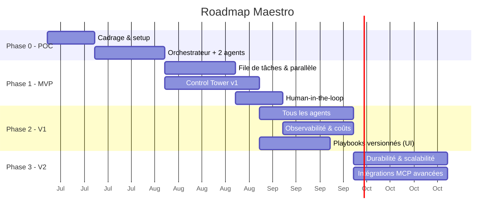

# Roadmap — Maestro

**Version :** 0.1
Approche progressive : **commencer simple**, prouver la valeur, puis robustifier. On n'ajoute de la complexité que lorsqu'elle apporte un bénéfice mesurable.

---

## Vue d'ensemble

> Les durées sont indicatives et à ajuster selon l'équipe. Le diagramme couvre le **plan
> initial** (Phases 0 à 3, toutes soldées) ; le projet a continué au-delà — Phases 4 à 6 plus
> bas, puis la **proposition** issue du cadrage #215.

---

## Phase 0 — POC (preuve de concept)

**But :** valider le cœur orchestrateur-workers avec le Claude Agent SDK, **derrière une frontière d'abstraction fournisseur**.

- Mettre en place le dépôt, l'environnement, l'accès au Claude Agent SDK.
- Poser la **couche d'abstraction fournisseur** (interface `ModelProvider` : `fournisseur + modèle + credentials`) comme frontière d'architecture — **un seul fournisseur câblé (Claude)** pour l'instant, mais l'interface est en place (O7 / ENF-11).
- Un **orchestrateur** qui décompose un objectif simple en 2-3 tâches.
- **Deux agents** (ex. Développeur + BDD) qui exécutent une tâche chacun.
- Exécution **en ligne de commande** (pas encore d'UI), résultats dans des fichiers.

**Critère de sortie :** un objectif → des tâches → 2 agents produisent un résultat exploitable ; le fournisseur de modèle est accédé via l'interface d'abstraction (pas d'appel Claude en dur dans la logique d'agent).

---

## Phase 1 — MVP

**But :** parallélisme réel + interface de supervision minimale + garde-fous.

- **File de tâches** (Celery/BullMQ + Redis) et **workers** → plusieurs agents en parallèle.
- **Auto-assignation** (compétences + classifieur léger).
- **Gestion des dépendances** entre tâches.
- **Control Tower v1** : tableau de bord temps réel + Kanban + réassignation manuelle.
- **Human-in-the-loop** sur les actions sensibles.
- Suivi de **coût** basique par tâche.

**Critère de sortie :** les 6 critères d'acceptation du MVP du [cahier des charges §8](./00-cahier-des-charges.md) sont remplis.

---

## Phase 2 — V1 (produit utilisable au quotidien)

**But :** équipe d'agents complète, personnalisation, observabilité.

- **Les 6 agents** par défaut opérationnels (+ création d'agents personnalisés).
- **Premier fournisseur non-Anthropic branché** via la couche d'abstraction (valide l'agnosticisme de bout en bout — O7 : ≥ 1 fournisseur non-Anthropic en V1).
- **Éditeur de playbooks versionnés** dans l'UI, application à chaud.
- **Observabilité Langfuse** intégrée (traces, coûts, évaluation).
- **Contrôle de capacité** (instances par agent) depuis l'UI.
- **Chat** utilisateur ↔ agent.
- Tableau de bord **coûts & analytics**.

**Critère de sortie :** un projet réel mené de bout en bout avec supervision et coûts maîtrisés.

---

## Phase 3 — V2 (robustesse & échelle)

**But :** fiabilité production et écosystème.

- **Workflows durables** (migration vers Temporal) : reprise sur panne, tâches longues.
- **Scalabilité horizontale** : plusieurs instances par agent, montée en charge.
- **Intégrations MCP avancées** : Figma, Linear/Jira, Slack, cloud providers.
- **Auto-amélioration des playbooks** (l'agent propose des corrections à partir de ses échecs) — livré : analyse à la demande d'un run en échec → proposition en brouillon, appliquée ou rejetée depuis l'UI ([docs/22](./22-auto-amelioration-playbooks.md), #111).
- Renforcement **sécurité** (micro-VM, gestion fine des secrets et permissions).
- Éventuelle migration/ajout de **LangGraph** pour les flux d'état complexes — *tranché en fin de Phase 3 : **non**, l'Agent SDK + Temporal couvrent durabilité, reprise et rejouabilité sans le paradigme de graphe d'états ([docs/23 §5](./23-demo-v2.md)) ; option rouverte si de vrais flux à états cycliques apparaissent.*

---

## Phases 4 à 6 — au-delà du plan initial (état réel)

Le plan ci-dessus s'arrêtait à la V2 ; le projet a continué. Ces trois phases existent comme
**milestones GitLab** et sont la réalité du backlog :

| Phase | But | État |
|---|---|---|
| **Phase 4 — Control Tower UX** | Refonte de l'interface (navigation, thème, notifications, identité, visite guidée, assistant), lots MCP configurables | **soldée** (66/66) |
| **Phase 5 — Socle réel (backend)** | Sortie du mode simulation : lancement/suivi/annulation d'un run par l'API, journal requêtable, streaming, registre de configuration, référence de ticket externe | **en cours** — cadrée par #182, contrats d'API figés dans [docs/05 §6](./05-interface-control-tower.md) |
| **Phase 6 — Control Tower v2 (front)** | Navigation regroupée (fiche agent à onglets), tableau de bord épuré, page Logs, badges d'attente, chat global et direct, paramètres en écriture | **en cours** — voie **parallèle** à la Phase 5, rendue indépendante par les contrats d'API |

---

## Phases suivantes — **proposition** (cadrage #215, aucun milestone créé)

Quatre phases proposées par [docs/24](./24-projets-locaux-et-poste-de-travail.md), qui traite
une question restée ouverte depuis le POC : **Maestro produit des livrables, il ne travaille pas
*dans* un projet**. L'espace de travail d'une tâche est un répertoire temporaire détruit en fin
d'exécution ; l'utilisateur reçoit une copie de fichiers à recopier lui-même.

> ⚠ **Proposition, pas plan arrêté.** Rien n'est créé côté GitLab : ni milestone, ni ticket, ni
> échéance. Sept décisions (D1 à D7) sont en attente — [docs/24 §8](./24-projets-locaux-et-poste-de-travail.md).
> Les Phases 5 et 6 **ne sont pas modifiées** par ce cadrage (décision D7).

| Phase proposée | But | Dépend de |
|---|---|---|
| **7 — Projets & espace de travail réel** | Un projet a une **racine sur le disque** ; les agents y travaillent par branche/worktree ou copie, et l'application des modifications passe par la validation humaine. Le contrat d'isolation et le modèle de menace s'étendent au projet de l'utilisateur | Phase 5 (lancement de run par l'API — livré) |
| **8 — De l'intention au brief** | Un objectif se **compose** (prompt + documents téléversés + dossier de références), se **discute** (questions de clarification) et se **valide** (brief structuré) avant toute décomposition payante | Phase 7 |
| **9 — Poste de travail : distribution** | Le produit s'**installe** : mode local durci (jeton, SQLite), lanceur/installeur et parcours de premier lancement, puis **enveloppe de bureau** embarquant la Control Tower existante | Phases 7 et 8 — ne pas empaqueter une cible mouvante |
| **10 — Continuité & multi-projet** *(à confirmer)* | Un projet vit dans la durée : historique et coûts par projet, mémoire long terme, itération sur un livrable existant, tests réellement exécutés | Phase 7 |

**Ordre et parallélisation** : 7 → 8 → 9, la 10 à confirmer. Les Phases 8 et 9 peuvent se
recouvrir partiellement une fois la 7 livrée (le patron « deux voies par couche » de #182
s'applique à nouveau).

---

## Au-delà (idées V3+)

- Marketplace d'agents et de playbooks partageables.
- **Catalogue étendu de fournisseurs** et **sélection automatique du modèle** par coût/latence/souveraineté (la couche d'abstraction, elle, existe dès la Phase 0 ; ici on enrichit le catalogue et l'auto-sélection).
- Apprentissage des préférences de l'équipe (mémoire long terme enrichie).
- Mode « revue par les pairs » entre agents (débat/consensus à la AutoGen).

---

## Jalons de décision (go / no-go)

| Jalon | Question à trancher |
|-------|---------------------|
| Fin Phase 0 | Le pattern orchestrateur-workers donne-t-il des résultats fiables ? |
| Fin Phase 1 | Le parallélisme et l'auto-assignation tiennent-ils la charge cible ? |
| Fin Phase 2 | Les coûts sont-ils maîtrisés et l'UI suffisante au pilotage quotidien ? |
| Fin Phase 3 | Faut-il un framework d'orchestration dédié (LangGraph) ou rester sur l'Agent SDK ? |
| **Avant Phase 7** | Maestro travaille-t-il sur les **projets locaux** de l'utilisateur, et selon quel patron d'écriture ? *(D1/D2)* |
| **Avant Phase 9** | L'**application de bureau** est-elle la finalité, ou une enveloppe autour d'un produit qui reste web ? *(D3/D4)* |

> **Verdicts rendus.** Chaque jalon est tranché **sur pièces** dans la démo de fin de phase :
> Phase 0 → [docs/11](./11-demo-poc.md), Phase 1 → [docs/12](./12-demo-mvp.md),
> Phase 2 → [docs/13](./13-demo-v1.md), **Phase 3 → [docs/23](./23-demo-v2.md)** (verdict :
> **NO-GO sur LangGraph**, rester sur l'Agent SDK adossé à Temporal pour la durabilité — la
> porte reste ouverte si de vrais flux d'état complexes apparaissent).
