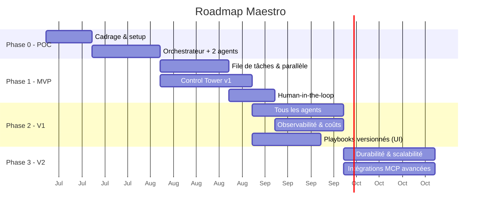

# Roadmap — Maestro

**Version :** 0.1
Approche progressive : **commencer simple**, prouver la valeur, puis robustifier. On n'ajoute de la complexité que lorsqu'elle apporte un bénéfice mesurable.

---

## Vue d'ensemble

> Les durées sont indicatives et à ajuster selon l'équipe. Le diagramme couvre le **plan
> initial** (Phases 0 à 3, toutes soldées) ; le projet a continué au-delà — Phases 4 à 6 plus
> bas, puis les **Phases 7 à 9** issues du cadrage #215 et planifiées par #218, et la **vague
> front « Control Tower v3 »** ouverte par la revue d'usage du 2026-08-05, menée **en parallèle**
> des Phases 8 et 9.

---

## Phase 0 — POC (preuve de concept)

**But :** valider le cœur orchestrateur-workers avec le Claude Agent SDK, **derrière une frontière d'abstraction fournisseur**.

- Mettre en place le dépôt, l'environnement, l'accès au Claude Agent SDK.
- Poser la **couche d'abstraction fournisseur** (interface `ModelProvider` : `fournisseur + modèle + credentials`) comme frontière d'architecture — **un seul fournisseur câblé (Claude)** pour l'instant, mais l'interface est en place (O7 / ENF-11).
- Un **orchestrateur** qui décompose un objectif simple en 2-3 tâches.
- **Deux agents** (ex. Développeur + BDD) qui exécutent une tâche chacun.
- Exécution **en ligne de commande** (pas encore d'UI), résultats dans des fichiers.

**Critère de sortie :** un objectif → des tâches → 2 agents produisent un résultat exploitable ; le fournisseur de modèle est accédé via l'interface d'abstraction (pas d'appel Claude en dur dans la logique d'agent).

---

## Phase 1 — MVP

**But :** parallélisme réel + interface de supervision minimale + garde-fous.

- **File de tâches** (Celery/BullMQ + Redis) et **workers** → plusieurs agents en parallèle.
- **Auto-assignation** (compétences + classifieur léger).
- **Gestion des dépendances** entre tâches.
- **Control Tower v1** : tableau de bord temps réel + Kanban + réassignation manuelle.
- **Human-in-the-loop** sur les actions sensibles.
- Suivi de **coût** basique par tâche.

**Critère de sortie :** les 6 critères d'acceptation du MVP du [cahier des charges §8](./00-cahier-des-charges.md) sont remplis.

---

## Phase 2 — V1 (produit utilisable au quotidien)

**But :** équipe d'agents complète, personnalisation, observabilité.

- **Les 6 agents** par défaut opérationnels (+ création d'agents personnalisés).
- **Premier fournisseur non-Anthropic branché** via la couche d'abstraction (valide l'agnosticisme de bout en bout — O7 : ≥ 1 fournisseur non-Anthropic en V1).
- **Éditeur de playbooks versionnés** dans l'UI, application à chaud.
- **Observabilité Langfuse** intégrée (traces, coûts, évaluation).
- **Contrôle de capacité** (instances par agent) depuis l'UI.
- **Chat** utilisateur ↔ agent.
- Tableau de bord **coûts & analytics**.

**Critère de sortie :** un projet réel mené de bout en bout avec supervision et coûts maîtrisés.

---

## Phase 3 — V2 (robustesse & échelle)

**But :** fiabilité production et écosystème.

- **Workflows durables** (migration vers Temporal) : reprise sur panne, tâches longues.
- **Scalabilité horizontale** : plusieurs instances par agent, montée en charge.
- **Intégrations MCP avancées** : Figma, Linear/Jira, Slack, cloud providers.
- **Auto-amélioration des playbooks** (l'agent propose des corrections à partir de ses échecs) — livré : analyse à la demande d'un run en échec → proposition en brouillon, appliquée ou rejetée depuis l'UI ([docs/22](./22-auto-amelioration-playbooks.md), #111).
- Renforcement **sécurité** (micro-VM, gestion fine des secrets et permissions).
- Éventuelle migration/ajout de **LangGraph** pour les flux d'état complexes — *tranché en fin de Phase 3 : **non**, l'Agent SDK + Temporal couvrent durabilité, reprise et rejouabilité sans le paradigme de graphe d'états ([docs/23 §5](./23-demo-v2.md)) ; option rouverte si de vrais flux à états cycliques apparaissent.*

---

## Phases 4 à 6 — au-delà du plan initial (état réel)

Le plan ci-dessus s'arrêtait à la V2 ; le projet a continué. Ces trois phases existent comme
**milestones GitLab** et sont la réalité du backlog :

| Phase | But | État |
|---|---|---|
| **Phase 4 — Control Tower UX** | Refonte de l'interface (navigation, thème, notifications, identité, visite guidée, assistant), lots MCP configurables | **soldée** (66/66) |
| **Phase 5 — Socle réel (backend)** | Sortie du mode simulation : lancement/suivi/annulation d'un run par l'API, journal requêtable, streaming, registre de configuration, référence de ticket externe | **en cours** — cadrée par #182, contrats d'API figés dans [docs/05 §6](./05-interface-control-tower.md) |
| **Phase 6 — Control Tower v2 (front)** | Navigation regroupée (fiche agent à onglets), tableau de bord épuré, page Logs, badges d'attente, chat global et direct, paramètres en écriture | **en cours** — voie **parallèle** à la Phase 5, rendue indépendante par les contrats d'API |

---

## Phases 7 à 9 — cadrage #215, milestones créés par #218 *(7 et 8 livrées)*

Trois phases issues de [docs/24](./24-projets-locaux-et-poste-de-travail.md), qui traite
une question restée ouverte depuis le POC : **Maestro produit des livrables, il ne travaille pas
*dans* un projet**. L'espace de travail d'une tâche est un répertoire temporaire détruit en fin
d'exécution ; l'utilisateur reçoit une copie de fichiers à recopier lui-même.

> ✅ **Décidé le 2026-08-04.** Les sept décisions D1 à D7 ont été rendues, conformes aux
> recommandations du cadrage ([docs/24 §8](./24-projets-locaux-et-poste-de-travail.md)) : oui aux
> projets locaux (D1), écriture par worktree ou copie + diff sous validation humaine (D2), le
> bureau est une **enveloppe** et non la finalité (D3), lanceur puis Tauri (D4), brief validé
> avant décomposition (D5), ordre 7 → 8 → 9 (D6), Phases 5 et 6 **inchangées** (D7).

| Phase | But | Dépend de | Fenêtre | État |
|---|---|---|---|---|
| **7 — Projets & espace de travail réel** | Un projet a une **racine sur le disque** ; les agents y travaillent par branche/worktree ou copie, et l'application des modifications passe par la validation humaine. Le contrat d'isolation et le modèle de menace s'étendent au projet de l'utilisateur | Phase 5 (lancement de run par l'API — livré) | 2027-03-18 → 2027-04-28 | **livrée** (#219, 8 lots) |
| **8 — De l'intention au brief** | Un objectif se **compose** (prompt + documents téléversés + dossier de références), se **discute** (questions de clarification) et se **valide** (brief structuré) avant toute décomposition payante | Phase 7 | 2027-04-29 → 2027-06-09 | **livrée** (#314, 9 lots) |
| **9 — Poste de travail : distribution** | Le produit s'**installe** : mode local durci (jeton, SQLite), lanceur/installeur et parcours de premier lancement, puis **enveloppe de bureau** embarquant la Control Tower existante | Phases 7 et 8 — ne pas empaqueter une cible mouvante | 2027-06-10 → 2027-07-21 | à venir |

Les fenêtres reprennent la cadence des phases précédentes (~6 semaines) et s'enchaînent après
l'échéance de la Phase 6. Ce sont des repères de planification : une échéance de milestone se
déplace sans rien renier du cadrage. **Les faits l'ont montré dans le sens agréable** : les
Phases 7 et 8 ont été livrées en août 2026, très en avance sur des fenêtres calées sur 2027. Les
dates ci-dessus sont conservées telles quelles — les réécrire après coup ferait passer une
estimation pour une prévision réussie, et c'est l'écart qui est instructif.

**Ordre et parallélisation** : 7 → 8 → 9, respecté. Les Phases 8 et 9 pouvaient se recouvrir
partiellement une fois la 7 livrée (le patron « deux voies par couche » de #182) ; ça n'a pas été
nécessaire, la 8 étant allée plus vite que son cadrage ne le prévoyait.

**Une quatrième phase reste ouverte, sans milestone** : **10 — Continuité & multi-projet** *(à
confirmer)* — un projet vit dans la durée : historique et coûts par projet, mémoire long terme,
itération sur un livrable existant, tests réellement exécutés. Son contenu dépend de ce que la
Phase 7 aura appris de la vie réelle d'un projet ; elle se confirmera à ce moment-là. La **vague
front** décrite plus bas ne la décale pas et ne prend pas sa place : le numéro 10 lui reste
réservé.

> **Tickets : les Phases 7 et 8 sont découpées, la Phase 9 non.** C'est le patron de #182, qui avait
> créé les milestones des Phases 5 et 6 **et semé aussitôt leur premier lot de tickets** (#183,
> #184 avec #185–#188, #189 avec #190–#193), en ne différant que les chantiers suivants « au
> moment de les démarrer ». Phase 7 : parent de suivi **#219** et huit lots — #221 (socle : entité
> Projet et validation de la racine), puis #222, #223, #224, #225 et #226 **prenables en
> parallèle**, #227 (application des livrables sous validation) et #220 (tests + doc).
> **Phase 8 : découpée et livrée** — parent **#314** et neuf lots, #315 (modèle et résolution des
> sources), #316 (extraction et rapport de lecture), #317 (API : un lancement porte ses sources),
> #318 (brief structuré), #319 (composer un objectif), #320 (validation humaine du brief), #321
> (questions de clarification), #322 (valider le brief dans la Control Tower) et #323 (tests + doc).
> Le pari du découpage différé a tenu : la Phase 8 a été découpée **une fois la Phase 7 livrée**,
> et le brief a pu viser un projet qui existait.
> La **Phase 9 reste un contenant vide à dessein** : on n'empaquette pas une cible mouvante.
> **Vide ne veut pas dire seule à venir** : le découpage différé porte sur *cette phase-là*,
> pas sur le backlog. Trois autres milestones, décrits juste en dessous, sont ouverts **et
> découpés** — la **vague front « Control Tower v3 »**, qui se mène en parallèle des Phases 8
> et 9 sans rien changer à leur cadrage.

---

## Vague front « Control Tower v3 » — parallèle aux Phases 8 et 9

**Origine : la revue d'usage du 2026-08-05**, passée sur les écrans livrés par les Phases 4 et 6.
Elle ne rejuge pas ce qui a été construit ; elle relève ce qui manque une fois qu'on s'en sert
pour de bon — un rendu jugé « brouillon » qui revient écran après écran, un tableau de bord qui ne
répond pas à « où en est-on ? » d'un coup d'œil, une fiche agent où l'on ne peut ni créer un agent
guidé par ce qui existe réellement ni lire ce qu'il a fait, et aucune porte d'entrée
conversationnelle. Le **bilan de la Phase 7** y a ajouté un constat de même nature : le projet
n'est pas un écran de plus, c'est le **cadre** de tous les écrans.

**Ce n'est pas une renumérotation.** La vague est une **voie front**, menée en parallèle des
Phases 8 et 9 — exactement ce que la Phase 6 a été à la Phase 5, sur le patron « deux voies par
couche » de #182. Les Phases 8 et 9 gardent leur périmètre, leur ordre (décision D6 : 7 → 8 → 9)
et leurs fenêtres ; la Phase 10 pressentie garde son numéro. Une vague front ne prend pas de
numéro de phase : elle **recouvre** les phases qu'elle accompagne au lieu de s'y insérer.

| Milestone | Contenu | Fenêtre | Suivi |
|---|---|---|---|
| **Control Tower v3 — socle visuel & pilotage** | Un **langage visuel** commun (icônes, cartes, densité) dont tous les autres écrans héritent, puis l'écran de pilotage : détail d'une tâche, tuiles de tête, section Tâches, Journal, carte de Kanban. Et, en amont, le **projet actif comme cadre** de la Control Tower (choix à l'entrée, bascule dans le shell, écrans filtrés) | 2027-04-29 → 2027-05-26 | **#242** — 8 lots (#245–#252) et **#276** — 6 lots (#277–#282) |
| **Control Tower v3 — agents** | La fiche agent complète : création plein écran guidée par un **catalogue** de fournisseurs, modèles et efforts servi par l'API, compétences cadrées, permissions éditables, playbook publié et versionné, chat en direct, onglet Logs | 2027-05-27 → 2027-07-07 | **#243** — 15 lots (#253–#267) |
| **Control Tower v3 — conversation & intégrations** | Chat global (le fil avec l'orchestration, puis l'écran), intégrations MCP sorties du fond des Paramètres avec une bibliothèque élargie, et un écran de validations qui se décide vite | 2027-07-08 → 2027-08-04 | **#244** — 6 lots (#268–#273) |

Les fenêtres démarrent avec la Phase 8 et débordent de deux semaines la fin de la Phase 9 : comme
ailleurs dans ce document, ce sont des repères de planification, pas des engagements. Les trois
milestones s'enchaînent dans cet ordre parce qu'ils dépendent les uns des autres — le **langage
visuel** du premier lot (#245) est ce dont les deux autres héritent, et le **streaming** de
l'onglet Chat (#264) est ce que le chat global réutilise au lieu de le réimplémenter.

Deux points d'articulation avec le reste de la roadmap :

- **#276 précède les autres lots du socle** : chaque écran v3 doit *naître* filtré par le projet
  actif plutôt qu'être refiltré après coup. C'est le pas d'après de la Phase 7 — l'entité Projet
  et sa racine validée existent (#221–#225), il leur manquait de devenir le cadre de l'UI.
- **Le sélecteur de dossier natif (#278) n'anticipe pas la Phase 9** : l'enveloppe de bureau reste
  tranchée par D3/D4 et planifiée là-bas. Le backend tournant déjà sur le poste, il peut ouvrir
  lui-même le sélecteur de l'OS ; le mode serveur garde l'explorateur servi par l'API en repli.

> **Tickets : les trois milestones sont découpés**, contrairement aux Phases 8 et 9 — la revue
> d'usage porte sur des écrans qui **existent**, il n'y a donc rien à attendre pour les découper.
> Même patron que la Phase 7 : un **parent de suivi** par chantier (le premier milestone en porte
> deux), qui porte la checklist ordonnée et ne se ferme que toutes cases cochées, et des lots
> mergeables un à un sur `main`,
> les lots marqués **« (parallèle) »** étant prenables en même temps. La vague **rhabille et
> complète** : aucun de ces lots ne touche à la machine à états du moteur ni à la navigation posée
> par #117/#189, et l'essentiel du travail est front — seuls quelques lots de socle passent par
> l'API (#246, #253, #268, #277).

---

## Au-delà (idées V3+)

- Marketplace d'agents et de playbooks partageables.
- **Catalogue étendu de fournisseurs** et **sélection automatique du modèle** par coût/latence/souveraineté (la couche d'abstraction, elle, existe dès la Phase 0 ; ici on enrichit le catalogue et l'auto-sélection).
- Apprentissage des préférences de l'équipe (mémoire long terme enrichie).
- Mode « revue par les pairs » entre agents (débat/consensus à la AutoGen).

---

## Jalons de décision (go / no-go)

| Jalon | Question à trancher |
|-------|---------------------|
| Fin Phase 0 | Le pattern orchestrateur-workers donne-t-il des résultats fiables ? |
| Fin Phase 1 | Le parallélisme et l'auto-assignation tiennent-ils la charge cible ? |
| Fin Phase 2 | Les coûts sont-ils maîtrisés et l'UI suffisante au pilotage quotidien ? |
| Fin Phase 3 | Faut-il un framework d'orchestration dédié (LangGraph) ou rester sur l'Agent SDK ? |
| ~~Avant Phase 7~~ **tranché le 2026-08-04** | Maestro travaille-t-il sur les **projets locaux** de l'utilisateur, et selon quel patron d'écriture ? → **oui**, par worktree/branche si versionné et copie + diff sinon, l'application restant une action sensible *(D1/D2, #218)* |
| ~~Avant Phase 9~~ **tranché le 2026-08-04** | L'**application de bureau** est-elle la finalité, ou une enveloppe autour d'un produit qui reste web ? → **une enveloppe** ; lanceur/installeur d'abord, Tauri ensuite, Electron écarté *(D3/D4, #218)* |
| **Fin Phase 7** | La Phase **10 — Continuité & multi-projet** se confirme-t-elle, et avec quel périmètre ? |

> **Verdicts rendus.** Chaque jalon est tranché **sur pièces** dans la démo de fin de phase :
> Phase 0 → [docs/11](./11-demo-poc.md), Phase 1 → [docs/12](./12-demo-mvp.md),
> Phase 2 → [docs/13](./13-demo-v1.md), **Phase 3 → [docs/23](./23-demo-v2.md)** (verdict :
> **NO-GO sur LangGraph**, rester sur l'Agent SDK adossé à Temporal pour la durabilité — la
> porte reste ouverte si de vrais flux d'état complexes apparaissent).
