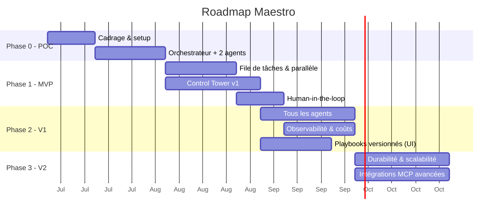

# Roadmap — Maestro

**Version :** 0.1
Approche progressive : **commencer simple**, prouver la valeur, puis robustifier. On n'ajoute de la complexité que lorsqu'elle apporte un bénéfice mesurable.

---

## Vue d'ensemble

> Les durées sont indicatives et à ajuster selon l'équipe. Le diagramme couvre le **plan
> initial** (Phases 0 à 3, toutes soldées) ; le projet a continué au-delà — Phases 4 à 6 plus
> bas, puis les **Phases 7 à 9** issues du cadrage #215 et planifiées par #218, et la **vague
> front « Control Tower v3 »** ouverte par la revue d'usage du 2026-08-05, menée **en parallèle**
> des Phases 8 et 9. Les chantiers nés de l'usage viennent ensuite, puis le jalon **« L'équipe sur
> mesure »**, né d'une idée le 2026-09-19 et placé devant la Phase 9. Le jalon **« Avant
> l'installeur »** vient ensuite (2026-09-21) : il réunit les réserves des deux jalons précédents et
> passe à son tour devant la Phase 9.

---

## Phase 0 — POC (preuve de concept)

**But :** valider le cœur orchestrateur-workers avec le Claude Agent SDK, **derrière une frontière d'abstraction fournisseur**.

- Mettre en place le dépôt, l'environnement, l'accès au Claude Agent SDK.
- Poser la **couche d'abstraction fournisseur** (interface `ModelProvider` : `fournisseur + modèle + credentials`) comme frontière d'architecture — **un seul fournisseur câblé (Claude)** pour l'instant, mais l'interface est en place (O7 / ENF-11).
- Un **orchestrateur** qui décompose un objectif simple en 2-3 tâches.
- **Deux agents** (ex. Développeur + BDD) qui exécutent une tâche chacun.
- Exécution **en ligne de commande** (pas encore d'UI), résultats dans des fichiers.

**Critère de sortie :** un objectif → des tâches → 2 agents produisent un résultat exploitable ; le fournisseur de modèle est accédé via l'interface d'abstraction (pas d'appel Claude en dur dans la logique d'agent).

---

## Phase 1 — MVP

**But :** parallélisme réel + interface de supervision minimale + garde-fous.

- **File de tâches** (Celery/BullMQ + Redis) et **workers** → plusieurs agents en parallèle.
- **Auto-assignation** (compétences + classifieur léger).
- **Gestion des dépendances** entre tâches.
- **Control Tower v1** : tableau de bord temps réel + Kanban + réassignation manuelle.
- **Human-in-the-loop** sur les actions sensibles.
- Suivi de **coût** basique par tâche.

**Critère de sortie :** les 6 critères d'acceptation du MVP du [cahier des charges §8](./00-cahier-des-charges.md) sont remplis.

---

## Phase 2 — V1 (produit utilisable au quotidien)

**But :** équipe d'agents complète, personnalisation, observabilité.

- **Les 6 agents** par défaut opérationnels (+ création d'agents personnalisés).
  ⚠ *Renversé le 2026-09-19* ([docs/37](./37-decision-equipe-sur-mesure.md)) : un projet naîtra
  **sans agent**, et son équipe sera dérivée de son analyse. Voir « L'équipe sur mesure » plus bas.
- **Premier fournisseur non-Anthropic branché** via la couche d'abstraction (valide l'agnosticisme de bout en bout — O7 : ≥ 1 fournisseur non-Anthropic en V1).
- **Éditeur de playbooks versionnés** dans l'UI, application à chaud.
- **Observabilité Langfuse** intégrée (traces, coûts, évaluation).
- **Contrôle de capacité** (instances par agent) depuis l'UI.
- **Chat** utilisateur ↔ agent.
- Tableau de bord **coûts & analytics**.

**Critère de sortie :** un projet réel mené de bout en bout avec supervision et coûts maîtrisés.

---

## Phase 3 — V2 (robustesse & échelle)

**But :** fiabilité production et écosystème.

- **Workflows durables** (migration vers Temporal) : reprise sur panne, tâches longues.
- **Scalabilité horizontale** : plusieurs instances par agent, montée en charge.
- **Intégrations MCP avancées** : Figma, Linear/Jira, Slack, cloud providers.
- **Auto-amélioration des playbooks** (l'agent propose des corrections à partir de ses échecs) — livré : analyse à la demande d'un run en échec → proposition en brouillon, appliquée ou rejetée depuis l'UI ([docs/22](./22-auto-amelioration-playbooks.md), #111).
- Renforcement **sécurité** (micro-VM, gestion fine des secrets et permissions).
- Éventuelle migration/ajout de **LangGraph** pour les flux d'état complexes — *tranché en fin de Phase 3 : **non**, l'Agent SDK + Temporal couvrent durabilité, reprise et rejouabilité sans le paradigme de graphe d'états ([docs/23 §5](./23-demo-v2.md)) ; option rouverte si de vrais flux à états cycliques apparaissent.*

---

## Phases 4 à 6 — au-delà du plan initial (état réel)

Le plan ci-dessus s'arrêtait à la V2 ; le projet a continué. Ces trois phases existent comme
**milestones de la forge** — GitHub depuis la migration #344, GitLab avant elle — et sont la
réalité du backlog :

| Phase | But | État |
|---|---|---|
| **Phase 4 — Control Tower UX** | Refonte de l'interface (navigation, thème, notifications, identité, visite guidée, assistant), lots MCP configurables | **soldée** (66/66) |
| **Phase 5 — Socle réel (backend)** | Sortie du mode simulation : lancement/suivi/annulation d'un run par l'API, journal requêtable, streaming, registre de configuration, référence de ticket externe | **soldée** (24/24) — cadrée par #182, contrats d'API figés dans [docs/05 §6](./05-interface-control-tower.md) |
| **Phase 6 — Control Tower v2 (front)** | Navigation regroupée (fiche agent à onglets), tableau de bord épuré, page Logs, badges d'attente, chat global et direct, paramètres en écriture | **soldée** (5/5) — voie **parallèle** à la Phase 5, rendue indépendante par les contrats d'API |

> ⚠ **Les deux « en cours » de ce tableau ont été relus le 2026-08-24** (#470) : les milestones
> étaient **fermés** côté forge et ce document ne l'avait pas repris. Deux réserves à garder en
> tête, parce que « milestone soldé » ne veut pas dire « chantier fini » : quelques **contrats
> d'API du §6 de docs/05 restent figés sans être servis** — `GET /api/journal` en était, il a
> été **servi par #478** ([docs/05 §6.2](./05-interface-control-tower.md)) —, et le **chat
> global** de la Phase 6 a été redécoupé dans la vague front (#268/#269).

---

## Phases 7 à 9 — cadrage #215, milestones créés par #218 *(7 et 8 livrées)*

Trois phases issues de [docs/24](./24-projets-locaux-et-poste-de-travail.md), qui traite
une question restée ouverte depuis le POC : **Maestro produit des livrables, il ne travaille pas
*dans* un projet**. L'espace de travail d'une tâche est un répertoire temporaire détruit en fin
d'exécution ; l'utilisateur reçoit une copie de fichiers à recopier lui-même.

> ✅ **Décidé le 2026-08-04.** Les sept décisions D1 à D7 ont été rendues, conformes aux
> recommandations du cadrage ([docs/24 §8](./24-projets-locaux-et-poste-de-travail.md)) : oui aux
> projets locaux (D1), écriture par worktree ou copie + diff sous validation humaine (D2 —
> **révisée le 2026-09-04** par #703 : fusion continue sous un accord par run si versionné,
> écriture en place sinon, [docs/24 §2.4](./24-projets-locaux-et-poste-de-travail.md)), le
> bureau est une **enveloppe** et non la finalité (D3), lanceur puis Tauri (D4 — **renversée le
> 2026-09-11** par #921 : la coque est **Electron** et Tauri est écarté, l'**ordre** restant
> lanceur → installeur → enveloppe, [docs/35 §2](./35-decision-poste-de-bureau-et-disposition.md)),
> brief validé avant décomposition (D5), ordre 7 → 8 → 9 (D6), Phases 5 et 6 **inchangées** (D7).

| Phase | But | Dépend de | Fenêtre | État |
|---|---|---|---|---|
| **7 — Projets & espace de travail réel** | Un projet a une **racine sur le disque** ; les agents y travaillent par branche/worktree ou copie, et l'application des modifications passe par la validation humaine. Le contrat d'isolation et le modèle de menace s'étendent au projet de l'utilisateur | Phase 5 (lancement de run par l'API — livré) | 2027-03-18 → 2027-04-28 | **livrée** (#219, 8 lots) |
| **8 — De l'intention au brief** | Un objectif se **compose** (prompt + documents téléversés + dossier de références), se **discute** (questions de clarification) et se **valide** (brief structuré) avant toute décomposition payante | Phase 7 | 2027-04-29 → 2027-06-09 | **livrée** (#314, 9 lots) |
| **9 — Poste de travail : distribution** | Le produit s'**installe** : mode local durci (jeton, SQLite), lanceur/installeur et parcours de premier lancement. L'**enveloppe de bureau** en est **sortie** le 2026-09-11 (#643 abandonné) : elle est livrée par « L'atelier » et devient **Electron** ([docs/35](./35-decision-poste-de-bureau-et-disposition.md)) | Phases 7 et 8 — ne pas empaqueter une cible mouvante | 2027-06-10 → 2027-07-21 | découpée (#637, 8 lots) ; critères de sortie posés le 2026-09-21 |

Les fenêtres reprennent la cadence des phases précédentes (~6 semaines) et s'enchaînent après
l'échéance de la Phase 6. Ce sont des repères de planification : une échéance de milestone se
déplace sans rien renier du cadrage. **Les faits l'ont montré dans le sens agréable** : les
Phases 7 et 8 ont été livrées en août 2026, très en avance sur des fenêtres calées sur 2027. Les
dates ci-dessus sont conservées telles quelles — les réécrire après coup ferait passer une
estimation pour une prévision réussie, et c'est l'écart qui est instructif.

**Ordre et parallélisation** : 7 → 8 → 9, respecté. Les Phases 8 et 9 pouvaient se recouvrir
partiellement une fois la 7 livrée (le patron « deux voies par couche » de #182) ; ça n'a pas été
nécessaire, la 8 étant allée plus vite que son cadrage ne le prévoyait.

**Une quatrième phase reste ouverte, sans milestone** : **10 — Continuité & multi-projet** *(à
confirmer)* — un projet vit dans la durée : historique et coûts par projet, mémoire long terme,
itération sur un livrable existant, tests réellement exécutés. Son contenu dépend de ce que la
Phase 7 aura appris de la vie réelle d'un projet ; elle se confirmera à ce moment-là. La **vague
front** décrite plus bas ne la décale pas et ne prend pas sa place : le numéro 10 lui reste
réservé.

> **Tickets : les Phases 7 et 8 sont découpées, la Phase 9 non.** C'est le patron de #182, qui avait
> créé les milestones des Phases 5 et 6 **et semé aussitôt leur premier lot de tickets** (#183,
> #184 avec #185–#188, #189 avec #190–#193), en ne différant que les chantiers suivants « au
> moment de les démarrer ». Phase 7 : parent de suivi **#219** et huit lots — #221 (socle : entité
> Projet et validation de la racine), puis #222, #223, #224, #225 et #226 **prenables en
> parallèle**, #227 (application des livrables sous validation) et #220 (tests + doc).
> **Phase 8 : découpée et livrée** — parent **#314** et neuf lots, #315 (modèle et résolution des
> sources), #316 (extraction et rapport de lecture), #317 (API : un lancement porte ses sources),
> #318 (brief structuré), #319 (composer un objectif), #320 (validation humaine du brief), #321
> (questions de clarification), #322 (valider le brief dans la Control Tower) et #323 (tests + doc).
> Le pari du découpage différé a tenu : la Phase 8 a été découpée **une fois la Phase 7 livrée**,
> et le brief a pu viser un projet qui existait.
> La **Phase 9 est restée un contenant vide à dessein** — on n'empaquette pas une cible mouvante —
> jusqu'à son découpage : parent **#637** et huit lots (#638–#645). **Vide ne voulait pas dire
> seule à venir** : le découpage différé portait sur *cette phase-là*, pas sur le backlog. Les
> autres milestones, décrits juste en dessous, étaient ouverts **et découpés** — la **vague front
> « Control Tower v3 »**, menée en parallèle des Phases 8 et 9 sans rien changer à leur cadrage.
>
> ⚠ **Un de ses lots a changé de main le 2026-09-11** : **#643 « Enveloppe Tauri » est abandonné**
> au profit du lot 2 de **#921** — la coque devient **Electron**, et elle est livrée dans
> « L'atelier » parce qu'elle n'a rien à attendre (elle affiche ce que la stack locale sert,
> **ENF-12**). Ce que la Phase 9 garde est l'**empaquetage** : #640, #641, #642, #644. Le
> renversement porte sur *quelle* coque, jamais sur *quand* — voir
> [docs/35 §2](./35-decision-poste-de-bureau-et-disposition.md).

**Les critères de sortie de la Phase 9 sont posés depuis le 2026-09-21** (#1113), dans la
description de son milestone, section `## Critères de sortie`, C1 à C9. C'est cette section qui fait
foi au bouclage (docs/10 §3.4), pas ce résumé. Ils ont été posés **avant le premier lot** : aucun lot
de #637 n'avait démarré. Ils ne sont pas rédigés : ils sont recopiés des textes de cadrage (EF-41,
ENF-12, D3, le corps de #637 et les critères des lots #638 à #645), et chacun cite sa source. La
description du milestone a été corrigée le même jour. Elle parlait encore d'une enveloppe Tauri et
d'une échéance au 2027-11-10.

**Sa place dans la file a changé le même jour.** Les réserves des verdicts précédents passent devant
elle, dans le jalon « Avant l'installeur » (section du même nom, plus bas).
Un effet de bord est assumé : dans un run autonome, **#638, #639 et #640** (jeton d'API, SQLite,
lanceur) passent eux aussi derrière les réserves. Aucun ordre ne peut placer les réserves entre #640
et #641, parce que les lots d'un parent restent contigus dans le plan. Ces trois lots ne sont pas de
l'empaquetage : ils **restent démarrables à la main** sans attendre, et #638 ferme un trou ouvert
aujourd'hui.

---

## Vague front « Control Tower v3 » — parallèle aux Phases 8 et 9

**Origine : la revue d'usage du 2026-08-05**, passée sur les écrans livrés par les Phases 4 et 6.
Elle ne rejuge pas ce qui a été construit ; elle relève ce qui manque une fois qu'on s'en sert
pour de bon — un rendu jugé « brouillon » qui revient écran après écran, un tableau de bord qui ne
répond pas à « où en est-on ? » d'un coup d'œil, une fiche agent où l'on ne peut ni créer un agent
guidé par ce qui existe réellement ni lire ce qu'il a fait, et aucune porte d'entrée
conversationnelle. Le **bilan de la Phase 7** y a ajouté un constat de même nature : le projet
n'est pas un écran de plus, c'est le **cadre** de tous les écrans.

**Ce n'est pas une renumérotation.** La vague est une **voie front**, menée en parallèle des
Phases 8 et 9 — exactement ce que la Phase 6 a été à la Phase 5, sur le patron « deux voies par
couche » de #182. Les Phases 8 et 9 gardent leur périmètre, leur ordre (décision D6 : 7 → 8 → 9)
et leurs fenêtres ; la Phase 10 pressentie garde son numéro. Une vague front ne prend pas de
numéro de phase : elle **recouvre** les phases qu'elle accompagne au lieu de s'y insérer.

| Milestone | Contenu | Fenêtre | Suivi |
|---|---|---|---|
| **Control Tower v3 — socle visuel & pilotage** | Un **langage visuel** commun (icônes, cartes, densité) dont tous les autres écrans héritent, puis l'écran de pilotage : détail d'une tâche, tuiles de tête, section Tâches, Journal, carte de Kanban. Et, en amont, le **projet actif comme cadre** de la Control Tower (choix à l'entrée, bascule dans le shell, écrans filtrés) | 2027-04-29 → 2027-05-26 | **#242** — 8 lots (#245–#252) et **#276** — 6 lots (#277–#282) |
| **Control Tower v3 — conversation & intégrations** | Chat global (le fil avec l'orchestration, puis l'écran), intégrations MCP sorties du fond des Paramètres avec une bibliothèque élargie, et un écran de validations qui se décide vite | 2027-05-27 → 2027-08-04 | **#244** — 6 lots (#268–#273) |
| **Control Tower v3 — agents** | La fiche agent complète : création plein écran guidée par un **catalogue** de fournisseurs, modèles et efforts servi par l'API, compétences cadrées, permissions éditables, playbook publié et versionné, chat en direct, onglet Logs | 2027-08-05 → 2027-09-29 | **#243** — 15 lots (#253–#267) |

Les fenêtres démarrent avec la Phase 8 et débordent de dix semaines la fin de la Phase 9 : comme
ailleurs dans ce document, ce sont des repères de planification, pas des engagements. Les trois
milestones s'enchaînent dans cet ordre parce qu'ils dépendent les uns des autres — le **langage
visuel** du premier lot (#245) est ce dont les deux autres héritent, et le **streaming** du chat
global (#268) est ce que l'onglet Chat de la fiche agent (#264) réutilise au lieu de le
réimplémenter.

> ⚠ **Les deux derniers milestones ont échangé leur place, et la dépendance a suivi** (#620,
> arbitrage du 2026-08-27). L'ordre initial donnait « agents » en deuxième (2027-05-27 →
> 2027-07-07) et faisait naître le streaming dans l'onglet Chat (#264), à charge pour le chat
> global de le réutiliser. La revue d'usage du 2026-08-24 (#470,
> [docs/29](./29-decision-run-objet-de-premier-plan.md)) a fait du chat la **seule porte
> d'entrée**, et les chantiers nés de l'usage ont pris cette fenêtre-là : « agents » est reportée
> au 2027-09-29, « conversation & intégrations » passe devant. Le chat global se retrouvait donc
> premier, héritier d'un socle qui venait après lui. Ce qui a été inversé est le **sens** de la
> dépendance, jamais sa nature : il y a toujours **une** implémentation du streaming, et une
> seule. C'est fait — #268 l'a construite **comme un canal** plutôt que comme une particularité du
> chat global (`ServiceChat.diffuser`, `GET /api/chat/{agent}/flux`), et #264 la réutilisera. Même
> inversion pour la **mise en page conversationnelle** : construite par #269 (l'écran du chat
> global), réutilisée par le lot 13 de « agents » (#265).

> ⚠ **La demande est revenue, plus large, et la recherche l'a instruite** (#471,
> [docs/30](./30-cible-visuelle-control-tower.md), mesures du 2026-08-25). Non plus « harmoniser ce
> qu'on a » mais « aller chercher un niveau » — et le renversement est que **le niveau ne se tient
> pas par une maquette, mais par un test** : Code Connect, la seule mécanique qui relierait un
> design system Figma au code, est **refusée sur ce compte** (plan `starter`), et le langage visuel
> de #245 est aujourd'hui **contourné plus souvent qu'il n'est utilisé** (18 recopies de carte, 26
> boutons refaits, 1 750 couleurs en dur pour 0 token). La recherche ne rejuge pas #245 : elle
> demande ce qui le **tient**. Chantier : **#532**, 7 lots (#533–#539), 7 sessions.

Deux points d'articulation avec le reste de la roadmap :

- **#276 précède les autres lots du socle** : chaque écran v3 doit *naître* filtré par le projet
  actif plutôt qu'être refiltré après coup. C'est le pas d'après de la Phase 7 — l'entité Projet
  et sa racine validée existent (#221–#225), il leur manquait de devenir le cadre de l'UI.
- **Le sélecteur de dossier natif (#278) n'anticipe pas la Phase 9** : l'enveloppe de bureau reste
  tranchée par D3/D4 et planifiée là-bas. Le backend tournant déjà sur le poste, il peut ouvrir
  lui-même le sélecteur de l'OS ; le mode serveur garde l'explorateur servi par l'API en repli.

> **Tickets : les trois milestones sont découpés**, contrairement aux Phases 8 et 9 — la revue
> d'usage porte sur des écrans qui **existent**, il n'y a donc rien à attendre pour les découper.
> Même patron que la Phase 7 : un **parent de suivi** par chantier (le premier milestone en porte
> deux), qui porte la checklist ordonnée et ne se ferme que toutes cases cochées, et des lots
> mergeables un à un sur `main`,
> les lots marqués **« (parallèle) »** étant prenables en même temps. La vague **rhabille et
> complète** : aucun de ces lots ne touche à la machine à états du moteur ni à la navigation posée
> par #117/#189, et l'essentiel du travail est front — seuls quelques lots de socle passent par
> l'API (#246, #253, #268, #277).

---

## Chantiers hors phases — ce que l'usage a ouvert (2026-08 → 2026-09)

Cinq milestones sont nés **après** la vague front, d'un usage réel plutôt que d'un cadrage : on
s'est servi du produit et de son outillage, et ce qui manquait s'est vu. Ils ne prennent **pas de
numéro de phase**, pour la raison déjà écrite pour la vague front — un chantier né de l'usage
**recouvre** les phases qu'il accompagne au lieu de s'y insérer, et le numéro 10 reste réservé à
« Continuité & multi-projet ».

| Milestone | Contenu | Échéance | Suivi |
|---|---|---|---|
| **Le run, objet de premier plan** | Un run se **liste**, s'**ouvre**, se **suit** et se **pilote** depuis la Control Tower : entrée de menu « Runs », vue par run portant son Kanban et sa progression, tableau de bord qui montre l'état des runs, **pause**, journal persisté, causes d'arrêt remontées — puis le suivi **en pipeline** (graphe des tâches, checklists, branches parallèles) | 2027-06-15 | **#472** — 8 lots (#473–#480), **complet** ; **#488** — 4 lots (#489–#492), **complet** |
| **Résilience des runs** | Un run ne se perd plus : il survit à l'arrêt de son API (**hôte détaché**, livré), se voit quand il meurt, se rattrape sur son brief — et, depuis la revue du 2026-08-24, **se solde quand on éteint Maestro exprès** | 2027-06-30 | **#441** — 6 lots (#442–#447), **#347** et #486 |
| **Collaboration inter-agents** | Ce que les agents se disent pendant un run, et une surface qu'ils écrivent ensemble | 2027-09-01 | #354, #355, #356 |
| **Outillage de la forge** | Le workflow lui-même : merge automatique en fin de ticket, découpage porté par les sub-issues natives | 2027-09-15 | **#413** et **#389** |
| **L'atelier — le travail au centre, la conversation à portée** | La Control Tower devient un **poste de travail de bureau** : une fenêtre **Electron**, un shell à **trois zones** (navigation à gauche, travail au centre, conversation à droite), le **pipeline du run** comme vue de travail — et les quatre constats du retex qui vivent dans ces surfaces | 2027-11-09 | **#921** — 11 lots (#922–#928, puis #938, #947, #949 et #929 « tests + doc ») |

**Le chantier « Le run, objet de premier plan » est le seul des quatre à être né d'une décision
écrite** : la revue d'usage du **2026-08-24** portait seize demandes, dont **trois renversaient une
décision documentée et livrée** — elles ont été tranchées en note avant d'être découpées
([docs/29](./29-decision-run-objet-de-premier-plan.md), #470). Les trois arbitrages : le **Kanban
quitte le tableau de bord** pour la vue d'un run — le run devient une portée d'écran **à côté** du
projet, qui reste le cadre (#277/#281 ne sont pas défaits) ; le **chat devient la seule porte
d'entrée**, où « composer » et « valider le brief » déménagent sans que la décision **D5** tombe ;
l'**arrêt volontaire solde les runs**, l'accident ne les touche pas.

Deux articulations avec le reste de la roadmap :

- **Le chantier du chat ne vit pas ici** : ses quatre lots (#481 — #482–#485) sont rattachés à
  **« Control Tower v3 — conversation & intégrations »**, qu'ils prolongent. Le chat global (#268,
  #269) y est déjà découpé et ne prévoit ni pièces jointes ni sources ; les y ajouter est le
  chantier, pas une seconde implémentation à côté.
- **La détection de ce que le poste a déjà installé** (#487) est rattachée à **« Control Tower v3 —
  agents »**, derrière #253 : le catalogue servi par l'API doit exister avant qu'une sonde ait un
  endroit où se rendre. Son prix avait été nommé et refusé pour un autre usage
  ([docs/28 §7](./28-decision-frontiere-execution-run.md)) ; le payer ici est un choix, rendu en
  [docs/29 §7](./29-decision-run-objet-de-premier-plan.md).
  ⚠ **L'ordre a été tenu autrement que prévu** (livré le 2026-08-29) : #487 est arrivé le premier,
  #253 n'ayant encore rien livré. Plutôt que d'ouvrir la seconde source que son critère 3 interdit,
  la sonde a **créé l'endroit où se rendre** — `GET /api/fournisseurs`
  ([`maestro/controltower/fournisseurs.py`](../maestro/controltower/fournisseurs.py)), dont la
  colonne « supporté » est lue du **registre du code** (`available_providers()`), exactement ce que
  demande le critère 2 de #253. Ce qui reste à #253 s'ajoute donc **en colonnes de cette
  charge-là** — les **modèles** d'un fournisseur et les **niveaux d'effort** d'un modèle, puis
  l'effort porté par la définition d'un agent — et surtout pas sur une route à lui : `modeles_ici`
  dit ce que la **sonde** a vu sur ce poste, jamais ce que Maestro supporte, et les deux colonnes ne
  se confondent nulle part.

⚠ **« L'atelier » passe DEVANT la Phase 9, et c'est une décision** (2026-09-11,
[docs/35](./35-decision-poste-de-bureau-et-disposition.md), #921). Son échéance — 2027-11-09, la
veille de celle de la Phase 9 — n'est pas un repère de plus : `lib.sh current-milestone` retient
**le jalon actif le plus ancien du rail qui porte encore un ticket ouvert**, si bien que la date
*est* l'ordre de traitement. Trois choses la justifient, et la troisième est la moins évidente :

- **D6 n'est pas violée.** L'ordre 7 → 8 → 9 porte sur les **phases** ; l'atelier n'en est pas une,
  il **recouvre** comme la vague front. Le numéro 10 reste réservé.
- **L'argument de la Phase 9 joue en sa faveur**, pas contre lui : « on n'empaquette pas une cible
  mouvante » (§4.8 de docs/24). La disposition bouge — donc elle bouge **avant** l'empaquetage, pas
  pendant. Ordonner l'inverse ferait empaqueter deux fois.
- **La coque, elle, est livrée dès le lot 2** — sans attendre le reste. Ce n'est pas une entorse à
  l'ordre de **D4** : c'est une coque **de développement**, qui sert la stack locale. Le lanceur
  (#640), l'installeur (#641), le premier lancement (#642) et les mises à jour (#644) restent en
  Phase 9, dans leur ordre.

> ⚠ **« La veille de celle de la Phase 9 » n'est plus vrai depuis le 2026-09-19.** La Phase 9 a
> reculé au **2028-02-16**, pour laisser passer devant elle « L'équipe sur mesure » (section
> suivante). L'argument qui a fait passer l'atelier devant la Phase 9 est le même, et
> l'ordre entre l'atelier et la Phase 9 ne change pas.

> **Tickets : les cinq milestones sont découpés**, comme la vague front et pour la même raison —
> ils portent sur un produit et un outillage qui **existent**, il n'y a rien à attendre pour les
> découper. Même patron : un **parent de suivi** par chantier, qui porte la checklist ordonnée et
> ne se ferme que toutes cases cochées, et des lots mergeables un à un sur `main`, les lots marqués
> **« (parallèle) »** étant prenables en même temps. Les échéances sont des repères de
> planification, comme partout ailleurs dans ce document.

---

## « L'équipe sur mesure » — un jalon né d'une idée (2026-09-19)

Ce jalon n'est né ni d'un cadrage de phase ni d'une revue d'usage : il vient d'une **idée exposée
en conversation**, instruite par [`/idee`](../.claude/commands/idee.md) (#1013) et consignée par
#1044. Comme les chantiers nés de l'usage, il ne prend **pas de numéro de phase**. Le numéro 10
reste réservé.

| Milestone | Contenu | Échéance | Suivi |
|---|---|---|---|
| **L'équipe sur mesure — chaque projet s'outille et recrute ses agents** | Voir le détail ci-dessous | 2028-01-05 | **#1022** ; **#1019** — 5 lots (#1023–#1027) ; **#1020** — 7 lots (#1029–#1035) ; **#1021** — 7 lots (#1037–#1043) |

Le contenu du jalon, en quatre points :
- **Un répertoire commun des projets**, rempli par défaut et modifiable, où naît un projet neuf. Un projet existant se choisit en parcourant soi-même.
- **L'outillage d'abord.** La première étape de tout projet est son **outillage universel** (AGENTS.md, Agent Skills, scripts) : recommandé par l'analyse d'un projet existant, choisi par l'utilisateur pour un projet neuf, généré dans son dossier et lu par nos agents.
- **Aucun agent figé.** L'équipe de chaque projet est **dérivée de son analyse** (rôles, instances, playbooks, skills, autorisations), puis validée par l'utilisateur.
- **Autonomie sous arbitrage.** Tout agent **demande** quand il le faut et **tranche seul** le reste, en le consignant.

**Deux décisions tombent, à la demande explicite de la personne**, et une note les écrit :
[docs/37](./37-decision-equipe-sur-mesure.md).
- Les agents cessent d'être une ressource du poste. Cela renverse [docs/05 §2.0](./05-interface-control-tower.md) et le « 6 agents par défaut » de la Phase 2.
- « Personne ne répond en cours de tâche » tombe : le socle des playbooks, [docs/04 §1.2](./04-specifications-agents.md).

Trois choses **ne bougent pas** :
- [docs/32](./32-decision-cran-orchestrateur.md) : aucune IA ne juge l'appel d'outil d'une autre ;
- EF-08 : sans réponse, un acte sensible est refusé ;
- [docs/34 §4.6](./34-decision-agent-cli-tiers-acp.md) : la configuration ambiante reste fermée.

**Ordre des chantiers.** Le répertoire des projets est indépendant. La **question** vient d'abord, parce que l'outillage d'un projet neuf et l'équipe proposée **se demandent** à l'utilisateur. L'**outillage** vient ensuite, puis l'**équipe**, qui branche les skills que l'outillage a générés. Les trois parents sont en `prio::haute`, créés dans cet ordre, et `queue.sh` les tient donc dans cet ordre.

**Place dans la file**, sur le rail produit, où l'échéance *est* le rang :

| Jalon | Échéance |
| --- | --- |
| « L'atelier » | 2027-11-09 |
| **« L'équipe sur mesure »** | **2028-01-05** |
| « Avant l'installeur » *(ajouté le 2026-09-21, section suivante)* | 2028-01-26 |
| Phase 9 | 2028-02-16 (était 2027-11-10) |

- Le jalon vient **après « L'atelier »**, qui est en cours et qu'on ne double pas.
- Il passe **devant la Phase 9**, pour l'argument de la Phase 9 elle-même : on n'empaquette pas une cible mouvante (§4.8 de docs/24). La création d'un projet et le modèle d'agents changent ici : ils changent **avant** l'installeur, pas pendant.
- #938, le sélecteur natif et le glisser-déposer d'un dossier, passe en `prio::haute` : il rend direct le parcours d'un projet existant.
- #642, le premier lancement, est l'endroit où proposer le répertoire des projets.

> ⚠ **Les critères de sortie du jalon sont dans sa description**, section `## Critères de sortie`
> (C1 à C5, dans les mots de la demande). C'est elle qui fait foi au bouclage (docs/10 §3.4), pas ce
> résumé.

---

## « Avant l'installeur » — les réserves levées avant l'empaquetage (2026-09-21)

Ce jalon est né d'une demande du 2026-09-21, instruite par [`/idee`](../.claude/commands/idee.md)
et consignée par #1113 : *« les réserves doivent passer devant l'installeur »*. Comme « L'équipe sur
mesure », il ne prend **pas de numéro de phase**.

| Milestone | Contenu | Échéance | Suivi |
|---|---|---|---|
| **Avant l'installeur — les réserves levées** | Les réserves des verdicts de « L'atelier » et de « L'équipe sur mesure », et trois constats du retex du 2026-09-11 | 2028-01-26 | 14 tickets indépendants, sans parent de suivi |

**Son contenu : ce qui était rangé en Phase 9 derrière l'installeur.** Les deux verdicts du
2026-09-21 ont rangé leurs réserves au milestone courant du rail produit, comme le veut
`/milestone-verdict`. Leurs jalons étant soldés, ce milestone courant était la Phase 9. Le plan de
`queue.sh` y plaçait l'installeur #641 au **rang 4**, et ces 14 tickets aux **rangs 8 à 21**.
- **Verdict de « L'atelier »** : R1 → #1106 (la colonne ne porte pas les gestes du fil), R2 → #1107,
  R3 → #1108, R4 → #1109 ; ses relevés hors critères → #1110, #1111, #1112.
- **Verdict de « L'équipe sur mesure »** : R3 → #1101, R4 → #1102, R7 → #1104 ; son relevé hors
  critères → #1105.
- **Retex du 2026-09-11** : G6 → #939 (le produit parle le dépôt), G7 → #940 (la visite guidée),
  G9 → #942 (les amorces du chat).

**Pourquoi un jalon, et pas des priorités.** Dans un jalon, `queue.sh` trie par blocs. Les lots d'un
même parent restent **contigus** et prennent la **meilleure priorité** de leurs lots. À priorité
égale, le plus petit iid passe. Le bloc #637 est donc `haute` et part de #638 : il passe devant
toute réserve. Même avec tous ses lots en `basse`, il resterait devant les quatre réserves `basse`,
puisque `638 < 1105`. Il aurait fallu, en plus, remonter ces quatre-là. `prio::` n'aurait alors plus
rien dit : une élision manquante en `moyenne`, un trou de sécurité en `basse`. Entre jalons,
l'échéance **est** l'ordre, et c'est le seul levier honnête. Les réserves portent aussi leurs propres
critères, ceux des deux verdicts. Ce ne sont pas ceux de la Phase 9, qui sont d'installer, de lancer
et de mettre à jour.

**Place dans la file**, sur le rail produit :

| Jalon | Échéance |
| --- | --- |
| « L'atelier » (soldé, verdict rendu) | 2027-11-09 |
| « L'équipe sur mesure » (soldé, verdict rendu) | 2028-01-05 |
| **« Avant l'installeur »** | **2028-01-26** |
| Phase 9 | 2028-02-16 (inchangée) |

- Il passe **devant la Phase 9**, pour l'argument de la Phase 9 elle-même : on n'empaquette pas une
  cible mouvante (§4.8 de docs/24). C'est la troisième fois que cet argument range un jalon devant
  elle, après « L'atelier » et « L'équipe sur mesure ». Le bilan de « L'atelier » l'avait nommé : un
  premier lancement (#642) montrerait la colonne repliée (R2), et une proposition de run qu'on ne
  tranche pas depuis la colonne (R1).
- Son échéance tombe **strictement entre** ses voisins : **aucune autre échéance n'a bougé**.
- Les deux jalons plus anciens n'ont plus de ticket ouvert. Il devient donc le **milestone courant**
  du rail produit. C'est lui que `/orchestrate` propose et que `/ticket-create` prend par défaut.
- **Aucune priorité n'a changé.** Dans le jalon, le plan suit l'ordre des verdicts : #1102 et
  #1106 (`haute`, R1 de l'atelier étant « la plus lourde »), puis huit tickets `moyenne`, puis
  quatre `basse`.
- Un effet de bord est assumé : #638, #639 et #640 passent eux aussi derrière les réserves dans un
  run, et restent démarrables à la main (section Phase 9, plus haut).

**Ce qui ne bouge pas.** Aucune décision n'est renversée. Les verdicts consignés de « L'atelier » et
de « L'équipe sur mesure » disent leurs réserves « suivies en Phase 9 ». On ne réécrit pas un
verdict rendu : elles sont maintenant suivies dans ce jalon, qui passe devant la Phase 9.

> ⚠ **Les critères de sortie du jalon sont dans sa description**, section `## Critères de sortie`
> (C1 à C4). C'est elle qui fait foi au bouclage (docs/10 §3.4), pas ce résumé.

---

## Au-delà (idées V3+)

- **Des outils pour un fournisseur non-Anthropic, dans Maestro** (objectif O7). Aujourd'hui, seuls les modèles Claude exécutent avec outils : `openai_compat.py` ne fait que du texte. L'outillage généré par « L'équipe sur mesure » est universel par son **format** et se lit par tout agent sur le poste de l'utilisateur. L'exécuter avec outils **dans** Maestro par un autre fournisseur est un chantier à lui seul. Il a été **différé** par l'instruction de #1044 et n'a pas encore de ticket.
- Marketplace d'agents et de playbooks partageables.
- **Catalogue étendu de fournisseurs** et **sélection automatique du modèle** par coût/latence/souveraineté (la couche d'abstraction, elle, existe dès la Phase 0 ; ici on enrichit le catalogue et l'auto-sélection).
- Apprentissage des préférences de l'équipe (mémoire long terme enrichie).
- Mode « revue par les pairs » entre agents (débat/consensus à la AutoGen).

---

## Jalons de décision (go / no-go)

| Jalon | Question à trancher |
|-------|---------------------|
| Fin Phase 0 | Le pattern orchestrateur-workers donne-t-il des résultats fiables ? |
| Fin Phase 1 | Le parallélisme et l'auto-assignation tiennent-ils la charge cible ? |
| Fin Phase 2 | Les coûts sont-ils maîtrisés et l'UI suffisante au pilotage quotidien ? |
| Fin Phase 3 | Faut-il un framework d'orchestration dédié (LangGraph) ou rester sur l'Agent SDK ? |
| ~~Avant Phase 7~~ **tranché le 2026-08-04** | Maestro travaille-t-il sur les **projets locaux** de l'utilisateur, et selon quel patron d'écriture ? → **oui**, par worktree/branche si versionné et copie + diff sinon, l'application restant une action sensible *(D1/D2, #218)* — *D2 révisée le 2026-09-04 (#703) : fusion continue sous un accord par run si versionné, écriture en place sinon ([docs/24 §2.4](./24-projets-locaux-et-poste-de-travail.md))* |
| ~~Avant Phase 9~~ **tranché le 2026-08-04** | L'**application de bureau** est-elle la finalité, ou une enveloppe autour d'un produit qui reste web ? → **une enveloppe** ; lanceur/installeur d'abord, Tauri ensuite, Electron écarté *(D3/D4, #218)* — *D4 renversée le 2026-09-11 (#921) : c'est **Electron** qui est retenu et **Tauri** qui est écarté ; D3 et l'ordre (lanceur → installeur → enveloppe) ne bougent pas ([docs/35 §2](./35-decision-poste-de-bureau-et-disposition.md))* |
| **Fin Phase 7** | La Phase **10 — Continuité & multi-projet** se confirme-t-elle, et avec quel périmètre ? |

> **Verdicts rendus.** Chaque jalon est tranché **sur pièces** dans la démo de fin de phase :
> Phase 0 → [docs/11](./11-demo-poc.md), Phase 1 → [docs/12](./12-demo-mvp.md),
> Phase 2 → [docs/13](./13-demo-v1.md), **Phase 3 → [docs/23](./23-demo-v2.md)** (verdict :
> **NO-GO sur LangGraph**, rester sur l'Agent SDK adossé à Temporal pour la durabilité — la
> porte reste ouverte si de vrais flux d'état complexes apparaissent).

### Où vivent les critères de sortie et le verdict, depuis #756

Ce tableau s'est **arrêté à la Phase 3**, et c'est l'une des trois raisons pour lesquelles le
bouclage de fin de phase a disparu du dépôt : une démo servait à trancher une question, les phases
suivantes n'en portaient plus, et **14 milestones se sont fermés sans bilan**. Les quatre documents
ci-dessus restent les bilans qui ont tenu — ils ont tenu parce que c'étaient des **documents**.

Le geste est désormais un **mécanisme**, décrit en entier dans
[docs/10 §3.4](./10-workflow-git.md) et rappelé ici pour que le tableau reste vivant :

- **Les critères de sortie d'une phase vivent dans la description de son milestone**, en section
  `## Critères de sortie` — posés quand la phase se **cadre**, par une personne
  (`bash scripts/gitlab/lib.sh milestone-criteres "<titre>" <fichier>`). Ce sont eux, et non ce
  tableau, qui font foi au bouclage. Un jalon qui n'en porte pas ne peut pas être bouclé : *un
  bouclage sans critère de sortie n'est qu'une opinion*, et des critères rédigés à l'heure du bilan
  seraient l'examen écrit après l'épreuve.
- **Le verdict rendu vit dans la même description**, en section `## Verdict` — `GO`,
  `GO avec réserves` ou `NO-GO`, avec sa date, le compte de critères tenus / en défaut / non
  couverts, et chaque réserve **avec son sort** (ticket ouvert, ou acceptée telle quelle). C'est
  cette section que la convocation (`lib.sh milestones-a-boucler`) interroge pour cesser de
  signaler le jalon.
- **Le rapport qui l'a produit** est `docs/bilans/<slug>.md`, écrit par `/milestone-bilan` et
  **non commité** — comme les présentations de milestone. La section `## Verdict` doit donc se
  suffire à elle-même : c'est elle qui survit.
- **La fermeture du milestone reste une décision humaine**, prise en lisant ce verdict. Aucune
  commande ne ferme un milestone.

> **Reste dû.** Le jalon **« Fin Phase 7 »** ci-dessus n'a **jamais rendu son verdict**, alors que
> les Phases 7 **et** 8 sont fermées — c'est le premier bouclage en retard que ce mécanisme
> rattrape. C'est un **arbitrage produit** et non un mécanisme : il se rend en bouclant la phase
> (`/milestone-bilan "Phase 7 …"`), il est **hors du périmètre de #756**, et il n'a **pas encore de
> ticket** au 2026-08-29.
