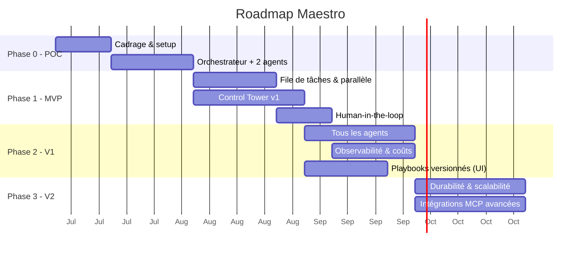

# Roadmap — Maestro

**Version :** 0.1
Approche progressive : **commencer simple**, prouver la valeur, puis robustifier. On n'ajoute de la complexité que lorsqu'elle apporte un bénéfice mesurable.

---

## Vue d'ensemble

> Les durées sont indicatives et à ajuster selon l'équipe. Le diagramme couvre le **plan
> initial** (Phases 0 à 3, toutes soldées) ; le projet a continué au-delà — Phases 4 à 6 plus
> bas, puis les **Phases 7 à 9** issues du cadrage #215 et planifiées par #218, et la **vague
> front « Control Tower v3 »** ouverte par la revue d'usage du 2026-08-05, menée **en parallèle**
> des Phases 8 et 9. Les chantiers nés de l'usage viennent ensuite, puis le jalon **« L'équipe sur
> mesure »**, né d'une idée le 2026-09-19 et placé devant la Phase 9. Le jalon **« Avant
> l'installeur »** vient ensuite (2026-09-21) : il réunit les réserves des deux jalons précédents et
> passe à son tour devant la Phase 9. Le jalon **« Le niveau visuel »** le suit (2026-09-21) : une
> direction visuelle choisie par une personne, et un écran étalon, toujours devant la Phase 9.
> Le jalon **« Les scénarios de référence »** s'insère entre les deux (2026-09-21) : le produit se
> juge sur ce qu'un utilisateur lui demande, joué avec le vrai modèle, pendant que le rail outillage
> est gelé jusqu'au 2026-10-12 ([docs/40](./40-decision-rythme-et-scenarios-de-reference.md)).
> Le 2026-09-23, les six tickets du flux d'un ticket (#1240 à #1245, #1239) sont exclus de ce gel.
> Le jalon **« Rien de figé »** vient juste derrière (2026-09-21) : Maestro comprend n'importe quel
> projet, propose, se laisse corriger et vérifie en exécutant. Le même jour, le mode démo quitte le
> dépôt ([docs/41](./41-decision-maestro-juge-il-ne-bride-pas.md)).
> Le jalon **« Le fil, un vrai interlocuteur »** naît d'un retour d'expérience (2026-09-23) et passe
> devant « Rien de figé ». L'orchestrateur y répond en direct, sait tout ce que Maestro sait et
> raconte la fin d'un run. La personne n'y tranche plus que ce qui exige son arbitrage, et l'équipe
> s'ajuste au plan pendant le run ([docs/42](./42-decision-equipe-ajustee-au-plan.md)).

---

## Phase 0 — POC (preuve de concept)

**But :** valider le cœur orchestrateur-workers avec le Claude Agent SDK, **derrière une frontière d'abstraction fournisseur**.

- Mettre en place le dépôt, l'environnement, l'accès au Claude Agent SDK.
- Poser la **couche d'abstraction fournisseur** (interface `ModelProvider` : `fournisseur + modèle + credentials`) comme frontière d'architecture — **un seul fournisseur câblé (Claude)** pour l'instant, mais l'interface est en place (O7 / ENF-11).
- Un **orchestrateur** qui décompose un objectif simple en 2-3 tâches.
  ⚠ *Renversé pour les actions le 2026-09-21* (#1153, [docs/40 §4](./40-decision-rythme-et-scenarios-de-reference.md)) :
  une action simple sur le projet (« vide le dossier ») est **une** tâche qui agit, et le plancher
  de 3 tâches (`MIN_TASKS`, ticket #6) ne s'y applique plus. Porté par #1149 : le playbook du
  planificateur (`maestro/orchestrator/playbook.md`) distingue désormais **construire** et
  **agir**, et `MIN_TASKS` n'est plus qu'une fourchette visée par la construction.
- **Deux agents** (ex. Développeur + BDD) qui exécutent une tâche chacun.
- Exécution **en ligne de commande** (pas encore d'UI), résultats dans des fichiers.

**Critère de sortie :** un objectif → des tâches → 2 agents produisent un résultat exploitable ; le fournisseur de modèle est accédé via l'interface d'abstraction (pas d'appel Claude en dur dans la logique d'agent).

---

## Phase 1 — MVP

**But :** parallélisme réel + interface de supervision minimale + garde-fous.

- **File de tâches** (Celery/BullMQ + Redis) et **workers** → plusieurs agents en parallèle.
- **Auto-assignation** (compétences + classifieur léger).
- **Gestion des dépendances** entre tâches.
- **Control Tower v1** : tableau de bord temps réel + Kanban + réassignation manuelle.
- **Human-in-the-loop** sur les actions sensibles.
- Suivi de **coût** basique par tâche.

**Critère de sortie :** les 6 critères d'acceptation du MVP du [cahier des charges §8](./00-cahier-des-charges.md) sont remplis.

---

## Phase 2 — V1 (produit utilisable au quotidien)

**But :** équipe d'agents complète, personnalisation, observabilité.

- **Les 6 agents** par défaut opérationnels (+ création d'agents personnalisés).
  ⚠ *Renversé le 2026-09-19* ([docs/37](./37-decision-equipe-sur-mesure.md)) : un projet naîtra
  **sans agent**, et son équipe sera dérivée de son analyse. Voir « L'équipe sur mesure » plus bas.
- **Premier fournisseur non-Anthropic branché** via la couche d'abstraction (valide l'agnosticisme de bout en bout — O7 : ≥ 1 fournisseur non-Anthropic en V1).
- **Éditeur de playbooks versionnés** dans l'UI, application à chaud.
- **Observabilité Langfuse** intégrée (traces, coûts, évaluation).
- **Contrôle de capacité** (instances par agent) depuis l'UI.
- **Chat** utilisateur ↔ agent.
- Tableau de bord **coûts & analytics**.

**Critère de sortie :** un projet réel mené de bout en bout avec supervision et coûts maîtrisés.

---

## Phase 3 — V2 (robustesse & échelle)

**But :** fiabilité production et écosystème.

- **Workflows durables** (migration vers Temporal) : reprise sur panne, tâches longues.
- **Scalabilité horizontale** : plusieurs instances par agent, montée en charge.
- **Intégrations MCP avancées** : Figma, Linear/Jira, Slack, cloud providers.
- **Auto-amélioration des playbooks** (l'agent propose des corrections à partir de ses échecs) — livré : analyse à la demande d'un run en échec → proposition en brouillon, appliquée ou rejetée depuis l'UI ([docs/22](./22-auto-amelioration-playbooks.md), #111).
- Renforcement **sécurité** (micro-VM, gestion fine des secrets et permissions).
- Éventuelle migration/ajout de **LangGraph** pour les flux d'état complexes — *tranché en fin de Phase 3 : **non**, l'Agent SDK + Temporal couvrent durabilité, reprise et rejouabilité sans le paradigme de graphe d'états ([docs/23 §5](./23-demo-v2.md)) ; option rouverte si de vrais flux à états cycliques apparaissent.*

---

## Phases 4 à 6 — au-delà du plan initial (état réel)

Le plan ci-dessus s'arrêtait à la V2 ; le projet a continué. Ces trois phases existent comme
**milestones de la forge** — GitHub depuis la migration #344, GitLab avant elle — et sont la
réalité du backlog :

| Phase | But | État |
|---|---|---|
| **Phase 4 — Control Tower UX** | Refonte de l'interface (navigation, thème, notifications, identité, visite guidée, assistant), lots MCP configurables | **soldée** (66/66) |
| **Phase 5 — Socle réel (backend)** | Sortie du mode simulation : lancement/suivi/annulation d'un run par l'API, journal requêtable, streaming, registre de configuration, référence de ticket externe | **soldée** (24/24) — cadrée par #182, contrats d'API figés dans [docs/05 §6](./05-interface-control-tower.md) |
| **Phase 6 — Control Tower v2 (front)** | Navigation regroupée (fiche agent à onglets), tableau de bord épuré, page Logs, badges d'attente, chat global et direct, paramètres en écriture | **soldée** (5/5) — voie **parallèle** à la Phase 5, rendue indépendante par les contrats d'API |

> ⚠ **Les deux « en cours » de ce tableau ont été relus le 2026-08-24** (#470) : les milestones
> étaient **fermés** côté forge et ce document ne l'avait pas repris. Deux réserves à garder en
> tête, parce que « milestone soldé » ne veut pas dire « chantier fini » : quelques **contrats
> d'API du §6 de docs/05 restent figés sans être servis** — `GET /api/journal` en était, il a
> été **servi par #478** ([docs/05 §6.2](./05-interface-control-tower.md)) —, et le **chat
> global** de la Phase 6 a été redécoupé dans la vague front (#268/#269).

---

## Phases 7 à 9 — cadrage #215, milestones créés par #218 *(7 et 8 livrées)*

Trois phases issues de [docs/24](./24-projets-locaux-et-poste-de-travail.md), qui traite
une question restée ouverte depuis le POC : **Maestro produit des livrables, il ne travaille pas
*dans* un projet**. L'espace de travail d'une tâche est un répertoire temporaire détruit en fin
d'exécution ; l'utilisateur reçoit une copie de fichiers à recopier lui-même.

> ✅ **Décidé le 2026-08-04.** Les sept décisions D1 à D7 ont été rendues, conformes aux
> recommandations du cadrage ([docs/24 §8](./24-projets-locaux-et-poste-de-travail.md)) : oui aux
> projets locaux (D1), écriture par worktree ou copie + diff sous validation humaine (D2 —
> **révisée le 2026-09-04** par #703 : fusion continue sous un accord par run si versionné,
> écriture en place sinon, [docs/24 §2.4](./24-projets-locaux-et-poste-de-travail.md)), le
> bureau est une **enveloppe** et non la finalité (D3), lanceur puis Tauri (D4 — **renversée le
> 2026-09-11** par #921 : la coque est **Electron** et Tauri est écarté, l'**ordre** restant
> lanceur → installeur → enveloppe, [docs/35 §2](./35-decision-poste-de-bureau-et-disposition.md)),
> brief validé avant décomposition (D5), ordre 7 → 8 → 9 (D6), Phases 5 et 6 **inchangées** (D7).

| Phase | But | Dépend de | Fenêtre | État |
|---|---|---|---|---|
| **7 — Projets & espace de travail réel** | Un projet a une **racine sur le disque** ; les agents y travaillent par branche/worktree ou copie, et l'application des modifications passe par la validation humaine. Le contrat d'isolation et le modèle de menace s'étendent au projet de l'utilisateur | Phase 5 (lancement de run par l'API — livré) | 2027-03-18 → 2027-04-28 | **livrée** (#219, 8 lots) |
| **8 — De l'intention au brief** | Un objectif se **compose** (prompt + documents téléversés + dossier de références), se **discute** (questions de clarification) et se **valide** (brief structuré) avant toute décomposition payante | Phase 7 | 2027-04-29 → 2027-06-09 | **livrée** (#314, 9 lots) |
| **9 — Poste de travail : distribution** | Le produit s'**installe** : mode local durci (jeton, SQLite), lanceur/installeur et parcours de premier lancement. L'**enveloppe de bureau** en est **sortie** le 2026-09-11 (#643 abandonné) : elle est livrée par « L'atelier » et devient **Electron** ([docs/35](./35-decision-poste-de-bureau-et-disposition.md)) | Phases 7 et 8 — ne pas empaqueter une cible mouvante | 2027-06-10 → 2027-07-21 | découpée (#637, 8 lots) ; critères de sortie posés le 2026-09-21 |

Les fenêtres reprennent la cadence des phases précédentes (~6 semaines) et s'enchaînent après
l'échéance de la Phase 6. Ce sont des repères de planification : une échéance de milestone se
déplace sans rien renier du cadrage. **Les faits l'ont montré dans le sens agréable** : les
Phases 7 et 8 ont été livrées en août 2026, très en avance sur des fenêtres calées sur 2027. Les
dates ci-dessus sont conservées telles quelles — les réécrire après coup ferait passer une
estimation pour une prévision réussie, et c'est l'écart qui est instructif.

**Ordre et parallélisation** : 7 → 8 → 9, respecté. Les Phases 8 et 9 pouvaient se recouvrir
partiellement une fois la 7 livrée (le patron « deux voies par couche » de #182) ; ça n'a pas été
nécessaire, la 8 étant allée plus vite que son cadrage ne le prévoyait.

**Une quatrième phase reste ouverte, sans milestone** : **10 — Continuité & multi-projet** *(à
confirmer)* — un projet vit dans la durée : historique et coûts par projet, mémoire long terme,
itération sur un livrable existant, tests réellement exécutés. Son contenu dépend de ce que la
Phase 7 aura appris de la vie réelle d'un projet ; elle se confirmera à ce moment-là. La **vague
front** décrite plus bas ne la décale pas et ne prend pas sa place : le numéro 10 lui reste
réservé.

> **Tickets : les Phases 7 et 8 sont découpées, la Phase 9 non.** C'est le patron de #182, qui avait
> créé les milestones des Phases 5 et 6 **et semé aussitôt leur premier lot de tickets** (#183,
> #184 avec #185–#188, #189 avec #190–#193), en ne différant que les chantiers suivants « au
> moment de les démarrer ». Phase 7 : parent de suivi **#219** et huit lots — #221 (socle : entité
> Projet et validation de la racine), puis #222, #223, #224, #225 et #226 **prenables en
> parallèle**, #227 (application des livrables sous validation) et #220 (tests + doc).
> **Phase 8 : découpée et livrée** — parent **#314** et neuf lots, #315 (modèle et résolution des
> sources), #316 (extraction et rapport de lecture), #317 (API : un lancement porte ses sources),
> #318 (brief structuré), #319 (composer un objectif), #320 (validation humaine du brief), #321
> (questions de clarification), #322 (valider le brief dans la Control Tower) et #323 (tests + doc).
> Le pari du découpage différé a tenu : la Phase 8 a été découpée **une fois la Phase 7 livrée**,
> et le brief a pu viser un projet qui existait.
> La **Phase 9 est restée un contenant vide à dessein** — on n'empaquette pas une cible mouvante —
> jusqu'à son découpage : parent **#637** et huit lots (#638–#645). **Vide ne voulait pas dire
> seule à venir** : le découpage différé portait sur *cette phase-là*, pas sur le backlog. Les
> autres milestones, décrits juste en dessous, étaient ouverts **et découpés** — la **vague front
> « Control Tower v3 »**, menée en parallèle des Phases 8 et 9 sans rien changer à leur cadrage.
>
> ⚠ **Un de ses lots a changé de main le 2026-09-11** : **#643 « Enveloppe Tauri » est abandonné**
> au profit du lot 2 de **#921** — la coque devient **Electron**, et elle est livrée dans
> « L'atelier » parce qu'elle n'a rien à attendre (elle affiche ce que la stack locale sert,
> **ENF-12**). Ce que la Phase 9 garde est l'**empaquetage** : #640, #641, #642, #644. Le
> renversement porte sur *quelle* coque, jamais sur *quand* — voir
> [docs/35 §2](./35-decision-poste-de-bureau-et-disposition.md).

**Les critères de sortie de la Phase 9 sont posés depuis le 2026-09-21** (#1113), dans la
description de son milestone, section `## Critères de sortie`, C1 à C9. C'est cette section qui fait
foi au bouclage (docs/10 §3.4), pas ce résumé. Ils ont été posés **avant le premier lot** : aucun lot
de #637 n'avait démarré. Ils ne sont pas rédigés : ils sont recopiés des textes de cadrage (EF-41,
ENF-12, D3, le corps de #637 et les critères des lots #638 à #645), et chacun cite sa source. La
description du milestone a été corrigée le même jour. Elle parlait encore d'une enveloppe Tauri et
d'une échéance au 2027-11-10.

**Sa place dans la file a changé le même jour.** Les réserves des verdicts précédents passent devant
elle, dans le jalon « Avant l'installeur » (section du même nom, plus bas).
Un effet de bord est assumé : dans un run autonome, **#638, #639 et #640** (jeton d'API, SQLite,
lanceur) passent eux aussi derrière les réserves. Aucun ordre ne peut placer les réserves entre #640
et #641, parce que les lots d'un parent restent contigus dans le plan. Ces trois lots ne sont pas de
l'empaquetage : ils **restent démarrables à la main** sans attendre, et #638 ferme un trou ouvert
aujourd'hui.

---

## Vague front « Control Tower v3 » — parallèle aux Phases 8 et 9

**Origine : la revue d'usage du 2026-08-05**, passée sur les écrans livrés par les Phases 4 et 6.
Elle ne rejuge pas ce qui a été construit ; elle relève ce qui manque une fois qu'on s'en sert
pour de bon — un rendu jugé « brouillon » qui revient écran après écran, un tableau de bord qui ne
répond pas à « où en est-on ? » d'un coup d'œil, une fiche agent où l'on ne peut ni créer un agent
guidé par ce qui existe réellement ni lire ce qu'il a fait, et aucune porte d'entrée
conversationnelle. Le **bilan de la Phase 7** y a ajouté un constat de même nature : le projet
n'est pas un écran de plus, c'est le **cadre** de tous les écrans.

**Ce n'est pas une renumérotation.** La vague est une **voie front**, menée en parallèle des
Phases 8 et 9 — exactement ce que la Phase 6 a été à la Phase 5, sur le patron « deux voies par
couche » de #182. Les Phases 8 et 9 gardent leur périmètre, leur ordre (décision D6 : 7 → 8 → 9)
et leurs fenêtres ; la Phase 10 pressentie garde son numéro. Une vague front ne prend pas de
numéro de phase : elle **recouvre** les phases qu'elle accompagne au lieu de s'y insérer.

| Milestone | Contenu | Fenêtre | Suivi |
|---|---|---|---|
| **Control Tower v3 — socle visuel & pilotage** | Un **langage visuel** commun (icônes, cartes, densité) dont tous les autres écrans héritent, puis l'écran de pilotage : détail d'une tâche, tuiles de tête, section Tâches, Journal, carte de Kanban. Et, en amont, le **projet actif comme cadre** de la Control Tower (choix à l'entrée, bascule dans le shell, écrans filtrés) | 2027-04-29 → 2027-05-26 | **#242** — 8 lots (#245–#252) et **#276** — 6 lots (#277–#282) |
| **Control Tower v3 — conversation & intégrations** | Chat global (le fil avec l'orchestration, puis l'écran), intégrations MCP sorties du fond des Paramètres avec une bibliothèque élargie, et un écran de validations qui se décide vite | 2027-05-27 → 2027-08-04 | **#244** — 6 lots (#268–#273) |
| **Control Tower v3 — agents** | La fiche agent complète : création plein écran guidée par un **catalogue** de fournisseurs, modèles et efforts servi par l'API, compétences cadrées, permissions éditables, playbook publié et versionné, chat en direct, onglet Logs | 2027-08-05 → 2027-09-29 | **#243** — 15 lots (#253–#267) |

Les fenêtres démarrent avec la Phase 8 et débordent de dix semaines la fin de la Phase 9 : comme
ailleurs dans ce document, ce sont des repères de planification, pas des engagements. Les trois
milestones s'enchaînent dans cet ordre parce qu'ils dépendent les uns des autres — le **langage
visuel** du premier lot (#245) est ce dont les deux autres héritent, et le **streaming** du chat
global (#268) est ce que l'onglet Chat de la fiche agent (#264) réutilise au lieu de le
réimplémenter.

> ⚠ **Les deux derniers milestones ont échangé leur place, et la dépendance a suivi** (#620,
> arbitrage du 2026-08-27). L'ordre initial donnait « agents » en deuxième (2027-05-27 →
> 2027-07-07) et faisait naître le streaming dans l'onglet Chat (#264), à charge pour le chat
> global de le réutiliser. La revue d'usage du 2026-08-24 (#470,
> [docs/29](./29-decision-run-objet-de-premier-plan.md)) a fait du chat la **seule porte
> d'entrée**, et les chantiers nés de l'usage ont pris cette fenêtre-là : « agents » est reportée
> au 2027-09-29, « conversation & intégrations » passe devant. Le chat global se retrouvait donc
> premier, héritier d'un socle qui venait après lui. Ce qui a été inversé est le **sens** de la
> dépendance, jamais sa nature : il y a toujours **une** implémentation du streaming, et une
> seule. C'est fait — #268 l'a construite **comme un canal** plutôt que comme une particularité du
> chat global (`ServiceChat.diffuser`, `GET /api/chat/{agent}/flux`), et #264 la réutilisera. Même
> inversion pour la **mise en page conversationnelle** : construite par #269 (l'écran du chat
> global), réutilisée par le lot 13 de « agents » (#265).

> ⚠ **La demande est revenue, plus large, et la recherche l'a instruite** (#471,
> [docs/30](./30-cible-visuelle-control-tower.md), mesures du 2026-08-25). Non plus « harmoniser ce
> qu'on a » mais « aller chercher un niveau » — et le renversement est que **le niveau ne se tient
> pas par une maquette, mais par un test** : Code Connect, la seule mécanique qui relierait un
> design system Figma au code, est **refusée sur ce compte** (plan `starter`), et le langage visuel
> de #245 est aujourd'hui **contourné plus souvent qu'il n'est utilisé** (18 recopies de carte, 26
> boutons refaits, 1 750 couleurs en dur pour 0 token). La recherche ne rejuge pas #245 : elle
> demande ce qui le **tient**. Chantier : **#532**, 7 lots (#533–#539), 7 sessions.

Deux points d'articulation avec le reste de la roadmap :

- **#276 précède les autres lots du socle** : chaque écran v3 doit *naître* filtré par le projet
  actif plutôt qu'être refiltré après coup. C'est le pas d'après de la Phase 7 — l'entité Projet
  et sa racine validée existent (#221–#225), il leur manquait de devenir le cadre de l'UI.
- **Le sélecteur de dossier natif (#278) n'anticipe pas la Phase 9** : l'enveloppe de bureau reste
  tranchée par D3/D4 et planifiée là-bas. Le backend tournant déjà sur le poste, il peut ouvrir
  lui-même le sélecteur de l'OS ; le mode serveur garde l'explorateur servi par l'API en repli.

> **Tickets : les trois milestones sont découpés**, contrairement aux Phases 8 et 9 — la revue
> d'usage porte sur des écrans qui **existent**, il n'y a donc rien à attendre pour les découper.
> Même patron que la Phase 7 : un **parent de suivi** par chantier (le premier milestone en porte
> deux), qui porte la checklist ordonnée et ne se ferme que toutes cases cochées, et des lots
> mergeables un à un sur `main`,
> les lots marqués **« (parallèle) »** étant prenables en même temps. La vague **rhabille et
> complète** : aucun de ces lots ne touche à la machine à états du moteur ni à la navigation posée
> par #117/#189, et l'essentiel du travail est front — seuls quelques lots de socle passent par
> l'API (#246, #253, #268, #277).

---

## Chantiers hors phases — ce que l'usage a ouvert (2026-08 → 2026-09)

Cinq milestones sont nés **après** la vague front, d'un usage réel plutôt que d'un cadrage : on
s'est servi du produit et de son outillage, et ce qui manquait s'est vu. Ils ne prennent **pas de
numéro de phase**, pour la raison déjà écrite pour la vague front — un chantier né de l'usage
**recouvre** les phases qu'il accompagne au lieu de s'y insérer, et le numéro 10 reste réservé à
« Continuité & multi-projet ».

| Milestone | Contenu | Échéance | Suivi |
|---|---|---|---|
| **Le run, objet de premier plan** | Un run se **liste**, s'**ouvre**, se **suit** et se **pilote** depuis la Control Tower : entrée de menu « Runs », vue par run portant son Kanban et sa progression, tableau de bord qui montre l'état des runs, **pause**, journal persisté, causes d'arrêt remontées — puis le suivi **en pipeline** (graphe des tâches, checklists, branches parallèles) | 2027-06-15 | **#472** — 8 lots (#473–#480), **complet** ; **#488** — 4 lots (#489–#492), **complet** |
| **Résilience des runs** | Un run ne se perd plus : il survit à l'arrêt de son API (**hôte détaché**, livré), se voit quand il meurt, se rattrape sur son brief — et, depuis la revue du 2026-08-24, **se solde quand on éteint Maestro exprès** | 2027-06-30 | **#441** — 6 lots (#442–#447), **#347** et #486 |
| **Collaboration inter-agents** | Ce que les agents se disent pendant un run, et une surface qu'ils écrivent ensemble | 2027-09-01 | #354, #355, #356 |
| **Outillage de la forge** | Le workflow lui-même : merge automatique en fin de ticket, découpage porté par les sub-issues natives | 2027-09-15 | **#413** et **#389** |
| **L'atelier — le travail au centre, la conversation à portée** | La Control Tower devient un **poste de travail de bureau** : une fenêtre **Electron**, un shell à **trois zones** (navigation à gauche, travail au centre, conversation à droite), le **pipeline du run** comme vue de travail — et les quatre constats du retex qui vivent dans ces surfaces | 2027-11-09 | **#921** — 11 lots (#922–#928, puis #938, #947, #949 et #929 « tests + doc ») |

**Le chantier « Le run, objet de premier plan » est le seul des quatre à être né d'une décision
écrite** : la revue d'usage du **2026-08-24** portait seize demandes, dont **trois renversaient une
décision documentée et livrée** — elles ont été tranchées en note avant d'être découpées
([docs/29](./29-decision-run-objet-de-premier-plan.md), #470). Les trois arbitrages : le **Kanban
quitte le tableau de bord** pour la vue d'un run — le run devient une portée d'écran **à côté** du
projet, qui reste le cadre (#277/#281 ne sont pas défaits) ; le **chat devient la seule porte
d'entrée**, où « composer » et « valider le brief » déménagent sans que la décision **D5** tombe ;
l'**arrêt volontaire solde les runs**, l'accident ne les touche pas.

Deux articulations avec le reste de la roadmap :

- **Le chantier du chat ne vit pas ici** : ses quatre lots (#481 — #482–#485) sont rattachés à
  **« Control Tower v3 — conversation & intégrations »**, qu'ils prolongent. Le chat global (#268,
  #269) y est déjà découpé et ne prévoit ni pièces jointes ni sources ; les y ajouter est le
  chantier, pas une seconde implémentation à côté.
- **La détection de ce que le poste a déjà installé** (#487) est rattachée à **« Control Tower v3 —
  agents »**, derrière #253 : le catalogue servi par l'API doit exister avant qu'une sonde ait un
  endroit où se rendre. Son prix avait été nommé et refusé pour un autre usage
  ([docs/28 §7](./28-decision-frontiere-execution-run.md)) ; le payer ici est un choix, rendu en
  [docs/29 §7](./29-decision-run-objet-de-premier-plan.md).
  ⚠ **L'ordre a été tenu autrement que prévu** (livré le 2026-08-29) : #487 est arrivé le premier,
  #253 n'ayant encore rien livré. Plutôt que d'ouvrir la seconde source que son critère 3 interdit,
  la sonde a **créé l'endroit où se rendre** — `GET /api/fournisseurs`
  ([`maestro/controltower/fournisseurs.py`](../maestro/controltower/fournisseurs.py)), dont la
  colonne « supporté » est lue du **registre du code** (`available_providers()`), exactement ce que
  demande le critère 2 de #253. Ce qui reste à #253 s'ajoute donc **en colonnes de cette
  charge-là** — les **modèles** d'un fournisseur et les **niveaux d'effort** d'un modèle, puis
  l'effort porté par la définition d'un agent — et surtout pas sur une route à lui : `modeles_ici`
  dit ce que la **sonde** a vu sur ce poste, jamais ce que Maestro supporte, et les deux colonnes ne
  se confondent nulle part.

⚠ **« L'atelier » passe DEVANT la Phase 9, et c'est une décision** (2026-09-11,
[docs/35](./35-decision-poste-de-bureau-et-disposition.md), #921). Son échéance — 2027-11-09, la
veille de celle de la Phase 9 — n'est pas un repère de plus : `lib.sh current-milestone` retient
**le jalon actif le plus ancien du rail qui porte encore un ticket ouvert**, si bien que la date
*est* l'ordre de traitement. Trois choses la justifient, et la troisième est la moins évidente :

- **D6 n'est pas violée.** L'ordre 7 → 8 → 9 porte sur les **phases** ; l'atelier n'en est pas une,
  il **recouvre** comme la vague front. Le numéro 10 reste réservé.
- **L'argument de la Phase 9 joue en sa faveur**, pas contre lui : « on n'empaquette pas une cible
  mouvante » (§4.8 de docs/24). La disposition bouge — donc elle bouge **avant** l'empaquetage, pas
  pendant. Ordonner l'inverse ferait empaqueter deux fois.
- **La coque, elle, est livrée dès le lot 2** — sans attendre le reste. Ce n'est pas une entorse à
  l'ordre de **D4** : c'est une coque **de développement**, qui sert la stack locale. Le lanceur
  (#640), l'installeur (#641), le premier lancement (#642) et les mises à jour (#644) restent en
  Phase 9, dans leur ordre.

> ⚠ **« La veille de celle de la Phase 9 » n'est plus vrai depuis le 2026-09-19.** La Phase 9 a
> reculé au **2028-02-16**, pour laisser passer devant elle « L'équipe sur mesure » (section
> suivante). L'argument qui a fait passer l'atelier devant la Phase 9 est le même, et
> l'ordre entre l'atelier et la Phase 9 ne change pas.

> **Tickets : les cinq milestones sont découpés**, comme la vague front et pour la même raison —
> ils portent sur un produit et un outillage qui **existent**, il n'y a rien à attendre pour les
> découper. Même patron : un **parent de suivi** par chantier, qui porte la checklist ordonnée et
> ne se ferme que toutes cases cochées, et des lots mergeables un à un sur `main`, les lots marqués
> **« (parallèle) »** étant prenables en même temps. Les échéances sont des repères de
> planification, comme partout ailleurs dans ce document.

---

## « L'équipe sur mesure » — un jalon né d'une idée (2026-09-19)

Ce jalon n'est né ni d'un cadrage de phase ni d'une revue d'usage : il vient d'une **idée exposée
en conversation**, instruite par [`/idee`](../.claude/commands/idee.md) (#1013) et consignée par
#1044. Comme les chantiers nés de l'usage, il ne prend **pas de numéro de phase**. Le numéro 10
reste réservé.

| Milestone | Contenu | Échéance | Suivi |
|---|---|---|---|
| **L'équipe sur mesure — chaque projet s'outille et recrute ses agents** | Voir le détail ci-dessous | 2028-01-05 | **#1022** ; **#1019** — 5 lots (#1023–#1027) ; **#1020** — 7 lots (#1029–#1035) ; **#1021** — 7 lots (#1037–#1043) |

Le contenu du jalon, en quatre points :
- **Un répertoire commun des projets**, rempli par défaut et modifiable, où naît un projet neuf. Un projet existant se choisit en parcourant soi-même.
- **L'outillage d'abord.** La première étape de tout projet est son **outillage universel** (AGENTS.md, Agent Skills, scripts) : recommandé par l'analyse d'un projet existant, choisi par l'utilisateur pour un projet neuf, généré dans son dossier et lu par nos agents.
- **Aucun agent figé.** L'équipe de chaque projet est **dérivée de son analyse** (rôles, instances, playbooks, skills, autorisations), puis validée par l'utilisateur.
- **Autonomie sous arbitrage.** Tout agent **demande** quand il le faut et **tranche seul** le reste, en le consignant.

**Deux décisions tombent, à la demande explicite de la personne**, et une note les écrit :
[docs/37](./37-decision-equipe-sur-mesure.md).
- Les agents cessent d'être une ressource du poste. Cela renverse [docs/05 §2.0](./05-interface-control-tower.md) et le « 6 agents par défaut » de la Phase 2.
- « Personne ne répond en cours de tâche » tombe : le socle des playbooks, [docs/04 §1.2](./04-specifications-agents.md).

Trois choses **ne bougent pas** :
- [docs/32](./32-decision-cran-orchestrateur.md) : aucune IA ne juge l'appel d'outil d'une autre ;
- EF-08 : sans réponse, un acte sensible est refusé ;
- [docs/34 §4.6](./34-decision-agent-cli-tiers-acp.md) : la configuration ambiante reste fermée.

**Ordre des chantiers.** Le répertoire des projets est indépendant. La **question** vient d'abord, parce que l'outillage d'un projet neuf et l'équipe proposée **se demandent** à l'utilisateur. L'**outillage** vient ensuite, puis l'**équipe**, qui branche les skills que l'outillage a générés. Les trois parents sont en `prio::haute`, créés dans cet ordre, et `queue.sh` les tient donc dans cet ordre.

**Place dans la file**, sur le rail produit, où l'échéance *est* le rang :

| Jalon | Échéance |
| --- | --- |
| « L'atelier » | 2027-11-09 |
| **« L'équipe sur mesure »** | **2028-01-05** |
| « Avant l'installeur » *(ajouté le 2026-09-21, section suivante)* | 2028-01-26 |
| Phase 9 | 2028-02-16 (était 2027-11-10) |

- Le jalon vient **après « L'atelier »**, qui est en cours et qu'on ne double pas.
- Il passe **devant la Phase 9**, pour l'argument de la Phase 9 elle-même : on n'empaquette pas une cible mouvante (§4.8 de docs/24). La création d'un projet et le modèle d'agents changent ici : ils changent **avant** l'installeur, pas pendant.
- #938, le sélecteur natif et le glisser-déposer d'un dossier, passe en `prio::haute` : il rend direct le parcours d'un projet existant.
- #642, le premier lancement, est l'endroit où proposer le répertoire des projets.

> ⚠ **Les critères de sortie du jalon sont dans sa description**, section `## Critères de sortie`
> (C1 à C5, dans les mots de la demande). C'est elle qui fait foi au bouclage (docs/10 §3.4), pas ce
> résumé.

---

## « Avant l'installeur » — les réserves levées avant l'empaquetage (2026-09-21)

Ce jalon est né d'une demande du 2026-09-21, instruite par [`/idee`](../.claude/commands/idee.md)
et consignée par #1113 : *« les réserves doivent passer devant l'installeur »*. Comme « L'équipe sur
mesure », il ne prend **pas de numéro de phase**.

| Milestone | Contenu | Échéance | Suivi |
|---|---|---|---|
| **Avant l'installeur — les réserves levées** | Les réserves des verdicts de « L'atelier » et de « L'équipe sur mesure », et trois constats du retex du 2026-09-11 | 2028-01-26 | 14 tickets indépendants, sans parent de suivi |

**Son contenu : ce qui était rangé en Phase 9 derrière l'installeur.** Les deux verdicts du
2026-09-21 ont rangé leurs réserves au milestone courant du rail produit, comme le veut
`/milestone-verdict`. Leurs jalons étant soldés, ce milestone courant était la Phase 9. Le plan de
`queue.sh` y plaçait l'installeur #641 au **rang 4**, et ces 14 tickets aux **rangs 8 à 21**.
- **Verdict de « L'atelier »** : R1 → #1106 (la colonne ne porte pas les gestes du fil), R2 → #1107,
  R3 → #1108, R4 → #1109 ; ses relevés hors critères → #1110, #1111, #1112.
- **Verdict de « L'équipe sur mesure »** : R3 → #1101, R4 → #1102, R7 → #1104 ; son relevé hors
  critères → #1105.
- **Retex du 2026-09-11** : G6 → #939 (le produit parle le dépôt), G7 → #940 (la visite guidée),
  G9 → #942 (les amorces du chat).

**Pourquoi un jalon, et pas des priorités.** Dans un jalon, `queue.sh` trie par blocs. Les lots d'un
même parent restent **contigus** et prennent la **meilleure priorité** de leurs lots. À priorité
égale, le plus petit iid passe. Le bloc #637 est donc `haute` et part de #638 : il passe devant
toute réserve. Même avec tous ses lots en `basse`, il resterait devant les quatre réserves `basse`,
puisque `638 < 1105`. Il aurait fallu, en plus, remonter ces quatre-là. `prio::` n'aurait alors plus
rien dit : une élision manquante en `moyenne`, un trou de sécurité en `basse`. Entre jalons,
l'échéance **est** l'ordre, et c'est le seul levier honnête. Les réserves portent aussi leurs propres
critères, ceux des deux verdicts. Ce ne sont pas ceux de la Phase 9, qui sont d'installer, de lancer
et de mettre à jour.

**Place dans la file**, sur le rail produit :

| Jalon | Échéance |
| --- | --- |
| « L'atelier » (soldé, verdict rendu) | 2027-11-09 |
| « L'équipe sur mesure » (soldé, verdict rendu) | 2028-01-05 |
| **« Avant l'installeur »** | **2028-01-26** |
| Phase 9 | 2028-02-16 (inchangée) |

- Il passe **devant la Phase 9**, pour l'argument de la Phase 9 elle-même : on n'empaquette pas une
  cible mouvante (§4.8 de docs/24). C'est la troisième fois que cet argument range un jalon devant
  elle, après « L'atelier » et « L'équipe sur mesure ». Le bilan de « L'atelier » l'avait nommé : un
  premier lancement (#642) montrerait la colonne repliée (R2), et une proposition de run qu'on ne
  tranche pas depuis la colonne (R1).
- Son échéance tombe **strictement entre** ses voisins : **aucune autre échéance n'a bougé**.
- Les deux jalons plus anciens n'ont plus de ticket ouvert. Il devient donc le **milestone courant**
  du rail produit. C'est lui que `/orchestrate` propose et que `/ticket-create` prend par défaut.
- **Aucune priorité n'a changé.** Dans le jalon, le plan suit l'ordre des verdicts : #1102 et
  #1106 (`haute`, R1 de l'atelier étant « la plus lourde »), puis huit tickets `moyenne`, puis
  quatre `basse`.
- Un effet de bord est assumé : #638, #639 et #640 passent eux aussi derrière les réserves dans un
  run, et restent démarrables à la main (section Phase 9, plus haut).

**Ce qui ne bouge pas.** Aucune décision n'est renversée. Les verdicts consignés de « L'atelier » et
de « L'équipe sur mesure » disent leurs réserves « suivies en Phase 9 ». On ne réécrit pas un
verdict rendu : elles sont maintenant suivies dans ce jalon, qui passe devant la Phase 9.

> ⚠ **Les critères de sortie du jalon sont dans sa description**, section `## Critères de sortie`
> (C1 à C4). C'est elle qui fait foi au bouclage (docs/10 §3.4), pas ce résumé.

> ⚠ **Un jalon s'est inséré derrière celui-ci le 2026-09-21** (#1134) : « Le niveau visuel »
> (2028-02-05), section suivante. Ce qui est écrit ici ne change pas : ce jalon reste devant, et son
> échéance n'a pas bougé.

---

## « Le niveau visuel » — une direction choisie, un écran étalon (2026-09-21)

Ce jalon est né d'une demande du 2026-09-21, instruite par [`/idee`](../.claude/commands/idee.md)
(#1013) et consignée par #1134 : *un processus de conception qui produise un design « vraiment
satisfaisant »*, et non plus un design mesuré contre VS Code, GitHub et GitLab. Comme les jalons
nés d'une idée, il ne prend **pas de numéro de phase**.

| Milestone | Contenu | Échéance | Suivi |
|---|---|---|---|
| **Le niveau visuel — une direction choisie, un écran étalon** | Trois directions poussées rendues sur le tableau de bord, choisies par une personne, figées dans le socle et dans un écran étalon | 2028-02-05 | **#1124** — 4 lots (#1125–#1128), plus des lots de propagation créés après le choix |
| *Outillage de la forge* (jalon existant, rail outillage) | Une bibliothèque de références, la veille et le regard neuf qui partent de l'étalon, le regard de la personne par jalon | 2027-09-15 | **#1129** — 4 lots (#1130–#1133) |

**Le constat, mesuré.** Sur les 21 veilles consignées des tickets #925 à #1107, les références sont
GitHub (~120 mentions), VS Code (46), Vercel (42), Grafana (37) et GitLab (21), contre Linear (5)
et Cursor (5). Ce sont souvent des pages de doc lues, pas des interfaces vues. Trois causes :
- on cite ce qui est **public sans connexion** ;
- la veille était conçue pour **ne pas chercher de niveau** (docs/30 §6.1) ;
- **personne ne porte le goût** depuis que les runs tranchent seuls (#1009).

**Le contenu, en deux chantiers.** La **structure** d'un écran garde sa veille par ticket. La
**qualité visuelle** se choisit **une fois, par une personne** :
- **#1124 (produit)** : trois directions poussées, dont une audacieuse, sur le tableau de bord dans
  son shell ; la personne choisit (#1125) ; la direction entre dans le socle (#1126) ; le tableau de
  bord devient l'**écran étalon** (#1127) ; tests + doc (#1128) ;
- **#1129 (outillage)** : une bibliothèque de références versionnée, choisie par une personne,
  y compris derrière une connexion (#1130) ; la veille et le regard neuf partent de l'étalon et de
  la bibliothèque, le dehors en dernier (#1131) ; le regard de la personne par jalon, dont les
  verdicts deviennent des précédents (#1132) ; tests + doc (#1133).

**Une décision tombe, à la demande de la personne**, et une note l'écrit :
[docs/39](./39-decision-niveau-visuel-choisi.md). C'est [docs/30 §6.1](./30-cible-visuelle-control-tower.md),
« pas de nouvelle identité » (et le verdict du banc, §1.6). Les **valeurs** du socle se rouvrent une
fois.

Ne bougent pas :
- les **mécanismes** du socle (tokens sémantiques, primitives, trois places, forme + couleur, AA) ;
- « aucune identité nouvelle » à l'échelle d'un ticket, qui désigne désormais la direction retenue ;
- #1009, nuancé mais pas renversé : un run tranche toujours seul, mais contre l'étalon.

**Hors des runs, et c'est voulu.** #1125 attend une personne. #1131 et #1132 écrivent sous
`.claude/`. Les trois naissent **assignés** (#621) et se démarrent à la main. #1125 n'attend pas son
tour dans la file : il peut commencer maintenant.

**Place dans la file**, sur le rail produit :

| Jalon | Échéance |
| --- | --- |
| « L'équipe sur mesure » (soldé, verdict rendu) | 2028-01-05 |
| « Avant l'installeur » | 2028-01-26 |
| **« Le niveau visuel »** | **2028-02-05** |
| Phase 9 | 2028-02-16 (inchangée) |

- **Derrière « Avant l'installeur ».** Ses réserves sont indépendantes de la direction. Placé
  devant, ce jalon deviendrait courant alors que son premier lot attend une personne, et un run n'y
  trouverait rien à prendre.
- **Devant la Phase 9**, pour l'argument de la Phase 9 elle-même : on n'empaquette pas une cible
  mouvante (§4.8 de docs/24). Le premier lancement (#642) et l'installeur (#641) montreraient un
  niveau visuel sur le point de changer. C'est la quatrième fois que cet argument range un jalon
  devant elle.
- Son échéance tombe **strictement entre** ses voisins : **aucune autre échéance n'a bougé**, et
  **aucune priorité** existante non plus.

> ⚠ **Les critères de sortie du jalon sont dans sa description**, section `## Critères de sortie`
> (C1 à C5). C'est elle qui fait foi au bouclage (docs/10 §3.4), pas ce résumé.

> ⚠ **Un jalon s'est inséré devant celui-ci le 2026-09-21** (#1153) : « Les scénarios de référence »
> (2028-01-30), section suivante. La décision de ce jalon (docs/39) tient et son échéance n'a pas
> bougé ; il passe simplement derrière. #1125 reste démarrable à la main. Le chantier outillage
> #1129 est **différé** par le gel du rail outillage (`prio::basse`), et se rejuge à sa levée.

> ⚠ **Un second jalon s'est inséré devant celui-ci le 2026-09-21** (#1169) : « Rien de figé »
> (2028-02-02), plus bas. La fonction passe avant le poli, et l'on n'habille pas une capacité qui va
> changer. L'échéance de ce jalon n'a pas bougé.

---

## « Les scénarios de référence » — le produit fait ce qu'on lui demande (2026-09-21)

Ce jalon est né d'une demande du 2026-09-21, instruite par [`/idee`](../.claude/commands/idee.md)
(#1013) et consignée par #1153 : *« on n'avance pas du tout, on fait du sur-place »*. Il a été
confirmé par un « go » sur quatre recommandations, avec pour objectif *un résultat de qualité et un
rythme accéléré*. Comme les jalons nés d'une idée, il ne prend **pas de numéro de phase**.

| Milestone | Contenu | Échéance | Suivi |
|---|---|---|---|
| **Les scénarios de référence — le produit fait ce qu'on lui demande** | Quatre scénarios joués de bout en bout avec le vrai modèle, qui conditionnent le bouclage d'un jalon produit ; une action simple qui s'exécute | 2028-01-30 | #1148 et #1149, indépendants et **sans parent** ; #1146 dans « Avant l'installeur » |
| *Outillage de la forge* (jalon existant, rail outillage) | Trois allègements du processus, première exception au gel | 2027-09-15 | #1150, #1151, #1152 (nés assignés : ils écrivent sous `.claude/`) |
| *Outillage de la forge* (ajout du 2026-09-23, #1239) | Le flux d'un ticket exerce ce qu'il livre et cesse de payer ce qui ne trouve rien, **exclu du gel** | 2027-09-15 | #1240 → #1241 → #1242 → #1243 → #1244 → #1245, `prio::haute`, nés assignés |
| *Les scénarios de référence* (ajout du 2026-09-21, #1169) | Le mode démo quitte le dépôt ; le produit se vérifie sur le réel | 2028-01-30 | **#1156** — 5 lots (#1164–#1168) |

**Le constat, mesuré.** Sur les 158 tickets fermés en septembre :
- 23 % touchaient l'outillage de la forge ;
- 22 % étaient des finitions d'interface ;
- 7 % des « veilles à jouer » ;
- 10 % des lots « tests + doc », roadmaps et cadrages ;
- 37 % des capacités ou des bugs du produit.

Le produit n'a été essayé en vrai qu'une fois en six semaines (retex du 2026-09-11). Dix jours plus
tard, le même geste échoue sur un projet antérieur à #1042 (#1146), sans qu'aucun bilan l'ait vu.
La démonstration est dans [docs/40](./40-decision-rythme-et-scenarios-de-reference.md).

**Le contenu :**
- **#1148 (produit)** : un banc (`python -m maestro.scenarios`) joue quatre scénarios par la porte
  d'entrée réelle, le fil de l'orchestrateur, et rend un verdict par scénario (coût, durée, run).
  S1 vider un dossier, S2 créer une petite application, S3 reprendre un projet existant sans équipe,
  S4 « pourquoi le run a échoué ? ». Il n'est pas en CI : il coûte du vrai modèle.
- **#1149 (produit)** : une action simple sur le projet s'exécute comme **une** tâche. Plus
  d'utilitaire écrit pour « vider le dossier », plus de plancher de 3 tâches, plus de tâche humaine
  quand l'accord nomme déjà l'acte. C'est la pièce de S1.
- **#1146** (« Avant l'installeur », premier de la file) : un projet sans équipe ne paie plus pour
  échouer. Le fil lui propose son équipe au lieu d'un run, on la valide d'un geste, puis le run
  demandé aboutit. C'est la pièce de S3. Dire pourquoi un run a échoué est une autre capacité :
  #1157, la pièce de S4.
- **#1150 (outillage)** : un ticket porte une capacité visible **et ses tests**. Il n'y a plus de lot
  final « tests + doc » par défaut.
- **#1151 (outillage)** : la veille, les variantes et le regard neuf sont réservés aux tickets qui
  **décident** d'un écran. Les autres gardent leur relecture visuelle, jugée par la session.
- **#1152 (outillage)** : `/milestone-bilan` joue les scénarios, et un rouge interdit un GO. À
  démarrer après #1148.

**Le gel du rail outillage, jusqu'au 2026-10-12.**
- **Ce qui passe** : #1150, #1151, #1152, et les pannes qui bloquent réellement le travail. Un
  incident de forge qui ne bloque pas se note, il ne devient pas un chantier.
- **Ce qui passe aussi, depuis le 2026-09-23** (#1239, décision de la personne) : les six tickets
  du flux d'un ticket, #1240 à #1245, en `prio::haute`. Chaque critère se clôt sur une preuve
  exercée ; l'implémentation a une méthode ; le filet local et la relecture visuelle cessent de
  payer ce qui ne trouve rien ; le temps loggé est mesuré ; les commandes de clôture maigrissent.
  Les mesures et l'ordre sont dans [docs/40 §6](./40-decision-rythme-et-scenarios-de-reference.md).
- **Ce qui est différé, pas abandonné** : #1052 (le plan d'un run traverse les jalons, 6 tickets) et
  #1129 (bibliothèque de références, regard de la personne par jalon, 5 tickets). Tous deux passent
  en `prio::basse`.
- **Ce qui est abandonné**, sur décision de la personne : deux veilles satellites dont les tickets
  sources étaient fermés, #1141 et #1117.

**Des décisions tombent, à la demande de la personne**, et
[docs/40](./40-decision-rythme-et-scenarios-de-reference.md) les écrit :
- le lot final « tests + doc » (docs/10 §5.1) ;
- la veille, le ticket satellite et le regard neuf sur toute surface visible (docs/30 §5.2 à §5.4,
  §5.8) ;
- le plancher de 3 tâches (ticket #6).

Ne bougent pas :
- #1009, pour les tickets qui décident d'un écran ;
- le merge vérifié ;
- les sub-issues.

**Place dans la file**, sur le rail produit :

| Jalon | Échéance |
| --- | --- |
| « L'équipe sur mesure » (soldé, verdict rendu) | 2028-01-05 |
| « Avant l'installeur » (reste #1146) | 2028-01-26 |
| **« Les scénarios de référence »** | **2028-01-30** |
| « Le niveau visuel » | 2028-02-05 (inchangée) |
| Phase 9 | 2028-02-16 (inchangée) |

- **Derrière « Avant l'installeur »**, parce qu'il n'y reste que #1146, qui est justement la pièce
  du scénario S3. Il passe donc en premier.
- **Devant « Le niveau visuel »** : la fonction avant le poli. On ne fige pas l'écran étalon d'un
  produit dont les parcours de base ne tiennent pas. #1125, le choix d'une direction par la personne,
  reste démarrable à la main.
- **Devant la Phase 9**, pour l'argument de la Phase 9 elle-même : on n'empaquette pas une cible
  mouvante (§4.8 de docs/24).
- Son échéance tombe **strictement entre** ses voisins : **aucune autre échéance n'a bougé**.

Sur le rail outillage, « Outillage de la forge » reste le jalon courant. #1150, #1151 et #1152 y
sont en `haute`, et les deux chantiers différés en `basse` : les allègements passent devant tout.

**Le mode démo quitte le dépôt** (ajout du 2026-09-21, #1169). *« À partir de maintenant, supprime
le mode démo. Tous les tests seront faits sur la version réelle de Maestro. »* Le jalon gagne un
critère **C5** et le chantier **#1156**, qui s'appuie sur le banc #1148. On remplace d'abord, on
supprime ensuite :
- **#1164** : une stack réelle par copie de travail, isolée, et l'état d'un vrai passage du banc qui
  se rouvre par l'API réelle ;
- **#1165, #1166, #1167** (parallèles, nés assignés, ils écrivent sous `.claude/`) : la relecture
  visuelle, les captures et films de présentation, les skills et textes de vérification passent à
  la vraie stack ;
- **#1168** : `demo.py`, `fixtures.py`, `start.sh --demo`, `maestro-controltower-demo` et
  `maestro-demo` quittent le produit.

La personne a arbitré deux points : les tests unitaires **gardent leurs doubles**, et l'écran peuplé
vient de **l'état du dernier vrai passage du banc**, rejoué à la demande. La démonstration est dans
[docs/41](./41-decision-maestro-juge-il-ne-bride-pas.md).

> ⚠ **Les critères de sortie du jalon sont dans sa description**, section `## Critères de sortie`
> (C1 à C5). C'est elle qui fait foi au bouclage (docs/10 §3.4), pas ce résumé.

---

## « Rien de figé » — Maestro comprend le projet, propose, vérifie (2026-09-21)

Ce jalon est né d'une demande du 2026-09-21, instruite par [`/idee`](../.claude/commands/idee.md)
(#1013) et consignée par #1169. La personne venait de créer un projet qu'aucune des quatre natures
du questionnaire d'outillage ne décrivait (#1147) :

> *« Maestro n'est pas un outil qui impose et bride. Rien ne doit être figé, supposé, fixe,
> statique… L'outil doit être intelligent. Ce projet sera vendu, c'est un projet professionnel. »*

Comme les jalons nés d'une idée, il ne prend **pas de numéro de phase**.

| Milestone | Contenu | Échéance | Suivi |
|---|---|---|---|
| **Rien de figé — Maestro comprend le projet, propose, vérifie** | Un projet de n'importe quelle sorte se crée ou s'importe sans entrer dans une case : le modèle le comprend, propose son outillage et son équipe, se laisse corriger en langage naturel, et vérifie en l'exécutant ce qu'il écrit. Depuis le 2026-09-24, il **naît dans la conversation** | 2028-02-02 | **#1155** — 7 lots (#1158, #1147, #1159, #1294, #1160, #1161, #1162) ; **#1163**, sans parent ; retour `p3` : **#1290**, **#1291**, **#1292**, **#1293**, **#1295**, sans parent |

**Le constat.** Les premières minutes d'un projet, son outillage puis son équipe, passaient par des
fonctions pures appliquées à des tables fermées. Le modèle en était écarté à dessein, alors qu'il
tient déjà le fil de conversation où ces questions se posent :
- un questionnaire à options figées, sans réponse libre ;
- des commandes par langage écrites sans jamais être exécutées ;
- une détection par extensions ;
- cinq gabarits de rôle retenus par des règles fixes.

L'inventaire est dans [docs/41 §2](./41-decision-maestro-juge-il-ne-bride-pas.md).

**Le contenu :**
- **#1158** (parallèle) : un projet existant se comprend en le lisant. Les tables de détection
  deviennent des indices, jamais un plafond.
- **#1147** (parallèle, périmètre redéfini) : un projet neuf se décrit avec les mots de la personne.
  Les questions ne portent que sur un vrai manque, les options sont générées pour ce projet, une
  réponse libre reste toujours possible.
- **#1159** (parallèle) : l'équipe se propose pour le besoin réel, quel que soit le rôle, et se
  corrige en langage naturel.
- **#1160** : ce que Maestro écrit dans un projet est **vérifié en l'exécutant**. C'est la pièce qui
  concilie « ce qui n'est pas vérifié n'est pas cité » avec l'intelligence demandée.
- **#1161** : l'outillage proposé se corrige en langage naturel, sur les deux chemins.
- **#1162** : le banc des scénarios de référence joue un projet qu'aucune liste ne prévoyait, en
  création et en import. C'est la pièce du bouclage (C4).
- **#1163** : les sources d'un brief se lisent quel qu'en soit le format.

**Une décision tombe, à la demande de la personne**, et
[docs/41](./41-decision-maestro-juge-il-ne-bride-pas.md) l'écrit : *Maestro juge, il ne bride pas*.
Elle renverse le questionnaire borné et sans modèle (docs/38, #1031), les tables de détection
(#1030) et l'équipe dérivée par des règles (docs/37, #1039).

Ne bougent pas :
- les garde-fous (secrets, frontière d'écriture, diff à valider, arbitrage des actes) ;
- l'analyse qui n'exécute rien ;
- le `recommander` commun aux deux chemins.

**Place dans la file**, sur le rail produit :

| Jalon | Échéance |
| --- | --- |
| « Avant l'installeur » (reste #1146) | 2028-01-26 |
| « Les scénarios de référence » | 2028-01-30 |
| **« Rien de figé »** | **2028-02-02** |
| « Le niveau visuel » | 2028-02-05 (inchangée) |
| Phase 9 | 2028-02-16 (inchangée) |

- **Derrière « Les scénarios de référence »** : le banc est l'instrument de mesure de ce jalon (#1162
  en est un scénario), et le retrait de la démo s'appuie sur lui.
- **Devant « Le niveau visuel »** : la plainte porte sur les fonctionnalités, et l'on n'habille pas
  une capacité qui va changer.
- **Devant la Phase 9**, pour l'argument de la Phase 9 elle-même : on n'empaquette pas une cible
  mouvante (§4.8 de docs/24).
- Son échéance tombe **strictement entre** ses voisins : **aucune autre échéance n'a bougé**. #1147
  est passé de `moyenne` à `haute` en rejoignant ce jalon.

### Le retour d'expérience `p3` (2026-09-24)

Le 2026-09-24, la personne crée le projet `p3` et y lance plusieurs runs : refaire la maquette et le
site vitrine d'un kombucha. Elle rend dix constats, tous notés KO, avec captures. L'instruction
[`/idee`](../.claude/commands/idee.md) (#1013) les a consignés par #1300. Chaque cause a été établie
dans le code et **vérifiée sur l'état réel** des runs, lu par l'API.

> *« Moi, j'aurais préféré que le démarrage d'un projet commence dans le chat, en interactif : le chat
> me pose des questions, me propose des choix, et au fur et à mesure on peut générer l'outillage.
> Donc une conversation intelligente, pas des choix proposés au début. »*

**Ce qui entre dans ce jalon :**
- **Trois bugs**, rangés ici pour être pris en premier, comme #1277 à #1280. Ils font paraître chaque
  run cassé :
  - **#1290** : un run fini restait « En cours » dans sa vue, et le fil montrait la carte du run
    d'avant. L'événement de fin de run partait **sans projet**, et la diffusion par projet l'écartait ;
  - **#1291** : les checklists restaient à « 0/N · relevé incomplet ». Le CLI embarqué par le SDK
    ne monte plus `TodoWrite` par défaut, il le remplace par `TaskCreate`/`TaskUpdate`, et les agents
    n'avaient plus d'outil pour cocher ;
  - **#1292** : le jeton d'API s'écrivait en clair dans le journal d'accès.
- **Le démarrage et la création** :
  - **#1293** : chaque démarrage arrive sur le choix du projet, « Reprendre » en tête, conversation
    ouverte. L'« ancienne Control Tower » était l'effet de réglages retenus par le profil de la coque
    (projet retenu, colonne fermée), pas un vieux build ;
  - **#1294**, nouveau lot 4/7 de #1155 : un projet **naît dans la conversation**. L'orchestrateur
    comprend ce qu'on veut faire, propose nom, dossier et versionnement, et le déclare sur accord ;
  - **#1161**, recadré, lot 6/7 : l'outillage **se construit dans la conversation**, pièce par
    pièce, chaque pièce sur accord, et se corrige en langage naturel ;
  - **#1295** : un projet n'a qu'un `AGENTS.md`. Un pont ne s'écrit que pour un client utilisé qui ne
    le lit pas nativement (Claude Code le lit depuis sa v2.1.277).
- Le jalon gagne un critère **C5** : *un projet naît dans la conversation, et son outillage s'y écrit
  au fur et à mesure, chaque pièce sur accord.*

**Ce qui va au jalon « Le run tient parole »** (2028-02-03), qui tient la parole du run sur ce qu'il
montre et sur sa façon d'exécuter :
- **#1297** : les flèches du pipeline se lisent. Une légende dit qu'une flèche est une
  **dépendance** et ce que dit sa couleur, une dépendance redondante s'estompe, et aucune flèche ne
  passe sous une carte ;
- **#1298** : le run dit pourquoi ses tâches passent une à une (projet non versionné, un seul agent,
  chaîne de dépendances), et propose de versionner le projet ;
- **#1299** : les tâches indépendantes tournent de front. Le plan les dégage, et un agent en prend
  plusieurs sur un projet versionné.

**L'ordre dans #1155** : #1147 (en cours) → #1294 → #1160 → #1161 → #1162.
- #1294 passe **devant #1160**, parce que c'est ce que la personne a demandé, et que #1160 n'en
  dépend pas.
- #1294 réutilise le moteur de questions de #1147. #1161 réutilise la vérification par l'exécution
  de #1160.
- #1293, #1295 et les trois bugs sont indépendants les uns des autres.

**Des décisions tombent, à la demande de la personne**, et
[docs/43](./43-decision-un-projet-nait-dans-la-conversation.md) les écrit :
- le projet actif n'est plus relu au démarrage ([docs/05 §2.0.1](./05-interface-control-tower.md)) ;
- l'outillage n'est plus une étape de formulaire ([docs/37 §4 point 6](./37-decision-equipe-sur-mesure.md),
  [docs/38 §8](./38-decision-outillage-universel-du-projet.md)) ;
- les deux ponts ne s'écrivent plus d'office ([docs/38 §3.2](./38-decision-outillage-universel-du-projet.md)).

Ne bougent pas :
- le garde-fou « une tâche à la fois » d'un projet non versionné (#839) ;
- rien ne s'écrit sans accord ;
- la frontière d'écriture ;
- le `recommander` commun aux deux chemins.

**Le gel du rail outillage est maintenu jusqu'au 2026-10-12.** La personne demandait de le lever si
c'était recommandé, et ce ne l'est pas :
- les dix constats sont du produit, et aucun ticket d'outillage ouvert n'y répond (#1052 et #1129
  différés, #1060, #1008, #1218, #985) ;
- la voie d'exception reste ouverte : une panne qui bloque le travail passe, comme #1239 ;
- le gel ne vise que l'outillage **de la forge**. L'outillage que Maestro écrit dans un projet est du
  produit, et n'a jamais été gelé.

Un incident d'outillage relevé en chemin **est noté**, pas ticketé : le skill `control-tower` dit
encore que le verrou de la coque vaut « pour le poste », alors que #1275 le borne à la copie. Il ne
bloque rien.

**Place dans la file** : inchangée. Les tickets rejoignent des jalons existants, et **aucune échéance
n'a bougé**.

> ⚠ **Les critères de sortie du jalon sont dans sa description**, section `## Critères de sortie`
> (C1 à C5). C'est elle qui fait foi au bouclage (docs/10 §3.4), pas ce résumé.

---

## « Indépendant du modèle » (2026-09-24)

> Cette section précède « Le fil, un vrai interlocuteur » dans le fichier, par commodité de relecture.
> Son rang dans la file est celui de son échéance, dit plus bas.

Ce jalon est né le 2026-09-24. La checklist de chaque tâche restait à 0/N parce que Maestro la
lisait dans un outil interne du CLI Claude, que celui-ci avait remplacé (#1291). La personne :

> *« Il faut que tu t'en souviennes stp. Maestro est indépendant du modèle et des outils externes.
> Analyse si on a d'autres dépendances. »*

La règle est inscrite dans [CLAUDE.md](../CLAUDE.md) et écrite par
[docs/44](./44-decision-maestro-possede-ses-contrats.md) (#1315). Comme les jalons nés d'une idée,
celui-ci ne prend **pas de numéro de phase**.

| Milestone | Contenu | Échéance | Suivi |
|---|---|---|---|
| **Indépendant du modèle — un agent travaille avec n'importe quel fournisseur, Maestro possède ses contrats** | Un agent sur un fournisseur autre que Claude travaille dans son projet, sous les mêmes garde-fous. Ce que Maestro observe ou impose à ses agents passe par ses propres contrats, et une montée de version du CLI Claude ne casse rien en silence. Le fournisseur choisi pour un agent est honoré, ou le run dit pourquoi | 2028-02-04 | **#1307**, 4 lots en séquence (#1308, #1309, #1310, #1311) ; **#1305**, **#1306**, **#1312**, sans parent |

**Le constat** (analyse du 2026-09-24, en lecture seule, détail dans
[docs/44 §2](./44-decision-maestro-possede-ses-contrats.md)) :
- **L'orchestration est déjà indépendante.** Le fil, le planificateur, le classifieur, le récit et
  l'outillage passent tous par l'abstraction des fournisseurs.
- **Le travail des agents, lui, dépend de Claude.** Seul l'adaptateur Claude sert l'exécution avec
  outils. Le vocabulaire des outils est celui du CLI Claude Code. Le point de contrôle des outils
  est un hook de ce CLI. Des pannes sont reconnues à leur texte. Le fournisseur choisi pour un agent
  est ignoré, et un agent sans outils retombe en silence sur du texte.

**Le contenu :**
- **#1307**, parent, 4 lots **en séquence** (chacun bâtit sur le précédent) :
  - **#1308** : permissions, portée, frontière, équipes et playbooks parlent le vocabulaire de
    Maestro. L'adaptateur Claude traduit ;
  - **#1309** : un agent sur un fournisseur compatible OpenAI travaille dans son projet. Maestro
    sert ses outils et conduit la boucle, sous les mêmes garde-fous ;
  - **#1310** : les serveurs MCP d'un agent se montent par un client MCP de Maestro ;
  - **#1311** : un fournisseur se configure et s'éprouve depuis les Paramètres, et un scénario de
    référence joue un agent non-Claude. C'est le lot qui **décide d'un écran**.
- **#1306** (bug) : le fournisseur choisi pour un agent est honoré, et aucun repli texte n'est muet.
- **#1305** (bug) : les pannes se lisent dans les champs typés. Le plafond de tours n'est plus
  reconnu depuis le SDK 0.2.159.
- **#1312** : le contrat de l'adaptateur Claude se vérifie à chaque montée de version.

**Rangés ailleurs, et pourquoi :**
- **#1291** (la checklist devient un verbe de Maestro) et **#1304** (le point de contrôle ferme par
  défaut, `Grep`/`Glob` confrontés au périmètre) restent au jalon courant, « Rien de figé ». Le
  premier fait paraître chaque run cassé, le second est un garde-fou de secrets qui ne tient pas.
- **#1313** (le serveur MCP navigateur à version connue) va à la Phase 9 : c'est un sujet
  d'installation.
- Des notes sur **#1279** (processus qui survivent à leur tâche), **#1270** (la liste des modèles
  recopiée) et **#641** (la coque passe par `bash` ; Redis, donc Docker, par défaut).

**La voie retenue est une boucle et des outils possédés par Maestro.** Brancher des agents CLI tiers
par ACP ([docs/34](./34-decision-agent-cli-tiers-acp.md)) remplacerait une dépendance à un outil
par une autre, et reste une option d'adaptateur. L'adaptateur Claude, par le SDK, reste de premier
rang : c'est lui qui sert l'abonnement.

**Une décision tombe**, et [docs/44](./44-decision-maestro-possede-ses-contrats.md) l'écrit :
- elle renverse le `fournisseur` déclaratif de [docs/04 §4](./04-specifications-agents.md) ;
- elle sort l'exécution outillée hors Claude du « différé » de
  [docs/37](./37-decision-equipe-sur-mesure.md) et d'« Au-delà ».

Ne bougent pas : les garde-fous, l'abonnement Claude, et les standards ouverts (MCP, git,
`AGENTS.md`).

**Place dans la file**, sur le rail produit :

| Jalon | Échéance |
| --- | --- |
| « Rien de figé » | 2028-02-02 (inchangée) |
| « Le run tient parole » | 2028-02-03 (inchangée) |
| **« Indépendant du modèle »** | **2028-02-04** |
| « Le niveau visuel » | 2028-02-05 (inchangée) |
| Phase 9 | 2028-02-16 (inchangée) |

- **Derrière « Rien de figé » et « Le run tient parole »** : ce que la personne voit cassé aujourd'hui
  passe d'abord, et les deux bugs qui pressent (#1291, #1304) sont déjà au jalon courant.
- **Devant « Le niveau visuel »** : l'écran des fournisseurs (#1311) se choisit avant qu'on habille
  le produit.
- **Devant la Phase 9** : on n'empaquette pas un produit dont le moteur ne sait agir qu'avec un
  fournisseur.
- Son échéance tombe **strictement entre** ses voisins : **aucune autre échéance n'a bougé**.

> ⚠ **Les critères de sortie du jalon sont dans sa description**, section `## Critères de sortie`
> (C1 à C3). C'est elle qui fait foi au bouclage (docs/10 §3.4), pas ce résumé.

---

## « Le fil, un vrai interlocuteur » — il sait tout, répond en direct, ne dérange que pour trancher (2026-09-23)

Ce jalon est né d'un retour d'expérience de la personne, le 2026-09-22. Elle venait de demander à
Maestro, sur le projet `p1`, *« une petite animation du logo Maestro »* (run `96d0c3482649`).
L'instruction [`/idee`](../.claude/commands/idee.md) (#1013) l'a consigné par #1229 :

> *« Pour moi, il est prioritaire de traiter ces points, spécialement le chat : je veux que ce soit
> naturel. […] Je veux une refonte pour que le chat soit plus visuel — regarde ce qui est fait pour
> Claude Code, ChatGPT, etc. Il faut aussi surtout que le streaming fonctionne […] et que
> l'orchestrateur sache répondre à toutes les questions et soit au courant de tout. »*

Comme les jalons nés d'une idée, il ne prend **pas de numéro de phase**.

| Milestone | Contenu | Échéance | Suivi |
|---|---|---|---|
| **Le fil, un vrai interlocuteur — il sait tout, répond en direct, ne dérange que pour trancher** | Le fil de l'orchestrateur répond en direct et avec ses mots. Il lit le projet, ses runs et leurs livrables, et raconte la fin d'un run avec la façon de l'essayer, sous une forme de chat moderne choisie sur pièces. La personne n'y tranche que ce qui exige son arbitrage, où qu'elle soit. L'équipe s'ajuste au plan | 2028-01-31 | **#1221**, 4 lots en séquence (#1222, #1223, #1224, #1225) ; **#1226**, **#1227**, **#1228**, sans parent |

**Le constat.** Le journal du run et une carte du code l'ont établi le 2026-09-23 :
- **Le fil de l'orchestrateur ne streame pas.** Il rend un JSON `{verdict, objectif, reponse}` qu'il
  attend en entier, puis l'écrit d'un seul bloc. Seul le chat direct avec un agent streame
  ([docs/05 §2.9](./05-interface-control-tower.md), signalé).
- **L'orchestrateur n'a aucun outil**, et son contexte coupe le détail des tâches à 300 caractères.
  À « comment je fais pour tester l'animation ? », il a répondu que *« le détail est tronqué »* et
  qu'un README *« y a probablement été créé »*.
- **La fin d'un run n'écrit rien dans le fil** : ni ce qui a été produit, ni comment l'essayer. Et le
  code accole des **phrases gabarits** à la réponse du modèle.
- **14 validations Bash**, toutes approuvées, sur le propre travail d'un agent dans son projet :
  lancer, tester, créer ses dossiers, nettoyer ses caches.
- **Quatre tâches pour un seul développeur**, sans qu'aucun ajustement d'équipe ne soit proposé : la
  décomposition ne planifie qu'avec les compétences présentes.
- **Depuis une vue du run, trancher renvoie vers `/validations`**, sans chemin de retour.

**Le contenu :**
- **#1221**, parent du fil, 4 lots **en séquence**. #1222 et #1223 touchent le même appel au modèle,
  et #1225 retouche ce que #1223 et #1224 ont posé :
  - **#1222** : la réponse s'écrit en direct, y compris sur le fournisseur compatible OpenAI, et le
    code n'y accole plus de phrase gabarit ;
  - **#1223** : l'orchestrateur **lit**, en lecture seule, bornée à la racine du projet et à l'état de
    Maestro : le projet, ses runs, leurs livrables, les validations en attente et l'équipe réelle.
    Ce qu'il lit se voit dans le fil. Il reprend le critère 3 de #1159 ;
  - **#1224** : la fin d'un run se raconte dans le fil : ce qui a été produit, comment l'essayer, et
    les fichiers en liens. Un scénario de référence la joue ;
  - **#1225** : le fil se lit comme un chat moderne. C'est le lot qui **décide d'un écran** : veille
    sur Claude Code, ChatGPT et comparables, variantes, regard neuf. Il vient **en dernier**, pour
    être choisi sur le vrai contenu (#1167), et ne cherche aucune identité nouvelle : la direction
    reste l'affaire de « Le niveau visuel ».
- **#1226** (bug) : un agent d'une équipe proposée exécute son travail dans son projet sans attendre
  un humain. Ce qui sort du projet, ou détruit ce que la personne y a posé, lui revient toujours.
  C'est la ligne de politique que [docs/32 §8](./32-decision-cran-orchestrateur.md) prévoyait, pas
  un nouveau décideur.
- **#1227** : après la décomposition, l'équipe est confrontée au plan, et le rôle qui manque se
  propose dans le fil.
- **#1228** : une validation se tranche **sur place** depuis toute vue d'un run. La carte est
  partagée avec le tableau de bord, la cloche et, plus tard, le fil (#1183).

**Une décision tombe, à la demande de la personne**, et
[docs/42](./42-decision-equipe-ajustee-au-plan.md) l'écrit : **l'équipe s'ajuste au plan**, proposée
pendant le run et jamais recrutée sans accord. Elle renverse les deux dernières puces de
[docs/37 §3](./37-decision-equipe-sur-mesure.md). Ne bougent pas : un agent ne recrute jamais
(docs/31 §3.5), rien n'est recruté sans accord (#1040), le brief est validé avant la décomposition
(D5), et aucune IA ne juge l'appel d'outil d'une autre (docs/32).

**Ce que l'instruction a mis à jour sans l'ouvrir :**
- **#1183** (trancher depuis le fil, jalon « Le run tient parole ») passe de `moyenne` à `haute`, et
  réutilisera la carte de #1228 ;
- **#1181** garde le rôle manquant découvert **en cours** d'exécution, #1227 prenant le moment de la
  décomposition ;
- le critère 3 de **#1159** passe à #1223.

**Les risques nommés :**
- **#1223 sur un fournisseur sans outils.** `openai_compat` ne fait que du texte (§ « Au-delà »). Là,
  l'orchestrateur doit recevoir par son contexte ce qu'il ne peut pas lire, ou dire ce qu'il ne
  sait pas, jamais le deviner.
- **#1226 en écriture en place** (projet non versionné, docs/24 §2.4). Un `rm` y détruit sans fusion
  ni diff : la portée y est prudente.

**Place dans la file**, sur le rail produit :

| Jalon | Échéance |
| --- | --- |
| « Les scénarios de référence » (reste #1212 en cours, #1217) | 2028-01-30 |
| **« Le fil, un vrai interlocuteur »** | **2028-01-31** |
| « Rien de figé » | 2028-02-02 (inchangée) |
| « Le run tient parole » | 2028-02-03 (inchangée) |
| « Le niveau visuel » | 2028-02-05 (inchangée) |
| Phase 9 | 2028-02-16 (inchangée) |

- **Juste derrière « Les scénarios de référence »**, qui n'a plus que deux tickets, dont un en cours.
  C'est son banc qui mesurera le critère C8, joué sur le réel.
- **Devant tout le reste du rail**, parce que la personne l'a déclaré prioritaire.
- **Devant « Le niveau visuel »**, qui re-teintera un fil dont la structure aura été choisie. C'est
  l'argument qui avait placé « Rien de figé » devant lui : on n'habille pas une capacité qui va
  changer.
- Son échéance tombe **strictement entre** ses voisins : **aucune autre échéance n'a bougé**.

> ⚠ **Les critères de sortie du jalon sont dans sa description**, section `## Critères de sortie`
> (C1 à C8). C'est elle qui fait foi au bouclage (docs/10 §3.4), pas ce résumé.

---

## Au-delà (idées V3+)

- **Des outils pour un fournisseur non-Anthropic, dans Maestro** (objectif O7). Aujourd'hui, seuls les modèles Claude exécutent avec outils : `openai_compat.py` ne fait que du texte. L'outillage généré par « L'équipe sur mesure » est universel par son **format** et se lit par tout agent sur le poste de l'utilisateur. L'exécuter avec outils **dans** Maestro par un autre fournisseur est un chantier à lui seul. Il a été **différé** par l'instruction de #1044 et n'a pas encore de ticket.
  ⚠ **Sorti d'« Au-delà » le 2026-09-24** : c'est le jalon « Indépendant du modèle » et son chantier #1307 ([docs/44](./44-decision-maestro-possede-ses-contrats.md)).
- Marketplace d'agents et de playbooks partageables.
- **Catalogue étendu de fournisseurs** et **sélection automatique du modèle** par coût/latence/souveraineté (la couche d'abstraction, elle, existe dès la Phase 0 ; ici on enrichit le catalogue et l'auto-sélection).
- Apprentissage des préférences de l'équipe (mémoire long terme enrichie).
- Mode « revue par les pairs » entre agents (débat/consensus à la AutoGen).

---

## Jalons de décision (go / no-go)

| Jalon | Question à trancher |
|-------|---------------------|
| Fin Phase 0 | Le pattern orchestrateur-workers donne-t-il des résultats fiables ? |
| Fin Phase 1 | Le parallélisme et l'auto-assignation tiennent-ils la charge cible ? |
| Fin Phase 2 | Les coûts sont-ils maîtrisés et l'UI suffisante au pilotage quotidien ? |
| Fin Phase 3 | Faut-il un framework d'orchestration dédié (LangGraph) ou rester sur l'Agent SDK ? |
| ~~Avant Phase 7~~ **tranché le 2026-08-04** | Maestro travaille-t-il sur les **projets locaux** de l'utilisateur, et selon quel patron d'écriture ? → **oui**, par worktree/branche si versionné et copie + diff sinon, l'application restant une action sensible *(D1/D2, #218)* — *D2 révisée le 2026-09-04 (#703) : fusion continue sous un accord par run si versionné, écriture en place sinon ([docs/24 §2.4](./24-projets-locaux-et-poste-de-travail.md))* |
| ~~Avant Phase 9~~ **tranché le 2026-08-04** | L'**application de bureau** est-elle la finalité, ou une enveloppe autour d'un produit qui reste web ? → **une enveloppe** ; lanceur/installeur d'abord, Tauri ensuite, Electron écarté *(D3/D4, #218)* — *D4 renversée le 2026-09-11 (#921) : c'est **Electron** qui est retenu et **Tauri** qui est écarté ; D3 et l'ordre (lanceur → installeur → enveloppe) ne bougent pas ([docs/35 §2](./35-decision-poste-de-bureau-et-disposition.md))* |
| **Fin Phase 7** | La Phase **10 — Continuité & multi-projet** se confirme-t-elle, et avec quel périmètre ? |

> **Verdicts rendus.** Chaque jalon est tranché **sur pièces** dans la démo de fin de phase :
> Phase 0 → [docs/11](./11-demo-poc.md), Phase 1 → [docs/12](./12-demo-mvp.md),
> Phase 2 → [docs/13](./13-demo-v1.md), **Phase 3 → [docs/23](./23-demo-v2.md)** (verdict :
> **NO-GO sur LangGraph**, rester sur l'Agent SDK adossé à Temporal pour la durabilité — la
> porte reste ouverte si de vrais flux d'état complexes apparaissent).

### Où vivent les critères de sortie et le verdict, depuis #756

Ce tableau s'est **arrêté à la Phase 3**, et c'est l'une des trois raisons pour lesquelles le
bouclage de fin de phase a disparu du dépôt : une démo servait à trancher une question, les phases
suivantes n'en portaient plus, et **14 milestones se sont fermés sans bilan**. Les quatre documents
ci-dessus restent les bilans qui ont tenu — ils ont tenu parce que c'étaient des **documents**.

Le geste est désormais un **mécanisme**, décrit en entier dans
[docs/10 §3.4](./10-workflow-git.md) et rappelé ici pour que le tableau reste vivant :

- **Les critères de sortie d'une phase vivent dans la description de son milestone**, en section
  `## Critères de sortie` — posés quand la phase se **cadre**, par une personne
  (`bash scripts/gitlab/lib.sh milestone-criteres "<titre>" <fichier>`). Ce sont eux, et non ce
  tableau, qui font foi au bouclage. Un jalon qui n'en porte pas ne peut pas être bouclé : *un
  bouclage sans critère de sortie n'est qu'une opinion*, et des critères rédigés à l'heure du bilan
  seraient l'examen écrit après l'épreuve.
- **Le verdict rendu vit dans la même description**, en section `## Verdict` — `GO`,
  `GO avec réserves` ou `NO-GO`, avec sa date, le compte de critères tenus / en défaut / non
  couverts, et chaque réserve **avec son sort** (ticket ouvert, ou acceptée telle quelle). C'est
  cette section que la convocation (`lib.sh milestones-a-boucler`) interroge pour cesser de
  signaler le jalon.
- **Le rapport qui l'a produit** est `docs/bilans/<slug>.md`, écrit par `/milestone-bilan` et
  **non commité** — comme les présentations de milestone. La section `## Verdict` doit donc se
  suffire à elle-même : c'est elle qui survit.
- **La fermeture du milestone reste une décision humaine**, prise en lisant ce verdict. Aucune
  commande ne ferme un milestone.

> **Reste dû.** Le jalon **« Fin Phase 7 »** ci-dessus n'a **jamais rendu son verdict**, alors que
> les Phases 7 **et** 8 sont fermées — c'est le premier bouclage en retard que ce mécanisme
> rattrape. C'est un **arbitrage produit** et non un mécanisme : il se rend en bouclant la phase
> (`/milestone-bilan "Phase 7 …"`), il est **hors du périmètre de #756**, et il n'a **pas encore de
> ticket** au 2026-08-29.
