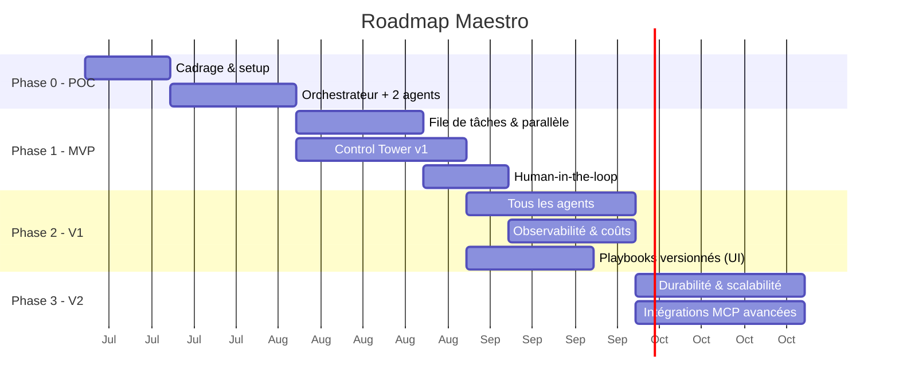

# Roadmap — Maestro

**Version :** 0.1
Approche progressive : **commencer simple**, prouver la valeur, puis robustifier. On n'ajoute de la complexité que lorsqu'elle apporte un bénéfice mesurable.

---

## Vue d'ensemble

> Les durées sont indicatives et à ajuster selon l'équipe.

---

## Phase 0 — POC (preuve de concept)

**But :** valider le cœur orchestrateur-workers avec le Claude Agent SDK, **derrière une frontière d'abstraction fournisseur**.

- Mettre en place le dépôt, l'environnement, l'accès au Claude Agent SDK.
- Poser la **couche d'abstraction fournisseur** (interface `ModelProvider` : `fournisseur + modèle + credentials`) comme frontière d'architecture — **un seul fournisseur câblé (Claude)** pour l'instant, mais l'interface est en place (O7 / ENF-11).
- Un **orchestrateur** qui décompose un objectif simple en 2-3 tâches.
- **Deux agents** (ex. Développeur + BDD) qui exécutent une tâche chacun.
- Exécution **en ligne de commande** (pas encore d'UI), résultats dans des fichiers.

**Critère de sortie :** un objectif → des tâches → 2 agents produisent un résultat exploitable ; le fournisseur de modèle est accédé via l'interface d'abstraction (pas d'appel Claude en dur dans la logique d'agent).

---

## Phase 1 — MVP

**But :** parallélisme réel + interface de supervision minimale + garde-fous.

- **File de tâches** (Celery/BullMQ + Redis) et **workers** → plusieurs agents en parallèle.
- **Auto-assignation** (compétences + classifieur léger).
- **Gestion des dépendances** entre tâches.
- **Control Tower v1** : tableau de bord temps réel + Kanban + réassignation manuelle.
- **Human-in-the-loop** sur les actions sensibles.
- Suivi de **coût** basique par tâche.

**Critère de sortie :** les 6 critères d'acceptation du MVP du [cahier des charges §8](./00-cahier-des-charges.md) sont remplis.

---

## Phase 2 — V1 (produit utilisable au quotidien)

**But :** équipe d'agents complète, personnalisation, observabilité.

- **Les 6 agents** par défaut opérationnels (+ création d'agents personnalisés).
- **Premier fournisseur non-Anthropic branché** via la couche d'abstraction (valide l'agnosticisme de bout en bout — O7 : ≥ 1 fournisseur non-Anthropic en V1).
- **Éditeur de playbooks versionnés** dans l'UI, application à chaud.
- **Observabilité Langfuse** intégrée (traces, coûts, évaluation).
- **Contrôle de capacité** (instances par agent) depuis l'UI.
- **Chat** utilisateur ↔ agent.
- Tableau de bord **coûts & analytics**.

**Critère de sortie :** un projet réel mené de bout en bout avec supervision et coûts maîtrisés.

---

## Phase 3 — V2 (robustesse & échelle)

**But :** fiabilité production et écosystème.

- **Workflows durables** (migration vers Temporal) : reprise sur panne, tâches longues.
- **Scalabilité horizontale** : plusieurs instances par agent, montée en charge.
- **Intégrations MCP avancées** : Figma, Linear/Jira, Slack, cloud providers.
- **Auto-amélioration des playbooks** (l'agent propose des corrections à partir de ses échecs) — livré : analyse à la demande d'un run en échec → proposition en brouillon, appliquée ou rejetée depuis l'UI ([docs/22](./22-auto-amelioration-playbooks.md), #111).
- Renforcement **sécurité** (micro-VM, gestion fine des secrets et permissions).
- Éventuelle migration/ajout de **LangGraph** pour les flux d'état complexes.

---

## Au-delà (idées V3+)

- Marketplace d'agents et de playbooks partageables.
- **Catalogue étendu de fournisseurs** et **sélection automatique du modèle** par coût/latence/souveraineté (la couche d'abstraction, elle, existe dès la Phase 0 ; ici on enrichit le catalogue et l'auto-sélection).
- Apprentissage des préférences de l'équipe (mémoire long terme enrichie).
- Mode « revue par les pairs » entre agents (débat/consensus à la AutoGen).

---

## Jalons de décision (go / no-go)

| Jalon | Question à trancher |
|-------|---------------------|
| Fin Phase 0 | Le pattern orchestrateur-workers donne-t-il des résultats fiables ? |
| Fin Phase 1 | Le parallélisme et l'auto-assignation tiennent-ils la charge cible ? |
| Fin Phase 2 | Les coûts sont-ils maîtrisés et l'UI suffisante au pilotage quotidien ? |
| Fin Phase 3 | Faut-il un framework d'orchestration dédié (LangGraph) ou rester sur l'Agent SDK ? |
