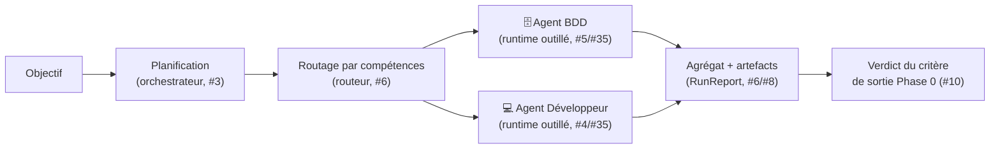

# Démo de bout en bout du POC — Maestro

**Version :** 0.1
Cette page boucle la **Phase 0** (ticket #10) : comment lancer la démo complète, ce qui se passe à chaque étape du parcours, et comment le **critère de sortie** de la phase est vérifié.

> **Critère de sortie Phase 0** ([roadmap §Phase 0](./06-roadmap.md)) : un objectif → des tâches → **2 agents produisent un résultat exploitable** ; le fournisseur de modèle est accédé **via l'interface d'abstraction** (pas d'appel Claude en dur dans la logique d'agent).

---

## 1. Lancer la démo

```bash
# Prérequis : environnement prêt (SDK + authentification — voir docs/07 §2.1)
.venv/Scripts/maestro-check-env    # Unix : .venv/bin/maestro-check-env

# La démo complète, sur l'objectif par défaut (mini-CRM : schéma SQL + API REST)
.venv/Scripts/maestro-demo

# Variantes
.venv/Scripts/maestro-demo --trace                    # journal JSON Lines sur stderr
.venv/Scripts/maestro-demo --sortie mon-dossier       # artefacts ailleurs que sortie-demo/
.venv/Scripts/maestro-demo "Votre objectif à vous"    # objectif libre
```

L'**objectif par défaut** est choisi pour mobiliser les deux agents du POC — un domaine 🗄️ Base de données (schéma, migration) et un domaine 💻 Développeur (backend, API) : *« Prototyper la gestion des contacts d'un mini-CRM, volontairement minimal (démo de POC) : concevoir le schéma SQL de la table des contacts avec une migration simple, puis implémenter en Python une API REST minimale — un seul module, deux endpoints (créer un contact, lister les contacts) — qui s'appuie sur ce schéma. […] »* Son périmètre est **explicitement borné** (« minimal », « un seul module ») pour que chaque tâche tienne dans le budget de tours du runtime outillé — le garde-fou anti-emballement du fournisseur.

Les **garde-fous** ([#9](./06-roadmap.md), docs/07 §4) sont armés d'office : plafond de dépense **5 $ par tâche** (`--plafond-cout`), time-out **600 s par tâche** (`--timeout`). Une tâche classée sensible demanderait une validation sur la console — refusée par défaut si l'entrée n'est pas interactive (fail-safe).

**Code de sortie** : `0` si la démo tourne de bout en bout **et** que le critère de sortie est validé ; `1` sinon ; `2` si l'appel est mal formé.

---

## 2. Le parcours, étape par étape



1. **Planification** — l'orchestrateur (Chef de projet, modèle Opus) découpe l'objectif en tâches structurées et validées contre le schéma (`packages/shared`) : id, titre, description, compétences requises, format de sortie, dépendances.
2. **Routage** — chaque tâche est auto-assignée à l'agent du catalogue ([docs/04 §2](./04-specifications-agents.md)) qui couvre le mieux ses compétences requises : `sql`/`schema`/`migration` → **bdd**, `backend`/`api` → **developpeur**.
3. **Exécution** — les tâches s'exécutent dès que leurs dépendances sont résolues, **en parallèle** quand elles sont indépendantes (#7). Les rôles outillés (`developpeur`, `bdd`) travaillent chacun dans un **espace isolé** jetable et produisent des **fichiers** (#35) ; chaque tâche reçoit les livrables des tâches dont elle dépend (tableau noir). Le tout sous garde-fous (#9) et mesuré (#8 : tokens, coût, durée, outils).
4. **Agrégat & artefacts** — les résultats sont rassemblés en un `RunReport` déterministe, et la démo écrit les **résultats dans des fichiers** (l'exigence Phase 0 de la roadmap) — voir §3.
5. **Verdict** — le rapport est confronté aux volets mesurables du critère de sortie (§4) ; le verdict est imprimé et consigné dans `verdict.md`.

---

## 3. Les artefacts produits

Chaque exécution écrit sous `sortie-demo/run-<run_id>/` (le `run_id` relie tous les artefacts au journal ; rien n'est écrasé d'un run à l'autre) :

| Artefact | Contenu |
|----------|---------|
| `synthese.md` | L'agrégat Markdown : récap chiffré (tâches réussies, usage total) puis livrable par tâche |
| `rapport.json` | Le rapport structuré complet (`RunReport.to_dict()`) : statuts, livrables, fichiers, usage par tâche |
| `journal.jsonl` | Le journal d'exécution (#8) : une ligne JSON par étape (planification, tâches, validations), secrets expurgés |
| `verdict.md` | Le verdict du critère de sortie Phase 0, volet par volet, avec preuves |
| `livrables/<tâche>/livrable.md` | Le livrable texte de chaque tâche réussie |
| `livrables/<tâche>/fichiers/…` | Les fichiers produits par les runtimes outillés (SQL, code…) |

Le dossier `sortie-demo/` est ignoré par Git (artefacts d'exécution, pas du code source).

---

## 4. Vérification du critère de sortie

Le verdict confronte le `RunReport` aux volets **mesurables** du critère (`maestro/demo.py`, `verifier_critere_sortie`) :

| Volet du critère | Vérification |
|------------------|--------------|
| « un objectif → **des tâches** » | Le plan compte **au moins 2 tâches** issues de l'objectif |
| « **2 agents** produisent » | **Au moins 2 agents distincts** ont livré une tâche avec succès |
| « un **résultat exploitable** » | **Aucune tâche en échec** ; le moteur garantit qu'une tâche réussie a un livrable non vide (texte et/ou fichiers), et la démo les écrit dans des fichiers |

Le volet **architectural** — *« le fournisseur de modèle est accédé via l'interface d'abstraction »* — ne se mesure pas sur une exécution : il est garanti **par construction** (le moteur, l'orchestrateur et les runtimes ne dépendent que de `ModelProvider` ; seul le raccourci `OrchestrationEngine.default` connaît Claude) et **prouvé par la suite de tests**, qui déroule cette même démo entièrement sur des **fournisseurs factices**, sans aucun appel Claude (`tests/test_demo.py`, `tests/test_engine.py`).

Si un volet manque (un seul agent mobilisé, une tâche en échec…), le verdict passe à **NON VALIDÉ** et `maestro-demo` sort en code `1` — la démo est aussi un **contrôle qualité rejouable** du POC.

---

## 5. Exécution de référence (2026-07-09, run `c90c865383bd`)

Exécution réelle sur le fournisseur Claude (mode abonnement, docs/07 §2.1), objectif par défaut :

- **Plan** : 3 tâches — schéma SQL + migration (**bdd**) → API REST (**developpeur**) → smoke test (**qa**) ;
- **3 agents distincts** ont produit (≥ 2 attendus) : `bdd` (migration `0001_create_contacts.sql` + README), `developpeur` (`contacts_api.py`, module unique adossé au schéma), `qa` (rapport de vérification) — les rôles outillés chacun dans leur espace isolé ;
- **Résultat exploitable** : 3/3 tâches réussies, livrables écrits sous `sortie-demo/run-c90c865383bd/livrables/` ;
- **Usage total** : 4 appels modèle, ~413 k tokens, **0,54 $**, 202 s (le plafond de 5 $/tâche et le time-out de 600 s/tâche n'ont pas été approchés) ;
- **Verdict** : `Critère de sortie Phase 0 — VALIDÉ` (code de sortie `0`).

> Les chiffres exacts (nombre de tâches, tokens, durée) varient d'une exécution à l'autre — le plan est généré par un modèle. Les preuves d'une exécution donnée sont dans ses artefacts (`verdict.md`, `rapport.json`). Bon à savoir : un objectif **trop ouvert** peut faire échouer une tâche sur le garde-fou anti-emballement du runtime outillé (« Reached maximum number of turns ») — c'est le garde-fou qui travaille, pas un bug ; resserrer le périmètre de l'objectif suffit (d'où le libellé « volontairement minimal » de l'objectif par défaut).

---

## 6. Et après ?

Le POC est bouclé : le jalon de décision « fin Phase 0 » de la [roadmap](./06-roadmap.md) (*le pattern orchestrateur-workers donne-t-il des résultats fiables ?*) peut être tranché sur pièces. La suite est la **Phase 1 (MVP)** : file de tâches, parallélisme à l'échelle, Control Tower v1, human-in-the-loop.
