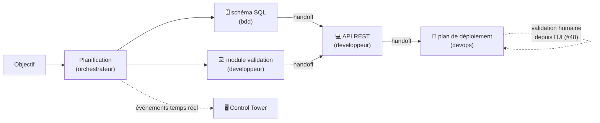
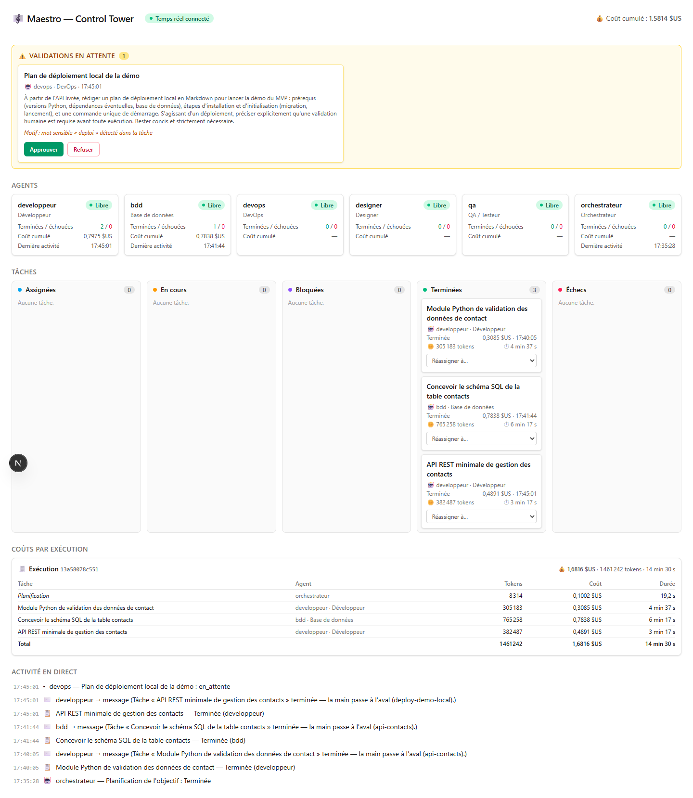
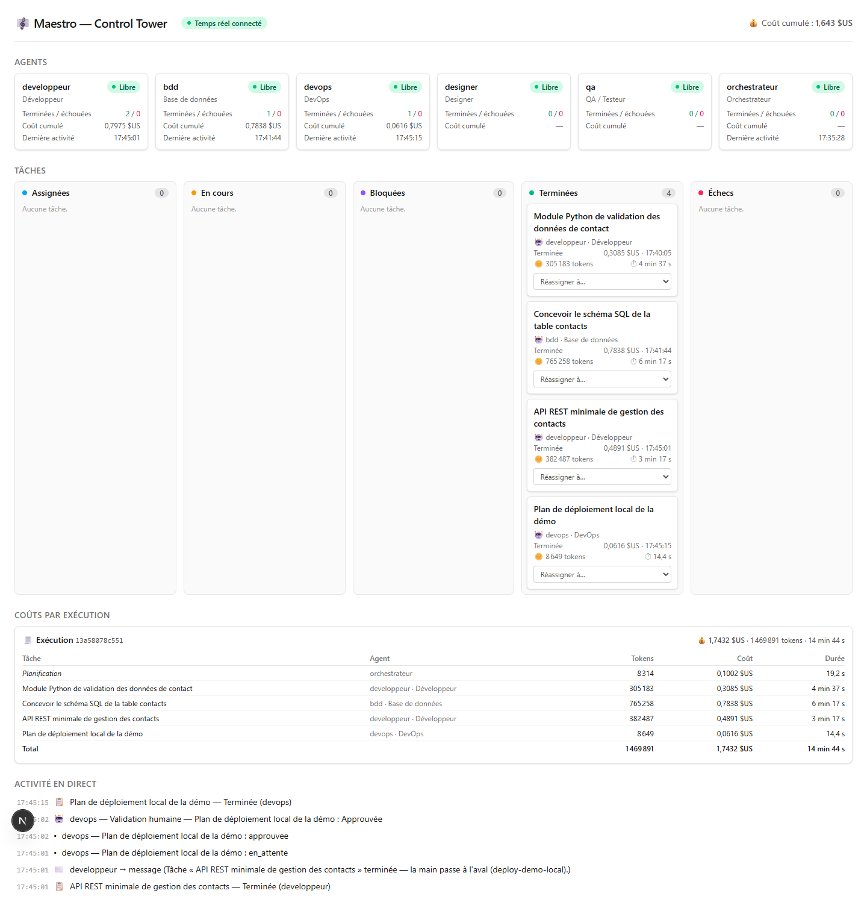

# Démo de bout en bout du MVP — Maestro

**Version :** 0.1
Cette page boucle la **Phase 1** (ticket #50) : comment rejouer la démo complète du MVP — moteur,
file d'événements, Control Tower, validation humaine —, comment chacun des **7 critères
d'acceptation** du [cahier des charges §8](./00-cahier-des-charges.md) est vérifié **sur pièces**,
et le **verdict go/no-go** de fin de Phase 1 ([roadmap](./06-roadmap.md)).

> **Jalon de fin de Phase 1** : *« Le parallélisme et l'auto-assignation tiennent-ils la charge
> cible ? »* — tranché au §5 sur la base de l'exécution de référence du §4.

---

## 1. Prérequis et mise en place

La démo mobilise quatre processus : Redis (bus d'événements + messagerie inter-agents), le
backend Control Tower, l'UI, et le run lui-même.

```bash
# 0. Environnement prêt (SDK + authentification — docs/07 §2.1)
.venv/Scripts/maestro-check-env          # Unix : .venv/bin/maestro-check-env

# 1. Redis (infra/docker-compose.yml)
docker compose -f infra/docker-compose.yml up -d redis

# 2. Backend Control Tower (API REST + WebSocket, port 8000)
.venv/Scripts/python.exe -m maestro.controltower.cli     # ou : maestro-api

# 3. UI Control Tower (port 3000)
cd apps/web && npm install && npm run dev
```

Ouvrir <http://localhost:3000> : badge **« Temps réel connecté »**, les 5 agents du catalogue
« Libre », aucun événement — la Control Tower est prête à observer le run.

---

## 2. Le scénario, en deux actes

### 2.1 Acte I — le routage sur pièces (critère n°3)

Le jeu d'assignation versionné ([`packages/shared/datasets/assignation.json`](../packages/shared/datasets/assignation.json),
12 cas variés couvrant les 5 agents + 1 cas de repli attendu) mesure la précision du routeur.
Deux façons de le rejouer :

```bash
# Le test automatisé (fournisseur factice pour les cas ambigus — hors ligne, déterministe)
.venv/Scripts/python.exe -m pytest tests/test_router.py -q

# La mesure sur le vrai classifieur Claude (celui du moteur)
.venv/Scripts/python.exe -c "
import asyncio
from maestro.agents.catalog import DEFAULT_AGENTS
from maestro.config import load_settings
from maestro.providers.claude import ClaudeProvider
from maestro.router import Router, TaskClassifier
from maestro.router.evaluation import evaluer
async def main():
    router = Router(DEFAULT_AGENTS, classifier=TaskClassifier(ClaudeProvider.from_settings(load_settings())))
    resultat = await evaluer(router)
    print(resultat.resume())
asyncio.run(main())
"
```

### 2.2 Acte II — le run supervisé (critères n°1, 2, 4, 5, 6, 7)

Un seul run, conçu pour tout mobiliser : deux tâches indépendantes (parallélisme), une tâche
aval (handoffs), et une tâche de déploiement (validation humaine depuis l'UI).

```bash
.venv/Scripts/maestro-run --json --trace --publier --messagerie --validation-ui \
  --plafond-cout 5 --timeout 600 \
  "Prototyper la gestion des contacts d'un mini-CRM, volontairement minimal (démo du MVP), \
en quatre tâches : (1) concevoir le schéma SQL de la table des contacts avec une migration \
simple ; (2) indépendante du schéma, donc démarrable en parallèle : implémenter en Python un \
module de validation des données de contact — deux fonctions pures (e-mail, téléphone), un \
seul fichier, bibliothèque standard ; (3) une fois le schéma et le module de validation \
livrés, implémenter en Python une API REST minimale — un seul module, deux endpoints (créer \
un contact, lister les contacts) — qui s'appuie sur le schéma et réutilise le module de \
validation ; (4) à partir de l'API livrée, rédiger le plan de déploiement local de la démo \
en Markdown (prérequis, étapes, commande unique de lancement) — c'est un déploiement : \
validation humaine requise avant exécution. Rester au plus simple : bibliothèque standard ou \
micro-framework, pas d'authentification, rien au-delà du strict nécessaire, et des livrables \
compacts." \
  > rapport.json 2> journal.jsonl
```

Les options font chacune un critère : `--publier` alimente le tableau de bord en temps réel
(n°4), `--messagerie` fait passer les relais entre agents par messages observables (n°7),
`--validation-ui` route la demande de validation vers la Control Tower (n°5), `--plafond-cout`
s'adosse à la comptabilité par tâche (n°6), et le mot « déploiement » du volet (4) déclenche la
classification sensible (garde-fous #9). Le rapport structuré part sur stdout, le journal (#8)
sur stderr — les rediriger comme ci-dessus les conserve en artefacts.

**Pendant le run, dans l'UI** : la planification apparaît dans le fil d'activité ; les tâches
surgissent dans le Kanban avec coût, tokens et durée à mesure qu'elles se terminent ; chaque fin
de tâche à dépendants émet un **message inter-agents** visible dans le fil (« la main passe à
l'aval ») ; à la tâche de déploiement, le panneau **« Validations en attente »** apparaît en tête
avec le contexte (agent, tâche, action, motif) — cliquer **Approuver** fait reprendre la tâche
(la séquence en_attente → approuvée se trace dans le fil) ; le panneau **« Coûts par exécution »**
ventile le grand livre du run (planification + coût par tâche + agrégat), aussi servi par
`GET /api/executions/<run_id>/cout`.



---

## 3. Les 7 critères du §8, un à un

| # | Critère (cahier des charges §8) | Vérification | Preuve (exécution de référence, §4) |
|---|--------------------------------|--------------|-------------------------------------|
| 1 | Un objectif en langage naturel génère des tickets cohérents | Le plan de l'orchestrateur, validé contre la JSON Schema partagée | 4 tâches structurées (id, compétences, dépendances, format de sortie) fidèles aux 4 volets de l'objectif |
| 2 | ≥ 3 agents exécutent, dont 2 en parallèle | Agents distincts des tâches réussies ; chevauchement des fenêtres d'exécution au journal | **3 agents** (bdd, developpeur, devops) ; bdd ∥ developpeur pendant **4 min 37 s** (14:35:28 → 14:40:05 UTC) |
| 3 | Routage correct ≥ 9 tickets sur 10 | Jeu versionné + `tests/test_router.py` (seuil 0,9 affirmé) ; mesure sur le vrai classifieur | **12/12 (100 %)** — 9 cas tranchés par règles de compétences, 2 par le classifieur Claude, 1 repli « à assigner » attendu |
| 4 | Tableau de bord temps réel (agents + tâches) | UI branchée en WebSocket, sans rechargement | Badge « Temps réel connecté » ; cartes agents, Kanban, coûts et fil d'activité mis à jour au fil du run (captures §4) |
| 5 | Une action sensible → validation traitée depuis l'UI | Mot sensible « deploi » → tâche en pause → panneau UI → décision → reprise | Demande « Plan de déploiement local de la démo » (devops) **approuvée depuis l'UI** ; séquence en_attente → approuvée au fil et au journal (`deploy-demo-local:validation [approuve]`) |
| 6 | Coût total visible et traçable par tâche | Comptabilité par tâche (#55-#58) : Kanban, panneau Coûts, `GET /api/executions/<run_id>/cout`, `rapport.json` | Grand livre du run `13a58078c551` : planification 0,1002 $ + 4 tâches ventilées (tokens entrée/sortie, coût, durée), total **1,7432 $US** |
| 7 | ≥ 1 échange inter-agent observable | Handoffs de fin de tâche (`<tâche>:message` au journal, fil d'activité de l'UI) | **3 handoffs** (schéma → API, module → API, API → déploiement), ex. « bdd → message (Tâche « Concevoir le schéma SQL… » terminée — la main passe à l'aval (api-contacts).) » |

Le tout sous garde-fous armés : plafond de 5 $ pour l'exécution entière (jamais approché) et
time-out de 600 s par tâche.

---

## 4. Exécution de référence (2026-07-10, run `13a58078c551`)

Exécution réelle sur le fournisseur Claude (mode abonnement, docs/07 §2.1), objectif du §2.2,
**code de sortie 0** — 4/4 tâches réussies (horodatages UTC ; l'UI affiche l'heure locale) :

| Étape | Agent | Début → fin | Durée | Coût | Tokens |
|-------|-------|------------|-------|------|--------|
| Planification | orchestrateur | 14:35:09 → 14:35:28 | 19,2 s | 0,1002 $ | 8 314 |
| Schéma SQL + migration (`schema-contacts`) | **bdd** | 14:35:28 → 14:41:44 | 6 min 17 s | 0,7838 $ | 765 258 |
| Module de validation (`validation-contact`) | **developpeur** | 14:35:28 → 14:40:05 | 4 min 37 s | 0,3085 $ | 305 183 |
| API REST (`api-contacts`) | **developpeur** | 14:41:44 → 14:45:01 | 3 min 17 s | 0,4891 $ | 382 487 |
| Validation humaine (UI) | devops | 14:45:02 | — | — | — |
| Plan de déploiement (`deploy-demo-local`) | **devops** | 14:45:01 → 14:45:15 | 14,4 s | 0,0616 $ | 8 649 |
| **Total** | | **~10 min de bout en bout** | 14 min 44 s cumulées | **1,7432 $** | 1 469 891 |

Les deux premières tâches, sans dépendance, ont couru **en parallèle** du même instant
(14:35:28) — le module s'achève pendant que le schéma continue. L'API n'a démarré qu'à
réception des **deux handoffs**, et le plan de déploiement est resté **en pause** le temps de
la décision humaine (l'attente de validation n'est pas comptée dans le time-out).

La demande de validation dans la Control Tower, avec le grand livre et le fil d'activité en
temps réel :



L'état final — 4 tâches terminées, 0 échec, coûts ventilés par tâche, la décision tracée :



En complément : la suite de tests (**230 tests verts**, fournisseurs factices — dont le seuil
9/10 du routage affirmé par `tests/test_router.py`) rejoue planification, routage, garde-fous,
messagerie et Control Tower sans aucun appel Claude.

> Les chiffres varient d'une exécution à l'autre (le plan est généré par un modèle). Les preuves
> d'une exécution donnée sont dans ses artefacts (`rapport.json`, `journal.jsonl`, grand livre
> `GET /api/executions/<run_id>/cout`).

---

## 5. Verdict go/no-go de fin de Phase 1

**Verdict : GO** — les 7 critères d'acceptation du MVP sont remplis et prouvés sur pièces
(§3-§4). Le parallélisme (2 agents simultanés sans collision, espaces isolés) et
l'auto-assignation (100 % sur le jeu de test, repli explicite plutôt qu'un mauvais routage)
**tiennent la charge de la démo**. Trois réserves consignées, sans remise en cause du jalon :

1. **Time-out non recouvré sur blocage du runtime outillé** (bug **#64**, découvert pendant les
   essais : une tâche QA au tableau noir volumineux est restée suspendue au-delà du `--timeout`,
   le sous-processus SDK ne rendant pas la main). À corriger tôt en Phase 2 : c'est un
   garde-fou.
2. **Aléas du fournisseur** : sur un des essais, le SDK a rendu une erreur immédiate
   (« error result: success ») — le moteur a réagi comme prévu (échec consigné, aval bloqué
   avec raison, notification inter-agents), mais il n'y a pas encore de **relance automatique**
   (ENF-06, prévue Phase 3).
3. **Granularité du temps réel** : le moteur local ne consigne une tâche qu'à son issue — la
   colonne « En cours » du Kanban reste vide pendant l'exécution (l'activité vivante passe par
   le fil, les validations et les messages). Des événements de début de tâche affineraient la
   lecture.

La **charge cible** au-delà de 2 agents simultanés (O4 : ≥ 5) reste à éprouver à l'échelle : la
brique file de tâches + workers (#41, `maestro-run --queue`) est en place pour ça — c'est
l'affaire de la Phase 2 (V1), avec le premier fournisseur non-Anthropic (O7) et l'éditeur de
playbooks.
