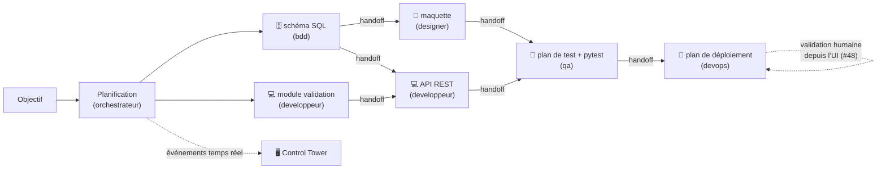
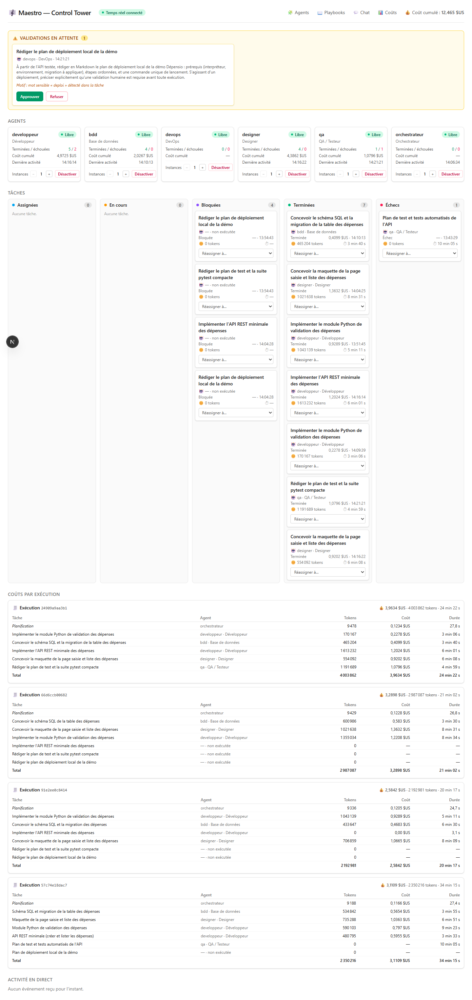
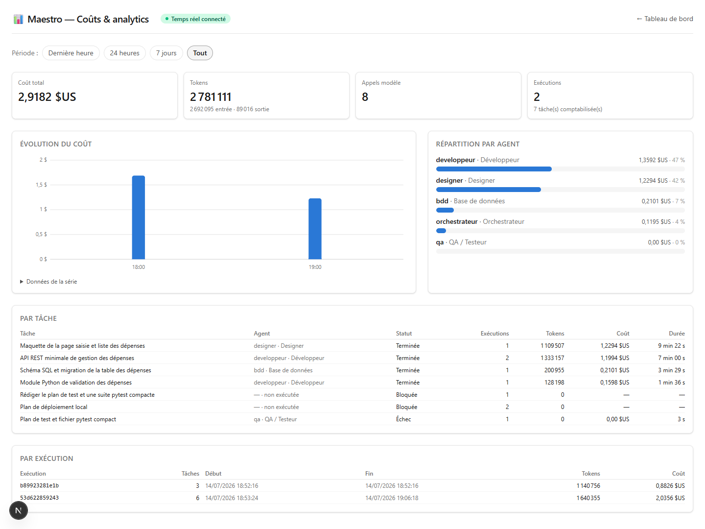
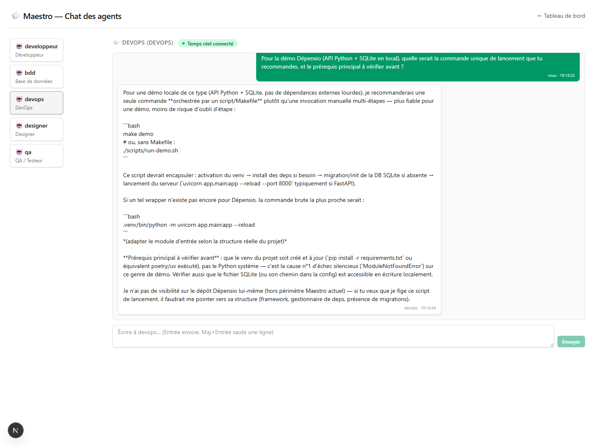
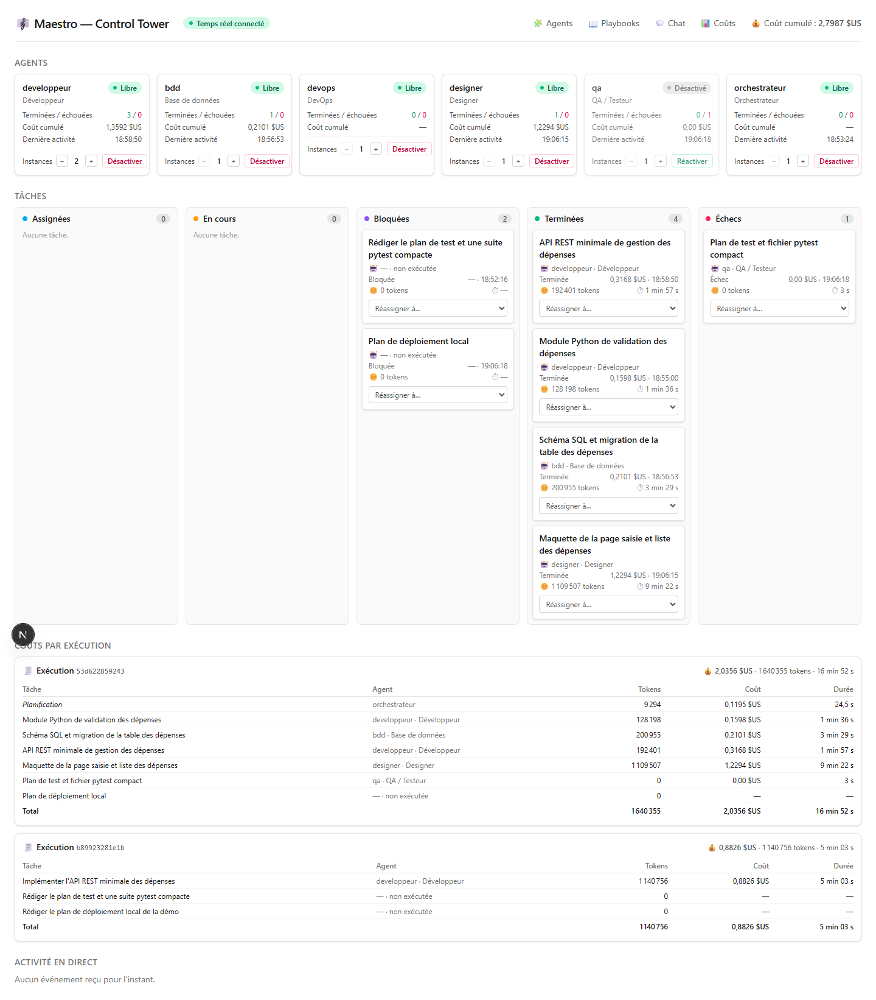

# Démo V1 : un projet réel de bout en bout — Maestro

**Version :** 0.1
Cette page boucle la **Phase 2** (ticket #88) : comment rejouer la démo V1 — un **projet réel**
mené par l'équipe d'agents complète sous supervision Control Tower —, comment les **critères
d'acceptation** du ticket et le **critère de sortie de la Phase 2** ([roadmap](./06-roadmap.md) :
*« un projet réel mené de bout en bout avec supervision et coûts maîtrisés »*) sont vérifiés
**sur pièces**, et le **verdict go/no-go** de fin de Phase 2.

> **Jalon de fin de Phase 2** : *« Les coûts sont-ils maîtrisés et l'UI suffisante au pilotage
> quotidien ? »* — tranché au §5 sur la base des six exécutions de référence du §4.

---

## 1. Prérequis et mise en place

Même ossature que la [démo MVP](./12-demo-mvp.md), mais sur l'**API réelle** (pas la démo
scriptée de `scripts/controltower/start.sh`) : Redis, backend Control Tower, UI, et le run.

```bash
# 0. Environnement prêt (SDK + authentification — docs/07 §2.1)
.venv/Scripts/maestro-check-env          # Unix : .venv/bin/maestro-check-env

# 1. Redis (infra/docker-compose.yml)
docker compose -f infra/docker-compose.yml up -d redis

# 2. Backend Control Tower (API REST + WebSocket, port 8000)
.venv/Scripts/python.exe -m maestro.controltower.cli     # ou : maestro-api

# 3. UI Control Tower (port 3000)
cd apps/web && npm install && npm run dev
```

Ouvrir <http://localhost:3000> : badge **« Temps réel connecté »**, les agents du catalogue
« Libre » avec leurs **contrôles de capacité** (#86), la navigation **Agents / Playbooks /
Chat / Coûts** en tête — toute la Phase 2 est à portée de clic avant même le premier run.

---

## 2. Le scénario : « Dépensio », un projet réel en six tâches

Le projet : un mini-outil interne de suivi des dépenses d'équipe, découpé pour mobiliser **les
cinq exécutants** (bdd, développeur, designer, qa, devops) plus l'orchestrateur — deux fenêtres
de parallélisme, quatre handoffs, et une tâche de déploiement qui déclenche la **validation
humaine depuis l'UI** (#48).

```bash
.venv/Scripts/maestro-run --json --trace --publier --messagerie --validation-ui \
  --plafond-cout 10 --timeout 900 \
  "Réaliser « Dépensio », un mini-outil interne de suivi des dépenses d'équipe (projet réel \
de la démo V1), en six tâches COMPACTES — au plus DEUX tâches en parallèle à tout moment, \
chaque livrable est COURT et rendu DIRECTEMENT : (1) le schéma SQL de la table des dépenses \
(id, libellé, montant, catégorie, date, auteur) et sa migration — un seul fichier SQL court ; \
(2) en parallèle de (1) : un module Python de validation des dépenses — trois fonctions pures \
(montant positif, catégorie autorisée, date ISO), un seul fichier court, bibliothèque \
standard ; (3) après le schéma (1) : la maquette de la page « saisie et liste des dépenses » \
— une page Markdown (wireframe ASCII + parcours utilisateur, états vides et erreurs) ; (4) \
après (1) et (2), en parallèle possible de (3) : une API REST minimale en Python — deux \
endpoints (créer, lister), un seul fichier court réutilisant le module de validation ; (5) \
après (3) et (4) : un plan de test d'une page et UN fichier pytest compact — une douzaine de \
cas sur le module de validation et les fonctions de l'API en appels directs, sans serveur ni \
dépendances ; (6) après (5) : le plan de déploiement local — UNE page Markdown (prérequis, \
étapes, commande unique), rédaction pure sans rien exécuter — c'est un déploiement : \
validation humaine requise avant exécution. Bibliothèque standard ou micro-framework, pas \
d'authentification, sobriété maximale." \
  > rapport.json 2> journal.jsonl
```



Le mot d'ordre « compact » du libellé n'est pas cosmétique : c'est un **levier de coût mesuré**
(§4 — le même projet est passé de 3,61 $ à 2,04 $ en resserrant les livrables), et la
concurrence est plafonnée à 2 pour limiter l'exposition aux aléas du fournisseur (§4.3).

---

## 3. Les critères, un à un

Les trois critères d'acceptation du ticket #88 :

| # | Critère | Vérification | Preuve (§4) |
|---|---------|--------------|-------------|
| 1 | Un projet réel mené de bout en bout avec l'équipe d'agents, supervisé via la Control Tower | Runs réels sur le fournisseur Claude, 6 tâches, 5 exécutants + orchestrateur, Kanban/coûts/fil en temps réel, validation humaine depuis l'UI | **Partiellement** : 21 tâches réussies sur 27 exécutées en 6 runs ; meilleur run **5/6** (run D, validation approuvée depuis l'UI) ; chaque type de livrable produit au moins une fois, mais **aucun run 6/6** (§4.3) |
| 2 | Coûts suivis et maîtrisés sur l'ensemble de l'exécution (rapport chiffré) | Comptabilité par tâche (#55-#58) + plafond `--plafond-cout` + tableau de bord Coûts & analytics (#87) | **Oui** : 21,04 $ pour les 6 runs, ventilés tâche par tâche (§4.1) ; plafond jamais approché ; page Coûts opérationnelle (capture §4.4) |
| 3 | Verdict du jalon « Fin Phase 2 » documenté dans docs/ | Cette page | §5 |

Et les **briques de la Phase 2**, exercées pendant la démo :

| Brique (tickets) | Exercée pendant la démo | Preuve |
|------------------|-------------------------|--------|
| Équipe complète : 5 exécutants + orchestrateur (#67, #68) | Oui — les 6 rôles ont travaillé (designer et devops compris) | Journaux, grands livres §4 |
| Validation humaine depuis l'UI (#48) | Oui — demande « plan de déploiement » approuvée au clic (run D) | Capture §4.2, journal `plan-deploiement:validation [approuve]` |
| Coûts & analytics (#87) | Oui — coût total, évolution, répartition par agent, détail par tâche/exécution, période sélectionnable | Capture §4.4, `GET /api/analytics/couts` |
| Chat utilisateur ↔ agent (#82-#85) | Oui — question de supervision posée à l'agent devops, réponse réelle persistée au fil | Capture §4.4, `POST /api/chat/devops/messages` |
| Contrôle de capacité (#86) | Oui — qa désactivé/réactivé et développeur monté à 2 instances depuis l'API/UI, diffusion temps réel | Capture §4.4 (badge « Désactivé », bouton « Réactiver ») |
| Playbooks versionnés + application à chaud (#74-#78) | Partiellement — API `GET /api/playbooks` / versions vérifiée (source `defaut`, prêt à surcharger) ; pas d'édition pendant les runs | §1, docs/07 §6.2 |
| Agents personnalisés (#70-#73) | Partiellement — `GET /api/catalogue` vérifié (5 fiches) ; pas de création pendant la démo | docs/07 §6.3 |
| Observabilité Langfuse (#79-#81) | Non exercée — purement configurative (`LANGFUSE_*` absentes de l'environnement de démo), no-op assumé | docs/07 §2.2 |
| Fournisseur non-Anthropic (#69) | Non exercé en run — bascule par config (`MAESTRO_PROVIDER`), couverte par les tests | docs/07, `maestro.providers.factory` |

Garde-fous armés sur **tous** les runs : plafond de 10 $ par exécution, time-out par tâche
(600 s puis 900 s), plafond de 40 tours par exécution agentique, classification sensible +
validation humaine. Chacun a été **déclenché au moins une fois** pendant la démo (§4.3) — et a
fait exactement ce qu'il devait.

---

## 4. Exécutions de référence (2026-07-14)

Six runs réels sur le fournisseur Claude (mode abonnement, docs/07 §2.1), même projet
« Dépensio » (libellé affiné en cours de route : timeout 600→900 s, concurrence 3→2,
livrables resserrés). Aucun run n'a atteint 6/6 — voir §4.3 pour l'analyse et §5 pour ce que
ça implique.

### 4.1 Le rapport chiffré

| Run | `run_id` | Tâches réussies | Coût | Tokens | Durée cumulée | Point d'arrêt |
|-----|----------|-----------------|------|--------|---------------|----------------|
| A | `57c74e18dac7` | 4/6 | 3,1109 $ | 2 350 216 | 34 min 18 s | qa : time-out 600 s (#64, échéance ferme) |
| B | `91e2ee0c8414` | 3/6 | 2,5842 $ | 2 192 981 | 20 min 17 s | développeur : aléa SDK (« error result: success »), 0 $ |
| C | `66d6ccb00682` | 2/6 | 3,2898 $ | 2 987 087 | 21 min 02 s | développeur : crash SDK (« Fatal error in message reader ») |
| D | `24909a9aa3b1` | **5/6** | 6,4131 $ | 6 632 043 | 38 min 25 s | devops : plafond de 40 tours (garde-fou anti-emballement) |
| E | `b89923281e1b` | 3/6 | 3,6087 $ | 3 134 644 | 25 min 58 s | designer : aléa SDK (« error result: success ») |
| F | `53d622859243` | 4/6 | 2,0356 $ | 1 640 355 | 16 min 52 s | qa : aléa SDK instantané (3 s, 0 $) |
| **Total** | | **21/27 exécutées** | **21,04 $** | 18 937 326 | | 6 planifications : 6/6 réussies |

Chaque dollar est **traçable** : grand livre par exécution dans l'UI et via
`GET /api/executions/<run_id>/cout` (planification + coût/tokens/durée par tâche), agrégats
transverses sur la page **Coûts & analytics**. Une tâche jamais exécutée (bloquée par l'échec
d'une dépendance) coûte 0 — les échecs en cascade ne « fuient » pas d'argent : l'aval est
bloqué avec raison, pas relancé à l'aveugle.

### 4.2 Le run D — supervision et validation humaine, sur pièces

Le run le plus complet (5/6) déroule tout le flux de pilotage : planification visible dans le
fil, tâches qui tombent dans le Kanban avec coût/tokens/durée, **handoffs** inter-agents
observables, et à la tâche de déploiement la demande de validation en tête d'UI — contexte
complet (agent, tâche, description, motif : *mot sensible « deploi » détecté*) :



Cliquer **Approuver** relance la tâche : la séquence `en_attente → approuvée` est tracée au
fil, au journal (`plan-deploiement:validation [approuve]`) et l'exécution reprend — la
mécanique human-in-the-loop de bout en bout, depuis un vrai navigateur. (La tâche devops a
ensuite buté sur le plafond de 40 tours — le garde-fou anti-emballement a coupé un agent parti
sur-travailler une page Markdown à 2,45 $.)

### 4.3 Ce que disent les échecs

27 tâches exécutées, 6 échecs — **aucun** dû à la logique d'orchestration (planification 6/6,
routage sans erreur, dépendances et handoffs impeccables) :

- **4 aléas fournisseur** (runs B, C, E, F — ~15 % des exécutions ce jour-là) : le sous-processus
  SDK rend une erreur immédiate ou crashe. Déjà consigné comme réserve n°2 du
  [verdict MVP](./12-demo-mvp.md) ; sans **relance automatique** (ENF-06, prévue Phase 3), un
  seul aléa condamne le run entier — c'est LE facteur qui a empêché le 6/6.
- **1 time-out** (run A, qa à 600 s) : l'échéance ferme (#64) a consigné l'échec, bloqué l'aval
  et rendu le rapport — le comportement nominal du garde-fou.
- **1 plafond de tours** (run D, devops à 40 tours) : idem, le garde-fou anti-emballement a
  borné la dérive au lieu de la laisser filer.

À chaque échec : coût comptabilisé, aval bloqué **avec raison**, notification inter-agents,
rapport structuré rendu, code de sortie honnête. La dégradation est propre — c'est précisément
ce qu'on attend d'un moteur supervisé — mais la **fiabilité de bout en bout** n'y est pas
encore (probabilité empirique d'un run 6/6 sans relance ce jour-là : ~30 %).

Enseignement de coût au passage : à périmètre identique, resserrer les livrables (« un seul
fichier court », « une page ») a fait passer le run de 3,61 $ (E) à **2,04 $** (F) et de 26 à
17 minutes — le libellé de l'objectif est un levier de maîtrise des coûts à part entière.

### 4.4 Le pilotage quotidien, depuis l'UI

La page **Coûts & analytics** (#87) pendant la démo — coût total de la période, tokens, appels
modèle, évolution temporelle, répartition par agent, détail par tâche et par exécution :



Le **chat** (#82-#85) — question de supervision à l'agent devops, réponse produite par le
fournisseur configuré, persistée au fil et diffusée en temps réel :



Le **contrôle de capacité** (#86) — qa désactivé (badge « Désactivé », bouton « Réactiver »),
développeur à 2 instances, le tout persisté et rediffusé aux clients temps réel :



En complément : la suite de tests (**450 tests verts**, fournisseurs factices — planification,
routage, garde-fous, messagerie, Control Tower, playbooks, chat, capacité, analytics) rejoue
l'ensemble hors ligne, sans appel Claude.

> Les chiffres varient d'une exécution à l'autre (plans générés par un modèle). Les preuves
> d'une exécution donnée sont dans ses artefacts (`rapport.json`, `journal.jsonl`, grand livre
> `GET /api/executions/<run_id>/cout`).

---

## 5. Verdict go/no-go de fin de Phase 2

La question du jalon : *« Les coûts sont-ils maîtrisés et l'UI suffisante au pilotage
quotidien ? »*

- **Coûts maîtrisés : OUI, sur pièces.** Chaque cent des 21,04 $ de la démo est ventilé par
  tâche, agent et exécution ; le plafond par run est armé et n'a jamais été approché ; les
  échecs ne coûtent que ce qu'ils ont réellement consommé (0 $ pour un aléa immédiat) ; la vue
  transverse (#87) donne l'évolution et la répartition en temps réel ; et le libellé des
  objectifs s'est révélé un levier de coût mesurable (−43 % entre E et F).
- **UI suffisante au pilotage quotidien : OUI.** Toute la démo s'est pilotée depuis la Control
  Tower : Kanban temps réel, grands livres par exécution, **validation humaine au clic**,
  chat avec un agent, capacité (désactivation, instances), playbooks et catalogue exposés.
  Réserve mineure reconduite du MVP : les tâches ne sont consignées qu'à leur issue (pas de
  colonne « En cours » vivante).

**Verdict : GO — avec une réserve bloquante à traiter en tête de Phase 3.** Le critère de
sortie « un projet réel mené de bout en bout » n'est atteint qu'**à une tâche près** (meilleur
run 5/6 ; tous les types de livrables produits au moins une fois ; supervision et coûts
démontrés de bout en bout). Ce qui manque n'est **pas** dans le périmètre fonctionnel de la
Phase 2 — orchestration, supervision, coûts et UI ont tenu — mais dans la **fiabilité
d'exécution** face aux aléas du fournisseur. Réserves :

1. **Relance automatique (ENF-06) d'abord** : 4 échecs sur 6 sont des aléas SDK transitoires
   qu'un simple retry aurait probablement absorbés ; sans lui, ~30 % de chances qu'un run de
   6 tâches aboutisse un jour de fournisseur instable. C'est la première brique de la
   Phase 3 (« Durabilité »), et la condition pour rejouer cette démo en 6/6.
2. **Durabilité des runs** (Phase 3, Temporal) : un run interrompu ne reprend pas — on repaie
   l'intégralité ; l'état de la Control Tower est projeté en mémoire (API redémarrée = grands
   livres de la session perdus, les artefacts JSON restent).
3. **Granularité du temps réel** (reconduite du MVP) : des événements de début de tâche
   affineraient le Kanban.
4. **Langfuse et le fournisseur non-Anthropic restent à exercer en conditions réelles** (tous
   deux configuratifs et couverts par les tests, aucun des deux branché pendant la démo).
   — *Levée depuis : runs réels et validation Langfuse consignés dans
   [docs/14](./14-run-fournisseur-non-anthropic.md) (#99).*
