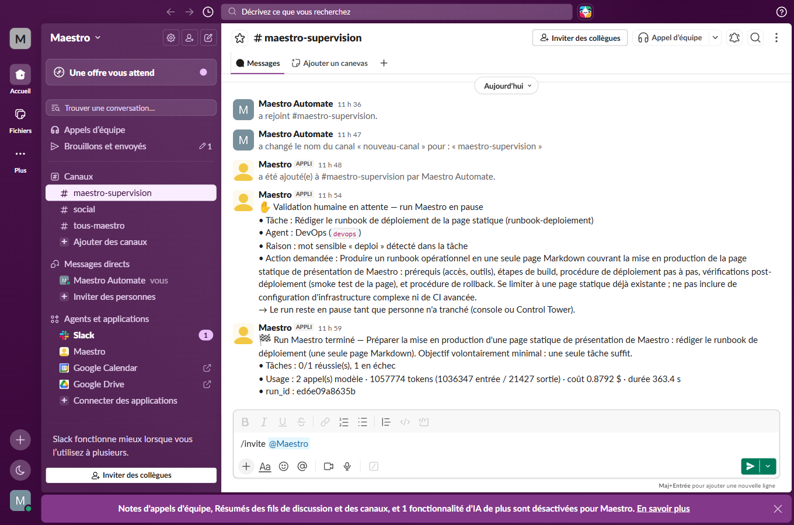

# Pilote MCP Slack — notifications de supervision d'un run (ticket #105)

**Version :** 0.1
Premier pilote concret du socle MCP (#104, parent #101) : un agent **équipé d'un
serveur MCP Slack** poste sur un canal les événements clés d'un run — la
supervision de la Control Tower prolongée là où l'équipe vit déjà. Cette page
consigne la configuration, le fonctionnement et la démonstration réelle.

> **Principe** : aucun connecteur Slack dans Maestro. C'est un agent du
> catalogue (le DevOps ici), équipé par sa **déclaration MCP versionnée**
> ([core/mcp/devops.json](../core/mcp/devops.json)), qui poste via ses outils
> `mcp__slack__…` — le moteur lui confie une mission de publication, jamais un
> appel d'API. Changer de canal (Teams, Discord…) = changer la déclaration, pas
> le code (`maestro/supervision.py`).

---

## 1. Ce qui est notifié

`maestro-run --notifier devops "<objectif>"` arme le notificateur de
supervision ([maestro/supervision.py](../maestro/supervision.py)) sur le run :

| Événement | Moment | Contenu posté |
|-----------|--------|---------------|
| **Validation humaine en attente** | Dès qu'une tâche sensible déclenche une demande de validation (#9), **avant** l'attente de la décision | Tâche, agent, raison de la classification, action demandée — l'équipe sait que le run est en pause |
| **Fin de run** | À l'issue de l'exécution, rapport agrégé rendu | Bilan : tâches réussies/échouées/bloquées, usage (appels, tokens, **coût**), `run_id` |

La notification est de la **supervision, pas de l'exécution** : best-effort par
contrat. Un échec (serveur MCP indisponible, canal introuvable, aléa
fournisseur) est consigné au journal (#8, étapes `notification` /
`<tâche>:notification`) et n'altère **jamais** l'issue du run ni la décision de
validation. Son coût est porté par son étape propre, hors du bilan du run
(déjà agrégé quand la notification part).

Non combinable avec `--queue` (les garde-fous — donc la notification de
validation — s'appliquent côté worker) ; compatible avec `--validation-ui`
(#48) : la notification part sur Slack, la décision se prend dans la Control
Tower.

## 2. Configuration

### 2.1 Côté Slack (une fois)

1. Créer une app sur <https://api.slack.com/apps> (« From scratch »), dans le
   workspace de l'équipe.
2. **OAuth & Permissions → Bot Token Scopes** : `chat:write` (poster) et
   `channels:read` (résoudre le canal) ; `channels:history` en option (outils
   de lecture du serveur MCP).
3. **Install App** sur le workspace → récupérer le **Bot User OAuth Token**
   (`xoxb-…`).
4. Inviter le bot dans le canal de supervision : `/invite @<nom-du-bot>`.
5. Noter le **Team ID** (`T0…`, page « About » du workspace ou URL de l'admin)
   et l'**ID du canal** (`C0…`, « Voir les détails du canal », en bas).

### 2.2 Côté Maestro (`.env`)

```bash
SLACK_BOT_TOKEN=xoxb-…        # jamais committé ni loggué (expurgé du journal)
SLACK_TEAM_ID=T0XXXXXXX
MAESTRO_SLACK_CANAL=C0XXXXXXX  # ou le nom du canal où le bot est invité
```

Dans la grille des modes d'auth MCP ([docs/21 §2](./21-configuration-mcp.md)),
Slack relève du **token statique saisissable** : émis par l'outil (installation
de l'app sur le workspace), sans expiration par défaut, consommé tel quel.

### 2.3 Déclaration MCP de l'agent (déjà versionnée)

[core/mcp/devops.json](../core/mcp/devops.json) équipe l'agent `devops` du
serveur Slack de référence (`@modelcontextprotocol/server-slack`, commande
locale stdio via `npx`) :

```json
{
  "serveurs": [
    {
      "nom": "slack",
      "type": "stdio",
      "commande": "npx",
      "args": ["-y", "@modelcontextprotocol/server-slack"],
      "env": {
        "SLACK_BOT_TOKEN": "${SLACK_BOT_TOKEN}",
        "SLACK_TEAM_ID": "${SLACK_TEAM_ID}"
      }
    }
  ]
}
```

Conformément au contrat du socle (#104, [docs/04 §6](./04-specifications-agents.md)),
le serveur est monté **à chaud** sur chaque exécution outillée de l'agent — la
mission de notification comme ses tâches ordinaires — et une variable absente
rend le serveur indisponible : échec propre avant tout appel modèle.

## 3. Le token ne transite jamais en clair (critère du ticket)

Défense en profondeur, trois verrous :

1. **Déclaration versionnée sans secret** : `core/mcp/devops.json` ne porte que
   la référence `${SLACK_BOT_TOKEN}`, résolue depuis l'environnement au moment
   du montage (#104) — la valeur effective n'existe qu'en mémoire, et l'API/UI
   de la fiche agent masque toute valeur littérale.
2. **Hors de portée de l'agent** : le token est injecté dans l'environnement du
   **sous-processus du serveur MCP**, pas dans le contexte du modèle — ni le
   prompt de mission, ni le playbook de l'agent ne le contiennent.
3. **Journaux expurgés** ([maestro/telemetry/redact.py](../maestro/telemetry/redact.py)) :
   la valeur de `SLACK_BOT_TOKEN` et le motif `xox…` sont masqués
   (`[secret masqué]`) de toute étape consignée — journal du run, fil temps
   réel Control Tower, trace Langfuse.

## 4. Démonstration réelle (2026-07-16)

Run réel mené de bout en bout — même consignation sur pièces que
[docs/14](./14-run-fournisseur-non-anthropic.md).

### 4.1 Dispositif

| Élément | Valeur |
|---------|--------|
| Workspace / canal | « Maestro » (`T0BHMTGUUCV`) / `#maestro-supervision` (`C0BH9RNJVF1`), bot `maestro` invité |
| Serveur MCP | `@modelcontextprotocol/server-slack` 2025.4.25 (stdio via `npx`), déclaré dans [core/mcp/devops.json](../core/mcp/devops.json) |
| Agent notificateur | `devops` (runtime outillé, Claude Sonnet), équipé du serveur à chaud |
| Scopes du bot | `chat:write` + `channels:read` seulement (le minimum ; la relecture API du canal répond d'ailleurs `missing_scope` — la publication, elle, n'en a pas besoin) |
| Garde-fous | `--plafond-cout 3`, `--timeout 600`, relances par défaut |
| `run_id` | `ed6e09a8635b` |

```bash
maestro-run --json --trace --plafond-cout 3 --timeout 600 --notifier devops \
  "Préparer la mise en production d'une page statique de présentation de Maestro : \
rédiger le runbook de déploiement (une seule page Markdown). \
Objectif volontairement minimal : une seule tâche suffit."
```

L'objectif contient « mise en production » / « déploiement » : la tâche planifiée
est classée **sensible** (#9), ce qui déclenche l'événement de validation.

### 4.2 Événements postés sur le canal (vérifiés)

**1. Validation humaine en attente** — posté *avant* l'attente de la décision
(`ts=1784192041.106669`, étape `runbook-deploiement:notification`, 2 tours, ~0,10 $) :

> :raised_hand: Validation humaine en attente — run Maestro en pause
> • Tâche : Rédiger le runbook de déploiement de la page statique (runbook-deploiement)
> • Agent : DevOps (`devops`)
> • Raison : mot sensible « deploi » détecté dans la tâche
> • Action demandée : Produire un runbook opérationnel en une seule page Markdown […]
> → Le run reste en pause tant que personne n'a tranché (console ou Control Tower).

**2. Fin de run** — bilan tâches/coût (`ts=1784192385.209879`, étape
`notification`, 2 tours, ~0,03 $) :

> :checkered_flag: Run Maestro terminé — Préparer la mise en production d'une page statique […]
> • Tâches : 0/1 réussie(s), 1 en échec
> • Usage : 2 appel(s) modèle · 1057774 tokens (1036347 entrée / 21427 sortie) · coût 0.8792 $ · durée 363.4 s
> • run_id : ed6e09a8635b

Capture du canal : 

### 4.3 Lecture critique

- Les **deux critères** du ticket sont exercés en réel : validation en attente
  postée avant la pause, bilan de fin de run avec coût et `run_id`.
- La tâche runbook a échoué au **plafond de tours** (`error_max_turns`, 41
  tours, 0,80 $) — un aléa d'exécution, jamais relancé (ENF-06)… que la
  notification de fin de run a **fidèlement rapporté** (« 0/1 réussie(s), 1 en
  échec ») : c'est précisément le rôle de la supervision, y compris quand le
  run tourne mal.
- L'agent notificateur est resté dans sa mission : son compte-rendu précise
  qu'il a posté la notification **sans** entreprendre la tâche d'infrastructure
  décrite dans le message — le prompt système de supervision (surcharge à chaud,
  même canal que les playbooks #78) a bien neutralisé le cadrage DevOps.
- **Token vérifié absent** des artefacts du run : 0 occurrence du motif `xox`
  dans la trace (`--trace`) comme dans le rapport `--json` — conjonction des
  trois verrous du §3.
- Découverte du pilote, corrigée au passage dans la couche fournisseur : le CLI
  enregistre les outils MCP **après** l'ouverture de session — sans sas de
  connexion, le premier tour de l'agent partait sans ses outils (cf.
  [docs/04 §6.2](./04-specifications-agents.md)).

## 5. Limites connues (POC)

- Le notificateur exige un agent à **runtime outillé** (`developpeur`, `bdd`,
  `qa`, `devops`) : un fournisseur texte-seul (`MAESTRO_PROVIDER=openai` sans
  exécution agentique) ne peut pas monter de serveur MCP — la notification
  échouerait proprement (`UnsupportedCapability` consignée).
- Chaque notification est une exécution outillée complète (espace isolé +
  session SDK) : quelques secondes et quelques centimes par événement — le prix
  du « zéro connecteur » au POC ; un transport direct est envisageable en V1
  sans changer le contrat.
- Les tests du parent #101 sont différés au lot final : **tests différés → #103**.
