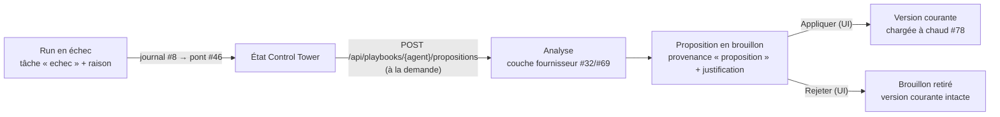

# Auto-amélioration des playbooks — de l'échec consigné à la révision proposée (ticket #111)

**Version :** 0.1
Axe « auto-amélioration des playbooks » de la Phase 3
([roadmap](./06-roadmap.md)) : après un run qui a échoué, Maestro peut **proposer**
une version révisée du playbook de l'agent concerné. La proposition est un
**brouillon** — jamais appliquée sans une décision humaine. Cette page décrit la
boucle complète : ce qui la déclenche, ce qu'elle produit, comment on tranche, et
pourquoi elle n'est pas automatique.

> **Le principe en une phrase** : l'agent lit ses propres échecs et rédige une
> proposition ; **un humain décide** si elle devient la règle. Le moteur ne charge
> jamais un brouillon. Lots de livraison : #138 (stockage), #139 (analyse),
> #140 (UI), #137 (tests + cette page). Tests :
> [tests/test_auto_amelioration.py](../tests/test_auto_amelioration.py).

---

## 1. La boucle



Cinq étapes, chacune traçable :

1. **Les échecs sont déjà là.** Un run consigne chaque tâche échouée avec sa
   raison (journal d'exécution #8), que le pont télémétrie → événements (#46)
   projette sur l'état de la Control Tower. L'analyse ne réinstrumente rien :
   elle relit `tache.statut` au statut `echec` pour l'agent visé
   (`echecs_du_run`). Aucun échec pour cet agent ⇒ rien à proposer (422).
2. **L'analyse est déclenchée à la demande** (§2) : elle confie à la couche
   d'abstraction fournisseur la rédaction d'une version révisée **intégrale** du
   playbook — pas un diff — à partir du playbook courant et de la liste des échecs.
3. **Le résultat est stocké en brouillon** (§3), à part de l'historique des
   versions, avec une justification qui référence les échecs analysés.
4. **L'UI affiche le brouillon** dans l'historique du playbook et le fait
   trancher au clic (§4).
5. **Appliquer** publie le contenu candidat comme version courante ; le moteur le
   charge **à chaud** dès la tâche suivante (#78), sans redémarrage.

## 2. Déclenchement : à la demande, jamais en fin de run

L'analyse est un **appel modèle de plus** : la déclencher automatiquement à chaque
run en échec ferait payer un run supplémentaire à chaque incident, y compris sur
les échecs qui n'ont rien à voir avec le playbook (fournisseur indisponible,
plafond de coût atteint, secret manquant). Elle est donc **explicitement
demandée**, agent par agent et run par run :

```bash
curl -X POST http://localhost:8000/api/playbooks/developpeur/propositions \
     -H 'Content-Type: application/json' \
     -d '{"run_id": "run-2026-07-22-abc"}'
```

| Réponse | Sens |
| --- | --- |
| `200` | proposition créée (métadonnées + justification + contenu candidat) |
| `404` | run inconnu, ou agent sans playbook |
| `422` | ce run n'a **aucun échec** consigné pour cet agent : rien à analyser |
| `502` | la génération a échoué (fournisseur en panne, réponse inexploitable) — **rien n'est stocké**, l'appel se rejoue sans conséquence |

L'analyse passe par la **couche d'abstraction fournisseur**, comme tout appel
modèle : le fournisseur est celui de la configuration (`MAESTRO_PROVIDER`, #32/#69
— [docs/14](./14-run-fournisseur-non-anthropic.md)) et le **modèle est celui de
l'agent analysé**. Il n'y a pas de « modèle d'auto-amélioration » à part : faire
tourner Maestro sur un endpoint non-Anthropic fait aussi analyser les échecs par
cet endpoint.

**Prudence sur le coût** — les réflexes :

- ne déclencher l'analyse **que sur un échec dont on soupçonne le playbook**
  (consigne manquante, étape oubliée, format non respecté) — pas sur une panne
  d'infrastructure ;
- une analyse = **un appel** par agent et par run ; deux agents en échec sur le
  même run, c'est deux appels, à décider séparément ;
- le prompt embarque le playbook courant intégral **et** la liste des échecs : le
  coût suit la taille du playbook, pas la durée du run ;
- cette dépense **n'entre pas au grand livre** du run (elle a lieu hors du moteur,
  côté API — voir §6) : elle ne se voit pas dans les coûts affichés, raison de plus
  pour la déclencher sciemment.

## 3. Provenance : une proposition n'est pas une version

Le stockage versionné des playbooks (#76) reste **append-only** : chaque version
porte désormais une **provenance**.

| Provenance | Qui l'écrit | Chargée par le moteur ? |
| --- | --- | --- |
| `humain` | une publication ou une restauration depuis l'UI (#77), et **l'application d'une proposition** — c'est une personne qui l'endosse | **oui**, à chaud (#78) |
| `proposition` | l'analyse d'auto-amélioration (§2) | **jamais**, tant qu'elle n'est pas appliquée |

Le garde-fou n'est pas une convention d'affichage, il est **structurel** : les
brouillons vivent dans un sous-dossier `propositions/` avec leur propre
numérotation (`p0001.md` + sidecar de justification), **hors** de la numérotation
des versions (`v0001.md`). `lire()`/`versions()` — les seuls chemins que le moteur
emprunte — ne les voient pas. Une proposition en attente ne peut donc pas être
exécutée par erreur, même sur un agent qui n'a encore aucune version publiée : il
reste sur son playbook « du code ».

La **justification** stockée avec le brouillon commence par la liste des échecs
analysés (déterministe, écrite par Maestro), suivie du motif rédigé par le modèle.
Une proposition reste ainsi traçable à sa source même si le modèle a été laconique.

## 4. Trancher depuis l'UI : appliquer ou rejeter

Les propositions apparaissent **en tête de l'historique** de l'éditeur de playbook
(page `/playbooks` de la Control Tower), visuellement distinctes des versions : cadre
coloré, étiquette de provenance, justification en clair, et un compteur
« N en attente » sur l'historique. « Voir » déplie le contenu candidat — on relit
avant de trancher.

| Action | Effet | Réversible ? |
| --- | --- | --- |
| **Appliquer** | le contenu candidat devient la **version courante** (nouvelle version, provenance `humain`) et le brouillon quitte la file d'attente | oui — l'historique est append-only : restaurer la version précédente republie l'ancienne ([EF-25](./00-cahier-des-charges.md)) |
| **Rejeter** | le brouillon disparaît ; **la version courante ne bouge pas** (aucune version publiée) | sans regret : une proposition se régénère à la demande depuis les échecs du run |

Aucune confirmation n'est demandée : les deux actions sont sans perte — appliquer
crée une version de plus (restaurable), rejeter n'écarte qu'un brouillon
reproductible. Une fois appliquée, la version est chargée à chaud : la **tâche
suivante** de cet agent s'exécute avec le nouveau playbook, sans redémarrer le
moteur ni les workers.

## 5. Ce que les tests garantissent

[tests/test_auto_amelioration.py](../tests/test_auto_amelioration.py) couvre la
boucle **sur fournisseurs factices** — aucun réseau, aucune clé :

- **bout en bout** : un run réel du moteur qui échoue → journal projeté sur l'état
  par le vrai pont (#46) → analyse déclenchée → proposition (provenance et
  justification liée à l'échec) → application → le **même moteur**, jamais
  reconstruit, exécute le playbook adopté à la tâche suivante (`playbook_version`
  tracée) ;
- **garde-fou** : une proposition en attente n'est ni dans l'historique des
  versions ni dans ce que le moteur charge — avec ou sans version publiée ;
- **rejet** : le brouillon disparaît, la version courante et son historique sont
  intacts, et une proposition rejetée n'est plus applicable (404) ;
- **sans effet de bord en cas d'échec** : fournisseur en panne ou réponse
  inexploitable ⇒ aucun brouillon écrit.

## 6. Limites connues (état du POC)

- **Le déclenchement n'a pas encore de bouton dans l'UI** : il passe par l'appel
  API du §2 (l'UI liste les propositions et les tranche). C'est cohérent avec la
  prudence sur le coût, mais c'est un manque d'ergonomie assumé.
- **Le coût de l'analyse n'est pas comptabilisé** : l'appel a lieu dans l'API, hors
  du collecteur d'usage d'un run (`collect_usage`, [docs/09](./09-exemple-chiffre.md)) —
  les tokens consommés ne remontent ni au grand livre du run ni aux analytics.
  À rattacher à la comptabilité (#57) quand la boucle sortira du POC.
- **Une proposition par appel, sans déduplication** : rappeler l'endpoint sur le
  même run empile un second brouillon. Les brouillons en trop se rejettent.
- **Aucune mesure d'efficacité** : rien ne vérifie qu'un playbook appliqué réduit
  effectivement les échecs suivants. Comparer les runs avant/après relève de la
  comptabilité par tâche (#57) et reste à faire.
- **L'analyse ne lit que les échecs d'un seul run** : pas d'agrégation d'un motif
  d'échec récurrent sur plusieurs runs.
