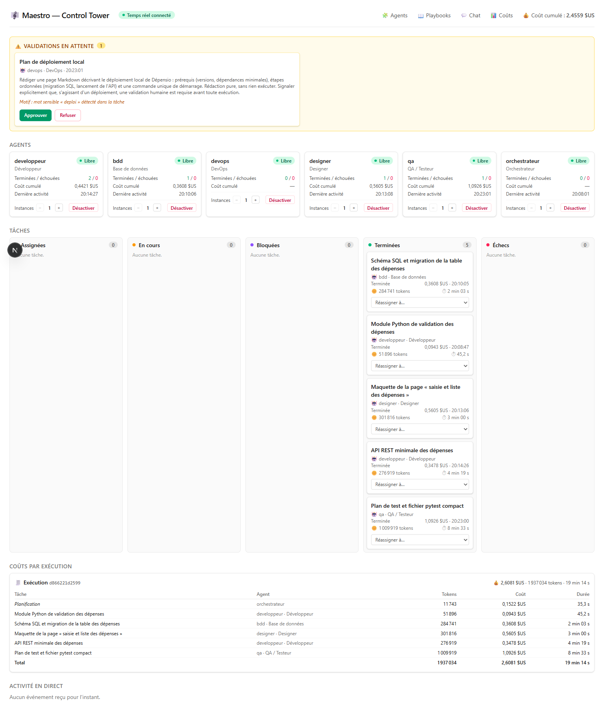
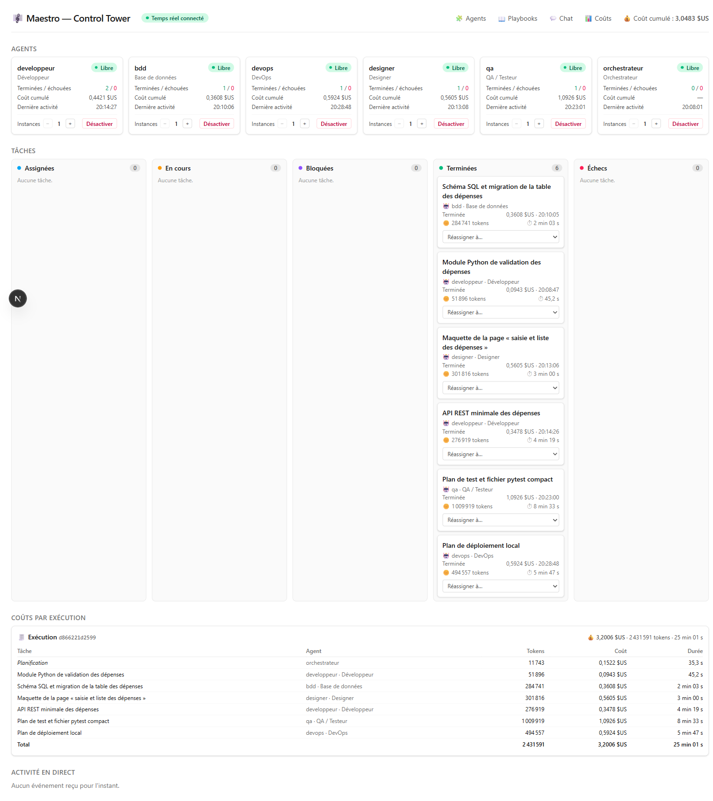
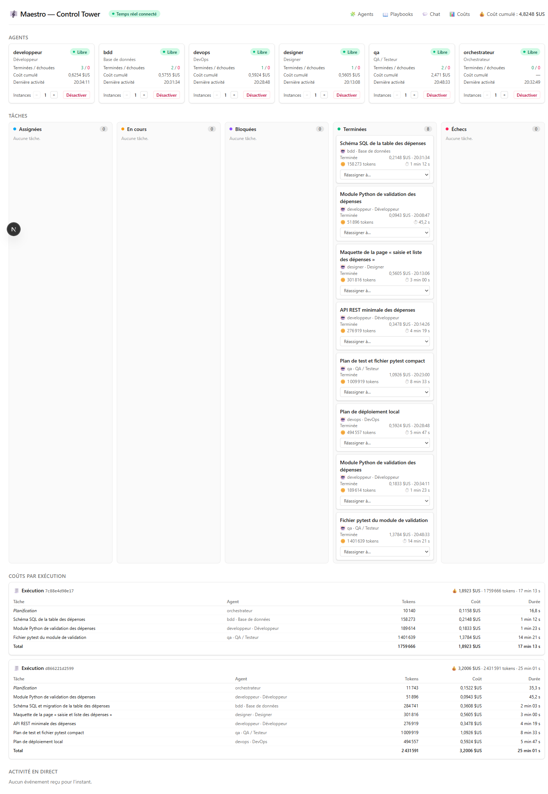

# Démo V2 : fiabilité et durabilité sur pièces — Maestro

**Version :** 0.1
Cette page boucle la **Phase 3** (ticket #112) : elle démontre **sur pièces** les acquis de la
phase — **fiabilité** (relance automatique #91), **durabilité** (reprise sans re-paiement #92),
scalabilité multi-instances (#100) et intégrations MCP (#101) — et consigne le **verdict
go/no-go** du jalon « Fin Phase 3 ».

> **Jalon de fin de Phase 3** : *« Faut-il un framework d'orchestration dédié (LangGraph) ou
> rester sur l'Agent SDK ? »* ([roadmap](./06-roadmap.md), « Jalons de décision ») — tranché
> au §5 sur la base de l'expérience de la phase.

Elle prolonge la [démo V1](./13-demo-v1.md), dont le verdict de fin de Phase 2 était **« GO,
avec une réserve bloquante en tête de Phase 3 »** : aucun run n'y avait atteint **6/6**, quatre
échecs sur six étant des **aléas fournisseur transitoires** qu'un simple *retry* aurait absorbés
([docs/13 §5](./13-demo-v1.md), réserves 1 et 2). Les deux réserves bloquantes de cette liste —
relance automatique et durabilité des runs — sont précisément ce que la démo V2 vérifie ici.

> **Note de numérotation.** Le ticket #112 prévoyait `docs/14` ; ce numéro ayant été pris entre
> temps par le [run fournisseur non-Anthropic](./14-run-fournisseur-non-anthropic.md), cette page
> prend le numéro libre suivant, dans la continuité de la démo V1.

---

## 1. Prérequis et mise en place

Même ossature que la [démo V1](./13-demo-v1.md), **plus Temporal** pour les runs durables :

```bash
# 0. Environnement prêt (SDK + authentification — docs/07 §2.1)
.venv/Scripts/maestro-check-env          # Unix : .venv/bin/maestro-check-env

# 1. Redis + Temporal (infra/docker-compose.yml)
docker compose -f infra/docker-compose.yml up -d redis temporal

# 2. Backend Control Tower (API REST + WebSocket, port 8000)
.venv/Scripts/python.exe -m maestro.controltower.cli     # ou : maestro-api

# 3. UI Control Tower (port 3000)
cd apps/web && npm install && npm run dev
```

Temporal expose son **UI web** sur <http://localhost:8233> (historique des workflows, socle de
la reprise) ; la Control Tower reste sur <http://localhost:3000>. Le *hello-world* durable
`maestro-temporal-demo` vérifie en une commande que le serveur répond avant tout run.

---

## 2. Critère 1 — fiabilité : la relance automatique et le premier run 6/6

**Ce que dit le critère.** *« La démo V1 (« Dépensio ») rejouée avec la relance automatique
atteint 6/6 — ou l'écart résiduel est expliqué sur pièces. »*

### 2.1 Le run 6/6

Le projet « Dépensio » de la démo V1 — **six tâches**, cinq exécutants plus l'orchestrateur, deux
fenêtres de parallélisme, quatre handoffs, une tâche de déploiement sous **validation humaine** —
rejoué **à l'identique** sur l'API réelle (fournisseur Claude, mode abonnement), avec la
**relance automatique armée** (`maestro.engine.retry`, 2 relances par défaut) :

```bash
maestro-run --json --trace --publier --messagerie --validation-ui \
  --parallele 2 --plafond-cout 10 --timeout 900 \
  "Réaliser « Dépensio » … en six tâches COMPACTES …"   # libellé complet : docs/13 §2
```

**Résultat — run `d866221d2599`, 6/6, code de sortie 0.**

| Tâche | Agent | Coût | Tokens | Durée |
|-------|-------|------|--------|-------|
| Planification | orchestrateur | 0,1522 $ | 11 743 | 35 s |
| Module de validation | developpeur | 0,0943 $ | 51 896 | 45 s |
| Schéma SQL + migration | bdd | 0,3608 $ | 284 741 | 2 min 03 s |
| Maquette saisie/liste | designer | 0,5605 $ | 301 816 | 3 min 00 s |
| API REST minimale | developpeur | 0,3478 $ | 276 919 | 4 min 19 s |
| Plan de test + pytest | qa | 1,0926 $ | 1 009 919 | 8 min 33 s |
| Plan de déploiement (validé au clic) | devops | 0,5924 $ | 494 557 | 5 min 47 s |
| **Total** | | **3,2006 $** | **2 431 591** | **25 min 01 s** |

Les **six tâches** aboutissent, la planification comprise : **8 appels modèle**, aucun échec.
C'est le **premier run 6/6** de « Dépensio » — l'objectif que la démo V1 n'avait jamais atteint
(meilleur run 5/6). La tâche de déploiement a déclenché la **validation humaine** en tête d'UI
(motif : *mot sensible « deploi » détecté*) ; **Approuver** au clic a tracé la séquence
`en_attente → approuvée` au journal (`plan-deploiement-local:validation [approuve]`) et relancé
l'exécution — la mécanique human-in-the-loop de bout en bout, depuis un vrai navigateur.

> ⚠ Relevé **à sa date**, et conservé tel quel. Depuis #585 la classification par mots-clés
> n'est plus armée par défaut : le déclencheur nominal est l'**acte** — un outil classé `ask`
> dans la politique de l'agent (chantier #573, [docs/04 §1.4bis](./04-specifications-agents.md)) —
> et le motif nommerait aujourd'hui l'outil appelé, non un mot de la tâche.





### 2.2 La relance, démontrée sur la mécanique

Ce jour-là le fournisseur a été **stable** : aucun aléa transitoire n'est survenu pendant le run
6/6, donc aucune relance n'a eu à se déclencher. La démo V1 avait mesuré ~15 % d'aléas ; leur
**absence** sur ce run explique à elle seule le passage de 5/6 à 6/6, mais elle ne *montre* pas la
relance à l'œuvre. Pour l'exhiber **sur pièces**, on **injecte** l'aléa mesuré en démo V1 (crash
immédiat du sous-processus SDK, 0 $ facturé) sur un exécutant factice — la mécanique est
identique, seul le fournisseur est simulé :

```
appels exécutant : 2 (dont 1 en échec transitoire)

Journal :
  module-validation:debut    en_cours   démarrage de la tâche
  module-validation:relance  relance    échec transitoire (tentative 1/3) : aléa SDK simulé …
  module-validation:debut    en_cours   redémarrage de la tâche (tentative 2/3)
  module-validation          terminee   LIVRABLE produit à la seconde tentative.
```

La tâche **aboutit à la 2ᵉ tentative**, la relance est **tracée** (étape `<tâche>:relance`,
raison portée — donc rediffusée au fil temps réel de la Control Tower), une **nouvelle carte
« En cours »** s'ouvre par tentative (#98), et le **grand livre agrège le coût de toutes les
tentatives**. La classification est couverte par les tests (`tests/test_retry.py`, 13 cas verts) :
un aléa fournisseur est transitoire ; plafond de coût, plafond de tours, capacité absente, serveur
MCP indisponible, time-out d'échéance ferme et refus de validation **ne le sont jamais**.

**Verdict critère 1 : atteint.** Run 6/6 réel sur pièces ; relance automatique démontrée sur sa
mécanique. La réserve n°1 du verdict V1 (« relance automatique d'abord ») est **levée**.

---

## 3. Critère 2 — durabilité : interruption et reprise chiffrées

**Ce que dit le critère.** *« Une interruption/reprise réelle de run durable est démontrée et
chiffrée (0 $ de re-paiement de l'amont), captures et grand livre à l'appui. »*

### 3.1 Le dispositif

Un run **durable** (`--durable`) devient un **workflow Temporal** : un run = un workflow, une
tâche = une activité (`maestro.durable`). Son état — quelles tâches ont abouti — vit **sur le
serveur Temporal**, pas dans le process qui le suit. On lance un run durable de trois tâches
enchaînées (schéma SQL → module de validation → pytest), puis on **tue le process CLI** en pleine
tâche 2 pour simuler une panne :

```bash
maestro-run --json --trace --durable --publier --plafond-cout 5 --timeout 900 "Dépensio — noyau…"
# … puis, tâche 2 en vol : le process CLI est tué (crash simulé) …
maestro-run --reprendre 7c88e4d90e17 --publier      # rattache un process neuf au run
```

### 3.2 À l'interruption

Au moment du crash, la **tâche 1 (schéma) était terminée**, la **tâche 2 (module) en vol**. État
constaté :

- **Côté Temporal** : le workflow `maestro-run-7c88e4d90e17` reste au statut **`RUNNING`** — il a
  survécu à la disparition du process. Le worker embarqué, lui, est mort avec le CLI ; l'activité
  en vol est simplement rendue à la file, en attente d'un worker.
- **Grand livre à l'interruption** (`GET /api/executions/7c88e4d90e17/cout`) : **0,3305 $** payés
  — planification 0,1158 $ + schéma **0,2148 $** —, **1 tâche aboutie**. La tâche 2 n'avait rien
  produit : 0 $.

### 3.3 À la reprise

`--reprendre <run_id>` rattache un process neuf au run par le **seul identifiant** qu'affichent
journal, trace et Control Tower. Il **interroge l'état acquis**, **consigne la reprise** (césure
visible sur la trace et le fil temps réel), puis attend l'issue. L'étape `reprise` dit exactement
ce qui ne sera pas repayé :

```
reprise  terminee  run toujours en vol côté Temporal : le process qui le suivait a été
                   interrompu, l'exécution reprend là où elle en était.
                   → 2 étape(s) déjà acquise(s), non ré-exécutées —
                     usage récupéré : 2 appels modèle · 168 413 tokens · coût 0.3305 $
```

Les **2 étapes acquises** (planification + schéma, 0,3305 $) sont **récupérées de l'historique
Temporal** — aucun nouvel appel modèle. Seule la **tâche 2**, qui n'avait rien produit, repart de
zéro ; puis la tâche 3 s'enchaîne. Le run se termine **3/3, code 0**.

### 3.4 Le chiffrage : 0 $ de re-paiement, sur pièces

Le grand livre **consolidé** rendu après reprise porte **tout** le run, de part et d'autre de
l'interruption :

| Tâche | Agent | Coût | Tokens | Tours |
|-------|-------|------|--------|-------|
| Planification | orchestrateur | 0,1158 $ | 10 140 | 1 |
| Schéma SQL *(avant l'interruption)* | bdd | **0,2148 $** | 158 273 | 12 |
| Module de validation *(après reprise)* | developpeur | 0,1833 $ | 189 614 | 14 |
| Fichier pytest *(après reprise)* | qa | 1,3784 $ | 1 401 639 | 39 |
| **Total** | | **1,8923 $** | **1 759 666** | |



Trois faits **concordants** attestent le 0 $ de re-paiement :

1. **Le schéma est facturé une seule fois — 0,2148 $**, chiffre **identique** au grand livre
   d'avant l'interruption (§3.2). Pas de ligne dupliquée, pas de second appel.
2. **4 appels modèle** pour tout le run : 1 planification + 3 tâches, **chacune une seule fois**.
   Un re-paiement de l'amont aurait produit un 5ᵉ appel.
3. **L'étape `reprise` l'annonce explicitement** : 0,3305 $ « déjà acquis, non ré-exécutés ».

**Verdict critère 2 : atteint.** Interruption et reprise réelles, workflow survivant côté
Temporal, **amont non repayé** — le tout chiffré au cent près. La réserve n°2 du verdict V1
(« durabilité des runs ») est **levée**.

---

## 4. Le reste de la Phase 3, sur pièces

Au-delà des deux critères de fiabilité et durabilité, la Phase 3 a livré :

| Brique (tickets) | État | Preuve |
|------------------|------|--------|
| **Relance automatique** (ENF-06, #91) | Livré | §2.2 ; `tests/test_retry.py` (20 cas) |
| **Workflows durables** Temporal (#92, #94-#97) | Livré | §3 ; `tests/test_durable.py` (7 cas) ; [docs/07 §6.8](./07-guide-de-demarrage.md) |
| **Scalabilité horizontale** multi-instances (#100) | Livré | Plusieurs instances par agent, plafond transverse `--parallele` (exercé au §2, concurrence 2) ; tests fournisseurs factices |
| **Intégrations MCP avancées** (#101 → #104-#106) | Livré | Socle MCP par agent + pilotes Slack ([docs/15](./15-pilote-mcp-slack.md)), tickets GitLab ([docs/16](./16-pilote-mcp-tickets-gitlab.md)), Figma ([docs/20](./20-pilote-mcp-figma.md)) ; config MCP [docs/21](./21-configuration-mcp.md) |
| **Auto-amélioration des playbooks** (#111) | Livré | [docs/22](./22-auto-amelioration-playbooks.md) — analyse post-run → proposition appliquée/rejetée depuis l'UI |
| **Fournisseur non-Anthropic en run réel** (#99) | Livré | [docs/14](./14-run-fournisseur-non-anthropic.md) — bascule 100 % configurative, Langfuse validé |

Les deux **couches de relance composent proprement** : l'aléa **fournisseur** reste du ressort de
la relance applicative (#91), qui vit dans l'activité ; l'aléa **d'infrastructure** (perte du
worker) est du seul ressort de Temporal ; les échecs déterministes (plan invalide) ne sont jamais
rejoués. C'est ce qui rend la reprise du §3 à la fois **automatique** et **sans double
facturation**.

> Les chiffres varient d'une exécution à l'autre (plans générés par un modèle). Les preuves d'une
> exécution donnée sont dans ses artefacts (`rapport.json`, journal, grand livre
> `GET /api/executions/<run_id>/cout`) et, pour un run durable, dans l'historique Temporal.

---

## 5. Verdict go/no-go de fin de Phase 3

La question du jalon : *« Faut-il un framework d'orchestration dédié (LangGraph) ou rester sur
l'Agent SDK ? »*

Le [doc stack](./02-stack-technique.md) posait dès le cadrage la règle : **« Agent SDK natif pour
le MVP → LangGraph si/quand on a besoin de flux d'états durables et rejouables »**, LangGraph étant
retenu pour ses atouts *checkpointing*, reprise, rejouabilité et human-in-the-loop. La Phase 3 a
**atteint ce « si/quand »** — on a bel et bien eu besoin de durabilité et de rejouabilité — mais
l'expérience de la phase montre que **ces besoins ont été couverts autrement**, et mieux alignés
sur la vision du produit :

- **Durabilité, reprise, rejouabilité** : obtenues via **Temporal** (§3), à la couche
  *workflow/infrastructure*. Persistance de l'état, reprise sur panne sans re-paiement, *replay*
  déterministe de l'historique — exactement le rayon du *checkpointing* LangGraph, mais **agnostique
  du fournisseur** et sans imposer un paradigme de graphe d'états à la logique d'agent.
- **Human-in-the-loop** : déjà porté par la **validation humaine** depuis l'UI (#48, §2.1),
  branchée sur les garde-fous — pas besoin de l'emprunter à un framework.
- **Orchestration** (planification, tri topologique, blocage des dépendances, handoffs) : ~570
  lignes de code propre (`maestro.orchestrator` + `maestro.engine`), simples et éprouvées sur deux
  démos de bout en bout. Les flux de Maestro sont des **DAG de tâches**, pas des machines à états
  cycliques à arêtes conditionnelles — le domaine où LangGraph apporte vraiment.
- **Fiabilité** : la relance automatique (#91) est du **code applicatif agnostique** qui compose
  proprement avec la relance d'infrastructure de Temporal (§4) — une pièce qu'aucun framework
  externe n'aurait rendue plus simple.
- **Agnosticisme modèle** (vision O7 : chaque agent, n'importe quel fournisseur) : mieux servi par
  la couche `ModelProvider` maison (#69, [docs/14](./14-run-fournisseur-non-anthropic.md)) que par
  un runtime dont l'écosystème natif est LangChain.

**Verdict : NO-GO sur LangGraph — rester sur l'Agent SDK, adossé à Temporal pour la durabilité.**
Adopter LangGraph aujourd'hui **dupliquerait** ce que Temporal + la boucle maison fournissent
déjà (reprise, replay, human-in-the-loop), ajouterait une dépendance et un paradigme de graphe
d'états dont les flux actuels n'ont pas l'usage, et **frotterait** avec l'objectif d'agnosticisme
fournisseur. Anthropic recommande d'ailleurs de **partir des patterns simples** et de n'introduire
un framework d'orchestration que si la complexité l'exige — elle ne l'exige pas ici.

**Réserve — la porte reste ouverte.** LangGraph redevient une option **le jour où** apparaissent de
vrais **flux d'état complexes** : boucles, arêtes conditionnelles, machines à états où le graphe
*est* la logique (le critère d'origine du [doc stack](./02-stack-technique.md)). Tant que les runs
restent des DAG de tâches supervisés, l'Agent SDK + Temporal est le bon niveau d'outillage. À
garder **modulaire** pour pouvoir changer sans tout refondre — comme prévu dès le cadrage.

**Critère de sortie de la Phase 3** — *fiabilité production et écosystème* — **atteint sur
pièces** : run réel 6/6 avec relance armée (§2), durabilité avec reprise chiffrée sans re-paiement
(§3), scalabilité multi-instances, intégrations MCP et auto-amélioration livrées (§4). **GO pour
la suite.**
