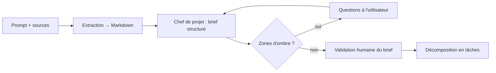

# Projets, ressources locales et poste de travail — cadrage (ticket #215)

**Version :** 1.0
**Date :** 4 août 2026
**Statut :** cadrage **tranché** — les sept décisions D1 à D7 ont été rendues le 2026-08-04 (§8),
conformes aux recommandations ci-dessous ; les **milestones des Phases 7 à 9 sont créés** (#218).

Ce document répond à quatre questions posées le 2026-08-04, **posées comme questions et
traitées comme telles** : pour chacune, l'état réel du code, les options, une
**recommandation argumentée**, et la **décision laissée à l'humain** — rendue depuis (§8).

1. Maestro devrait pouvoir **accéder aux ressources locales** de l'utilisateur pour initier
   un projet.
2. La **finalité est-elle une application de bureau** ?
3. L'utilisateur doit pouvoir décrire son projet **par prompt** ou **à partir d'un document
   téléversé**.
4. La **Control Tower** doit-elle être embarquée en application de bureau, ou rester telle
   quelle ?

C'est le pendant de **#182** ([contrats d'API v2](./05-interface-control-tower.md), §6)
pour le cap d'après : #182 cadrait les Phases 5 et 6 (socle backend / Control Tower v2),
celui-ci cadre ce qui vient **après** — et qui ne relève pas des mêmes couches.

---

## 1. Le constat : Maestro produit des livrables, il ne travaille pas *dans* un projet

**Aucun des quatre points n'est couvert par les 24 documents actuels.** Ce n'est pas un oubli
de rédaction : c'est une **frontière d'architecture** jamais franchie. Le moteur sait
décomposer un objectif, router, exécuter en parallèle, tracer et chiffrer — mais son unité de
sortie est un **fichier en mémoire**, pas un projet sur un disque.

| Ce que la documentation promet | Ce que le code fait aujourd'hui | Conséquence |
|---|---|---|
| Entité **PROJECT**, « souvent rattachée à un dépôt de code » ([docs/03](./03-modele-de-donnees.md)) | Aucune implémentation : ni racine, ni périmètre, ni rattachement d'un run | Une exécution n'appartient à rien |
| « **Branche Git par tâche** » ([docs/01 §7](./01-architecture-technique.md), [docs/02 §7](./02-stack-technique.md)) | `tempfile.mkdtemp()` par tâche, **détruit en sortie** (`maestro.sandbox.workspace`), déclaré « le pendant de » | Aucun dépôt n'est touché, jamais |
| « Connexion à un dépôt de code et à un **système de fichiers de travail** » (EF-28) | Le dépôt visé est celui de *Maestro lui-même*, via l'outillage de développement — pas celui d'un utilisateur | EF-28 n'est satisfaite que par le dogfooding |
| Livrables d'un run | Capturés en mémoire (`ProducedFile`, texte ≤ 1 Mo). Seul `maestro-demo` les **réécrit** quelque part (`sortie-demo/<run>/livrables/`) : un run lancé **depuis la Control Tower n'écrit aucun fichier sur le disque** — le contenu ne vit que dans la projection et le journal | L'utilisateur reçoit **un compte rendu**, pas un projet |
| `POST /api/executions` ([docs/05 §6.1](./05-interface-control-tower.md)) | Un champ `objectif` **texte**, des plafonds, une référence de ticket | Pas de source, pas de projet, pas de dossier |
| Persona « fondateur non technique » ([docs/00 §3.1](./00-cahier-des-charges.md)) | Mise en route = clone Git + `setup.sh` + venv + npm + `.env` | Le persona principal ne peut pas installer le produit |

> **L'ironie utile.** Ce que le produit ne sait pas faire, **son propre outillage de
> développement le fait déjà** : `scripts/git/worktree.sh` monte un répertoire de travail par
> ticket sur un vrai dépôt, `scripts/orchestrate/run.sh` y déroule une session autonome, et
> `.claude/settings.json` borne ce qu'elle a le droit d'y faire. Le patron demandé est donc
> **déjà éprouvé sur ce dépôt** ([docs/10 §9](./10-workflow-git.md) et [§11](./10-workflow-git.md)) —
> il reste à le faire descendre du niveau « outillage de l'équipe » au niveau « produit ».
> C'est une remise à plat de la surface d'API et du modèle de sécurité, pas une invention.

---

## 2. Question 1 — L'accès aux ressources locales

### 2.1 Trois besoins distincts derrière un mot

« Accéder aux ressources locales » recouvre trois choses qui n'ont ni le même risque, ni le
même coût :

| Besoin | Exemple | Écriture ? | Difficulté |
|---|---|---|---|
| **A. Initier** un projet neuf | « Crée-moi un CRM Next.js dans `D:\projets\crm` » | Oui, dans un dossier **vide ou créé** | Faible — rien à ne pas casser |
| **B. Reprendre** un projet existant | « Ajoute l'authentification à ce dépôt » | Oui, dans du code **qui a de la valeur** | Élevée — c'est là que se joue la confiance |
| **C. Lire des références** hors projet | Un cahier des charges, une maquette, un export CSV | Non, lecture seule | Faible — recoupe la question 3 (§3) |

Les trois passent par la même brique — **un projet a une racine sur le disque** — mais A est
livrable seul et sans risque, ce qui en fait le bon premier lot.

### 2.2 Pourquoi c'est la brique n° 1

Sans elle, les autres questions n'ont pas de sujet. Un document téléversé décrit un projet
qui n'existe nulle part ; une application de bureau empaquette un produit qui ne peut rien
poser sur le disque de l'utilisateur. **Elle conditionne aussi la valeur perçue** : aujourd'hui
un run réussi depuis la Control Tower rend du **contenu de fichier dans un journal**, que
l'utilisateur doit recopier à la main dans son projet — le dernier mètre, celui qui compte, est
laissé à l'humain.

Elle transforme aussi une exigence en réalité : **EF-28** (« connexion à un dépôt de code et à
un système de fichiers de travail ») est aujourd'hui satisfaite par le seul dogfooding.

### 2.3 L'entité Projet

Le modèle de données la déclare déjà ([docs/03](./03-modele-de-donnees.md) — PROJECT) ; il
lui manque ce qui la relie au disque :

```jsonc
{
  "id": "prj-7f3a",
  "nom": "Dépensio",
  "racine": "D:/projets/depensio",     // frontière unique et déclarée
  "origine": "existant",               // nouveau | existant
  "vcs": { "type": "git", "branche_base": "main", "distant": "git@…" },  // null si non versionné
  "perimetre": {
    "inclus": ["."],                   // relatif à la racine
    "exclus": [".git", "node_modules", ".env", "**/secrets/**"]
  },
  "cree_le": "2026-08-04T09:00:00+00:00"
}
```

Conséquences en chaîne, toutes petites prises une à une :

- **RUN et TASK portent un `projet_id`** — la Control Tower devient multi-projets (§6) ;
- **le workspace d'une tâche cesse d'être anonyme** : il est dérivé de la racine du projet au
  lieu d'être un `mkdtemp()` sans lien ;
- **les coûts, le Kanban et le journal se filtrent par projet** — ce qu'ils ne savent pas faire.

### 2.4 Le patron d'écriture : jamais dans le répertoire de l'utilisateur en direct

C'est **la** décision structurante de ce chantier. Trois options :

| Option | Principe | Verdict |
|---|---|---|
| **A — Écriture directe** | Les agents écrivent dans `racine/` | **Écartée.** Cinq agents en parallèle dans un même arbre = les collisions que le workspace jetable évitait (EF-14/EF-15), et aucune annulation possible. Un `rm -rf` malheureux touche le vrai projet |
| **B — Répertoire de travail par tâche + fusion** | Chaque tâche travaille dans un **worktree Git** (ou une copie) issu de la racine, sur une branche `maestro/<tâche>` ; la fusion vers la branche de travail est un **geste validé** | **Recommandée** quand le projet est versionné. C'est exactement `scripts/git/worktree.sh`, éprouvé sur ce dépôt |
| **C — Copie + diff proposé** | Copie du périmètre, travail dedans, **diff** présenté à l'humain, appliqué à la validation | **Recommandée** pour un projet **non versionné**. Plus lent (copie), mais c'est le seul filet quand il n'y a pas d'historique pour revenir en arrière |

> **Le fil à ne pas lâcher :** le produit possède déjà le bon garde-fou — la **validation
> humaine** (EF-08, [docs/05 §2.6](./05-interface-control-tower.md)). « Appliquer ces
> modifications dans mon projet » est une **action sensible** au sens exact où le déploiement
> l'est. Le chantier n'invente donc pas de mécanisme de sûreté : il **branche un nouveau type
> d'action sur celui qui existe**, avec le diff en pièce jointe de la demande.

Un corollaire est à assumer : **le premier lot ne rend pas les agents capables de lire tout un
gros dépôt**. Charger un projet entier en contexte n'est ni possible ni souhaitable (coût). La
lecture doit rester **outillée** (l'agent explore avec ses outils, comme le fait Claude Code)
et non « injectée » — c'est déjà le fonctionnement du runtime outillé, il suffit de lui donner
le bon répertoire.

### 2.5 Ce que ça change au modèle de menace

Le contrat du bac à sable dit aujourd'hui, mot pour mot, l'inverse de ce qui est demandé :
« **aucun autre chemin de l'hôte monté** » ([docs/17 §3](./17-isolation-execution.md)). Ouvrir
un projet local **déplace la frontière** ; il faut le consigner plutôt que le subir :

| Nouvelle menace | Vecteur | Contre-mesure proposée |
|---|---|---|
| Destruction du travail de l'utilisateur | agent défaillant, `Bash` mal formé, code produit | Travail hors de la racine (§2.4 B/C) ; application sous validation ; projet versionné = retour arrière natif |
| **Évasion par la racine déclarée** | `../..`, lien symbolique, chemin absolu | Racine **canonicalisée**, refus des chemins hors périmètre ; **liste de racines interdites** (racine du disque, dossier utilisateur nu, `.ssh`, `AppData`, le dépôt Maestro lui-même) |
| Exfiltration du code de l'utilisateur | `git push` vers un distant tiers, appel réseau depuis un `Bash` | Politique d'outils par agent (#110) ; l'égress non filtré reste la limite connue ([docs/19 §5](./19-securite-modele-de-menace.md)) — un filtrage par domaine devient plus urgent qu'avant |
| **Prompt injection par le contenu du projet** | un `README`, un commentaire ou une dépendance qui contient des instructions | Le contenu lu est **une donnée, pas une consigne** : à porter dans les prompts systèmes ; les actions sensibles restent derrière la validation, ce qui borne les dégâts |
| Fuite de secrets du projet | `.env`, clés, tokens présents dans le dépôt de l'utilisateur | Exclusions par défaut au périmètre (`.env`, `**/secrets/**`) ; rédaction existante (#109) élargie aux valeurs lues dans le projet |

**Le poste hôte reste l'actif à protéger** ([docs/19 §1](./19-securite-modele-de-menace.md)) —
il gagne simplement un voisin : **le projet de l'utilisateur**. En mode isolé, le conteneur
gagne un second montage (la racine du projet, ou le worktree de la tâche) ; tout le reste du
contrat de [docs/17 §3](./17-isolation-execution.md) tient inchangé.

---

## 3. Question 3 — De l'intention au brief : prompt, documents, sources

### 3.1 Ce qui manque

`POST /api/executions` ne prend qu'un `objectif` **texte** ; aucune route n'accepte de fichier,
aucun extracteur n'existe, et l'orchestrateur décompose **en un seul coup**, sans jamais poser
de question. Un cahier des charges de 15 pages n'a donc qu'un chemin : le copier-coller.

### 3.2 La forme proposée : des **sources** attachées à l'exécution

Plutôt qu'un champ « fichier » ajouté au forceps, un objectif se compose de **sources**
typées — extension naturelle du contrat déjà figé ([docs/05 §6.1](./05-interface-control-tower.md)) :

```jsonc
{
  "objectif": "Reprends le cahier des charges ci-joint et livre le socle de l'application",
  "projet_id": "prj-7f3a",
  "sources": [
    { "type": "fichier", "nom": "CDC-v2.docx", "taille": 184320 },
    { "type": "dossier", "chemin": "D:/refs/maquettes", "lecture_seule": true },
    { "type": "url",     "valeur": "https://…/spec" }
  ]
}
```

L'extraction reste modeste et éprouvée : `.md`/`.txt` directement, `.docx` et `.pdf` par
convertisseur (python-docx / pypdf, ou un convertisseur unifié type *markitdown*), images
laissées au modèle quand il est multimodal. **Tout est ramené à du Markdown** avant d'entrer
dans le contexte : un seul format à tracer, à masquer et à chiffrer en tokens.

### 3.3 L'étape *brief* : le vrai gain

Le point important n'est pas l'upload — c'est ce qu'on en fait. Aujourd'hui, un objectif flou
produit un plan flou, et l'erreur ne se voit qu'après N exécutions payées. La proposition :



Le **brief structuré** (objectif, périmètre, *hors* périmètre, contraintes, critères
d'acceptation, hypothèses) est présenté à l'humain **avant** toute exécution payante. Deux
bénéfices :

- **économique** — corriger un plan coûte un message ; corriger douze tâches coûte douze
  exécutions ([docs/09](./09-exemple-chiffre.md) donne l'ordre de grandeur : 7 à 12 $ la
  fonctionnalité) ;
- **produit** — c'est le geste qui fait passer l'utilisateur d'« opérateur » à « chef
  d'orchestre », promesse du [cahier des charges §1.2](./00-cahier-des-charges.md).

C'est aussi le point où l'orchestrateur gagne le droit de **poser des questions**, ce que le
moteur ne sait pas faire aujourd'hui (il décompose ou il échoue).

### 3.4 Deux précautions

- **Coût** : un document volumineux entre intégralement dans le contexte. Il faut un plafond
  d'ingestion, un résumé en amont pour les gros documents, et le comptage de ces tokens dans le
  budget du run (ENF-07) — sinon la barre de dépense ment.
- **Sécurité** : un document téléversé est une **entrée non fiable**. Le vecteur de prompt
  injection de [docs/19 §2](./19-securite-modele-de-menace.md) s'élargit d'un cran ; même
  parade que §2.5 — contenu traité comme donnée, actions sensibles derrière validation.

---

## 4. Questions 2 et 4 — Application de bureau ?

### 4.1 Les deux questions n'en font qu'une

La Control Tower **est** l'interface de Maestro. « Maestro devient une application de bureau »
(question 2) et « la Control Tower est embarquée en application de bureau » (question 4)
décrivent donc **le même changement**, vu du produit puis vu de l'interface. Elles sont
traitées ensemble ci-dessous.

### 4.2 Ce que Maestro est aujourd'hui — le point de départ à avoir en tête

Maestro n'est **pas** une application dans le cloud. `scripts/controltower/start.sh` démarre
**deux programmes sur le poste de l'utilisateur** :

- l'API Python (FastAPI) sur `localhost:8000` ;
- l'interface Next.js sur `localhost:3000`, ouverte dans le navigateur.

C'est le modèle de Jupyter, Grafana ou Portainer : **du logiciel local, affiché dans un
navigateur**. Le navigateur est un écran, pas un intermédiaire distant.

### 4.3 Le malentendu à lever avant de trancher

La question 1 (« accéder aux ressources locales ») semble impliquer la question 2 (« donc il
faut une application de bureau »). **Cette implication est fausse**, et le dire change l'ordre
des chantiers :

| | Ce qu'on suppose | La réalité |
|---|---|---|
| Pourquoi Maestro ne touche pas aux fichiers de l'utilisateur | il est « dans le navigateur », il n'en a pas le droit | il a **déjà tous les droits** — c'est un programme Python qui tourne sous la session de l'utilisateur |
| Ce qui manque | une enveloppe de bureau | la **notion de projet** (§2) : rien dans le code ne dit « ce run travaille dans `D:/projets/crm` » |

> **Maestro ne peut pas écrire dans un projet parce que le concept de « projet » n'existe pas
> dans le code — pas parce qu'un navigateur l'en empêche.** Empaqueter une application de
> bureau ne débloquerait rien de ce côté-là.

La seule chose que le navigateur ne sait effectivement pas faire, c'est **choisir un dossier**
(il ne livre jamais de chemin absolu). Ça se résout sans quitter le web : **c'est le backend
qui énumère**, et l'UI affiche un explorateur servi par l'API — la solution de tous les outils
de développement pilotés par navigateur.

### 4.4 À quoi sert le bureau, alors : l'installation et l'usage quotidien

Un seul besoin, mais réel. Pour utiliser Maestro aujourd'hui il faut cloner un dépôt Git,
installer Python et Node, remplir un `.env`, lancer un script et garder un terminal ouvert :
le persona principal — le fondateur qui ne code pas ([docs/00 §3.1](./00-cahier-des-charges.md)) —
**ne peut pas** s'en servir.

| Ce que le bureau apporte vraiment | Aujourd'hui |
|---|---|
| **Installation en un double-clic** pour un profil non technique | clone Git + Python + Node + `.env` — le persona principal est exclu |
| **Cycle de vie du backend** : démarrage, arrêt, ports, redémarrage après plantage | un script shell et deux terminaux à ne pas fermer |
| **Sélecteur de dossier natif**, glisser-déposer de documents | explorateur servi par l'API à écrire (faisable, §4.3) |
| **Mises à jour** applicatives | `git pull` |
| Notifications système, ouverture dans l'éditeur/l'explorateur | absent |

Concrètement, une application Tauri est **une fenêtre native qui affiche le site web local** et
démarre le backend en arrière-plan : la même interface, dans une fenêtre au lieu d'un onglet.

### 4.5 Les options

| Option | Ce que c'est | Coût | Verdict |
|---|---|---|---|
| **0 — Rester tel quel** | Web local lancé par script | nul | **Insuffisant** à terme : ferme le produit à son persona principal |
| **1 — Lanceur + installeur** | Un exécutable qui installe les dépendances, démarre l'API et le front, ouvre le navigateur, s'arrête proprement | **faible** | **Recommandé en premier.** ~80 % du bénéfice ressenti pour ~10 % du coût |
| **2 — Enveloppe Tauri** | Fenêtre native (WebView système) servant le front existant, backend Python en *sidecar* | moyen | **Recommandé ensuite.** Binaire léger, permissions de système de fichiers déclaratives, bon voisinage avec le modèle de sécurité |
| **3 — Enveloppe Electron** | Idem, moteur Chromium embarqué | moyen-élevé | **Écarté sauf besoin précis** : ~150 Mo contre ~10, sans avantage ici — l'UI n'a besoin d'aucune API exotique |
| **4 — Réécriture native** | Refonte de l'UI hors web | élevé | **Écarté.** Jetterait la Phase 4 et la Phase 6 |

### 4.6 Le coût caché : ce n'est pas l'UI, c'est le backend Python

Empaqueter Next.js est un problème résolu. Empaqueter **Python + le Claude Agent SDK + le CLI
`claude` + Docker (mode isolé)** ne l'est pas :

- il faut un runtime Python embarqué (PyInstaller ou équivalent) et vérifier que le SDK, qui
  lance le **CLI Claude Code en sous-processus**, survit au gel ;
- le **mode isolé** ([docs/17](./17-isolation-execution.md)) suppose Docker sur le poste — une
  application « double-clic » ne peut pas l'exiger. Corollaire à assumer : **en distribution
  bureau, le défaut est le mode non isolé** (déjà le défaut aujourd'hui), et l'isolation
  devient une option pour postes équipés. Le vrai filet du mode bureau, c'est le **périmètre du
  projet** (§2.5), pas le conteneur ;
- les **mises à jour** deviennent un sujet à part entière (front, backend, dépendances Python,
  version du CLI).

C'est ce coût — pas la fenêtre — qui justifie de commencer par l'option 1.

### 4.7 Recommandation : **une enveloppe, pas une variante**

> **Un seul front, un seul backend, deux modes de distribution.** La Control Tower reste
> l'application web qu'elle est (rien de la Phase 4 ni de la Phase 6 n'est jeté) ; le bureau
> l'**embarque** au lieu de la remplacer.

Deux raisons de ne pas basculer « tout bureau » :

1. **Le mode serveur reste un cas d'usage de premier ordre** — plusieurs personnes qui
   supervisent la même équipe d'agents, c'est la promesse de la Control Tower et le persona
   « tech lead » de [docs/00 §3.1](./00-cahier-des-charges.md). Une application de bureau seule
   le tuerait ;
2. **Le mode de distribution change les défauts, pas les fonctions** — persistance (SQLite
   local *vs* PostgreSQL serveur), authentification (jeton local *vs* comptes), isolation
   (option *vs* obligatoire). Une seule frontière à tenir : ces choix doivent rester des
   **réglages**, jamais des embranchements de code.

### 4.8 L'ordre compte

**Ne pas empaqueter une cible mouvante.** Le bureau vient **après** le projet local (§2) et
l'ingestion (§3) : empaqueter aujourd'hui livrerait une application installable qui ne sait
toujours ni ouvrir un dossier ni lire un document — et il faudrait tout ré-empaqueter juste
après.

---

## 5. Répercussion dans les documents existants

| Document | Ce qui a été ajouté par ce cadrage |
|---|---|
| [00 — Cahier des charges](./00-cahier-des-charges.md) | Cas d'usage 8/9 ; exigences **EF-35 à EF-42** (projet local, sources, brief, distribution) ; **ENF-12** (installation) ; risques |
| [01 — Architecture](./01-architecture-technique.md) | L'espace de travail d'une tâche est dérivé d'un **projet**, pas d'un `mkdtemp()` |
| [02 — Stack](./02-stack-technique.md) | Extraction de documents, empaquetage de bureau (Tauri/Electron/lanceur), SQLite *vs* PostgreSQL selon le mode |
| [03 — Modèle de données](./03-modele-de-donnees.md) | PROJECT enrichie (racine, périmètre, vcs), SOURCE ajoutée, `projet_id` sur TASK/RUN |
| [05 — Control Tower](./05-interface-control-tower.md) | Écran **Projets**, composition d'un objectif avec sources, validation du **brief**, application d'un diff |
| [06 — Roadmap](./06-roadmap.md) | **Phases 7 à 9** planifiées avec leurs fenêtres (§7 ci-dessous), milestones créés par #218 ; Phase 10 à confirmer |
| [17 — Isolation](./17-isolation-execution.md) | Le contrat du conteneur gagnera un **second montage** (le projet) |
| [19 — Sécurité](./19-securite-modele-de-menace.md) | Le **projet de l'utilisateur** devient un actif ; menaces de §2.5 |

---

## 6. Au-delà des quatre points : ce qui manquera encore

Recensé en analysant le code, à arbitrer avec le reste :

1. **Continuité — un projet est une suite de runs.** Le moteur pense en « run » isolé. Un vrai
   projet enchaîne des dizaines d'exécutions sur le même dossier, et rien ne relie la
   quinzième à la première. Sans ça, l'utilisateur ré-explique son projet à chaque fois.
   *(La mémoire long terme — `MEMORY_CHUNK`/pgvector de [docs/03](./03-modele-de-donnees.md) —
   n'existe qu'en documentation : `pgvector`, `embedding` et `memory_chunk` sont introuvables
   dans le code.)*
2. **Persistance.** Aucune base : l'état vit en fichiers (`core/*`) et Redis, et un run ne
   survit pas au redémarrage de l'API (assumé dans `executions.py`). Recommandation :
   **SQLite en local, PostgreSQL en serveur**, derrière une même couche d'accès — pas deux
   implémentations.
3. **Authentification.** L'API n'en a aucune (CORS `*`), déjà relevé par #182 comme prérequis
   des paramètres en écriture. Devient bloquant dès qu'un projet local est exposé : une page
   web tierce ne doit pas pouvoir lancer un run sur le disque de l'utilisateur.
4. **Boucle de vérification.** L'agent QA produit des tests ; personne ne garantit qu'ils sont
   **exécutés** dans le projet. Un projet local rend cela possible (et attendu) : exécuter,
   lire le résultat, corriger — c'est ce qui sépare « du code plausible » de « du code qui
   marche ».
5. **Premier lancement.** Aujourd'hui : `.env` à remplir à la main. Il faudra un parcours
   d'accueil (fournisseur, clé ou abonnement, premier projet) — sans quoi l'installeur du §4
   livre un produit qui démarre sur un formulaire vide.
6. **Modèles de projet.** « Initier un projet » suppose des points de départ (application web,
   API, script) : c'est du **playbook**, mécanisme qui existe déjà ([docs/22](./22-auto-amelioration-playbooks.md)),
   à ne surtout pas réimplémenter en dur.

---

## 7. Phases 7 à 9 — planifiées (milestones créés)

Les Phases 5 et 6 restent le cap immédiat et **ne sont pas modifiées** par ce cadrage (D7). La
suite, en quatre phases dont l'ordre est dicté par les dépendances réelles — les trois premières
existent désormais comme **milestones GitLab** (#218), la quatrième reste à confirmer :

| Phase | But | Contenu | Dépend de | Fenêtre |
|---|---|---|---|---|
| **7 — Projets & espace de travail réel** | Maestro travaille dans un vrai dossier | Entité Projet (racine, périmètre, vcs) ; workspace dérivé du projet ; **branche/worktree par tâche** ; application des livrables **sous validation** ; explorateur de dossiers servi par l'API ; extension du contrat d'isolation et du modèle de menace | Phase 5 (lancement de run par l'API, livré #185) | 2027-03-18 → 2027-04-28 |
| **8 — De l'intention au brief** | Un objectif se compose, se discute, se valide | Sources typées (fichier/dossier/URL) ; extraction docx/pdf → Markdown ; **brief structuré** + questions de clarification ; validation avant décomposition ; plafond d'ingestion | Phase 7 (un brief vise un projet) | 2027-04-29 → 2027-06-09 |
| **9 — Poste de travail : distribution** | Le produit s'installe | Mode local durci (jeton d'API local, SQLite) ; **lanceur/installeur** ; parcours de premier lancement ; puis **enveloppe Tauri** + mises à jour | Phases 7 et 8 (§4.8) | 2027-06-10 → 2027-07-21 |
| **10 — Continuité & multi-projet** *(à confirmer — pas de milestone)* | Un projet vit dans la durée | Historique et coûts par projet ; mémoire long terme ; itération sur un livrable existant ; boucle de vérification (tests exécutés) ; multi-utilisateur en mode serveur | Phase 7 | — |

Les fenêtres suivent la **cadence historique** du projet (~6 semaines par phase, comme les Phases
4 et 5) et s'enchaînent après l'échéance de la Phase 6 (2027-03-17). Elles sont des **repères de
planification**, pas des engagements : une échéance de milestone se déplace sans rien casser.

**Parallélisation possible** : la Phase 8 est majoritairement backend + un écran ; la Phase 9
commence par de l'empaquetage. Elles peuvent se recouvrir partiellement une fois la Phase 7
livrée — le patron « deux voies par couche » de #182 s'applique à nouveau. Les fenêtres ci-dessus
sont séquentielles ; les avancer est une décision de planification, pas une révision du cadrage.

**Pourquoi la Phase 10 n'a pas de milestone** : son contenu (continuité, mémoire long terme,
itération sur un livrable existant) dépend de ce que la Phase 7 aura appris sur la vie réelle
d'un projet — un milestone ouvert maintenant fixerait un périmètre qu'on ne connaît pas encore.
Elle se confirmera à la livraison de la Phase 7.

**Le découpage en tickets suit le patron de #182**, qui avait créé les milestones des Phases 5 et
6 **et semé aussitôt leur premier lot** (#183 contrats d'API, #184 avec #185–#188, #189 avec
#190–#193), en ne différant que les six « chantiers restant à ouvrir », créés au moment de les
démarrer. Appliqué ici :

- **Phase 7 — découpée** : parent de suivi **#219** et huit lots — **#221** (socle : entité Projet
  et validation de la racine), puis **#222** (`projet_id` sur la tâche et le run), **#223** (API
  des projets et explorateur de dossiers), **#224** (espace de travail dérivé : worktree ou
  copie), **#225** (écran Projets) et **#226** (second montage du conteneur), tous cinq
  **parallélisables** une fois le socle livré, enfin **#227** (application des livrables sous
  validation humaine) et **#220** (tests + doc).
- **Phases 8 et 9 — pas de tickets**, et c'est délibéré : leur contenu dépend de ce que la Phase 7
  aura produit. Un brief vise un projet (§3.2) et on n'empaquette pas une cible mouvante (§4.8) ;
  les découper maintenant reviendrait à figer des lots contre une couche qui n'existe pas encore.

---

## 8. Décisions rendues (2026-08-04)

Les sept décisions ont été tranchées le **2026-08-04**, **conformes aux recommandations** de ce
cadrage (#218). Chacune est désormais un acquis, pas une option ouverte :

| # | Décision | Verdict | Ce qu'elle engage |
|---|---|---|---|
| **D1** | Maestro travaille-t-il sur les projets locaux de l'utilisateur ? | **Oui** — c'est la brique manquante n° 1 (§2.2) | Ouvre la Phase 7 ; élargit le modèle de menace (§2.5) |
| **D2** | Patron d'écriture : direct, worktree, ou copie + diff ? | **Worktree/branche par tâche** si versionné, **copie + diff** sinon ; application = **action sensible** (§2.4) | Réutilise la validation humaine existante ; interdit l'écriture directe |
| **D3** | Le bureau est-il la finalité ? | **Non — c'est une enveloppe, pas une variante** (§4.7). Le mode web/serveur reste de premier ordre | Un seul front, deux modes de distribution ; SQLite/Postgres, jeton local/comptes comme **réglages** |
| **D4** | Quel empaquetage ? | **Lanceur/installeur d'abord**, **Tauri ensuite** ; Electron écarté (§4.5) | Le mode isolé Docker devient **optionnel** en distribution bureau (§4.6) |
| **D5** | L'ingestion de documents passe-t-elle par un **brief validé** ? | **Oui** — c'est le point de contrôle le plus rentable (§3.3) | Ajoute une étape avant décomposition et le droit, pour l'orchestrateur, de poser des questions |
| **D6** | Ordre des phases | **7 → 8 → 9** ; la **10 reste à confirmer** et n'a pas de milestone (§7) | Évite d'empaqueter une cible mouvante (§4.8) |
| **D7** | Les Phases 5 et 6 changent-elles de périmètre ? | **Non** — elles vont au bout telles quelles | Ce cadrage ne perturbe pas le travail en cours ; leurs milestones sont inchangés |

**Ce que ces décisions ont produit** (#218) : les milestones **Phase 7**, **Phase 8** et **Phase
9** existent côté GitLab avec leurs fenêtres (§7), et les exigences dérivées de ce cadrage —
EF-35 à EF-42, ENF-12, ENF-13, l'entité `PROJECT` enrichie, `SOURCE`, l'écran Projets, le second
montage du conteneur, le projet de l'utilisateur comme actif — ne sont plus marquées « proposé,
décision en attente » dans [00](./00-cahier-des-charges.md), [02](./02-stack-technique.md),
[03](./03-modele-de-donnees.md), [05](./05-interface-control-tower.md),
[17](./17-isolation-execution.md) et [19](./19-securite-modele-de-menace.md) : elles sont
**retenues**. Ce qui reste ouvert est nommé comme tel — la Phase 10, et le découpage en tickets
de chaque phase.
