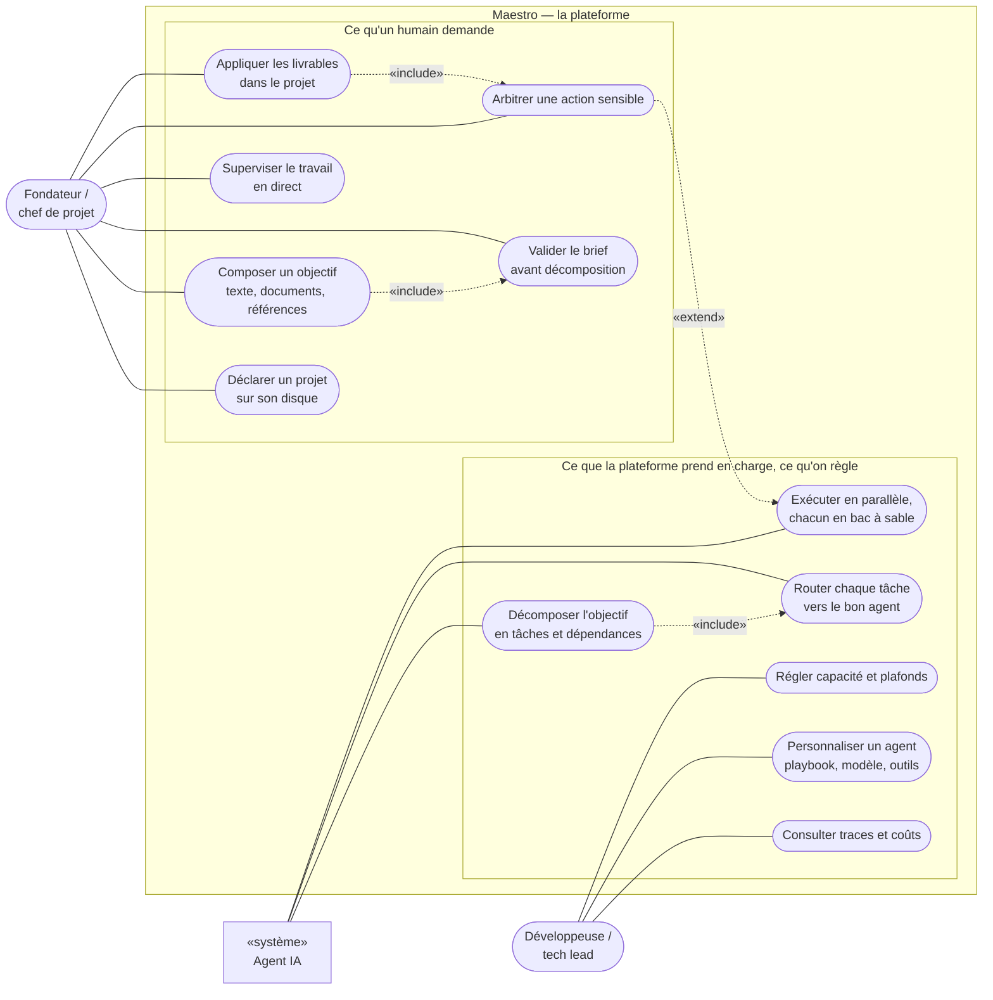
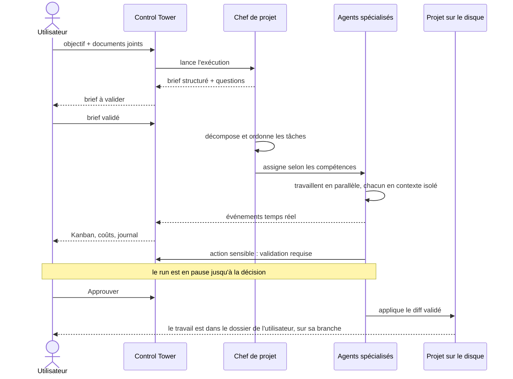
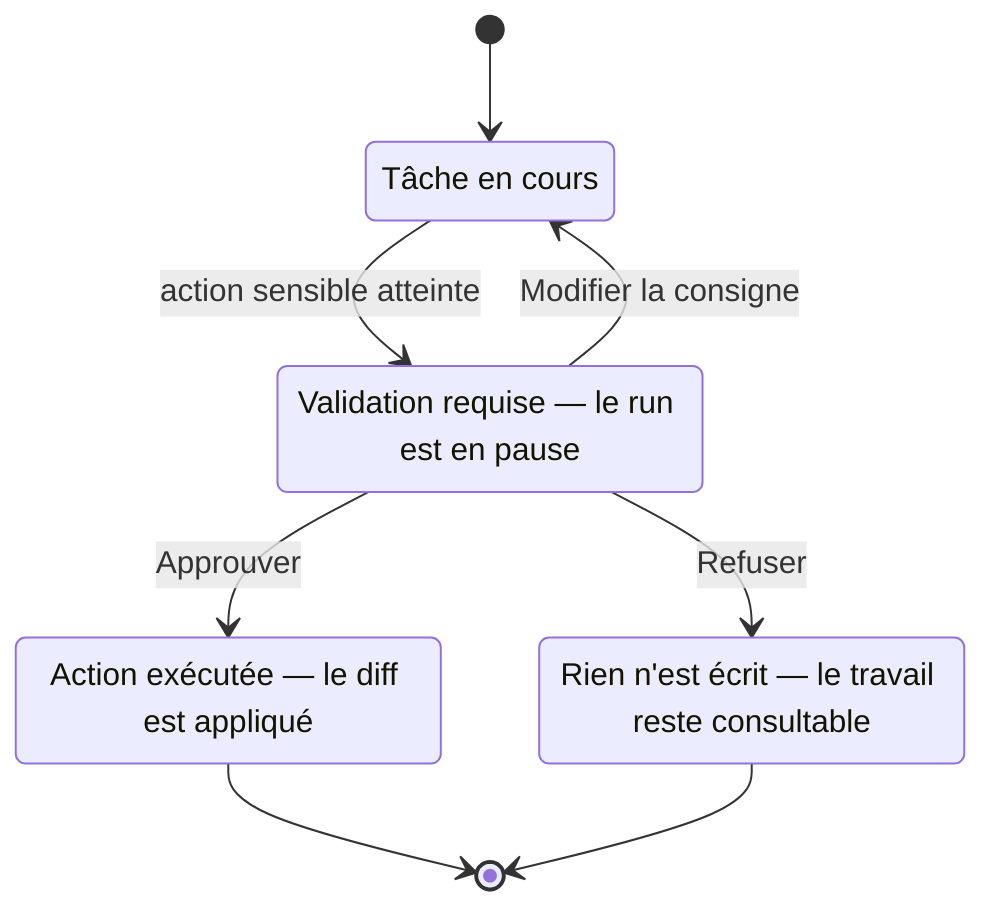
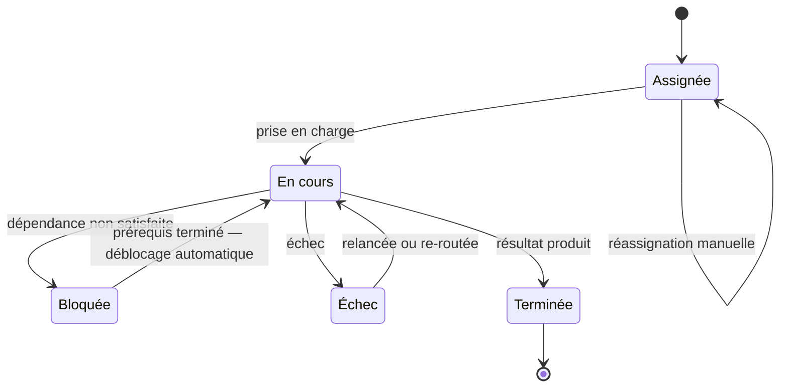
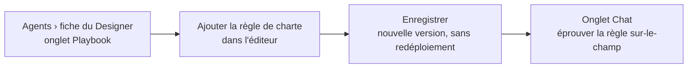

# Cas d'usage et vues fonctionnelles — Maestro

**Version :** 1.0
**Date :** 10 août 2026 *(ticket #324)*
**Statut :** vue dérivée — **aucune règle nouvelle**

Ce document ne décide rien. Il **rend en schémas** ce que les autres décrivent en prose, et c'est
son seul apport : la matière était complète mais dispersée entre six documents, si bien que la
question « qui déclenche quoi, et où l'humain garde-t-il la main ? » demandait de reconstruire
mentalement une carte que personne n'avait dessinée.

| Ce qui vient d'ailleurs | Source qui fait foi |
| --- | --- |
| Personas, cas d'usage, exigences `EF-*` / `ENF-*` | [docs/00 §3–5](./00-cahier-des-charges.md) |
| Orchestrateur-workers, routage, coordination inter-agents | [docs/01 §3–5](./01-architecture-technique.md) |
| Catalogue des agents, playbooks, MCP par agent | [docs/04](./04-specifications-agents.md) |
| Écrans, parcours A / B / C, contrats d'API | [docs/05 §2–3, §6](./05-interface-control-tower.md) |
| Phases, milestones, état de livraison | [docs/06](./06-roadmap.md) |
| Projet local, sources et brief, distribution | [docs/24](./24-projets-locaux-et-poste-de-travail.md) |

**Corollaire à tenir** : une évolution du produit se décide **dans ces documents-là**, et ce
document-ci suit. S'il les contredit un jour, c'est lui qui a tort — c'est la même règle que celle
qui lie [`CONTRIBUTING.md`](../CONTRIBUTING.md) à [docs/10](./10-workflow-git.md).

---

## 1. Les acteurs

Maestro a un acteur de plus que la plupart des outils : **l'agent lui-même**. Ce n'est pas une
coquetterie de modélisation — un rouage interne ne *demande* rien, alors qu'un agent s'arrête et
réclame un arbitrage (EF-08). Le distinguer est ce qui rend lisibles tous les schémas qui suivent :
on voit alors ce qu'un humain **déclenche** et ce qu'il se contente de **trancher**.

| Acteur | Nature | Ce qu'il fait dans le système |
| --- | --- | --- |
| **Fondateur / chef de projet** | humain, principal | Déclare le projet, compose l'objectif, suit le travail et son coût, tranche les actions sensibles. Il dirige et arbitre ; il n'écrit pas le code. |
| **Développeuse / tech lead** | humain, secondaire | Branche Maestro sur un dépôt existant, règle playbooks, modèles, outils et capacité, remonte les traces d'exécution. |
| **Agent IA** | non humain | Six rôles par défaut ([docs/04 §2](./04-specifications-agents.md)). Mène une tâche de bout en bout, sollicite un pair, **et demande une validation** quand il atteint une action sensible. |
| **Systèmes externes** | non humain, support | Forge Git, serveurs MCP, fournisseurs de modèles. Ils n'apparaissent qu'au §4, où leur place **dans le temps** se voit — c'est là qu'elle a un sens. |

---

## 2. Diagramme de cas d'usage

La colonne de gauche est ce qu'un humain **demande** ; celle de droite, ce que la plateforme
**prend en charge** une fois lancée, ou ce qu'on vient y **régler**. La frontière du système sépare
qui déclenche de qui exécute.

Les traits pleins sont des **associations** (l'acteur participe au cas d'usage) ; les traits
pointillés, les relations `«include»` (obligatoire) et `«extend»` (conditionnelle). Les quatre qui
figurent ici sont des **règles produit**, pas de la décoration :

- **Composer un objectif `«include»` valider le brief** — la décomposition coûte cher, elle ne part
  jamais sans accord. C'est le point de contrôle le plus rentable du produit : corriger un plan
  coûte un message, corriger douze tâches coûte douze exécutions
  ([docs/05 §2.7](./05-interface-control-tower.md)).
- **Appliquer les livrables `«include»` arbitrer** — rien n'atteint le dossier de l'utilisateur sans
  validation, diff à l'appui (EF-37).
- **Décomposer `«include»` router** — une tâche créée est une tâche assignée ; il n'existe pas
  d'état « en attente d'un humain qui l'attribue » (EF-09).
- **Arbitrer `«extend»` exécuter** — l'interruption est **conditionnelle** : elle ne se produit qu'à
  la rencontre d'une action classée sensible, et c'est ce qui distingue « autonomie sous
  supervision » de « validation à chaque pas ».

Les cas d'usage 8 et 9 de [docs/00 §3.2](./00-cahier-des-charges.md) — *initier un projet sur son
poste*, *partir d'un document* — sont ici UC1 et UC2/UC3, retenus par les décisions D1 et D5 du
2026-08-04.

---

## 3. Carte fonctionnelle

Les mêmes cas d'usage, regroupés par ce qu'ils servent, avec les exigences qui les portent. Les six
domaines se lisent dans l'ordre d'un travail : on cadre, on répartit, ça s'exécute, on garde la
main, on comprend, on règle.

### 3.1 Cadrer le travail — « où travaille-t-on, et sur quoi ? »

- Déclarer un projet : une racine sur le disque — dossier neuf ou dépôt existant — avec son
  périmètre d'inclusion/exclusion.
- Choisir le dossier par l'explorateur servi par l'API, le sélecteur natif du poste, ou un chemin
  saisi ([docs/05 §2.7.2](./05-interface-control-tower.md)).
- Se voir **refuser** une racine hors périmètre autorisé, avec son motif — un refus est une réponse.
- Joindre des **sources** : fichiers `.md` / `.txt` / `.docx` / `.pdf`, dossier de références en
  lecture seule, URL.
- Valider un **brief structuré** — objectif, périmètre, hors-périmètre, contraintes, critères
  d'acceptation, hypothèses — avant toute décomposition.

`EF-35` · `EF-38` · `EF-39` · `EF-40` · `ENF-13`

### 3.2 Décomposer et répartir — « qui fait quoi, et dans quel ordre ? »

- Découper un objectif en tâches précises (titre, description, compétences requises, format de
  sortie), avec leurs **dépendances**.
- Router chaque tâche vers l'agent le plus pertinent : correspondance de capacités déclarées, puis
  charge, avec un classifieur léger pour les cas ambigus
  ([docs/01 §3.2](./01-architecture-technique.md)).
- Réassigner à la main depuis la carte ou le détail d'une tâche.
- Débloquer **automatiquement** ce dont les prérequis viennent de se terminer — c'est le tableau
  noir partagé qui le porte, pas un ordonnanceur séparé.

`EF-01` · `EF-04` · `EF-09` · `EF-11` · `EF-12` · `EF-31`

### 3.3 Exécuter en autonomie — « le travail avance sans moi »

- Mener une tâche de bout en bout — analyse, action, résultat — sans pilotage pas à pas.
- Utiliser des outils : lecture/écriture de fichiers, exécution de code, appels d'API via MCP.
- Travailler en parallèle, chacun dans un **contexte isolé** et un bac à sable.
- Passer le relais à un pair, poser une question, publier un résultat — tracé, et borné par un
  plafond de tours ([docs/04 §5](./04-specifications-agents.md)).
- **N'écrire jamais dans la racine du projet** : branche/worktree si le projet est versionné, copie
  sinon.

`EF-05` · `EF-06` · `EF-13` · `EF-14` · `EF-32` · `EF-36` · `ENF-03`

### 3.4 Garder la main — « rien d'irréversible sans moi »

- Suspendre le run sur une action sensible et **attendre** la décision.
- Approuver, refuser, ou **modifier la consigne** — diff, contexte et coût sous les yeux.
- Sur refus, rien n'est écrit et le travail reste consultable.
- Poser des plafonds de dépense et une liste d'actions interdites.

`EF-08` · `EF-37` · `ENF-04` · `ENF-13`

### 3.5 Superviser et comprendre — « où en est-on, et qu'est-ce que ça coûte ? »

- Suivre un Kanban temps réel et ouvrir le détail d'une tâche **sur place**, sans quitter la vue du
  run.
- Relire le journal d'activité, filtrable par type, agent et tâche, et n'être notifié que du
  notable.
- Remonter la trace d'une exécution : étapes, outils appelés, entrées/sorties, tokens, coût, durée.
- Lire les coûts par agent, par tâche et par exécution — grand livre à l'appui.
- Ouvrir une conversation avec un agent pour comprendre un choix ou corriger le tir.

`EF-17` · `EF-19` · `EF-22` · `EF-23` · `ENF-05` · `ENF-07`

### 3.6 Configurer et gouverner — « l'équipe finit par me ressembler »

- Personnaliser un agent : nom, rôle, prompt système, outils, playbook, modèle.
- **Versionner** un playbook, revenir en arrière, appliquer sans redéploiement.
- Accepter ou rejeter une **proposition d'auto-amélioration** née des échecs d'un run
  ([docs/22](./22-auto-amelioration-playbooks.md)).
- Créer un agent, l'activer, l'éteindre, ajuster son nombre d'instances.
- Choisir **fournisseur et modèle par agent** — Claude ou non — et brancher ses serveurs MCP avec
  leurs permissions.

`EF-03` · `EF-18` · `EF-21` · `EF-25` · `EF-26` · `EF-27` · `EF-29` · `ENF-11`

---

## 4. Parcours A — de l'idée au livrable

Le parcours nominal, celui dont tous les autres sont des variantes. Il détaille les cinq étapes de
[docs/05 §3](./05-interface-control-tower.md) en nommant **qui parle à qui**.

Deux moments seulement demandent une décision humaine : la **validation du brief**, avant que la
décomposition ne coûte quoi que ce soit, et l'**arbitrage d'une action sensible**, avant que quelque
chose n'atteigne le disque. Entre les deux, l'utilisateur *regarde* — il n'est pas sollicité.

**La note n'est pas un commentaire de confort** : l'agent n'attend pas poliment son tour, il est
**suspendu** (EF-08). C'est ce qui rend l'arbitrage non contournable plutôt que consultatif — une
demande de validation qu'on pourrait ignorer serait un avertissement, pas un garde-fou.

**Où sont les systèmes externes** : sur la ligne de vie des agents spécialisés, entre l'assignation
et les premiers événements. Un agent lit et écrit dans la forge Git, appelle ses serveurs MCP et son
fournisseur de modèle **pendant qu'il travaille**, sans que l'utilisateur ait à s'en occuper — les
faire figurer comme des acteurs du §2 aurait suggéré le contraire.

---

## 5. Le point de contrôle humain

Le mécanisme qui distingue Maestro d'un agent lâché sur un dépôt.

Trois issues, dont **une seule écrit quelque chose**. La troisième mérite d'être lue pour
elle-même : *modifier la consigne* n'est ni un oui ni un non, c'est le cas où l'humain a vu ce que
l'agent n'avait pas compris et le renvoie travailler avec un cadre corrigé.

**Le refus n'est pas un échec.** La branche de tâche n'est jamais supprimée et la copie reste où
elle est : on peut relire ce que l'agent proposait avant de trancher autrement. C'est ce qui rend
le « non » bon marché — et un « non » bon marché est ce qui rend l'autonomie acceptable.

---

## 6. Cycle de vie d'une tâche

Les états que l'utilisateur voit défiler dans les colonnes du Kanban — ceux de la machine à états du
moteur, et pas une nomenclature d'écran.

Deux états ne sont **pas des impasses**, et c'est le point du schéma : une tâche *bloquée* repart
seule quand ses prérequis se terminent (EF-31), une tâche en *échec* est relancée ou confiée à un
autre agent (ENF-06). Une file où « bloqué » veut dire « attend un humain » n'a pas les mêmes
propriétés.

**Corollaire d'écran** : puisque le statut est posé par le moteur, on ne le change pas en déplaçant
une carte — le glisser-déposer entre colonnes reste une cible non livrée
([docs/05 §2.2](./05-interface-control-tower.md)). La seule action directe depuis une carte est la
**réassignation d'agent** (EF-11 / EF-20), et c'est bien elle qui figure en boucle sur *Assignée*.

---

## 7. Parcours B et C

Deux parcours courts, mais qui portent chacun une promesse du produit.

**Parcours B — personnaliser un agent** (EF-24 à EF-26) : la règle ajoutée s'applique à la tâche
suivante, **sans redéploiement**, et l'historique des versions permet de revenir en arrière.

**Parcours C — absorber un pic de charge** (EF-21, EF-16) : la capacité se règle dans **Paramètres**
et non depuis la fiche de l'agent — le tableau de bord en donne le compte et y renvoie.

Le parcours B se termine dans l'**onglet Chat de la même fiche** : c'est l'un des gains de la
navigation v2 ([docs/05 §1](./05-interface-control-tower.md)) — éprouver la règle qu'on vient
d'écrire ne demande plus de changer d'écran.

---

## 8. Écrans ↔ intentions

Une entrée de menu par intention. Le **projet actif** n'est pas un écran mais **le cadre de tous les
autres** : on entre dans la console par un projet, et tout ce qu'on y lit — tâches, coûts,
validations, journal, flux temps réel — s'y rapporte
([docs/05 §2.0](./05-interface-control-tower.md)).

| Écran | Ce qu'on vient y faire | Cas d'usage (§2) |
| --- | --- | --- |
| Porte d'entrée · sélecteur de projet | Choisir le projet sur lequel on travaille, ou en déclarer un ; le sélecteur reste ensuite dans la barre supérieure | UC1 |
| Tableau de bord | « Où en est-on, et qu'est-ce qui m'attend ? » — validations en tête, quatre indicateurs, Kanban, aperçu d'activité | UC4, UC5 |
| Kanban des tâches | Suivre les colonnes de la machine à états, ouvrir le détail d'une tâche sur place, réassigner un agent | UC4 |
| Agents | Une fiche par agent, quatre onglets — Profil, Playbook, MCP & permissions, Chat. Le parc est une ressource du **poste**, partagée entre projets | UC11 |
| Validations | Trancher une action sensible : contexte, diff, approuver / refuser / modifier la consigne | UC5, UC6 |
| Coûts & analytics | Comprendre la dépense : agrégats sur une période, grand livre par exécution, débit et taux de réussite | UC10 |
| Journal | Relire l'activité en plein format : filtres par type, agent, tâche, recherche texte, « notable seulement » | UC4 |
| Chat global | Parler à l'**outil** plutôt qu'à un agent — la seule vue volontairement transverse au projet actif | — |
| Paramètres | Agents & capacité (activer, éteindre, instances), apparence, notifications, MCP, plafonds | UC12 |

---

## 9. Ce qui est livré, ce qui vient

Les schémas ci-dessus décrivent le **produit cible**. Ce tableau dit où en est chaque cas d'usage —
utile pour savoir ce qui se montre en démonstration et ce qui reste une intention cadrée. Il se
relit contre [docs/06](./06-roadmap.md), qui fait foi.

| Cas d'usage | État | Où |
| --- | --- | --- |
| Déclarer un projet sur son disque, choisir la racine n'importe où | **livré** | Phase 7 (#221–#225, #278) |
| Le projet actif comme cadre de tous les écrans | **livré** | Control Tower v3 — socle (#277–#282) |
| Lancer, suivre et annuler une exécution depuis l'interface | **livré** | Phase 5 (#185, [docs/05 §6.1](./05-interface-control-tower.md)) |
| Superviser en direct : Kanban, détail de tâche, journal, notifications | **livré** | Phases 4 et 6, puis v3 (#248, #249, #250, #251) |
| Arbitrer une action sensible ; appliquer les livrables sous validation | **livré** | MVP, puis Phase 7 (#227) |
| Consulter les coûts et le grand livre par exécution | **livré** | V1 (#57, #58) |
| Personnaliser un agent : fiche complète, playbook publié, permissions | *en cours* | Control Tower v3 — agents (#243) |
| Discuter avec un agent, puis chat global avec l'orchestration | *en cours* | Phase 6, puis v3 — conversation (#244) |
| Registre de configuration et journal requêtable | *en cours* | Phase 5 — contrats figés ([§6.2](./05-interface-control-tower.md), §6.3), routes en `501` |
| Composer un objectif à partir de documents et de références | **livré** | Phase 8 (EF-39) — sources #315/#316/#317, écran #319 ([§2.7.3](./05-interface-control-tower.md)) |
| Valider un brief structuré avant décomposition | planifié | Phase 8 (EF-40) |
| Installer le produit sans chaîne de développement ; enveloppe de bureau | planifié | Phase 9 (EF-41, EF-42) |

**Ce que ce tableau ne dit pas** : un cas d'usage « livré » l'est **au niveau de la Control Tower**,
pas nécessairement à celui du moteur — la distinction est portée par [docs/06](./06-roadmap.md) et
par l'état de livraison de chaque contrat d'API
([docs/05 §6](./05-interface-control-tower.md)). Le lire comme un état d'avancement produit, jamais
comme un inventaire de code.
