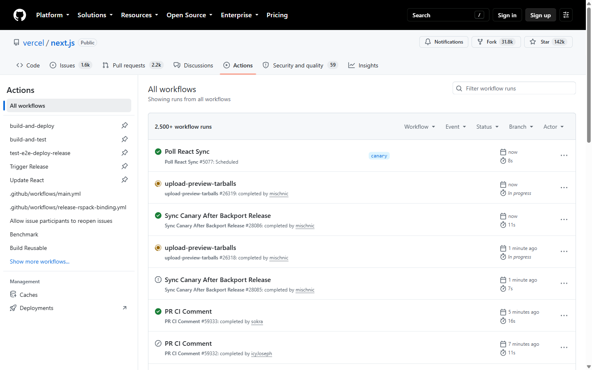
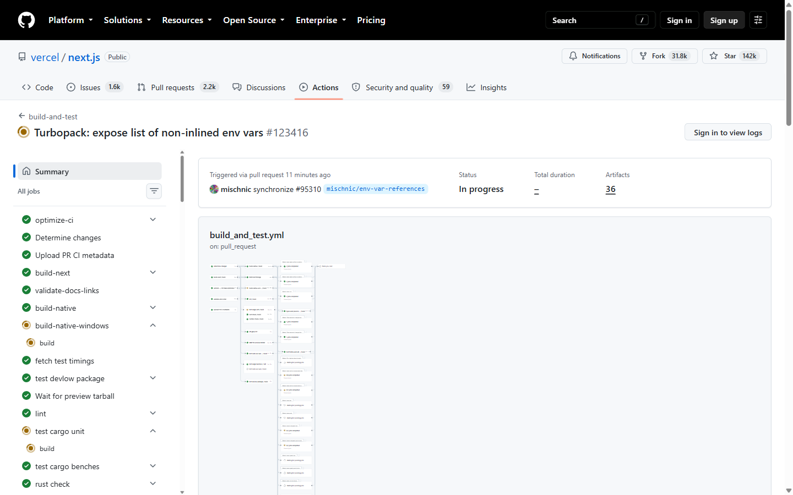
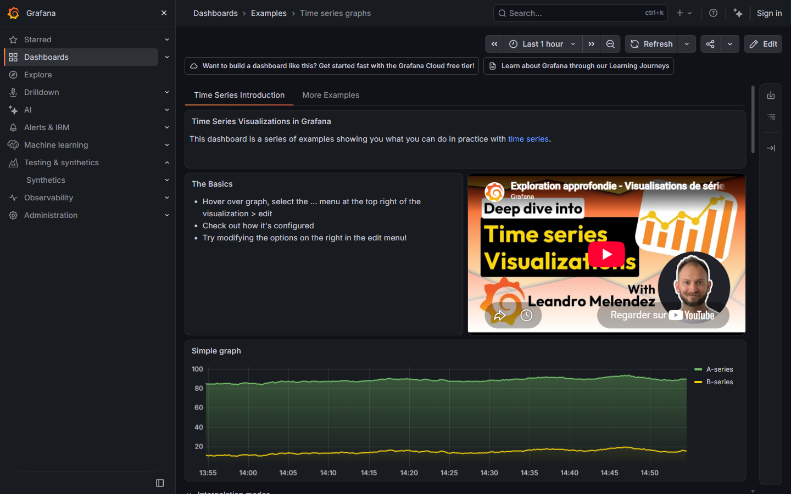
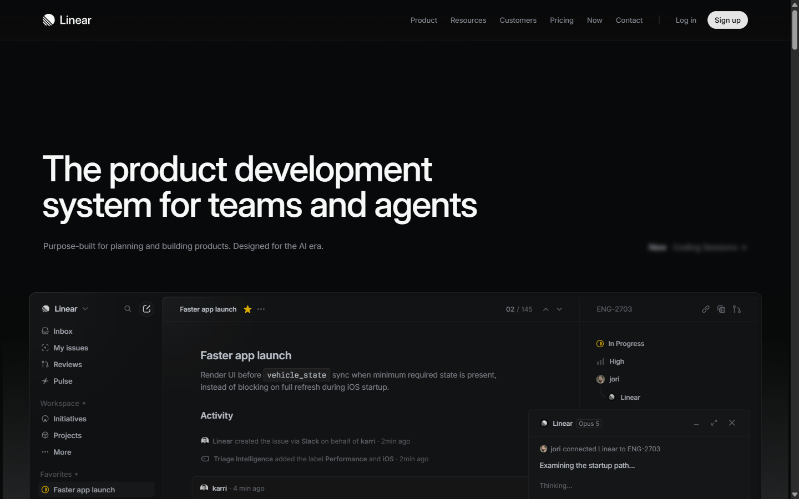
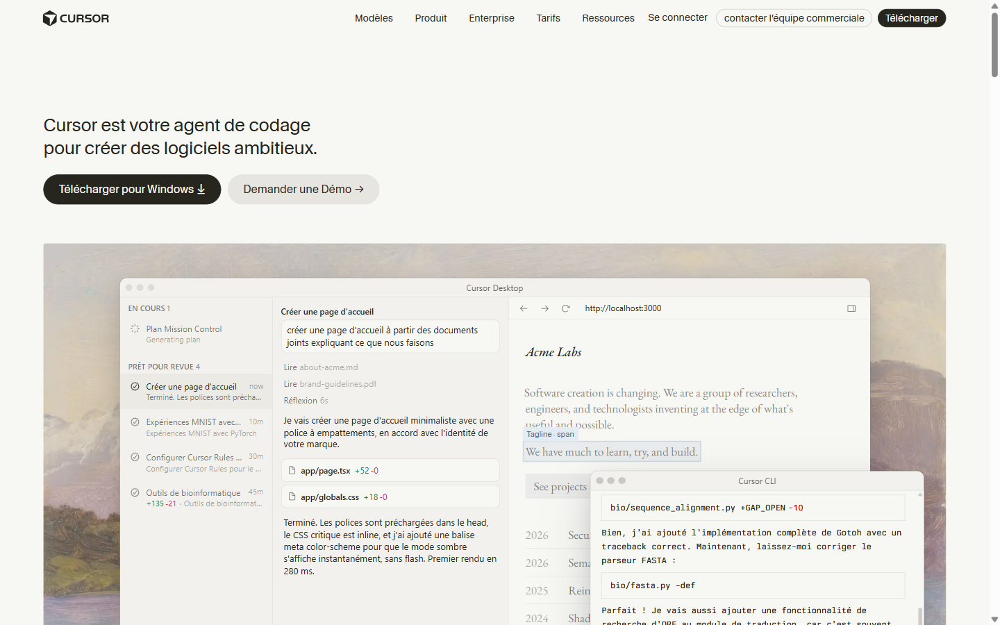

# 30 — La cible visuelle de la Control Tower, et l'outillage qui la tient

> Version 0.1 — recherche du ticket **#471**, mesures du **2026-08-25**.
> **Cette note ne modifie aucun écran.** Elle rend une recommandation instruite et le découpage
> qui en découle. Toute retouche visuelle sort de son périmètre.

Origine : la revue d'usage du 2026-08-05 relevait un rendu « brouillon » qui revient écran après
écran — c'est ce qui a lancé la vague « Control Tower v3 » et son premier lot, le langage visuel
(#245, [docs/06 §Vague front](./06-roadmap.md)). Un an de lots plus tard la demande revient plus
large : non plus « harmoniser ce qu'on a » mais **aller chercher un niveau**, et le tenir **partout
de la même façon**.

**Tout ce qui est chiffré ici a été mesuré**, pas estimé : les comptages viennent de `ripgrep` sur
le dépôt, les contrastes d'une sonde jouée dans un vrai navigateur sur la stack montée en local, et
les verdicts d'outillage d'appels réels dont la réponse est citée. Là où une mesure n'a pas pu être
prise, c'est écrit.

---

## 0. Ce que la recherche a renversé

Trois prémisses du ticket sont **fausses**, et la recommandation en dépend :

| Prémisse #471 | Ce que la mesure dit |
|---|---|
| « `/figma-code-connect` … exactement la mécanique du même niveau partout » | **Code Connect est refusé sur ce compte.** Réponse du serveur : *« You need a Dev or Full seat on an Organization or Enterprise plan to use Code Connect. »* Le plan est `starter`, le siège `View`. |
| « Skill `design` — canvas multi-artboards » | **Ce skill n'existe pas**, ni dans `.claude/skills/`, ni dans les skills de la session. |
| « le tableau de bord … six panneaux : briefs, validations, runs interrompus, indicateurs, **Kanban**, activité » | Le **nombre** est bon, la **liste** non : le Kanban a quitté le tableau de bord il y a moins de 48 h (#476, commit `93a8099`), remplacé par `EtatDesRuns`. `Kanban.tsx` n'est plus importé par aucun fichier de `app/`. |

Et une quatrième, qui n'était pas dans le ticket mais qui commande le chantier : **le sujet n'est
pas l'esthétique**. Les captures de §1 le montrent — la Control Tower n'est pas laide. Elle est
**plate** : tout y a le même poids. Le défaut mesurable n'est pas un manque de goût, c'est un
manque de **hiérarchie** et un **socle non tenu** (§2).

---

## 1. Banc de références

Quatre produits comparables, **capturés en direct le 2026-08-25** dans un vrai navigateur — aucune
image marketing, aucune description de seconde main.

⚠ **Deux candidats ont été écartés faute de preuve** : **Temporal** (l'orchestrateur le plus proche
fonctionnellement) et **Langfuse** (déjà dans la stack Maestro) n'exposent aucune UI publique
capturable — `cloud.langfuse.com` redirige vers l'authentification, `temporal.io/product` ne publie
aucune capture de son interface. Les citer sur mémoire aurait été précisément le « listé de
confiance » que le ticket refuse.

### 1.1 GitHub Actions — la liste de runs

C'est **le pendant exact de `/runs`**, et le plus instructif du banc parce que c'est l'outil que le
projet utilise déjà.

**Ce qu'on lui prend :**
- **L'état porte une forme, pas seulement une couleur** — ✓ plein, ◉ cerclé, ⊘ barré, ! triangle.
  Un daltonien lit la liste. Nos `BadgeEtat` se distinguent aujourd'hui par la **teinte seule**.
- **Le rythme à deux lignes** : titre en gras, puis une ligne grise qui porte *tout* le reste
  (workflow, numéro, auteur). Aucun bloc, aucune bordure entre les runs — la séparation est un
  simple filet et de l'espace.
- **Les métadonnées vont à droite, alignées en colonnes** (déclenchement, durée). L'œil descend une
  colonne au lieu de relire chaque ligne.
- **Les filtres sont une barre d'en-tête de liste**, pas un panneau.

**Ce qu'on lui laisse :** le double niveau de navigation (nav du dépôt + nav des workflows) — nous
avons déjà une barre latérale, en ajouter une seconde rejouerait la densité que #191 a retirée.

### 1.2 GitHub Actions — le détail d'un run

Le pendant de **`VuePipeline`** (978 lignes, notre plus gros composant).

**Ce qu'on lui prend :**
- **L'en-tête de run est une ligne de faits**, pas des cartes : `Déclenché par … · Statut · Durée ·
  Artefacts`. Quatre libellés gris, quatre valeurs sous eux. Nous en faisons des `TuileChiffre`.
- **La liste des jobs à gauche est la table des matières et la barre de progression à la fois** —
  un seul objet répond à « où en est-on ? » et « où aller ? ».
- **Le graphe est offert, pas imposé** : il est *sous* le résumé. Notre onglet Pipeline ouvre
  d'emblée sur le graphe.

**Ce qu'on lui laisse :** le graphe illisible à cette taille (visible sur la capture) — la preuve
qu'un DAG de plus de ~20 nœuds n'est pas une vue de premier niveau.

### 1.3 Grafana — la densité de données

**Ce qu'on lui prend :**
- **La hiérarchie typographique est franche** : titre de page à ~30 px contre un corps à 14 px.
  Notre plus grand titre courant est à **16 px** (`text-titre`… qui n'est employé **nulle part**),
  et 268 usages du produit tiennent sur **un seul pas** (0,75 rem).
- **Le panneau est l'unité de composition** : un titre, un corps, une bordure discrète, la même
  partout. C'est ce que `Carte` veut être et que 18 recopies contournent (§2.2).
- **La barre d'actions est contextuelle au contenu** (plage de temps, rafraîchir, partager), placée
  au-dessus du contenu et non dans le châssis global.

**Ce qu'on lui laisse :** la barre latérale à 10 entrées dépliables et la densité de chrome — c'est
un outil d'exploration, la Control Tower est un poste de surveillance.

### 1.4 Linear — la sobriété, et l'agent comme citoyen

**Ce qu'on lui prend :**
- **Trois colonnes à rôles fixes** : navigation / contenu / propriétés. Les métadonnées d'un objet
  vivent dans une colonne dédiée, jamais mêlées au contenu. C'est la réponse structurelle à notre
  problème de sobriété (§4) : *un écran ne grossit pas, sa colonne de propriétés s'allonge*.
- **Le panneau d'agent est flottant et rétractable**, avec son modèle affiché (`Opus 5`) et son état
  en clair (« Thinking… »). Notre `AssistantFlottant` a la bonne forme — il lui manque de dire quel
  modèle répond et ce qu'il fait.
- **Le contraste est assumé** : texte quasi blanc sur fond quasi noir, gris réservé au secondaire.

**Ce qu'on lui laisse :** la typographie de marque à 64 px (c'est une page d'accueil) et le parti
pris tout-sombre — nous devons tenir **deux** thèmes.

### 1.5 Cursor — la file de travaux d'agents

La référence la plus directe pour ce que Maestro **est** : plusieurs agents qui travaillent, dont
on suit l'avancement.

**Ce qu'on lui prend :**
- **La file est groupée par état d'attente humaine** : « EN COURS 1 » / « **PRÊT POUR REVUE 4** ».
  Le second groupe est un appel à l'action, pas un statut. C'est exactement notre file de
  validations — mais chez nous elle est un panneau du tableau de bord, pas la colonne de gauche.
- **Chaque ligne porte son coût** : durée (`10m`, `45m`) et **delta de lignes** (`+135 -21`). Deux
  chiffres qui disent l'ampleur d'un travail sans l'ouvrir.
- **L'état de l'agent est une phrase**, pas un badge : « Terminé. Les polices sont préchargées… ».

**Ce qu'on lui laisse :** l'esthétique de marque (fond crème, image d'illustration) et la fenêtre
CLI superposée.

### 1.6 Ce que le banc dit, en une ligne

Les quatre convergent sur trois choses que nous n'avons pas : **une hiérarchie typographique
franche**, **l'état porté par la forme autant que par la couleur**, et **une place fixe pour les
métadonnées** au lieu de blocs qui s'ajoutent.

Aucun des quatre ne doit son niveau à une identité graphique forte. **Il n'y a pas de style à aller
chercher** — il y a un socle à tenir.

---

## 2. L'état actuel, mesuré

### 2.1 Ce qui est déjà bon, et qu'il ne faut pas défaire

Le socle de #245 **existe et tient** :

| Mesure | Valeur |
|---|---|
| `aria-label` | **104** occurrences sur **48** fichiers — le nommage est fait, et bien fait |
| Icônes | **665 lignes** dans `Icones.tsx`, toutes en `currentColor`, toutes `aria-hidden` |
| Rôles ARIA | **44** occurrences, 12 valeurs distinctes, toutes correctes |
| `<h1>` par écran | **1**, sur les **10** écrans mesurés, **0 saut de niveau** |
| Échappement du focus | `Escape` **géré dans les 7** surfaces flottantes (3 modales, 4 menus) |
| Restauration du focus | **7/7** — y compris déléguée à l'appelant pour `PanneauDetailTache` |
| Tests | **583 cas** sur 31 fichiers, dont `socle-visuel.test.tsx` qui garde les deux thèmes |

**Le travail d'accessibilité déjà fait est sérieux.** Ce qui manque n'est pas de la rigueur, c'est
un **filet** : rien ne garde ces acquis, et le trou est ailleurs (§3).

### 2.2 Le socle est contourné plus souvent qu'il n'est utilisé

`Primitives.tsx` exporte 6 briques, importées par 30 fichiers. Mais :

| Rôle | Primitive | Contournement mesuré |
|---|---|---|
| Carte | `Carte` (4 tons × 4 densités) | **18 recopies** littérales de `rounded-lg border border-neutral-200 bg-white` dans **12 fichiers** |
| Bouton | **aucune** | **92 `<button>`** dans **36 fichiers** ; **26 fichiers** redéfinissent leur bouton plein |
| Modale | **aucune** | 3 surfaces flottantes refaites à la main |
| Champ | **aucune** | `app/journal/page.tsx` déclare ses propres `CLASSE_CHAMP` / `CLASSE_LIBELLE` |

**Il n'y a ni `components/ui/` ni `components/common/`** — les 61 composants sont rangés par domaine
métier. La primitive manquante la plus coûteuse est le **bouton** : c'est elle qui porte le
contraste fautif de §3.2, dans 26 endroits à corriger un par un.

### 2.3 La dispersion visuelle, en nombres

| Propriété | Variantes distinctes | Détail |
|---|---|---|
| Rayon | **5** | `rounded-md` 99 · `rounded-full` 38 · `rounded-lg` 27 · `rounded-t-md` 2 · `rounded-xl` 1 |
| Ombre | **6** | `shadow-sm` 28 · `shadow-lg` 5 · `shadow-2xl` 3 · `shadow` 3 · `shadow-md` 1 · 1 en ligne |
| Padding de conteneur | **8** | `p-4` 14 · `p-3` 13 · `p-2` 9 · `p-1.5` 3 · `p-1` 2 · `p-2.5` · `p-5` · `p-0.5` |
| Padding de contrôle | **8 paires** | `px-3 py-1.5` 44 · `px-3 py-2` 31 · `px-2 py-1` 15 · … |
| Taille de police | **13** | 6 Tailwind (255) + 4 tokens (176) + 3 valeurs arbitraires (8) |

`Carte` impose `rounded-lg` — c'est le **3ᵉ** rayon par fréquence, employé 3,7 × moins que
`rounded-md`. Elle nomme 3 densités : **5 des 8 paddings sont hors barème**.

**Le pire est la typographie** : trois tailles sont rendues par **deux classes chacune** —
`text-xs` (158) *et* `text-annexe` (110) valent 0,75 rem ; `text-sm` (90) *et* `text-corps` (50)
valent 0,875 rem. Et `text-titre` (1 rem), déclaré, n'est employé **nulle part**. D'où le rendu
plat du §1.3 : **408 des 439 usages typographiques (93 %) tiennent sur deux pas** — 0,75 rem et
0,875 rem —, sans titre intermédiaire.

### 2.4 Les couleurs ne sont pas tokenisées

**1 750 occurrences** de classes Tailwind brutes ; **0 occurrence** de classe sémantique
(`bg-surface`, `text-muted`…). Les deux seuls tokens de couleur (`--background`, `--foreground`) ne
sont consommés que par la règle `body`.

Conséquence directe : **542 lignes portant un `dark:`** sur 59 fichiers — chaque couleur est écrite
deux fois, à la main, partout où la primitive n'est pas utilisée. **C'est le multiplicateur de coût
de toute la refonte** : changer une couleur, aujourd'hui, c'est éditer deux valeurs dans N fichiers.

---

## 3. Cible d'accessibilité

### 3.1 Méthode

Une sonde a été écrite et jouée **dans le navigateur, sur la stack montée en local** (mode démo,
ports 8071/3071), sur **10 écrans × 2 thèmes**. Elle calcule le contraste par **lecture de pixel sur
un canvas** — Tailwind v4 émet ses couleurs en `oklch()`, qu'aucun parseur `rgb()` naïf ne lit ; une
première version a rendu des ratios faux, corrigée avant d'être exploitée. Chaque classe est
**validée contre un témoin** avant d'être comptée : trois classes (`text-neutral-300`,
`text-sky-600`, `bg-neutral-800`) **n'existent pas nues dans le CSS généré** (elles ne sont écrites
qu'en variante `dark:`) et sont déclarées non mesurables plutôt que comptées à tort.

### 3.2 Contraste — 10 paires fautives sur 19 mesurées

| Paire | Ratio | AA texte (4,5) | Poids dans le code |
|---|---:|:---:|---|
| `text-neutral-400` / `bg-neutral-100` | **2,37** | ✗ | — |
| `text-neutral-400` / `bg-neutral-50` | **2,48** | ✗ | — |
| **`text-neutral-400` / `bg-white`** | **2,58** | ✗ | **230 occurrences — la classe n°1 du produit** |
| `text-neutral-600` / fond sombre `#0a0a0a` | **2,53** | ✗ | libellés de la barre latérale, **tous les écrans** |
| `text-white` / `bg-amber-600` | **3,20** | ✗ | bouton « attention » |
| **`text-white` / `bg-emerald-600`** | **3,65** | ✗ | **bouton d'action primaire, 18 fichiers** |
| `text-neutral-500` / `bg-neutral-900` | **3,78** | ✗ | secondaire en thème sombre |
| `text-white` / `bg-sky-600` | **4,02** | ✗ | bouton « info » |
| `text-neutral-500` / `bg-neutral-100` | **4,35** | ✗ | secondaire sur fond gris |
| `text-rose-600` / `bg-white` | 4,53 | ✓ *de justesse* | erreurs |

Les seules paires confortables sont `neutral-600/700/900` sur clair et `neutral-100` sur sombre.

**Trois faits à retenir :**
1. `text-neutral-400` **échoue même le seuil 3:1** — celui du texte *large*. C'est la couleur de
   texte la plus employée du produit.
2. Le **bouton d'action primaire** échoue dans les **deux** thèmes (3,65 des deux côtés).
3. En thème sombre, le **libellé de navigation** est à 2,53 — présent sur chaque écran.

⚠ Ces chiffres sont un **plancher** : les écrans étaient peu peuplés (le scénario de démo n'est pas
rattaché à un projet), donc une partie du texte `neutral-400`/`500` n'était pas rendue.

### 3.3 Le trou principal : `aria-live` = 0 sur les 10 écrans

Le ticket annonçait « 1 ». La mesure sur écran est **plus dure** : l'unique `aria-live` du dépôt est
dans `AssistantFlottant.tsx:170`, sur le fil de l'assistant — **il n'est déployé sur aucun écran au
repos**. Résultat : **0 région live sur les 10 écrans mesurés, dans les deux thèmes.**

Or la Control Tower reçoit ses mises à jour **sans action de l'utilisateur** : jusqu'à **3
WebSockets simultanées** sur `/couts`, coalescées à 150 ms, plus une horloge à 30 s qui rafraîchit
tous les horodatages relatifs. Les tâches changent de colonne, les coûts montent, les validations
arrivent — **rien n'est annoncé**. Aucun `aria-label`, si soigné soit-il, ne compense ça.

### 3.4 Le reste

| Point | Mesure | Verdict |
|---|---|---|
| `prefers-reduced-motion` / `motion-reduce` | **0 / 0** pour 19 lignes de `transition`/`duration` et 4 `animate-pulse` | à corriger, coût faible |
| Piège de focus | **0** — la chaîne `"Tab"` n'apparaît **nulle part** dans `apps/web` | 3 modales sans piège |
| Navigation au clavier dans les menus | **0** `ArrowUp`/`ArrowDown`/`Home`/`End` dans les 4 menus ; `aria-activedescendant` : 0 | 4 menus non conformes au motif `menu` qu'ils déclarent |
| Lien d'évitement | **0** | 10 entrées de nav à traverser sur chaque écran |
| Motif onglets ARIA | **0** `role="tab"` — les 4 barres d'onglets sont des `<nav>` de liens | acceptable (ce sont de vraies navigations), à assumer par écrit |
| Infobulles | `title=` natif, **42 occurrences / 23 fichiers** ; `role="tooltip"` : 0 | inaccessible au clavier et au tactile |
| Cibles < 24 px (WCAG 2.2, 2.5.8) | quelques liens de renvoi à **22 px** de haut | écart de 2 px, correction triviale |
| Lint `jsx-a11y` | **6 règles sur ~36, toutes en `warn`** — celles de `next/core-web-vitals`, jamais le preset `recommended` | ne garde presque rien |
| Test a11y automatisé | **0** — `axe-core` 4.12.1 est présent **en transitif** (via `eslint-plugin-jsx-a11y`) mais **jamais importé** | le filet manque |
| Dépendance a11y (Radix, Headless UI, react-aria) | **aucune** | chaque piège est à réimplémenter |

### 3.5 La cible, chiffrée et datée

**Niveau visé : WCAG 2.2 niveau AA sur les 10 écrans**, sauf deux exemptions nommées.

| Critère | Aujourd'hui | Cible | Comment on le garde |
|---|---|---|---|
| Contraste texte (1.4.3) | **10 paires fautives / 19** | **0**, mesuré dans les 2 thèmes | test `contraste.test.ts` sur la palette |
| Contraste UI (1.4.11) | non mesuré | ≥ 3:1 bordures et états | idem |
| Annonces temps réel (4.1.3) | **0 région live** | **1 région `polite` par écran temps réel** + `assertive` pour les demandes d'arbitrage | test rendu |
| Mouvement (2.3.3) | **0** garde | `motion-reduce:` sur les 19 transitions et 4 animations | règle de lint |
| Piège de focus (2.1.2) | **0/3 modales** | **3/3** | test clavier |
| Menus au clavier (ARIA APG) | **0/4** | **4/4** flèches + `Home`/`End` | test clavier |
| Cibles (2.5.8) | quelques 22 px | **≥ 24 px** partout | sonde de mise en page |
| Lint | 6 règles en `warn` | **`plugin:jsx-a11y/recommended` en `error`** | CI |
| Audit automatisé | aucun | **`vitest-axe` sur les 10 écrans, 0 violation `serious`/`critical`** | job `web-build` |

**Deux exemptions assumées, à écrire dans la note plutôt qu'à découvrir plus tard :**
1. **Le graphe de pipeline** (`VuePipeline`) n'est pas rendu accessible nœud à nœud ; il porte une
   **alternative textuelle équivalente** (la vue Kanban et le journal du run donnent la même
   information). Reproduire un DAG au lecteur d'écran n'a pas de motif ARIA établi.
2. **Le niveau AAA n'est pas visé.** Le contraste 7:1 imposerait `neutral-700` minimum pour tout
   texte secondaire et supprimerait la distinction primaire/secondaire dont la densité dépend.

⚠ **Elles vivent désormais aussi dans la doc du produit** (#539) —
[`apps/web/README.md` §« Le filet d'accessibilité »](../apps/web/README.md#le-filet-daccessibilité-537)
et [docs/05 §4](./05-interface-control-tower.md) —, et c'est le sens de « plutôt qu'à découvrir plus
tard » : une note de recherche se lit une fois, au moment de l'arbitrage. Une exemption qu'on ne
retrouve pas dans la doc du produit est une exemption que le prochain ticket prendra pour un oubli,
ou pour un défaut à corriger dans l'urgence d'une revue. Ni l'une ni l'autre n'est un blanc-seing
sur son voisinage : le graphe reste soumis au reste du filet, et « AAA non visé » ne dispense
d'**aucun** critère AA.

### 3.6 Trancher : primitives accessibles, ou checklist ?

Le ticket demande de trancher, et de chiffrer plutôt que de supposer.

**Recommandation : adopter une base de primitives accessibles, mais seulement pour les 3 motifs qui
échouent — modale, menu, infobulle. Pas de migration générale.**

Les faits qui portent la décision :

- **Ce qui est fait main marche déjà**, sauf trois motifs : `Escape` 7/7, restauration du focus 7/7,
  rôles corrects. Migrer l'ensemble détruirait du travail qui tient.
- **Ce qui échoue, échoue là où le motif ARIA est le plus dur** : piège de focus (0/3), navigation
  aux flèches (0/4), infobulle accessible (0). Ce sont exactement les trois que les bibliothèques
  résolvent, et les trois qu'on réimplémente mal.
- **Le coût de l'ajout est réel** : `apps/web` a **3 dépendances de production**. En ajouter est un
  choix, pas un détail — mais `@radix-ui/react-dialog` + `react-dropdown-menu` + `react-tooltip`
  pèsent ~30 ko et n'imposent **aucun style** (headless), donc n'entrent pas en conflit avec le
  socle #245.
- **L'alternative « checklist » a déjà été essayée et a échoué** : le dépôt a une doc de langage
  visuel détaillée (`apps/web/README.md`), et 18 recopies de carte et 26 boutons refaits sont passés
  quand même. Une checklist qu'aucune machine ne vérifie ne tient pas — c'est la leçon de #306.

Chiffrage : **3 composants à remplacer** (`PanneauDetailTache`, `GuidePriseEnMain`, les 4 menus qui
partagent un patron identique) — **1 session**, tests compris.

#### Révision du 2026-08-25 (#536) — la décision tient, la bibliothèque non

Le lot 4 a implémenté les trois motifs. **La moitié de cette recommandation a été suivie, l'autre
retournée**, et c'est la seconde qu'il faut lire ici :

- **Tenu : « primitives plutôt que checklist ».** C'était le fond de l'arbitrage, et il est acquis —
  trois primitives partagées ([`lib/usePiegeDeFocus.ts`](../apps/web/lib/usePiegeDeFocus.ts),
  [`lib/useSurfaceDeroulee.ts`](../apps/web/lib/useSurfaceDeroulee.ts),
  [`components/Infobulle.tsx`](../apps/web/components/Infobulle.tsx)) portent désormais ce que sept
  surfaces réimplémentaient chacune de son côté. Le hook de surface a remplacé **quatre copies du
  même bloc de dix-huit lignes** : c'est cette duplication, et non un oubli, qui expliquait que la
  navigation aux flèches manque aux quatre menus à la fois.
- **Retourné : Radix.** `@radix-ui/react-dialog` + `react-dropdown-menu` + `react-tooltip` n'ont pas
  été ajoutés, et `apps/web` tient toujours en **trois dépendances de production**.

Ce qui a fait changer d'avis est ce que cette recherche n'avait pas regardé : elle a **compté des
motifs** (occurrences de `"Tab"`, de `ArrowUp`, de `title=`) sans ouvrir les composants. Ouverts,
**trois des sept surfaces ne sont pas la forme que la bibliothèque sait servir** :

| Surface | Ce qu'elle est | Ce que Radix en aurait fait |
|---|---|---|
| `GuidePriseEnMain` | une **surbrillance** qui suit un élément de la page, mesurée en `requestAnimationFrame` et amenée à l'écran par `scrollIntoView` | `Dialog` modal monte `react-remove-scroll`, qui **verrouille le défilement du corps** — le mécanisme même de la visite |
| `CentreNotifications` | un **panneau** : sections, titres, listes, cartes à deux boutons d'arbitrage | `DropdownMenu` attend des `DropdownMenuItem` ; le panneau n'a aucune entrée de menu |
| `AssistantFlottant` | **non modal par conception** (aucune fermeture au clic extérieur, la page reste utilisable) | `Dialog` non modal n'apporte aucun piège de focus : la dépendance pour rien |

Restaient quatre surfaces où Radix tombait juste — mais pour elles, le portail et le DOM de la
bibliothèque réécrivaient **sept fichiers de tests** dans un lot dont les tests sont explicitement
différés (#537, #539). On aurait payé une dépendance et une suite à reprendre pour livrer sur 4/7 ce
qu'un hook partagé livre sur 7/7.

**Ce que la recommandation avait raison de refuser reste refusé.** L'objection à la checklist —
« une checklist qu'aucune machine ne vérifie ne tient pas » — ne visait pas l'absence de
bibliothèque mais la **recopie** : 18 cartes et 26 boutons refaits à la main. Une primitive partagée
la supprime exactement comme une bibliothèque le ferait, et l'audit `vitest-axe` du lot 5 (#537) est
la machine qui vérifie. Ce qui aurait rouvert le défaut serait de réécrire ces motifs surface par
surface — ce que ce lot a précisément fermé.

⚠ **Ne pas relire cette révision comme « pas de bibliothèque, jamais ».** Elle porte sur ces trois
motifs et sur ces sept surfaces, mesurés. Un besoin dont la forme correspond à ce qu'une
bibliothèque sert — un vrai `DropdownMenu`, un positionnement flottant à collisions — se rejugera
sur ses propres faits.

---

## 4. Critère de sobriété opposable

Le ticket demande une règle **opposable à un ticket futur**, pas un principe. La voici.

### 4.1 La règle des trois places

> **Tout ce qu'un écran affiche occupe l'une de trois places, et une seule.**
>
> 1. **Le bandeau de tête** — au plus **4 chiffres**, et rien d'autre. Un chiffre y entre seulement
>    s'il change la décision de l'utilisateur *dans la minute*.
> 2. **Le corps** — au plus **3 blocs de plein format**, plus les blocs d'**arbitrage** (ceux qui
>    demandent une décision humaine), qui ne comptent pas dans le plafond **et disparaissent quand
>    la file est vide**.
> 3. **La colonne de propriétés** — tout le reste : métadonnées, réglages, historique, liens. Elle
>    s'allonge sans plafond, parce qu'elle défile et ne dispute rien au corps.
>
> **Ce qui ne tient dans aucune des trois n'est pas un bloc : c'est une ligne avec un renvoi**, vers
> l'écran dont c'est le sujet.

### 4.2 Pourquoi elle est opposable

Elle se vérifie **par un comptage**, donc par un test — pas par un jugement :

| Écran | Chiffres de tête | Blocs de corps | Verdict |
|---|---:|---:|---|
| Tableau de bord | 4 | **2** + 3 d'arbitrage | conforme |
| `/couts` | 4 | **5** | **dépasse de 2** |
| `/parametres` | 0 | **7 sections** | **dépasse de 4** |
| `/journal` | 0 | 3 | conforme |
| `/runs/[runId]` | 0 | 2 + onglets | conforme |

Le tableau de bord est **déjà conforme** — c'est l'acquis de #191 qu'il fallait protéger, et #476
n'y a pas touché. Les deux dépassements sont `/couts` et `/parametres`, tous deux écrans
d'exploration : la règle leur donne une réponse (une colonne de propriétés, ou un second niveau)
plutôt qu'un interdit.

#### Le comptage est passé à la machine (#539, 2026-08-26)

Le tableau ci-dessus est celui de la recherche, compté **à la main** sur le code du 2026-08-25 ;
il vaut désormais comme état de départ, pas comme mesure courante. Celle-ci vit dans
[`apps/web/tests/sobriete.test.tsx`](../apps/web/tests/sobriete.test.tsx), qui monte les dix écrans
du menu et échoue au-delà du plafond — c'est ce qui rend la règle opposable à un ticket futur, et
le tableau ci-dessus ne l'était pas : personne ne recompte une doc.

Les deux dépassements sont **résorbés** (docs/05 §2.5 pour `/couts`, `apps/web/README.md` pour la
règle appliquée) : `/couts` tient en 3 blocs — la répartition par agent passée en colonne de
propriétés, les deux tables réunies sous un second niveau — et `/parametres` en 3 familles, dont
les sept sections deviennent les sous-parties.

⚠ **Un chiffre du tableau était faux, et c'est la mesure automatique qui l'a montré** : `/journal`
compte **2** blocs de corps et non 3 — les filtres et le fil. Le troisième était le paragraphe
d'introduction de la page, une `Carte balise="p"` : une carte, pas un bloc de plein format. L'écart
ne changeait aucun verdict, mais il dit ce que vaut un comptage manuel — et c'est exactement le
reproche que ce ticket fait au §5 de docs/05 (le « piège de fraîcheur » de #476).

Trois écarts entre ce que la règle **dit** et ce que le test **compte**, tranchés en l'écrivant :

- **la balise fait foi.** Un bloc est une `<section>`, la colonne de propriétés un `<aside>`, un
  chiffre de tête une `TuileChiffre` (`data-chiffre`, posé sur la primitive). Une `<nav>` n'occupe
  aucune place : le filtre de période de `/couts`, le sommaire de `/parametres` et la bascule de
  vues d'un run règlent l'écran ou y naviguent ;
- **l'arbitrage n'est pas déclaré, il est prouvé.** Chaque écran est monté **deux fois** — files
  pleines, puis files vides — et ce qui survit aux deux est ce que le plafond compte. Un bloc qui
  prétendrait arbitrer sans disparaître compte comme les autres, sans que personne ait à le classer ;
- **il n'y a qu'une colonne de propriétés par écran.** La troisième place étant la seule sans
  plafond, elle serait sinon la sortie de secours des deux autres : emballer chaque bloc dans son
  `<aside>` rendrait n'importe quel écran conforme sans rien épurer.

### 4.3 Ce qu'elle répond au prochain ticket

- « Ajouter un panneau X au tableau de bord » → **le corps est plein**. Soit X remplace un bloc
  existant, soit X est un bloc d'arbitrage (et disparaît à vide), soit X est **une ligne + un
  renvoi**. La question n'est plus « est-ce utile ? » (ça l'est toujours) mais « **quelle place ?** ».
- « Ajouter un 5ᵉ indicateur » → **non**, sauf à en retirer un. Quatre est un plafond, pas une cible.
- « Ce réglage doit être visible » → colonne de propriétés.

C'est la formulation qui manquait à #191 : il a **épuré une fois** sans laisser de règle, et six
mois plus tard le compte était refait. La règle ne dit pas « moins », elle dit **où**.

---

## 5. Inventaire de l'outillage — éprouvé

Chaque ligne a été **appelée**. La réponse est citée.

| Outil | Éprouvé comment | Verdict |
|---|---|---|
| **MCP `figma-officiel`** | `whoami` → `handle: maestro`, plan **starter**, siège **View**. `create_new_file` → **201, fichier créé** | **Écriture opérationnelle.** Design-to-code et code-to-design ponctuels : oui |
| **Figma — Code Connect** | `list_file_components_for_code_connect` → **refus** : *« You need a Dev or Full seat on an Organization or Enterprise plan »* | **INDISPONIBLE.** La mécanique « design system relié au code » du ticket ne peut pas être achetée avec ce plan |
| **Figma — bibliothèques d'équipe** | `get_libraries` → 8 bibliothèques, **toutes `source: community`** (Material 3, Simple Design System, Apple) ; `libraries_available_to_add` : **liste vide** | **Aucune bibliothèque d'organisation publiable.** Un design system Figma partagé n'est pas tenable ici |
| **MCP `chrome-maestro`** | navigation, `resize`, `evaluate`, `take_screenshot`, `close` — **tous joués**, 5 captures produites | **Opérationnel.** C'est le pilier de l'outillage |
| **`mcp__chrome` (DevTools, `lighthouse_audit`)** | appel → **refusé** : non déclaré dans `.mcp.json`, absent de l'allowlist | **Hors de portée d'une session autonome.** Le seul audit a11y clé en main du poste est inutilisable telle quelle |
| **Stack locale** | `start.sh --demo --no-browser` sur 8071/3071 → **prête**, puis `--stop` → arrêtée | **Opérationnel** |
| **`curl`** | appel → **refusé par l'allowlist** | Toute interrogation d'API passe par `browser_evaluate` |
| **Skill `banc-mise-en-page`** | lu intégralement (238 l. + sonde 198 l.), non rejoué ici | **Le garde-fou de la refonte.** Mesure ce qu'aucun autre outil ne voit : géométrie, débordements, inatteignables. **Ne voit ni couleur, ni contraste, ni ARIA** |
| **Skill `verify`** | lu (117 l.) | Câblage temps réel. Ne regarde ni la géométrie ni le style |
| **Vitest + jsdom** | 583 cas / 31 fichiers | Logique et rendu. **Ne calcule aucune mise en page** ; `socle-visuel.test.tsx` garde les thèmes mais **aucune valeur** de rayon/ombre/couleur, volontairement |
| **`scripts/presentation/captures.sh`** | lu ; **non rejoué** | ⚠ **Défaut probable relevé** : il pose `maestro.theme` mais **jamais `maestro.projet.actif`** — or depuis #279 aucun écran n'est atteint sans projet actif, et le mode démo n'en déclare aucun. **Les captures de présentation tombent vraisemblablement toutes sur la porte d'entrée.** Confirmé indirectement : la stack montée ici, sans projet, n'affichait que `PosteVide`. Sa `MENU_REPLI` est en outre périmée (`/catalogue`, `/playbooks`) |
| **Skill `dataviz`** | **non lisible** — `~/.claude/skills/` est hors des répertoires autorisés | Connu par sa description seule. Utile pour `/couts`, à éprouver au lot concerné |
| **Skill `design`** | **n'existe pas** | Prémisse du ticket, corrigée |

### 5.1 Lequel tient la promesse « le même niveau partout » ?

**Aucun outil de maquette ne la tient. Seul un test la tient.**

C'est le renversement principal de cette recherche. Le ticket cherchait l'outillage du côté de Figma
— or Figma est ici **amputé de la seule fonction qui relierait la maquette au code** (Code Connect,
refusé) et **ne peut pas publier de bibliothèque partagée** (plan starter). Un fichier Figma resterait
donc ce que le ticket redoute lui-même : *« une image dans trois mois »*.

Ce qui tient un niveau sur tous les écrans, dans ce dépôt, c'est ce qui **échoue la CI quand il
n'est pas tenu**. Le dépôt le sait déjà — c'est toute la leçon de #306 (« la suite verte ne prouve
rien sur la mise en page »), qui a produit `banc-mise-en-page` plutôt qu'une consigne.

**La chaîne recommandée, du plus contraignant au moins :**

1. **Les tokens** (source unique en CSS) — ce qui n'est pas dans la palette n'existe pas.
2. **Les primitives** (bouton, champ, modale, menu) — ce qui n'est pas une primitive se voit.
3. **Les tests** : contraste sur la palette, `vitest-axe` sur les 10 écrans, lint `jsx-a11y` en
   `error`, comptage de sobriété. **C'est la seule couche qui refuse un merge.**
4. **`banc-mise-en-page`** au moment des lots de mise en page.
5. **Figma**, en appoint : explorer une direction sur 2-3 écrans avant de coder. **Jamais comme
   source de vérité** — le lien mécanique vers le code n'existe pas sur ce plan.

#### Le maillon 0, ajouté le 2026-08-28 (#708) — `/design-veille`

Cette chaîne est complète pour **garder**, et muette sur ce qu'on **vise**. C'est le trou que ce
§5.1 laissait : les cinq maillons répondent à « est-ce que ça tient ? », aucun à « à quoi devrait
ressembler cette surface ? ». La seule réponse jamais donnée est le **banc du §1** — dressé une
fois, le 2026-08-25, en prose, et rejouable par personne. Six mois plus tard, une demande arrivant
sur une surface (« revois le design de la carte d'un run ») n'avait rien entre le goût du moment et
la réécriture d'une note de recherche.

**`/design-veille <surface>`** est ce geste-là, à l'échelle d'une surface : références cherchées sur
le web et **vérifiées en direct**, prendre / laisser référence par référence, confrontation au
socle, puis **3 à 5 partis pris**. Il vient **avant** les cinq maillons ci-dessus — il ne contraint
rien, donc il ne s'insère pas dans leur ordre : il est ce qu'ils gardent.

Trois choses qu'il reprend de cette note et qu'il ne faut pas défaire :

- **ce qui n'est pas vérifié n'est pas cité** — la règle qui a fait écarter Temporal et Langfuse au
  §1, les deux références fonctionnellement les plus proches, plutôt que de les décrire de mémoire ;
- **le socle se relève avant la recherche**, jamais après : relevé après, il n'est plus une
  contrainte mais un filtre appliqué à des idées auxquelles on s'est déjà attaché ;
- **aucune identité nouvelle** (§6.1) — « il n'y a pas de style à aller chercher, il y a un socle à
  tenir » (§1.6) reste le verdict du banc, et la veille ne le rouvre pas surface par surface.

Il ne rejoue aucun des cinq : ni contraste, ni géométrie, ni accessibilité. Il n'écrit ni code ni
forge — il rend une décision et propose de la consigner sur le ticket.

---

### 5.2 Le maillon 0 se déclenche, le 2026-08-28 (#714)

Livré, `/design-veille` **n'était appelé par rien**. Aucun prompt de `/ticket-start`,
`/ticket-ship` ou `/orchestrate` ne le nommait : son déclencheur était une phrase de `CLAUDE.md`
que la session est censée lire et appliquer. Ça marche — la veille a été jouée sur #709 sans qu'on
la demande — mais c'est une **règle lue**, jamais un mécanisme, et c'est exactement le défaut que
le §3.6 nomme pour écarter la checklist : *« une checklist qu'aucune machine ne vérifie ne tient
pas »*. Le dépôt avait déjà une doc de langage visuel détaillée, et 18 recopies de carte sont
passées par-dessus. Une commande que personne n'appelle est du même bois.

**Ce qui est automatique est la détection du manque, jamais le verdict** — même partage que #562 et
#612. Lancer la veille d'office serait le mauvais calcul évident : elle coûte des recherches web,
des captures et du quota, et la jouer sur un correctif de hook serait du gaspillage pur. Le
mécanisme est donc en trois pièces :

| pièce | rôle |
|---|---|
| `lib.sh touche-surface <iid>` | **lit** — `0` touche (à proposer) · `4` touche mais déjà arbitré · `3` aucune surface |
| `start-brief` (donc `/ticket-start`) | **propose**, sur la vue du ticket qu'il vient de lire — zéro aller de forge en plus |
| `lib.sh veille-arbitre <iid>` | **enregistre** la réponse — veille faite **ou** jugée inutile |

L'enregistrement est repris mot pour mot de `lot::arbitre` (#562), sa raison comprise : le label
`veille::arbitree` est posé **quel que soit le verdict**, parce que sans lui « une veille est
inutile ici » est **inexprimable** et que la question reviendrait à chaque démarrage, jusqu'à ce
qu'on cesse de la lire — le défaut symétrique de celui qu'on corrige. **Un seul label et pas
deux** : une veille faite laisse ses partis pris en commentaire du ticket, donc le label dit que la
question a été posée et le commentaire dit la réponse. Deux labels seraient deux supports pour un
seul fait, c'est-à-dire la panne que #365 a supprimée sur le cycle de vie.

#### Le motif, mesuré avant d'être figé

Vérité terrain : les **fichiers des commits** (technique de #544, rejouée par #612) — a touché une
surface visible tout ticket dont un commit de `origin/main` a modifié `apps/web/{app,components}/**`
ou `globals.css`. Mesure du 2026-08-28 sur les **155 tickets ayant des commits**, dont **33** ont
touché la surface :

| variante | VP | FP | FN | précision | rappel |
|---|---:|---:|---:|---:|---:|
| titre seul — `apps/web/` | 0 | 0 | 33 | — | 0 % |
| `apps/web/` partout | 12 | 7 | 21 | 63 % | 36 % |
| `apps/web/{app,components}/` partout | 6 | 1 | 27 | 86 % | 18 % |
| vocabulaire (écran, interface, visuel…) | 30 | 43 | 3 | 41 % | **91 %** |
| `agent::design` seul | 15 | 2 | 18 | **88 %** | 45 % |
| route nommée seule | 14 | 3 | 19 | 82 % | 42 % |
| **`agent::design` OU route nommée** *(retenu)* | 21 | 5 | 12 | 81 % | 64 % |

**Trois évidences sont tombées, et aucune par principe :**

1. **Le chemin** — l'analogie directe de `.claude/` (#612) — ne marche pas ici : 36 % de rappel, et
   surtout il **n'ajoute rien** au motif retenu, « label OU route OU chemin » rendant le verdict
   *identique* (21/5/12). Tout ticket nommant `apps/web/{app,components}/` porte déjà le label ou
   une route : il est absorbé, donc absent du motif — une clause qui ne change aucun verdict est
   une clause qu'on croira lire le jour où elle comptera.
2. **Le vocabulaire de la surface** a le meilleur rappel de tous, **91 %**, et c'est ce qui le
   disqualifie : il parle sur **249 des 562 tickets** du dépôt (44 %). Un signalement qui se
   déclenche partout n'est plus lu, et le remède serait pire que le mal.
3. **L'héritage du parent**, que #617 a établi pour le **rail** (8 lots sur 8 cohérents),
   **dégrade** le motif ici : 81 %/64 % → 61 %/70 %. Mesuré, pas supposé — sur les 17 chantiers à
   au moins deux lots, **7 sont panachés** (#244, #347, #472, #481, #488, #532, #573). Le rail est
   une propriété du **chantier** ; la surface visible est une propriété du **lot**, un même
   chantier mêlant un lot d'UI, un lot de moteur et un lot « tests + doc ». C'est aussi pourquoi la
   proposition ne se fait **pas sur un parent de suivi** : `/ticket-start` y redirige vers un lot,
   et la question se posera sur la surface que quelqu'un s'apprête réellement à retoucher.

**Ce qu'il rate est nommé plutôt que découvert plus tard** — 12 des 33, et ils ont tous la même
forme : #271, #349, #477, #478, #479, #480, #486, #489, #537, #573, #580, #581 décrivent une
**fonctionnalité par son comportement** (« mettre un run en pause », « le fil accepte fichiers et
images »), dont l'écran est la conséquence et jamais le sujet. C'est le symétrique exact du trou de
#612, dont les critères « parlent du comportement et jamais du fichier ». Aucun motif textuel ne
les attrapera : ce verbe réduit la **fréquence** de la surface retouchée sans référence, il ne la
supprime pas — et la règle lue de `CLAUDE.md` reste **derrière** lui, elle n'est pas remplacée.
C'est aussi pourquoi `veille-arbitre` **n'exige pas** que le motif ait parlé : refuser
d'enregistrer un arbitrage rendu sur l'un de ces douze traiterait le trou connu du motif comme une
erreur de l'utilisateur.

**Les 81 % sont un plancher**, pour la raison de #612 : 2 des 5 faux positifs (#471, #708) sont des
tickets de conception qui n'ont produit **que de la doc** — le signalement y était juste, et il
compte ici comme une erreur. Reste **un seul faux positif franc sur 26** (#544, l'outillage de
présentation).

La **liste des routes** est celle de `apps/web/app/`, et `tests/test_design_veille.py` la compare
aux répertoires réels : une liste recopiée à la main dérive au premier écran ajouté, et c'est
précisément ce que ce ticket corrige ailleurs.

#### L'accès web d'une session de run : tranché

**La veille est un geste interactif.** `WebSearch` et `WebFetch` restent **hors des deux
allowlists** — ni `scripts/orchestrate/settings.run.json`, ni `.claude/settings.json`, dont
l'`allow` d'un run est l'**union** (docs/10 §11.7). Trois raisons, dont une seule est technique :

- une session de run **n'a personne** pour répondre au « oui » que la proposition attend ; l'ouvrir
  reviendrait à lancer la veille d'office, ce que ce ticket exclut nommément ;
- une veille rend des **partis pris**, c'est-à-dire un jugement — du même bois que l'arbitrage de
  #562 et le rail de #617, tous deux laissés à un humain ;
- `mcp__chrome-maestro` passe déjà cette union : ouvrir la seule **recherche** donnerait une veille
  **à moitié** — captures sans références vérifiées —, or la règle du §3 de la commande est que ce
  qui n'est pas vérifié n'est pas cité.

Le prompt de session de `run.sh` le dit donc en toutes lettres : ne pas tenter la veille, **ne pas
enregistrer d'arbitrage** (ce serait fermer la question sans que personne l'ait jugée — le
« marquer d'office » de #562), et **nommer le ticket dans le résumé final** comme en appelant une.
⚠ Le changement plausible n'est pas « ouvrir le web aux runs », que personne ne demandera, mais
« ouvrir `WebSearch` dans `.claude/settings.json` pour éviter une confirmation à chaque
`/design-veille` interactive » : geste légitime, effet non voulu — il ouvre le run du même coup.
`tests/test_design_veille.py` garde les deux fichiers pour cette raison-là. Une confirmation dans
une session interactive n'est pas un défaut : il y a quelqu'un pour la donner.

---

### 5.3 Veilles jouées

Le banc du §1 a été dressé **une fois**, en prose, et n'était rejouable par personne — c'est le
défaut que `/design-veille` corrige. Il serait absurde de le reproduire à l'échelle des surfaces :
les veilles jouées se consignent donc ici, datées, avec **ce qui a été vérifié** et **ce qui ne
l'a pas été**. Le détail vit sur le ticket ; cette table dit qu'elle a eu lieu et ce qu'elle a
tranché.

#### Le composeur de conversation — 2026-08-30 (#724, lot 1 de #722)

Surface : le `<form>` à quai de `Conversation.tsx` et `SourcesDuMessage.tsx`, montés par **deux**
écrans (`/chat` et l'onglet Chat d'une fiche agent). Décision complète en commentaire de **#722**.

**Vérifié en direct** (captures et mesures) : **ChatGPT** — contrôles *dans* le cadre en 44×44, `+`
à gauche ouvrant un menu, envoi à droite ; croissance mesurée **52 px au repos → 256 px à vingt
lignes**, `max-height: 192px` puis défilement interne. **Perplexity** — **deux étages dans un seul
cadre** : texte pleine largeur en haut, *tous* les contrôles sur un rail en bas (y=73).
**Zulip** (vue publique) — la barre porte **sa destination** en clair plutôt qu'un placeholder qui
s'efface.

**Non vérifié, donc non cité** : Slack et Linear (composeurs derrière authentification), GitHub
(« Sign in to comment », pourtant au banc du §1.1), le composeur *déployé* de Zulip. Aucun parti
pris ne s'appuie dessus — règle de #471.

**Quatre partis pris**, tranchant les quatre points que le ticket exigeait : un cadre à deux étages
*(place de l'envoi)* · un bouton unique en tête de rail ouvrant les trois gestes existants
*(pièces jointes)* · croissance bornée puis défilement interne, la poignée `resize-y` disparaît
*(croissance)* · le raccourci clavier quitte le `placeholder` pour le rail *(raccourci)*.

**Refusés sur place, avec leur raison** : le rayon en gélule (28 px chez ChatGPT) — c'est une
identité, et la direction du §6.1 est « le même produit, avec du relief » ; les chips de mode et le
sélecteur de modèle de Perplexity — le §4 plafonne le corps, et `PARLER À` fait déjà ce travail
dans la colonne ; le composeur replié de Zulip — un seul fil à l'écran, replier coûterait un clic
pour rien.

**Un manque du socle, pas un refus** → **#832**. `CadreChamp` rend *toujours* un libellé visible et
`Primitives.tsx` ne connaît pas `sr-only` : les **trois** composeurs du produit contournent donc la
primitive avec la même classe recopiée hors palette (`focus:border-emerald-500`), dont deux
identiques au mot près (`SourcesDuMessage.tsx:44`, `ComposerObjectif.tsx:62`). Le même refus sur
trois surfaces n'est plus un refus — c'est la mécanique du §2.2, prise à sa source.

---

## 6. Recommandation

### 6.1 Direction visuelle retenue — « le même produit, avec du relief »

**Pas de nouvelle identité.** Le socle #245 est bon et récent ; le refaire coûterait des sessions
pour un gain nul sur le problème mesuré. La direction est de **donner du relief à ce qui existe** :

1. **Une hiérarchie typographique à 5 pas réellement utilisés**, dont un **titre de page à 20-24 px**
   qui manque aujourd'hui (§2.3). Retirer les doublons `text-xs`/`text-annexe`.
2. **Une palette sémantique tokenisée** (`surface`, `bord`, `texte`, `texte-secondaire`, `accent`,
   4 tons d'état), **conforme AA par construction et dans les deux thèmes** — ce qui supprime du
   même geste les 542 `dark:` écrits à la main.
3. **L'état porté par forme + couleur**, jamais par la couleur seule (§1.1).
4. **Trois places, un plafond** (§4) — la sobriété devient structurelle.
5. **Un jeu de primitives complet** : le bouton, le champ, la modale et le menu qui manquent.

### 6.2 Outillage retenu

- **Retenu** : les tests comme garde-fou (contraste, `vitest-axe`, lint `jsx-a11y` en `error`),
  `banc-mise-en-page`, `chrome-maestro`, `@radix-ui` pour les 3 motifs qui échouent.
- **Écarté** : le design system Figma comme source — **Code Connect refusé, aucune bibliothèque
  d'organisation** (§5). Figma reste un outil d'exploration.
- ~~**À réparer** : `captures.sh` (projet actif manquant, §5).~~ **Réparé** (vérifié le 2026-08-26 au
  lot 7) : `captures.sh` déclare le projet de la démo dans un dépôt à lui, en **lisant** son
  identifiant dans `maestro/controltower/demo.py` plutôt qu'en le recopiant, et `captures.mjs` pose
  `maestro.projet.actif` dans le `localStorage` — les deux moitiés sont indissociables et présentes.
  Le lot 7 devait ouvrir un ticket « si quelqu'un le confirme » ; la confirmation a rendu l'inverse.

### 6.3 Découpage du chantier — parent + 7 lots, 7 sessions

Chaque lot est mergeable seul sur `main` sans casser l'existant. Les tests sont différés au lot
final **sauf** ceux qui *sont* le livrable du lot (lots 2 et 5).

| # | Lot | Sessions | Dépend de |
|---|---|---:|---|
| 1 | **Palette sémantique et échelle typographique** — tokens CSS, 5 pas, doublons retirés, aucun écran retouché | 1 | — |
| 2 | **Le test de contraste** — la palette du lot 1 vérifiée AA dans les 2 thèmes, en CI | 1 | 1 |
| 3 | **Primitives manquantes** — `Bouton`, `Champ`, + reprise des 18 recopies de carte *(parallèle)* | 1 | 1 |
| 4 | **Modale et menu accessibles** — piège de focus, flèches, infobulle sur 3 modales + 4 menus *(parallèle)* — livré par primitives du dépôt, sans Radix (voir la révision du 2026-08-25 en §3.6) | 1 | 1 |
| 5 | **Le filet a11y** — `vitest-axe` sur les 10 écrans, `jsx-a11y/recommended` en `error`, `motion-reduce`, lien d'évitement | 1 | 3, 4 |
| 6 | **Les régions live** — 1 `polite` par écran temps réel, `assertive` pour l'arbitrage, + le test qui les garde | 1 | 5 |
| 7 | **Les trois places** — application de la règle de sobriété à `/couts` et `/parametres`, + doc et tests du chantier | 1 | tous |

**Total : 7 sessions.** Les lots 3 et 4 sont marqués `(parallèle)` : ils ne se touchent pas.

⚠ **Le lot 7 a livré une chose que ce tableau ne prévoyait pas** : le comptage lui-même
(`apps/web/tests/sobriete.test.tsx`, §4.2). Le découpage l'appelait « doc et tests du chantier »,
c'est-à-dire une couverture de ce que les six autres lots avaient produit ; ce qui manquait
réellement était la **machine qui refuse un huitième bloc**. Sans elle, la règle du §4 aurait rejoint
la doc de langage visuel qui existait déjà, détaillée, et par-dessus laquelle 18 recopies de carte
sont passées (§3.6) : c'est le même défaut, un cran plus haut.

**L'ordre porte la décision** : les tokens d'abord (lot 1), leur test tout de suite (lot 2) — sans
quoi le lot 1 se défait au premier écran retouché. Le filet (lot 5) avant les régions live (lot 6),
parce qu'une région live sans test est exactement l'`aria-live` unique d'aujourd'hui : présente dans
le code, absente de l'écran.

**Ce qui n'est pas dans le chantier**, et c'est délibéré : aucune refonte d'écran, aucun changement
de navigation, aucune identité nouvelle. Le chantier rend le socle **tenu**. Ce qu'on en fait
ensuite est un autre sujet.

---

## 7. Ce qui n'a pas été vérifié

Par honnêteté de méthode :

- **Les captures de présentation** (`captures.sh`) : défaut déduit par lecture croisée, **non
  reproduit** — le script n'a pas été rejoué (il rebuild l'UI en production, plusieurs minutes).
- **Le contraste sur écrans peuplés** : le scénario de démo n'étant pas rattaché à un projet, les
  écrans mesurés étaient partiellement vides. Les chiffres de §3.2 sont un plancher.
- **Le skill `dataviz`** : non lisible depuis cette session.
- **Le coût de `@radix-ui`** en poids de bundle : estimé d'après la documentation des paquets, non
  mesuré par un build.
- **Un dossier a été créé hors du dépôt** pour la mesure — `E:/Projects Solutions/maestro-demo-471`,
  vide, supprimable sans conséquence. Le projet correspondant (`core/projets/prj-01fbb83e.json`) a,
  lui, été retiré.
